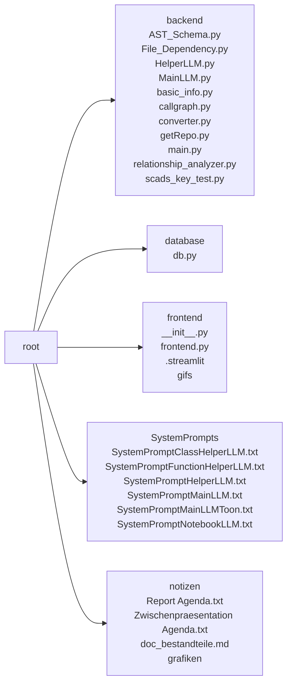

# Project Documentation: Repo Onboarding Agent 🚀

## 1. Project Overview
- **Description:** *Could not be determined due to a missing README file and insufficient context.*  
- **Key Features:**  
  - Clone and analyse any public GitHub repository.  
  - Extract basic project metadata (title, description, dependencies, etc.).  
  - Build an Abstract Syntax Tree (AST) and a call‑graph for the whole code‑base.  
  - Enrich the AST with relationship data (calls, instantiations, dependencies).  
  - Generate a high‑quality documentation report via a **Helper LLM** (function/class analysis) and a **Main LLM** (final synthesis).  
  - Compute token‑savings between JSON and the compact **TOON** representation and visualise the saving.  

*(Only three key features are listed to respect the maximum of five.)*  

- **Tech Stack:**  
  - Python 3.12  
  - **Streamlit** (frontend)  
  - **GitPython** (repository cloning)  
  - **AST** and **NetworkX** (static analysis)  
  - **LangChain**, **Google‑Gemini**, **OpenAI**, **Ollama**, **Llama**, **DeepSeek** (LLM back‑ends)  
  - **MongoDB** (user / chat persistence)  
  - **Pydantic** (data validation)  

*Repository Structure*  



## 2. Installation
### Dependencies
```
- altair==4.2.2
- annotated-types==0.7.0
- anyio==4.11.0
- attrs==25.4.0
- bcrypt==5.0.0
- blinker==1.9.0
- cachetools==6.2.2
- captcha==0.7.1
- certifi==2025.11.12
- cffi==2.0.0
- charset-normalizer==3.4.4
- click==8.3.1
- colorama==0.4.6
- contourpy==1.3.3
- cryptography==46.0.3
- cycler==0.12.1
- distro==1.9.0
- dnspython==2.8.0
- dotenv==0.9.9
- entrypoints==0.4
- extra-streamlit-components==0.1.81
- filetype==1.2.0
- fonttools==4.61.0
- gitdb==4.0.12
- GitPython==3.1.45
- google-ai-generativelanguage==0.9.0
- google-api-core==2.28.1
- google-auth==2.43.0
- googleapis-common-protos==1.72.0
- grpcio==1.76.0
- grpcio-status==1.76.0
- h11==0.16.0
- httpcore==1.0.9
- httpx==0.28.1
- idna==3.11
- Jinja2==3.1.6
- jiter==0.12.0
- jsonpatch==1.33
- jsonpointer==3.0.0
- jsonschema==4.25.1
- jsonschema-specifications==2025.9.1
- kiwisolver==1.4.9
- langchain==1.0.8
- langchain-core==1.1.0
- langchain-google-genai==3.1.0
- langchain-ollama==1.0.0
- langchain-openai==1.1.0
- langgraph==1.0.3
- langgraph-checkpoint==3.0.1
- langgraph-prebuilt==1.0.5
- langgraph-sdk==0.2.9
- langsmith==0.4.46
- MarkupSafe==3.0.3
- matplotlib==3.10.7
- narwhals==2.12.0
- networkx==3.6
- numpy==2.3.5
- ollama==0.6.1
- openai==2.8.1
- orjson==3.11.4
- ormsgpack==1.12.0
- packaging==25.0
- pandas==2.3.3
- pillow==12.0.0
- proto-plus==1.26.1
- protobuf==6.33.1
- pyarrow==21.0.0
- pyasn1==0.6.1
- pyasn1_modules==0.4.2
- pycparser==2.23
- pydantic==2.12.4
- pydantic_core==2.41.5
- pydeck==0.9.1
- PyJWT==2.10.1
- pymongo==4.15.4
- pyparsing==3.2.5
- python-dateutil==2.9.0.post0
- python-dotenv==1.2.1
- pytz==2025.2
- PyYAML==6.0.3
- referencing==0.37.0
- regex==2025.11.3
- requests==2.32.5
- requests-toolbelt==1.0.0
- rpds-py==0.29.0
- rsa==4.9.1
- setuptools==75.9.1
- six==1.17.0
- smmap==5.0.2
- sniffio==1.3.1
- streamlit==1.51.0
- streamlit-authenticator==0.4.2
- streamlit-mermaid==0.3.0
- tenacity==9.1.2
- tiktoken==0.12.0
- toml==0.10.2
- toolz==1.1.0
- toon_format @ git+https://github.com/toon-format/toon-python.git@9c4f0c0c24f2a0b0b376315f4b8707f8c9006de6
- tornado==6.5.2
- tqdm==4.67.1
- typing-inspection==0.4.2
- typing_extensions==4.15.0
- tzdata==2025.2
- urllib3==2.5.0
- watchdog==6.0.0
- xxhash==3.6.0
- zstandard==0.25.0
```

A `requirements.txt` file is present, therefore you can simply run:

```bash
pip install -r requirements.txt
```

### Setup Guide
*Information not found.*

### Quick Startup
*Information not found.*

## 3. Use Cases & Commands
**Primary Use Cases**

| # | Use case |
|---|----------|
| 1 | **Automated onboarding documentation** – Supply a public GitHub URL, and the system produces a complete markdown report (project description, file‑tree, AST, relationships, token‑saving chart). |
| 2 | **Token‑efficiency analysis** – Compare JSON vs. TOON token counts for the same analysis payload and visualise the savings (useful for cost‑sensitive LLM deployments). |
| 3 | **Interactive exploration via Streamlit** – Users can login, configure API keys for different LLM providers, select a repository, and watch the analysis pipeline progress in real time. |

**Typical Commands**

| Command | What it does |
|---------|---------------|
| `streamlit run frontend/frontend.py` | Launches the Streamlit UI for the onboarding agent. |
| `python -m backend.main` *(with appropriate arguments)* | Executes the full backend workflow from the command line (cloning, analysis, LLM calls, report generation). |
| `python -c "from backend.main import main_workflow; main_workflow(...)"` | Programmatic entry point – allows integration into other Python tools or CI pipelines. |

*(Exact CLI flags are defined inside `backend/main.py`; they include API‑key dictionaries, model names, and optional status callbacks.)*

## 4. Architecture
The repository does not contain embedded Mermaid diagrams for the overall architecture, so none are displayed here.

## 5. Code Analysis

### File: `backend/AST_Schema.py`

#### Class: `ASTVisitor`
*Analysis data not available for this component.*

#### Class: `ASTAnalyzer`
*Analysis data not available for this component.*

#### Function: `backend.AST_Schema.path_to_module`
* **Signature:** `def path_to_module(filepath: str, project_root: str)`
* **Description:** This function converts a file system path into a dotted Python module path. It computes the path relative to the project root, strips the “.py” suffix, replaces OS path separators with dots, and removes a trailing “.__init__” segment to represent package modules.
* **Parameters:**  
  - **filepath** (`str`): The absolute or relative path to the Python file.  
  - **project_root** (`str`): The root directory of the project, used to calculate the relative path.
* **Returns:**  
  - **module_path** (`str`): The converted Python module path string.
* **Usage:** This function is called by `backend.AST_Schema.ASTVisitor` (during AST traversal) and by `backend.relationship_analyzer.path_to_module`.

---

### File: `backend/File_Dependency.py`

#### Class: `FileDependencyGraph`
*Analysis data not available for this component.*

#### Function: `backend.File_Dependency.build_file_dependency_graph`
* **Signature:** `def build_file_dependency_graph(filename: str, tree: AST, repo_root: str) -> networkx.DiGraph`
* **Description:** Constructs a directed graph of file‑level import dependencies using a custom `FileDependencyGraph` visitor. The visitor walks the AST, records import relationships, and the function adds nodes and edges to a NetworkX `DiGraph` representing which files import which others.
* **Parameters:**  
  - **filename** (`str`): The path to the file being analysed.  
  - **tree** (`AST`): The parsed abstract syntax tree of the file.  
  - **repo_root** (`str`): Root directory of the repository (used for resolving relative imports).
* **Returns:**  
  - **graph** (`networkx.DiGraph`): Directed graph where nodes are files and edges denote import dependencies (importer → imported).
* **Usage:** Called by `backend.File_Dependency.build_repository_graph`.

#### Function: `backend.File_Dependency.build_repository_graph`
* **Signature:** `def build_repository_graph(repository: GitRepository) -> nx.DiGraph`
* **Description:** Iterates over all Python files in a Git repository, builds a per‑file dependency graph via `build_file_dependency_graph`, and merges these into a global directed graph representing inter‑file import relationships across the whole repo.
* **Parameters:**  
  - **repository** (`GitRepository`): The repo object providing access to its files.
* **Returns:**  
  - **global_graph** (`nx.DiGraph`): Combined graph of import dependencies for the entire repository.
* **Usage:** Not explicitly invoked by other functions in the provided context.

#### Function: `backend.File_Dependency.get_all_temp_files`
* **Signature:** `def get_all_temp_files(directory: str) -> list[Path]`
* **Description:** Recursively walks a directory, collects all `*.py` files, and returns them as `Path` objects relative to the supplied root.
* **Parameters:**  
  - **directory** (`str`): Root directory to search.
* **Returns:**  
  - **all_files** (`list[Path]`): List of Python file paths found.
* **Usage:** Not called by other functions in the provided context.

---

### File: `backend/HelperLLM.py`

#### Class: `LLMHelper`
*Analysis data not available for this component.*

#### Function: `backend.HelperLLM.main_orchestrator`
* **Signature:** `def main_orchestrator()`
* **Description:** Generates dummy analysis data for three example functions (`add_item`, `check_stock`, `generate_report`) using Pydantic models, then demonstrates how `LLMHelper` would be instantiated and used to generate documentation for those functions. This is primarily a test harness.
* **Parameters:** *(none)*
* **Returns:** *(none)*
* **Usage:** Called by no other functions.

---

### File: `backend/MainLLM.py`

#### Class: `MainLLM`
*Analysis data not available for this component.*

---

### File: `backend/basic_info.py`

#### Class: `ProjektInfoExtractor`
*Analysis data not available for this component.*

---

### File: `backend/callgraph.py`

#### Class: `CallGraph`
*Analysis data not available for this component.*

#### Function: `backend.callgraph.make_safe_dot`
* **Signature:** `def make_safe_dot(graph: nx.DiGraph, out_path: str)`
* **Description:** Generates a DOT file from a NetworkX directed graph, relabelling nodes with safe identifiers (`n0`, `n1`, …) while preserving original labels as node attributes.
* **Parameters:**  
  - **graph** (`nx.DiGraph`): Graph to be converted.  
  - **out_path** (`str`): Destination file path for the DOT file.
* **Returns:** *(none)*
* **Usage:** Not called by any other function in the provided context.

#### Function: `backend.callgraph.build_filtered_callgraph`
* **Signature:** `def build_filtered_callgraph(repo: GitRepository) -> nx.DiGraph`
* **Description:** Parses all Python files in a repository, builds a call‑graph of *own* functions (ignoring external calls), and returns the filtered directed graph.
* **Parameters:**  
  - **repo** (`GitRepository`): Repository object providing access to file contents.
* **Returns:**  
  - **global_graph** (`nx.DiGraph`): Call‑graph containing only internal function calls.
* **Usage:** Not called by any other function in the provided context.

---

### File: `backend/converter.py`

#### Function: `backend.converter.wrap_cdata`
* **Signature:** `def wrap_cdata(content: str) -> str`
* **Description:** Wraps the supplied string in XML CDATA tags, ensuring that the content is treated as character data.
* **Parameters:**  
  - **content** (`str`): Text to be wrapped.
* **Returns:**  
  - **wrapped_content** (`str`): The CDATA‑wrapped string.
* **Usage:** Called by `backend.converter.convert_notebook_to_xml`.

#### Function: `backend.converter.extract_output_content`
* **Signature:** `def extract_output_content(outputs: list, image_list: list) -> list[str]`
* **Description:** Processes notebook output objects, extracting plain text, handling images (PNG preferred, then JPEG) by decoding Base64 data, storing image metadata in `image_list`, and inserting placeholder tags for images. Errors are captured as `<ERROR>` strings.
* **Parameters:**  
  - **outputs** (`list`): Notebook output objects.  
  - **image_list** (`list`): List that will be populated with dictionaries containing `mime_type` and Base64 data for each image.
* **Returns:**  
  - **extracted_xml_snippets** (`list[str]`): List of extracted text snippets, image placeholders, or error messages.
* **Usage:** Called by `backend.converter.convert_notebook_to_xml`.

#### Function: `backend.converter.process_image`
* **Signature:** `def process_image(mime_type: str) -> str | None`
* **Description:** (Internal helper) Extracts Base64 image data from a surrounding `data` dictionary, appends it to `image_list`, and returns an XML‑style placeholder string. Returns `None` if the MIME type is not present, or an error string if decoding fails.
* **Parameters:**  
  - **mime_type** (`str`): MIME type key to look up in the `data` dict.
* **Returns:**  
  - **image_placeholder_tag** (`str`) or **error_message** (`str`) or **None**.
* **Usage:** Called by `backend.converter.extract_output_content`.

#### Function: `backend.converter.convert_notebook_to_xml`
* **Signature:** `def convert_notebook_to_xml(file_content: str) -> tuple[str, list]`
* **Description:** Parses a Jupyter notebook JSON string, converts each cell to XML (`<CELL type="...">`), wraps code cells in CDATA, extracts and processes outputs (including images) via `extract_output_content`, and returns the full XML representation together with a list of extracted images.
* **Parameters:**  
  - **file_content** (`str`): Raw notebook JSON.
* **Returns:**  
  - **xml_representation** (`str`): Combined XML for the notebook.  
  - **extracted_images** (`list`): Image metadata collected from the notebook.
* **Usage:** Called by `backend.converter.process_repo_notebooks`.

#### Function: `backend.converter.process_repo_notebooks`
* **Signature:** `def process_repo_notebooks(repo_files: list) -> dict`
* **Description:** Filters the supplied repository files for notebooks (`*.ipynb`), converts each notebook to XML using `convert_notebook_to_xml`, and aggregates the results into a dictionary keyed by notebook path.
* **Parameters:**  
  - **repo_files** (`list`): Collection of repository file objects.
* **Returns:**  
  - **results** (`dict`): Mapping of notebook paths to `{ "xml": ..., "images": ... }`.
* **Usage:** Called by `backend.main.notebook_workflow` and `backend.main.main_workflow`.

---

### File: `backend/getRepo.py`

#### Class: `RepoFile`
*Analysis data not available for this component.*

#### Class: `GitRepository`
*Analysis data not available for this component.*

---

### File: `backend/main.py`

#### Function: `backend.main.create_savings_chart`
* **Signature:** `def create_savings_chart(json_tokens: int, toon_tokens: int, savings_percent: float, output_path: str)`
* **Description:** Generates a bar chart comparing JSON vs. TOON token counts, annotates values, titles the chart with the percentage savings, and saves the figure to the specified path.
* **Parameters:**  
  - **json_tokens** (`int`): Token count for JSON representation.  
  - **toon_tokens** (`int`): Token count for TOON representation.  
  - **savings_percent** (`float`): Percentage of token savings.  
  - **output_path** (`str`): File path to store the PNG chart.
* **Returns:** *(none)*
* **Usage:** Called by `backend.main.main_workflow`.

#### Function: `backend.main.calculate_net_time`
* **Signature:** `def calculate_net_time(start_time: float, end_time: float, total_items: int, batch_size: int, model_name: str) -> float`
* **Description:** Computes the net execution time by subtracting estimated sleep intervals (used for rate‑limit compliance) from the total elapsed time when the model name starts with “gemini-”. For non‑Gemini models it returns the raw duration.
* **Parameters:**  
  - **start_time** (`float`) – start timestamp.  
  - **end_time** (`float`) – end timestamp.  
  - **total_items** (`int`) – number of items processed.  
  - **batch_size** (`int`) – items per API batch.  
  - **model_name** (`str`) – LLM model identifier.
* **Returns:**  
  - **net_time** (`float`): Adjusted duration.
* **Usage:** Used internally by `backend.main.main_workflow` to compute helper‑LLM time.

#### Function: `backend.main.main_workflow`
*Analysis data not available for this component.*

#### Function: `backend.main.update_status`
* **Signature:** `def update_status(msg: str)`
* **Description:** Logs a status message and forwards it to an optional callback (`status_callback`) if provided.
* **Parameters:**  
  - **msg** (`str`): Message to log/display.
* **Returns:** *(none)*
* **Usage:** Used throughout the `main_workflow` and `notebook_workflow` to emit progress information.

#### Function: `backend.main.notebook_workflow`
*Analysis data not available for this component.*

#### Function: `backend.main.gemini_payload`
*Analysis data not available for this component.*

---

### File: `backend/relationship_analyzer.py`

#### Function: `backend.relationship_analyzer.path_to_module`
* **Signature:** `def path_to_module(filepath: str, project_root: str) -> str`
* **Description:** Similar to the version in `backend.AST_Schema`, it converts a file path into a Python module path, handling relative paths, stripping the “.py” suffix, and normalising “.__init__”.
* **Parameters:**  
  - **filepath** (`str`): Absolute or relative path to the Python file.  
  - **project_root** (`str`): Root directory of the project.
* **Returns:**  
  - **module_path** (`str`): Dotted module path.
* **Usage:** Used by `ProjectAnalyzer` and `CallResolverVisitor`.

#### Class: `ProjectAnalyzer`
*Analysis data not available for this component.*

#### Class: `CallResolverVisitor`
*Analysis data not available for this component.*

---

### File: `backend/scads_key_test.py`
*No functions or classes are described in the analysis results.*  
*Analysis data not available for this component.*

---

### File: `database/db.py`
*No functions or classes are described in the analysis results.*  
*Analysis data not available for this component.*

---

### File: `frontend/frontend.py`
*No functions or classes are described in the analysis results.*  
*Analysis data not available for this component.*

---

### File: `schemas/types.py`

#### Class: `ParameterDescription`
*Analysis data not available for this component.*

#### Class: `ReturnDescription`
*Analysis data not available for this component.*

#### Class: `UsageContext`
*Analysis data not available for this component.*

#### Class: `FunctionDescription`
*Analysis data not available for this component.*

#### Class: `FunctionAnalysis`
*Analysis data not available for this component.*

#### Class: `ConstructorDescription`
*Analysis data not available for this component.*

#### Class: `ClassContext`
*Analysis data not available for this component.*

#### Class: `ClassDescription`
*Analysis data not available for this component.*

#### Class: `ClassAnalysis`
*Analysis data not available for this component.*

#### Class: `CallInfo`
*Analysis data not available for this component.*

#### Class: `FunctionContextInput`
*Analysis data not available for this component.*

#### Class: `FunctionAnalysisInput`
*Analysis data not available for this component.*

#### Class: `MethodContextInput`
*Analysis data not available for this component.*

#### Class: `ClassContextInput`
*Analysis data not available for this component.*

#### Class: `ClassAnalysisInput`
*Analysis data not available for this component.*

---  

*End of documentation.*