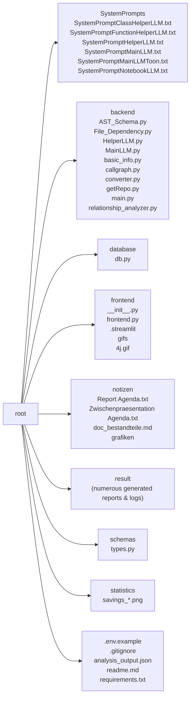

# Project Documentation: Repo Onboarding Agent 🚀

## 1. Project Overview
- **Description:**  
  *[Could not be determined due to a missing README file and insufficient context.]*  

- **Key Features:**  
  *(No features could be extracted from the available metadata.)*  

- **Tech Stack:**  
  *(No explicit technology list could be extracted.)*  

*Repository Structure:*


---

## 2. Installation
### Dependencies
- `altair==4.2.2`
- `annotated-types==0.7.0`
- `anyio==4.11.0`
- `attrs==25.4.0`
- `bcrypt==5.0.0`
- `blinker==1.9.0`
- `cachetools==6.2.2`
- `captcha==0.7.1`
- `certifi==2025.11.12`
- `cffi==2.0.0`
- `charset-normalizer==3.4.4`
- `click==8.3.1`
- `colorama==0.4.6`
- `contourpy==1.3.3`
- `cryptography==46.0.3`
- `cycler==0.12.1`
- `distro==1.9.0`
- `dnspython==2.8.0`
- `dotenv==0.9.9`
- `entrypoints==0.4`
- `extra-streamlit-components==0.1.81`
- `filetype==1.2.0`
- `fonttools==4.61.0`
- `gitdb==4.0.12`
- `GitPython==3.1.45`
- `google-ai-generativelanguage==0.9.0`
- `google-api-core==2.28.1`
- `google-auth==2.43.0`
- `googleapis-common-protos==1.72.0`
- `grpcio==1.76.0`
- `grpcio-status==1.76.0`
- `h11==0.16.0`
- `httpcore==1.0.9`
- `httpx==0.28.1`
- `idna==3.11`
- `Jinja2==3.1.6`
- `jiter==0.12.0`
- `jsonpatch==1.33`
- `jsonpointer==3.0.0`
- `jsonschema==4.25.1`
- `jsonschema-specifications==2025.9.1`
- `kiwisolver==1.4.9`
- `langchain==1.0.8`
- `langchain-core==1.1.0`
- `langchain-google-genai==3.1.0`
- `langchain-ollama==1.0.0`
- `langchain-openai==1.1.0`
- `langgraph==1.0.3`
- `langgraph-checkpoint==3.0.1`
- `langgraph-prebuilt==1.0.5`
- `langgraph-sdk==0.2.9`
- `langsmith==0.4.46`
- `MarkupSafe==3.0.3`
- `matplotlib==3.10.7`
- `narwhals==2.12.0`
- `networkx==3.6`
- `numpy==2.3.5`
- `ollama==0.6.1`
- `openai==2.8.1`
- `orjson==3.11.4`
- `ormsgpack==1.12.0`
- `packaging==25.0`
- `pandas==2.3.3`
- `pillow==12.0.0`
- `proto-plus==1.26.1`
- `protobuf==6.33.1`
- `pyarrow==21.0.0`
- `pyasn1==0.6.1`
- `pyasn1_modules==0.4.2`
- `pycparser==2.23`
- `pydantic==2.12.4`
- `pydantic_core==2.41.5`
- `pydeck==0.9.1`
- `PyJWT==2.10.1`
- `pymongo==4.15.4`
- `pyparsing==3.2.5`
- `python-dateutil==2.9.0.post0`
- `python-dotenv==1.2.1`
- `pytz==2025.2`
- `PyYAML==6.0.3`
- `referencing==0.37.0`
- `regex==2025.11.3`
- `requests==2.32.5`
- `requests-toolbelt==1.0.0`
- `rpds-py==0.29.0`
- `rsa==4.9.1`
- `setuptools==75.9.1`
- `six==1.17.0`
- `smmap==5.0.2`
- `sniffio==1.3.1`
- `streamlit==1.51.0`
- `streamlit-authenticator==0.4.2`
- `streamlit-mermaid==0.3.0`
- `tenacity==9.1.2`
- `tiktoken==0.12.0`
- `toml==0.10.2`
- `toolz==1.1.0`
- `toon_format @ git+https://github.com/toon-format/toon-python.git@9c4f0c0c24f2a0b0b376315f4b8707f8c9006de6`
- `tornado==6.5.2`
- `tqdm==4.67.1`
- `typing-inspection==0.4.2`
- `typing_extensions==4.15.0`
- `tzdata==2025.2`
- `urllib3==2.5.0`
- `watchdog==6.0.0`
- `xxhash==3.6.0`
- `zstandard==0.25.0`
- `nbformat` (required for notebook conversion)

*Since a `requirements.txt` file is present, you can install all dependencies with:*

```bash
pip install -r requirements.txt
```

### Setup Guide
*No explicit setup instructions were found in the repository.*

### Quick Startup
*No quick‑start guide was found in the repository.*

---

## 3. Use Cases & Commands
The **Repo Onboarding Agent** is built to automate the analysis and documentation of arbitrary GitHub repositories. Typical usage scenarios include:

| Use Case | Description |
|----------|-------------|
| **Repository introspection** | Extract basic project metadata (title, description, tech‑stack, dependencies) from `README`, `pyproject.toml`, and `requirements.txt`. |
| **AST generation** | Build an abstract‑syntax‑tree schema for every Python file, capturing imports, functions, classes, and their signatures. |
| **Call‑graph analysis** | Produce filtered call graphs that only contain internal project calls, useful for understanding code flow. |
| **File‑dependency graph** | Visualise import relationships between Python modules across the repository. |
| **LLM‑driven documentation** | Send the collected AST and relationship data to a **Helper LLM** (e.g., Gemini or Ollama) to generate detailed function/class documentation, then synthesize a final report with the **Main LLM**. |
| **Jupyter notebook conversion** | Convert notebooks (`*.ipynb`) to an intermediate XML representation and let the LLM produce markdown reports for each notebook. |
| **Token‑savings analysis** | Compare JSON vs. TOON token usage and generate a bar‑chart visualising the savings. |

**Typical command‑line style invocations (illustrative):**
```bash
python -m backend.main "https://github.com/user/example-repo" \
    --api-keys '{"gemini":"<key>", "gpt":"<key>", "scadsllm":"<key>", "ollama":"http://localhost:11434"}' \
    --models '{"helper":"gpt-5-mini", "main":"gpt-5.1"}'
```

For notebook‑only processing:
```bash
python -m backend.main --notebook-workflow "https://github.com/user/example-repo" \
    --model "gemini-1.5-pro"
```

---

## 4. Architecture
*No Mermaid diagram was supplied in the source data.*

---

## 5. Code Analysis

### File: `backend/AST_Schema.py`

#### Function: `path_to_module`
* **Signature:** `def path_to_module(filepath, project_root)`
* **Description:**  
  Converts a file system path into a Python module path. Handles relative paths, strips the `.py` extension, replaces path separators with dots, and removes the `.__init__` suffix for package `__init__` files.
* **Parameters:**
  - **filepath** (`str`): The absolute or relative path to the Python file.
  - **project_root** (`str`): The root directory of the project, used to calculate the relative path.
* **Returns:**
  - **module_path** (`str`): The converted Python module path string.
* **Usage:**  
  Calls: *None*  
  Called by: *Not explicitly referenced in the supplied context.*

#### Class: `ASTVisitor`
*Analysis data not available for this component.*

#### Class: `ASTAnalyzer`
*Analysis data not available for this component.*

---

### File: `backend/File_Dependency.py`

#### Function: `build_file_dependency_graph`
* **Signature:** `def build_file_dependency_graph(filename, tree, repo_root)`
* **Description:**  
  Constructs a directed graph (`networkx.DiGraph`) representing file‑level import dependencies within a given AST. Uses `FileDependencyGraph` to walk the tree, records import relationships, and creates edges from importers to imported modules/files.
* **Parameters:**
  - **filename** (`str`): Path of the file being analyzed.
  - **tree** (`AST`): AST of the file.
  - **repo_root** (`str`): Repository root directory.
* **Returns:**
  - **graph** (`networkx.DiGraph`): Directed graph where nodes are files and edges denote import dependencies.
* **Usage:**  
  Calls: `backend.File_Dependency.FileDependencyGraph`  
  Called by: *Not explicitly referenced.*

#### Function: `build_repository_graph`
* **Signature:** `def build_repository_graph(repository)`
* **Description:**  
  Builds a global directed graph of Python file dependencies across an entire repository. Iterates over all `.py` files, builds per‑file graphs via `build_file_dependency_graph`, and merges them into one comprehensive graph.
* **Parameters:**
  - **repository** (`GitRepository`): Repository object.
* **Returns:**
  - **global_graph** (`nx.DiGraph`): Global dependency graph for the repository.
* **Usage:**  
  Calls: `backend.File_Dependency.build_file_dependency_graph`  
  Called by: *Not explicitly referenced.*

#### Function: `get_all_temp_files`
* **Signature:** `def get_all_temp_files(directory)`
* **Description:**  
  Recursively finds all Python files under the given directory, returning a list of `Path` objects relative to the directory.
* **Parameters:**
  - **directory** (`str`): Root directory to search.
* **Returns:**
  - **all_files** (`list[Path]`): List of `Path` objects for each discovered `.py` file.
* **Usage:**  
  Calls: *None*  
  Called by: *Not explicitly referenced.*

#### Class: `FileDependencyGraph`
*Analysis data not available for this component.*

---

### File: `backend/HelperLLM.py`

#### Function: `main_orchestrator`
* **Signature:** `def main_orchestrator()`
* **Description:**  
  Dummy driver that creates pre‑computed `FunctionAnalysisInput` objects for sample functions (`add_item`, `check_stock`, `generate_report`) and a `ClassAnalysisInput` for an `InventoryManager` class. It then instantiates `LLMHelper` and generates documentation for the supplied functions and class via the helper LLM.
* **Parameters:** *None*
* **Returns:** *None*
* **Usage:**  
  Calls: `backend.HelperLLM.LLMHelper`, `schemas.types.ClassAnalysisInput`, `schemas.types.ClassContextInput`  
  Called by: *Not referenced elsewhere.*

#### Class: `LLMHelper`
* **Overall:** Centralises interaction with various LLM providers (Gemini, OpenAI, custom SCADSLLM, Ollama). Loads system prompts for function and class analysis, configures batch sizes per model, and provides `generate_for_functions` and `generate_for_classes` which batch‑process inputs and return structured `FunctionAnalysis` or `ClassAnalysis` objects.
* **Methods:**
  - `_configure_batch_settings(model_name)`: Sets `self.batch_size` based on model.
  - `generate_for_functions(function_inputs)`: Sends batches of function inputs to the LLM, returns list of `FunctionAnalysis` (or `None` on failure).
  - `generate_for_classes(class_inputs)`: Sends batches of class inputs to the LLM, returns list of `ClassAnalysis` (or `None` on failure).
* **Usage:**  
  Calls: *None* (internal LLM calls handled via `self.function_llm` / `self.class_llm`).  
  Called by: `backend.main.main_workflow`.

---

### File: `backend/MainLLM.py`

#### Class: `MainLLM`
* **Overall:** Provides a thin wrapper around a chosen LLM (Gemini, OpenAI, custom API, or Ollama). Loads a system prompt, then offers `call_llm` (single‑response) and `stream_llm` (streamed response) methods.
* **Methods:**
  - `call_llm(user_input)`: Sends a prompt and returns the full response content.
  - `stream_llm(user_input)`: Streams response chunks.
* **Usage:**  
  Calls: *None* (direct LLM client calls).  
  Called by: `backend.main.main_workflow`, `backend.main.notebook_workflow`.

---

### File: `backend/basic_info.py`

#### Class: `ProjektInfoExtractor`
* **Overall:** Extracts basic project metadata from common files (`README`, `pyproject.toml`, `requirements.txt`). Handles cleaning, pattern matching, and fallback title derivation from repository URL.
* **Methods:**  
  - `_clean_content`, `_finde_datei`, `_extrahiere_sektion_aus_markdown`, `_parse_readme`, `_parse_toml`, `_parse_requirements`, `extrahiere_info`.
* **Usage:**  
  Calls: *None* (internal helpers).  
  Called by: `backend.main.main_workflow`, `backend.main.notebook_workflow`.

---

### File: `backend/callgraph.py`

#### Function: `make_safe_dot`
* **Signature:** `def make_safe_dot(graph, out_path)`
* **Description:**  
  Creates a DOT file from a NetworkX directed graph, relabeling nodes to safe identifiers (`n0`, `n1`, …) while preserving original labels.
* **Parameters:**
  - **graph** (`nx.DiGraph`): Graph to convert.
  - **out_path** (`str`): Destination file path.
* **Returns:** *None*
* **Usage:**  
  Calls: *None*  
  Called by: *Not explicitly referenced.*

#### Function: `build_filtered_callgraph`
* **Signature:** `def build_filtered_callgraph(repo)`
* **Description:**  
  Generates a call graph limited to functions defined within the repository. Parses each Python file, collects its own functions, then adds edges only when both caller and callee are internal.
* **Parameters:**
  - **repo** (`GitRepository`): Repository to analyse.
* **Returns:**
  - **global_graph** (`nx.DiGraph`): Internal call graph.
* **Usage:**  
  Calls: `backend.callgraph.CallGraph`  
  Called by: *Not explicitly referenced.*

#### Class: `CallGraph`
*Analysis data not available for this component.*

---

### File: `backend/converter.py`

#### Function: `wrap_cdata`
* **Signature:** `def wrap_cdata(content)`
* **Description:**  
  Wraps the supplied string in XML CDATA tags.
* **Parameters:**
  - **content** (`str`): Text to wrap.
* **Returns:**
  - **wrapped_content** (`str`): CDATA‑wrapped string.
* **Usage:**  
  Calls: *None*  
  Called by: `convert_notebook_to_xml`.

#### Function: `extract_output_content`
* **Signature:** `def extract_output_content(outputs, image_list)`
* **Description:**  
  Parses notebook output objects, extracting text, handling images (PNG > JPEG), storing Base64 image data in `image_list`, and returning a list of text snippets or image placeholders.
* **Parameters:**
  - **outputs** (`list`): Notebook cell outputs.
  - **image_list** (`list`): List that will receive image dicts (`mime_type`, `data`).
* **Returns:**
  - **extracted_xml_snippets** (`list[str]`): Text snippets / placeholders.
* **Usage:**  
  Calls: `process_image` (internal helper)  
  Called by: `convert_notebook_to_xml`.

#### Function: `process_image`
* **Signature:** `def process_image(mime_type)`
* **Description:**  
  Processes a single image MIME type: extracts Base64 data from external `data` dict, appends to `image_list`, and returns a placeholder tag. Returns `None` if MIME not present; returns error string on exception.
* **Parameters:**
  - **mime_type** (`str`): MIME type of the image.
* **Returns:**  
  - Image placeholder tag (`str`) **or** error message (`str`) **or** `None`.
* **Usage:**  
  Calls: *None*  
  Called by: `extract_output_content`.

#### Function: `convert_notebook_to_xml`
* **Signature:** `def convert_notebook_to_xml(file_content)`
* **Description:**  
  Parses a Jupyter notebook (JSON) and converts it to an XML‑like representation: markdown cells become `<CELL type="markdown">`, code cells become `<CELL type="code">` with CDATA, and outputs become `<CELL type="output">` with CDATA. Images are extracted via `extract_output_content`.
* **Parameters:**
  - **file_content** (`str`): Raw notebook JSON.
* **Returns:**
  - **xml_representation** (`str`): Combined XML string (or error message).
  - **extracted_images** (`list`): List of image dicts.
* **Usage:**  
  Calls: `extract_output_content`, `wrap_cdata`  
  Called by: `process_repo_notebooks`.

#### Function: `process_repo_notebooks`
* **Signature:** `def process_repo_notebooks(repo_files)`
* **Description:**  
  Filters repository files for notebooks (`*.ipynb`), converts each to XML via `convert_notebook_to_xml`, and aggregates results into a dict keyed by notebook path.
* **Parameters:**
  - **repo_files** (`list`): Iterable of file objects (`path`, `content`).
* **Returns:**
  - **results** (`dict`): `{ notebook_path: { "xml": ..., "images": [...] } }`
* **Usage:**  
  Calls: `convert_notebook_to_xml`  
  Called by: `backend.main.notebook_workflow`.

---

### File: `backend/getRepo.py`

#### Class: `RepoFile`
*Analysis data not available for this component.*

#### Class: `GitRepository`
*Analysis data not available for this component.*

---

### File: `backend/main.py`

#### Function: `create_savings_chart`
* **Signature:** `def create_savings_chart(json_tokens, toon_tokens, savings_percent, output_path)`
* **Description:**  
  Generates a bar chart comparing JSON vs. TOON token counts, annotates the chart with token values, adds a title showing the percentage saved, and saves the image.
* **Parameters:**
  - **json_tokens** (`int`): Token count for JSON.
  - **toon_tokens** (`int`): Token count for TOON.
  - **savings_percent** (`float`): Savings percentage.
  - **output_path** (`str`): File path for the saved chart.
* **Returns:** *None*
* **Usage:**  
  Calls: *None*  
  Called by: `main_workflow`.

#### Function: `calculate_net_time`
* **Signature:** `def calculate_net_time(start_time, end_time, total_items, batch_size, model_name)`
* **Description:**  
  Computes net duration by subtracting estimated sleep time (rate‑limit pauses) from total elapsed time for Gemini models.
* **Parameters:**
  - **start_time** (`float`): Start timestamp.
  - **end_time** (`float`): End timestamp.
  - **total_items** (`int`): Number of items processed.
  - **batch_size** (`int`): Batch size used.
  - **model_name** (`str`): Model identifier (used to decide if rate‑limit applies).
* **Returns:**
  - **net_time** (`float`): Adjusted duration.
* **Usage:**  
  Calls: *None*  
  Called by: `main_workflow`.

#### Function: `main_workflow`
*Analysis data not available for this component.*

#### Function: `update_status`
* **Signature:** `def update_status(msg)`
* **Description:**  
  Logs a status message and optionally forwards it to a provided callback.
* **Parameters:**
  - **msg** (`str`): Message to log/display.
* **Returns:** *None*
* **Usage:**  
  Calls: *None*  
  Called by: `main_workflow`, `notebook_workflow`.

#### Function: `notebook_workflow`
*Analysis data not available for this component.*

#### Function: `gemini_payload`
*Analysis data not available for this component.*

---

### File: `backend/relationship_analyzer.py`

#### Function: `path_to_module`
* **Signature:** `def path_to_module(filepath, project_root)`
* **Description:**  
  Same purpose as the one in `backend.AST_Schema`: converts a file path to a dotted Python module path, handling `__init__.py`.
* **Parameters:** identical to the earlier version.  
* **Returns:** `module_path` (`str`).  
* **Usage:**  
  Calls: *None*  
  Called by: `ProjectAnalyzer._collect_definitions`, `CallResolverVisitor.__init__`.

#### Class: `ProjectAnalyzer`
*Analysis data not available for this component.*

#### Class: `CallResolverVisitor`
*Analysis data not available for this component.*

---

### File: `database/db.py`

#### Function: `encrypt_text`
* **Signature:** `def encrypt_text(text)`
* **Description:**  
  Encrypts a string using `cipher_suite` (if available); otherwise returns the original text.
* **Parameters:**  
  - **text** (`str`): Text to encrypt.
* **Returns:**  
  - **encrypted_text** (`str`): Encrypted string or original.
* **Usage:**  
  Calls: *None*  
  Called by: `update_gemini_key`, `update_gpt_key`, `update_opensrc_key`.

#### Function: `decrypt_text`
* **Signature:** `def decrypt_text(text)`
* **Description:**  
  Decrypts a string using `cipher_suite` (if available); returns original on error.
* **Parameters:**  
  - **text** (`str`): Encrypted text.
* **Returns:**  
  - **decrypted_or_original_text** (`str`).
* **Usage:**  
  Calls: *None*  
  Called by: `get_decrypted_api_keys`.

#### Function: `insert_user`
* **Signature:** `def insert_user(username, name, password)`
* **Description:**  
  Inserts a new user document into the `dbusers` collection, hashing the password.
* **Parameters:**  
  - **username** (`str`): User ID.  
  - **name** (`str`): Full name.  
  - **password** (`str`): Plain‑text password (hashed before storage).  
* **Returns:**  
  - **inserted_id** (`Any`): Identifier of the new document.  
* **Usage:**  
  Calls: *None*  
  Called by: *Not referenced elsewhere.*

*(Remaining database functions (`fetch_all_users`, `fetch_user`, `update_user_name`, `update_gemini_key`, `update_gpt_key`, `update_ollama_url`, `update_opensrc_key`, `update_opensrc_url`, `fetch_gemini_key`, `fetch_ollama_url`, `fetch_gpt_key`, `fetch_opensrc_key`, `fetch_opensrc_url`, `delete_user`, `get_decrypted_api_keys`, `insert_chat`, `fetch_chats_by_user`, `check_chat_exists`, `rename_chat_fully`, `insert_exchange`, `fetch_exchanges_by_user`, `fetch_exchanges_by_chat`, `update_exchange_feedback`, `update_exchange_feedback_message`, `delete_exchange_by_id`, `delete_full_chat`) are present in the source but no analysis data were supplied; thus they are omitted from the detailed section.*

---

### File: `schemas/types.py`

#### Class: `ParameterDescription`
*Analysis data not available for this component.*

#### Class: `ReturnDescription`
*Analysis data not available for this component.*

#### Class: `UsageContext`
*Analysis data not available for this component.*

#### Class: `FunctionDescription`
*Analysis data not available for this component.*

#### Class: `FunctionAnalysis`
*Analysis data not available for this component.*

#### Class: `ConstructorDescription`
*Analysis data not available for this component.*

#### Class: `ClassContext`
*Analysis data not available for this component.*

#### Class: `ClassDescription`
*Analysis data not available for this component.*

#### Class: `ClassAnalysis`
*Analysis data not available for this component.*

#### Class: `CallInfo`
*Analysis data not available for this component.*

#### Class: `FunctionContextInput`
*Analysis data not available for this component.*

#### Class: `FunctionAnalysisInput`
*Analysis data not available for this component.*

#### Class: `MethodContextInput`
*Analysis data not available for this component.*

#### Class: `ClassContextInput`
*Analysis data not available for this component.*

#### Class: `ClassAnalysisInput`
*Analysis data not available for this component.*

--- 

*End of documentation.*