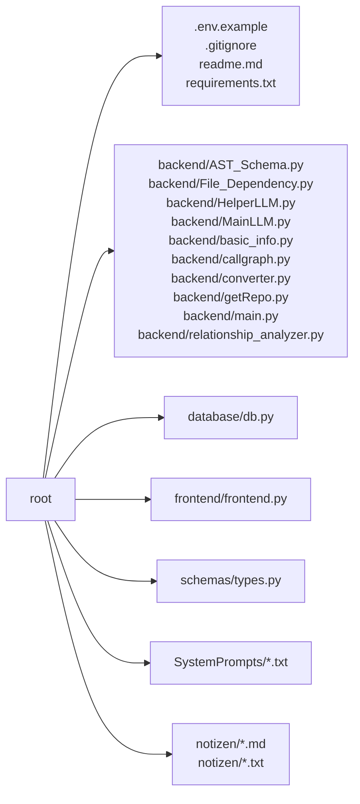

# Project Documentation: Repo Onboarding Agent 🚀

## 1. Project Overview
- **Description:** An automated repository analysis and documentation tool designed to synthesize deep insights from codebases. It leverages a multi-stage LLM pipeline to parse Abstract Syntax Trees (AST), map code relationships (calls and instantiations), and generate comprehensive human-readable documentation. It includes specialized workflows for standard Python source files and Jupyter Notebooks.
- **Key Features:**
  - Automated Git repository cloning and "lazy-loading" file processing.
  - Deep AST-based analysis to identify classes, functions, and import dependencies.
  - Context-aware relationship mapping for functions and classes (Call Graphs).
  - Multi-LLM synthesis pipeline using "Helper" and "Main" agents for high-quality reports.
  - Interactive Streamlit frontend with MongoDB-backed chat history and feedback systems.
- **Tech Stack:** Python, Streamlit, LangChain, Google Gemini API, OpenAI API, MongoDB, NetworkX, and Mermaid.js.

- **Repository Structure:**


## 2. Installation
### Dependencies
pip install -r requirements.txt
*(Key libraries include: streamlit, langchain, pymongo, networkx, gitpython, and pydantic)*

### Setup Guide
1. **Clone the repository:** `git clone <repo-url>`
2. **Environment Variables:** Copy `.env.example` to `.env` and provide your API keys (e.g., `GEMINI_API_KEY`, `OPENAI_API_KEY`, `MONGO_URI`).
3. **Install Requirements:** Run `pip install -r requirements.txt`.

### Quick Startup
1. **Run the Frontend:**
   ```bash
   streamlit run frontend/frontend.py
   ```
2. **Analyze a Repo:** Enter a GitHub URL in the UI to start the onboarding process.

## 3. Use Cases & Commands
- **Automated Onboarding:** Automatically generate full project documentation for any public GitHub repository.
- **Interactive Code Chat:** Query the codebase through the Streamlit UI to understand specific logic or architectural patterns.
- **Notebook Analysis:** Use the specialized `notebook_workflow` to extract logic and visual data from `.ipynb` files.
- **Token Optimization:** Uses the `.toon` format to compress analysis data, reducing LLM context window costs.

## 4. Architecture
The Mermaid Syntax to visualize Graphs is not set up yet and will be added
but if there is mermaid syntax in your input json display it here

## 5. Code Analysis

### File: `backend/AST_Schema.py`

#### Class: `ASTVisitor`
*   **Summary:** The ASTVisitor class extends `ast.NodeVisitor` to systematically traverse the Abstract Syntax Tree (AST) of Python source code. Its primary purpose is to extract and organize structured metadata about imports, class definitions, and function definitions (including asynchronous ones) found within a specified file. It populates an internal `schema` dictionary with this information, ensuring that nested methods are correctly associated with their parent classes.
*   **Instantiation:** This class is not explicitly instantiated by any known callers in the provided context.
*   **Dependencies:** This class depends on `backend.AST_Schema.path_to_module` for resolving module paths.
*   **Constructor:**
    *   *Description:* The constructor initializes the ASTVisitor instance by storing the raw source code, file path, and project root. It then calculates the module's full path and sets up an empty `schema` dictionary to accumulate extracted AST information. Additionally, it initializes `_current_class` to `None` to track the context of nested definitions.
    *   *Parameters:*
        - **source_code** (`str`): The raw Python source code string of the file being analyzed.
        - **file_path** (`str`): The absolute path to the Python file being visited.
        - **project_root** (`str`): The root directory of the project, used for calculating module paths.
*   **Methods:**
    *   **`visit_Import`**
        *   *Signature:* `def visit_Import(self, node)`
        *   *Description:* This method is invoked by the `ast.NodeVisitor` framework when an `ast.Import` node is encountered during AST traversal. It iterates through each alias in the import statement and appends the full name of the imported module to the `imports` list within the `self.schema` dictionary. After processing the current node, it ensures continued traversal of its children by calling `self.generic_visit(node)`.
        *   *Parameters:*
            - **node** (`ast.Import`): The AST node representing an 'import' statement.
        *   *Returns:* N/A
        *   **Usage:** Called by the `ast.NodeVisitor` framework when an `ast.Import` node is encountered.
    *   **`visit_ImportFrom`**
        *   *Signature:* `def visit_ImportFrom(self, node)`
        *   *Description:* This method handles `ast.ImportFrom` nodes, which correspond to 'from ... import ...' statements in Python. For each alias within the import statement, it constructs a fully qualified import string by combining the module name and the alias name, then appends this string to the `imports` list in `self.schema`. It concludes by calling `self.generic_visit(node)` to ensure recursive traversal of the AST.
        *   *Parameters:*
            - **node** (`ast.ImportFrom`): The AST node representing a 'from ... import ...' statement.
        *   *Returns:* N/A
        *   **Usage:** Called by the `ast.NodeVisitor` framework when an `ast.ImportFrom` node is encountered.
    *   **`visit_ClassDef`**
        *   *Signature:* `def visit_ClassDef(self, node)`
        *   *Description:* This method processes `ast.ClassDef` nodes, which represent class definitions in the source code. It generates a unique identifier for the class, extracts its name, docstring, and the exact source code segment. This information, along with line numbers, is stored in a dictionary and appended to the `classes` list within `self.schema`. It temporarily sets `_current_class` to the newly created class info to correctly associate nested methods, then performs a generic visit, and finally resets `_current_class` to `None`.
        *   *Parameters:*
            - **node** (`ast.ClassDef`): The AST node representing a class definition.
        *   *Returns:* N/A
        *   **Usage:** Called by the `ast.NodeVisitor` framework when an `ast.ClassDef` node is encountered.
    *   **`visit_FunctionDef`**
        *   *Signature:* `def visit_FunctionDef(self, node)`
        *   *Description:* This method handles `ast.FunctionDef` nodes, distinguishing between methods defined within a class and top-level functions. If `_current_class` is set, it extracts method details like identifier, name, arguments, docstring, and line numbers, appending this as `method_context_info` to the current class's context. Otherwise, for top-level functions, it creates `func_info` with similar details and adds it to the `functions` list in `self.schema`. It ensures continued AST traversal by calling `self.generic_visit(node)`.
        *   *Parameters:*
            - **node** (`ast.FunctionDef`): The AST node representing a function definition.
        *   *Returns:* N/A
        *   **Usage:** Called by the `ast.NodeVisitor` framework when an `ast.FunctionDef` node is encountered.
    *   **`visit_AsyncFunctionDef`**
        *   *Signature:* `def visit_AsyncFunctionDef(self, node)`
        *   *Description:* This method is specifically designed to handle `ast.AsyncFunctionDef` nodes, which represent asynchronous function definitions. Its implementation is straightforward: it simply delegates the entire processing logic to the `visit_FunctionDef` method. This ensures that asynchronous functions are treated identically to regular functions in terms of how their metadata is extracted and stored within the schema, maintaining consistency in the collected data.
        *   *Parameters:*
            - **node** (`ast.AsyncFunctionDef`): The AST node representing an asynchronous function definition.
        *   *Returns:* N/A
        *   **Usage:** Calls the `visit_FunctionDef` method to process asynchronous function definitions.

#### Class: `ASTAnalyzer`
*   **Summary:** The ASTAnalyzer class is responsible for analyzing a codebase to construct a detailed Abstract Syntax Tree (AST) schema and integrate relationship data. It processes individual Python files within a repository, parses their ASTs using an ASTVisitor, and then merges call and instantiation relationships into the generated schema. This class provides a structured representation of the code's components and their interconnections.
*   **Instantiation:** The class is not explicitly instantiated by any known components within the provided context.
*   **Dependencies:** The class depends on backend.AST_Schema.ASTVisitor for parsing individual ASTs.
*   **Constructor:**
    *   *Description:* The constructor for ASTAnalyzer does not perform any explicit initialization of attributes. It simply defines the class without setting up any initial state.
    *   *Parameters:* N/A
*   **Methods:**
    *   **`merge_relationship_data`**
        *   *Signature:* `def merge_relationship_data(self, full_schema, raw_relationships)`
        *   *Description:* This method integrates raw relationship data (incoming and outgoing calls) into a structured schema of AST nodes. It iterates through files, functions, and classes within the full_schema. For each function, it populates its calls and called_by context. For each class, it populates instantiated_by and then iterates through its methods to populate their calls and called_by, also identifying external class dependencies.
        *   *Parameters:*
            - **full_schema** (`dict`): The complete AST schema containing file, function, and class definitions.
            - **raw_relationships** (`dict`): A dictionary containing raw 'outgoing' and 'incoming' call relationships.
        *   *Returns:*
            - **full_schema** (`dict`): The updated full_schema with relationship data integrated.
        *   **Usage:** Integrates relationship metadata into the primary AST schema.
    *   **`analyze_repository`**
        *   *Signature:* `def analyze_repository(self, files, repo)`
        *   *Description:* This method processes a list of file objects from a Git repository to build a comprehensive AST schema. It filters for Python files, reads their content, and uses an ASTVisitor to parse each file's Abstract Syntax Tree. The extracted AST nodes (imports, functions, classes) are then organized into a full_schema dictionary, handling potential parsing errors.
        *   *Parameters:*
            - **files** (`list`): A list of file objects, each expected to have 'path' and 'content' attributes.
            - **repo** (`GitRepository`): An object representing the Git repository.
        *   *Returns:*
            - **full_schema** (`dict`): A dictionary representing the full AST schema of the analyzed repository.
        *   **Usage:** Initiates the parsing of the entire repository.

#### Function: `path_to_module`
*   **Signature:** `def path_to_module(filepath, project_root)`
*   **Description:** This function converts a given file path into a Python module path. It first determines the relative path of the file with respect to the project root. It then removes the '.py' extension if present and replaces operating system path separators with dots. Finally, it handles special cases for `__init__.py` files by removing the `.__init__` suffix to yield the correct package module path.
*   **Parameters:**
    - **filepath** (`str`): The absolute path to the Python file to be converted.
    - **project_root** (`str`): The absolute path to the root directory of the project.
*   **Returns:**
    - **module_path** (`str`): The Python module path derived from the input filepath.
*   **Usage:** Used by `ASTVisitor` and `ASTAnalyzer` to generate unique identifiers for code components.

---

### File: `backend/File_Dependency.py`

#### Class: `FileDependencyGraph`
*   **Summary:** The FileDependencyGraph class, inheriting from ast.NodeVisitor, is designed to analyze Python source code files and build a graph of their import dependencies. It traverses the Abstract Syntax Tree (AST) of a given file, specifically looking for import and from ... import ... statements. The class effectively distinguishes between absolute and relative imports, using a sophisticated internal mechanism (_resolve_module_name) to correctly resolve relative paths within a repository structure. Its primary function is to populate an import_dependencies dictionary, mapping each file to the set of modules it imports, thereby creating a foundational data structure for dependency analysis.
*   **Instantiation:** N/A
*   **Dependencies:** The class depends on get_all_temp_files for repository file listing.
*   **Constructor:**
    *   *Description:* This constructor initializes a FileDependencyGraph instance by setting the filename and repo_root attributes. These attributes are crucial for identifying the current file and navigating the repository structure to resolve file dependencies.
    *   *Parameters:*
        - **filename** (`str`): The path to the file for which dependencies are being analyzed.
        - **repo_root** (`Any`): The root directory of the repository, used for resolving file paths.
*   **Methods:**
    *   **`_resolve_module_name`**
        *   *Signature:* `def _resolve_module_name(self, node)`
        *   *Description:* This method is responsible for resolving relative Python imports. It calculates the correct base directory based on the import level and the current file's location within the repository. It then iterates through the imported names, checking if they correspond to existing module files or symbols exported via __init__.py files.
        *   *Parameters:*
            - **node** (`ImportFrom`): The AST ImportFrom node representing the relative import statement.
        *   *Returns:*
            - **resolved** (`list[str]`): A sorted list of resolved module or symbol names that actually exist.
        *   **Usage:** Called by visit_ImportFrom to handle relative import statements.
    *   **`visit_Import`**
        *   *Signature:* `def visit_Import(self, node, base_name)`
        *   *Description:* This method processes Import and ImportFrom AST nodes to record dependencies. It ensures that the current filename is a key in the import_dependencies dictionary.
        *   *Parameters:*
            - **node** (`Import | ImportFrom`): The AST node representing an import statement.
            - **base_name** (`str | None`): An optional base name for the import.
        *   *Returns:* N/A
        *   **Usage:** Recorded when traversing an import statement.
    *   **`visit_ImportFrom`**
        *   *Signature:* `def visit_ImportFrom(self, node)`
        *   *Description:* This method specifically handles ImportFrom AST nodes. It resolves the module names and records dependencies.
        *   *Parameters:*
            - **node** (`ImportFrom`): The AST ImportFrom node to be processed.
        *   *Returns:* N/A
        *   **Usage:** Implicitly called by the NodeVisitor framework.

#### Function: `build_file_dependency_graph`
*   **Signature:** `def build_file_dependency_graph(filename, tree, repo_root)`
*   **Description:** This function constructs a file dependency graph for a given Python file using NetworkX. It initializes a `FileDependencyGraph` visitor with the specified filename and repository root, then processes the provided Abstract Syntax Tree (AST) to identify import dependencies. The function iterates through the collected import dependencies, adding nodes for callers and callees, and edges representing the import relationships to a NetworkX directed graph. Finally, the populated dependency graph is returned.
*   **Parameters:**
    - **filename** (`str`): The path to the file for which the dependency graph is being built.
    - **tree** (`AST`): The Abstract Syntax Tree (AST) of the file to be analyzed.
    - **repo_root** (`str`): The root directory of the repository.
*   **Returns:**
    - **graph** (`nx.DiGraph`): A NetworkX directed graph representing the file-level import dependencies.
*   **Usage:** Called by `build_repository_graph`.

#### Function: `build_repository_graph`
*   **Signature:** `def build_repository_graph(repository)`
*   **Description:** This function constructs a global directed graph representing the dependencies between Python files within a given Git repository. It iterates through all files in the repository, filtering for Python files. For each Python file, it parses its content and uses a helper function to build a file-specific dependency graph. The nodes and edges from these individual file graphs are then integrated into a single, comprehensive repository-wide dependency graph.
*   **Parameters:**
    - **repository** (`GitRepository`): The GitRepository object representing the repository.
*   **Returns:**
    - **global_graph** (`nx.DiGraph`): A NetworkX directed graph representing the entire repository's dependency structure.
*   **Usage:** Generates the top-level architectural overview of file relationships.

#### Function: `get_all_temp_files`
*   **Signature:** `def get_all_temp_files(directory)`
*   **Description:** This function, `get_all_temp_files`, is designed to locate all Python files within a specified directory and its subdirectories. It takes a directory path as input, resolves it to an absolute path, and then recursively searches for all files with a '.py' extension. The function returns a list of these Python files as relative `pathlib.Path` objects.
*   **Parameters:**
    - **directory** (`str`): The path to the root directory to search.
*   **Returns:**
    - **all_files** (`list[Path]`): A list of pathlib.Path objects representing found Python files.
*   **Usage:** Internal utility for directory traversal.

---

### File: `backend/HelperLLM.py`

#### Class: `LLMHelper`
*   **Summary:** The LLMHelper class provides a centralized interface for interacting with various Large Language Models (LLMs) to generate structured documentation for Python functions and classes. It abstracts away the complexities of different LLM providers (Gemini, OpenAI, Ollama, custom APIs), handles API key validation, loads system prompts, and configures LLM clients with structured output capabilities using Pydantic schemas. The class supports batch processing of requests and incorporates rate limiting mechanisms to ensure robust and efficient interaction with LLM APIs.
*   **Instantiation:** N/A
*   **Dependencies:** Depends on LangChain messages, Pydantic, and specialized `schemas/types.py`.
*   **Constructor:**
    *   *Description:* The constructor initializes the LLMHelper class by validating the provided API key and loading system prompts. It configures the appropriate LLM client (Google Gemini, OpenAI, custom API, or Ollama) based on the model_name and sets up structured output parsers for FunctionAnalysis and ClassAnalysis schemas.
    *   *Parameters:*
        - **api_key** (`str`): The API key for the chosen LLM service.
        - **function_prompt_path** (`str`): File path to function system prompts.
        - **class_prompt_path** (`str`): File path to class system prompts.
        - **model_name** (`str`): The LLM model identifier.
        - **base_url** (`str`): Optional base URL for custom endpoints.
*   **Methods:**
    *   **`_configure_batch_settings`**
        *   *Signature:* `def _configure_batch_settings(self, model_name)`
        *   *Description:* This private method sets the `batch_size` attribute based on the provided `model_name` to optimize throughput while respecting rate limits.
        *   *Parameters:*
            - **model_name** (`str`): The model name.
        *   *Returns:* N/A
        *   **Usage:** Configures internal batch limits.
    *   **`generate_for_functions`**
        *   *Signature:* `def generate_for_functions(self, function_inputs)`
        *   *Description:* Generates and validates documentation for a list of functions by interacting with the configured LLM. Includes rate-limiting logic.
        *   *Parameters:*
            - **function_inputs** (`List[FunctionAnalysisInput]`): List of function details to analyze.
        *   *Returns:*
            - **all_validated_functions** (`List[Optional[FunctionAnalysis]]`): Analysis results.
        *   **Usage:** Primary entry point for function-level documentation generation.
    *   **`generate_for_classes`**
        *   *Signature:* `def generate_for_classes(self, class_inputs)`
        *   *Description:* Responsible for generating and validating documentation for a batch of classes. Includes error handling for LLM calls.
        *   *Parameters:*
            - **class_inputs** (`List[ClassAnalysisInput]`): List of class details.
        *   *Returns:*
            - **all_validated_classes** (`List[Optional[ClassAnalysis]]`): Analysis results.
        *   **Usage:** Primary entry point for class-level documentation generation.

#### Function: `main_orchestrator`
*   **Signature:** `def main_orchestrator()`
*   **Description:** This function serves as a dummy data and processing loop designed for testing the LLMHelper class. It defines pre-computed analysis inputs and outputs for several example functions and a class using Pydantic models. The orchestrator then initializes an LLMHelper instance, calls the helper, and processes the results for storage and display.
*   **Parameters:** N/A
*   **Returns:** N/A
*   **Usage:** Used for testing and demonstration of the LLM pipeline logic.

---

### File: `backend/MainLLM.py`

#### Class: `MainLLM`
*   **Summary:** The MainLLM class provides a unified interface for interacting with various Large Language Models (LLMs), abstracting the underlying provider specifics. It initializes an LLM client based on the provided model name, supporting Gemini, OpenAI-compatible APIs (including custom ones), and Ollama. The class manages a system prompt loaded from a file, which is prepended to all user inputs.
*   **Instantiation:** N/A
*   **Dependencies:** N/A
*   **Constructor:**
    *   *Description:* The constructor initializes the MainLLM class by configuring the LLM client and loading the system prompt from the specified file path.
    *   *Parameters:*
        - **api_key** (`str`): The API key for authentication.
        - **prompt_file_path** (`str`): Path to the system prompt file.
        - **model_name** (`str`): The identifier for the LLM model.
        - **base_url** (`str`): Optional base URL for custom API endpoints.
*   **Methods:**
    *   **`call_llm`**
        *   *Signature:* `def call_llm(self, user_input)`
        *   *Description:* Sends a user's input to the initialized LLM and retrieves a single, complete response. Includes logging and basic error handling.
        *   *Parameters:*
            - **user_input** (`str`): The query or document to be sent to the LLM.
        *   *Returns:*
            - **content** (`str | None`): The LLM response content.
        *   **Usage:** Used to generate final synthesized reports.
    *   **`stream_llm`**
        *   *Signature:* `def stream_llm(self, user_input)`
        *   *Description:* Interacts with the LLM to obtain a streamed response, yielding chunks of content as they become available.
        *   *Parameters:*
            - **user_input** (`str`): The query or document.
        *   *Returns:*
            - **chunk.content** (`str`): An iterator yielding string chunks of the response.
        *   **Usage:** Used for real-time UI response display.

---

### File: `backend/main.py`

#### Function: `main_workflow`
*   **Signature:** `def main_workflow(input, api_keys, model_names, status_callback)`
*   **Description:** The main_workflow function orchestrates a comprehensive analysis of a GitHub repository. It beginning with extracting API keys and LLM configurations, cloning the repository, extracting basic project info, and building an enriched AST schema. It prepares and dispatches analysis tasks to the Helper LLM and finally utilizes the Main LLM to synthesize all gathered data into a final report.
*   **Parameters:**
    - **input** (`str`): The GitHub repository URL.
    - **api_keys** (`dict`): Collection of required API keys and URLs.
    - **model_names** (`dict`): Model configuration for 'helper' and 'main' stages.
    - **status_callback** (`callable | None`): Callback for real-time UI updates.
*   **Returns:**
    - **result** (`dict`): A dictionary containing the final report and metrics.
*   **Usage:** This is the primary execution entry point for the repository onboarding logic.

#### Function: `notebook_workflow`
*   **Signature:** `def notebook_workflow(input, api_keys, model, status_callback)`
*   **Description:** This function orchestrates a workflow to analyze Jupyter notebooks from a given GitHub repository using an LLM. It processes notebook files into an XML-like structure, extracts code/markdown, and handles image placeholders to construct specific payloads for the LLM.
*   **Parameters:**
    - **input** (`str`): GitHub repository URL.
    - **api_keys** (`dict`): API key dictionary.
    - **model** (`str`): The LLM model name.
    - **status_callback** (`callable or None`): Optional status updater.
*   **Returns:**
    - **report** (`str`): Concatenated markdown report.
    - **metrics** (`dict`): Performance data.
*   **Usage:** Used when the repository contains Jupyter Notebooks that require visual and code analysis.

#### Function: `create_savings_chart`
*   **Signature:** `def create_savings_chart(json_tokens, toon_tokens, savings_percent, output_path)`
*   **Description:** Generates a bar chart to visually compare token counts between JSON and TOON formats.
*   **Parameters:**
    - **json_tokens** (`int`): Token count for JSON.
    - **toon_tokens** (`int`): Token count for TOON.
    - **savings_percent** (`float`): Percentage saved.
    - **output_path** (`str`): File path to save the image.
*   **Returns:** N/A
*   **Usage:** Saves visualization of the TOON format efficiency.

---

### File: `database/db.py`

#### Function: `insert_exchange`
*   **Signature:** `def insert_exchange(question, answer, feedback, username, chat_name, helper_used, ...)`
*   **Description:** Inserts a new exchange record into the `dbexchanges` collection, capturing the chat history, metadata about the LLMs used, and performance metrics.
*   **Parameters:** Various fields including `question`, `answer`, `username`, `chat_name`, and token usage counts.
*   **Returns:**
    - **new_id** (`str`): The unique ID of the inserted document.
*   **Usage:** Persists chat history for the user.

#### Function: `get_decrypted_api_keys`
*   **Signature:** `def get_decrypted_api_keys(username)`
*   **Description:** Retrieves and decrypts various API keys for a specified user from the MongoDB database.
*   **Parameters:**
    - **username** (`str`): Target user identifier.
*   **Returns:** A tuple containing decrypted keys for Gemini, GPT, and other services.
*   **Usage:** Provides credentials for LLM workflows securely.

---

### File: `frontend/frontend.py`

#### Function: `render_exchange`
*   **Signature:** `def render_exchange(ex, current_chat_name)`
*   **Description:** Renders a single chat exchange in Streamlit, including a dynamic toolbar for feedback (like/dislike), comments, downloads, and message deletion.
*   **Parameters:**
    - **ex** (`dict`): The exchange data document.
    - **current_chat_name** (`str`): The chat context name.
*   **Returns:** N/A
*   **Usage:** Main UI component for displaying the conversational interface.

---

### File: `schemas/types.py`

#### Class: `FunctionAnalysis`
*   **Summary:** The main model representing the entire JSON schema for a function analysis result.
*   **Constructor:**
    - **identifier** (`str`): Function identifier.
    - **description** (`FunctionDescription`): Detailed analysis.
    - **error** (`Optional[str]`): Analysis error message if applicable.

#### Class: `ClassAnalysis`
*   **Summary:** The main model for the entire JSON schema for a class analysis result.
*   **Constructor:**
    - **identifier** (`str`): Class identifier.
    - **description** (`ClassDescription`): Detailed analysis of constructor and methods.
    - **error** (`Optional[str]`): Analysis error message if applicable.