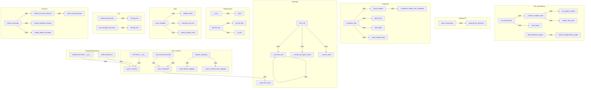

```mermaid
graph TD

%% --- AST Schema ---
subgraph AST_Schema
    ASTVisitor_init[ASTVisitor::__init__] -->|calls| path_to_module[path_to_module]
    visit_AsyncFunctionDef[visit_AsyncFunctionDef] -->|calls| visit_FunctionDef[visit_FunctionDef]
    analyze_repository[analyze_repository] -->|calls| build_filtered_callgraph[build_filtered_callgraph]
    analyze_repository -->|calls| _enrich_schema_with_callgraph[_enrich_schema_with_callgraph]
end

%% --- File Dependency ---
subgraph File_Dependency
    _resolve_module_name[_resolve_module_name] -->|calls| init_exports_symbol[init_exports_symbol]
    _resolve_module_name -->|calls| module_file_exists[module_file_exists]
    visit_ImportFrom[visit_ImportFrom] -->|calls| _resolve_module_name
    visit_ImportFrom -->|calls| visit_Import[visit_Import]
    build_repository_graph[build_repository_graph] -->|calls| build_file_dependency_graph[build_file_dependency_graph]
end

%% --- Helper LLM ---
subgraph HelperLLM
    main_orchestrator[main_orchestrator] -->|calls| generate_for_functions[generate_for_functions]
end

%% --- Project Info ---
subgraph ProjectInfo
    _parse_readme[parse_readme] -->|calls| _extrahiere_sektion_aus_markdown[_extrahiere_sektion_aus_markdown]
    extrahiere_info[extrahiere_info] -->|calls| _parse_readme
    extrahiere_info -->|calls| _parse_toml[parse_toml]
    extrahiere_info -->|calls| _finde_datei[finde_datei]
    extrahiere_info -->|calls| _parse_requirements[parse_requirements]
end

%% --- CallGraph ---
subgraph CallGraph
    _recursive_call[_recursive_call] -->|calls| _recursive_call
    visit_FunctionDef[visit_FunctionDef] -->|calls| _make_full_name[_make_full_name]
    visit_AsyncFunctionDef[visit_AsyncFunctionDef] -->|calls| visit_FunctionDef
    visit_Call[visit_Call] -->|calls| _resolve_all_callee_names[_resolve_all_callee_names]
    visit_Call -->|calls| _current_caller[_current_caller]
    visit_Call -->|calls| _recursive_call
end

%% --- Git Repository ---
subgraph GitRepository
    __exit__[__exit__] -->|calls| close[close]
    get_file_tree[get_file_tree] -->|calls| get_all_files[get_all_files]
    get_file_tree -->|calls| to_dict[to_dict]
end

%% --- Main Workflow ---
subgraph Main
    main_workflow[main_workflow] -->|calls| update_status[update_status]
    main_workflow -->|calls| calculate_net_time[calculate_net_time]
    main_workflow -->|calls| create_savings_chart[create_savings_chart]
end

%% --- Relationship Analyzer ---
subgraph RelationshipAnalyzer
    _collect_definitions[collect_definitions] -->|calls| path_to_module[path_to_module]
    CallResolverVisitor_init[CallResolverVisitor::__init__] -->|calls| path_to_module
end

%% --- Database ---
subgraph DB
    update_gemini_key[update_gemini_key] -->|calls| encrypt_text[encrypt_text]
    get_decrypted_api_keys[get_decrypted_api_keys] -->|calls| decrypt_text[decrypt_text]
end

%% --- Frontend ---
subgraph Frontend
    render_text_with_mermaid[render_text_with_mermaid] -->|calls| stream_text_generator[stream_text_generator]
    render_exchange[render_exchange] -->|calls| handle_feedback_change[handle_feedback_change]
    render_exchange -->|calls| render_text_with_mermaid
    render_exchange -->|calls| handle_delete_exchange[handle_delete_exchange]
end

```