```mermaid
graph TD
    AST_Schema::ASTVisitor::__init__ --> AST_Schema::path_to_module
    AST_Schema::ASTVisitor::visit_AsyncFunctionDef --> AST_Schema::ASTVisitor::visit_FunctionDef
    AST_Schema::ASTAnalyzer::analyze_repository --> callgraph::build_filtered_callgraph
    AST_Schema::ASTAnalyzer::analyze_repository --> AST_Schema::ASTAnalyzer::_enrich_schema_with_callgraph
    File_Dependency::FileDependencyGraph::_resolve_module_name --> File_Dependency::FileDependencyGraph::module_file_exists
    File_Dependency::FileDependencyGraph::_resolve_module_name --> File_Dependency::FileDependencyGraph::init_exports_symbol
    File_Dependency::FileDependencyGraph::visit_ImportFrom --> File_Dependency::FileDependencyGraph::visit_Import
    File_Dependency::FileDependencyGraph::visit_ImportFrom --> File_Dependency::FileDependencyGraph::_resolve_module_name
    File_Dependency::build_repository_graph --> File_Dependency::build_file_dependency_graph
    HelperLLM::main_orchestrator --> HelperLLM::LLMHelper::generate_for_functions
    basic_info::ProjektInfoExtractor::_parse_readme --> basic_info::ProjektInfoExtractor::_extrahiere_sektion_aus_markdown
    basic_info::ProjektInfoExtractor::extrahiere_info --> basic_info::ProjektInfoExtractor::_parse_requirements
    basic_info::ProjektInfoExtractor::extrahiere_info --> basic_info::ProjektInfoExtractor::_parse_readme
    basic_info::ProjektInfoExtractor::extrahiere_info --> basic_info::ProjektInfoExtractor::_parse_toml
    basic_info::ProjektInfoExtractor::extrahiere_info --> basic_info::ProjektInfoExtractor::_finde_datei
    callgraph::CallGraph::_recursive_call --> callgraph::CallGraph::_recursive_call
    callgraph::CallGraph::visit_FunctionDef --> callgraph::CallGraph::_make_full_name
    callgraph::CallGraph::visit_AsyncFunctionDef --> callgraph::CallGraph::visit_FunctionDef
    callgraph::CallGraph::visit_Call --> callgraph::CallGraph::_current_caller
    callgraph::CallGraph::visit_Call --> callgraph::CallGraph::_resolve_all_callee_names
    callgraph::CallGraph::visit_Call --> callgraph::CallGraph::_recursive_call
    getRepo::GitRepository::__exit__ --> getRepo::GitRepository::close
    getRepo::GitRepository::get_file_tree --> getRepo::RepoFile::to_dict
    getRepo::GitRepository::get_file_tree --> getRepo::GitRepository::get_all_files
    main::main_workflow --> main::calculate_net_time
    main::main_workflow --> main::create_savings_chart
    main::main_workflow --> main::update_status
    relationship_analyzer::ProjectAnalyzer::_collect_definitions --> relationship_analyzer::path_to_module
    relationship_analyzer::CallResolverVisitor::__init__ --> relationship_analyzer::path_to_module
    db::update_gemini_key --> db::encrypt_text
    db::get_decrypted_api_keys --> db::decrypt_text
    Frontend::render_text_with_mermaid --> Frontend::stream_text_generator
    Frontend::render_exchange --> Frontend::handle_delete_exchange
    Frontend::render_exchange --> Frontend::render_text_with_mermaid
    Frontend::render_exchange --> Frontend::handle_feedback_change
```

```mermaid
graph TD
    AST_Schema -->|calls| ast
    AST_Schema -->|calls| os
    AST_Schema -->|calls| networkx
    AST_Schema -->|calls| getRepo
    AST_Schema -->|calls| callgraph
    getRepo -->|calls| git
    getRepo -->|calls| tempfile
    getRepo -->|calls| logging
    getRepo -->|calls| os
    getRepo -->|calls| shutil
    callgraph -->|calls| ast
    callgraph -->|calls| typing
    callgraph -->|calls| os
    callgraph -->|calls| networkx
    callgraph -->|calls| getRepo
    callgraph -->|calls| pathlib
    callgraph -->|calls| basic_info
    File_Dependency -->|calls| ast
    File_Dependency -->|calls| keyword
    File_Dependency -->|calls| os
    File_Dependency -->|calls| networkx
    File_Dependency -->|calls| getRepo
    File_Dependency -->|calls| callgraph
    File_Dependency -->|calls| pathlib
    HelperLLM -->|calls| time
    HelperLLM -->|calls| logging
    HelperLLM -->|calls| typing
    HelperLLM -->|calls| os
    HelperLLM -->|calls| langchain_google_genai
    HelperLLM -->|calls| langchain_openai
    HelperLLM -->|calls| messages
    HelperLLM -->|calls| pydantic
    HelperLLM -->|calls| types
    HelperLLM -->|calls| dotenv
    HelperLLM -->|calls| json
    HelperLLM -->|calls| langchain_ollama
    types -->|calls| pydantic
    types -->|calls| typing
    MainLLM -->|calls| logging
    MainLLM -->|calls| langchain_openai
    MainLLM -->|calls| langchain_google_genai
    MainLLM -->|calls| os
    MainLLM -->|calls| messages
    MainLLM -->|calls| dotenv
    MainLLM -->|calls| sys
    MainLLM -->|calls| langchain_ollama
    basic_info -->|calls| tomllib
    basic_info -->|calls| os
    basic_info -->|calls| typing
    basic_info -->|calls| re
    main -->|calls| toon_format
    main -->|calls| time
    main -->|calls| logging
    main -->|calls| matplotlib.pyplot
    main -->|calls| os
    main -->|calls| AST_Schema
    main -->|calls| datetime
    main -->|calls| re
    main -->|calls| HelperLLM
    main -->|calls| relationship_analyzer
    main -->|calls| types
    main -->|calls| getRepo
    main -->|calls| dotenv
    main -->|calls| pathlib
    main -->|calls| json
    main -->|calls| basic_info
    main -->|calls| MainLLM
    main -->|calls| math
    relationship_analyzer -->|calls| collections
    relationship_analyzer -->|calls| ast
    relationship_analyzer -->|calls| logging
    relationship_analyzer -->|calls| os
    scads_key_test -->|calls| openai
    scads_key_test -->|calls| dotenv
    scads_key_test -->|calls| os
    db -->|calls| pymongo
    db -->|calls| streamlit
    db -->|calls| os
    db -->|calls| datetime
    db -->|calls| uuid
    db -->|calls| fernet
    db -->|calls| dotenv
    db -->|calls| streamlit_authenticator
    Frontend -->|calls| database.db
    Frontend -->|calls| pymongo
    Frontend -->|calls| streamlit_authenticator
    Frontend -->|calls| streamlit
    Frontend -->|calls| time
    Frontend -->|calls| numpy
    Frontend -->|calls| logging
    Frontend -->|calls| os
    Frontend -->|calls| traceback
    Frontend -->|calls| datetime
    Frontend -->|calls| re
    Frontend -->|calls| parse
    Frontend -->|calls| dotenv
    Frontend -->|calls| sys
    Frontend -->|calls| streamlit_mermaid
    Frontend -->|calls| backend
```

Diagram Type:
callgraph

Mermaid Code:

Explanation:
This Mermaid diagram represents a call graph showing the relationships between various functions and methods in the system. The graph is structured into subgraphs based on the module or component they belong to, making it easier to understand the dependencies and call relationships. Each node is labeled with the module and function name for clarity, and arrows with 'calls' annotations show the direction of function calls.

Diagram Type:
graph

Mermaid Code:

Explanation:
This Mermaid diagram represents the architecture of a software system. The graph is structured to show the high-level components and their relationships. Each node represents a function or module, and edges represent calls between these functions. The 'graph TD' syntax is used to arrange the diagram from top to bottom, making it easy to understand the flow of control and data between different parts of the system.