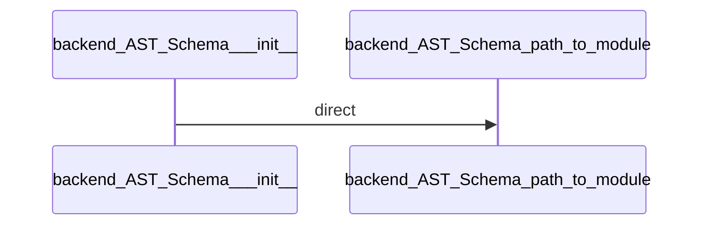
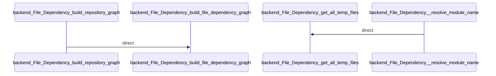
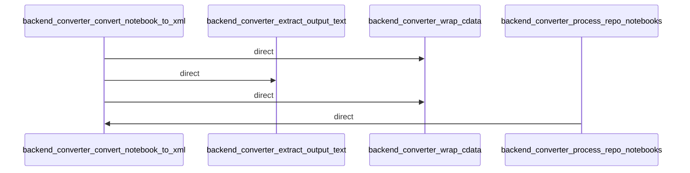
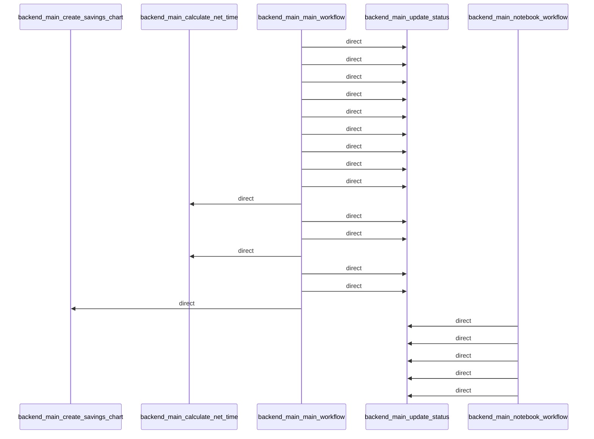
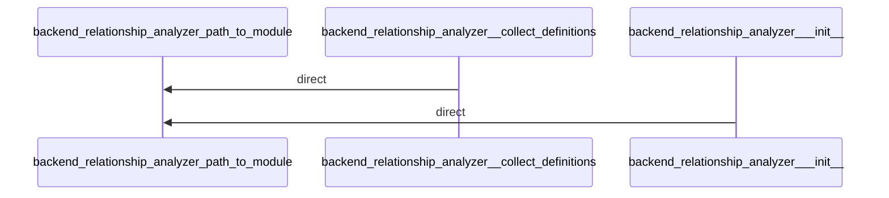
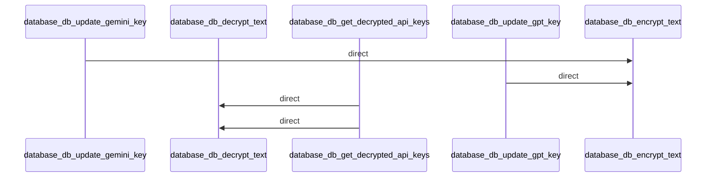
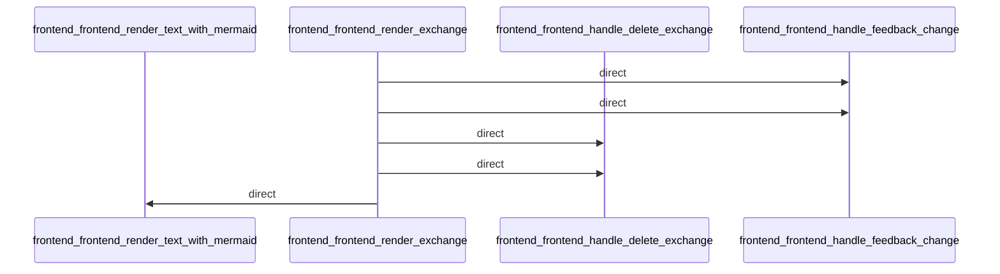

```mermaid
sequenceDiagram
    participant backend_AST_Schema___init__
    participant backend_AST_Schema_path_to_module
    backend_AST_Schema___init__ ->> backend_AST_Schema_path_to_module: direct
```

```mermaid
sequenceDiagram
    participant backend_File_Dependency_build_repository_graph
    participant backend_File_Dependency_build_file_dependency_graph
    participant backend_File_Dependency_get_all_temp_files
    participant backend_File_Dependency__resolve_module_name
    backend_File_Dependency__resolve_module_name ->> backend_File_Dependency_get_all_temp_files: direct
    backend_File_Dependency_build_repository_graph ->> backend_File_Dependency_build_file_dependency_graph: direct
```

```mermaid
sequenceDiagram
    participant backend_converter_convert_notebook_to_xml
    participant backend_converter_extract_output_text
    participant backend_converter_wrap_cdata
    participant backend_converter_process_repo_notebooks
    backend_converter_convert_notebook_to_xml ->> backend_converter_wrap_cdata: direct
    backend_converter_convert_notebook_to_xml ->> backend_converter_extract_output_text: direct
    backend_converter_convert_notebook_to_xml ->> backend_converter_wrap_cdata: direct
    backend_converter_process_repo_notebooks ->> backend_converter_convert_notebook_to_xml: direct
```

```mermaid
sequenceDiagram
    participant backend_main_create_savings_chart
    participant backend_main_calculate_net_time
    participant backend_main_main_workflow
    participant backend_main_update_status
    participant backend_main_notebook_workflow
    backend_main_main_workflow ->> backend_main_update_status: direct
    backend_main_main_workflow ->> backend_main_update_status: direct
    backend_main_main_workflow ->> backend_main_update_status: direct
    backend_main_main_workflow ->> backend_main_update_status: direct
    backend_main_main_workflow ->> backend_main_update_status: direct
    backend_main_main_workflow ->> backend_main_update_status: direct
    backend_main_main_workflow ->> backend_main_update_status: direct
    backend_main_main_workflow ->> backend_main_update_status: direct
    backend_main_main_workflow ->> backend_main_update_status: direct
    backend_main_main_workflow ->> backend_main_calculate_net_time: direct
    backend_main_main_workflow ->> backend_main_update_status: direct
    backend_main_main_workflow ->> backend_main_update_status: direct
    backend_main_main_workflow ->> backend_main_calculate_net_time: direct
    backend_main_main_workflow ->> backend_main_update_status: direct
    backend_main_main_workflow ->> backend_main_update_status: direct
    backend_main_main_workflow ->> backend_main_create_savings_chart: direct
    backend_main_notebook_workflow ->> backend_main_update_status: direct
    backend_main_notebook_workflow ->> backend_main_update_status: direct
    backend_main_notebook_workflow ->> backend_main_update_status: direct
    backend_main_notebook_workflow ->> backend_main_update_status: direct
    backend_main_notebook_workflow ->> backend_main_update_status: direct
```

```mermaid
sequenceDiagram
    participant backend_relationship_analyzer_path_to_module
    participant backend_relationship_analyzer__collect_definitions
    participant backend_relationship_analyzer___init__
    backend_relationship_analyzer__collect_definitions ->> backend_relationship_analyzer_path_to_module: direct
    backend_relationship_analyzer___init__ ->> backend_relationship_analyzer_path_to_module: direct
```

```mermaid
sequenceDiagram
    participant database_db_update_gemini_key
    participant database_db_decrypt_text
    participant database_db_get_decrypted_api_keys
    participant database_db_update_gpt_key
    participant database_db_encrypt_text
    database_db_update_gemini_key ->> database_db_encrypt_text: direct
    database_db_update_gpt_key ->> database_db_encrypt_text: direct
    database_db_get_decrypted_api_keys ->> database_db_decrypt_text: direct
    database_db_get_decrypted_api_keys ->> database_db_decrypt_text: direct
```

```mermaid
sequenceDiagram
    participant frontend_frontend_render_text_with_mermaid
    participant frontend_frontend_render_exchange
    participant frontend_frontend_handle_delete_exchange
    participant frontend_frontend_handle_feedback_change
    frontend_frontend_render_exchange ->> frontend_frontend_handle_feedback_change: direct
    frontend_frontend_render_exchange ->> frontend_frontend_handle_feedback_change: direct
    frontend_frontend_render_exchange ->> frontend_frontend_handle_delete_exchange: direct
    frontend_frontend_render_exchange ->> frontend_frontend_handle_delete_exchange: direct
    frontend_frontend_render_exchange ->> frontend_frontend_render_text_with_mermaid: direct
```
