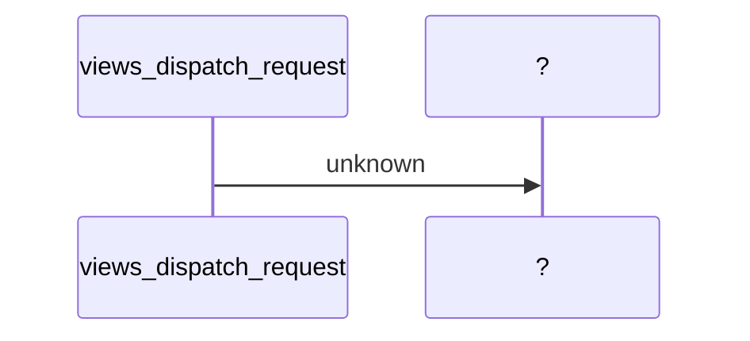
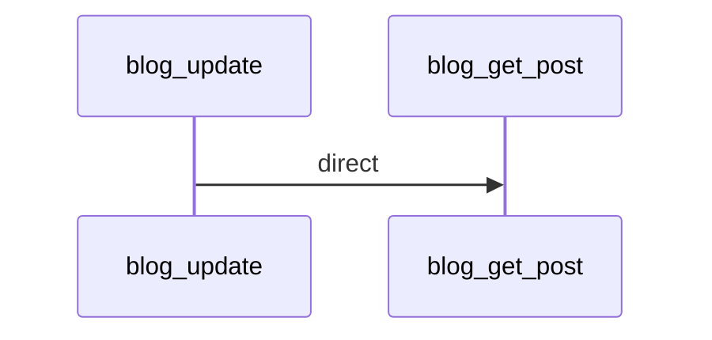
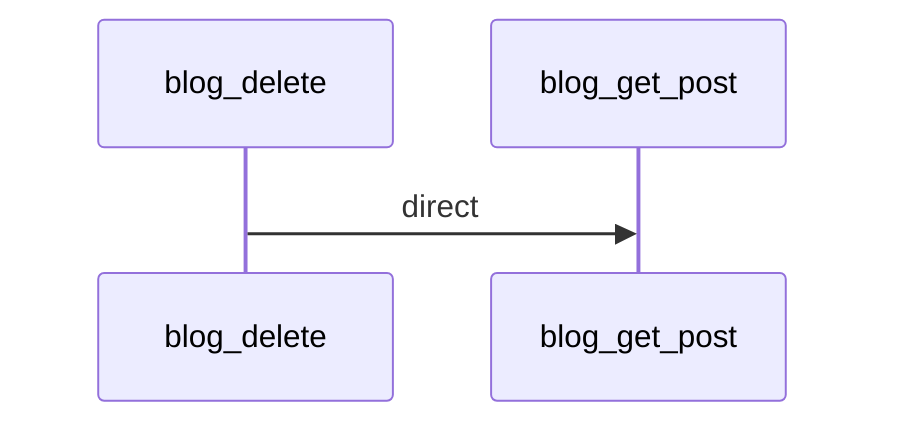
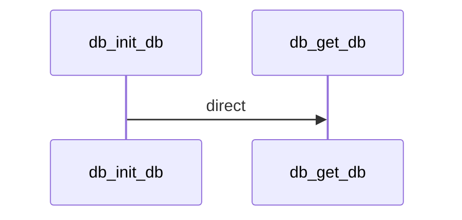
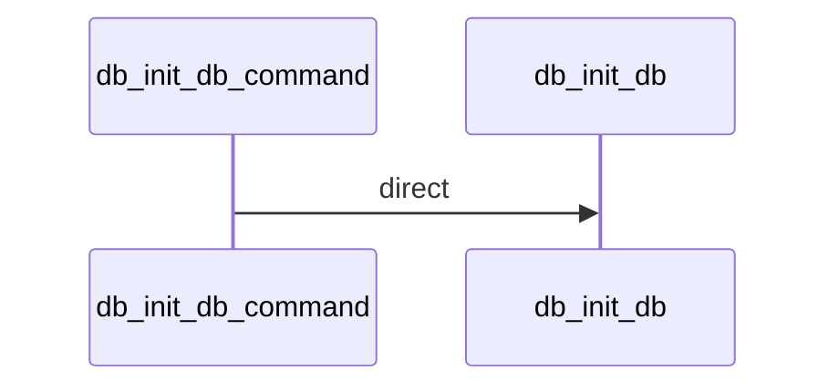
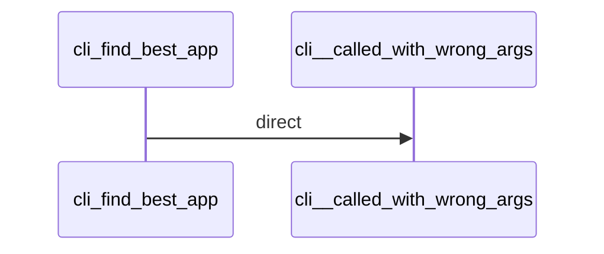
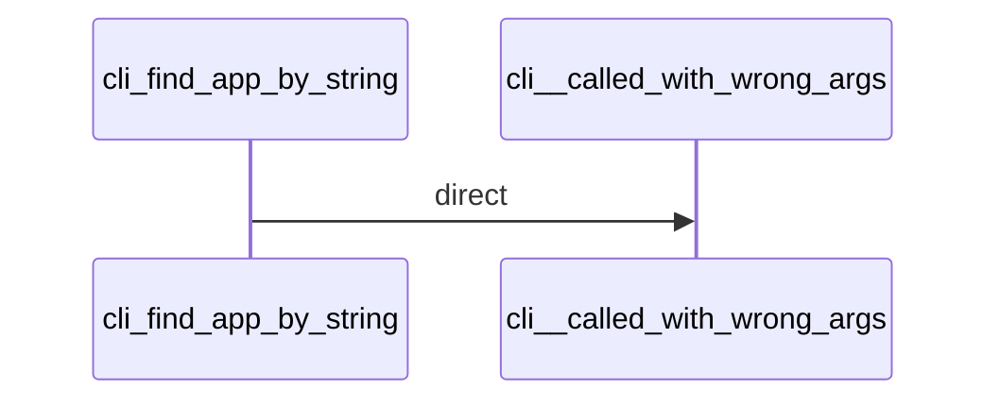
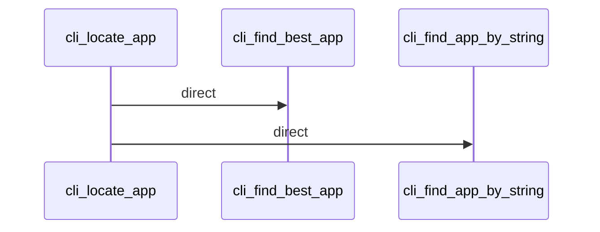
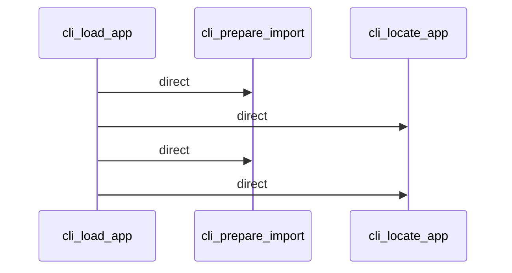
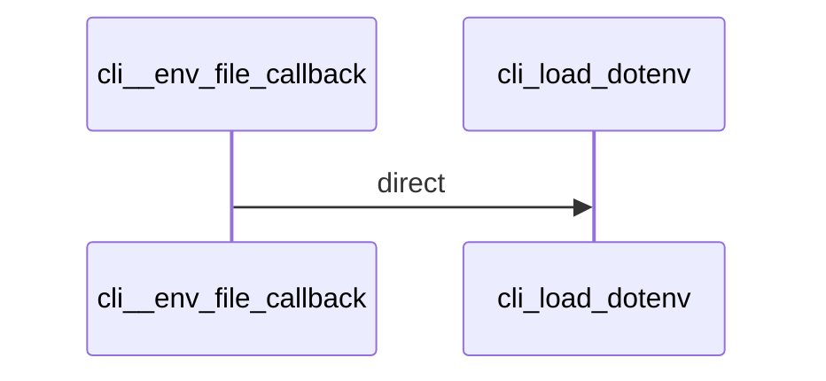
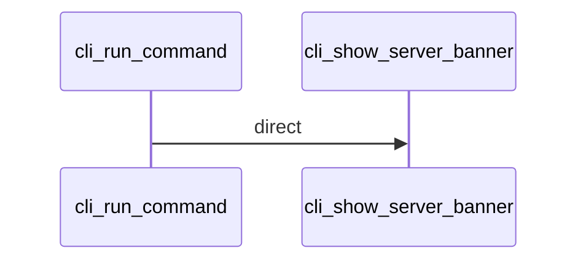
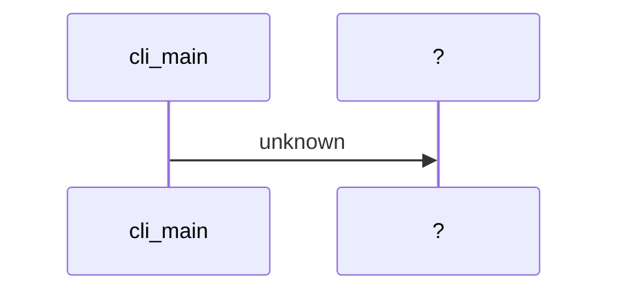
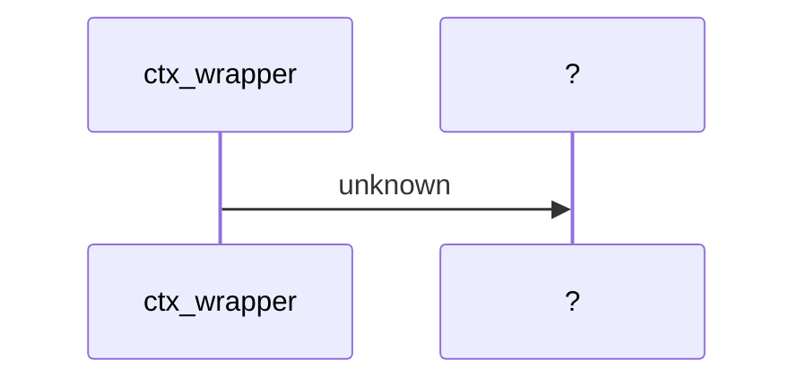
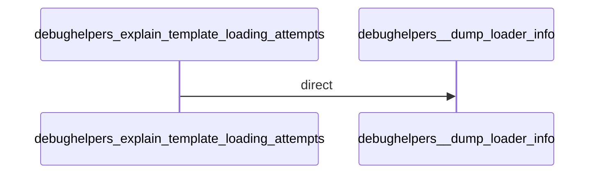
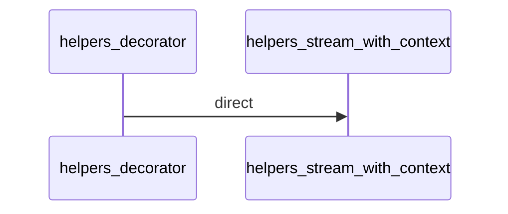
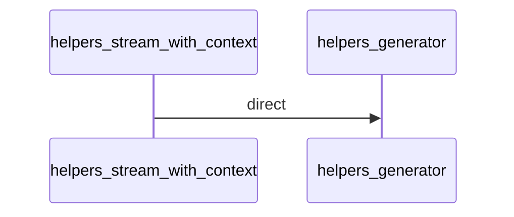
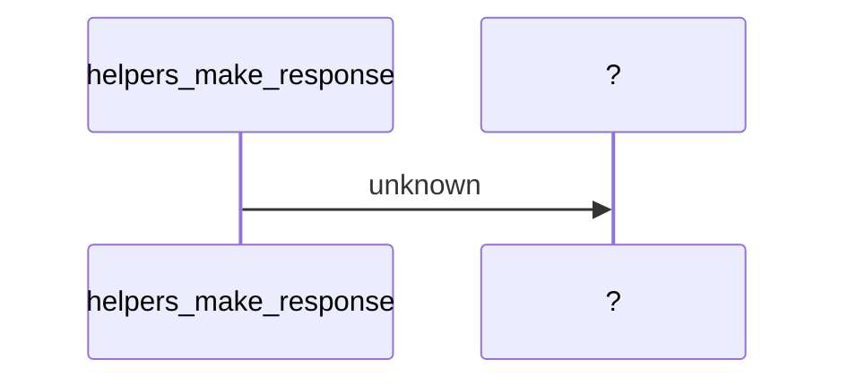
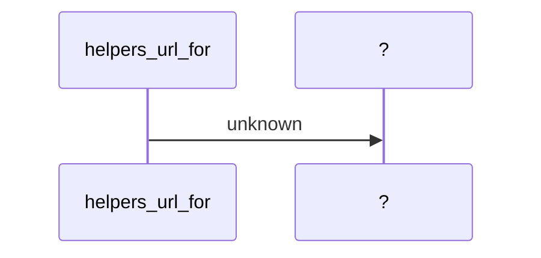
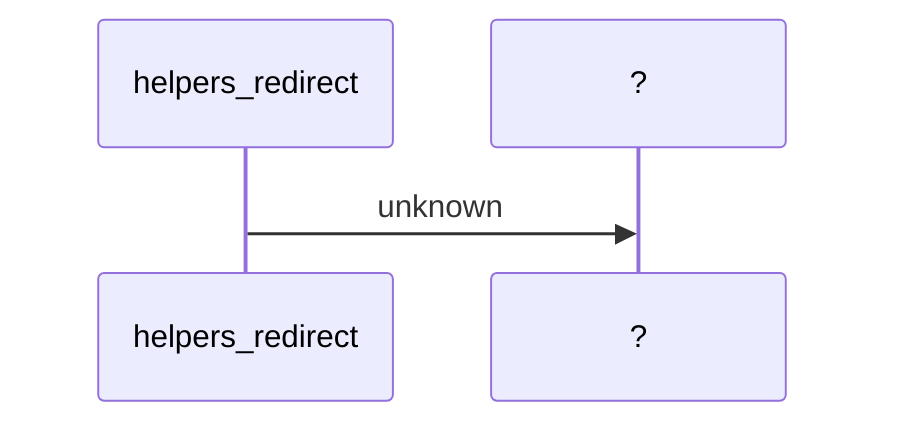
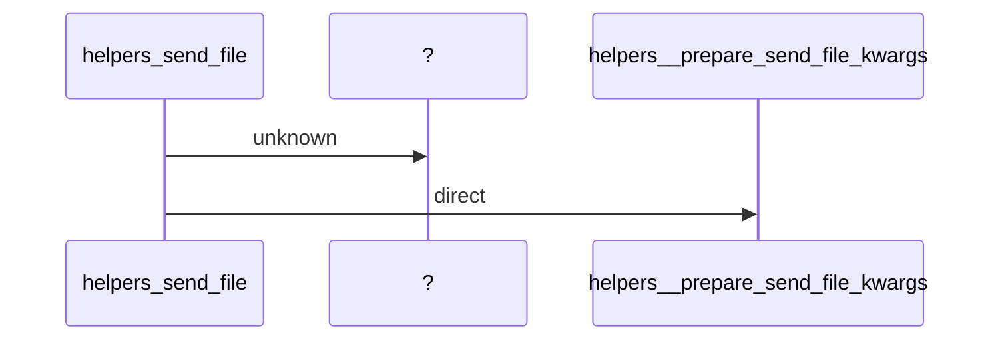
```mermaid
sequenceDiagram
    participant helpers_send_from_directory
    participant ?
    participant helpers_send_from_directory
    participant helpers__prepare_send_file_kwargs
    helpers_send_from_directory ->> ?: unknown
    helpers_send_from_directory ->> helpers__prepare_send_file_kwargs: direct
```
```mermaid
sequenceDiagram
    participant logging_create_logger
    participant logging_has_level_handler
    logging_create_logger ->> logging_has_level_handler: direct
```
```mermaid
sequenceDiagram
    participant scaffold_find_package
    participant scaffold__find_package_path
    scaffold_find_package ->> scaffold__find_package_path: direct
```
```mermaid
sequenceDiagram
    participant templating_render_template
    participant templating__render
    templating_render_template ->> templating__render: direct
```
```mermaid
sequenceDiagram
    participant templating_render_template_string
    participant templating__render
    templating_render_template_string ->> templating__render: direct
```
```mermaid
sequenceDiagram
    participant templating_generate
    participant ?
    templating_generate ->> ?: unknown
```
```mermaid
sequenceDiagram
    participant templating_stream_template
    participant templating__stream
    templating_stream_template ->> templating__stream: direct
```
```mermaid
sequenceDiagram
    participant templating_stream_template_string
    participant templating__stream
    templating_stream_template_string ->> templating__stream: direct
```
```mermaid
sequenceDiagram
    participant testing___init__
    participant testing__get_werkzeug_version
    testing___init__ ->> testing__get_werkzeug_version: direct
```
```mermaid
sequenceDiagram
    participant test_basic_test_method_route_no_methods
    participant ctx_get
    participant test_basic_test_method_route_no_methods
    participant scaffold_get
    participant test_basic_test_method_route_no_methods
    participant sessions_get
    participant test_basic_test_method_route_no_methods
    participant test_views_get
    participant test_basic_test_method_route_no_methods
    participant test_views_get
    participant test_basic_test_method_route_no_methods
    participant test_views_get
    test_basic_test_method_route_no_methods ->> ctx_get: dynamic
    test_basic_test_method_route_no_methods ->> scaffold_get: dynamic
    test_basic_test_method_route_no_methods ->> sessions_get: dynamic
    test_basic_test_method_route_no_methods ->> test_views_get: dynamic
    test_basic_test_method_route_no_methods ->> test_views_get: dynamic
    test_basic_test_method_route_no_methods ->> test_views_get: dynamic
```
```mermaid
sequenceDiagram
    participant test_basic_test_provide_automatic_options_attr
    participant ?
    participant test_basic_test_provide_automatic_options_attr
    participant ?
    test_basic_test_provide_automatic_options_attr ->> ?: unknown
    test_basic_test_provide_automatic_options_attr ->> ?: unknown
```
```mermaid
sequenceDiagram
    participant test_basic_test_provide_automatic_options_kwarg
    participant ctx_get
    participant test_basic_test_provide_automatic_options_kwarg
    participant scaffold_get
    participant test_basic_test_provide_automatic_options_kwarg
    participant sessions_get
    participant test_basic_test_provide_automatic_options_kwarg
    participant test_views_get
    participant test_basic_test_provide_automatic_options_kwarg
    participant test_views_get
    participant test_basic_test_provide_automatic_options_kwarg
    participant test_views_get
    participant test_basic_test_provide_automatic_options_kwarg
    participant ctx_get
    participant test_basic_test_provide_automatic_options_kwarg
    participant scaffold_get
    participant test_basic_test_provide_automatic_options_kwarg
    participant sessions_get
    participant test_basic_test_provide_automatic_options_kwarg
    participant test_views_get
    participant test_basic_test_provide_automatic_options_kwarg
    participant test_views_get
    participant test_basic_test_provide_automatic_options_kwarg
    participant test_views_get
    test_basic_test_provide_automatic_options_kwarg ->> ctx_get: dynamic
    test_basic_test_provide_automatic_options_kwarg ->> scaffold_get: dynamic
    test_basic_test_provide_automatic_options_kwarg ->> sessions_get: dynamic
    test_basic_test_provide_automatic_options_kwarg ->> test_views_get: dynamic
    test_basic_test_provide_automatic_options_kwarg ->> test_views_get: dynamic
    test_basic_test_provide_automatic_options_kwarg ->> test_views_get: dynamic
    test_basic_test_provide_automatic_options_kwarg ->> ctx_get: dynamic
    test_basic_test_provide_automatic_options_kwarg ->> scaffold_get: dynamic
    test_basic_test_provide_automatic_options_kwarg ->> sessions_get: dynamic
    test_basic_test_provide_automatic_options_kwarg ->> test_views_get: dynamic
    test_basic_test_provide_automatic_options_kwarg ->> test_views_get: dynamic
    test_basic_test_provide_automatic_options_kwarg ->> test_views_get: dynamic
```
```mermaid
sequenceDiagram
    participant test_basic_test_request_dispatching
    participant ctx_get
    participant test_basic_test_request_dispatching
    participant scaffold_get
    participant test_basic_test_request_dispatching
    participant sessions_get
    participant test_basic_test_request_dispatching
    participant test_views_get
    participant test_basic_test_request_dispatching
    participant test_views_get
    participant test_basic_test_request_dispatching
    participant test_views_get
    participant test_basic_test_request_dispatching
    participant ctx_get
    participant test_basic_test_request_dispatching
    participant scaffold_get
    participant test_basic_test_request_dispatching
    participant sessions_get
    participant test_basic_test_request_dispatching
    participant test_views_get
    participant test_basic_test_request_dispatching
    participant test_views_get
    participant test_basic_test_request_dispatching
    participant test_views_get
    test_basic_test_request_dispatching ->> ctx_get: dynamic
    test_basic_test_request_dispatching ->> scaffold_get: dynamic
    test_basic_test_request_dispatching ->> sessions_get: dynamic
    test_basic_test_request_dispatching ->> test_views_get: dynamic
    test_basic_test_request_dispatching ->> test_views_get: dynamic
    test_basic_test_request_dispatching ->> test_views_get: dynamic
    test_basic_test_request_dispatching ->> ctx_get: dynamic
    test_basic_test_request_dispatching ->> scaffold_get: dynamic
    test_basic_test_request_dispatching ->> sessions_get: dynamic
    test_basic_test_request_dispatching ->> test_views_get: dynamic
    test_basic_test_request_dispatching ->> test_views_get: dynamic
    test_basic_test_request_dispatching ->> test_views_get: dynamic
```
```mermaid
sequenceDiagram
    participant test_basic_test_url_mapping
    participant ctx_get
    participant test_basic_test_url_mapping
    participant scaffold_get
    participant test_basic_test_url_mapping
    participant sessions_get
    participant test_basic_test_url_mapping
    participant test_views_get
    participant test_basic_test_url_mapping
    participant test_views_get
    participant test_basic_test_url_mapping
    participant test_views_get
    participant test_basic_test_url_mapping
    participant ctx_get
    participant test_basic_test_url_mapping
    participant scaffold_get
    participant test_basic_test_url_mapping
    participant sessions_get
    participant test_basic_test_url_mapping
    participant test_views_get
    participant test_basic_test_url_mapping
    participant test_views_get
    participant test_basic_test_url_mapping
    participant test_views_get
    test_basic_test_url_mapping ->> ctx_get: dynamic
    test_basic_test_url_mapping ->> scaffold_get: dynamic
    test_basic_test_url_mapping ->> sessions_get: dynamic
    test_basic_test_url_mapping ->> test_views_get: dynamic
    test_basic_test_url_mapping ->> test_views_get: dynamic
    test_basic_test_url_mapping ->> test_views_get: dynamic
    test_basic_test_url_mapping ->> ctx_get: dynamic
    test_basic_test_url_mapping ->> scaffold_get: dynamic
    test_basic_test_url_mapping ->> sessions_get: dynamic
    test_basic_test_url_mapping ->> test_views_get: dynamic
    test_basic_test_url_mapping ->> test_views_get: dynamic
    test_basic_test_url_mapping ->> test_views_get: dynamic
```
```mermaid
sequenceDiagram
    participant test_basic_test_werkzeug_routing
    participant ctx_get
    participant test_basic_test_werkzeug_routing
    participant scaffold_get
    participant test_basic_test_werkzeug_routing
    participant sessions_get
    participant test_basic_test_werkzeug_routing
    participant test_views_get
    participant test_basic_test_werkzeug_routing
    participant test_views_get
    participant test_basic_test_werkzeug_routing
    participant test_views_get
    participant test_basic_test_werkzeug_routing
    participant ctx_get
    participant test_basic_test_werkzeug_routing
    participant scaffold_get
    participant test_basic_test_werkzeug_routing
    participant sessions_get
    participant test_basic_test_werkzeug_routing
    participant test_views_get
    participant test_basic_test_werkzeug_routing
    participant test_views_get
    participant test_basic_test_werkzeug_routing
    participant test_views_get
    test_basic_test_werkzeug_routing ->> ctx_get: dynamic
    test_basic_test_werkzeug_routing ->> scaffold_get: dynamic
    test_basic_test_werkzeug_routing ->> sessions_get: dynamic
    test_basic_test_werkzeug_routing ->> test_views_get: dynamic
    test_basic_test_werkzeug_routing ->> test_views_get: dynamic
    test_basic_test_werkzeug_routing ->> test_views_get: dynamic
    test_basic_test_werkzeug_routing ->> ctx_get: dynamic
    test_basic_test_werkzeug_routing ->> scaffold_get: dynamic
    test_basic_test_werkzeug_routing ->> sessions_get: dynamic
    test_basic_test_werkzeug_routing ->> test_views_get: dynamic
    test_basic_test_werkzeug_routing ->> test_views_get: dynamic
    test_basic_test_werkzeug_routing ->> test_views_get: dynamic
```
```mermaid
sequenceDiagram
    participant test_basic_test_endpoint_decorator
    participant ctx_get
    participant test_basic_test_endpoint_decorator
    participant scaffold_get
    participant test_basic_test_endpoint_decorator
    participant sessions_get
    participant test_basic_test_endpoint_decorator
    participant test_views_get
    participant test_basic_test_endpoint_decorator
    participant test_views_get
    participant test_basic_test_endpoint_decorator
    participant test_views_get
    participant test_basic_test_endpoint_decorator
    participant ctx_get
    participant test_basic_test_endpoint_decorator
    participant scaffold_get
    participant test_basic_test_endpoint_decorator
    participant sessions_get
    participant test_basic_test_endpoint_decorator
    participant test_views_get
    participant test_basic_test_endpoint_decorator
    participant test_views_get
    participant test_basic_test_endpoint_decorator
    participant test_views_get
    test_basic_test_endpoint_decorator ->> ctx_get: dynamic
    test_basic_test_endpoint_decorator ->> scaffold_get: dynamic
    test_basic_test_endpoint_decorator ->> sessions_get: dynamic
    test_basic_test_endpoint_decorator ->> test_views_get: dynamic
    test_basic_test_endpoint_decorator ->> test_views_get: dynamic
    test_basic_test_endpoint_decorator ->> test_views_get: dynamic
    test_basic_test_endpoint_decorator ->> ctx_get: dynamic
    test_basic_test_endpoint_decorator ->> scaffold_get: dynamic
    test_basic_test_endpoint_decorator ->> sessions_get: dynamic
    test_basic_test_endpoint_decorator ->> test_views_get: dynamic
    test_basic_test_endpoint_decorator ->> test_views_get: dynamic
    test_basic_test_endpoint_decorator ->> test_views_get: dynamic
```
```mermaid
sequenceDiagram
    participant test_basic_get
    participant ctx_get
    participant test_basic_get
    participant scaffold_get
    participant test_basic_get
    participant sessions_get
    participant test_basic_get
    participant test_views_get
    participant test_basic_get
    participant test_views_get
    participant test_basic_get
    participant test_views_get
    participant test_basic_get
    participant ctx_get
    participant test_basic_get
    participant scaffold_get
    participant test_basic_get
    participant sessions_get
    participant test_basic_get
    participant test_views_get
    participant test_basic_get
    participant test_views_get
    participant test_basic_get
    participant test_views_get
    test_basic_get ->> ctx_get: dynamic
    test_basic_get ->> scaffold_get: dynamic
    test_basic_get ->> sessions_get: dynamic
    test_basic_get ->> test_views_get: dynamic
    test_basic_get ->> test_views_get: dynamic
    test_basic_get ->> test_views_get: dynamic
    test_basic_get ->> ctx_get: dynamic
    test_basic_get ->> scaffold_get: dynamic
    test_basic_get ->> sessions_get: dynamic
    test_basic_get ->> test_views_get: dynamic
    test_basic_get ->> test_views_get: dynamic
    test_basic_get ->> test_views_get: dynamic
```
```mermaid
sequenceDiagram
    participant test_basic_test_session
    participant ctx_get
    participant test_basic_test_session
    participant scaffold_get
    participant test_basic_test_session
    participant sessions_get
    participant test_basic_test_session
    participant test_views_get
    participant test_basic_test_session
    participant test_views_get
    participant test_basic_test_session
    participant test_views_get
    test_basic_test_session ->> ctx_get: dynamic
    test_basic_test_session ->> scaffold_get: dynamic
    test_basic_test_session ->> sessions_get: dynamic
    test_basic_test_session ->> test_views_get: dynamic
    test_basic_test_session ->> test_views_get: dynamic
    test_basic_test_session ->> test_views_get: dynamic
```
```mermaid
sequenceDiagram
    participant test_basic_test_session_path
    participant ctx_get
    participant test_basic_test_session_path
    participant scaffold_get
    participant test_basic_test_session_path
    participant sessions_get
    participant test_basic_test_session_path
    participant test_views_get
    participant test_basic_test_session_path
    participant test_views_get
    participant test_basic_test_session_path
    participant test_views_get
    test_basic_test_session_path ->> ctx_get: dynamic
    test_basic_test_session_path ->> scaffold_get: dynamic
    test_basic_test_session_path ->> sessions_get: dynamic
    test_basic_test_session_path ->> test_views_get: dynamic
    test_basic_test_session_path ->> test_views_get: dynamic
    test_basic_test_session_path ->> test_views_get: dynamic
```
```mermaid
sequenceDiagram
    participant test_basic_test_session_using_application_root
    participant ctx_get
    participant test_basic_test_session_using_application_root
    participant scaffold_get
    participant test_basic_test_session_using_application_root
    participant sessions_get
    participant test_basic_test_session_using_application_root
    participant test_views_get
    participant test_basic_test_session_using_application_root
    participant test_views_get
    participant test_basic_test_session_using_application_root
    participant test_views_get
    test_basic_test_session_using_application_root ->> ctx_get: dynamic
    test_basic_test_session_using_application_root ->> scaffold_get: dynamic
    test_basic_test_session_using_application_root ->> sessions_get: dynamic
    test_basic_test_session_using_application_root ->> test_views_get: dynamic
    test_basic_test_session_using_application_root ->> test_views_get: dynamic
    test_basic_test_session_using_application_root ->> test_views_get: dynamic
```
```mermaid
sequenceDiagram
    participant test_basic_test_session_using_session_settings
    participant ctx_get
    participant test_basic_test_session_using_session_settings
    participant scaffold_get
    participant test_basic_test_session_using_session_settings
    participant sessions_get
    participant test_basic_test_session_using_session_settings
    participant test_views_get
    participant test_basic_test_session_using_session_settings
    participant test_views_get
    participant test_basic_test_session_using_session_settings
    participant test_views_get
    participant test_basic_test_session_using_session_settings
    participant ctx_get
    participant test_basic_test_session_using_session_settings
    participant scaffold_get
    participant test_basic_test_session_using_session_settings
    participant sessions_get
    participant test_basic_test_session_using_session_settings
    participant test_views_get
    participant test_basic_test_session_using_session_settings
    participant test_views_get
    participant test_basic_test_session_using_session_settings
    participant test_views_get
    test_basic_test_session_using_session_settings ->> ctx_get: dynamic
    test_basic_test_session_using_session_settings ->> scaffold_get: dynamic
    test_basic_test_session_using_session_settings ->> sessions_get: dynamic
    test_basic_test_session_using_session_settings ->> test_views_get: dynamic
    test_basic_test_session_using_session_settings ->> test_views_get: dynamic
    test_basic_test_session_using_session_settings ->> test_views_get: dynamic
    test_basic_test_session_using_session_settings ->> ctx_get: dynamic
    test_basic_test_session_using_session_settings ->> scaffold_get: dynamic
    test_basic_test_session_using_session_settings ->> sessions_get: dynamic
    test_basic_test_session_using_session_settings ->> test_views_get: dynamic
    test_basic_test_session_using_session_settings ->> test_views_get: dynamic
    test_basic_test_session_using_session_settings ->> test_views_get: dynamic
```
```mermaid
sequenceDiagram
    participant test_basic_test_session_using_samesite_attribute
    participant ctx_get
    participant test_basic_test_session_using_samesite_attribute
    participant scaffold_get
    participant test_basic_test_session_using_samesite_attribute
    participant sessions_get
    participant test_basic_test_session_using_samesite_attribute
    participant test_views_get
    participant test_basic_test_session_using_samesite_attribute
    participant test_views_get
    participant test_basic_test_session_using_samesite_attribute
    participant test_views_get
    participant test_basic_test_session_using_samesite_attribute
    participant ctx_get
    participant test_basic_test_session_using_samesite_attribute
    participant scaffold_get
    participant test_basic_test_session_using_samesite_attribute
    participant sessions_get
    participant test_basic_test_session_using_samesite_attribute
    participant test_views_get
    participant test_basic_test_session_using_samesite_attribute
    participant test_views_get
    participant test_basic_test_session_using_samesite_attribute
    participant test_views_get
    participant test_basic_test_session_using_samesite_attribute
    participant ctx_get
    participant test_basic_test_session_using_samesite_attribute
    participant scaffold_get
    participant test_basic_test_session_using_samesite_attribute
    participant sessions_get
    participant test_basic_test_session_using_samesite_attribute
    participant test_views_get
    participant test_basic_test_session_using_samesite_attribute
    participant test_views_get
    participant test_basic_test_session_using_samesite_attribute
    participant test_views_get
    participant test_basic_test_session_using_samesite_attribute
    participant ctx_get
    participant test_basic_test_session_using_samesite_attribute
    participant scaffold_get
    participant test_basic_test_session_using_samesite_attribute
    participant sessions_get
    participant test_basic_test_session_using_samesite_attribute
    participant test_views_get
    participant test_basic_test_session_using_samesite_attribute
    participant test_views_get
    participant test_basic_test_session_using_samesite_attribute
    participant test_views_get
    test_basic_test_session_using_samesite_attribute ->> ctx_get: dynamic
    test_basic_test_session_using_samesite_attribute ->> scaffold_get: dynamic
    test_basic_test_session_using_samesite_attribute ->> sessions_get: dynamic
    test_basic_test_session_using_samesite_attribute ->> test_views_get: dynamic
    test_basic_test_session_using_samesite_attribute ->> test_views_get: dynamic
    test_basic_test_session_using_samesite_attribute ->> test_views_get: dynamic
    test_basic_test_session_using_samesite_attribute ->> ctx_get: dynamic
    test_basic_test_session_using_samesite_attribute ->> scaffold_get: dynamic
    test_basic_test_session_using_samesite_attribute ->> sessions_get: dynamic
    test_basic_test_session_using_samesite_attribute ->> test_views_get: dynamic
    test_basic_test_session_using_samesite_attribute ->> test_views_get: dynamic
    test_basic_test_session_using_samesite_attribute ->> test_views_get: dynamic
    test_basic_test_session_using_samesite_attribute ->> ctx_get: dynamic
    test_basic_test_session_using_samesite_attribute ->> scaffold_get: dynamic
    test_basic_test_session_using_samesite_attribute ->> sessions_get: dynamic
    test_basic_test_session_using_samesite_attribute ->> test_views_get: dynamic
    test_basic_test_session_using_samesite_attribute ->> test_views_get: dynamic
    test_basic_test_session_using_samesite_attribute ->> test_views_get: dynamic
    test_basic_test_session_using_samesite_attribute ->> ctx_get: dynamic
    test_basic_test_session_using_samesite_attribute ->> scaffold_get: dynamic
    test_basic_test_session_using_samesite_attribute ->> sessions_get: dynamic
    test_basic_test_session_using_samesite_attribute ->> test_views_get: dynamic
    test_basic_test_session_using_samesite_attribute ->> test_views_get: dynamic
    test_basic_test_session_using_samesite_attribute ->> test_views_get: dynamic
```
```mermaid
sequenceDiagram
    participant test_basic_test_missing_session
    participant ctx_get
    participant test_basic_test_missing_session
    participant scaffold_get
    participant test_basic_test_missing_session
    participant sessions_get
    participant test_basic_test_missing_session
    participant test_views_get
    participant test_basic_test_missing_session
    participant test_views_get
    participant test_basic_test_missing_session
    participant test_views_get
    participant test_basic_test_missing_session
    participant test_basic_expect_exception
    participant test_basic_test_missing_session
    participant test_basic_expect_exception
    test_basic_test_missing_session ->> ctx_get: dynamic
    test_basic_test_missing_session ->> scaffold_get: dynamic
    test_basic_test_missing_session ->> sessions_get: dynamic
    test_basic_test_missing_session ->> test_views_get: dynamic
    test_basic_test_missing_session ->> test_views_get: dynamic
    test_basic_test_missing_session ->> test_views_get: dynamic
    test_basic_test_missing_session ->> test_basic_expect_exception: direct
    test_basic_test_missing_session ->> test_basic_expect_exception: direct
```
```mermaid
sequenceDiagram
    participant test_basic_get_session
    participant ctx_get
    participant test_basic_get_session
    participant scaffold_get
    participant test_basic_get_session
    participant sessions_get
    participant test_basic_get_session
    participant test_views_get
    participant test_basic_get_session
    participant test_views_get
    participant test_basic_get_session
    participant test_views_get
    test_basic_get_session ->> ctx_get: dynamic
    test_basic_get_session ->> scaffold_get: dynamic
    test_basic_get_session ->> sessions_get: dynamic
    test_basic_get_session ->> test_views_get: dynamic
    test_basic_get_session ->> test_views_get: dynamic
    test_basic_get_session ->> test_views_get: dynamic
```
```mermaid
sequenceDiagram
    participant test_basic_test_session_secret_key_fallbacks
    participant ctx_get
    participant test_basic_test_session_secret_key_fallbacks
    participant scaffold_get
    participant test_basic_test_session_secret_key_fallbacks
    participant sessions_get
    participant test_basic_test_session_secret_key_fallbacks
    participant test_views_get
    participant test_basic_test_session_secret_key_fallbacks
    participant test_views_get
    participant test_basic_test_session_secret_key_fallbacks
    participant test_views_get
    participant test_basic_test_session_secret_key_fallbacks
    participant ctx_get
    participant test_basic_test_session_secret_key_fallbacks
    participant scaffold_get
    participant test_basic_test_session_secret_key_fallbacks
    participant sessions_get
    participant test_basic_test_session_secret_key_fallbacks
    participant test_views_get
    participant test_basic_test_session_secret_key_fallbacks
    participant test_views_get
    participant test_basic_test_session_secret_key_fallbacks
    participant test_views_get
    participant test_basic_test_session_secret_key_fallbacks
    participant ctx_get
    participant test_basic_test_session_secret_key_fallbacks
    participant scaffold_get
    participant test_basic_test_session_secret_key_fallbacks
    participant sessions_get
    participant test_basic_test_session_secret_key_fallbacks
    participant test_views_get
    participant test_basic_test_session_secret_key_fallbacks
    participant test_views_get
    participant test_basic_test_session_secret_key_fallbacks
    participant test_views_get
    test_basic_test_session_secret_key_fallbacks ->> ctx_get: dynamic
    test_basic_test_session_secret_key_fallbacks ->> scaffold_get: dynamic
    test_basic_test_session_secret_key_fallbacks ->> sessions_get: dynamic
    test_basic_test_session_secret_key_fallbacks ->> test_views_get: dynamic
    test_basic_test_session_secret_key_fallbacks ->> test_views_get: dynamic
    test_basic_test_session_secret_key_fallbacks ->> test_views_get: dynamic
    test_basic_test_session_secret_key_fallbacks ->> ctx_get: dynamic
    test_basic_test_session_secret_key_fallbacks ->> scaffold_get: dynamic
    test_basic_test_session_secret_key_fallbacks ->> sessions_get: dynamic
    test_basic_test_session_secret_key_fallbacks ->> test_views_get: dynamic
    test_basic_test_session_secret_key_fallbacks ->> test_views_get: dynamic
    test_basic_test_session_secret_key_fallbacks ->> test_views_get: dynamic
    test_basic_test_session_secret_key_fallbacks ->> ctx_get: dynamic
    test_basic_test_session_secret_key_fallbacks ->> scaffold_get: dynamic
    test_basic_test_session_secret_key_fallbacks ->> sessions_get: dynamic
    test_basic_test_session_secret_key_fallbacks ->> test_views_get: dynamic
    test_basic_test_session_secret_key_fallbacks ->> test_views_get: dynamic
    test_basic_test_session_secret_key_fallbacks ->> test_views_get: dynamic
```
```mermaid
sequenceDiagram
    participant test_basic_test_session_expiration
    participant ctx_get
    participant test_basic_test_session_expiration
    participant scaffold_get
    participant test_basic_test_session_expiration
    participant sessions_get
    participant test_basic_test_session_expiration
    participant test_views_get
    participant test_basic_test_session_expiration
    participant test_views_get
    participant test_basic_test_session_expiration
    participant test_views_get
    participant test_basic_test_session_expiration
    participant ctx_get
    participant test_basic_test_session_expiration
    participant scaffold_get
    participant test_basic_test_session_expiration
    participant sessions_get
    participant test_basic_test_session_expiration
    participant test_views_get
    participant test_basic_test_session_expiration
    participant test_views_get
    participant test_basic_test_session_expiration
    participant test_views_get
    participant test_basic_test_session_expiration
    participant ctx_get
    participant test_basic_test_session_expiration
    participant scaffold_get
    participant test_basic_test_session_expiration
    participant sessions_get
    participant test_basic_test_session_expiration
    participant test_views_get
    participant test_basic_test_session_expiration
    participant test_views_get
    participant test_basic_test_session_expiration
    participant test_views_get
    test_basic_test_session_expiration ->> ctx_get: dynamic
    test_basic_test_session_expiration ->> scaffold_get: dynamic
    test_basic_test_session_expiration ->> sessions_get: dynamic
    test_basic_test_session_expiration ->> test_views_get: dynamic
    test_basic_test_session_expiration ->> test_views_get: dynamic
    test_basic_test_session_expiration ->> test_views_get: dynamic
    test_basic_test_session_expiration ->> ctx_get: dynamic
    test_basic_test_session_expiration ->> scaffold_get: dynamic
    test_basic_test_session_expiration ->> sessions_get: dynamic
    test_basic_test_session_expiration ->> test_views_get: dynamic
    test_basic_test_session_expiration ->> test_views_get: dynamic
    test_basic_test_session_expiration ->> test_views_get: dynamic
    test_basic_test_session_expiration ->> ctx_get: dynamic
    test_basic_test_session_expiration ->> scaffold_get: dynamic
    test_basic_test_session_expiration ->> sessions_get: dynamic
    test_basic_test_session_expiration ->> test_views_get: dynamic
    test_basic_test_session_expiration ->> test_views_get: dynamic
    test_basic_test_session_expiration ->> test_views_get: dynamic
```
```mermaid
sequenceDiagram
    participant test_basic_test_session_stored_last
    participant ctx_get
    participant test_basic_test_session_stored_last
    participant scaffold_get
    participant test_basic_test_session_stored_last
    participant sessions_get
    participant test_basic_test_session_stored_last
    participant test_views_get
    participant test_basic_test_session_stored_last
    participant test_views_get
    participant test_basic_test_session_stored_last
    participant test_views_get
    participant test_basic_test_session_stored_last
    participant ctx_get
    participant test_basic_test_session_stored_last
    participant scaffold_get
    participant test_basic_test_session_stored_last
    participant sessions_get
    participant test_basic_test_session_stored_last
    participant test_views_get
    participant test_basic_test_session_stored_last
    participant test_views_get
    participant test_basic_test_session_stored_last
    participant test_views_get
    test_basic_test_session_stored_last ->> ctx_get: dynamic
    test_basic_test_session_stored_last ->> scaffold_get: dynamic
    test_basic_test_session_stored_last ->> sessions_get: dynamic
    test_basic_test_session_stored_last ->> test_views_get: dynamic
    test_basic_test_session_stored_last ->> test_views_get: dynamic
    test_basic_test_session_stored_last ->> test_views_get: dynamic
    test_basic_test_session_stored_last ->> ctx_get: dynamic
    test_basic_test_session_stored_last ->> scaffold_get: dynamic
    test_basic_test_session_stored_last ->> sessions_get: dynamic
    test_basic_test_session_stored_last ->> test_views_get: dynamic
    test_basic_test_session_stored_last ->> test_views_get: dynamic
    test_basic_test_session_stored_last ->> test_views_get: dynamic
```
```mermaid
sequenceDiagram
    participant test_basic_test_session_special_types
    participant ctx_get
    participant test_basic_test_session_special_types
    participant scaffold_get
    participant test_basic_test_session_special_types
    participant sessions_get
    participant test_basic_test_session_special_types
    participant test_views_get
    participant test_basic_test_session_special_types
    participant test_views_get
    participant test_basic_test_session_special_types
    participant test_views_get
    test_basic_test_session_special_types ->> ctx_get: dynamic
    test_basic_test_session_special_types ->> scaffold_get: dynamic
    test_basic_test_session_special_types ->> sessions_get: dynamic
    test_basic_test_session_special_types ->> test_views_get: dynamic
    test_basic_test_session_special_types ->> test_views_get: dynamic
    test_basic_test_session_special_types ->> test_views_get: dynamic
```
```mermaid
sequenceDiagram
    participant test_basic_bump
    participant ctx_get
    participant test_basic_bump
    participant scaffold_get
    participant test_basic_bump
    participant sessions_get
    participant test_basic_bump
    participant test_views_get
    participant test_basic_bump
    participant test_views_get
    participant test_basic_bump
    participant test_views_get
    test_basic_bump ->> ctx_get: dynamic
    test_basic_bump ->> scaffold_get: dynamic
    test_basic_bump ->> sessions_get: dynamic
    test_basic_bump ->> test_views_get: dynamic
    test_basic_bump ->> test_views_get: dynamic
    test_basic_bump ->> test_views_get: dynamic
```
```mermaid
sequenceDiagram
    participant test_basic_run_test
    participant ctx_get
    participant test_basic_run_test
    participant scaffold_get
    participant test_basic_run_test
    participant sessions_get
    participant test_basic_run_test
    participant test_views_get
    participant test_basic_run_test
    participant test_views_get
    participant test_basic_run_test
    participant test_views_get
    participant test_basic_run_test
    participant ctx_get
    participant test_basic_run_test
    participant scaffold_get
    participant test_basic_run_test
    participant sessions_get
    participant test_basic_run_test
    participant test_views_get
    participant test_basic_run_test
    participant test_views_get
    participant test_basic_run_test
    participant test_views_get
    participant test_basic_run_test
    participant ctx_get
    participant test_basic_run_test
    participant scaffold_get
    participant test_basic_run_test
    participant sessions_get
    participant test_basic_run_test
    participant test_views_get
    participant test_basic_run_test
    participant test_views_get
    participant test_basic_run_test
    participant test_views_get
    participant test_basic_run_test
    participant ctx_get
    participant test_basic_run_test
    participant scaffold_get
    participant test_basic_run_test
    participant sessions_get
    participant test_basic_run_test
    participant test_views_get
    participant test_basic_run_test
    participant test_views_get
    participant test_basic_run_test
    participant test_views_get
    participant test_basic_run_test
    participant ctx_get
    participant test_basic_run_test
    participant scaffold_get
    participant test_basic_run_test
    participant sessions_get
    participant test_basic_run_test
    participant test_views_get
    participant test_basic_run_test
    participant test_views_get
    participant test_basic_run_test
    participant test_views_get
    test_basic_run_test ->> ctx_get: dynamic
    test_basic_run_test ->> scaffold_get: dynamic
    test_basic_run_test ->> sessions_get: dynamic
    test_basic_run_test ->> test_views_get: dynamic
    test_basic_run_test ->> test_views_get: dynamic
    test_basic_run_test ->> test_views_get: dynamic
    test_basic_run_test ->> ctx_get: dynamic
    test_basic_run_test ->> scaffold_get: dynamic
    test_basic_run_test ->> sessions_get: dynamic
    test_basic_run_test ->> test_views_get: dynamic
    test_basic_run_test ->> test_views_get: dynamic
    test_basic_run_test ->> test_views_get: dynamic
    test_basic_run_test ->> ctx_get: dynamic
    test_basic_run_test ->> scaffold_get: dynamic
    test_basic_run_test ->> sessions_get: dynamic
    test_basic_run_test ->> test_views_get: dynamic
    test_basic_run_test ->> test_views_get: dynamic
    test_basic_run_test ->> test_views_get: dynamic
    test_basic_run_test ->> ctx_get: dynamic
    test_basic_run_test ->> scaffold_get: dynamic
    test_basic_run_test ->> sessions_get: dynamic
    test_basic_run_test ->> test_views_get: dynamic
    test_basic_run_test ->> test_views_get: dynamic
    test_basic_run_test ->> test_views_get: dynamic
    test_basic_run_test ->> ctx_get: dynamic
    test_basic_run_test ->> scaffold_get: dynamic
    test_basic_run_test ->> sessions_get: dynamic
    test_basic_run_test ->> test_views_get: dynamic
    test_basic_run_test ->> test_views_get: dynamic
    test_basic_run_test ->> test_views_get: dynamic
```
```mermaid
sequenceDiagram
    participant test_basic_test_session_cookie_setting
    participant test_basic_run_test
    participant test_basic_test_session_cookie_setting
    participant test_basic_run_test
    participant test_basic_test_session_cookie_setting
    participant test_basic_run_test
    participant test_basic_test_session_cookie_setting
    participant test_basic_run_test
    test_basic_test_session_cookie_setting ->> test_basic_run_test: direct
    test_basic_test_session_cookie_setting ->> test_basic_run_test: direct
    test_basic_test_session_cookie_setting ->> test_basic_run_test: direct
    test_basic_test_session_cookie_setting ->> test_basic_run_test: direct
```
```mermaid
sequenceDiagram
    participant test_basic_setdefault
    participant ctx_setdefault
    participant test_basic_setdefault
    participant sessions_setdefault
    test_basic_setdefault ->> ctx_setdefault: dynamic
    test_basic_setdefault ->> sessions_setdefault: dynamic
```
```mermaid
sequenceDiagram
    participant test_basic_clear
    participant ?
    test_basic_clear ->> ?: unknown
```
```mermaid
sequenceDiagram
    participant test_basic_expect
    participant ctx_get
    participant test_basic_expect
    participant scaffold_get
    participant test_basic_expect
    participant sessions_get
    participant test_basic_expect
    participant test_views_get
    participant test_basic_expect
    participant test_views_get
    participant test_basic_expect
    participant test_views_get
    test_basic_expect ->> ctx_get: dynamic
    test_basic_expect ->> scaffold_get: dynamic
    test_basic_expect ->> sessions_get: dynamic
    test_basic_expect ->> test_views_get: dynamic
    test_basic_expect ->> test_views_get: dynamic
    test_basic_expect ->> test_views_get: dynamic
```
```mermaid
sequenceDiagram
    participant test_basic_test_session_vary_cookie
    participant test_basic_expect
    participant test_basic_test_session_vary_cookie
    participant test_basic_expect
    participant test_basic_test_session_vary_cookie
    participant test_basic_expect
    participant test_basic_test_session_vary_cookie
    participant test_basic_expect
    participant test_basic_test_session_vary_cookie
    participant test_basic_expect
    participant test_basic_test_session_vary_cookie
    participant test_basic_expect
    participant test_basic_test_session_vary_cookie
    participant test_basic_expect
    participant test_basic_test_session_vary_cookie
    participant test_basic_expect
    test_basic_test_session_vary_cookie ->> test_basic_expect: direct
    test_basic_test_session_vary_cookie ->> test_basic_expect: direct
    test_basic_test_session_vary_cookie ->> test_basic_expect: direct
    test_basic_test_session_vary_cookie ->> test_basic_expect: direct
    test_basic_test_session_vary_cookie ->> test_basic_expect: direct
    test_basic_test_session_vary_cookie ->> test_basic_expect: direct
    test_basic_test_session_vary_cookie ->> test_basic_expect: direct
    test_basic_test_session_vary_cookie ->> test_basic_expect: direct
```
```mermaid
sequenceDiagram
    participant test_basic_login
    participant ctx_get
    participant test_basic_login
    participant scaffold_get
    participant test_basic_login
    participant sessions_get
    participant test_basic_login
    participant test_views_get
    participant test_basic_login
    participant test_views_get
    participant test_basic_login
    participant test_views_get
    test_basic_login ->> ctx_get: dynamic
    test_basic_login ->> scaffold_get: dynamic
    test_basic_login ->> sessions_get: dynamic
    test_basic_login ->> test_views_get: dynamic
    test_basic_login ->> test_views_get: dynamic
    test_basic_login ->> test_views_get: dynamic
```
```mermaid
sequenceDiagram
    participant test_basic_ignored
    participant ctx_get
    participant test_basic_ignored
    participant scaffold_get
    participant test_basic_ignored
    participant sessions_get
    participant test_basic_ignored
    participant test_views_get
    participant test_basic_ignored
    participant test_views_get
    participant test_basic_ignored
    participant test_views_get
    test_basic_ignored ->> ctx_get: dynamic
    test_basic_ignored ->> scaffold_get: dynamic
    test_basic_ignored ->> sessions_get: dynamic
    test_basic_ignored ->> test_views_get: dynamic
    test_basic_ignored ->> test_views_get: dynamic
    test_basic_ignored ->> test_views_get: dynamic
```
```mermaid
sequenceDiagram
    participant test_basic_test_session_refresh_vary
    participant ctx_get
    participant test_basic_test_session_refresh_vary
    participant scaffold_get
    participant test_basic_test_session_refresh_vary
    participant sessions_get
    participant test_basic_test_session_refresh_vary
    participant test_views_get
    participant test_basic_test_session_refresh_vary
    participant test_views_get
    participant test_basic_test_session_refresh_vary
    participant test_views_get
    participant test_basic_test_session_refresh_vary
    participant ctx_get
    participant test_basic_test_session_refresh_vary
    participant scaffold_get
    participant test_basic_test_session_refresh_vary
    participant sessions_get
    participant test_basic_test_session_refresh_vary
    participant test_views_get
    participant test_basic_test_session_refresh_vary
    participant test_views_get
    participant test_basic_test_session_refresh_vary
    participant test_views_get
    test_basic_test_session_refresh_vary ->> ctx_get: dynamic
    test_basic_test_session_refresh_vary ->> scaffold_get: dynamic
    test_basic_test_session_refresh_vary ->> sessions_get: dynamic
    test_basic_test_session_refresh_vary ->> test_views_get: dynamic
    test_basic_test_session_refresh_vary ->> test_views_get: dynamic
    test_basic_test_session_refresh_vary ->> test_views_get: dynamic
    test_basic_test_session_refresh_vary ->> ctx_get: dynamic
    test_basic_test_session_refresh_vary ->> scaffold_get: dynamic
    test_basic_test_session_refresh_vary ->> sessions_get: dynamic
    test_basic_test_session_refresh_vary ->> test_views_get: dynamic
    test_basic_test_session_refresh_vary ->> test_views_get: dynamic
    test_basic_test_session_refresh_vary ->> test_views_get: dynamic
```
```mermaid
sequenceDiagram
    participant test_basic_test_extended_flashing
    participant ctx_get
    participant test_basic_test_extended_flashing
    participant scaffold_get
    participant test_basic_test_extended_flashing
    participant sessions_get
    participant test_basic_test_extended_flashing
    participant test_views_get
    participant test_basic_test_extended_flashing
    participant test_views_get
    participant test_basic_test_extended_flashing
    participant test_views_get
    participant test_basic_test_extended_flashing
    participant ctx_get
    participant test_basic_test_extended_flashing
    participant scaffold_get
    participant test_basic_test_extended_flashing
    participant sessions_get
    participant test_basic_test_extended_flashing
    participant test_views_get
    participant test_basic_test_extended_flashing
    participant test_views_get
    participant test_basic_test_extended_flashing
    participant test_views_get
    participant test_basic_test_extended_flashing
    participant ctx_get
    participant test_basic_test_extended_flashing
    participant scaffold_get
    participant test_basic_test_extended_flashing
    participant sessions_get
    participant test_basic_test_extended_flashing
    participant test_views_get
    participant test_basic_test_extended_flashing
    participant test_views_get
    participant test_basic_test_extended_flashing
    participant test_views_get
    participant test_basic_test_extended_flashing
    participant ctx_get
    participant test_basic_test_extended_flashing
    participant scaffold_get
    participant test_basic_test_extended_flashing
    participant sessions_get
    participant test_basic_test_extended_flashing
    participant test_views_get
    participant test_basic_test_extended_flashing
    participant test_views_get
    participant test_basic_test_extended_flashing
    participant test_views_get
    participant test_basic_test_extended_flashing
    participant ctx_get
    participant test_basic_test_extended_flashing
    participant scaffold_get
    participant test_basic_test_extended_flashing
    participant sessions_get
    participant test_basic_test_extended_flashing
    participant test_views_get
    participant test_basic_test_extended_flashing
    participant test_views_get
    participant test_basic_test_extended_flashing
    participant test_views_get
    participant test_basic_test_extended_flashing
    participant ctx_get
    participant test_basic_test_extended_flashing
    participant scaffold_get
    participant test_basic_test_extended_flashing
    participant sessions_get
    participant test_basic_test_extended_flashing
    participant test_views_get
    participant test_basic_test_extended_flashing
    participant test_views_get
    participant test_basic_test_extended_flashing
    participant test_views_get
    participant test_basic_test_extended_flashing
    participant ctx_get
    participant test_basic_test_extended_flashing
    participant scaffold_get
    participant test_basic_test_extended_flashing
    participant sessions_get
    participant test_basic_test_extended_flashing
    participant test_views_get
    participant test_basic_test_extended_flashing
    participant test_views_get
    participant test_basic_test_extended_flashing
    participant test_views_get
    participant test_basic_test_extended_flashing
    participant ctx_get
    participant test_basic_test_extended_flashing
    participant scaffold_get
    participant test_basic_test_extended_flashing
    participant sessions_get
    participant test_basic_test_extended_flashing
    participant test_views_get
    participant test_basic_test_extended_flashing
    participant test_views_get
    participant test_basic_test_extended_flashing
    participant test_views_get
    test_basic_test_extended_flashing ->> ctx_get: dynamic
    test_basic_test_extended_flashing ->> scaffold_get: dynamic
    test_basic_test_extended_flashing ->> sessions_get: dynamic
    test_basic_test_extended_flashing ->> test_views_get: dynamic
    test_basic_test_extended_flashing ->> test_views_get: dynamic
    test_basic_test_extended_flashing ->> test_views_get: dynamic
    test_basic_test_extended_flashing ->> ctx_get: dynamic
    test_basic_test_extended_flashing ->> scaffold_get: dynamic
    test_basic_test_extended_flashing ->> sessions_get: dynamic
    test_basic_test_extended_flashing ->> test_views_get: dynamic
    test_basic_test_extended_flashing ->> test_views_get: dynamic
    test_basic_test_extended_flashing ->> test_views_get: dynamic
    test_basic_test_extended_flashing ->> ctx_get: dynamic
    test_basic_test_extended_flashing ->> scaffold_get: dynamic
    test_basic_test_extended_flashing ->> sessions_get: dynamic
    test_basic_test_extended_flashing ->> test_views_get: dynamic
    test_basic_test_extended_flashing ->> test_views_get: dynamic
    test_basic_test_extended_flashing ->> test_views_get: dynamic
    test_basic_test_extended_flashing ->> ctx_get: dynamic
    test_basic_test_extended_flashing ->> scaffold_get: dynamic
    test_basic_test_extended_flashing ->> sessions_get: dynamic
    test_basic_test_extended_flashing ->> test_views_get: dynamic
    test_basic_test_extended_flashing ->> test_views_get: dynamic
    test_basic_test_extended_flashing ->> test_views_get: dynamic
    test_basic_test_extended_flashing ->> ctx_get: dynamic
    test_basic_test_extended_flashing ->> scaffold_get: dynamic
    test_basic_test_extended_flashing ->> sessions_get: dynamic
    test_basic_test_extended_flashing ->> test_views_get: dynamic
    test_basic_test_extended_flashing ->> test_views_get: dynamic
    test_basic_test_extended_flashing ->> test_views_get: dynamic
    test_basic_test_extended_flashing ->> ctx_get: dynamic
    test_basic_test_extended_flashing ->> scaffold_get: dynamic
    test_basic_test_extended_flashing ->> sessions_get: dynamic
    test_basic_test_extended_flashing ->> test_views_get: dynamic
    test_basic_test_extended_flashing ->> test_views_get: dynamic
    test_basic_test_extended_flashing ->> test_views_get: dynamic
    test_basic_test_extended_flashing ->> ctx_get: dynamic
    test_basic_test_extended_flashing ->> scaffold_get: dynamic
    test_basic_test_extended_flashing ->> sessions_get: dynamic
    test_basic_test_extended_flashing ->> test_views_get: dynamic
    test_basic_test_extended_flashing ->> test_views_get: dynamic
    test_basic_test_extended_flashing ->> test_views_get: dynamic
    test_basic_test_extended_flashing ->> ctx_get: dynamic
    test_basic_test_extended_flashing ->> scaffold_get: dynamic
    test_basic_test_extended_flashing ->> sessions_get: dynamic
    test_basic_test_extended_flashing ->> test_views_get: dynamic
    test_basic_test_extended_flashing ->> test_views_get: dynamic
    test_basic_test_extended_flashing ->> test_views_get: dynamic
```
```mermaid
sequenceDiagram
    participant test_basic_test_request_processing
    participant ctx_get
    participant test_basic_test_request_processing
    participant scaffold_get
    participant test_basic_test_request_processing
    participant sessions_get
    participant test_basic_test_request_processing
    participant test_views_get
    participant test_basic_test_request_processing
    participant test_views_get
    participant test_basic_test_request_processing
    participant test_views_get
    test_basic_test_request_processing ->> ctx_get: dynamic
    test_basic_test_request_processing ->> scaffold_get: dynamic
    test_basic_test_request_processing ->> sessions_get: dynamic
    test_basic_test_request_processing ->> test_views_get: dynamic
    test_basic_test_request_processing ->> test_views_get: dynamic
    test_basic_test_request_processing ->> test_views_get: dynamic
```
```mermaid
sequenceDiagram
    participant test_basic_test_after_request_processing
    participant ctx_get
    participant test_basic_test_after_request_processing
    participant scaffold_get
    participant test_basic_test_after_request_processing
    participant sessions_get
    participant test_basic_test_after_request_processing
    participant test_views_get
    participant test_basic_test_after_request_processing
    participant test_views_get
    participant test_basic_test_after_request_processing
    participant test_views_get
    test_basic_test_after_request_processing ->> ctx_get: dynamic
    test_basic_test_after_request_processing ->> scaffold_get: dynamic
    test_basic_test_after_request_processing ->> sessions_get: dynamic
    test_basic_test_after_request_processing ->> test_views_get: dynamic
    test_basic_test_after_request_processing ->> test_views_get: dynamic
    test_basic_test_after_request_processing ->> test_views_get: dynamic
```
```mermaid
sequenceDiagram
    participant test_basic_test_teardown_request_handler
    participant ctx_get
    participant test_basic_test_teardown_request_handler
    participant scaffold_get
    participant test_basic_test_teardown_request_handler
    participant sessions_get
    participant test_basic_test_teardown_request_handler
    participant test_views_get
    participant test_basic_test_teardown_request_handler
    participant test_views_get
    participant test_basic_test_teardown_request_handler
    participant test_views_get
    test_basic_test_teardown_request_handler ->> ctx_get: dynamic
    test_basic_test_teardown_request_handler ->> scaffold_get: dynamic
    test_basic_test_teardown_request_handler ->> sessions_get: dynamic
    test_basic_test_teardown_request_handler ->> test_views_get: dynamic
    test_basic_test_teardown_request_handler ->> test_views_get: dynamic
    test_basic_test_teardown_request_handler ->> test_views_get: dynamic
```
```mermaid
sequenceDiagram
    participant test_basic_test_teardown_request_handler_debug_mode
    participant ctx_get
    participant test_basic_test_teardown_request_handler_debug_mode
    participant scaffold_get
    participant test_basic_test_teardown_request_handler_debug_mode
    participant sessions_get
    participant test_basic_test_teardown_request_handler_debug_mode
    participant test_views_get
    participant test_basic_test_teardown_request_handler_debug_mode
    participant test_views_get
    participant test_basic_test_teardown_request_handler_debug_mode
    participant test_views_get
    test_basic_test_teardown_request_handler_debug_mode ->> ctx_get: dynamic
    test_basic_test_teardown_request_handler_debug_mode ->> scaffold_get: dynamic
    test_basic_test_teardown_request_handler_debug_mode ->> sessions_get: dynamic
    test_basic_test_teardown_request_handler_debug_mode ->> test_views_get: dynamic
    test_basic_test_teardown_request_handler_debug_mode ->> test_views_get: dynamic
    test_basic_test_teardown_request_handler_debug_mode ->> test_views_get: dynamic
```
```mermaid
sequenceDiagram
    participant test_basic_test_teardown_request_handler_error
    participant ctx_get
    participant test_basic_test_teardown_request_handler_error
    participant scaffold_get
    participant test_basic_test_teardown_request_handler_error
    participant sessions_get
    participant test_basic_test_teardown_request_handler_error
    participant test_views_get
    participant test_basic_test_teardown_request_handler_error
    participant test_views_get
    participant test_basic_test_teardown_request_handler_error
    participant test_views_get
    test_basic_test_teardown_request_handler_error ->> ctx_get: dynamic
    test_basic_test_teardown_request_handler_error ->> scaffold_get: dynamic
    test_basic_test_teardown_request_handler_error ->> sessions_get: dynamic
    test_basic_test_teardown_request_handler_error ->> test_views_get: dynamic
    test_basic_test_teardown_request_handler_error ->> test_views_get: dynamic
    test_basic_test_teardown_request_handler_error ->> test_views_get: dynamic
```
```mermaid
sequenceDiagram
    participant test_basic_test_before_after_request_order
    participant ctx_get
    participant test_basic_test_before_after_request_order
    participant scaffold_get
    participant test_basic_test_before_after_request_order
    participant sessions_get
    participant test_basic_test_before_after_request_order
    participant test_views_get
    participant test_basic_test_before_after_request_order
    participant test_views_get
    participant test_basic_test_before_after_request_order
    participant test_views_get
    test_basic_test_before_after_request_order ->> ctx_get: dynamic
    test_basic_test_before_after_request_order ->> scaffold_get: dynamic
    test_basic_test_before_after_request_order ->> sessions_get: dynamic
    test_basic_test_before_after_request_order ->> test_views_get: dynamic
    test_basic_test_before_after_request_order ->> test_views_get: dynamic
    test_basic_test_before_after_request_order ->> test_views_get: dynamic
```
```mermaid
sequenceDiagram
    participant test_basic_test_error_handling
    participant ctx_get
    participant test_basic_test_error_handling
    participant scaffold_get
    participant test_basic_test_error_handling
    participant sessions_get
    participant test_basic_test_error_handling
    participant test_views_get
    participant test_basic_test_error_handling
    participant test_views_get
    participant test_basic_test_error_handling
    participant test_views_get
    participant test_basic_test_error_handling
    participant ctx_get
    participant test_basic_test_error_handling
    participant scaffold_get
    participant test_basic_test_error_handling
    participant sessions_get
    participant test_basic_test_error_handling
    participant test_views_get
    participant test_basic_test_error_handling
    participant test_views_get
    participant test_basic_test_error_handling
    participant test_views_get
    participant test_basic_test_error_handling
    participant ctx_get
    participant test_basic_test_error_handling
    participant scaffold_get
    participant test_basic_test_error_handling
    participant sessions_get
    participant test_basic_test_error_handling
    participant test_views_get
    participant test_basic_test_error_handling
    participant test_views_get
    participant test_basic_test_error_handling
    participant test_views_get
    test_basic_test_error_handling ->> ctx_get: dynamic
    test_basic_test_error_handling ->> scaffold_get: dynamic
    test_basic_test_error_handling ->> sessions_get: dynamic
    test_basic_test_error_handling ->> test_views_get: dynamic
    test_basic_test_error_handling ->> test_views_get: dynamic
    test_basic_test_error_handling ->> test_views_get: dynamic
    test_basic_test_error_handling ->> ctx_get: dynamic
    test_basic_test_error_handling ->> scaffold_get: dynamic
    test_basic_test_error_handling ->> sessions_get: dynamic
    test_basic_test_error_handling ->> test_views_get: dynamic
    test_basic_test_error_handling ->> test_views_get: dynamic
    test_basic_test_error_handling ->> test_views_get: dynamic
    test_basic_test_error_handling ->> ctx_get: dynamic
    test_basic_test_error_handling ->> scaffold_get: dynamic
    test_basic_test_error_handling ->> sessions_get: dynamic
    test_basic_test_error_handling ->> test_views_get: dynamic
    test_basic_test_error_handling ->> test_views_get: dynamic
    test_basic_test_error_handling ->> test_views_get: dynamic
```
```mermaid
sequenceDiagram
    participant test_basic_test_error_handling_processing
    participant ctx_get
    participant test_basic_test_error_handling_processing
    participant scaffold_get
    participant test_basic_test_error_handling_processing
    participant sessions_get
    participant test_basic_test_error_handling_processing
    participant test_views_get
    participant test_basic_test_error_handling_processing
    participant test_views_get
    participant test_basic_test_error_handling_processing
    participant test_views_get
    test_basic_test_error_handling_processing ->> ctx_get: dynamic
    test_basic_test_error_handling_processing ->> scaffold_get: dynamic
    test_basic_test_error_handling_processing ->> sessions_get: dynamic
    test_basic_test_error_handling_processing ->> test_views_get: dynamic
    test_basic_test_error_handling_processing ->> test_views_get: dynamic
    test_basic_test_error_handling_processing ->> test_views_get: dynamic
```
```mermaid
sequenceDiagram
    participant test_basic_test_baseexception_error_handling
    participant ctx_get
    participant test_basic_test_baseexception_error_handling
    participant scaffold_get
    participant test_basic_test_baseexception_error_handling
    participant sessions_get
    participant test_basic_test_baseexception_error_handling
    participant test_views_get
    participant test_basic_test_baseexception_error_handling
    participant test_views_get
    participant test_basic_test_baseexception_error_handling
    participant test_views_get
    test_basic_test_baseexception_error_handling ->> ctx_get: dynamic
    test_basic_test_baseexception_error_handling ->> scaffold_get: dynamic
    test_basic_test_baseexception_error_handling ->> sessions_get: dynamic
    test_basic_test_baseexception_error_handling ->> test_views_get: dynamic
    test_basic_test_baseexception_error_handling ->> test_views_get: dynamic
    test_basic_test_baseexception_error_handling ->> test_views_get: dynamic
```
```mermaid
sequenceDiagram
    participant test_basic_test_before_request_and_routing_errors
    participant ctx_get
    participant test_basic_test_before_request_and_routing_errors
    participant scaffold_get
    participant test_basic_test_before_request_and_routing_errors
    participant sessions_get
    participant test_basic_test_before_request_and_routing_errors
    participant test_views_get
    participant test_basic_test_before_request_and_routing_errors
    participant test_views_get
    participant test_basic_test_before_request_and_routing_errors
    participant test_views_get
    test_basic_test_before_request_and_routing_errors ->> ctx_get: dynamic
    test_basic_test_before_request_and_routing_errors ->> scaffold_get: dynamic
    test_basic_test_before_request_and_routing_errors ->> sessions_get: dynamic
    test_basic_test_before_request_and_routing_errors ->> test_views_get: dynamic
    test_basic_test_before_request_and_routing_errors ->> test_views_get: dynamic
    test_basic_test_before_request_and_routing_errors ->> test_views_get: dynamic
```
```mermaid
sequenceDiagram
    participant test_basic_test_user_error_handling
    participant ctx_get
    participant test_basic_test_user_error_handling
    participant scaffold_get
    participant test_basic_test_user_error_handling
    participant sessions_get
    participant test_basic_test_user_error_handling
    participant test_views_get
    participant test_basic_test_user_error_handling
    participant test_views_get
    participant test_basic_test_user_error_handling
    participant test_views_get
    test_basic_test_user_error_handling ->> ctx_get: dynamic
    test_basic_test_user_error_handling ->> scaffold_get: dynamic
    test_basic_test_user_error_handling ->> sessions_get: dynamic
    test_basic_test_user_error_handling ->> test_views_get: dynamic
    test_basic_test_user_error_handling ->> test_views_get: dynamic
    test_basic_test_user_error_handling ->> test_views_get: dynamic
```
```mermaid
sequenceDiagram
    participant test_basic_test_http_error_subclass_handling
    participant ctx_get
    participant test_basic_test_http_error_subclass_handling
    participant scaffold_get
    participant test_basic_test_http_error_subclass_handling
    participant sessions_get
    participant test_basic_test_http_error_subclass_handling
    participant test_views_get
    participant test_basic_test_http_error_subclass_handling
    participant test_views_get
    participant test_basic_test_http_error_subclass_handling
    participant test_views_get
    participant test_basic_test_http_error_subclass_handling
    participant ctx_get
    participant test_basic_test_http_error_subclass_handling
    participant scaffold_get
    participant test_basic_test_http_error_subclass_handling
    participant sessions_get
    participant test_basic_test_http_error_subclass_handling
    participant test_views_get
    participant test_basic_test_http_error_subclass_handling
    participant test_views_get
    participant test_basic_test_http_error_subclass_handling
    participant test_views_get
    participant test_basic_test_http_error_subclass_handling
    participant ctx_get
    participant test_basic_test_http_error_subclass_handling
    participant scaffold_get
    participant test_basic_test_http_error_subclass_handling
    participant sessions_get
    participant test_basic_test_http_error_subclass_handling
    participant test_views_get
    participant test_basic_test_http_error_subclass_handling
    participant test_views_get
    participant test_basic_test_http_error_subclass_handling
    participant test_views_get
    test_basic_test_http_error_subclass_handling ->> ctx_get: dynamic
    test_basic_test_http_error_subclass_handling ->> scaffold_get: dynamic
    test_basic_test_http_error_subclass_handling ->> sessions_get: dynamic
    test_basic_test_http_error_subclass_handling ->> test_views_get: dynamic
    test_basic_test_http_error_subclass_handling ->> test_views_get: dynamic
    test_basic_test_http_error_subclass_handling ->> test_views_get: dynamic
    test_basic_test_http_error_subclass_handling ->> ctx_get: dynamic
    test_basic_test_http_error_subclass_handling ->> scaffold_get: dynamic
    test_basic_test_http_error_subclass_handling ->> sessions_get: dynamic
    test_basic_test_http_error_subclass_handling ->> test_views_get: dynamic
    test_basic_test_http_error_subclass_handling ->> test_views_get: dynamic
    test_basic_test_http_error_subclass_handling ->> test_views_get: dynamic
    test_basic_test_http_error_subclass_handling ->> ctx_get: dynamic
    test_basic_test_http_error_subclass_handling ->> scaffold_get: dynamic
    test_basic_test_http_error_subclass_handling ->> sessions_get: dynamic
    test_basic_test_http_error_subclass_handling ->> test_views_get: dynamic
    test_basic_test_http_error_subclass_handling ->> test_views_get: dynamic
    test_basic_test_http_error_subclass_handling ->> test_views_get: dynamic
```
```mermaid
sequenceDiagram
    participant test_basic_test_errorhandler_precedence
    participant ctx_get
    participant test_basic_test_errorhandler_precedence
    participant scaffold_get
    participant test_basic_test_errorhandler_precedence
    participant sessions_get
    participant test_basic_test_errorhandler_precedence
    participant test_views_get
    participant test_basic_test_errorhandler_precedence
    participant test_views_get
    participant test_basic_test_errorhandler_precedence
    participant test_views_get
    participant test_basic_test_errorhandler_precedence
    participant ctx_get
    participant test_basic_test_errorhandler_precedence
    participant scaffold_get
    participant test_basic_test_errorhandler_precedence
    participant sessions_get
    participant test_basic_test_errorhandler_precedence
    participant test_views_get
    participant test_basic_test_errorhandler_precedence
    participant test_views_get
    participant test_basic_test_errorhandler_precedence
    participant test_views_get
    test_basic_test_errorhandler_precedence ->> ctx_get: dynamic
    test_basic_test_errorhandler_precedence ->> scaffold_get: dynamic
    test_basic_test_errorhandler_precedence ->> sessions_get: dynamic
    test_basic_test_errorhandler_precedence ->> test_views_get: dynamic
    test_basic_test_errorhandler_precedence ->> test_views_get: dynamic
    test_basic_test_errorhandler_precedence ->> test_views_get: dynamic
    test_basic_test_errorhandler_precedence ->> ctx_get: dynamic
    test_basic_test_errorhandler_precedence ->> scaffold_get: dynamic
    test_basic_test_errorhandler_precedence ->> sessions_get: dynamic
    test_basic_test_errorhandler_precedence ->> test_views_get: dynamic
    test_basic_test_errorhandler_precedence ->> test_views_get: dynamic
    test_basic_test_errorhandler_precedence ->> test_views_get: dynamic
```
```mermaid
sequenceDiagram
    participant test_basic_test_trap_bad_request_key_error
    participant ctx_get
    participant test_basic_test_trap_bad_request_key_error
    participant scaffold_get
    participant test_basic_test_trap_bad_request_key_error
    participant sessions_get
    participant test_basic_test_trap_bad_request_key_error
    participant test_views_get
    participant test_basic_test_trap_bad_request_key_error
    participant test_views_get
    participant test_basic_test_trap_bad_request_key_error
    participant test_views_get
    participant test_basic_test_trap_bad_request_key_error
    participant ctx_get
    participant test_basic_test_trap_bad_request_key_error
    participant scaffold_get
    participant test_basic_test_trap_bad_request_key_error
    participant sessions_get
    participant test_basic_test_trap_bad_request_key_error
    participant test_views_get
    participant test_basic_test_trap_bad_request_key_error
    participant test_views_get
    participant test_basic_test_trap_bad_request_key_error
    participant test_views_get
    participant test_basic_test_trap_bad_request_key_error
    participant ctx_get
    participant test_basic_test_trap_bad_request_key_error
    participant scaffold_get
    participant test_basic_test_trap_bad_request_key_error
    participant sessions_get
    participant test_basic_test_trap_bad_request_key_error
    participant test_views_get
    participant test_basic_test_trap_bad_request_key_error
    participant test_views_get
    participant test_basic_test_trap_bad_request_key_error
    participant test_views_get
    participant test_basic_test_trap_bad_request_key_error
    participant ctx_get
    participant test_basic_test_trap_bad_request_key_error
    participant scaffold_get
    participant test_basic_test_trap_bad_request_key_error
    participant sessions_get
    participant test_basic_test_trap_bad_request_key_error
    participant test_views_get
    participant test_basic_test_trap_bad_request_key_error
    participant test_views_get
    participant test_basic_test_trap_bad_request_key_error
    participant test_views_get
    test_basic_test_trap_bad_request_key_error ->> ctx_get: dynamic
    test_basic_test_trap_bad_request_key_error ->> scaffold_get: dynamic
    test_basic_test_trap_bad_request_key_error ->> sessions_get: dynamic
    test_basic_test_trap_bad_request_key_error ->> test_views_get: dynamic
    test_basic_test_trap_bad_request_key_error ->> test_views_get: dynamic
    test_basic_test_trap_bad_request_key_error ->> test_views_get: dynamic
    test_basic_test_trap_bad_request_key_error ->> ctx_get: dynamic
    test_basic_test_trap_bad_request_key_error ->> scaffold_get: dynamic
    test_basic_test_trap_bad_request_key_error ->> sessions_get: dynamic
    test_basic_test_trap_bad_request_key_error ->> test_views_get: dynamic
    test_basic_test_trap_bad_request_key_error ->> test_views_get: dynamic
    test_basic_test_trap_bad_request_key_error ->> test_views_get: dynamic
    test_basic_test_trap_bad_request_key_error ->> ctx_get: dynamic
    test_basic_test_trap_bad_request_key_error ->> scaffold_get: dynamic
    test_basic_test_trap_bad_request_key_error ->> sessions_get: dynamic
    test_basic_test_trap_bad_request_key_error ->> test_views_get: dynamic
    test_basic_test_trap_bad_request_key_error ->> test_views_get: dynamic
    test_basic_test_trap_bad_request_key_error ->> test_views_get: dynamic
    test_basic_test_trap_bad_request_key_error ->> ctx_get: dynamic
    test_basic_test_trap_bad_request_key_error ->> scaffold_get: dynamic
    test_basic_test_trap_bad_request_key_error ->> sessions_get: dynamic
    test_basic_test_trap_bad_request_key_error ->> test_views_get: dynamic
    test_basic_test_trap_bad_request_key_error ->> test_views_get: dynamic
    test_basic_test_trap_bad_request_key_error ->> test_views_get: dynamic
```
```mermaid
sequenceDiagram
    participant test_basic_test_trapping_of_all_http_exceptions
    participant ctx_get
    participant test_basic_test_trapping_of_all_http_exceptions
    participant scaffold_get
    participant test_basic_test_trapping_of_all_http_exceptions
    participant sessions_get
    participant test_basic_test_trapping_of_all_http_exceptions
    participant test_views_get
    participant test_basic_test_trapping_of_all_http_exceptions
    participant test_views_get
    participant test_basic_test_trapping_of_all_http_exceptions
    participant test_views_get
    test_basic_test_trapping_of_all_http_exceptions ->> ctx_get: dynamic
    test_basic_test_trapping_of_all_http_exceptions ->> scaffold_get: dynamic
    test_basic_test_trapping_of_all_http_exceptions ->> sessions_get: dynamic
    test_basic_test_trapping_of_all_http_exceptions ->> test_views_get: dynamic
    test_basic_test_trapping_of_all_http_exceptions ->> test_views_get: dynamic
    test_basic_test_trapping_of_all_http_exceptions ->> test_views_get: dynamic
```
```mermaid
sequenceDiagram
    participant test_basic_test_error_handler_after_processor_error
    participant ctx_get
    participant test_basic_test_error_handler_after_processor_error
    participant scaffold_get
    participant test_basic_test_error_handler_after_processor_error
    participant sessions_get
    participant test_basic_test_error_handler_after_processor_error
    participant test_views_get
    participant test_basic_test_error_handler_after_processor_error
    participant test_views_get
    participant test_basic_test_error_handler_after_processor_error
    participant test_views_get
    test_basic_test_error_handler_after_processor_error ->> ctx_get: dynamic
    test_basic_test_error_handler_after_processor_error ->> scaffold_get: dynamic
    test_basic_test_error_handler_after_processor_error ->> sessions_get: dynamic
    test_basic_test_error_handler_after_processor_error ->> test_views_get: dynamic
    test_basic_test_error_handler_after_processor_error ->> test_views_get: dynamic
    test_basic_test_error_handler_after_processor_error ->> test_views_get: dynamic
```
```mermaid
sequenceDiagram
    participant test_basic_test_response_types
    participant ctx_get
    participant test_basic_test_response_types
    participant scaffold_get
    participant test_basic_test_response_types
    participant sessions_get
    participant test_basic_test_response_types
    participant test_views_get
    participant test_basic_test_response_types
    participant test_views_get
    participant test_basic_test_response_types
    participant test_views_get
    participant test_basic_test_response_types
    participant ctx_get
    participant test_basic_test_response_types
    participant scaffold_get
    participant test_basic_test_response_types
    participant sessions_get
    participant test_basic_test_response_types
    participant test_views_get
    participant test_basic_test_response_types
    participant test_views_get
    participant test_basic_test_response_types
    participant test_views_get
    participant test_basic_test_response_types
    participant ctx_get
    participant test_basic_test_response_types
    participant scaffold_get
    participant test_basic_test_response_types
    participant sessions_get
    participant test_basic_test_response_types
    participant test_views_get
    participant test_basic_test_response_types
    participant test_views_get
    participant test_basic_test_response_types
    participant test_views_get
    participant test_basic_test_response_types
    participant ctx_get
    participant test_basic_test_response_types
    participant scaffold_get
    participant test_basic_test_response_types
    participant sessions_get
    participant test_basic_test_response_types
    participant test_views_get
    participant test_basic_test_response_types
    participant test_views_get
    participant test_basic_test_response_types
    participant test_views_get
    participant test_basic_test_response_types
    participant ctx_get
    participant test_basic_test_response_types
    participant scaffold_get
    participant test_basic_test_response_types
    participant sessions_get
    participant test_basic_test_response_types
    participant test_views_get
    participant test_basic_test_response_types
    participant test_views_get
    participant test_basic_test_response_types
    participant test_views_get
    participant test_basic_test_response_types
    participant ctx_get
    participant test_basic_test_response_types
    participant scaffold_get
    participant test_basic_test_response_types
    participant sessions_get
    participant test_basic_test_response_types
    participant test_views_get
    participant test_basic_test_response_types
    participant test_views_get
    participant test_basic_test_response_types
    participant test_views_get
    participant test_basic_test_response_types
    participant ctx_get
    participant test_basic_test_response_types
    participant scaffold_get
    participant test_basic_test_response_types
    participant sessions_get
    participant test_basic_test_response_types
    participant test_views_get
    participant test_basic_test_response_types
    participant test_views_get
    participant test_basic_test_response_types
    participant test_views_get
    participant test_basic_test_response_types
    participant ctx_get
    participant test_basic_test_response_types
    participant scaffold_get
    participant test_basic_test_response_types
    participant sessions_get
    participant test_basic_test_response_types
    participant test_views_get
    participant test_basic_test_response_types
    participant test_views_get
    participant test_basic_test_response_types
    participant test_views_get
    participant test_basic_test_response_types
    participant ctx_get
    participant test_basic_test_response_types
    participant scaffold_get
    participant test_basic_test_response_types
    participant sessions_get
    participant test_basic_test_response_types
    participant test_views_get
    participant test_basic_test_response_types
    participant test_views_get
    participant test_basic_test_response_types
    participant test_views_get
    participant test_basic_test_response_types
    participant ctx_get
    participant test_basic_test_response_types
    participant scaffold_get
    participant test_basic_test_response_types
    participant sessions_get
    participant test_basic_test_response_types
    participant test_views_get
    participant test_basic_test_response_types
    participant test_views_get
    participant test_basic_test_response_types
    participant test_views_get
    test_basic_test_response_types ->> ctx_get: dynamic
    test_basic_test_response_types ->> scaffold_get: dynamic
    test_basic_test_response_types ->> sessions_get: dynamic
    test_basic_test_response_types ->> test_views_get: dynamic
    test_basic_test_response_types ->> test_views_get: dynamic
    test_basic_test_response_types ->> test_views_get: dynamic
    test_basic_test_response_types ->> ctx_get: dynamic
    test_basic_test_response_types ->> scaffold_get: dynamic
    test_basic_test_response_types ->> sessions_get: dynamic
    test_basic_test_response_types ->> test_views_get: dynamic
    test_basic_test_response_types ->> test_views_get: dynamic
    test_basic_test_response_types ->> test_views_get: dynamic
    test_basic_test_response_types ->> ctx_get: dynamic
    test_basic_test_response_types ->> scaffold_get: dynamic
    test_basic_test_response_types ->> sessions_get: dynamic
    test_basic_test_response_types ->> test_views_get: dynamic
    test_basic_test_response_types ->> test_views_get: dynamic
    test_basic_test_response_types ->> test_views_get: dynamic
    test_basic_test_response_types ->> ctx_get: dynamic
    test_basic_test_response_types ->> scaffold_get: dynamic
    test_basic_test_response_types ->> sessions_get: dynamic
    test_basic_test_response_types ->> test_views_get: dynamic
    test_basic_test_response_types ->> test_views_get: dynamic
    test_basic_test_response_types ->> test_views_get: dynamic
    test_basic_test_response_types ->> ctx_get: dynamic
    test_basic_test_response_types ->> scaffold_get: dynamic
    test_basic_test_response_types ->> sessions_get: dynamic
    test_basic_test_response_types ->> test_views_get: dynamic
    test_basic_test_response_types ->> test_views_get: dynamic
    test_basic_test_response_types ->> test_views_get: dynamic
    test_basic_test_response_types ->> ctx_get: dynamic
    test_basic_test_response_types ->> scaffold_get: dynamic
    test_basic_test_response_types ->> sessions_get: dynamic
    test_basic_test_response_types ->> test_views_get: dynamic
    test_basic_test_response_types ->> test_views_get: dynamic
    test_basic_test_response_types ->> test_views_get: dynamic
    test_basic_test_response_types ->> ctx_get: dynamic
    test_basic_test_response_types ->> scaffold_get: dynamic
    test_basic_test_response_types ->> sessions_get: dynamic
    test_basic_test_response_types ->> test_views_get: dynamic
    test_basic_test_response_types ->> test_views_get: dynamic
    test_basic_test_response_types ->> test_views_get: dynamic
    test_basic_test_response_types ->> ctx_get: dynamic
    test_basic_test_response_types ->> scaffold_get: dynamic
    test_basic_test_response_types ->> sessions_get: dynamic
    test_basic_test_response_types ->> test_views_get: dynamic
    test_basic_test_response_types ->> test_views_get: dynamic
    test_basic_test_response_types ->> test_views_get: dynamic
    test_basic_test_response_types ->> ctx_get: dynamic
    test_basic_test_response_types ->> scaffold_get: dynamic
    test_basic_test_response_types ->> sessions_get: dynamic
    test_basic_test_response_types ->> test_views_get: dynamic
    test_basic_test_response_types ->> test_views_get: dynamic
    test_basic_test_response_types ->> test_views_get: dynamic
    test_basic_test_response_types ->> ctx_get: dynamic
    test_basic_test_response_types ->> scaffold_get: dynamic
    test_basic_test_response_types ->> sessions_get: dynamic
    test_basic_test_response_types ->> test_views_get: dynamic
    test_basic_test_response_types ->> test_views_get: dynamic
    test_basic_test_response_types ->> test_views_get: dynamic
```
```mermaid
sequenceDiagram
    participant test_basic_test_response_type_errors
    participant ctx_get
    participant test_basic_test_response_type_errors
    participant scaffold_get
    participant test_basic_test_response_type_errors
    participant sessions_get
    participant test_basic_test_response_type_errors
    participant test_views_get
    participant test_basic_test_response_type_errors
    participant test_views_get
    participant test_basic_test_response_type_errors
    participant test_views_get
    participant test_basic_test_response_type_errors
    participant ctx_get
    participant test_basic_test_response_type_errors
    participant scaffold_get
    participant test_basic_test_response_type_errors
    participant sessions_get
    participant test_basic_test_response_type_errors
    participant test_views_get
    participant test_basic_test_response_type_errors
    participant test_views_get
    participant test_basic_test_response_type_errors
    participant test_views_get
    participant test_basic_test_response_type_errors
    participant ctx_get
    participant test_basic_test_response_type_errors
    participant scaffold_get
    participant test_basic_test_response_type_errors
    participant sessions_get
    participant test_basic_test_response_type_errors
    participant test_views_get
    participant test_basic_test_response_type_errors
    participant test_views_get
    participant test_basic_test_response_type_errors
    participant test_views_get
    participant test_basic_test_response_type_errors
    participant ctx_get
    participant test_basic_test_response_type_errors
    participant scaffold_get
    participant test_basic_test_response_type_errors
    participant sessions_get
    participant test_basic_test_response_type_errors
    participant test_views_get
    participant test_basic_test_response_type_errors
    participant test_views_get
    participant test_basic_test_response_type_errors
    participant test_views_get
    participant test_basic_test_response_type_errors
    participant ctx_get
    participant test_basic_test_response_type_errors
    participant scaffold_get
    participant test_basic_test_response_type_errors
    participant sessions_get
    participant test_basic_test_response_type_errors
    participant test_views_get
    participant test_basic_test_response_type_errors
    participant test_views_get
    participant test_basic_test_response_type_errors
    participant test_views_get
    test_basic_test_response_type_errors ->> ctx_get: dynamic
    test_basic_test_response_type_errors ->> scaffold_get: dynamic
    test_basic_test_response_type_errors ->> sessions_get: dynamic
    test_basic_test_response_type_errors ->> test_views_get: dynamic
    test_basic_test_response_type_errors ->> test_views_get: dynamic
    test_basic_test_response_type_errors ->> test_views_get: dynamic
    test_basic_test_response_type_errors ->> ctx_get: dynamic
    test_basic_test_response_type_errors ->> scaffold_get: dynamic
    test_basic_test_response_type_errors ->> sessions_get: dynamic
    test_basic_test_response_type_errors ->> test_views_get: dynamic
    test_basic_test_response_type_errors ->> test_views_get: dynamic
    test_basic_test_response_type_errors ->> test_views_get: dynamic
    test_basic_test_response_type_errors ->> ctx_get: dynamic
    test_basic_test_response_type_errors ->> scaffold_get: dynamic
    test_basic_test_response_type_errors ->> sessions_get: dynamic
    test_basic_test_response_type_errors ->> test_views_get: dynamic
    test_basic_test_response_type_errors ->> test_views_get: dynamic
    test_basic_test_response_type_errors ->> test_views_get: dynamic
    test_basic_test_response_type_errors ->> ctx_get: dynamic
    test_basic_test_response_type_errors ->> scaffold_get: dynamic
    test_basic_test_response_type_errors ->> sessions_get: dynamic
    test_basic_test_response_type_errors ->> test_views_get: dynamic
    test_basic_test_response_type_errors ->> test_views_get: dynamic
    test_basic_test_response_type_errors ->> test_views_get: dynamic
    test_basic_test_response_type_errors ->> ctx_get: dynamic
    test_basic_test_response_type_errors ->> scaffold_get: dynamic
    test_basic_test_response_type_errors ->> sessions_get: dynamic
    test_basic_test_response_type_errors ->> test_views_get: dynamic
    test_basic_test_response_type_errors ->> test_views_get: dynamic
    test_basic_test_response_type_errors ->> test_views_get: dynamic
```
```mermaid
sequenceDiagram
    participant test_basic_test_static_files
    participant ctx_get
    participant test_basic_test_static_files
    participant scaffold_get
    participant test_basic_test_static_files
    participant sessions_get
    participant test_basic_test_static_files
    participant test_views_get
    participant test_basic_test_static_files
    participant test_views_get
    participant test_basic_test_static_files
    participant test_views_get
    test_basic_test_static_files ->> ctx_get: dynamic
    test_basic_test_static_files ->> scaffold_get: dynamic
    test_basic_test_static_files ->> sessions_get: dynamic
    test_basic_test_static_files ->> test_views_get: dynamic
    test_basic_test_static_files ->> test_views_get: dynamic
    test_basic_test_static_files ->> test_views_get: dynamic
```
```mermaid
sequenceDiagram
    participant test_basic_test_static_url_path
    participant ctx_get
    participant test_basic_test_static_url_path
    participant scaffold_get
    participant test_basic_test_static_url_path
    participant sessions_get
    participant test_basic_test_static_url_path
    participant test_views_get
    participant test_basic_test_static_url_path
    participant test_views_get
    participant test_basic_test_static_url_path
    participant test_views_get
    test_basic_test_static_url_path ->> ctx_get: dynamic
    test_basic_test_static_url_path ->> scaffold_get: dynamic
    test_basic_test_static_url_path ->> sessions_get: dynamic
    test_basic_test_static_url_path ->> test_views_get: dynamic
    test_basic_test_static_url_path ->> test_views_get: dynamic
    test_basic_test_static_url_path ->> test_views_get: dynamic
```
```mermaid
sequenceDiagram
    participant test_basic_test_static_url_path_with_ending_slash
    participant ctx_get
    participant test_basic_test_static_url_path_with_ending_slash
    participant scaffold_get
    participant test_basic_test_static_url_path_with_ending_slash
    participant sessions_get
    participant test_basic_test_static_url_path_with_ending_slash
    participant test_views_get
    participant test_basic_test_static_url_path_with_ending_slash
    participant test_views_get
    participant test_basic_test_static_url_path_with_ending_slash
    participant test_views_get
    test_basic_test_static_url_path_with_ending_slash ->> ctx_get: dynamic
    test_basic_test_static_url_path_with_ending_slash ->> scaffold_get: dynamic
    test_basic_test_static_url_path_with_ending_slash ->> sessions_get: dynamic
    test_basic_test_static_url_path_with_ending_slash ->> test_views_get: dynamic
    test_basic_test_static_url_path_with_ending_slash ->> test_views_get: dynamic
    test_basic_test_static_url_path_with_ending_slash ->> test_views_get: dynamic
```
```mermaid
sequenceDiagram
    participant test_basic_test_static_folder_with_ending_slash
    participant ctx_get
    participant test_basic_test_static_folder_with_ending_slash
    participant scaffold_get
    participant test_basic_test_static_folder_with_ending_slash
    participant sessions_get
    participant test_basic_test_static_folder_with_ending_slash
    participant test_views_get
    participant test_basic_test_static_folder_with_ending_slash
    participant test_views_get
    participant test_basic_test_static_folder_with_ending_slash
    participant test_views_get
    test_basic_test_static_folder_with_ending_slash ->> ctx_get: dynamic
    test_basic_test_static_folder_with_ending_slash ->> scaffold_get: dynamic
    test_basic_test_static_folder_with_ending_slash ->> sessions_get: dynamic
    test_basic_test_static_folder_with_ending_slash ->> test_views_get: dynamic
    test_basic_test_static_folder_with_ending_slash ->> test_views_get: dynamic
    test_basic_test_static_folder_with_ending_slash ->> test_views_get: dynamic
```
```mermaid
sequenceDiagram
    participant test_basic_test_static_route_with_host_matching
    participant ctx_get
    participant test_basic_test_static_route_with_host_matching
    participant scaffold_get
    participant test_basic_test_static_route_with_host_matching
    participant sessions_get
    participant test_basic_test_static_route_with_host_matching
    participant test_views_get
    participant test_basic_test_static_route_with_host_matching
    participant test_views_get
    participant test_basic_test_static_route_with_host_matching
    participant test_views_get
    test_basic_test_static_route_with_host_matching ->> ctx_get: dynamic
    test_basic_test_static_route_with_host_matching ->> scaffold_get: dynamic
    test_basic_test_static_route_with_host_matching ->> sessions_get: dynamic
    test_basic_test_static_route_with_host_matching ->> test_views_get: dynamic
    test_basic_test_static_route_with_host_matching ->> test_views_get: dynamic
    test_basic_test_static_route_with_host_matching ->> test_views_get: dynamic
```
```mermaid
sequenceDiagram
    participant test_basic_test_server_name_matching
    participant ctx_get
    participant test_basic_test_server_name_matching
    participant scaffold_get
    participant test_basic_test_server_name_matching
    participant sessions_get
    participant test_basic_test_server_name_matching
    participant test_views_get
    participant test_basic_test_server_name_matching
    participant test_views_get
    participant test_basic_test_server_name_matching
    participant test_views_get
    participant test_basic_test_server_name_matching
    participant ctx_get
    participant test_basic_test_server_name_matching
    participant scaffold_get
    participant test_basic_test_server_name_matching
    participant sessions_get
    participant test_basic_test_server_name_matching
    participant test_views_get
    participant test_basic_test_server_name_matching
    participant test_views_get
    participant test_basic_test_server_name_matching
    participant test_views_get
    participant test_basic_test_server_name_matching
    participant ctx_get
    participant test_basic_test_server_name_matching
    participant scaffold_get
    participant test_basic_test_server_name_matching
    participant sessions_get
    participant test_basic_test_server_name_matching
    participant test_views_get
    participant test_basic_test_server_name_matching
    participant test_views_get
    participant test_basic_test_server_name_matching
    participant test_views_get
    test_basic_test_server_name_matching ->> ctx_get: dynamic
    test_basic_test_server_name_matching ->> scaffold_get: dynamic
    test_basic_test_server_name_matching ->> sessions_get: dynamic
    test_basic_test_server_name_matching ->> test_views_get: dynamic
    test_basic_test_server_name_matching ->> test_views_get: dynamic
    test_basic_test_server_name_matching ->> test_views_get: dynamic
    test_basic_test_server_name_matching ->> ctx_get: dynamic
    test_basic_test_server_name_matching ->> scaffold_get: dynamic
    test_basic_test_server_name_matching ->> sessions_get: dynamic
    test_basic_test_server_name_matching ->> test_views_get: dynamic
    test_basic_test_server_name_matching ->> test_views_get: dynamic
    test_basic_test_server_name_matching ->> test_views_get: dynamic
    test_basic_test_server_name_matching ->> ctx_get: dynamic
    test_basic_test_server_name_matching ->> scaffold_get: dynamic
    test_basic_test_server_name_matching ->> sessions_get: dynamic
    test_basic_test_server_name_matching ->> test_views_get: dynamic
    test_basic_test_server_name_matching ->> test_views_get: dynamic
    test_basic_test_server_name_matching ->> test_views_get: dynamic
```
```mermaid
sequenceDiagram
    participant test_basic_test_server_name_subdomain
    participant ctx_get
    participant test_basic_test_server_name_subdomain
    participant scaffold_get
    participant test_basic_test_server_name_subdomain
    participant sessions_get
    participant test_basic_test_server_name_subdomain
    participant test_views_get
    participant test_basic_test_server_name_subdomain
    participant test_views_get
    participant test_basic_test_server_name_subdomain
    participant test_views_get
    participant test_basic_test_server_name_subdomain
    participant ctx_get
    participant test_basic_test_server_name_subdomain
    participant scaffold_get
    participant test_basic_test_server_name_subdomain
    participant sessions_get
    participant test_basic_test_server_name_subdomain
    participant test_views_get
    participant test_basic_test_server_name_subdomain
    participant test_views_get
    participant test_basic_test_server_name_subdomain
    participant test_views_get
    participant test_basic_test_server_name_subdomain
    participant ctx_get
    participant test_basic_test_server_name_subdomain
    participant scaffold_get
    participant test_basic_test_server_name_subdomain
    participant sessions_get
    participant test_basic_test_server_name_subdomain
    participant test_views_get
    participant test_basic_test_server_name_subdomain
    participant test_views_get
    participant test_basic_test_server_name_subdomain
    participant test_views_get
    participant test_basic_test_server_name_subdomain
    participant ctx_get
    participant test_basic_test_server_name_subdomain
    participant scaffold_get
    participant test_basic_test_server_name_subdomain
    participant sessions_get
    participant test_basic_test_server_name_subdomain
    participant test_views_get
    participant test_basic_test_server_name_subdomain
    participant test_views_get
    participant test_basic_test_server_name_subdomain
    participant test_views_get
    participant test_basic_test_server_name_subdomain
    participant ctx_get
    participant test_basic_test_server_name_subdomain
    participant scaffold_get
    participant test_basic_test_server_name_subdomain
    participant sessions_get
    participant test_basic_test_server_name_subdomain
    participant test_views_get
    participant test_basic_test_server_name_subdomain
    participant test_views_get
    participant test_basic_test_server_name_subdomain
    participant test_views_get
    participant test_basic_test_server_name_subdomain
    participant ctx_get
    participant test_basic_test_server_name_subdomain
    participant scaffold_get
    participant test_basic_test_server_name_subdomain
    participant sessions_get
    participant test_basic_test_server_name_subdomain
    participant test_views_get
    participant test_basic_test_server_name_subdomain
    participant test_views_get
    participant test_basic_test_server_name_subdomain
    participant test_views_get
    participant test_basic_test_server_name_subdomain
    participant ctx_get
    participant test_basic_test_server_name_subdomain
    participant scaffold_get
    participant test_basic_test_server_name_subdomain
    participant sessions_get
    participant test_basic_test_server_name_subdomain
    participant test_views_get
    participant test_basic_test_server_name_subdomain
    participant test_views_get
    participant test_basic_test_server_name_subdomain
    participant test_views_get
    test_basic_test_server_name_subdomain ->> ctx_get: dynamic
    test_basic_test_server_name_subdomain ->> scaffold_get: dynamic
    test_basic_test_server_name_subdomain ->> sessions_get: dynamic
    test_basic_test_server_name_subdomain ->> test_views_get: dynamic
    test_basic_test_server_name_subdomain ->> test_views_get: dynamic
    test_basic_test_server_name_subdomain ->> test_views_get: dynamic
    test_basic_test_server_name_subdomain ->> ctx_get: dynamic
    test_basic_test_server_name_subdomain ->> scaffold_get: dynamic
    test_basic_test_server_name_subdomain ->> sessions_get: dynamic
    test_basic_test_server_name_subdomain ->> test_views_get: dynamic
    test_basic_test_server_name_subdomain ->> test_views_get: dynamic
    test_basic_test_server_name_subdomain ->> test_views_get: dynamic
    test_basic_test_server_name_subdomain ->> ctx_get: dynamic
    test_basic_test_server_name_subdomain ->> scaffold_get: dynamic
    test_basic_test_server_name_subdomain ->> sessions_get: dynamic
    test_basic_test_server_name_subdomain ->> test_views_get: dynamic
    test_basic_test_server_name_subdomain ->> test_views_get: dynamic
    test_basic_test_server_name_subdomain ->> test_views_get: dynamic
    test_basic_test_server_name_subdomain ->> ctx_get: dynamic
    test_basic_test_server_name_subdomain ->> scaffold_get: dynamic
    test_basic_test_server_name_subdomain ->> sessions_get: dynamic
    test_basic_test_server_name_subdomain ->> test_views_get: dynamic
    test_basic_test_server_name_subdomain ->> test_views_get: dynamic
    test_basic_test_server_name_subdomain ->> test_views_get: dynamic
    test_basic_test_server_name_subdomain ->> ctx_get: dynamic
    test_basic_test_server_name_subdomain ->> scaffold_get: dynamic
    test_basic_test_server_name_subdomain ->> sessions_get: dynamic
    test_basic_test_server_name_subdomain ->> test_views_get: dynamic
    test_basic_test_server_name_subdomain ->> test_views_get: dynamic
    test_basic_test_server_name_subdomain ->> test_views_get: dynamic
    test_basic_test_server_name_subdomain ->> ctx_get: dynamic
    test_basic_test_server_name_subdomain ->> scaffold_get: dynamic
    test_basic_test_server_name_subdomain ->> sessions_get: dynamic
    test_basic_test_server_name_subdomain ->> test_views_get: dynamic
    test_basic_test_server_name_subdomain ->> test_views_get: dynamic
    test_basic_test_server_name_subdomain ->> test_views_get: dynamic
    test_basic_test_server_name_subdomain ->> ctx_get: dynamic
    test_basic_test_server_name_subdomain ->> scaffold_get: dynamic
    test_basic_test_server_name_subdomain ->> sessions_get: dynamic
    test_basic_test_server_name_subdomain ->> test_views_get: dynamic
    test_basic_test_server_name_subdomain ->> test_views_get: dynamic
    test_basic_test_server_name_subdomain ->> test_views_get: dynamic
```
```mermaid
sequenceDiagram
    participant test_basic_test_exception_propagation
    participant ctx_get
    participant test_basic_test_exception_propagation
    participant scaffold_get
    participant test_basic_test_exception_propagation
    participant sessions_get
    participant test_basic_test_exception_propagation
    participant test_views_get
    participant test_basic_test_exception_propagation
    participant test_views_get
    participant test_basic_test_exception_propagation
    participant test_views_get
    participant test_basic_test_exception_propagation
    participant ctx_get
    participant test_basic_test_exception_propagation
    participant scaffold_get
    participant test_basic_test_exception_propagation
    participant sessions_get
    participant test_basic_test_exception_propagation
    participant test_views_get
    participant test_basic_test_exception_propagation
    participant test_views_get
    participant test_basic_test_exception_propagation
    participant test_views_get
    test_basic_test_exception_propagation ->> ctx_get: dynamic
    test_basic_test_exception_propagation ->> scaffold_get: dynamic
    test_basic_test_exception_propagation ->> sessions_get: dynamic
    test_basic_test_exception_propagation ->> test_views_get: dynamic
    test_basic_test_exception_propagation ->> test_views_get: dynamic
    test_basic_test_exception_propagation ->> test_views_get: dynamic
    test_basic_test_exception_propagation ->> ctx_get: dynamic
    test_basic_test_exception_propagation ->> scaffold_get: dynamic
    test_basic_test_exception_propagation ->> sessions_get: dynamic
    test_basic_test_exception_propagation ->> test_views_get: dynamic
    test_basic_test_exception_propagation ->> test_views_get: dynamic
    test_basic_test_exception_propagation ->> test_views_get: dynamic
```
```mermaid
sequenceDiagram
    participant test_basic_run_simple_mock
    participant ctx_get
    participant test_basic_run_simple_mock
    participant scaffold_get
    participant test_basic_run_simple_mock
    participant sessions_get
    participant test_basic_run_simple_mock
    participant test_views_get
    participant test_basic_run_simple_mock
    participant test_views_get
    participant test_basic_run_simple_mock
    participant test_views_get
    test_basic_run_simple_mock ->> ctx_get: dynamic
    test_basic_run_simple_mock ->> scaffold_get: dynamic
    test_basic_run_simple_mock ->> sessions_get: dynamic
    test_basic_run_simple_mock ->> test_views_get: dynamic
    test_basic_run_simple_mock ->> test_views_get: dynamic
    test_basic_run_simple_mock ->> test_views_get: dynamic
```
```mermaid
sequenceDiagram
    participant test_basic_add_language_code
    participant ctx_setdefault
    participant test_basic_add_language_code
    participant sessions_setdefault
    test_basic_add_language_code ->> ctx_setdefault: dynamic
    test_basic_add_language_code ->> sessions_setdefault: dynamic
```
```mermaid
sequenceDiagram
    participant test_basic_test_url_processors
    participant ctx_get
    participant test_basic_test_url_processors
    participant scaffold_get
    participant test_basic_test_url_processors
    participant sessions_get
    participant test_basic_test_url_processors
    participant test_views_get
    participant test_basic_test_url_processors
    participant test_views_get
    participant test_basic_test_url_processors
    participant test_views_get
    participant test_basic_test_url_processors
    participant ctx_get
    participant test_basic_test_url_processors
    participant scaffold_get
    participant test_basic_test_url_processors
    participant sessions_get
    participant test_basic_test_url_processors
    participant test_views_get
    participant test_basic_test_url_processors
    participant test_views_get
    participant test_basic_test_url_processors
    participant test_views_get
    participant test_basic_test_url_processors
    participant ctx_get
    participant test_basic_test_url_processors
    participant scaffold_get
    participant test_basic_test_url_processors
    participant sessions_get
    participant test_basic_test_url_processors
    participant test_views_get
    participant test_basic_test_url_processors
    participant test_views_get
    participant test_basic_test_url_processors
    participant test_views_get
    test_basic_test_url_processors ->> ctx_get: dynamic
    test_basic_test_url_processors ->> scaffold_get: dynamic
    test_basic_test_url_processors ->> sessions_get: dynamic
    test_basic_test_url_processors ->> test_views_get: dynamic
    test_basic_test_url_processors ->> test_views_get: dynamic
    test_basic_test_url_processors ->> test_views_get: dynamic
    test_basic_test_url_processors ->> ctx_get: dynamic
    test_basic_test_url_processors ->> scaffold_get: dynamic
    test_basic_test_url_processors ->> sessions_get: dynamic
    test_basic_test_url_processors ->> test_views_get: dynamic
    test_basic_test_url_processors ->> test_views_get: dynamic
    test_basic_test_url_processors ->> test_views_get: dynamic
    test_basic_test_url_processors ->> ctx_get: dynamic
    test_basic_test_url_processors ->> scaffold_get: dynamic
    test_basic_test_url_processors ->> sessions_get: dynamic
    test_basic_test_url_processors ->> test_views_get: dynamic
    test_basic_test_url_processors ->> test_views_get: dynamic
    test_basic_test_url_processors ->> test_views_get: dynamic
```
```mermaid
sequenceDiagram
    participant test_basic_test_nonascii_pathinfo
    participant ctx_get
    participant test_basic_test_nonascii_pathinfo
    participant scaffold_get
    participant test_basic_test_nonascii_pathinfo
    participant sessions_get
    participant test_basic_test_nonascii_pathinfo
    participant test_views_get
    participant test_basic_test_nonascii_pathinfo
    participant test_views_get
    participant test_basic_test_nonascii_pathinfo
    participant test_views_get
    test_basic_test_nonascii_pathinfo ->> ctx_get: dynamic
    test_basic_test_nonascii_pathinfo ->> scaffold_get: dynamic
    test_basic_test_nonascii_pathinfo ->> sessions_get: dynamic
    test_basic_test_nonascii_pathinfo ->> test_views_get: dynamic
    test_basic_test_nonascii_pathinfo ->> test_views_get: dynamic
    test_basic_test_nonascii_pathinfo ->> test_views_get: dynamic
```
```mermaid
sequenceDiagram
    participant test_basic_test_no_setup_after_first_request
    participant ctx_get
    participant test_basic_test_no_setup_after_first_request
    participant scaffold_get
    participant test_basic_test_no_setup_after_first_request
    participant sessions_get
    participant test_basic_test_no_setup_after_first_request
    participant test_views_get
    participant test_basic_test_no_setup_after_first_request
    participant test_views_get
    participant test_basic_test_no_setup_after_first_request
    participant test_views_get
    test_basic_test_no_setup_after_first_request ->> ctx_get: dynamic
    test_basic_test_no_setup_after_first_request ->> scaffold_get: dynamic
    test_basic_test_no_setup_after_first_request ->> sessions_get: dynamic
    test_basic_test_no_setup_after_first_request ->> test_views_get: dynamic
    test_basic_test_no_setup_after_first_request ->> test_views_get: dynamic
    test_basic_test_no_setup_after_first_request ->> test_views_get: dynamic
```
```mermaid
sequenceDiagram
    participant test_basic_test_route_decorator_custom_endpoint
    participant ctx_get
    participant test_basic_test_route_decorator_custom_endpoint
    participant scaffold_get
    participant test_basic_test_route_decorator_custom_endpoint
    participant sessions_get
    participant test_basic_test_route_decorator_custom_endpoint
    participant test_views_get
    participant test_basic_test_route_decorator_custom_endpoint
    participant test_views_get
    participant test_basic_test_route_decorator_custom_endpoint
    participant test_views_get
    participant test_basic_test_route_decorator_custom_endpoint
    participant ctx_get
    participant test_basic_test_route_decorator_custom_endpoint
    participant scaffold_get
    participant test_basic_test_route_decorator_custom_endpoint
    participant sessions_get
    participant test_basic_test_route_decorator_custom_endpoint
    participant test_views_get
    participant test_basic_test_route_decorator_custom_endpoint
    participant test_views_get
    participant test_basic_test_route_decorator_custom_endpoint
    participant test_views_get
    participant test_basic_test_route_decorator_custom_endpoint
    participant ctx_get
    participant test_basic_test_route_decorator_custom_endpoint
    participant scaffold_get
    participant test_basic_test_route_decorator_custom_endpoint
    participant sessions_get
    participant test_basic_test_route_decorator_custom_endpoint
    participant test_views_get
    participant test_basic_test_route_decorator_custom_endpoint
    participant test_views_get
    participant test_basic_test_route_decorator_custom_endpoint
    participant test_views_get
    test_basic_test_route_decorator_custom_endpoint ->> ctx_get: dynamic
    test_basic_test_route_decorator_custom_endpoint ->> scaffold_get: dynamic
    test_basic_test_route_decorator_custom_endpoint ->> sessions_get: dynamic
    test_basic_test_route_decorator_custom_endpoint ->> test_views_get: dynamic
    test_basic_test_route_decorator_custom_endpoint ->> test_views_get: dynamic
    test_basic_test_route_decorator_custom_endpoint ->> test_views_get: dynamic
    test_basic_test_route_decorator_custom_endpoint ->> ctx_get: dynamic
    test_basic_test_route_decorator_custom_endpoint ->> scaffold_get: dynamic
    test_basic_test_route_decorator_custom_endpoint ->> sessions_get: dynamic
    test_basic_test_route_decorator_custom_endpoint ->> test_views_get: dynamic
    test_basic_test_route_decorator_custom_endpoint ->> test_views_get: dynamic
    test_basic_test_route_decorator_custom_endpoint ->> test_views_get: dynamic
    test_basic_test_route_decorator_custom_endpoint ->> ctx_get: dynamic
    test_basic_test_route_decorator_custom_endpoint ->> scaffold_get: dynamic
    test_basic_test_route_decorator_custom_endpoint ->> sessions_get: dynamic
    test_basic_test_route_decorator_custom_endpoint ->> test_views_get: dynamic
    test_basic_test_route_decorator_custom_endpoint ->> test_views_get: dynamic
    test_basic_test_route_decorator_custom_endpoint ->> test_views_get: dynamic
```
```mermaid
sequenceDiagram
    participant test_basic_test_get_method_on_g
    participant ctx_get
    participant test_basic_test_get_method_on_g
    participant scaffold_get
    participant test_basic_test_get_method_on_g
    participant sessions_get
    participant test_basic_test_get_method_on_g
    participant test_views_get
    participant test_basic_test_get_method_on_g
    participant test_views_get
    participant test_basic_test_get_method_on_g
    participant test_views_get
    participant test_basic_test_get_method_on_g
    participant ctx_get
    participant test_basic_test_get_method_on_g
    participant scaffold_get
    participant test_basic_test_get_method_on_g
    participant sessions_get
    participant test_basic_test_get_method_on_g
    participant test_views_get
    participant test_basic_test_get_method_on_g
    participant test_views_get
    participant test_basic_test_get_method_on_g
    participant test_views_get
    participant test_basic_test_get_method_on_g
    participant ctx_get
    participant test_basic_test_get_method_on_g
    participant scaffold_get
    participant test_basic_test_get_method_on_g
    participant sessions_get
    participant test_basic_test_get_method_on_g
    participant test_views_get
    participant test_basic_test_get_method_on_g
    participant test_views_get
    participant test_basic_test_get_method_on_g
    participant test_views_get
    test_basic_test_get_method_on_g ->> ctx_get: dynamic
    test_basic_test_get_method_on_g ->> scaffold_get: dynamic
    test_basic_test_get_method_on_g ->> sessions_get: dynamic
    test_basic_test_get_method_on_g ->> test_views_get: dynamic
    test_basic_test_get_method_on_g ->> test_views_get: dynamic
    test_basic_test_get_method_on_g ->> test_views_get: dynamic
    test_basic_test_get_method_on_g ->> ctx_get: dynamic
    test_basic_test_get_method_on_g ->> scaffold_get: dynamic
    test_basic_test_get_method_on_g ->> sessions_get: dynamic
    test_basic_test_get_method_on_g ->> test_views_get: dynamic
    test_basic_test_get_method_on_g ->> test_views_get: dynamic
    test_basic_test_get_method_on_g ->> test_views_get: dynamic
    test_basic_test_get_method_on_g ->> ctx_get: dynamic
    test_basic_test_get_method_on_g ->> scaffold_get: dynamic
    test_basic_test_get_method_on_g ->> sessions_get: dynamic
    test_basic_test_get_method_on_g ->> test_views_get: dynamic
    test_basic_test_get_method_on_g ->> test_views_get: dynamic
    test_basic_test_get_method_on_g ->> test_views_get: dynamic
```
```mermaid
sequenceDiagram
    participant test_basic_test_subdomain_basic_support
    participant ctx_get
    participant test_basic_test_subdomain_basic_support
    participant scaffold_get
    participant test_basic_test_subdomain_basic_support
    participant sessions_get
    participant test_basic_test_subdomain_basic_support
    participant test_views_get
    participant test_basic_test_subdomain_basic_support
    participant test_views_get
    participant test_basic_test_subdomain_basic_support
    participant test_views_get
    participant test_basic_test_subdomain_basic_support
    participant ctx_get
    participant test_basic_test_subdomain_basic_support
    participant scaffold_get
    participant test_basic_test_subdomain_basic_support
    participant sessions_get
    participant test_basic_test_subdomain_basic_support
    participant test_views_get
    participant test_basic_test_subdomain_basic_support
    participant test_views_get
    participant test_basic_test_subdomain_basic_support
    participant test_views_get
    test_basic_test_subdomain_basic_support ->> ctx_get: dynamic
    test_basic_test_subdomain_basic_support ->> scaffold_get: dynamic
    test_basic_test_subdomain_basic_support ->> sessions_get: dynamic
    test_basic_test_subdomain_basic_support ->> test_views_get: dynamic
    test_basic_test_subdomain_basic_support ->> test_views_get: dynamic
    test_basic_test_subdomain_basic_support ->> test_views_get: dynamic
    test_basic_test_subdomain_basic_support ->> ctx_get: dynamic
    test_basic_test_subdomain_basic_support ->> scaffold_get: dynamic
    test_basic_test_subdomain_basic_support ->> sessions_get: dynamic
    test_basic_test_subdomain_basic_support ->> test_views_get: dynamic
    test_basic_test_subdomain_basic_support ->> test_views_get: dynamic
    test_basic_test_subdomain_basic_support ->> test_views_get: dynamic
```
```mermaid
sequenceDiagram
    participant test_basic_test_subdomain_matching
    participant ctx_get
    participant test_basic_test_subdomain_matching
    participant scaffold_get
    participant test_basic_test_subdomain_matching
    participant sessions_get
    participant test_basic_test_subdomain_matching
    participant test_views_get
    participant test_basic_test_subdomain_matching
    participant test_views_get
    participant test_basic_test_subdomain_matching
    participant test_views_get
    test_basic_test_subdomain_matching ->> ctx_get: dynamic
    test_basic_test_subdomain_matching ->> scaffold_get: dynamic
    test_basic_test_subdomain_matching ->> sessions_get: dynamic
    test_basic_test_subdomain_matching ->> test_views_get: dynamic
    test_basic_test_subdomain_matching ->> test_views_get: dynamic
    test_basic_test_subdomain_matching ->> test_views_get: dynamic
```
```mermaid
sequenceDiagram
    participant test_basic_test_subdomain_matching_with_ports
    participant ctx_get
    participant test_basic_test_subdomain_matching_with_ports
    participant scaffold_get
    participant test_basic_test_subdomain_matching_with_ports
    participant sessions_get
    participant test_basic_test_subdomain_matching_with_ports
    participant test_views_get
    participant test_basic_test_subdomain_matching_with_ports
    participant test_views_get
    participant test_basic_test_subdomain_matching_with_ports
    participant test_views_get
    test_basic_test_subdomain_matching_with_ports ->> ctx_get: dynamic
    test_basic_test_subdomain_matching_with_ports ->> scaffold_get: dynamic
    test_basic_test_subdomain_matching_with_ports ->> sessions_get: dynamic
    test_basic_test_subdomain_matching_with_ports ->> test_views_get: dynamic
    test_basic_test_subdomain_matching_with_ports ->> test_views_get: dynamic
    test_basic_test_subdomain_matching_with_ports ->> test_views_get: dynamic
```
```mermaid
sequenceDiagram
    participant test_basic_test_subdomain_matching_other_name
    participant ctx_get
    participant test_basic_test_subdomain_matching_other_name
    participant scaffold_get
    participant test_basic_test_subdomain_matching_other_name
    participant sessions_get
    participant test_basic_test_subdomain_matching_other_name
    participant test_views_get
    participant test_basic_test_subdomain_matching_other_name
    participant test_views_get
    participant test_basic_test_subdomain_matching_other_name
    participant test_views_get
    participant test_basic_test_subdomain_matching_other_name
    participant ctx_get
    participant test_basic_test_subdomain_matching_other_name
    participant scaffold_get
    participant test_basic_test_subdomain_matching_other_name
    participant sessions_get
    participant test_basic_test_subdomain_matching_other_name
    participant test_views_get
    participant test_basic_test_subdomain_matching_other_name
    participant test_views_get
    participant test_basic_test_subdomain_matching_other_name
    participant test_views_get
    test_basic_test_subdomain_matching_other_name ->> ctx_get: dynamic
    test_basic_test_subdomain_matching_other_name ->> scaffold_get: dynamic
    test_basic_test_subdomain_matching_other_name ->> sessions_get: dynamic
    test_basic_test_subdomain_matching_other_name ->> test_views_get: dynamic
    test_basic_test_subdomain_matching_other_name ->> test_views_get: dynamic
    test_basic_test_subdomain_matching_other_name ->> test_views_get: dynamic
    test_basic_test_subdomain_matching_other_name ->> ctx_get: dynamic
    test_basic_test_subdomain_matching_other_name ->> scaffold_get: dynamic
    test_basic_test_subdomain_matching_other_name ->> sessions_get: dynamic
    test_basic_test_subdomain_matching_other_name ->> test_views_get: dynamic
    test_basic_test_subdomain_matching_other_name ->> test_views_get: dynamic
    test_basic_test_subdomain_matching_other_name ->> test_views_get: dynamic
```
```mermaid
sequenceDiagram
    participant test_basic_test_max_cookie_size
    participant ctx_get
    participant test_basic_test_max_cookie_size
    participant scaffold_get
    participant test_basic_test_max_cookie_size
    participant sessions_get
    participant test_basic_test_max_cookie_size
    participant test_views_get
    participant test_basic_test_max_cookie_size
    participant test_views_get
    participant test_basic_test_max_cookie_size
    participant test_views_get
    participant test_basic_test_max_cookie_size
    participant ctx_get
    participant test_basic_test_max_cookie_size
    participant scaffold_get
    participant test_basic_test_max_cookie_size
    participant sessions_get
    participant test_basic_test_max_cookie_size
    participant test_views_get
    participant test_basic_test_max_cookie_size
    participant test_views_get
    participant test_basic_test_max_cookie_size
    participant test_views_get
    test_basic_test_max_cookie_size ->> ctx_get: dynamic
    test_basic_test_max_cookie_size ->> scaffold_get: dynamic
    test_basic_test_max_cookie_size ->> sessions_get: dynamic
    test_basic_test_max_cookie_size ->> test_views_get: dynamic
    test_basic_test_max_cookie_size ->> test_views_get: dynamic
    test_basic_test_max_cookie_size ->> test_views_get: dynamic
    test_basic_test_max_cookie_size ->> ctx_get: dynamic
    test_basic_test_max_cookie_size ->> scaffold_get: dynamic
    test_basic_test_max_cookie_size ->> sessions_get: dynamic
    test_basic_test_max_cookie_size ->> test_views_get: dynamic
    test_basic_test_max_cookie_size ->> test_views_get: dynamic
    test_basic_test_max_cookie_size ->> test_views_get: dynamic
```
```mermaid
sequenceDiagram
    participant test_blueprints_test_route_decorator_custom_endpoint_with_dots
    participant ?
    test_blueprints_test_route_decorator_custom_endpoint_with_dots ->> ?: unknown
```
```mermaid
sequenceDiagram
    participant test_blueprints_test_template_filter
    participant ?
    participant test_blueprints_test_template_filter
    participant ?
    participant test_blueprints_test_template_filter
    participant ?
    participant test_blueprints_test_template_filter
    participant ?
    test_blueprints_test_template_filter ->> ?: unknown
    test_blueprints_test_template_filter ->> ?: unknown
    test_blueprints_test_template_filter ->> ?: unknown
    test_blueprints_test_template_filter ->> ?: unknown
```
```mermaid
sequenceDiagram
    participant test_blueprints_test_add_template_filter
    participant ?
    test_blueprints_test_add_template_filter ->> ?: unknown
```
```mermaid
sequenceDiagram
    participant test_blueprints_test_template_filter_with_name
    participant ?
    test_blueprints_test_template_filter_with_name ->> ?: unknown
```
```mermaid
sequenceDiagram
    participant test_blueprints_test_add_template_filter_with_name
    participant ?
    test_blueprints_test_add_template_filter_with_name ->> ?: unknown
```
```mermaid
sequenceDiagram
    participant test_blueprints_test_template_test
    participant ?
    participant test_blueprints_test_template_test
    participant ?
    participant test_blueprints_test_template_test
    participant ?
    participant test_blueprints_test_template_test
    participant ?
    test_blueprints_test_template_test ->> ?: unknown
    test_blueprints_test_template_test ->> ?: unknown
    test_blueprints_test_template_test ->> ?: unknown
    test_blueprints_test_template_test ->> ?: unknown
```
```mermaid
sequenceDiagram
    participant test_blueprints_test_add_template_test
    participant ?
    test_blueprints_test_add_template_test ->> ?: unknown
```
```mermaid
sequenceDiagram
    participant test_blueprints_test_template_test_with_name
    participant ?
    test_blueprints_test_template_test_with_name ->> ?: unknown
```
```mermaid
sequenceDiagram
    participant test_blueprints_test_add_template_test_with_name
    participant ?
    test_blueprints_test_add_template_test_with_name ->> ?: unknown
```
```mermaid
sequenceDiagram
    participant test_blueprints_bp_page
    participant test_blueprints_template_string
    test_blueprints_bp_page ->> test_blueprints_template_string: direct
```
```mermaid
sequenceDiagram
    participant test_blueprints_app_page
    participant test_blueprints_template_string
    test_blueprints_app_page ->> test_blueprints_template_string: direct
```
```mermaid
sequenceDiagram
    participant test_blueprints_test_template_global
    participant ?
    participant test_blueprints_test_template_global
    participant ?
    participant test_blueprints_test_template_global
    participant ?
    participant test_blueprints_test_template_global
    participant ?
    test_blueprints_test_template_global ->> ?: unknown
    test_blueprints_test_template_global ->> ?: unknown
    test_blueprints_test_template_global ->> ?: unknown
    test_blueprints_test_template_global ->> ?: unknown
```
```mermaid
sequenceDiagram
    participant test_config_test_config_from_pyfile
    participant test_config_common_object_test
    test_config_test_config_from_pyfile ->> test_config_common_object_test: direct
```
```mermaid
sequenceDiagram
    participant test_config_test_config_from_object
    participant test_config_common_object_test
    test_config_test_config_from_object ->> test_config_common_object_test: direct
```
```mermaid
sequenceDiagram
    participant test_config_test_config_from_file_json
    participant test_config_common_object_test
    test_config_test_config_from_file_json ->> test_config_common_object_test: direct
```
```mermaid
sequenceDiagram
    participant test_config_test_config_from_file_toml
    participant test_config_common_object_test
    test_config_test_config_from_file_toml ->> test_config_common_object_test: direct
```
```mermaid
sequenceDiagram
    participant test_config_test_config_from_mapping
    participant test_config_common_object_test
    participant test_config_test_config_from_mapping
    participant test_config_common_object_test
    participant test_config_test_config_from_mapping
    participant test_config_common_object_test
    participant test_config_test_config_from_mapping
    participant test_config_common_object_test
    test_config_test_config_from_mapping ->> test_config_common_object_test: direct
    test_config_test_config_from_mapping ->> test_config_common_object_test: direct
    test_config_test_config_from_mapping ->> test_config_common_object_test: direct
    test_config_test_config_from_mapping ->> test_config_common_object_test: direct
```
```mermaid
sequenceDiagram
    participant test_config_test_config_from_class
    participant test_config_common_object_test
    test_config_test_config_from_class ->> test_config_common_object_test: direct
```
```mermaid
sequenceDiagram
    participant test_config_test_config_from_envvar
    participant test_config_common_object_test
    test_config_test_config_from_envvar ->> test_config_common_object_test: direct
```
```mermaid
sequenceDiagram
    participant test_config_test_custom_config_class
    participant test_config_common_object_test
    test_config_test_custom_config_class ->> test_config_common_object_test: direct
```
```mermaid
sequenceDiagram
    participant test_helpers_test_redirect_no_app
    participant ?
    test_helpers_test_redirect_no_app ->> ?: unknown
```
```mermaid
sequenceDiagram
    participant test_helpers_test_redirect_with_app
    participant ?
    test_helpers_test_redirect_with_app ->> ?: unknown
```
```mermaid
sequenceDiagram
    participant test_instance_config_test_uninstalled_namespace_paths
    participant test_instance_config_create_namespace
    participant test_instance_config_test_uninstalled_namespace_paths
    participant test_instance_config_create_namespace
    test_instance_config_test_uninstalled_namespace_paths ->> test_instance_config_create_namespace: direct
    test_instance_config_test_uninstalled_namespace_paths ->> test_instance_config_create_namespace: direct
```
```mermaid
sequenceDiagram
    participant test_json_default
    participant ?
    test_json_default ->> ?: unknown
```
```mermaid
sequenceDiagram
    participant test_reqctx_test_context_binding
    participant test_reqctx_index
    participant test_reqctx_test_context_binding
    participant test_reqctx_meh
    test_reqctx_test_context_binding ->> test_reqctx_index: direct
    test_reqctx_test_context_binding ->> test_reqctx_meh: direct
```
```mermaid
sequenceDiagram
    participant test_reqctx_test_manual_context_binding
    participant test_reqctx_index
    participant test_reqctx_test_manual_context_binding
    participant test_reqctx_index
    test_reqctx_test_manual_context_binding ->> test_reqctx_index: direct
    test_reqctx_test_manual_context_binding ->> test_reqctx_index: direct
```
```mermaid
sequenceDiagram
    participant test_reqctx_test_greenlet_context_copying
    participant ctx_get
    participant test_reqctx_test_greenlet_context_copying
    participant scaffold_get
    participant test_reqctx_test_greenlet_context_copying
    participant sessions_get
    participant test_reqctx_test_greenlet_context_copying
    participant test_views_get
    participant test_reqctx_test_greenlet_context_copying
    participant test_views_get
    participant test_reqctx_test_greenlet_context_copying
    participant test_views_get
    test_reqctx_test_greenlet_context_copying ->> ctx_get: dynamic
    test_reqctx_test_greenlet_context_copying ->> scaffold_get: dynamic
    test_reqctx_test_greenlet_context_copying ->> sessions_get: dynamic
    test_reqctx_test_greenlet_context_copying ->> test_views_get: dynamic
    test_reqctx_test_greenlet_context_copying ->> test_views_get: dynamic
    test_reqctx_test_greenlet_context_copying ->> test_views_get: dynamic
```
```mermaid
sequenceDiagram
    participant test_reqctx_test_greenlet_context_copying_api
    participant ctx_get
    participant test_reqctx_test_greenlet_context_copying_api
    participant scaffold_get
    participant test_reqctx_test_greenlet_context_copying_api
    participant sessions_get
    participant test_reqctx_test_greenlet_context_copying_api
    participant test_views_get
    participant test_reqctx_test_greenlet_context_copying_api
    participant test_views_get
    participant test_reqctx_test_greenlet_context_copying_api
    participant test_views_get
    test_reqctx_test_greenlet_context_copying_api ->> ctx_get: dynamic
    test_reqctx_test_greenlet_context_copying_api ->> scaffold_get: dynamic
    test_reqctx_test_greenlet_context_copying_api ->> sessions_get: dynamic
    test_reqctx_test_greenlet_context_copying_api ->> test_views_get: dynamic
    test_reqctx_test_greenlet_context_copying_api ->> test_views_get: dynamic
    test_reqctx_test_greenlet_context_copying_api ->> test_views_get: dynamic
```
```mermaid
sequenceDiagram
    participant test_reqctx_test_session_error_pops_context
    participant ctx_get
    participant test_reqctx_test_session_error_pops_context
    participant scaffold_get
    participant test_reqctx_test_session_error_pops_context
    participant sessions_get
    participant test_reqctx_test_session_error_pops_context
    participant test_views_get
    participant test_reqctx_test_session_error_pops_context
    participant test_views_get
    participant test_reqctx_test_session_error_pops_context
    participant test_views_get
    test_reqctx_test_session_error_pops_context ->> ctx_get: dynamic
    test_reqctx_test_session_error_pops_context ->> scaffold_get: dynamic
    test_reqctx_test_session_error_pops_context ->> sessions_get: dynamic
    test_reqctx_test_session_error_pops_context ->> test_views_get: dynamic
    test_reqctx_test_session_error_pops_context ->> test_views_get: dynamic
    test_reqctx_test_session_error_pops_context ->> test_views_get: dynamic
```
```mermaid
sequenceDiagram
    participant test_reqctx_get
    participant ctx_get
    participant test_reqctx_get
    participant scaffold_get
    participant test_reqctx_get
    participant sessions_get
    participant test_reqctx_get
    participant test_views_get
    participant test_reqctx_get
    participant test_views_get
    participant test_reqctx_get
    participant test_views_get
    test_reqctx_get ->> ctx_get: dynamic
    test_reqctx_get ->> scaffold_get: dynamic
    test_reqctx_get ->> sessions_get: dynamic
    test_reqctx_get ->> test_views_get: dynamic
    test_reqctx_get ->> test_views_get: dynamic
    test_reqctx_get ->> test_views_get: dynamic
```
```mermaid
sequenceDiagram
    participant test_reqctx_get_dynamic_cookie
    participant ctx_get
    participant test_reqctx_get_dynamic_cookie
    participant scaffold_get
    participant test_reqctx_get_dynamic_cookie
    participant sessions_get
    participant test_reqctx_get_dynamic_cookie
    participant test_views_get
    participant test_reqctx_get_dynamic_cookie
    participant test_views_get
    participant test_reqctx_get_dynamic_cookie
    participant test_views_get
    test_reqctx_get_dynamic_cookie ->> ctx_get: dynamic
    test_reqctx_get_dynamic_cookie ->> scaffold_get: dynamic
    test_reqctx_get_dynamic_cookie ->> sessions_get: dynamic
    test_reqctx_get_dynamic_cookie ->> test_views_get: dynamic
    test_reqctx_get_dynamic_cookie ->> test_views_get: dynamic
    test_reqctx_get_dynamic_cookie ->> test_views_get: dynamic
```
```mermaid
sequenceDiagram
    participant test_reqctx_test_session_dynamic_cookie_name
    participant ctx_get
    participant test_reqctx_test_session_dynamic_cookie_name
    participant scaffold_get
    participant test_reqctx_test_session_dynamic_cookie_name
    participant sessions_get
    participant test_reqctx_test_session_dynamic_cookie_name
    participant test_views_get
    participant test_reqctx_test_session_dynamic_cookie_name
    participant test_views_get
    participant test_reqctx_test_session_dynamic_cookie_name
    participant test_views_get
    participant test_reqctx_test_session_dynamic_cookie_name
    participant ctx_get
    participant test_reqctx_test_session_dynamic_cookie_name
    participant scaffold_get
    participant test_reqctx_test_session_dynamic_cookie_name
    participant sessions_get
    participant test_reqctx_test_session_dynamic_cookie_name
    participant test_views_get
    participant test_reqctx_test_session_dynamic_cookie_name
    participant test_views_get
    participant test_reqctx_test_session_dynamic_cookie_name
    participant test_views_get
    test_reqctx_test_session_dynamic_cookie_name ->> ctx_get: dynamic
    test_reqctx_test_session_dynamic_cookie_name ->> scaffold_get: dynamic
    test_reqctx_test_session_dynamic_cookie_name ->> sessions_get: dynamic
    test_reqctx_test_session_dynamic_cookie_name ->> test_views_get: dynamic
    test_reqctx_test_session_dynamic_cookie_name ->> test_views_get: dynamic
    test_reqctx_test_session_dynamic_cookie_name ->> test_views_get: dynamic
    test_reqctx_test_session_dynamic_cookie_name ->> ctx_get: dynamic
    test_reqctx_test_session_dynamic_cookie_name ->> scaffold_get: dynamic
    test_reqctx_test_session_dynamic_cookie_name ->> sessions_get: dynamic
    test_reqctx_test_session_dynamic_cookie_name ->> test_views_get: dynamic
    test_reqctx_test_session_dynamic_cookie_name ->> test_views_get: dynamic
    test_reqctx_test_session_dynamic_cookie_name ->> test_views_get: dynamic
```
```mermaid
sequenceDiagram
    participant test_reqctx_test_normal_environ_completes
    participant ctx_get
    participant test_reqctx_test_normal_environ_completes
    participant scaffold_get
    participant test_reqctx_test_normal_environ_completes
    participant sessions_get
    participant test_reqctx_test_normal_environ_completes
    participant test_views_get
    participant test_reqctx_test_normal_environ_completes
    participant test_views_get
    participant test_reqctx_test_normal_environ_completes
    participant test_views_get
    test_reqctx_test_normal_environ_completes ->> ctx_get: dynamic
    test_reqctx_test_normal_environ_completes ->> scaffold_get: dynamic
    test_reqctx_test_normal_environ_completes ->> sessions_get: dynamic
    test_reqctx_test_normal_environ_completes ->> test_views_get: dynamic
    test_reqctx_test_normal_environ_completes ->> test_views_get: dynamic
    test_reqctx_test_normal_environ_completes ->> test_views_get: dynamic
```
```mermaid
sequenceDiagram
    participant test_templating_test_template_filter
    participant ?
    participant test_templating_test_template_filter
    participant ?
    participant test_templating_test_template_filter
    participant ?
    participant test_templating_test_template_filter
    participant ?
    test_templating_test_template_filter ->> ?: unknown
    test_templating_test_template_filter ->> ?: unknown
    test_templating_test_template_filter ->> ?: unknown
    test_templating_test_template_filter ->> ?: unknown
```
```mermaid
sequenceDiagram
    participant test_templating_test_add_template_filter
    participant ?
    test_templating_test_add_template_filter ->> ?: unknown
```
```mermaid
sequenceDiagram
    participant test_templating_test_template_filter_with_name
    participant ?
    test_templating_test_template_filter_with_name ->> ?: unknown
```
```mermaid
sequenceDiagram
    participant test_templating_test_add_template_filter_with_name
    participant ?
    test_templating_test_add_template_filter_with_name ->> ?: unknown
```
```mermaid
sequenceDiagram
    participant test_templating_test_template_test
    participant ?
    participant test_templating_test_template_test
    participant ?
    participant test_templating_test_template_test
    participant ?
    participant test_templating_test_template_test
    participant ?
    test_templating_test_template_test ->> ?: unknown
    test_templating_test_template_test ->> ?: unknown
    test_templating_test_template_test ->> ?: unknown
    test_templating_test_template_test ->> ?: unknown
```
```mermaid
sequenceDiagram
    participant test_templating_test_add_template_test
    participant ?
    test_templating_test_add_template_test ->> ?: unknown
```
```mermaid
sequenceDiagram
    participant test_templating_test_template_test_with_name
    participant ?
    test_templating_test_template_test_with_name ->> ?: unknown
```
```mermaid
sequenceDiagram
    participant test_templating_test_add_template_test_with_name
    participant ?
    test_templating_test_add_template_test_with_name ->> ?: unknown
```
```mermaid
sequenceDiagram
    participant test_templating_test_add_template_global
    participant ?
    participant test_templating_test_add_template_global
    participant ?
    participant test_templating_test_add_template_global
    participant ?
    participant test_templating_test_add_template_global
    participant ?
    test_templating_test_add_template_global ->> ?: unknown
    test_templating_test_add_template_global ->> ?: unknown
    test_templating_test_add_template_global ->> ?: unknown
    test_templating_test_add_template_global ->> ?: unknown
```
```mermaid
sequenceDiagram
    participant test_testing_hello_command
    participant ?
    participant test_testing_hello_command
    participant ?
    test_testing_hello_command ->> ?: unknown
    test_testing_hello_command ->> ?: unknown
```
```mermaid
sequenceDiagram
    participant test_views_test_basic_view
    participant test_views_common_test
    test_views_test_basic_view ->> test_views_common_test: direct
```
```mermaid
sequenceDiagram
    participant test_views_test_method_based_view
    participant test_views_common_test
    test_views_test_method_based_view ->> test_views_common_test: direct
```
```mermaid
sequenceDiagram
    participant test_views_test_view_patching
    participant test_views_common_test
    test_views_test_view_patching ->> test_views_common_test: direct
```
```mermaid
sequenceDiagram
    participant test_views_test_endpoint_override
    participant test_views_common_test
    test_views_test_endpoint_override ->> test_views_common_test: direct
```
```mermaid
sequenceDiagram
    participant typing_route_hello_generator
    participant typing_route_show
    typing_route_hello_generator ->> typing_route_show: direct
```
