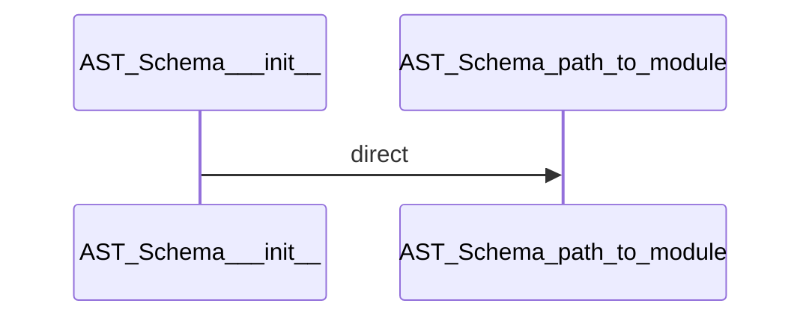
```mermaid
sequenceDiagram
    participant AST_Schema___init__
    participant AST_Schema_path_to_module
    AST_Schema___init__ ->> AST_Schema_path_to_module: direct
```
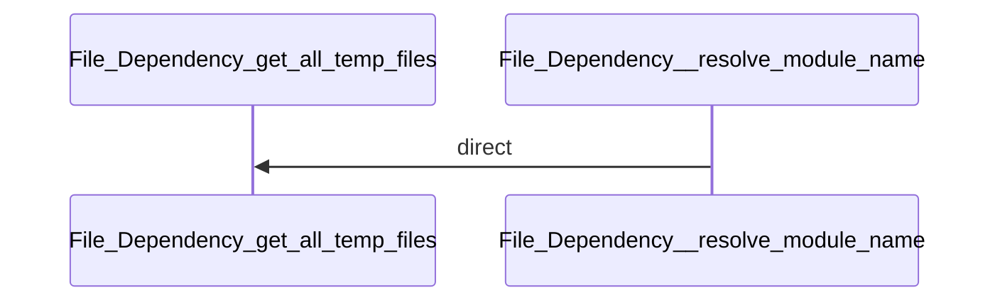
```mermaid
sequenceDiagram
    participant File_Dependency_get_all_temp_files
    participant File_Dependency__resolve_module_name
    File_Dependency__resolve_module_name ->> File_Dependency_get_all_temp_files: direct
```
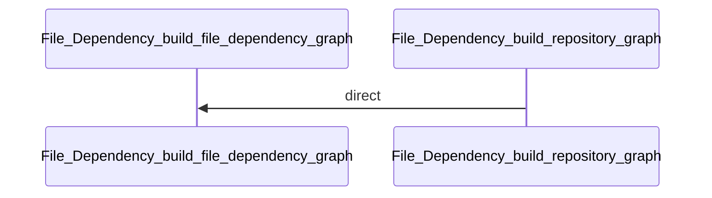
```mermaid
sequenceDiagram
    participant File_Dependency_build_file_dependency_graph
    participant File_Dependency_build_repository_graph
    File_Dependency_build_repository_graph ->> File_Dependency_build_file_dependency_graph: direct
```
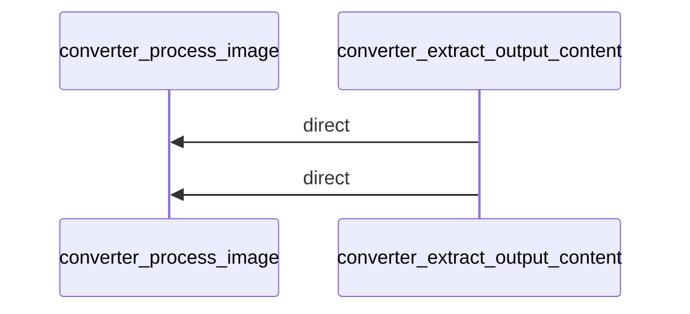
```mermaid
sequenceDiagram
    participant converter_process_image
    participant converter_extract_output_content
    converter_extract_output_content ->> converter_process_image: direct
    converter_extract_output_content ->> converter_process_image: direct
```
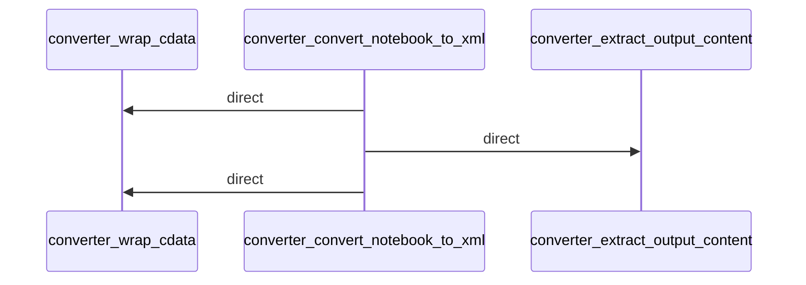
```mermaid
sequenceDiagram
    participant converter_wrap_cdata
    participant converter_convert_notebook_to_xml
    participant converter_extract_output_content
    converter_convert_notebook_to_xml ->> converter_wrap_cdata: direct
    converter_convert_notebook_to_xml ->> converter_extract_output_content: direct
    converter_convert_notebook_to_xml ->> converter_wrap_cdata: direct
```
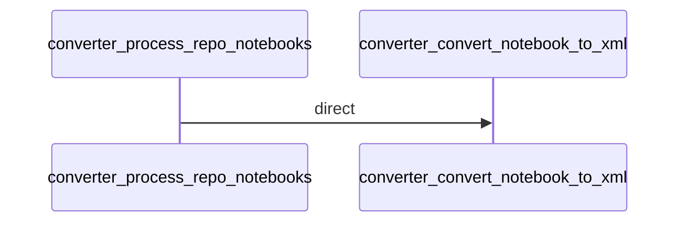
```mermaid
sequenceDiagram
    participant converter_process_repo_notebooks
    participant converter_convert_notebook_to_xml
    converter_process_repo_notebooks ->> converter_convert_notebook_to_xml: direct
```
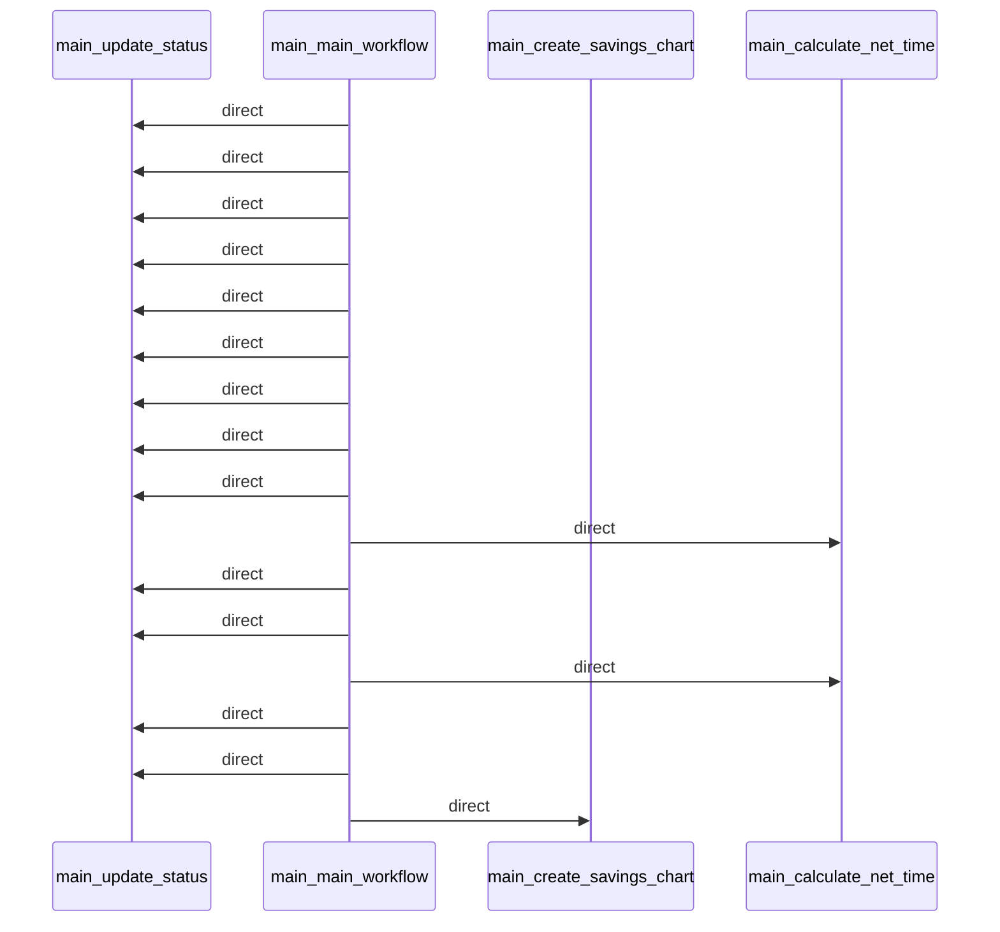
```mermaid
sequenceDiagram
    participant main_update_status
    participant main_main_workflow
    participant main_create_savings_chart
    participant main_calculate_net_time
    main_main_workflow ->> main_update_status: direct
    main_main_workflow ->> main_update_status: direct
    main_main_workflow ->> main_update_status: direct
    main_main_workflow ->> main_update_status: direct
    main_main_workflow ->> main_update_status: direct
    main_main_workflow ->> main_update_status: direct
    main_main_workflow ->> main_update_status: direct
    main_main_workflow ->> main_update_status: direct
    main_main_workflow ->> main_update_status: direct
    main_main_workflow ->> main_calculate_net_time: direct
    main_main_workflow ->> main_update_status: direct
    main_main_workflow ->> main_update_status: direct
    main_main_workflow ->> main_calculate_net_time: direct
    main_main_workflow ->> main_update_status: direct
    main_main_workflow ->> main_update_status: direct
    main_main_workflow ->> main_create_savings_chart: direct
```
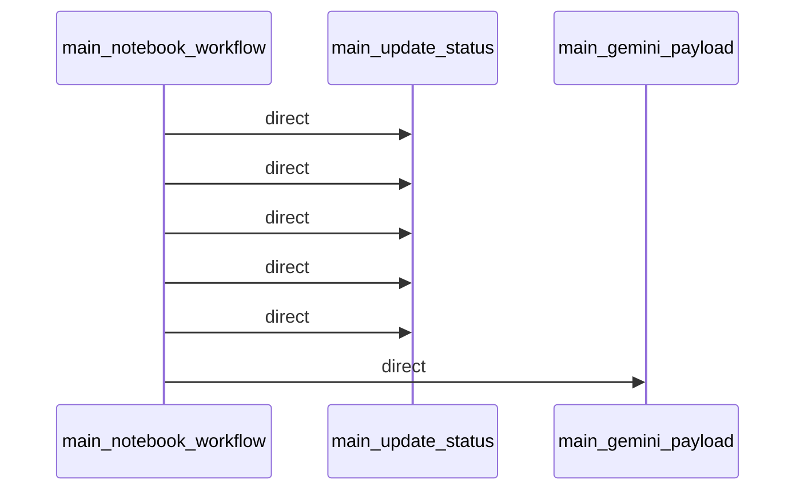
```mermaid
sequenceDiagram
    participant main_notebook_workflow
    participant main_update_status
    participant main_gemini_payload
    main_notebook_workflow ->> main_update_status: direct
    main_notebook_workflow ->> main_update_status: direct
    main_notebook_workflow ->> main_update_status: direct
    main_notebook_workflow ->> main_update_status: direct
    main_notebook_workflow ->> main_update_status: direct
    main_notebook_workflow ->> main_gemini_payload: direct
```
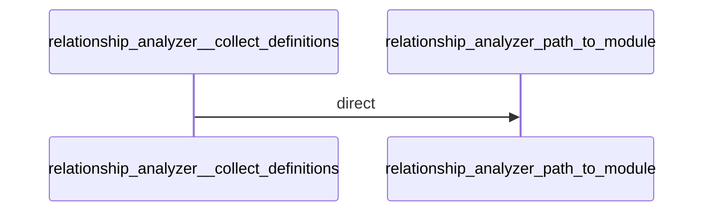
```mermaid
sequenceDiagram
    participant relationship_analyzer__collect_definitions
    participant relationship_analyzer_path_to_module
    relationship_analyzer__collect_definitions ->> relationship_analyzer_path_to_module: direct
```
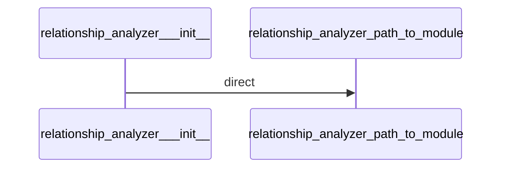
```mermaid
sequenceDiagram
    participant relationship_analyzer___init__
    participant relationship_analyzer_path_to_module
    relationship_analyzer___init__ ->> relationship_analyzer_path_to_module: direct
```
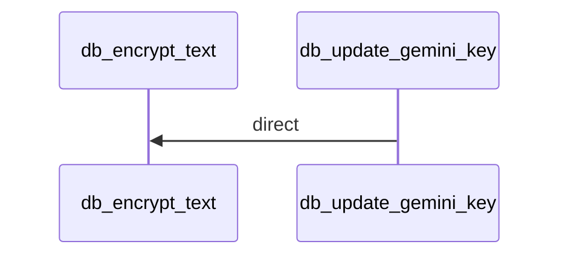
```mermaid
sequenceDiagram
    participant db_encrypt_text
    participant db_update_gemini_key
    db_update_gemini_key ->> db_encrypt_text: direct
```
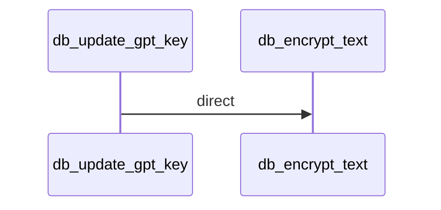
```mermaid
sequenceDiagram
    participant db_update_gpt_key
    participant db_encrypt_text
    db_update_gpt_key ->> db_encrypt_text: direct
```
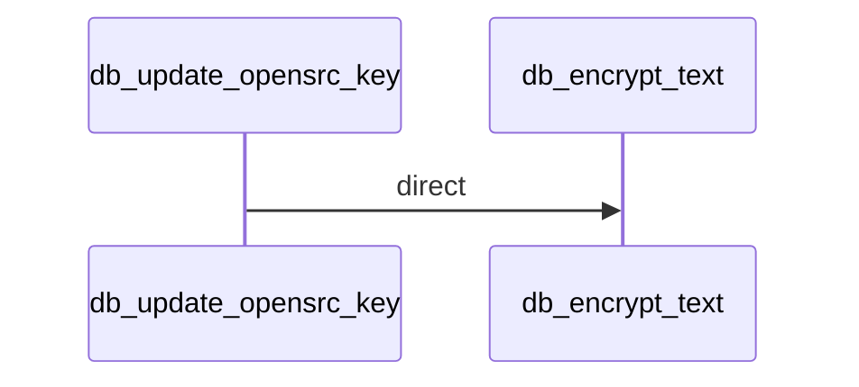
```mermaid
sequenceDiagram
    participant db_update_opensrc_key
    participant db_encrypt_text
    db_update_opensrc_key ->> db_encrypt_text: direct
```
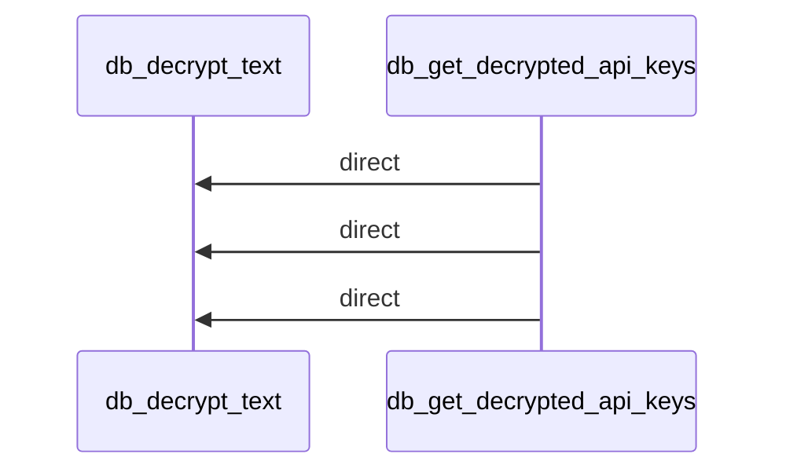
```mermaid
sequenceDiagram
    participant db_decrypt_text
    participant db_get_decrypted_api_keys
    db_get_decrypted_api_keys ->> db_decrypt_text: direct
    db_get_decrypted_api_keys ->> db_decrypt_text: direct
    db_get_decrypted_api_keys ->> db_decrypt_text: direct
```
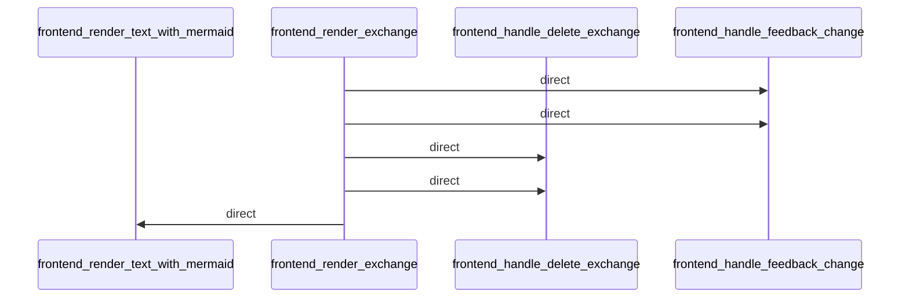
```mermaid
sequenceDiagram
    participant frontend_render_text_with_mermaid
    participant frontend_render_exchange
    participant frontend_handle_delete_exchange
    participant frontend_handle_feedback_change
    frontend_render_exchange ->> frontend_handle_feedback_change: direct
    frontend_render_exchange ->> frontend_handle_feedback_change: direct
    frontend_render_exchange ->> frontend_handle_delete_exchange: direct
    frontend_render_exchange ->> frontend_handle_delete_exchange: direct
    frontend_render_exchange ->> frontend_render_text_with_mermaid: direct
```
