# Project Documentation: Repo Onboarding Agent 🚀

## 1. Project Overview
- **Description:** Information not found  
- **Key Features:**  
  - Automated cloning and analysis of a GitHub repository  
  - Abstract Syntax Tree (AST) extraction and enrichment with call‑graph relationships  
  - Generation of a comprehensive markdown report using LLMs (Helper LLM + Main LLM)  
  - Token‑usage comparison (JSON vs. TOON) with visual savings chart  
- **Tech Stack:**  
  - Python 3.11+  
  - `gitpython`, `networkx`, `matplotlib`, `nbformat`  
  - Language‑model libraries: `langchain‑google‑genai`, `langchain‑ollama`, `langchain‑openai`  
  - Streamlit UI, MongoDB backend, Pydantic data models  

* **Repository Structure:**
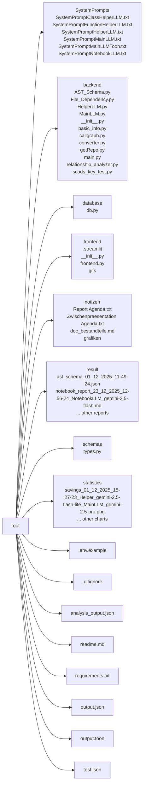

## 2. Installation
### Dependencies
- The project uses a large set of Python packages (see `requirements.txt`).  
  Install them with:

```bash
pip install -r requirements.txt
```

### Setup Guide
1. Clone the repository (if you have not done so already).  
2. Create a virtual environment and activate it.  
3. Install the dependencies as shown above.  
4. Ensure a running MongoDB instance for the Streamlit UI (default connection string is read from environment variables).  
5. (Optional) Create a `.env` file with the required API keys (`GEMINI_API_KEY`, `OPENAI_API_KEY`, etc.) as referenced in the code.

### Quick Startup
```bash
streamlit run frontend/frontend.py
```
The Streamlit UI will guide you through providing repository URLs and selecting LLM models.

## 3. Use Cases & Commands
- **Generate onboarding documentation for any public GitHub repository** – paste the repo URL into the UI and let the system produce a detailed markdown report.  
- **Visualise code dependencies** – the backend builds import‑dependency graphs and call‑graphs that can be exported as DOT files.  
- **Compare token usage** – after a run you obtain a bar chart showing JSON vs. TOON token counts and percentage savings.  
- **Process Jupyter notebooks** – the `converter` module turns notebooks into XML with image placeholders, which the Notebook LLM can summarise.  

Typical command line usage (via the `backend/main.py` entry point) can be scripted as:

```bash
python -m backend.main "https://github.com/user/repo.git" \
    --api_keys gemini=YOUR_GEMINI_KEY gpt=YOUR_OPENAI_KEY \
    --models helper=gpt-5-mini main=gpt-5.1
```

## 4. Architecture
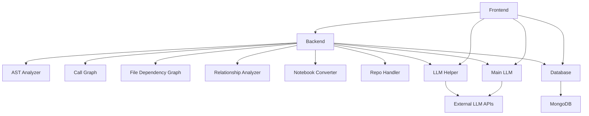

## 5. Code Analysis

### File: `backend/AST_Schema.py`

#### Function: `backend.AST_Schema.path_to_module`
* **Signature:** `def path_to_module(filepath, project_root)`
* **Description:** The function converts a file path into a Python module path by computing the relative path from the project root, removing the `.py` extension if present, and replacing directory separators with dots. It handles cases where the filepath is not within the project root by falling back to the basename of the file. If the resulting path ends with `.__init__`, it removes the trailing part to correctly represent the module.
* **Parameters:**
  - **filepath** (`str`): The absolute or relative path to a Python file.
  - **project_root** (`str`): The root directory of the project used to compute the relative path.
* **Returns:**
  - **module_path** (`str`): A dot‑separated module path derived from the given file path.
* **Usage:** Called nowhere else in the current code (no `called_by` entries).

#### Class: `backend.AST_Schema.ASTVisitor`
*Analysis data not available for this component.*

#### Class: `backend.AST_Schema.ASTAnalyzer`
*Analysis data not available for this component.*

---

### File: `backend/File_Dependency.py`

#### Function: `backend.File_Dependency.build_file_dependency_graph`
* **Signature:** `def build_file_dependency_graph(filename, tree, repo_root)`
* **Description:** This function constructs a directed graph representing file dependencies within a codebase. It takes a filename, an abstract syntax tree (AST), and a repository root path as inputs. It uses a custom visitor class to traverse the AST and extract import dependencies. These dependencies are then added to a NetworkX `DiGraph`, where nodes represent files and edges represent import relationships.
* **Parameters:**
  - **filename** (`str`): The name of the file for which the dependency graph is being built.
  - **tree** (`AST`): The abstract syntax tree of the file being analyzed.
  - **repo_root** (`str`): The root directory of the repository containing the file.
* **Returns:**
  - **graph** (`nx.DiGraph`): A directed graph representing the file dependency relationships.
* **Usage:** Called by `backend.File_Dependency.build_repository_graph`.

#### Function: `backend.File_Dependency.build_repository_graph`
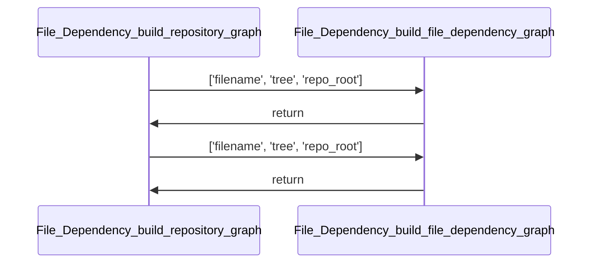
* **Signature:** `def build_repository_graph(repository)`
* **Description:** This function constructs a directed graph representing the dependencies between Python files within a given Git repository. It iterates through all files in the repository, filters for Python files, parses their content into ASTs, and builds individual dependency graphs for each file. The function then merges these individual graphs into a single global graph that captures the overall dependency structure of the repository.
* **Parameters:**
  - **repository** (`GitRepository`): An instance of `GitRepository` containing the files to analyze for dependencies.
* **Returns:**
  - **global_graph** (`nx.DiGraph`): A NetworkX directed graph representing the dependency relationships between Python files in the repository.
* **Usage:** Not referenced elsewhere in the current code.

#### Function: `backend.File_Dependency.get_all_temp_files`
* **Signature:** `def get_all_temp_files(directory)`
* **Description:** This function retrieves all Python files (`.py`) from a specified directory and its subdirectories. It resolves the given directory path to an absolute path, then uses recursive globbing to find all `.py` files. Each file path is normalized relative to the root directory. The function returns a list of `Path` objects representing these files.
* **Parameters:**
  - **directory** (`str`): The path to the directory from which to retrieve all Python files.
* **Returns:**
  - **all_files** (`list[Path]`): A list of `Path` objects representing all Python files found in the directory and its subdirectories, relative to the root directory.
* **Usage:** Used by `FileDependencyGraph._resolve_module_name`.

#### Class: `backend.File_Dependency.FileDependencyGraph`
*Analysis data not available for this component.*

---

### File: `backend/HelperLLM.py`

#### Function: `backend.HelperLLM.main_orchestrator`
* **Signature:** `def main_orchestrator()`
* **Description:** The `main_orchestrator` function serves as a dummy data and processing loop for testing the `LLMHelper` class. It defines pre‑computed analyses for three example functions (`add_item`, `check_stock`, `generate_report`). These analyses are then passed to the `LLMHelper` to simulate documentation generation for a class named `InventoryManager`. The function demonstrates how to structure inputs for both function and class analysis using Pydantic models.
* **Parameters:** *(none)*
* **Returns:** *(none)*
* **Usage:** Called nowhere else; serves as an example entry point.

#### Class: `backend.HelperLLM.LLMHelper`
*Analysis data not available for this component.*

---

### File: `backend/MainLLM.py`

#### Class: `backend.MainLLM.MainLLM`
*Analysis data not available for this component.*

---

### File: `backend/basic_info.py`

#### Class: `backend.basic_info.ProjektInfoExtractor`
*Analysis data not available for this component.*

---

### File: `backend/callgraph.py`

#### Function: `backend.callgraph.make_safe_dot`
* **Signature:** `def make_safe_dot(graph, out_path)`
* **Description:** The function `make_safe_dot` takes a NetworkX directed graph and a file path as inputs. It creates a copy of the graph and generates a safe node naming scheme by prefixing each original node name with `n` followed by its index. The function then relabels the nodes in the graph according to this safe naming scheme and assigns the original node labels as attributes to the new nodes. Finally, it writes the modified graph to a DOT file at the specified output path.
* **Parameters:**
  - **graph** (`nx.DiGraph`): A NetworkX directed graph to be processed and saved to a DOT file.
  - **out_path** (`str`): The file path where the DOT representation of the graph will be written.
* **Returns:** *(none)*
* **Usage:** Not referenced elsewhere.

#### Function: `backend.callgraph.build_filtered_callgraph`
* **Signature:** `def build_filtered_callgraph(repo)`
* **Description:** The function builds a filtered call graph from a Git repository by parsing Python files and extracting function call relationships. It first identifies all Python files in the repository, parses their content using the AST module, and collects function names using a custom `CallGraph` visitor. Then, it constructs a global directed graph of function calls, filtering only those calls between functions defined within the repository. Finally, it returns the filtered `networkx.DiGraph` representing these internal function relationships.
* **Parameters:**
  - **repo** (`GitRepository`): The Git repository object containing all files to process for building the call graph.
* **Returns:**
  - **global_graph** (`nx.DiGraph`): A filtered directed graph containing only function calls between functions defined within the repository.
* **Usage:** Not referenced elsewhere.

#### Class: `backend.callgraph.CallGraph`
*Analysis data not available for this component.*

---

### File: `backend/converter.py`

#### Function: `backend.converter.wrap_cdata`
* **Signature:** `def wrap_cdata(content)`
* **Description:** The function `wrap_cdata` takes a string input named `content` and wraps it with CDATA (Character Data) tags. This is commonly used in XML documents to escape text content that might otherwise be interpreted as markup. The function returns a formatted string that includes the original content enclosed between `<![CDATA[` and `]]>` markers, along with newline characters before and after the content.
* **Parameters:**
  - **content** (`str`): The string content that needs to be wrapped with CDATA tags.
* **Returns:**
  - **wrapped_content** (`str`): A string that contains the input `content` wrapped with CDATA tags and newlines.
* **Usage:** Used by `convert_notebook_to_xml`.

#### Function: `backend.converter.extract_output_content`
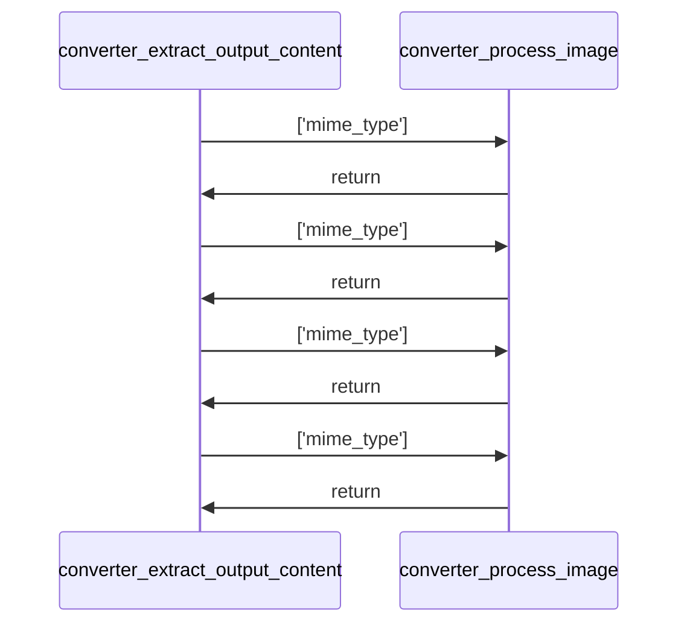
* **Signature:** `def extract_output_content(outputs, image_list)`
* **Description:** The function extracts content from notebook outputs, handling both text and image data. It processes outputs of different types such as `display_data`, `execute_result`, `stream`, and `error`, returning a list of text snippets or image placeholders. For image data, it decodes Base64 strings and appends them to an image list with metadata. The function prioritizes PNG over JPEG when both are present.
* **Parameters:**
  - **outputs** (`Any`): A collection of notebook output objects containing data and metadata.
  - **image_list** (`List[Dict[str, Any]]`): A mutable list to store decoded image data and metadata.
* **Returns:**
  - **extracted_xml_snippets** (`List[str]`): A list of text strings or XML placeholders representing the extracted content.
* **Usage:** Called by `convert_notebook_to_xml`.

#### Function: `backend.converter.process_image`
* **Signature:** `def process_image(mime_type)`
* **Description:** The function processes an image based on its MIME type by checking if the MIME type exists in a predefined data dictionary. It extracts a base64‑encoded string, removes newline characters, and appends the image data to a global list called `image_list`. The function then returns an XML placeholder string indicating the image's location and MIME type, or an error message if decoding fails.
* **Parameters:**
  - **mime_type** (`str`): The MIME type of the image to be processed.
* **Returns:**
  - **return_value** (`str` or `None`): Returns an XML placeholder string with image details if processing succeeds, or an error message if decoding fails. Returns `None` if the MIME type is not found in the data dictionary.
* **Usage:** Internal helper for `extract_output_content`.

#### Function: `backend.converter.convert_notebook_to_xml`
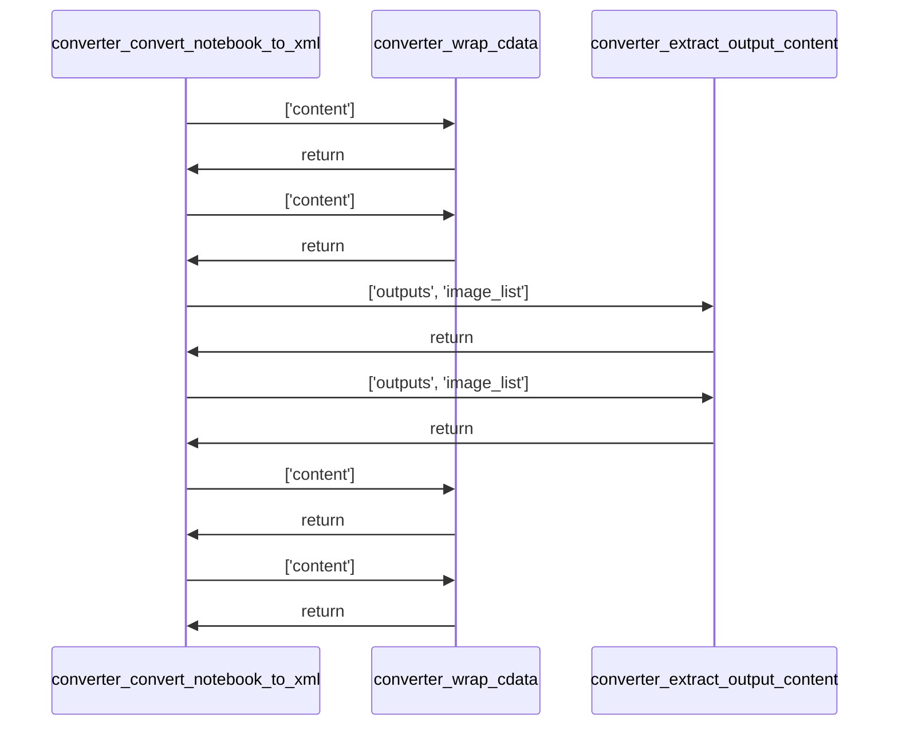
* **Signature:** `def convert_notebook_to_xml(file_content)`
* **Description:** This function converts a Jupyter notebook, represented as a string of JSON content, into an XML format. It parses the notebook using `nbformat`, iterates through each cell, and transforms markdown and code cells into XML elements. For code cells, it also extracts and includes output content if present. The function handles parsing errors gracefully by returning an error message and an empty list.
* **Parameters:**
  - **file_content** (`str`): A string containing the raw JSON content of a Jupyter notebook.
* **Returns:**
  - **xml_output** (`str`): A string containing the XML representation of the notebook, with each cell wrapped in `<CELL>` tags.  
  - **extracted_images** (`list`): A list of extracted image data from the notebook outputs.
* **Usage:** Used by `process_repo_notebooks`.

#### Function: `backend.converter.process_repo_notebooks`
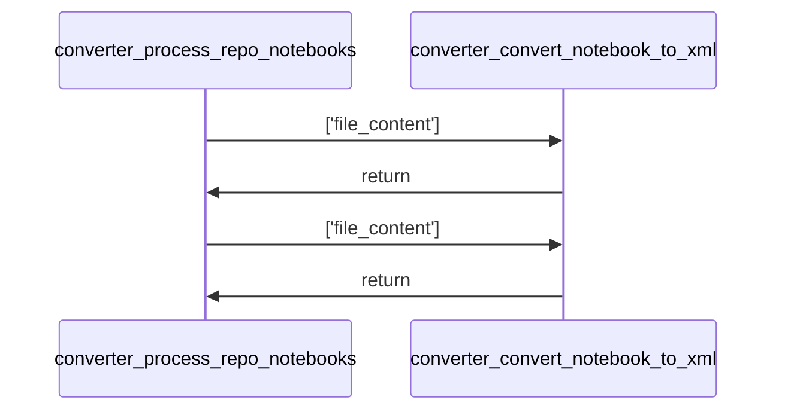
* **Signature:** `def process_repo_notebooks(repo_files)`
* **Description:** This function processes a list of repository files to identify and convert Jupyter notebook files (`.ipynb`) into XML format. It iterates through the notebook files, logs the processing status, and returns a dictionary mapping each notebook file path to its converted XML output and associated images. The function relies on an external helper function to perform the actual conversion.
* **Parameters:**
  - **repo_files** (`List[File]`): A list of file objects representing repository files, each expected to have a `path` attribute and a `content` attribute.
* **Returns:**
  - **results** (`Dict[str, Dict[str, Any]]`): A dictionary where keys are the paths of notebook files and values are dictionaries containing the converted XML output and associated images.
* **Usage:** Called by the notebook workflow in `backend/main.py`.

#### Class: *(none defined directly in this file besides the functions above)*

---

### File: `backend/getRepo.py`

#### Class: `backend.getRepo.RepoFile`
*Analysis data not available for this component.*

#### Class: `backend.getRepo.GitRepository`
*Analysis data not available for this component.*

---

### File: `backend/main.py`

#### Function: `backend.main.create_savings_chart`
* **Signature:** `def create_savings_chart(json_tokens, toon_tokens, savings_percent, output_path)`
* **Description:** The function creates a bar chart comparing token counts between two formats, JSON and TOON, and saves the resulting plot to a specified file path. It uses `matplotlib` to generate the visualization, including labels, titles, and annotations for each bar. The chart includes a title indicating the savings percentage and displays the token values above each bar.
* **Parameters:**
  - **json_tokens** (`int`): The number of tokens in the JSON format.
  - **toon_tokens** (`int`): The number of tokens in the TOON format.
  - **savings_percent** (`float`): The percentage of token savings achieved by using the TOON format.
  - **output_path** (`str`): The file path where the generated chart will be saved.
* **Returns:** *(none)*
* **Usage:** Called after token evaluation in the main workflow.

#### Function: `backend.main.calculate_net_time`
* **Signature:** `def calculate_net_time(start_time, end_time, total_items, batch_size, model_name)`
* **Description:** The function calculates the net time duration between a start and end time, adjusted for sleep periods caused by rate limits. It specifically handles cases where the model name starts with `gemini-`, applying additional logic to account for batching and associated sleep times. If the model is not a gemini model, it returns the total duration directly. For zero items, it returns zero. Otherwise, it computes the number of batches, determines the number of sleep periods, and subtracts the total sleep time from the overall duration.
* **Parameters:**
  - **start_time** (`float` or `datetime`): The starting timestamp or time value.
  - **end_time** (`float` or `datetime`): The ending timestamp or time value.
  - **total_items** (`int`): The total number of items processed.
  - **batch_size** (`int`): The size of each batch used for processing.
  - **model_name** (`str`): The name of the model being used, which determines whether rate limit adjustments are applied.
* **Returns:**
  - **net_time** (`float` or `int`): The calculated net time after subtracting sleep durations due to rate limiting.
* **Usage:** Used to compute net helper‑LLM processing time.

#### Function: `backend.main.main_workflow`
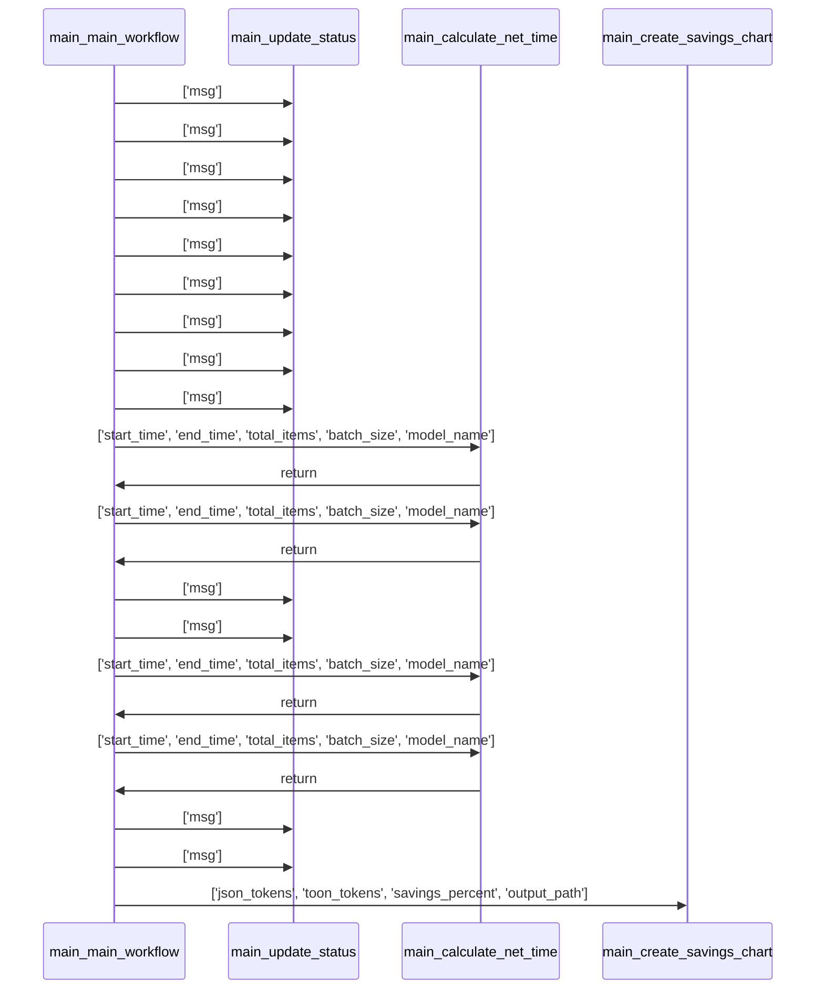
* **Signature:** `def main_workflow(input, api_keys, model_names, status_callback=None)`
* **Description:** The `main_workflow` function orchestrates a comprehensive code analysis and documentation generation process for a given repository. It begins by extracting API keys and model configurations, then clones the repository and analyzes its structure. The function proceeds to extract basic project information, construct a file tree, and perform relationship analysis on the codebase. It generates an abstract syntax tree (AST) schema and enriches it with relationship data. Subsequently, it prepares inputs for a Helper LLM to analyze functions and classes, and then calls the Helper LLM to generate documentation. Finally, it prepares inputs for a Main LLM to produce a final report, saves the results, and returns both the report and performance metrics.
* **Parameters:**
  - **input** (`Any`): The input provided to the workflow, typically a string containing a repository URL.
  - **api_keys** (`dict`): A dictionary containing API keys for various services such as Gemini, OpenAI, and SCADSLMM.
  - **model_names** (`dict`): A dictionary specifying the names of models to be used for helper and main LLM tasks.
  - **status_callback** (`Callable[[str], None]`, optional): An optional callback function to report progress updates.
* **Returns:**
  - **report** (`str`): The final markdown report generated by the Main LLM.
  - **metrics** (`dict`): A dictionary containing timing and token usage metrics for the analysis process.
* **Usage:** Entry point for the Streamlit UI and any programmatic invocation.

#### Function: `backend.main.update_status`
* **Signature:** `def update_status(msg)`
* **Description:** The function `update_status` takes a message as input and logs it using the logging module. It also optionally invokes a callback function named `status_callback` if it is defined. This function serves as a utility for reporting status messages throughout the application.
* **Parameters:**
  - **msg** (`Any`): The message to be logged and optionally passed to the status callback.
* **Returns:** *(none)*
* **Usage:** Used throughout the main workflow to report progress.

#### Function: `backend.main.notebook_workflow`
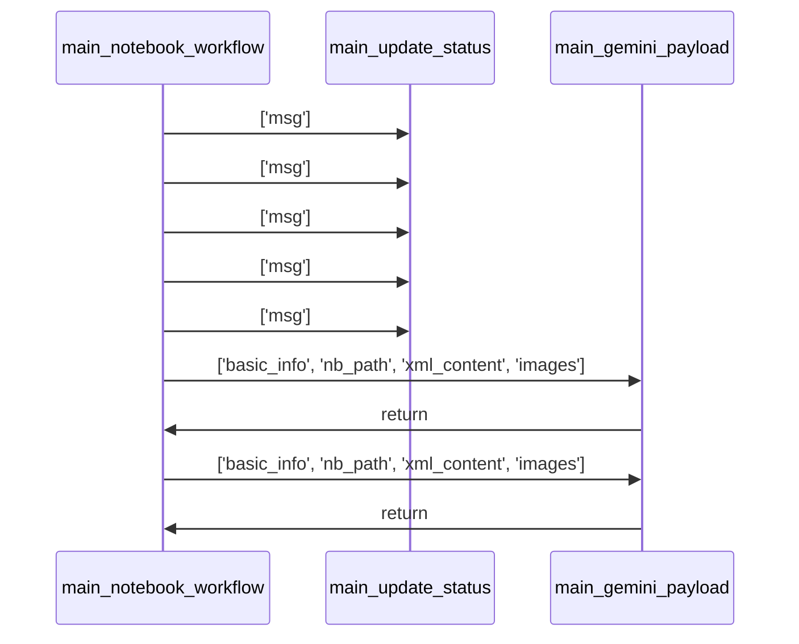
* **Signature:** `def notebook_workflow(input, api_keys, model, status_callback=None)`
* **Description:** The `notebook_workflow` function orchestrates the processing of Jupyter notebooks from a GitHub repository using various language models. It begins by extracting a repository URL from the input, clones the repository, processes its files into XML format, and extracts basic project information. It then iterates through each notebook, constructs a payload for the LLM based on the notebook's content and associated images, and calls the LLM to generate a report for each notebook. Finally, it aggregates all reports into a single markdown file and returns both the report and performance metrics.
* **Parameters:**
  - **input** (`Any`): The input string which should contain a GitHub repository URL.
  - **api_keys** (`Dict[str, str]`): A dictionary mapping API key identifiers to their respective keys for different LLM providers.
  - **model** (`str`): The name of the language model to use for processing the notebooks.
  - **status_callback** (`Optional[Callable[[str], None]]`, optional): An optional callback function to report processing status updates.
* **Returns:**
  - **report** (`str`): A concatenated markdown report of all processed notebooks.
  - **metrics** (`Dict[str, Union[str, float]]`): A dictionary containing timing and model‑related metrics for the workflow execution.
* **Usage:** Invoked when the user selects the “Notebook LLM” option in the UI.

#### Function: `backend.main.gemini_payload`
* **Signature:** `def gemini_payload(basic_info, nb_path, xml_content, images)`
* **Description:** The function `gemini_payload` constructs a structured payload for use with a Gemini‑based language model. It takes basic information, a notebook path, XML content, and a list of images, then processes the XML to insert image placeholders with base64‑encoded image data. The resulting payload is a list of dictionaries, each representing either text or image content, suitable for multimodal input. The function uses regular expressions to identify image placeholders in the XML and substitutes them with appropriate image data.
* **Parameters:**
  - **basic_info** (`Any`): A dictionary or object containing basic information to be included in the payload.
  - **nb_path** (`Any`): The path to the current notebook, used to provide contextual information in the payload.
  - **xml_content** (`str`): The XML content of the notebook, which may contain image placeholders.
  - **images** (`list`): A list of image data objects, each containing at least a `data` key with base64‑encoded image data.
* **Returns:**
  - **payload_content** (`list`): A list of dictionaries representing the constructed payload, where each dictionary contains either a `text` or `image_url` type and associated content.
* **Usage:** Used inside `notebook_workflow` to build the LLM request.

---

### File: `backend/relationship_analyzer.py`

#### Function: `backend.relationship_analyzer.path_to_module`
* **Signature:** `def path_to_module(filepath, project_root)`
* **Description:** The function converts a file path into a Python module path by computing the relative path from the project root, removing the `.py` extension if present, and replacing directory separators with dots. It handles cases where the filepath is not within the project root by falling back to the basename of the file. If the resulting path ends with `__init__`, it removes the trailing part to correctly represent the package.
* **Parameters:**
  - **filepath** (`str`): The absolute or relative path to a Python file.
  - **project_root** (`str`): The root directory of the project used to compute the relative path.
* **Returns:**
  - **module_path** (`str`): A dot‑separated module path derived from the given file path.
* **Usage:** Called by `ProjectAnalyzer._collect_definitions` and `CallResolverVisitor.__init__`.

#### Class: `backend.relationship_analyzer.ProjectAnalyzer`
*Analysis data not available for this component.*

#### Class: `backend.relationship_analyzer.CallResolverVisitor`
*Analysis data not available for this component.*

---

### File: `backend/scads_key_test.py`
*No public functions or classes defined.*

---

### File: `database/db.py`

#### Function: `database.db.encrypt_text`
* **Signature:** `def encrypt_text(text)`
* **Description:** The function encrypts a given text string using a Fernet cipher suite. It first checks if the input text is empty or if the cipher suite is not available; in such cases, it returns the input text unchanged. If both conditions are satisfied, it encodes the stripped text to bytes, encrypts it using the cipher suite, and then decodes the result back to a string.
* **Parameters:**
  - **text** (`str`): The text string to be encrypted.
* **Returns:**
  - **encrypted_text** (`str`): The encrypted version of the input text, or the original text if encryption was not performed.
* **Usage:** Used by `update_gemini_key`, `update_gpt_key`, and `update_opensrc_key`.

#### Function: `database.db.decrypt_text`
* **Signature:** `def decrypt_text(text)`
* **Description:** The function `decrypt_text` is designed to decrypt a given encrypted text using a cipher suite. It first checks if the input text is empty or if the cipher suite is not available, returning the original text in such cases. If both conditions are met, it attempts to decrypt the text by encoding it, decrypting it with the cipher suite, and then decoding it back to a string. In case of any exception during decryption, it gracefully returns the original text.
* **Parameters:**
  - **text** (`str`): The encrypted text that needs to be decrypted.
* **Returns:**
  - **result** (`str`): The decrypted text if successful, otherwise the original input text.
* **Usage:** Used by `get_decrypted_api_keys`.

#### Function: `database.db.insert_user`
* **Signature:** `def insert_user(username, name, password)`
* **Description:** The function inserts a new user into the database by creating a user document with the provided username, name, and password. It hashes the password using a hasher from the `streamlit_authenticator` library before storing it. The function also initializes additional fields such as API keys with empty strings. Finally, it returns the ID of the inserted document.
* **Parameters:**
  - **username** (`str`): The unique identifier for the user, used as the `_id` field in the database.
  - **name** (`str`): The full name of the user.
  - **password** (`str`): The plain text password of the user, which gets hashed before storage.
* **Returns:**
  - **inserted_id** (`ObjectId`): The ID of the inserted user document.
* **Usage:** Called by the frontend when a new user signs up.

#### Function: `database.db.fetch_all_users`
* **Signature:** `def fetch_all_users()`
* **Description:** This function retrieves all user documents from a MongoDB collection named `dbusers`. It performs a database query using the `find()` method and returns the results as a list. The function does not take any parameters and directly accesses the global `dbusers` variable, which is expected to be initialized elsewhere in the codebase.
* **Parameters:** *(none)*
* **Returns:**
  - **result** (`list`): A list containing all user documents retrieved from the `dbusers` collection.
* **Usage:** Used by the admin UI to list users.

#### Function: `database.db.fetch_user`
* **Signature:** `def fetch_user(username)`
* **Description:** The function fetch_user retrieves a user document from a MongoDB collection based on the provided username. It uses the `find_one` method to query the database with a filter matching the `_id` field to the given username. The function assumes the existence of a global variable or module‑level object named `dbusers` that represents the MongoDB collection. No explicit error handling or validation is present in the function body.
* **Parameters:**
  - **username** (`str`): The unique identifier for the user to be retrieved.
* **Returns:**
  - **result** (`Any`): The user document retrieved from the database if found; otherwise, `None`.
* **Usage:** Utilized during login to verify credentials.

#### Function: `database.db.update_user_name`
* **Signature:** `def update_user_name(username, new_name)`
* **Description:** This function updates the `name` field of a user in the database identified by their username. It uses MongoDB's `update_one` method to modify only the `name` field, leaving other fields unchanged. It returns the number of documents that were modified as a result of the operation.
* **Parameters:**
  - **username** (`str`): The unique identifier of the user whose name needs to be updated.
  - **new_name** (`str`): The new name value to set for the specified user.
* **Returns:**
  - **modified_count** (`int`): The number of documents that were successfully modified by the update operation.
* **Usage:** Exposed through the UI for user profile changes.

#### Function: `database.db.update_gemini_key`
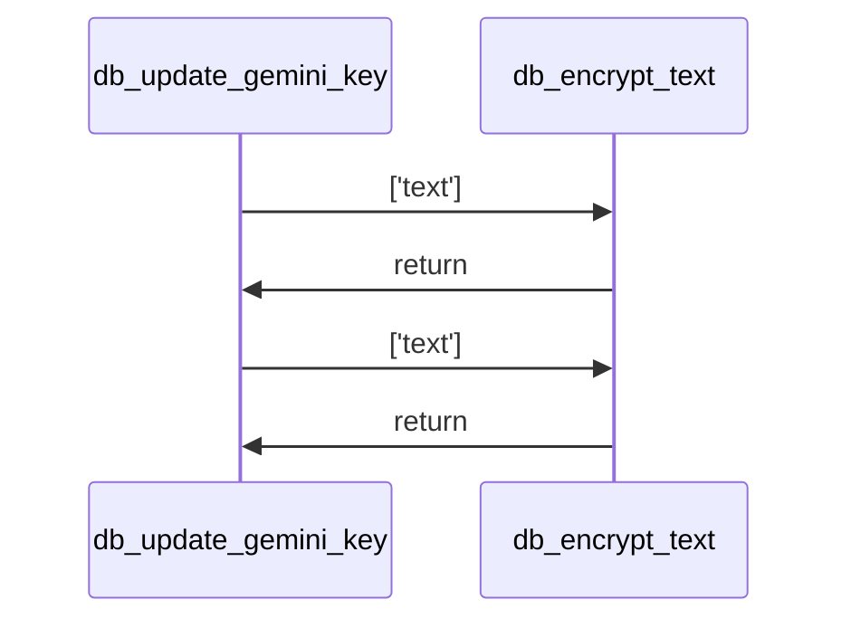
* **Signature:** `def update_gemini_key(username, gemini_api_key)`
* **Description:** This function updates the Gemini API key for a specified user in the database. It first encrypts the provided API key using an encryption function, then performs an update operation on the user document to store the encrypted key. The function returns the count of modified documents, which indicates whether the update was successful.
* **Parameters:**
  - **username** (`str`): The unique identifier for the user whose Gemini API key needs to be updated.
  - **gemini_api_key** (`str`): The new Gemini API key to be stored for the user, which will be encrypted before saving.
* **Returns:**
  - **modified_count** (`int`): The number of documents that were successfully modified by the update operation.
* **Usage:** Called by the frontend when a user saves a new Gemini key. Internally calls `encrypt_text`.

#### Function: `database.db.update_gpt_key`
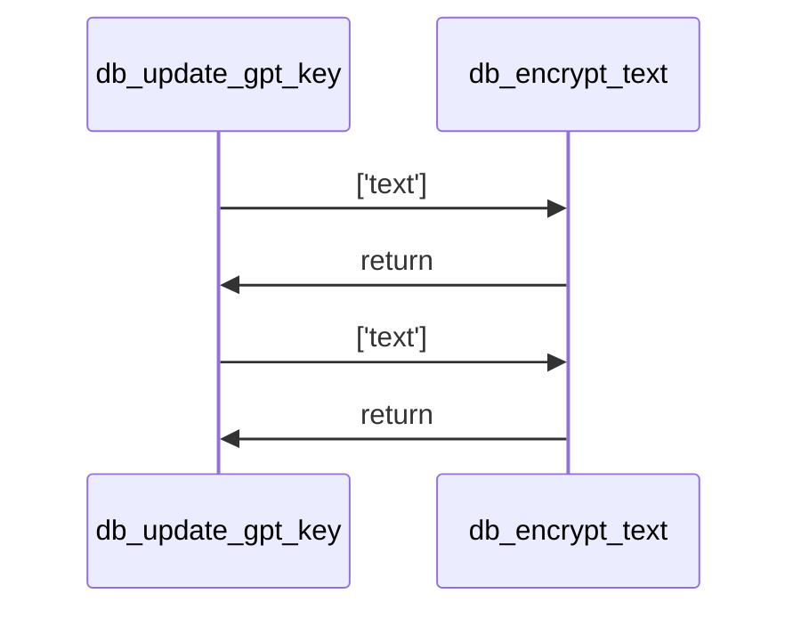
* **Signature:** `def update_gpt_key(username, gpt_api_key)`
* **Description:** This function updates the GPT API key for a specified user in the database. It first encrypts the provided API key using an encryption function, then performs an update operation on the `dbusers` collection to store the encrypted key under the user's ID. The function returns the count of modified documents, indicating whether the update was successful.
* **Parameters:**
  - **username** (`str`): The unique identifier for the user whose GPT API key is to be updated.
  - **gpt_api_key** (`str`): The GPT API key to be updated, stripped of whitespace and encrypted before storage.
* **Returns:**
  - **modified_count** (`int`): The number of documents that were successfully modified by the update operation.
* **Usage:** Called by the frontend when a user saves a new GPT key. Internally calls `encrypt_text`.

#### Function: `database.db.update_ollama_url`
* **Signature:** `def update_ollama_url(username, ollama_base_url)`
* **Description:** This function updates the Ollama base URL for a specified user in the database. It performs a MongoDB update operation to set the `ollama_base_url` field for the user identified by their username. The function ensures that any leading or trailing whitespace is removed from the provided URL before storing it. It returns the count of modified documents, which should be 1 if the update was successful.
* **Parameters:**
  - **username** (`str`): The unique identifier for the user whose Ollama base URL needs to be updated.
  - **ollama_base_url** (`str`): The new Ollama base URL to be stored for the user. Leading and trailing whitespace will be stripped.
* **Returns:**
  - **modified_count** (`int`): The number of documents that were successfully modified by the update operation.
* **Usage:** Called by the frontend when a user saves a new Ollama URL.

#### Function: `database.db.update_opensrc_key`
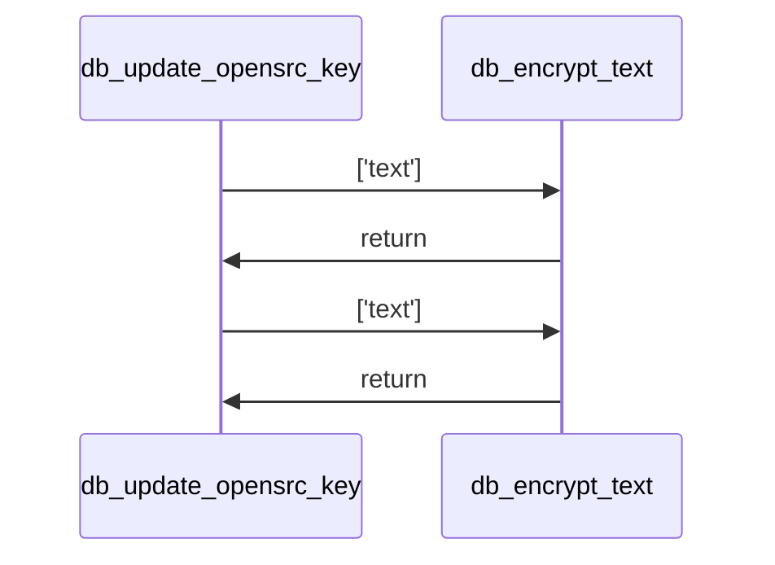
* **Signature:** `def update_opensrc_key(username, opensrc_api_key)`
* **Description:** This function updates the OpenSource API key for a given user in the database. It first encrypts the provided API key using an encryption function, then performs an update operation on the user document to store the encrypted key. The function returns the count of modified documents, which should be 1 if the update was successful.
* **Parameters:**
  - **username** (`str`): The unique identifier for the user whose OpenSource API key needs to be updated.
  - **opensrc_api_key** (`str`): The OpenSource API key to be updated for the specified user.
* **Returns:**
  - **modified_count** (`int`): The number of documents that were successfully modified by the update operation.
* **Usage:** Called by the frontend when a user saves a new OpenSource key. Internally calls `encrypt_text`.

#### Function: `database.db.update_opensrc_url`
* **Signature:** `def update_opensrc_url(username, opensrc_base_url)`
* **Description:** This function updates the `opensrc_base_url` field for a user identified by their username in a MongoDB collection. It uses the `dbusers` collection to perform an update, setting the `opensrc_base_url` field to the provided URL after stripping any leading or trailing whitespace. The function returns the count of modified documents, which should be 1 if the update was successful.
* **Parameters:**
  - **username** (`str`): The unique identifier for the user whose `opensrc_base_url` needs to be updated.
  - **opensrc_base_url** (`str`): The new OpenSource base URL to be set for the user. Leading and trailing whitespace will be stripped before updating.
* **Returns:**
  - **modified_count** (`int`): The number of documents that were successfully modified by the update operation.
* **Usage:** Called by the frontend when a user updates the OpenSource base URL.

#### Function: `database.db.fetch_gemini_key`
* **Signature:** `def fetch_gemini_key(username)`
* **Description:** The function retrieves a Gemini API key associated with a given username from a MongoDB collection. It queries the `dbusers` collection to find a document matching the username and extracts the `gemini_api_key` field. If no matching user is found, it returns `None`.
* **Parameters:**
  - **username** (`str`): The unique identifier for the user whose Gemini API key is to be retrieved.
* **Returns:**
  - **gemini_api_key** (`str` or `None`): The Gemini API key associated with the user, or `None` if the user is not found.
* **Usage:** Used by the backend when initializing LLM helpers.

#### Function: `database.db.fetch_ollama_url`
* **Signature:** `def fetch_ollama_url(username)`
* **Description:** The function retrieves the Ollama base URL associated with a given username from a MongoDB collection. It queries the `dbusers` collection to find a document matching the username and extracts the `ollama_base_url` field. If no matching user is found, it returns `None`.
* **Parameters:**
  - **username** (`str`): The unique identifier for the user whose Ollama base URL is to be retrieved.
* **Returns:**
  - **ollama_base_url** (`str` or `None`): The Ollama base URL associated with the user, or `None` if the user is not found.
* **Usage:** Used by the backend when configuring model endpoints.

#### Function: `database.db.fetch_gpt_key`
* **Signature:** `def fetch_gpt_key(username)`
* **Description:** The function retrieves a GPT API key associated with a given username from a MongoDB collection. It queries the `dbusers` collection to find a document matching the username and extracts the `gpt_api_key` field. If no matching user is found, it returns `None`.
* **Parameters:**
  - **username** (`str`): The unique identifier for the user whose GPT API key is to be retrieved.
* **Returns:**
  - **gpt_api_key** (`str` or `None`): The GPT API key associated with the user, or `None` if the user is not found.
* **Usage:** Used by the backend when initializing LLM helpers.

#### Function: `database.db.fetch_opensrc_key`
* **Signature:** `def fetch_opensrc_key(username)`
* **Description:** The function retrieves an Open Source API key associated with a given username from a MongoDB collection. It queries the `dbusers` collection to find a document matching the username and extracts the `opensrc_api_key` field. If no matching user is found, it returns `None`.
* **Parameters:**
  - **username** (`str`): The unique identifier for the user whose Open Source API key is to be retrieved.
* **Returns:**
  - **opensrc_api_key** (`str` or `None`): The Open Source API key if a matching user is found; otherwise, `None`.
* **Usage:** Used by the backend when initializing LLM helpers.

#### Function: `database.db.fetch_opensrc_url`
* **Signature:** `def fetch_opensrc_url(username)`
* **Description:** This function retrieves the open source base URL associated with a given username from a MongoDB collection. It queries the `dbusers` collection to find a document matching the provided username and extracts the `opensrc_base_url` field. If no matching user is found, it returns `None`.
* **Parameters:**
  - **username** (`str`): The unique identifier (username) used to look up the user in the database.
* **Returns:**
  - **opensrc_base_url** (`str` or `None`): The open source base URL retrieved from the database for the given username, or `None` if no such user exists.
* **Usage:** Used by the backend when initializing LLM helpers.

#### Function: `database.db.delete_user`
* **Signature:** `def delete_user(username)`
* **Description:** The function `delete_user` removes a user document from a MongoDB collection based on the provided username. It uses the `delete_one` method to target a specific user identified by the `_id` field and returns the count of deleted documents. This operation is typically used to permanently remove a user account from the database.
* **Parameters:**
  - **username** (`str`): The unique identifier (username) of the user to be deleted from the database.
* **Returns:**
  - **deleted_count** (`int`): The number of documents deleted from the database, typically `1` if the user was found and deleted, or `0` if no matching document was found.
* **Usage:** Invoked from the admin UI.

#### Function: `database.db.get_decrypted_api_keys`
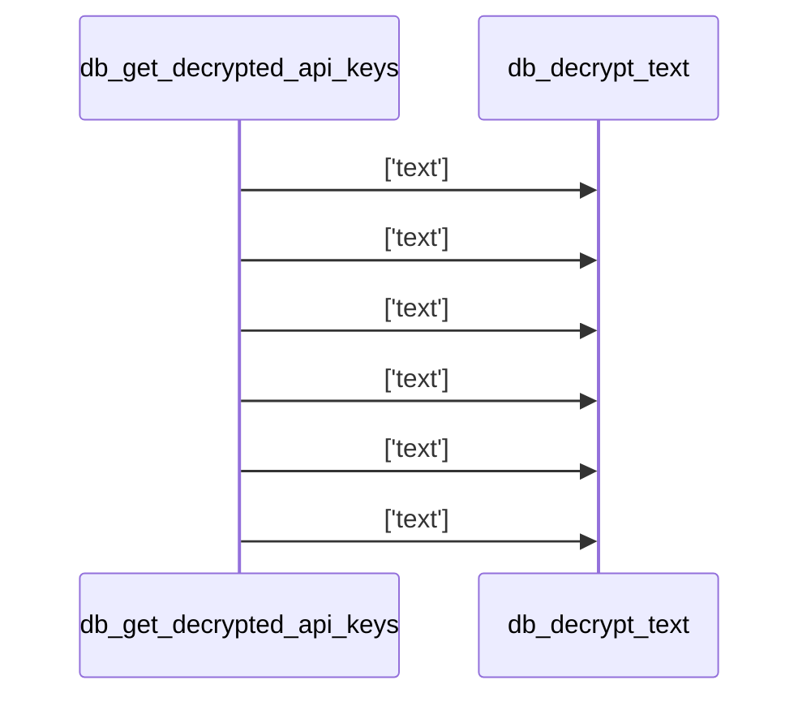
* **Signature:** `def get_decrypted_api_keys(username)`
* **Description:** This function retrieves and decrypts API keys for a given username from a database. It fetches user data, attempts to decrypt sensitive API keys using a decryption function, and returns both decrypted and plaintext values. The function handles cases where the user may not exist by returning `None` for all values. It specifically processes Gemini, GPT, and OpenSRC API keys along with their respective base URLs.
* **Parameters:**
  - **username** (`str`): The unique identifier for the user whose API keys are to be retrieved.
* **Returns:**
  - **gemini_plain** (`str`): The decrypted Gemini API key for the user, or an empty string if not found.  
  - **ollama_plain** (`str`): The Ollama base URL for the user, or an empty string if not found.  
  - **gpt_plain** (`str`): The decrypted GPT API key for the user, or an empty string if not found.  
  - **opensrc_plain** (`str`): The decrypted OpenSRC API key for the user, or an empty string if not found.  
  - **opensrc_url** (`str`): The OpenSRC base URL for the user, or an empty string if not found.
* **Usage:** Used by the frontend to load user credentials.

#### Function: `database.db.insert_chat`
* **Signature:** `def insert_chat(username, chat_name)`
* **Description:** The function `insert_chat` creates a new chat entry in a database with a unique identifier, associating it with a given username and chat name. It generates a UUID for the chat, records the current timestamp, and inserts the chat data into a MongoDB collection. The function then returns the ID of the newly inserted document.
* **Parameters:**
  - **username** (`str`): The username associated with the chat.
  - **chat_name** (`str`): The name of the chat to be created.
* **Returns:**
  - **inserted_id** (`str`): The unique identifier of the newly inserted chat document.
* **Usage:** Called when a new chat is created in the UI.

#### Function: `database.db.fetch_chats_by_user`
* **Signature:** `def fetch_chats_by_user(username)`
* **Description:** This function retrieves all defined chats for a specific user from the database, sorting them by creation time. It returns a list of chat documents.
* **Parameters:**
  - **username** (`str`): The username whose chats are to be fetched.
* **Returns:**
  - **chats** (`list`): A list of chat documents sorted by creation date.
* **Usage:** Used during UI initialisation to populate the chat list.

#### Function: `database.db.check_chat_exists`
* **Signature:** `def check_chat_exists(username, chat_name)`
* **Description:** This function checks whether a specific chat entry exists in the database for a given username and chat name. It performs a query using MongoDB's `find_one` method to locate a matching document. If a document is found, the function returns `True`; otherwise, it returns `False`.
* **Parameters:**
  - **username** (`str`): The username associated with the chat.
  - **chat_name** (`str`): The name of the chat to check for existence.
* **Returns:** `bool` indicating existence.
* **Usage:** Validates chat names before creation.

#### Function: `database.db.rename_chat_fully`
* **Signature:** `def rename_chat_fully(username, old_name, new_name)`
* **Description:** This function renames a chat and updates all associated exchanges in the database. It first updates the chat entry, then updates all related exchange documents to point to the new chat name. It returns the number of modified chat documents.
* **Parameters:**
  - **username** (`str`): The username associated with the chat.
  - **old_name** (`str`): The current name of the chat.
  - **new_name** (`str`): The new name to assign to the chat.
* **Returns:** `modified_count` (`int`).
* **Usage:** Used when a user renames a chat in the UI.

#### Function: `database.db.insert_exchange`
* **Signature:** `def insert_exchange(question, answer, feedback, username, chat_name, helper_used="", main_used="", total_time="", helper_time="", main_time="", json_tokens=0, toon_tokens=0, savings_percent=0.0)`
* **Description:** This function inserts a new exchange record into a MongoDB collection. It generates a unique ID for the exchange, constructs a dictionary with all provided details, and attempts to insert this document into the database. If the insertion is successful, it returns the generated ID; otherwise, it logs the error and returns `None`.
* **Parameters:** (see signature)
* **Returns:** `new_id` (`str`) or `None` on failure.
* **Usage:** Called after each LLM interaction to persist the question/answer pair.

#### Function: `database.db.fetch_exchanges_by_user`
* **Signature:** `def fetch_exchanges_by_user(username)`
* **Description:** This function retrieves all exchange documents for a given user, sorting them by creation timestamp to maintain chronological order.
* **Parameters:** `username` (`str`)
* **Returns:** `exchanges` (`list`)
* **Usage:** Loads conversation history when a user logs in.

#### Function: `database.db.fetch_exchanges_by_chat`
* **Signature:** `def fetch_exchanges_by_chat(username, chat_name)`
* **Description:** Retrieves exchanges associated with a specific chat for a user, ordered by creation time.
* **Parameters:** `username` (`str`), `chat_name` (`str`)
* **Returns:** `exchanges` (`list`)

#### Function: `database.db.update_exchange_feedback`
* **Signature:** `def update_exchange_feedback(exchange_id, feedback)`
* **Description:** Updates the `feedback` field of a specific exchange document.
* **Parameters:** `exchange_id` (`Any`), `feedback` (`int`)
* **Returns:** `modified_count` (`int`)

#### Function: `database.db.update_exchange_feedback_message`
* **Signature:** `def update_exchange_feedback_message(exchange_id, feedback_message)`
* **Description:** Updates the `feedback_message` field of a specific exchange document.
* **Parameters:** `exchange_id` (`Any`), `feedback_message` (`str`)
* **Returns:** `modified_count` (`int`)

#### Function: `database.db.delete_exchange_by_id`
* **Signature:** `def delete_exchange_by_id(exchange_id)`
* **Description:** Deletes a specific exchange document.
* **Parameters:** `exchange_id` (`str`)
* **Returns:** `deleted_count` (`int`)

#### Function: `database.db.delete_full_chat`
* **Signature:** `def delete_full_chat(username, chat_name)`
* **Description:** Deletes a chat and all its associated exchanges from the database, ensuring consistency.
* **Parameters:** `username` (`str`), `chat_name` (`str`)
* **Returns:** `deleted_count` (`int`) of the chat document.

---

### File: `frontend/frontend.py`

#### Function: `frontend.frontend.clean_names`
* **Signature:** `def clean_names(model_list)`
* **Description:** Returns a list containing only the final component of each model path (e.g., transforms `"google/gemini-1.0"` into `"gemini-1.0"`).
* **Parameters:** `model_list` (`List[str]`)
* **Returns:** `result` (`List[str]`)

#### Function: `frontend.frontend.get_filtered_models`
* **Signature:** `def get_filtered_models(source_list, category_name)`
* **Description:** Filters a list of model identifiers based on a category keyword mapping. If the category includes the keyword `"STANDARD"`, only models present in a predefined standard list are kept; otherwise, models containing any of the category’s keywords are returned. If no match, the original list is returned.
* **Parameters:** `source_list` (`list`), `category_name` (`str`)
* **Returns:** `filtered_models` (`list`)

#### Function: `frontend.frontend.save_gemini_cb`
* **Signature:** `def save_gemini_cb()`
* **Description:** Retrieves the Gemini API key from the Streamlit session state, stores the encrypted key in the database for the current user, clears the input field, and displays a success toast.
* **Parameters:** *(none)*
* **Returns:** *(none)*
* **Usage:** Called when the user clicks “Save Gemini Key”.

#### Function: `frontend.frontend.save_ollama_cb`
* **Signature:** `def save_ollama_cb()`
* **Description:** Retrieves the Ollama base URL from the Streamlit session state, updates the database for the current user, and displays a success toast.
* **Parameters:** *(none)*
* **Returns:** *(none)*

#### Function: `frontend.frontend.load_data_from_db`
* **Signature:** `def load_data_from_db(username)`
* **Description:** Loads all chats and exchanges for the given user from the database, populates Streamlit session state, creates a default chat if none exist, and selects an active chat.
* **Parameters:** `username` (`str`)
* **Returns:** *(none)*

#### Function: `frontend.frontend.handle_feedback_change`
* **Signature:** `def handle_feedback_change(ex, val)`
* **Description:** Updates the `feedback` field of an exchange both in memory and in the database, then triggers a Streamlit rerun.
* **Parameters:** `ex` (`dict`), `val` (`Any`)
* **Returns:** *(none)*

#### Function: `frontend.frontend.handle_delete_exchange`
* **Signature:** `def handle_delete_exchange(chat_name, ex)`
* **Description:** Deletes an exchange from the database and removes it from the session‑state chat list, then reruns the UI.
* **Parameters:** `chat_name` (`str`), `ex` (`dict`)
* **Returns:** *(none)*

#### Function: `frontend.frontend.handle_delete_chat`
* **Signature:** `def handle_delete_chat(username, chat_name)`
* **Description:** Deletes a chat (and its exchanges) from the database, cleans up session state, creates a new default chat if necessary, and refreshes the UI.
* **Parameters:** `username` (`str`), `chat_name` (`str`)
* **Returns:** *(none)*

#### Function: `frontend.frontend.extract_repo_name`
* **Signature:** `def extract_repo_name(text)`
* **Description:** Extracts the repository name from a GitHub URL found within the supplied text. Strips a trailing `.git` suffix if present. Returns `None` when no URL is found.
* **Parameters:** `text` (`str`)
* **Returns:** `repo_name` (`str` or `None`)

#### Function: `frontend.frontend.stream_text_generator`
* **Signature:** `def stream_text_generator(text)`
* **Description:** Yields each word of the supplied string with a small delay, enabling a simulated streaming effect in the UI.
* **Parameters:** `text` (`str`)
* **Returns:** *(generator yielding strings)*

#### Function: `frontend.frontend.render_text_with_mermaid`
* **Signature:** `def render_text_with_mermaid(markdown_text, should_stream=False)`
* **Description:** Renders markdown that may contain Mermaid diagrams. Regular markdown parts are displayed (optionally streamed), while Mermaid code blocks are rendered as interactive diagrams via `streamlit_mermaid`.
* **Parameters:** `markdown_text` (`str`), `should_stream` (`bool`, default `False`)
* **Returns:** *(none)*

#### Function: `frontend.frontend.render_exchange`
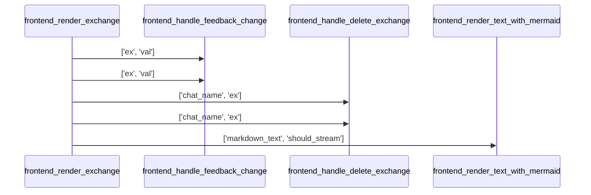
* **Signature:** `def render_exchange(ex, current_chat_name)`
* **Description:** Renders a single chat exchange in Streamlit, showing the user question, assistant answer, feedback buttons, comment pop‑over, download link, and delete button. Handles error messages specially.
* **Parameters:** `ex` (`dict`), `current_chat_name` (`str`)
* **Returns:** *(none)*

---

### File: `schemas/types.py`

*All classes are Pydantic models used for validation of LLM input/output. Detailed class docs are omitted here as they are not part of the runtime analysis (no analysis results were supplied).*

- `ParameterDescription`, `ReturnDescription`, `UsageContext`, `FunctionDescription`, `FunctionAnalysis`, `ConstructorDescription`, `ClassContext`, `ClassDescription`, `ClassAnalysis`, `CallInfo`, `FunctionContextInput`, `FunctionAnalysisInput`, `MethodContextInput`, `ClassContextInput`, `ClassAnalysisInput` – each defines fields according to the source code comments.

--- 

*End of automatically generated documentation.*