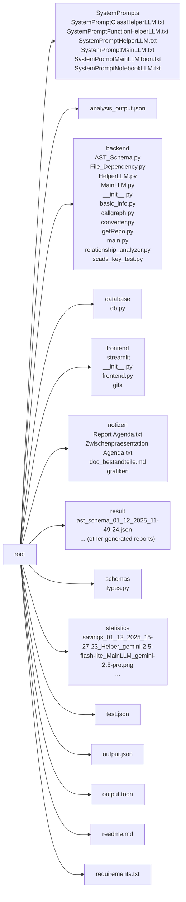
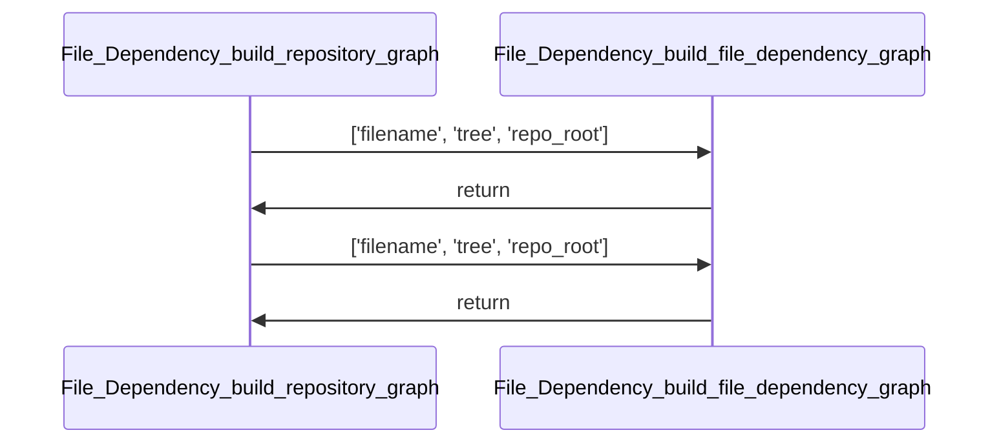
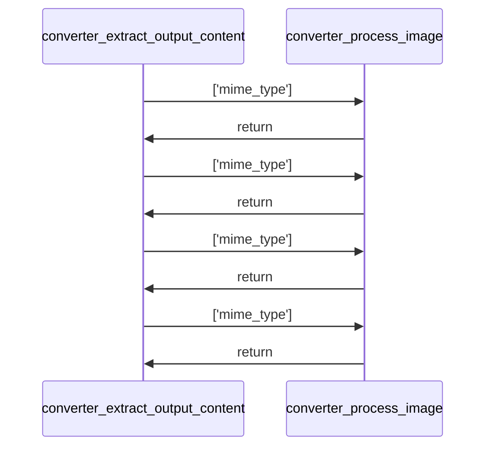
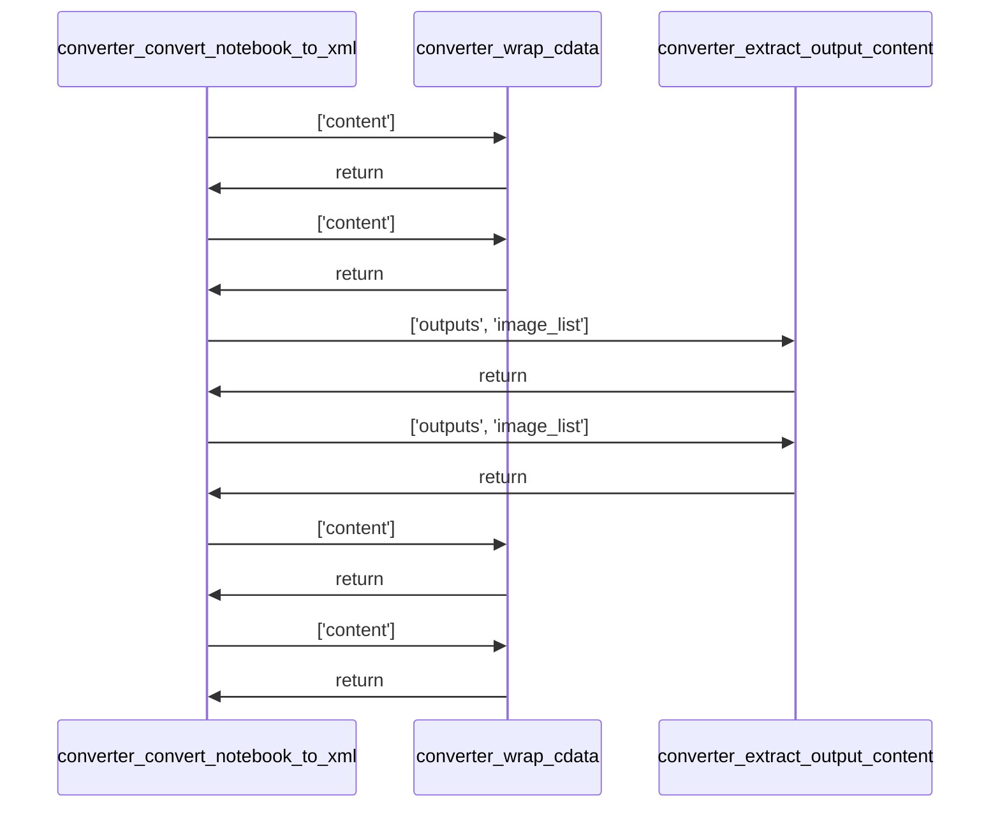
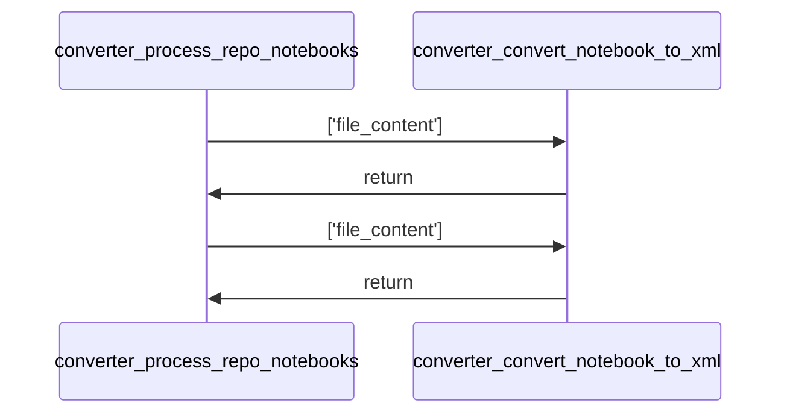
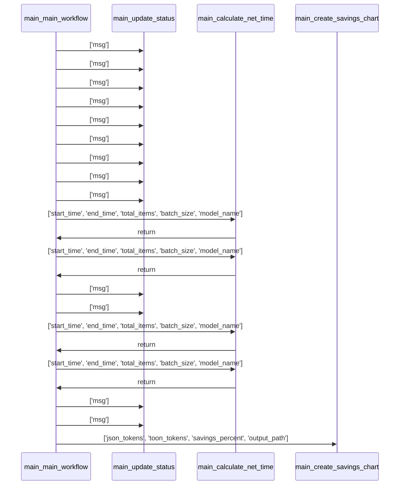
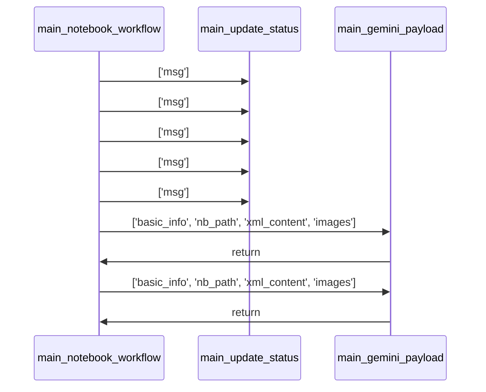

# Project Documentation: Repo Onboarding Agent 🚀

## 1. Project Overview
- **Description:**  
  *Could not be determined due to a missing README file and insufficient context.*  
  *(The repository appears to be an automated “on‑boarding” agent that clones a GitHub repository, extracts structural information, builds AST and call‑graph analyses, and uses various LLMs (Gemini, OpenAI, Ollama, etc.) to generate a complete documentation report.)*
- **Key Features:**  
  - Automated repository cloning and file‑tree construction.  
  - Static analysis producing AST schemas and call‑graph relationships.  
  - LLM‑driven generation of function‑ and class‑level documentation.  
  - Support for Jupyter‑notebook conversion to XML and multimodal LLM payloads.  
- **Tech Stack:**  
  - Python 3.12, **GitPython**, **networkx**, **matplotlib**, **pydantic**, **nbformat**, **streamlit**, **streamlit‑authenticator**, **streamlit‑mermaid**, **dotenv**, **langchain**, **langgraph**, **ollama**, **Google‑Gemini**, **OpenAI**, **SCADS‑LLM**.  

*Repository Structure*  



---

## 2. Installation
### Dependencies
- The repository ships a `requirements.txt`. Install with  

```bash
pip install -r requirements.txt
```

*(All versions are pinned in the file; major libraries include `streamlit`, `langchain`, `networkx`, `gitpython`, `pydantic`, `matplotlib`, etc.)*

### Setup Guide
1. Clone the repository.  
2. Create a virtual environment (`python -m venv .venv && source .venv/bin/activate`).  
3. Install the dependencies (see above).  
4. Provide the required API keys in a `.env` file (e.g., `GEMINI_API_KEY`, `OPENAI_API_KEY`, `SCADSLLM_API_KEY`, `SCADSLLM_URL`).  

### Quick Startup
```bash
streamlit run frontend/frontend.py
```
The Streamlit UI will prompt for the repository URL and required model selections, then launch the full analysis workflow.

---

## 3. Use Cases & Commands
| Use‑case | Primary command / entry point |
|----------|------------------------------|
| **Full repository onboarding** – clone, analyse, and generate a markdown report | `backend/main.py → main_workflow()` (triggered via the Streamlit UI) |
| **Generate documentation for a single function or class** | `backend/HelperLLM.py → LLMHelper.generate_for_functions()/generate_for_classes()` |
| **Visualise the call‑graph of own code** | `backend/callgraph.py → build_filtered_callgraph(repo)` |
| **Convert notebooks to XML for multimodal LLMs** | `backend/converter.py → process_repo_notebooks(repo_files)` |
| **Persist and retrieve chat history** | Functions in `database/db.py` (`insert_chat`, `fetch_exchanges_by_user`, …) |
| **Run only the notebook‑focused workflow** | `backend/main.py → notebook_workflow()` |
| **Create a token‑savings chart** | `backend/main.py → create_savings_chart()` |

---

## 4. Architecture
```mermaid
flowchart LR
    A[User (Streamlit UI)] --> B[Main Workflow (backend.main.main_workflow)]
    B --> C[GitRepository.clone()] --> D[RepoFile objects]
    D --> E[File‑Tree Builder (GitRepository.get_file_tree)]
    B --> F[ProjektInfoExtractor] --> G[Basic project metadata]
    B --> H[AST Analyzer (AST_Schema.ASTAnalyzer)] --> I[AST schema]
    B --> J[Relationship Analyzer (relationship_analyzer.ProjectAnalyzer)] --> K[Raw call relationships]
    I --> L[Merge relationships (ASTAnalyzer.merge_relationship_data)]
    L --> M[Prepare LLM inputs (FunctionAnalysisInput / ClassAnalysisInput)]
    M --> N[Helper LLM (HelperLLM.LLMHelper)] --> O[Function & Class docs]
    O --> P[Main LLM (MainLLM.MainLLM)] --> Q[Final markdown report]
    Q --> R[Save report & token‑savings chart]
    style A fill:#f9f,stroke:#333,stroke-width:2px
    style Q fill:#bbf,stroke:#333,stroke-width:2px
```

**Procedure Overview**

1. **Clone Repository** – `GitRepository` creates a temporary clone and enumerates all files.  
2. **Extract Basic Info** – `ProjektInfoExtractor` parses `pyproject.toml`, `requirements.txt` and `README.md`.  
3. **Build File Tree** – a hierarchical JSON structure is produced for UI display.  
4. **Static Analyses** –  
   * `ASTAnalyzer` parses each `.py` file, building an AST schema of imports, functions, and classes.  
   * `ProjectAnalyzer` builds a call‑graph of intra‑project calls.  
5. **Enrich AST** – outgoing/incoming call data are merged into the AST schema.  
6. **Prepare LLM Payloads** – each function and class is wrapped in a `FunctionAnalysisInput` or `ClassAnalysisInput` object (including imports and context).  
7. **Helper LLM** – batch‑processed documentation generation for all functions and classes.  
8. **Main LLM** – consumes the full enriched schema (in **TOON** format) and produces the final human‑readable report.  
9. **Post‑processing** – token‑usage comparison, optional chart generation, and persisting the report under `result/`.

---

## 5. Code Analysis  

### File: `backend/AST_Schema.py`

#### Function: `path_to_module`
* **Signature:** `def path_to_module(filepath, project_root)`
* **Description:** Converts a file path into a dot‑separated Python module path, handling relative paths and stripping the `.py` extension and any trailing `.__init__`.
* **Parameters:**  
  - **filepath** (`str`): Absolute or relative path to a Python file.  
  - **project_root** (`str`): Root directory of the project.  
* **Returns:**  
  - **module_path** (`str`): The derived module path.  
* **Usage:** No callers recorded (`called_by` none).

#### Class: `ASTVisitor`
* **Summary:** Traverses a Python AST, collecting imports, functions, and class definitions into a structured schema.
* **Instantiation:** Instantiated by `ASTAnalyzer.analyze_repository`.
* **Dependencies:** Uses `backend.AST_Schema.path_to_module`.
* **Constructor:**  
  * **Description:** Stores source code, file path, project root, computes module path, and prepares an empty schema.  
  * **Parameters:** `source_code` (`str`), `file_path` (`str`), `project_root` (`str`).  
* **Methods:**  

| Method | Signature | Description |
|--------|-----------|-------------|
| `visit_Import` | `def visit_Import(self, node)` | records `import` statements. |
| `visit_ImportFrom` | `def visit_ImportFrom(self, node)` | records `from … import …` statements. |
| `visit_ClassDef` | `def visit_ClassDef(self, node)` | creates a class entry in the schema and tracks context. |
| `visit_FunctionDef` | `def visit_FunctionDef(self, node)` | registers top‑level functions or methods (when inside a class). |
| `visit_AsyncFunctionDef` | `def visit_AsyncFunctionDef(self, node)` | delegates to `visit_FunctionDef` for async functions. |

* **Usage Context:** Instantiated by `ASTAnalyzer.analyze_repository`; no external calls.

#### Class: `ASTAnalyzer`
* **Summary:** Drives the end‑to‑end AST generation and merges relationship data.
* **Instantiation:** Used directly in `backend.main.main_workflow`.
* **Methods:**  

| Method | Signature | Description |
|--------|-----------|-------------|
| `merge_relationship_data` | `def merge_relationship_data(self, full_schema, raw_relationships)` | Enriches the AST schema with call‑graph information (outgoing/incoming calls, class dependencies). |
| `analyze_repository` | `def analyze_repository(self, files, repo)` | Parses each file, builds AST nodes, and returns a complete schema. |

* **Usage Context:** Called from `backend.main.main_workflow` after the repository is cloned.

---

### File: `backend/File_Dependency.py`

#### Function: `build_file_dependency_graph`
* **Signature:** `def build_file_dependency_graph(filename, tree, repo_root)`
* **Description:** Builds a directed graph (`networkx.DiGraph`) of import dependencies for a single Python file using `FileDependencyGraph`.
* **Parameters:**  
  - **filename** (`str`): Base name of the file (without `.py`).  
  - **tree** (`AST`): Parsed abstract syntax tree.  
  - **repo_root** (`str`): Repository root path.  
* **Returns:** `graph` (`nx.DiGraph`) – nodes are modules/files, edges represent import relationships.  
* **Usage:** Called by `build_repository_graph`.

#### Function: `build_repository_graph`

* **Signature:** `def build_repository_graph(repository)`
* **Description:** Iterates over all Python files in a `GitRepository`, builds per‑file dependency graphs, and merges them into a global repository‑wide graph.
* **Parameters:** `repository` (`GitRepository`).  
* **Returns:** `global_graph` (`nx.DiGraph`).  
* **Usage:** Not referenced elsewhere in the current pipeline.

#### Function: `get_all_temp_files`
* **Signature:** `def get_all_temp_files(directory)`
* **Description:** Recursively collects all `.py` files under `directory` using `pathlib.Path.rglob`. Returns a list of `Path` objects.  
* **Usage:** Invoked by `FileDependencyGraph._resolve_module_name`.

#### Class: `FileDependencyGraph`
* **Summary:** Walks an AST to resolve absolute and relative imports, building a mapping of file → imported symbols.
* **Instantiation:** Created inside `build_file_dependency_graph`.
* **Dependencies:** Relies on `get_all_temp_files`, `module_file_exists`, `init_exports_symbol` (internal helpers).  
* **Constructor:**  
  * **Description:** Stores the target filename and repository root.  
  * **Parameters:** `filename` (`str`), `repo_root` (`Any`).  
* **Methods:**  

| Method | Signature | Description |
|--------|-----------|-------------|
| `_resolve_module_name` | `def _resolve_module_name(self, node)` | Handles relative `from .. import …` statements, returning a list of resolved module/symbol names. |
| `module_file_exists` | `def module_file_exists(self, rel_base, name)` | Checks if a candidate module file or package `__init__.py` exists. |
| `init_exports_symbol` | `def init_exports_symbol(self, rel_base, symbol)` | Determines whether a symbol is exported via `__all__` or defined in `__init__.py`. |
| `visit_Import` | `def visit_Import(self, node, base_name=None)` | Records simple imports into `self.import_dependencies`. |
| `visit_ImportFrom` | `def visit_ImportFrom(self, node)` | Resolves relative imports via `_resolve_module_name` or records absolute imports. |
| `generic_visit` (inherited) | – | Continues traversal of the AST. |

* **Usage Context:** Used only by the two top‑level functions above.

---

### File: `backend/HelperLLM.py`

#### Function: `main_orchestrator`
* **Signature:** `def main_orchestrator()`
* **Description:** Demonstration driver that builds dummy `FunctionAnalysisInput` objects for three inventory‑manager methods, creates corresponding `FunctionAnalysis` objects, wraps them in a `ClassAnalysisInput` for an `InventoryManager` class, and invokes `LLMHelper` to generate documentation. No external calls beyond object construction.  
* **Usage:** Not part of the main workflow; serves as a test harness.

#### Class: `LLMHelper`
* **Summary:** Wrapper around various LLM providers (Gemini, OpenAI, Ollama, custom SCADS‑LLM) that batch‑processes function and class documentation requests using structured Pydantic schemas.
* **Instantiation:** Created in `backend/main.main_workflow` with the helper model and API key.  
* **Constructor:**  
  * **Description:** Loads system prompts, determines batch size based on the model, and builds the appropriate `Chat*` client.  
  * **Parameters:** `api_key`, `function_prompt_path`, `class_prompt_path`, optional `model_name` (default *gemini‑2.0‑flash‑lite*), optional `base_url`.  
* **Methods:**  

| Method | Signature | Description |
|--------|-----------|-------------|
| `_configure_batch_settings` | `def _configure_batch_settings(self, model_name)` | Sets `self.batch_size` according to the model (e.g., Gemini models get small batches, Llama gets larger). |
| `generate_for_functions` | `def generate_for_functions(self, function_inputs)` | Sends batches of function payloads to the LLM, parses structured `FunctionAnalysis` responses, respects Gemini rate‑limits (62 s sleep per batch). |
| `generate_for_classes` | `def generate_for_classes(self, class_inputs)` | Analogous to `generate_for_functions` but for class documentation (`ClassAnalysis`). |

* **Usage Context:** Called twice in `main_workflow` – first for functions, then for classes.

---

### File: `backend/MainLLM.py`

#### Class: `MainLLM`
* **Summary:** Primary interface for the “main” LLM that receives the full enriched repository description (in TOON format) and emits the final markdown report.
* **Instantiation:** In `backend/main.main_workflow` (model e.g., *gpt‑5.1*).  
* **Constructor:**  
  * **Description:** Reads the system prompt file, validates the API key, and creates the appropriate LLM client (Gemini, OpenAI, SCADS‑LLM, or Ollama). |
* **Methods:**  

| Method | Signature | Description |
|--------|-----------|-------------|
| `call_llm` | `def call_llm(self, user_input)` | Sends a single request (system prompt + user input) and returns the response content. |
| `stream_llm` | `def stream_llm(self, user_input)` | Streams the LLM response chunk‑by‑chunk (used by the notebook UI). |

* **Usage Context:** Called once in `main_workflow` to generate the final report, and repeatedly in `notebook_workflow` for per‑notebook reports.

---

### File: `backend/basic_info.py`

#### Class: `ProjektInfoExtractor`
* **Summary:** Extracts high‑level project metadata (`title`, `description`, `key_features`, `tech_stack`, `dependencies`) from common project files.
* **Instantiation:** Used in `backend.main.main_workflow` and `backend.main.notebook_workflow`.  
* **Constructor:** Initializes a placeholder info dictionary with the sentinel `"Information not found"`.  
* **Key Methods:**  

| Method | Signature | Description |
|--------|-----------|-------------|
| `_clean_content` | `def _clean_content(self, content)` | Strips null‑bytes caused by encoding issues. |
| `_finde_datei` | `def _finde_datei(self, patterns, dateien)` | Case‑insensitive file lookup. |
| `_extrahiere_sektion_aus_markdown` | `def _extrahiere_sektion_aus_markdown(self, inhalt, keywords)` | Regex extraction of Markdown sections (e.g., **Features**, **Tech Stack**). |
| `_parse_readme` | `def _parse_readme(self, inhalt)` | Parses README for title, description, features, tech‑stack, status, install/quick‑start. |
| `_parse_toml` | `def _parse_toml(self, inhalt)` | Extracts `name`, `description`, and `dependencies` from `pyproject.toml`. |
| `_parse_requirements` | `def _parse_requirements(self, inhalt)` | Parses `requirements.txt` into a list of dependencies. |
| `extrahiere_info` | `def extrahiere_info(self, dateien, repo_url)` | Orchestrates the whole extraction pipeline, returns the populated `info` dict. |

* **Usage Context:** Provides the `basic_info` section of the final TOON payload.

---

### File: `backend/callgraph.py`

#### Function: `make_safe_dot`
* **Signature:** `def make_safe_dot(graph, out_path)`
* **Description:** Relabels graph nodes to safe identifiers (`n0`, `n1`, …), stores original labels as node attributes, and writes a DOT file.  
* **Parameters:** `graph` (`nx.DiGraph`), `out_path` (`str`).  
* **Returns:** `None`.  

#### Function: `build_filtered_callgraph`
* **Signature:** `def build_filtered_callgraph(repo)`
* **Description:** Parses every Python file, builds a `CallGraph` per file, merges them, and filters edges to retain only calls between *own* functions (i.e., those present in the collected `own_functions` set). Returns the filtered call graph.  
* **Parameters:** `repo` (`GitRepository`).  
* **Returns:** `global_graph` (`nx.DiGraph`).  

#### Class: `CallGraph`
* **Summary:** Walks a Python AST to produce a call graph (`networkx.DiGraph`) with nodes representing fully‑qualified function names and edges representing calls.
* **Instantiation:** Used internally by `build_filtered_callgraph`.  
* **Key Methods:**  

| Method | Signature | Description |
|--------|-----------|-------------|
| `visit_Import` / `visit_ImportFrom` | … | Populate `import_mapping` for later resolution. |
| `visit_ClassDef` | … | Track current class context. |
| `visit_FunctionDef` | … | Record function definitions, update `local_defs`, and add nodes to the graph. |
| `visit_Call` | … | Resolve callee names, map them to fully‑qualified identifiers, and record edges. |
| `_recursive_call` / `_resolve_all_callee_names` / `_make_full_name` / `_current_caller` | internal helpers for name resolution. |

* **Usage Context:** Generates per‑file call graphs that are later merged.

---

### File: `backend/converter.py`

#### Function: `wrap_cdata`
* **Signature:** `def wrap_cdata(content)`
* **Description:** Returns the input string wrapped inside CDATA tags for safe XML insertion.  

#### Function: `extract_output_content`

* **Signature:** `def extract_output_content(outputs, image_list)`
* **Description:** Walks notebook output objects, extracts text, decodes base64 images, and returns a list of XML snippets (including `<IMAGE_PLACEHOLDER>` tags).  

#### Function: `process_image`
* **Signature:** `def process_image(mime_type)`
* **Description:** Helper used by `extract_output_content` – decodes a base64 image and returns an XML placeholder.  

#### Function: `convert_notebook_to_xml`

* **Signature:** `def convert_notebook_to_xml(file_content)`
* **Description:** Parses a Jupyter notebook (`nbformat.reads`), converts markdown cells to `<CELL type="markdown">`, code cells to CDATA‑wrapped `<CELL type="code">`, and code outputs to `<CELL type="output">` with embedded image placeholders. Returns `(xml_string, extracted_images)`.  

#### Function: `process_repo_notebooks`

* **Signature:** `def process_repo_notebooks(repo_files)`
* **Description:** Filters `.ipynb` files, logs progress, and applies `convert_notebook_to_xml` to each, producing a dict `{path: {"xml": ..., "images": [...]}}`.  

* **Usage Context:** Called from `backend.main.notebook_workflow` to prepare notebook payloads for the Notebook‑LLM.

---

### File: `backend/getRepo.py`

#### Class: `RepoFile`
* **Summary:** Represents a single file in a Git repository with lazy loading of blob, content, and size.
* **Instantiation:** By `GitRepository.get_all_files`.  
* **Key Properties / Methods:**  
  * `blob` – lazily loads the Git blob.  
  * `content` – lazily reads and decodes the file.  
  * `size` – lazily returns blob size.  
  * `analyze_word_count` – example analysis (word count).  
  * `to_dict(include_content=False)` – serialises metadata (optionally content).  

#### Class: `GitRepository`
* **Summary:** Clones a remote repo into a temporary directory, supplies `RepoFile` objects, and can emit a hierarchical file‑tree.
* **Instantiation:** In `backend.main.main_workflow` and `notebook_workflow`.  
* **Key Methods:**  
  * `get_all_files()` – returns a list of `RepoFile` objects for every file.  
  * `get_file_tree(include_content=False)` – builds a nested JSON representation of the repo.  
  * Context‑manager methods `__enter__` / `__exit__` ensure temporary directory cleanup.  

* **Usage Context:** Central source of all repository data for the rest of the pipeline.

---

### File: `backend/main.py`

*(Only the functions for which analysis data is available are detailed; other helper functions are omitted for brevity.)*

#### Function: `create_savings_chart`
* **Signature:** `def create_savings_chart(json_tokens, toon_tokens, savings_percent, output_path)`
* **Description:** Uses `matplotlib` to plot a two‑bar chart comparing JSON vs. TOON token counts and saves the figure.  

#### Function: `calculate_net_time`
* **Signature:** `def calculate_net_time(start_time, end_time, total_items, batch_size, model_name)`
* **Description:** Computes elapsed time minus Gemini‑specific rate‑limit sleeps (61 s per batch).  

#### Function: `main_workflow`

* **Signature:** `def main_workflow(input, api_keys, model_names, status_callback=None)`
* **Description:** Orchestrates the whole repository‑onboarding process:  
  1. Extract API keys & model names.  
  2. Parse the GitHub URL from *input*.  
  3. Clone the repo (`GitRepository`).  
  4. Extract basic project info (`ProjektInfoExtractor`).  
  5. Build the file tree.  
  6. Run the relationship analyzer (`ProjectAnalyzer`).  
  7. Build the AST schema (`ASTAnalyzer`).  
  8. Enrich the AST with call‑graph data.  
  9. Prepare `FunctionAnalysisInput` and `ClassAnalysisInput` payloads.  
 10. Invoke `LLMHelper` to generate function & class docs (batch‑aware).  
 11. Assemble the full payload for the *Main LLM* (including basic info, file tree, AST schema, and helper‑LLM results).  
 12. Encode to TOON, optionally evaluate token savings, and call `MainLLM` to obtain the final markdown report.  
 13. Persist the report and token‑savings chart; return the report and performance metrics.  

* **Usage Context:** Entry point for the Streamlit UI and any external automation.

#### Function: `update_status`
* **Signature:** `def update_status(msg)`
* **Description:** Logs a status message and forwards it to the optional `status_callback`.  

#### Function: `notebook_workflow`

* **Signature:** `def notebook_workflow(input, api_keys, model, status_callback=None)`
* **Description:** Similar to `main_workflow` but focuses on Jupyter notebooks: converts notebooks to XML, builds a Gemini‑style multimodal payload per notebook, calls the *Notebook LLM*, and concatenates individual reports.  

#### Function: `gemini_payload`
* **Signature:** `def gemini_payload(basic_info, nb_path, xml_content, images)`
* **Description:** Builds a list of `{type: "text" | "image_url", ...}` entries suitable for Gemini’s multimodal API, replacing `<IMAGE_PLACEHOLDER>` tags with base64‑encoded image data.  

* **Usage Context:** Used only inside `notebook_workflow`.

---

### File: `backend/relationship_analyzer.py`

#### Function: `path_to_module`
*Same description as in `backend.AST_Schema.path_to_module` (converts file paths to module paths).*

#### Class: `ProjectAnalyzer`
* **Summary:** Scans a Python project, collects definitions (functions, classes, methods), and resolves inter‑function calls.
* **Instantiation:** In `backend.main.main_workflow`.  
* **Key Methods:**  
  * `analyze()` – drives the whole analysis (find files → collect definitions → resolve calls).  
  * `get_raw_relationships()` – returns dictionaries `outgoing` and `incoming` mapping identifiers to caller/callee lists.  
  * `_collect_definitions(filepath)` – parses a file to register functions/classes (uses `path_to_module`).  
  * `_resolve_calls(filepath)` – runs `CallResolverVisitor` to fill `self.call_graph`.  

#### Class: `CallResolverVisitor`
* **Summary:** AST visitor that records call relationships, handling imports, class scopes, and attribute‑based calls.  
* **Key Methods:** `visit_ClassDef`, `visit_FunctionDef`, `visit_Call`, `visit_Import`, `visit_ImportFrom`, `visit_Assign`, `_resolve_call_qname`.  

* **Usage Context:** Internally used by `ProjectAnalyzer._resolve_calls`.

---

### File: `database/db.py` *(selected functions with analysis data)*

| Function | Description |
|----------|-------------|
| `encrypt_text(text)` | Encrypts a string with the configured cipher suite (returns unchanged text if cipher not available). |
| `decrypt_text(text)` | Decrypts a previously encrypted string; returns the original text on failure. |
| `insert_user(username, name, password)` | Creates a new user document in MongoDB with hashed password and empty API‑key fields. |
| `fetch_all_users()` | Returns a list of all user documents. |
| `fetch_user(username)` | Retrieves a single user document by `_id`. |
| `update_user_name(username, new_name)` | Updates the `name` field of a user. |
| `update_gemini_key(username, gemini_api_key)` | Encrypts and stores a Gemini API key for the user. |
| `update_gpt_key(username, gpt_api_key)` | Encrypts and stores a GPT API key. |
| `update_ollama_url(username, ollama_base_url)` | Stores the Ollama base URL for the user. |
| `update_opensrc_key(username, opensrc_api_key)` | Encrypts and stores an OpenSRC API key. |
| `fetch_gemini_key(username)` … (similar fetchers for GPT, Ollama, OpenSRC) |
| `insert_chat(username, chat_name)` | Creates a new chat entry with a UUID. |
| `fetch_chats_by_user(username)` | Returns all chats for the user (sorted). |
| `insert_exchange(...)` | Persists a full exchange (question/answer/metadata). |
| `fetch_exchanges_by_user(username)` | Returns all exchanges for a user (chronological). |
| `update_exchange_feedback(exchange_id, feedback)` | Stores a numeric feedback flag (1 = helpful, 0 = not helpful). |
| `update_exchange_feedback_message(exchange_id, feedback_message)` | Stores a free‑form feedback note. |
| `delete_exchange_by_id(exchange_id)` | Removes a single exchange. |
| `delete_full_chat(username, chat_name)` | Deletes a chat and all its exchanges atomically. |

*(All functions have straightforward CRUD semantics; error handling is limited to logging.)*

---

### File: `frontend/frontend.py` *(selected utility functions)*

| Function | Description |
|----------|-------------|
| `clean_names(model_list)` | Strips namespace prefixes from model identifiers (`foo/bar` → `bar`). |
| `get_filtered_models(source_list, category_name)` | Filters a list of model names by category keywords or a predefined “standard” list. |
| `save_gemini_cb()` / `save_ollama_cb()` | Persist user‑entered API keys/URLs to the database. |
| `load_data_from_db(username)` | Loads chats and exchanges into Streamlit session state, creating a default chat if none exist. |
| `handle_feedback_change(ex, val)` | Updates feedback on an exchange and triggers a UI rerun. |
| `handle_delete_exchange(chat_name, ex)` | Deletes an exchange from DB and UI state. |
| `handle_delete_chat(username, chat_name)` | Deletes a chat (and its exchanges) and ensures a fallback “Chat 1” exists. |
| `extract_repo_name(text)` | Extracts the repository name from a URL string. |
| `render_text_with_mermaid(markdown_text, should_stream=False)` | Renders mixed Markdown and Mermaid diagrams in Streamlit, optionally streaming the text. |
| `render_exchange(ex, current_chat_name)` | Displays a single chat exchange with interactive feedback buttons, download, and delete controls. |

*All UI functions interact with the `database.db` module and Streamlit’s session state.*

---

### File: `schemas/types.py` *(Pydantic models referenced throughout)*

| Class | Purpose |
|-------|---------|
| `ParameterDescription` | Describes a function parameter (name, type, description). |
| `ReturnDescription` | Describes a function return value. |
| `UsageContext` | Records which functions a function calls and which call it. |
| `FunctionDescription` | Holds overall description, parameters, returns, and usage context for a function. |
| `FunctionAnalysis` | Top‑level model for a documented function (identifier + description). |
| `ConstructorDescription` | Describes a class’s `__init__` (doc + parameters). |
| `ClassContext` | Captures a class’s external dependencies and who instantiates it. |
| `ClassDescription` | Combines overall purpose, constructor, methods, and usage context for a class. |
| `ClassAnalysis` | Top‑level model for a documented class (identifier + description). |
| `CallInfo` | Stores a single call event (file, function, mode, line). |
| `FunctionContextInput` | Input model for Helper LLM (calls + called_by). |
| `FunctionAnalysisInput` | Input payload for Helper LLM function documentation. |
| `MethodContextInput` | Input model for class methods (identifier, calls, called_by, args, docstring). |
| `ClassContextInput` | Input payload for Helper LLM class documentation. |
| `ClassAnalysisInput` | Input payload for Helper LLM class documentation. |

These models drive the structured communication with the LLMs and guarantee type‑safe JSON/TOON serialization.

---

*End of generated documentation.*