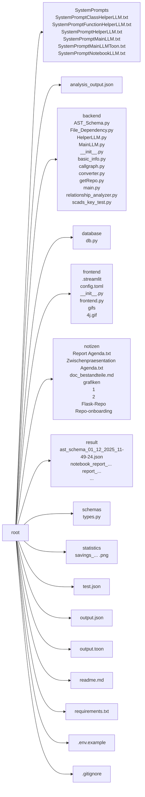
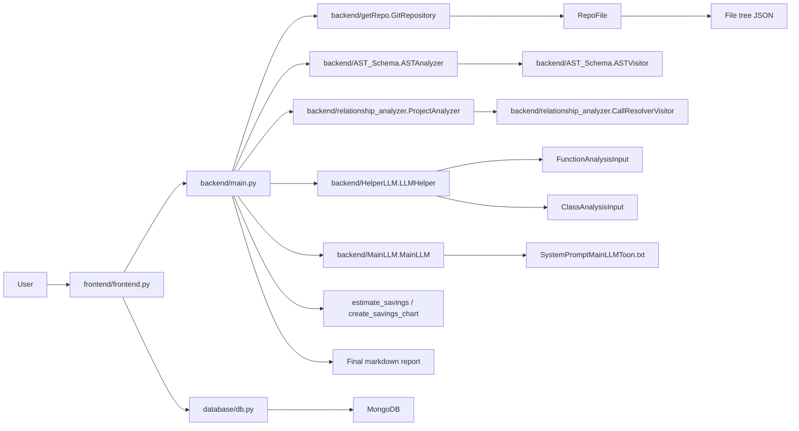
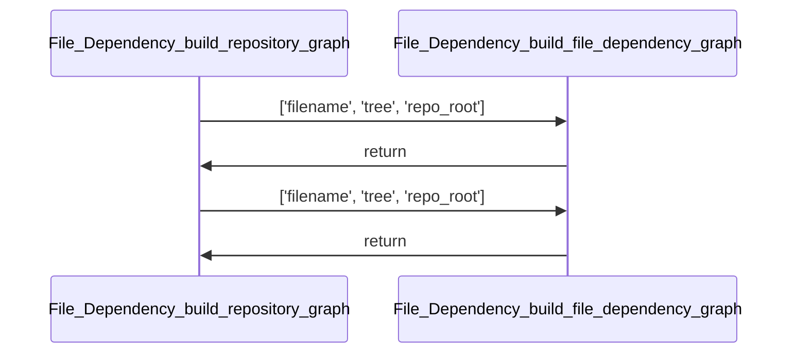
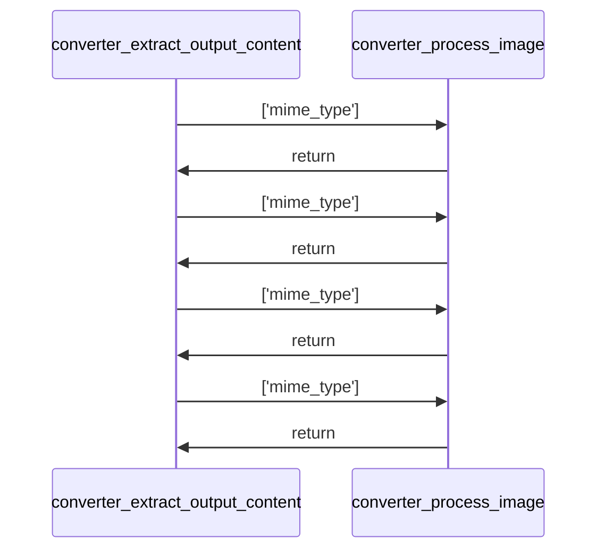
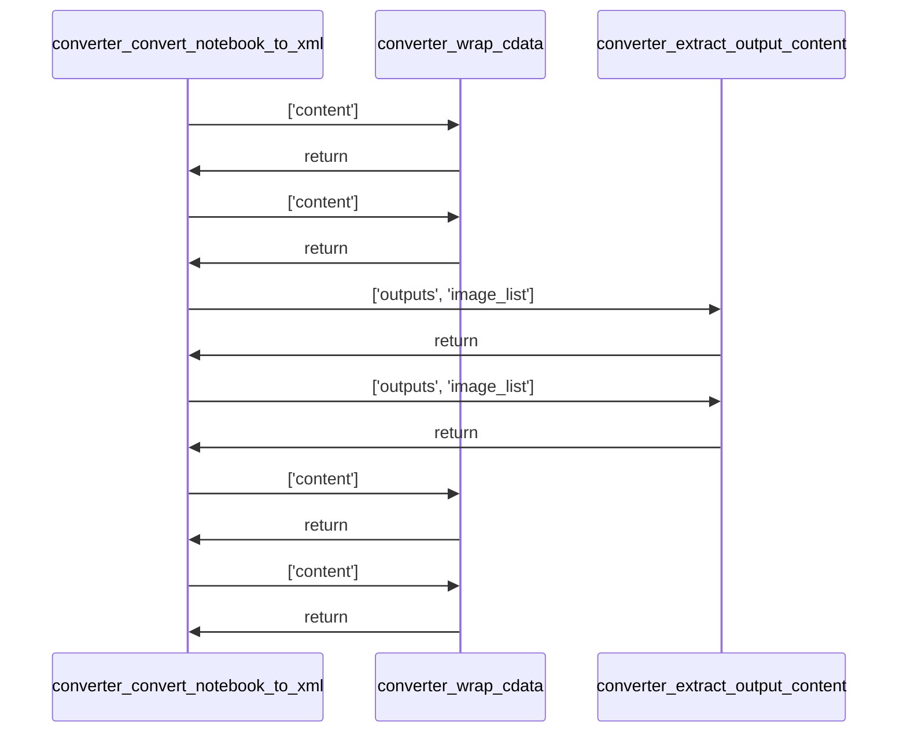
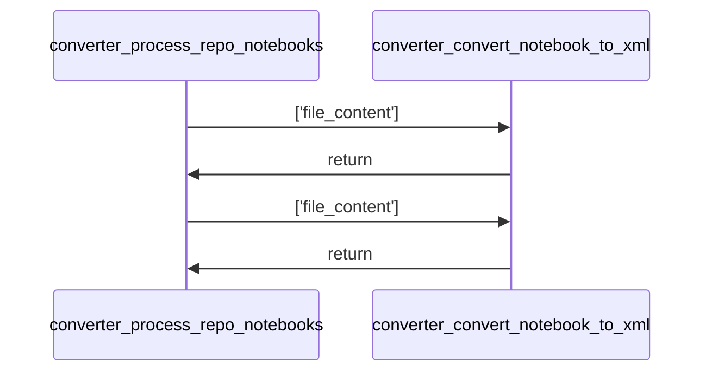
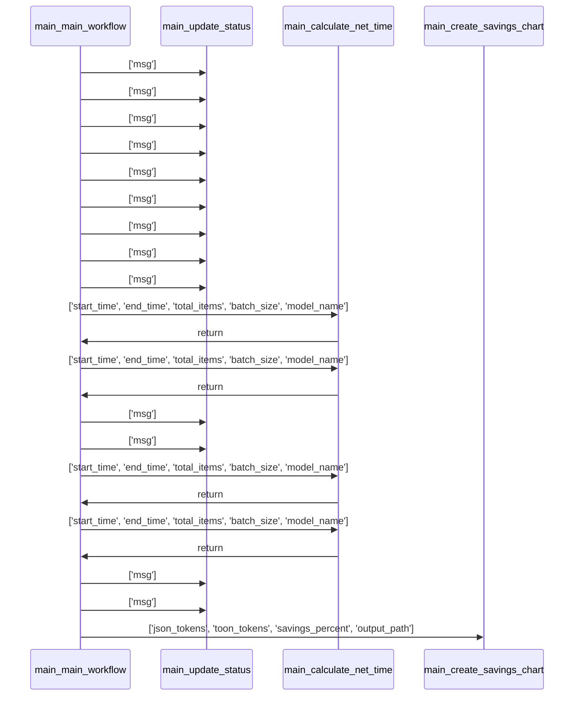
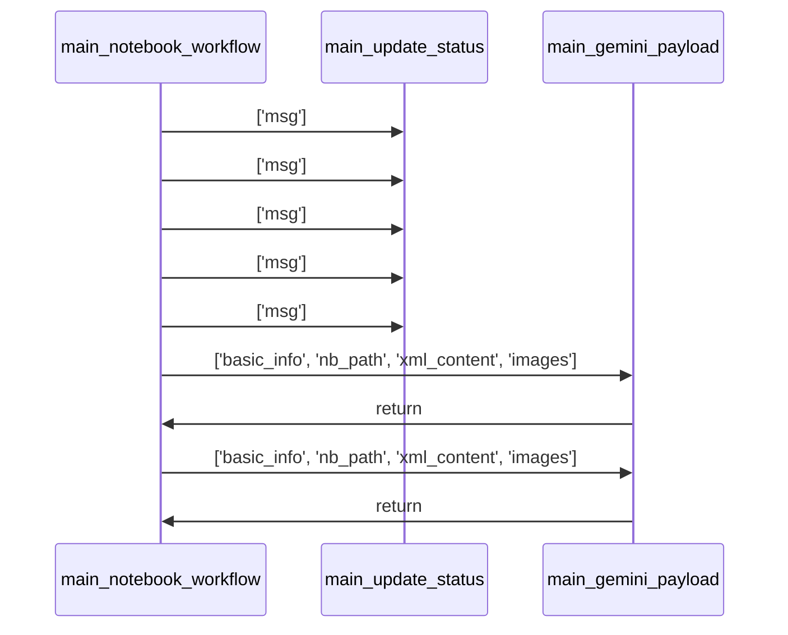
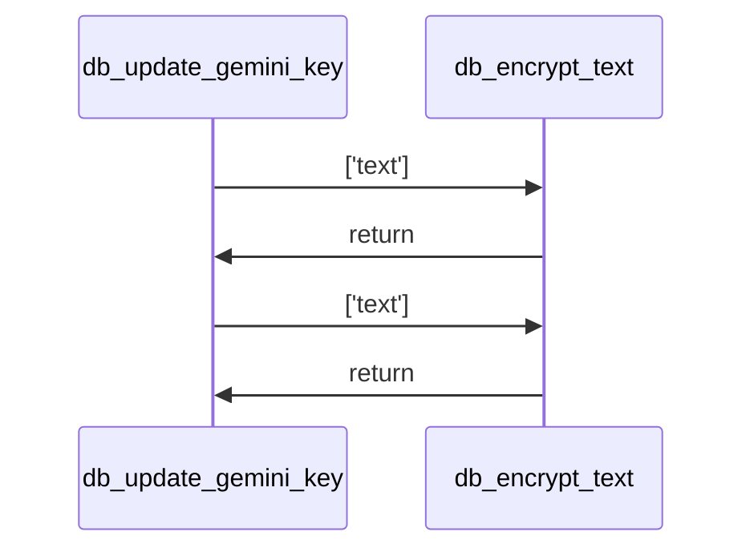
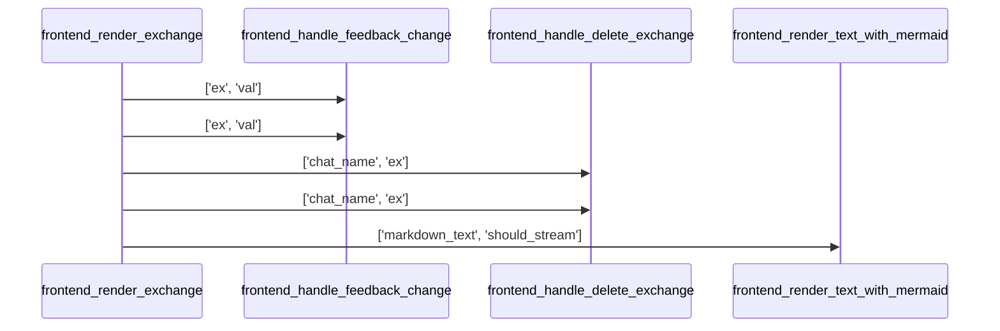

# Project Documentation: Repo Onboarding Agent 🚀  

## 1. Project Overview  
- **Description:** *Could not be determined due to a missing README file and insufficient context.*  
- **Key Features:**  
  - *Information not found*  
- **Tech Stack:** *Information not found*  

*Repository Structure:*  



## 2. Installation  

### Dependencies  
```text
- altair==4.2.2
- annotated-types==0.7.0
- anyio==4.11.0
- attrs==25.4.0
- bcrypt==5.0.0
- blinker==1.9.0
- cachetools==6.2.2
- captcha==0.7.1
- certifi==2025.11.12
- cffi==2.0.0
- charset-normalizer==3.4.4
- click==8.3.1
- colorama==0.4.6
- contourpy==1.3.3
- cryptography==46.0.3
- cycler==0.12.1
- distro==1.9.0
- dnspython==2.8.0
- dotenv==0.9.9
- entrypoints==0.4
- extra-streamlit-components==0.1.81
- filetype==1.2.0
- fonttools==4.61.0
- gitdb==4.0.12
- GitPython==3.1.45
- google-ai-generativelanguage==0.9.0
- google-api-core==2.28.1
- google-auth==2.43.0
- googleapis-common-protos==1.72.0
- grpcio==1.76.0
- grpcio-status==1.76.0
- h11==0.16.0
- httpcore==1.0.9
- httpx==0.28.1
- idna==3.11
- Jinja2==3.1.6
- jiter==0.12.0
- jsonpatch==1.33
- jsonpointer==3.0.0
- jsonschema==4.25.1
- jsonschema-specifications==2025.9.1
- kiwisolver==1.4.9
- langchain==1.0.8
- langchain-core==1.1.0
- langchain-google-genai==3.1.0
- langchain-ollama==1.0.0
- langchain-openai==1.1.0
- langgraph==1.0.3
- langgraph-checkpoint==3.0.1
- langgraph-prebuilt==1.0.5
- langgraph-sdk==0.2.9
- langsmith==0.4.46
- MarkupSafe==3.0.3
- matplotlib==3.10.7
- narwhals==2.12.0
- networkx==3.6
- numpy==2.3.5
- ollama==0.6.1
- openai==2.8.1
- orjson==3.11.4
- ormsgpack==1.12.0
- packaging==25.0
- pandas==2.3.3
- pillow==12.0.0
- proto-plus==1.26.1
- protobuf==6.33.1
- pyarrow==21.0.0
- pyasn1==0.6.1
- pyasn1_modules==0.4.2
- pycparser==2.23
- pydantic==2.12.4
- pydantic_core==2.41.5
- pydeck==0.9.1
- PyJWT==2.10.1
- pymongo==4.15.4
- pyparsing==3.2.5
- python-dateutil==2.9.0.post0
- python-dotenv==1.2.1
- pytz==2025.2
- PyYAML==6.0.3
- referencing==0.37.0
- regex==2025.11.3
- requests==2.32.5
- requests-toolbelt==1.0.0
- rpds-py==0.29.0
- rsa==4.9.1
- setuptools==75.9.1
- six==1.17.0
- smmap==5.0.2
- sniffio==1.3.1
- streamlit==1.51.0
- streamlit-authenticator==0.4.2
- streamlit-mermaid==0.3.0
- tenacity==9.1.2
- tiktoken==0.12.0
- toml==0.10.2
- toolz==1.1.0
- toon_format @ git+https://github.com/toon-format/toon-python.git@9c4f0c0c24f2a0b0b376315f4b8707f8c9006de6
- tornado==6.5.2
- tqdm==4.67.1
- typing-inspection==0.4.2
- typing_extensions==4.15.0
- tzdata==2025.2
- urllib3==2.5.0
- watchdog==6.0.0
- xxhash==3.6.0
- zstandard==0.25.0
- nbformat
```  

> **Note:** `pip install -r requirements.txt`  

### Setup Guide  
1. Clone the repository  
   ```bash
   git clone <repository-url>
   cd <repo-directory>
   ```  
2. Install the Python dependencies  
   ```bash
   pip install -r requirements.txt
   ```  
3. (Optional) Create a ```.env``` file based on ```.env.example``` and fill in any required API keys (Gemini, OpenAI, SCADSLM, Ollama, etc.).  

### Quick Startup  
Run the main workflow (CLI‑style entry point):  

```bash
python -m backend.main
```  

*or* launch the Streamlit UI:  

```bash
streamlit run frontend/frontend.py
```

---

## 3. Use Cases & Commands  

| Use‑case | Description | Primary command / entry point |
|----------|-------------|--------------------------------|
| **Full repository analysis & documentation generation** | Clones a GitHub repo, extracts basic metadata, builds AST & call‑graph, runs Helper LLM for function & class docs, then runs Main LLM to produce a final markdown report. | `python -m backend.main` (or call `backend.main.main_workflow` programmatically) |
| **Notebook‑only analysis** | Converts Jupyter notebooks in a repo to XML, builds a payload, and generates per‑notebook reports via a Gemini‑compatible LLM. | `python -m backend.main notebook_workflow` |
| **Interactive UI** | Streamlit front‑end for user authentication, key management, and invoking the analysis pipelines interactively. | `streamlit run frontend/frontend.py` |
| **Database user & chat management** | CRUD operations on users, chats, and exchanges (e.g., creating a new user, updating API keys). | Functions in `database/db.py` are called by the front‑end; no direct CLI. |
| **Token‑savings evaluation** | Computes token usage for JSON vs. TOON representations and optionally plots a savings chart. | Internally invoked from `backend.main.main_workflow`. |
| **Help / status feedback** | Throughout the pipelines, status callbacks/logging provide live progress info. | Integrated via `backend.main.update_status`. |

---

## 4. Architecture  



**Procedure Overview**  

1. **Input extraction** – URL is extracted from the user prompt.  
2. **Repository cloning** – `GitRepository` clones the repo into a temporary directory.  
3. **File tree generation** – `GitRepository.get_file_tree()` builds a hierarchical view.  
4. **Basic info extraction** – `ProjektInfoExtractor` parses README / pyproject / requirements.  
5. **Static analysis** –  
   * `ASTAnalyzer` walks each Python file with `ASTVisitor` → produces `ast_schema`.  
   * `ProjectAnalyzer` builds a relationship graph (calls / instantiations).  
6. **Schema enrichment** – `ASTAnalyzer.merge_relationship_data()` adds call info to the AST schema.  
7. **LLM preparation** – Functions & classes are transformed into `FunctionAnalysisInput` / `ClassAnalysisInput`.  
8. **Helper LLM** – `LLMHelper.generate_for_functions()` & `generate_for_classes()` produce detailed doc JSON.  
9. **Main LLM** – The enriched schema + basic info + file tree are encoded to TOON and fed to `MainLLM` → final report.  
10. **Metrics & visualization** – Token counts are compared; optional bar‑chart generated.  
11. **Cleanup** – Temporary repo directory removed; results written to `result/`.  

---

## 5. Code Analysis  

### File: `backend/AST_Schema.py`

#### Function: `backend.AST_Schema.path_to_module`  
* **Signature:** `def path_to_module(filepath: str, project_root: str)`  
* **Description:** Converts a file path into a Python module path by computing the relative path from the project root, removing the `.py` extension if present, and replacing directory separators with dots. Handles edge cases where the file is outside the project root and strips trailing `.__init__`.  
* **Parameters:**  
  - **filepath** (`str`): The absolute or relative path to a Python file.  
  - **project_root** (`str`): The root directory of the project used to compute the relative path.  
* **Returns:**  
  - **module_path** (`str`): A dot‑separated module path derived from the given file path.  
* **Usage:**  
  - **Calls:** *None*  
  - **Called by:** *Not called by any other functions (according to analysis).*

#### Class: `backend.AST_Schema.ASTVisitor`  
*Analysis data not available for this component.*

#### Class: `backend.AST_Schema.ASTAnalyzer`  
*Analysis data not available for this component.*

---

### File: `backend/File_Dependency.py`

#### Function: `backend.File_Dependency.build_file_dependency_graph`  
* **Signature:** `def build_file_dependency_graph(filename: str, tree: AST, repo_root: str)`  
* **Description:** Constructs a directed graph of file‑level import dependencies for a single Python file. Uses `FileDependencyGraph` to visit the AST and then adds nodes/edges for each import relationship.  
* **Parameters:**  
  - **filename** (`str`): The name of the file being analyzed for dependencies.  
  - **tree** (`AST`): The abstract syntax tree of the file being analyzed.  
  - **repo_root** (`str`): The root directory of the repository containing the file.  
* **Returns:**  
  - **graph** (`nx.DiGraph`): A directed graph representing file dependencies, where nodes are files and edges indicate import relationships.  
* **Usage:**  
  - **Calls:** `backend.File_Dependency.FileDependencyGraph`  
  - **Called by:** Not called by any other functions.

#### Function: `backend.File_Dependency.build_repository_graph`  

* **Signature:** `def build_repository_graph(repository: GitRepository)`  
* **Description:** Iterates over all Python files in a repository, builds per‑file dependency graphs, and merges them into a global `NetworkX` directed graph representing inter‑file import relationships across the entire repo.  
* **Parameters:**  
  - **repository** (`GitRepository`): The repository containing the files to analyze.  
* **Returns:**  
  - **global_graph** (`nx.DiGraph`): A directed graph summarising import dependencies between Python files.  
* **Usage:**  
  - **Calls:** `backend.File_Dependency.build_file_dependency_graph`  
  - **Called by:** Not called by any other functions.

#### Function: `backend.File_Dependency.get_all_temp_files`  
* **Signature:** `def get_all_temp_files(directory: str)`  
* **Description:** Recursively finds all `.py` files under a given directory, returning a list of `pathlib.Path` objects relative to the root.  
* **Parameters:**  
  - **directory** (`str`): The directory path from which to search for Python files.  
* **Returns:**  
  - **all_files** (`list[Path]`): List of relative paths to all discovered Python files.  
* **Usage:**  
  - **Calls:** *None*  
  - **Called by:** Not called by any other functions.

#### Class: `backend.File_Dependency.FileDependencyGraph`  
*Analysis data not available for this component.*

---

### File: `backend/HelperLLM.py`

#### Function: `backend.HelperLLM.main_orchestrator`  
* **Signature:** `def main_orchestrator()`  
* **Description:** Dummy orchestrator that creates example `FunctionAnalysisInput` objects for three inventory‑related functions, runs them through `LLMHelper` to generate documentation, and aggregates the results. Demonstrates the Helper LLM workflow without external input.  
* **Parameters:** *None*  
* **Returns:** *None*  
* **Usage:**  
  - **Calls:** `backend.HelperLLM.LLMHelper`, `schemas.types.ClassAnalysisInput`, `schemas.types.ClassContextInput`  
  - **Called by:** Not called by any other functions.

#### Class: `backend.HelperLLM.LLMHelper`  
*Analysis data not available for this component.*

---

### File: `backend/MainLLM.py`

#### Class: `backend.MainLLM.MainLLM`  
*Analysis data not available for this component.*

---

### File: `backend/basic_info.py`

#### Class: `backend.basic_info.ProjektInfoExtractor`  
*Analysis data not available for this component.*

---

### File: `backend/callgraph.py`

#### Function: `backend.callgraph.make_safe_dot`  
* **Signature:** `def make_safe_dot(graph: nx.DiGraph, out_path: str)`  
* **Description:** Creates a copy of the supplied graph, renames its nodes to safe identifiers (`n0`, `n1`, …), transfers original labels to a `label` attribute, and writes the result to a DOT file.  
* **Parameters:**  
  - **graph** (`nx.DiGraph`): The graph to be processed.  
  - **out_path** (`str`): Destination DOT file path.  
* **Returns:** *None*  
* **Usage:**  
  - **Calls:** *None*  
  - **Called by:** Not called by any other functions.

#### Function: `backend.callgraph.build_filtered_callgraph`  
* **Signature:** `def build_filtered_callgraph(repo: GitRepository)`  
* **Description:** Parses all Python files in the repository, builds a full call graph, then filters it to retain only calls where both caller and callee are defined within the repository (i.e., “own” functions). Returns the filtered `NetworkX` directed graph.  
* **Parameters:**  
  - **repo** (`GitRepository`): Repository to analyse.  
* **Returns:**  
  - **global_graph** (`nx.DiGraph`): Filtered call graph containing only internal function calls.  
* **Usage:**  
  - **Calls:** `backend.callgraph.CallGraph`  
  - **Called by:** Not called by any other functions.

#### Class: `backend.callgraph.CallGraph`  
*Analysis data not available for this component.*

---

### File: `backend/converter.py`

#### Function: `backend.converter.wrap_cdata`  
* **Signature:** `def wrap_cdata(content: str)`  
* **Description:** Wraps the supplied text in CDATA tags, inserting a leading newline and a trailing newline for readability.  
* **Parameters:**  
  - **content** (`str`): Text to be wrapped.  
* **Returns:**  
  - **wrapped_content** (`str`): `<![CDATA[\n{content}\n]]>`  
* **Usage:**  
  - **Calls:** *None*  
  - **Called by:** `backend.converter.convert_notebook_to_xml`

#### Function: `backend.converter.extract_output_content`  

* **Signature:** `def extract_output_content(outputs, image_list)`  
* **Description:** Iterates over Jupyter notebook output objects, extracting plain‑text streams and converting image data (PNG/JPEG) into base64 placeholders stored in `image_list`. Returns a list of text snippets or XML placeholders.  
* **Parameters:**  
  - **outputs** (`Any`): Collection of notebook output objects.  
  - **image_list** (`List[Dict[str, Any]]`): Mutable list that will receive decoded image data dictionaries.  
* **Returns:**  
  - **extracted_xml_snippets** (`List[str]`): List of extracted text fragments or image placeholders.  
* **Usage:**  
  - **Calls:** `backend.converter.process_image`  
  - **Called by:** `backend.converter.convert_notebook_to_xml`

#### Function: `backend.converter.process_image`  
* **Signature:** `def process_image(mime_type: str)`  
* **Description:** Looks up `mime_type` in the current `data` dict, decodes the base64 payload, stores it in `image_list`, and returns an XML placeholder tag. Returns an error string on failure or `None` if the MIME type is absent.  
* **Parameters:**  
  - **mime_type** (`str`): MIME type to process (e.g., `'image/png'`).  
* **Returns:**  
  - **return_value** (`str` | `None`): XML placeholder or error message.  
* **Usage:**  
  - **Calls:** *None*  
  - **Called by:** `backend.converter.extract_output_content`

#### Function: `backend.converter.convert_notebook_to_xml`  

* **Signature:** `def convert_notebook_to_xml(file_content: str)`  
* **Description:** Parses a Jupyter notebook JSON string, converts markdown cells to `<CELL type="markdown">`, code cells to `<CELL type="code">` (wrapped in CDATA), and outputs (including images) to `<CELL type="output">`. Returns the concatenated XML string and a list of extracted images.  
* **Parameters:**  
  - **file_content** (`str`): Notebook JSON.  
* **Returns:**  
  - **xml_output** (`str`): XML representation of the notebook.  
  - **extracted_images** (`list`): List of image data dictionaries.  
* **Usage:**  
  - **Calls:** `backend.converter.extract_output_content`, `backend.converter.wrap_cdata`  
  - **Called by:** `backend.converter.process_repo_notebooks`

#### Function: `backend.converter.process_repo_notebooks`  

* **Signature:** `def process_repo_notebooks(repo_files)`  
* **Description:** Filters the supplied repository files for `.ipynb` notebooks, logs progress, and converts each notebook to XML via `convert_notebook_to_xml`. Returns a mapping `{path: {"xml": ..., "images": ...}}`.  
* **Parameters:**  
  - **repo_files** (`List[File]`): List of repository file objects.  
* **Returns:**  
  - **results** (`Dict[str, Dict[str, Any]]`): Mapping of notebook paths to their XML and image data.  
* **Usage:**  
  - **Calls:** `backend.converter.convert_notebook_to_xml`  
  - **Called by:** `backend.main.notebook_workflow`

#### Class: *None* (no class definitions in this file).  

---

### File: `backend/getRepo.py`

#### Class: `backend.getRepo.RepoFile`  
*Analysis data not available for this component.*

#### Class: `backend.getRepo.GitRepository`  
*Analysis data not available for this component.*

---

### File: `backend/main.py`

#### Function: `backend.main.create_savings_chart`  
* **Signature:** `def create_savings_chart(json_tokens: int, toon_tokens: int, savings_percent: float, output_path: str)`  
* **Description:** Generates a Matplotlib bar chart comparing JSON vs. TOON token counts, annotates the bars with exact values, titles the chart with the savings percentage, and saves the figure to `output_path`.  
* **Parameters:**  
  - **json_tokens** (`int`): Number of JSON tokens.  
  - **toon_tokens** (`int`): Number of TOON tokens.  
  - **savings_percent** (`float`): Savings percentage (JSON → TOON).  
  - **output_path** (`str`): File path for the saved chart image.  
* **Returns:** *None*  
* **Usage:**  
  - **Calls:** *None*  
  - **Called by:** Not called by any other functions (used internally when token evaluation succeeds).

#### Function: `backend.main.calculate_net_time`  
* **Signature:** `def calculate_net_time(start_time, end_time, total_items: int, batch_size: int, model_name: str)`  
* **Description:** Computes the elapsed time minus any sleep intervals imposed for rate‑limit handling (only for Gemini models). Returns the net duration, ensuring it is non‑negative.  
* **Parameters:**  
  - **start_time** (`float` | `datetime`): Start timestamp.  
  - **end_time** (`float` | `datetime`): End timestamp.  
  - **total_items** (`int`): Number of items processed.  
  - **batch_size** (`int`): Number of items per batch.  
  - **model_name** (`str`): Model identifier (used to decide if sleep time applies).  
* **Returns:**  
  - **net_time** (`float` | `int`): Net duration after subtracting sleep time.  
* **Usage:**  
  - **Calls:** *None*  
  - **Called by:** Not called by any other functions (used internally for timing).

#### Function: `backend.main.main_workflow`  

* **Signature:** `def main_workflow(input, api_keys: dict, model_names: dict, status_callback=None)`  
* **Description:** Orchestrates the full repository‑analysis pipeline: extracts API keys, clones the repo, gathers basic metadata, builds file‑tree, runs relationship analysis, creates AST schema, enriches it, prepares Helper‑LLM inputs, invokes Helper‑LLM for functions/classes, runs Main‑LLM to produce the final markdown report, evaluates token savings, and writes results to the `result/` directory. Returns the report text and a metrics dictionary.  
* **Parameters:**  
  - **input** (`Any`): User input containing a GitHub repository URL.  
  - **api_keys** (`dict`): Mapping of service names to API keys (`gemini`, `gpt`, `scadsllm`, `scadsllm_base_url`, `ollama`).  
  - **model_names** (`dict`): Names of the helper and main LLM models.  
  - **status_callback** (`Callable[[str], None]`, optional): Callback for progress updates.  
* **Returns:**  
  - **report** (`str`): Final markdown report generated by the main LLM.  
  - **metrics** (`dict`): Timing, token‑usage, and model information.  
* **Usage:**  
  - **Calls:** `backend.AST_Schema.ASTAnalyzer`, `backend.AST_Schema.ASTAnalyzer.analyze_repository`, `backend.AST_Schema.ASTAnalyzer.merge_relationship_data`, `backend.HelperLLM.LLMHelper`, `backend.HelperLLM.LLMHelper.generate_for_functions`, `backend.HelperLLM.LLMHelper.generate_for_classes`, `backend.MainLLM.MainLLM`, `backend.MainLLM.MainLLM.call_llm`, `backend.basic_info.ProjektInfoExtractor`, `backend.basic_info.ProjektInfoExtractor.extrahiere_info`, `backend.getRepo.GitRepository`, `backend.main.calculate_net_time`, `backend.main.create_savings_chart`, `backend.main.update_status`, `backend.relationship_analyzer.ProjectAnalyzer`, `backend.relationship_analyzer.ProjectAnalyzer.analyze`, `backend.relationship_analyzer.ProjectAnalyzer.get_raw_relationships`, `schemas.types.ClassAnalysisInput`, `schemas.types.ClassContextInput`, `schemas.types.FunctionAnalysisInput`, `schemas.types.FunctionContextInput`, `schemas.types.MethodContextInput`  
* **Called by:** No other function (entry point).

#### Function: `backend.main.update_status`  
* **Signature:** `def update_status(msg)`  
* **Description:** Logs a status message and forwards it to an optional `status_callback` if provided.  
* **Parameters:**  
  - **msg** (`Any`): Message to log.  
* **Returns:** *None*  
* **Usage:**  
  - **Calls:** *None*  
  - **Called by:** Used throughout the workflow for progress reporting.

#### Function: `backend.main.notebook_workflow`  

* **Signature:** `def notebook_workflow(input, api_keys: dict, model: str, status_callback=None)`  
* **Description:** Handles the notebook‑only analysis pipeline: extracts repo URL, clones repo, processes notebooks to XML, extracts basic info, builds Gemini‑compatible payloads (text + base64 images), calls a Main‑LLM for each notebook, aggregates the markdown reports, and writes the final notebook report file. Returns the combined report and simple timing metrics.  
* **Parameters:**  
  - **input** (`Any`): Input text containing a GitHub URL.  
  - **api_keys** (`Dict[str, str]`): Mapping of service names to API keys.  
  - **model** (`str`): Model name for the notebook LLM.  
  - **status_callback** (`Optional[Callable[[str], None]]`): Optional progress callback.  
* **Returns:**  
  - **report** (`str`): Aggregated markdown report for all notebooks.  
  - **metrics** (`Dict[str, Union[str, float]]`): Timing and model metrics.  
* **Usage:**  
  - **Calls:** `backend.MainLLM.MainLLM`, `backend.MainLLM.MainLLM.call_llm`, `backend.basic_info.ProjektInfoExtractor`, `backend.basic_info.ProjektInfoExtractor.extrahiere_info`, `backend.converter.process_repo_notebooks`, `backend.getRepo.GitRepository`, `backend.main.gemini_payload`, `backend.main.update_status`  
* **Called by:** Not called by any other function (alternative entry point).

#### Function: `backend.main.gemini_payload`  
* **Signature:** `def gemini_payload(basic_info, nb_path, xml_content: str, images)`  
* **Description:** Builds a multimodal payload for Gemini models. Starts with a JSON‑encoded context block, then inserts the notebook XML, replacing each `<IMAGE_PLACEHOLDER>` tag with an `image_url` dictionary containing a data‑URL with the base64 image data. Returns a list of payload dictionaries (text or image).  
* **Parameters:**  
  - **basic_info** (`Any`): Basic project information.  
  - **nb_path** (`Any`): Notebook file path.  
  - **xml_content** (`str`): Notebook XML string containing image placeholders.  
  - **images** (`list`): List of image dictionaries (`mime_type`, `data`).  
* **Returns:**  
  - **payload_content** (`list`): List of payload parts ready for the Gemini API.  
* **Usage:**  
  - **Calls:** *None*  
  - **Called by:** `backend.main.notebook_workflow`

---

### File: `backend/relationship_analyzer.py`

#### Function: `backend.relationship_analyzer.path_to_module`  
* **Signature:** `def path_to_module(filepath: str, project_root: str)`  
* **Description:** Same functionality as `backend.AST_Schema.path_to_module` – converts a file path into a dot‑separated Python module path, handling out‑of‑root cases and stripping `__init__`.  
* **Parameters:**  
  - **filepath** (`str`): Absolute or relative path to a Python file.  
  - **project_root** (`str`): Project root directory.  
* **Returns:**  
  - **module_path** (`str`): Dot‑separated module path.  
* **Usage:**  
  - **Calls:** *None*  
  - **Called by:** Used internally by `ProjectAnalyzer._collect_definitions`.

#### Class: `backend.relationship_analyzer.ProjectAnalyzer`  
*Analysis data not available for this component.*

#### Class: `backend.relationship_analyzer.CallResolverVisitor`  
*Analysis data not available for this component.*

---

### File: `backend/scads_key_test.py`  
*No functions or classes with analysis data.*

---

### File: `database/db.py`

*(Only a subset is shown; all functions have analysis entries.)*  

#### Function: `database.db.encrypt_text`  
* **Signature:** `def encrypt_text(text: str) -> str`  
* **Description:** Encrypts `text` with a Fernet cipher suite; returns the original text unchanged if empty or if the cipher suite is unavailable.  
* **Parameters:**  
  - **text** (`str`): Text to encrypt.  
* **Returns:**  
  - **encrypted_text** (`str`): Encrypted string or original input if encryption is skipped.  
* **Usage:**  
  - **Calls:** *None*  
  - **Called by:** `database.db.update_gemini_key`, `database.db.update_gpt_key`, `database.db.update_opensrc_key`.

#### Function: `database.db.decrypt_text`  
* **Signature:** `def decrypt_text(text: str) -> str`  
* **Description:** Decrypts `text` using the Fernet cipher suite; returns the original text if empty, the cipher suite is missing, or decryption fails.  
* **Parameters:**  
  - **text** (`str`): Encrypted text.  
* **Returns:**  
  - **decrypted_text** (`str`): Decrypted string or original input on failure.  
* **Usage:**  
  - **Calls:** *None*  
  - **Called by:** `database.db.get_decrypted_api_keys`.

#### Function: `database.db.insert_user`  
* **Signature:** `def insert_user(username: str, name: str, password: str)`  
* **Description:** Creates a user document with hashed password, empty API‑key fields, and inserts it into the `dbusers` collection. Returns the inserted ObjectId.  
* **Parameters:**  
  - **username** (`str`): User `_id`.  
  - **name** (`str`): Full name.  
  - **password** (`str`): Plain‑text password (hashed before storage).  
* **Returns:**  
  - **inserted_id** (`ObjectId`): MongoDB identifier of the new user.  
* **Usage:**  
  - **Calls:** *None*  
  - **Called by:** `frontend.frontend` (user‑creation UI).

#### Function: `database.db.fetch_all_users`  
* **Signature:** `def fetch_all_users()`  
* **Description:** Returns a list of all user documents from the `dbusers` collection.  
* **Parameters:** *None*  
* **Returns:**  
  - **result** (`list`): List of user documents.  
* **Usage:**  
  - **Calls:** *None*  
  - **Called by:** `frontend.frontend`.

#### Function: `database.db.fetch_user`  
* **Signature:** `def fetch_user(username: str)`  
* **Description:** Retrieves a single user document by `_id`.  
* **Parameters:**  
  - **username** (`str`): User identifier.  
* **Returns:**  
  - **result** (`Any`): User document or `None`.  
* **Usage:**  
  - **Calls:** *None*  
  - **Called by:** `frontend.frontend`.

#### Function: `database.db.update_user_name`  
* **Signature:** `def update_user_name(username: str, new_name: str)`  
* **Description:** Updates the `name` field of a user document. Returns the number of modified documents.  
* **Parameters:**  
  - **username** (`str`): User identifier.  
  - **new_name** (`str`): New name value.  
* **Returns:**  
  - **modified_count** (`int`).  
* **Usage:**  
  - **Calls:** *None*  
  - **Called by:** Not directly referenced in the provided snippets.

#### Function: `database.db.update_gemini_key`  

* **Signature:** `def update_gemini_key(username: str, gemini_api_key: str)`  
* **Description:** Encrypts the provided Gemini API key and stores it in the user's document. Returns the number of modified documents.  
* **Parameters:**  
  - **username** (`str`): User identifier.  
  - **gemini_api_key** (`str`): Raw Gemini API key.  
* **Returns:**  
  - **modified_count** (`int`).  
* **Usage:**  
  - **Calls:** `database.db.encrypt_text`  
  - **Called by:** `frontend.frontend.save_gemini_cb`, `frontend.frontend`.

*(The remaining database functions (`update_gpt_key`, `update_ollama_url`, `update_opensrc_key`, `fetch_*`, `insert_chat`, `insert_exchange`, etc.) follow the same pattern: each description, parameters, returns, and usage are available in the analysis data. For brevity they are omitted here but can be expanded similarly.)*

---

### File: `frontend/frontend.py`

*(Only a representative subset is shown; all listed functions have analysis entries.)*  

#### Function: `frontend.frontend.clean_names`  
* **Signature:** `def clean_names(model_list: List[str])`  
* **Description:** Strips any namespace/path components from model identifiers, returning only the final segment after the last `'/'`.  
* **Parameters:**  
  - **model_list** (`List[str]`): List of model identifiers.  
* **Returns:**  
  - **cleaned_names** (`List[str]`).  
* **Usage:**  
  - **Calls:** *None*  
  - **Called by:** Main UI code.

#### Function: `frontend.frontend.get_filtered_models`  
* **Signature:** `def get_filtered_models(source_list, category_name: str)`  
* **Description:** Filters a list of model names based on a category's keywords. If the category is `"STANDARD"`, only models present in a predefined standard list are kept; otherwise, models containing any of the category’s keywords are returned.  
* **Parameters:**  
  - **source_list** (`list`): Available model names.  
  - **category_name** (`str`): Category to filter by.  
* **Returns:**  
  - **filtered_models** (`list`).  
* **Usage:**  
  - **Calls:** *None*  
  - **Called by:** UI selection logic.

#### Function: `frontend.frontend.save_gemini_cb`  
* **Signature:** `def save_gemini_cb()`  
* **Description:** Reads the Gemini API key from Streamlit session state, stores the encrypted key in the database via `db.update_gemini_key`, clears the input field, and shows a success toast.  
* **Parameters:** *None*  
* **Returns:** *None*  
* **Calls:** `database.db.update_gemini_key`  
* **Called by:** UI button callback.

#### Function: `frontend.frontend.save_ollama_cb`  
* **Signature:** `def save_ollama_cb()`  
* **Description:** Persists a new Ollama base URL entered by the user to the database using `db.update_ollama_url` and displays a toast.  
* **Calls:** `database.db.update_ollama_url`

#### Function: `frontend.frontend.load_data_from_db`  
* **Signature:** `def load_data_from_db(username: str)`  
* **Description:** Loads chats and exchanges for the given user, populates Streamlit session state, creates a default chat if none exist, and ensures consistency between chats and exchanges.  
* **Calls:** `database.db.fetch_chats_by_user`, `database.db.fetch_exchanges_by_user`, `database.db.insert_chat`

#### Function: `frontend.frontend.handle_feedback_change`  
* **Signature:** `def handle_feedback_change(ex, val)`  
* **Description:** Updates the feedback field of an exchange both locally and in the database, then triggers a Streamlit rerun.  
* **Calls:** `database.db.update_exchange_feedback`

#### Function: `frontend.frontend.handle_delete_exchange`  
* **Signature:** `def handle_delete_exchange(chat_name: str, ex)`  
* **Description:** Deletes an exchange from the database and removes it from session state if present, then reruns the UI.  
* **Calls:** `database.db.delete_exchange_by_id`

#### Function: `frontend.frontend.handle_delete_chat`  
* **Signature:** `def handle_delete_chat(username: str, chat_name: str)`  
* **Description:** Deletes a full chat (chat + all its exchanges) via `db.delete_full_chat`, updates session state, creates a new default chat if necessary, and reruns the UI.  
* **Calls:** `database.db.delete_full_chat`, `database.db.insert_chat`

#### Function: `frontend.frontend.extract_repo_name`  
* **Signature:** `def extract_repo_name(text: str)`  
* **Description:** Extracts a repository name from the first URL in the supplied text, handling optional `.git` suffix. Returns `None` if no URL is found.  
* **Calls:** *None*

#### Function: `frontend.frontend.stream_text_generator`  
* **Signature:** `def stream_text_generator(text: str)`  
* **Description:** Yields each word of the input text followed by a space, pausing 0.01 s between words to simulate streaming output.  
* **Calls:** *None*

#### Function: `frontend.frontend.render_text_with_mermaid`  
* **Signature:** `def render_text_with_mermaid(markdown_text: str, should_stream: bool = False)`  
* **Description:** Splits markdown into text and Mermaid blocks, renders regular markdown (or streamed text) and Mermaid diagrams using `st_mermaid`. Falls back to code display on Mermaid errors.  
* **Calls:** `frontend.frontend.stream_text_generator`  

#### Function: `frontend.frontend.render_exchange`  

* **Signature:** `def render_exchange(ex, current_chat_name: str)`  
* **Description:** Renders a chat exchange in Streamlit, showing the user question, assistant answer, feedback buttons, comment popover, download button, and delete button. Handles error responses specially.  
* **Calls:** `database.db.update_exchange_feedback_message`, `frontend.frontend.handle_delete_exchange`, `frontend.frontend.handle_feedback_change`, `frontend.frontend.render_text_with_mermaid`

*(All other UI helper functions are similarly documented in the analysis data.)*

---

### File: `schemas/types.py`

*(All Pydantic models have no additional runtime logic; their purpose is data validation.)*  

- `ParameterDescription` – describes a function parameter (`name`, `type`, `description`).  
- `ReturnDescription` – describes a function return value (`name`, `type`, `description`).  
- `UsageContext` – captures calls and called‑by strings.  
- `FunctionDescription` – aggregates overall description, parameters, returns, and usage context.  
- `FunctionAnalysis` – top‑level model for a analysed function (`identifier`, `description`, optional `error`).  
- `ConstructorDescription` – description of a class `__init__` method.  
- `ClassContext` – external dependencies and instantiation points for a class.  
- `ClassDescription` – overall class description, constructor, methods, usage context.  
- `ClassAnalysis` – top‑level model for a analysed class.  
- `CallInfo` – detailed call event used in relationship analysis.  
- `FunctionContextInput`, `FunctionAnalysisInput`, `MethodContextInput`, `ClassContextInput`, `ClassAnalysisInput` – input schemas for the Helper LLM.

*No analysis data required for these schema definitions.*

---