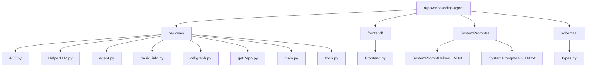
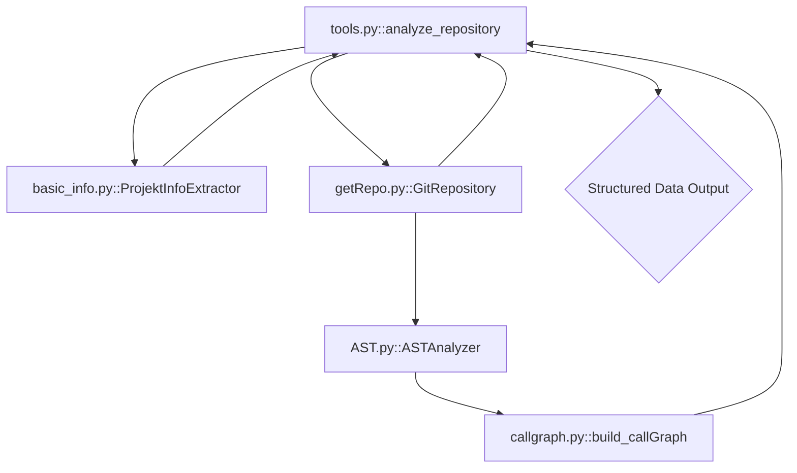

[!!] **WARNING: ANALYSIS INCOMPLETE**
This documentation may be incomplete due to errors encountered during repository analysis or because certain information could not be located. Sections with missing data (like detailed Setup Guides, Quick Start commands, and comprehensive Project Descriptions/Key Features) are marked accordingly. Dependency data also contained unreadable characters and has been manually cleaned.

# Project Documentation: repo-onboarding-agent

## 1. Project Overview
- **Description:** Weitere Schritte folgen...
- **Key Features:** 
  - Comprehensive Git Repository Cloning and File Management.
  - Python Abstract Syntax Tree (AST) Analysis for code introspection.
  - Automatic Code Call Graph Generation using NetworkX.
  - Extraction of Basic Project Metadata (README, dependencies).
  - Integration with a Helper LLM (Google Gemini) for detailed documentation synthesis.
- **Tech Stack:** Python, LangChain, Google GenAI, Pydantic, GitPython, NetworkX.

## 2. Architecture
### Repository Structure
The repository is divided into logical components, primarily `backend` (core logic and tools), `frontend` (UI), `schemas` (data models), and `SystemPrompts` (LLM configuration).



### Repository Call Graph
The core analysis workflow centers around the `analyze_repository` tool, which orchestrates file handling, metadata extraction, and code structure analysis.



## 3. Installation
### Dependencies
The dependencies required for this project are listed in `requirements.txt`.

`pip install -r requirements.txt`

Key dependencies detected (manually cleaned):
- `langchain`
- `langchain-core`
- `langchain-google-genai`
- `google-generativeai`
- `python-dotenv`
- `pydantic`
- `regex`
- `networkx`
- `GitPython`

### Setup Guide
[Information not found]

The project utilizes environment variables, as indicated by the presence of `python-dotenv` and `.env.example`. A setup likely requires:
1. Creating a `.env` file based on `.env.example`.
2. Populating the `.env` file with necessary API keys (e.g., `GEMINI_API_KEY`) and configuration settings.

### Quick Startup
[Information not found]

Given the architecture, the primary execution is managed through the agent (`backend/agent.py`) which utilizes the `analyze_repository` tool. A minimal startup would likely involve running the main script after configuring environment variables:

```bash
# Assuming the LLM_API_KEY is configured in .env
python backend/agent.py <REPO_URL_TO_ANALYZE> 
# OR, as demonstrated in backend/main.py:
python backend/main.py 
```

## 4. Use Cases & Commands
The **repo-onboarding-agent** is designed to autonomously analyze a given Git repository URL to generate comprehensive technical documentation data.

**Primary Use Case:**
Initiate a deep analysis of a remote Git repository, resulting in a structured JSON output that details the project's metadata, file structure, AST analysis of all Python files, and their internal function call graphs. This data is intended to be used by a main reasoning engine (like CodeScribe) to produce a final report.

## 5. Function & Class Reference

### File: `backend/AST.py`

**Class: `PythonASTVisitor`**
*Description: [Could not be determined from the source code.]*

**Function: `__init__`**
- **Signature:**
  ```python
  def __init__(self):
  ```
- **Description:** [Could not be determined from the source code.]
- **Parameters:**
  - `self` (PythonASTVisitor): [Could not be determined from the source code.]
- **Returns:** 
  - [Could not be determined from the source code.]
- **Calls:** []
- **Called By:** [`ASTAnalyzer.__init__`, `analyze_repository`, `main_orchestrator`]

**Function: `_extract_function_info`**
- **Signature:**
  ```python
  def _extract_function_info(self, node):
  ```
- **Description:** Helper method to extract JSON-compatible information from a function node.
- **Parameters:**
  - `self` (PythonASTVisitor): [Could not be determined from the source code.]
  - `node` (object): [Could not be determined from the source code.]
- **Returns:** 
  - [Could not be determined from the source code.]
- **Calls:** [`get_docstring`, `getattr`, `unparse`]
- **Called By:** [`visit_AsyncFunctionDef`, `visit_ClassDef`, `visit_FunctionDef`]

---

**Class: `ASTAnalyzer`**
*Description: Analyzes Python files of a repository and extracts a structured overview of their classes, functions, and imports based on the Abstract Syntax Tree (AST).*

**Function: `__init__`**
- **Signature:**
  ```python
  def __init__(self):
  ```
- **Description:** [Could not be determined from the source code.]
- **Parameters:**
  - `self` (ASTAnalyzer): [Could not be determined from the source code.]
- **Returns:** 
  - [Could not be determined from the source code.]
- **Calls:** []
- **Called By:** [`<main_block>`, `analyze_repository`]

**Function: `analyze_repository`**
- **Signature:**
  ```python
  def analyze_repository(self, files, repo_url):
  ```
- **Description:** Orchestrates the AST analysis for a whole list of files.
- **Parameters:**
  - `self` (ASTAnalyzer): [Could not be determined from the source code.]
  - `files` (list): A list of objects that have at least the attributes `.path` (str) and `.content` (str).
  - `repo_url` (str): The URL of the repository for the metadata.
- **Returns:** 
  - 'dict' (dict) The complete, hierarchical AST schema for the repository. Contains for each file two representations: one with AST nodes and one JSON-compatible.
- **Calls:** [`PythonASTVisitor`, `endswith`, `parse`, `print`, `strip`, `visit`]
- **Called By:** [`<main_block>`, `analyze_repository`]

---

### File: `backend/HelperLLM.py`

**Function: `main_orchestrator`**
- **Signature:**
  ```python
  def main_orchestrator():
  ```
- **Description:** Simulates the main agent's loop. 1. Defines mock data from repository analysis. 2. Processes functions first to gather their documentation. 3. Processes classes using the previously generated method docs. 4. Aggregates the results.
- **Parameters:**
  - [None]
- **Returns:** 
  - [Could not be determined from the source code.]
- **Calls:** [`ClassContextInput`, `FunctionContextInput`, `LLMHelper`, `dumps`, `generate_for_class`, `generate_for_function`, `info`, `print`, `warning`]
- **Called By:** [`<main_block>`]

**Class: `LLMHelper`**
*Description: A class to interact with Google Gemini for generating code snippet documentation. It centralizes API interaction, error handling, and validates I/O using Pydantic.*

**Function: `_call_llm_and_parse`**
- **Signature:**
  ```python
  def _call_llm_and_parse(self, user_json_payload):
  ```
- **Description:** PRIVATE: Calls the LLM and parses the response into a generic dictionary. It's the central point for raw API communication.
- **Parameters:**
  - `self` (LLMHelper): [Could not be determined from the source code.]
  - `user_json_payload` (object): [Could not be determined from the source code.]
- **Returns:** 
  - 'Optional[Dict[str, Any]]' (Optional[Dict[str, Any]]) [Could not be determined from the source code.]
- **Calls:** [`HumanMessage`, `SystemMessage`, `debug`, `error`, `info`, `invoke`, `loads`]
- **Called By:** [`generate_for_class`, `generate_for_function`]

---

### File: `backend/agent.py`

**Class: `LLMClient`**
*Description: Encapsulates the LLM client configuration and initialization.*

**Function: `_create_llm_instance`**
- **Signature:**
  ```python
  def _create_llm_instance(self):
  ```
- **Description:** Creates the instance of the LLM client.
- **Parameters:**
  - `self` (LLMClient): [Could not be determined from the source code.]
- **Returns:** 
  - [Could not be determined from the source code.]
- **Calls:** [`ChatGoogleGenerativeAI`]
- **Called By:** [`__init__`]

---

**Class: `RepoAnalysisAgent`**
*Description: Encapsulates the logic for the code analysis agent.*

**Function: `_load_prompt_from_file`**
- **Signature:**
  ```python
  def _load_prompt_from_file(self, file_path):
  ```
- **Description:** Loads the system prompt text from a file.
- **Parameters:**
  - `self` (RepoAnalysisAgent): [Could not be determined from the source code.]
  - `file_path` (object): [Could not be determined from the source code.]
- **Returns:** 
  - 'str' (str) [Could not be determined from the source code.]
- **Calls:** [`error`, `open`, `read`]
- **Called By:** [`__init__`]

**Function: `run`**
- **Signature:**
  ```python
  def run(self, user_query):
  ```
- **Description:** Executes the agent with a given query and returns the final, clean text response.
- **Parameters:**
  - `self` (RepoAnalysisAgent): [Could not be determined from the source code.]
  - `user_query` (object): [Could not be determined from the source code.]
- **Returns:** 
  - 'str' (str) [Could not be determined from the source code.]
- **Calls:** [`get`, `info`, `invoke`, `isinstance`, `str`, `warning`]
- **Called By:** [`<main_block>`]

---

### File: `backend/basic_info.py`

**Class: `ProjektInfoExtractor`**
*Description: Extracts basic project information from common project files like README, pyproject.toml, and requirements.txt.*

**Function: `_extrahiere_sektion_aus_markdown`**
- **Signature:**
  ```python
  def _extrahiere_sektion_aus_markdown(self, inhalt, keywords):
  ```
- **Description:** Extracts the text under a Markdown heading (##).
- **Parameters:**
  - `self` (ProjektInfoExtractor): [Could not be determined from the source code.]
  - `inhalt` (str): The entire Markdown text.
  - `keywords` (list): A list of alternative keywords for the section title (e.g., ["Installation", "Setup"]).
- **Returns:** 
  - 'Optional[str]' (Optional[str]) The extracted text section or None.
- **Calls:** [`compile`, `escape`, `group`, `join`, `search`, `strip`]
- **Called By:** [`_parse_readme`]

**Function: `extrahiere_info`**
- **Signature:**
  ```python
  def extrahiere_info(self, dateien, repo_url):
  ```
- **Description:** Orchestrates the extraction of information from a list of RepoFile objects. The order of processing is important to set priorities: 1. pyproject.toml (highest priority for metadata), 2. requirements.txt (fallback for Dependencies), 3. README (for descriptive texts and as fallback). 4. Title is overwritten at the end based on the URL.
- **Parameters:**
  - `self` (ProjektInfoExtractor): [Could not be determined from the source code.]
  - `dateien` (object): [Could not be determined from the source code.]
  - `repo_url` (object): [Could not be determined from the source code.]
- **Returns:** 
  - 'Dict[str, Any]' (Dict[str, Any]) [Could not be determined from the source code.]
- **Calls:** [`_finde_datei`, `_parse_readme`, `_parse_requirements`, `_parse_toml`, `basename`, `isinstance`, `join`, `removesuffix`]
- **Called By:** [`<main_block>`, `analyze_repository`]

---

### File: `backend/callgraph.py`

**Function: `build_callGraph`**
- **Signature:**
  ```python
  def build_callGraph(tree, filename, file_content):
  ```
- **Description:** Creates a call graph from a given Python AST. The graph is a directed graph (`networkx.DiGraph`), where nodes are functions, methods, and the global scope, and edges are function/method calls.
- **Parameters:**
  - `tree` (ast.AST): The AST of the Python file to be analyzed.
  - `filename` (str, optional): The name of the analyzed file, e.g., `"main.py"` or `"src/utils.py"`.
  - `file_content` (object): [Could not be determined from the source code.]
- **Returns:** 
  - 'nx.DiGraph' (nx.DiGraph) The complete call graph.
- **Calls:** [`DiGraph`]
- **Called By:** [`<main_block>`, `analyze_repository`]

**Function: `graph_to_adj_list`**
- **Signature:**
  ```python
  def graph_to_adj_list(graph):
  ```
- **Description:** Converts a `networkx.DiGraph` into an adjacency list (`Dict`) that is JSON serializable.
- **Parameters:**
  - `graph` (nx.DiGraph): The call graph to be converted.
- **Returns:** 
  - 'Dict[str, list[str]]' (Dict[str, List[str]]) An adjacency list where each key is a calling node (caller) and the value is a list of called nodes (callees).
- **Calls:** [`list`, `nodes`, `sorted`, `successors`]
- **Called By:** [`<main_block>`, `analyze_repository`]

---

### File: `backend/getRepo.py`

**Class: `RepoFile`**
*Description: Represents a single file in a Git repository. The content of the file is loaded "lazy," meaning only upon actual access.*

**Function: `content`**
- **Signature:**
  ```python
  @property
  def content(self):
  ```
- **Description:** Lazily loads and returns the decoded content of the file.
- **Parameters:**
  - `self` (RepoFile): [Could not be determined from the source code.]
- **Returns:** 
  - [Could not be determined from the source code.]
- **Calls:** [`decode`, `read`]
- **Called By:** []

---

**Class: `GitRepository`**
*Description: Manages a Git repository, including cloning into a temporary directory and providing RepoFile objects.*

**Function: `get_all_files`**
- **Signature:**
  ```python
  def get_all_files(self):
  ```
- **Description:** Returns a list of all files in the repository as `RepoFile` objects.
- **Parameters:**
  - `self` (GitRepository): [Could not be determined from the source code.]
- **Returns:** 
  - 'list[RepoFile]' (list[RepoFile]) A list of RepoFile instances.
- **Calls:** [`RepoFile`, `ls_files`, `split`]
- **Called By:** [`<main_block>`, `analyze_repository`]

**Function: `get_file_tree`**
- **Signature:**
  ```python
  def get_file_tree(self):
  ```
- **Description:** Extracts the directory structure (Tree View) of the repository as a nested dictionary.
- **Parameters:**
  - `self` (GitRepository): [Could not be determined from the source code.]
- **Returns:** 
  - 'dict' (dict) A nested dictionary representation of the file structure.
- **Calls:** [`_traverse_tree`]
- **Called By:** [`<main_block>`, `analyze_repository`]

---

### File: `backend/main.py`

**Function: `print_tree_view`**
- **Signature:**
  ```python
  def print_tree_view(node, indent=''):
  ```
- **Description:** Prints a nested dictionary structure created by `get_file_tree()` as a readable directory tree in the console.
- **Parameters:**
  - `node` (object): [Could not be determined from the source code.]
  - `indent` (str): [Could not be determined from the source code.]
- **Returns:** 
  - [Could not be determined from the source code.]
- **Calls:** [`enumerate`, `isinstance`, `items`, `len`, `print`, `print_tree_view`, `sorted`]
- **Called By:** [`<main_block>`, `print_tree_view`]

---

### File: `backend/tools.py`

**Function: `analyze_repository`**
- **Signature:**
  ```python
  @tool
  def analyze_repository(repo_url):
  ```
- **Description:** Analyzes a Git repository comprehensively. This function clones the specified repository, extracts basic information, analyzes the directory structure, performs AST analysis for Python files, and creates call graphs.
- **Parameters:**
  - `repo_url` (str): The URL of the Git repository to be analyzed.
- **Returns:** 
  - 'Tuple[Optional[Dict[str, Any]], Dict[str, Any]]' (Tuple[Optional[Dict[str, Any]], Dict[str, Any]]) The analysis results dictionary or None upon error, and a FunctionAnalysis description.
- **Calls:** [`GitRepository`, `ProjektInfoExtractor`, `basename`, `extrahiere_info`, `get_all_files`, `get_file_tree`, `print`, `removesuffix`]
- **Called By:** [`<main_block>`]

---

### File: `schemas/types.py`

**Class: `FunctionAnalysisInput`**
*Description: The required input to generate a FunctionAnalysis object.*

**Class: `ClassAnalysis`**
*Description: The main model for the entire JSON schema for a class.*

**Class: `ClassAnalysisInput`**
*Description: The required input to generate a ClassAnalysis object.*

---