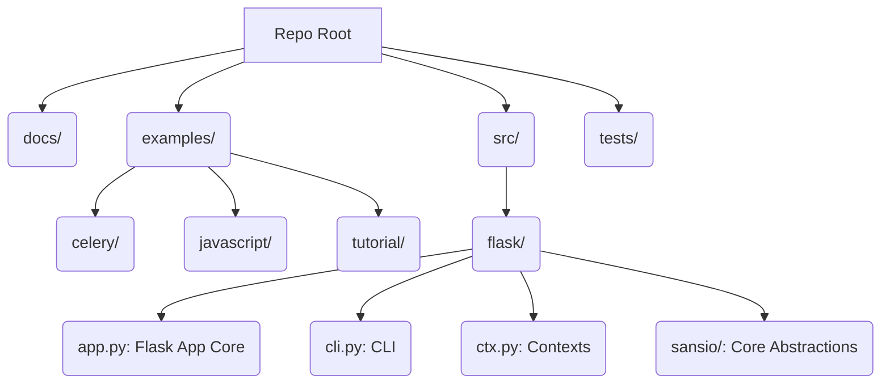

# Project Documentation: flask documentation

## 1. Project Overview
- **Description:** Example Flask application with Celery background tasks.
- **Key Features:**
  - Core WSGI Application (`Flask` class definition and WSGI interface).
  - Pluggable Architecture via Blueprints.
  - Request and Application Context Management.
  - Integrated Command Line Interface (CLI).
  - Templating Engine (Jinja) Integration.
- **Tech Stack:** `flask`, `celery[redis]`

## 2. Architecture
### Repository Structure


### Repository Call Graph
```mermaid
graph TD
    subgraph Core App Initialization (src/flask/app.py)
        A[Flask.__init__] --> B[AppGroup.__init__]
        A --> C[add_url_rule]
        A --> D[send_static_file]
        E[Flask.wsgi_app] --> F[request_context]
        F --> G[full_dispatch_request]
        G --> H[dispatch_request]
        H --> I[make_default_options_response]
    end
    subgraph Context Management (src/flask/ctx.py)
        J[AppContext.push] --> K[match_request]
    end
    subgraph Example Workflow (examples/celery)
        L[create_app] --> M[Flask]
        L --> N[celery_init_app]
    end

    A
    E
    J
    L
```

## 3. Installation
### Dependencies
```
- flask
- celery[redis]
```
### Setup Guide
[Information not found]
### Quick Startup
[Information not found]

## 4. Use Cases & Commands
The repository primarily defines the Flask framework and contains examples demonstrating common use cases like running asynchronous background tasks (Celery example) and implementing a basic blog application (Tutorial example).

**Primary CLI Commands (Defined in `src/flask/cli.py`):**

| Command | Description (Derived from cli.py docstrings) |
| :--- | :--- |
| `flask run` | Run a local development server. Not recommended for production. |
| `flask shell` | Run an interactive Python shell in the application context for executing small management snippets. |
| `flask routes` | Show all registered routes with endpoints and methods. |
| `flask init-db` | *From tutorial example:* Clear existing data and create new tables. |

## 5. Function & Class Reference
### File: `examples/celery/src/task_app/__init__.py`

**Function: `create_app`**
- **Signature:**
  ```python
  def create_app():
  ```
- **Description:** [Could not be determined from the source code.]
- **Parameters:**
  - *None*
- **Returns:**
  - 'Flask' (Flask) [Description: Could not be determined from the source code.]
- **Calls:** [`Flask`, `celery_init_app`, `dict`, `from_mapping`, `from_prefixed_env`]
- **Called By:** [`<examples/celery/make_celery.py>`]

**Function: `celery_init_app`**
- **Signature:**
  ```python
  def celery_init_app(app):
  ```
- **Description:** [Could not be determined from the source code.]
- **Parameters:**
  - `app` (Unknown): [Description: Could not be determined from the source code.]
- **Returns:**
  - 'Celery' (Celery) [Description: Could not be determined from the source code.]
- **Calls:** [`app_context`, `run`]
- **Called By:** [`create_app`]

---
### File: `examples/celery/src/task_app/tasks.py`

**Function: `add`**
- **Signature:**
  ```python
  def add(a, b):
  ```
- **Description:** [Could not be determined from the source code.]
- **Parameters:**
  - `a` (Unknown): [Description: Could not be determined from the source code.]
  - `b` (Unknown): [Description: Could not be determined from the source code.]
- **Returns:**
  - 'int' (int) [Description: Could not be determined from the source code.]
- **Calls:** [`shared_task`]
- **Called By:** [`add`]

**Function: `block`**
- **Signature:**
  ```python
  def block():
  ```
- **Description:** [Could not be determined from the source code.]
- **Parameters:**
  - *None*
- **Returns:**
  - 'None' (None) [Description: Could not be determined from the source code.]
- **Calls:** [`shared_task`, `sleep`]
- **Called By:** [`block`]

**Function: `process`**
- **Signature:**
  ```python
  def process(self, total):
  ```
- **Description:** [Could not be determined from the source code.]
- **Parameters:**
  - `self` (Unknown): [Description: Could not be determined from the source code.]
  - `total` (Unknown): [Description: Could not be determined from the source code.]
- **Returns:**
  - 'object' (object) [Description: Could not be determined from the source code.]
- **Calls:** [`range`, `shared_task`, `sleep`, `update_state`]
- **Called By:** [`process`]

---
### File: `examples/celery/src/task_app/views.py`

**Function: `result`**
- **Signature:**
  ```python
  def result(id):
  ```
- **Description:** [Could not be determined from the source code.]
- **Parameters:**
  - `id` (Unknown): [Description: Could not be determined from the source code.]
- **Returns:**
  - 'dict[str, object]' (dict) [Description: Could not be determined from the source code.]
- **Calls:** [`AsyncResult`, `get`, `ready`, `successful`]
- **Called By:** [Not Called by any known function]

**Function: `add`**
- **Signature:**
  ```python
  def add():
  ```
- **Description:** [Could not be determined from the source code.]
- **Parameters:**
  - *None*
- **Returns:**
  - 'dict[str, object]' (dict) [Description: Could not be determined from the source code.]
- **Calls:** [`delay`, `get`, `post`]
- **Called By:** [Not Called by any known function]

**Function: `block`**
- **Signature:**
  ```python
  def block():
  ```
- **Description:** [Could not be determined from the code.]
- **Parameters:**
  - *None*
- **Returns:**
  - 'dict[str, object]' (dict) [Description: Could not be determined from the source code.]
- **Calls:** [`delay`, `post`]
- **Called By:** [Not Called by any known function]

**Function: `process`**
- **Signature:**
  ```python
  def process():
  ```
- **Description:** [Could not be determined from the source code.]
- **Parameters:**
  - *None*
- **Returns:**
  - 'dict[str, object]' (dict) [Description: Could not be determined from the source code.]
- **Calls:** [`delay`, `get`, `post`]
- **Called By:** [Not Called by any known function]

---
### File: `examples/tutorial/flaskr/auth.py`

**Function: `login_required`**
- **Signature:**
  ```python
  def login_required(view):
  ```
- **Description:** View decorator that redirects anonymous users to the login page.
- **Parameters:**
  - `view` (Unknown): [Description: Could not be determined from the source code.]
- **Returns:** [Could not be determined from the source code.]
- **Calls:** [`redirect`, `url_for`, `view`, `wraps`]
- **Called By:** [`create`, `delete`, `update`]

**Function: `load_logged_in_user`**
- **Signature:**
  ```python
  def load_logged_in_user():
  ```
- **Description:** If a user id is stored in the session, load the user object from
the database into ``g.user``.
- **Parameters:**
  - *None*
- **Returns:** [Could not be determined from the source code.]
- **Calls:** [`execute`, `fetchone`, `get`, `get_db`]
- **Called By:** [Not Called by any known function, is decorated with `@bp.before_app_request`]

**Function: `register`**
- **Signature:**
  ```python
  def register():
  ```
- **Description:** Register a new user.
Validates that the username is not already taken. Hashes the
password for security.
- **Parameters:**
  - *None*
- **Returns:** [Could not be determined from the source code.]
- **Calls:** [`commit`, `execute`, `flash`, `generate_password_hash`, `get_db`, `redirect`, `render_template`, `route`, `url_for`]
- **Called By:** [Not Called by any known function, is decorated with `@bp.route`]

**Function: `login`**
- **Signature:**
  ```python
  def login():
  ```
- **Description:** Log in a registered user by adding the user id to the session.
- **Parameters:**
  - *None*
- **Returns:** [Could not be determined from the source code.]
- **Calls:** [`check_password_hash`, `clear`, `execute`, `fetchone`, `flash`, `get_db`, `redirect`, `render_template`, `route`, `url_for`]
- **Called By:** [Not Called by any known function, is decorated with `@bp.route`]

**Function: `logout`**
- **Signature:**
  ```python
  def logout():
  ```
- **Description:** Clear the current session, including the stored user id.
- **Parameters:**
  - *None*
- **Returns:** [Could not be determined from the source code.]
- **Calls:** [`clear`, `redirect`, `route`, `url_for`]
- **Called By:** [Not Called by any known function, is decorated with `@bp.route`]

---
### File: `examples/tutorial/flaskr/blog.py`

**Function: `index`**
- **Signature:**
  ```python
  def index():
  ```
- **Description:** Show all the posts, most recent first.
- **Parameters:**
  - *None*
- **Returns:** [Could not be determined from the source code.]
- **Calls:** [`execute`, `fetchall`, `get_db`, `render_template`, `route`]
- **Called By:** [Not Called by any known function, is decorated with `@bp.route`]

**Function: `get_post`**
- **Signature:**
  ```python
  def get_post(id, check_author):
  ```
- **Description:** Get a post and its author by id.
Checks that the id exists and optionally that the current user is
the author.
:param id: id of post to get
:param check_author: require the current user to be the author
:return: the post with author information
:raise 404: if a post with the given id doesn't exist
:raise 403: if the current user isn't the author
- **Parameters:**
  - `id` (Unknown): id of post to get
  - `check_author` (Unknown): require the current user to be the author
- **Returns:** [Could not be determined from the source code.]
- **Calls:** [`abort`, `execute`, `fetchone`, `get_db`]
- **Called By:** [`delete`, `update`]

**Function: `create`**
- **Signature:**
  ```python
  def create():
  ```
- **Description:** Create a new post for the current user.
- **Parameters:**
  - *None*
- **Returns:** [Could not be determined from the source code.]
- **Calls:** [`commit`, `execute`, `flash`, `get_db`, `redirect`, `render_template`, `route`, `url_for`]
- **Called By:** [Not Called by any known function, is decorated with `@login_required`]

**Function: `update`**
- **Signature:**
  ```python
  def update(id):
  ```
- **Description:** Update a post if the current user is the author.
- **Parameters:**
  - `id` (Unknown): [Description: Could not be determined from the source code.]
- **Returns:** [Could not be determined from the source code.]
- **Calls:** [`commit`, `execute`, `flash`, `get_db`, `get_post`, `redirect`, `render_template`, `route`, `url_for`]
- **Called By:** [Not Called by any known function, is decorated with `@login_required`]

**Function: `delete`**
- **Signature:**
  ```python
  def delete(id):
  ```
- **Description:** Delete a post.
Ensures that the post exists and that the logged in user is the
author of the post.
- **Parameters:**
  - `id` (Unknown): [Description: Could not be determined from the source code.]
- **Returns:** [Could not be determined from the source code.]
- **Calls:** [`commit`, `execute`, `get_db`, `get_post`, `redirect`, `route`, `url_for`]
- **Called By:** [Not Called by any known function, is decorated with `@login_required`]

---
### File: `examples/tutorial/flaskr/db.py`

**Function: `get_db`**
- **Signature:**
  ```python
  def get_db():
  ```
- **Description:** Connect to the application's configured database. The connection
is unique for each request and will be reused if this is called
again.
- **Parameters:**
  - *None*
- **Returns:** [Could not be determined from the source code.]
- **Calls:** [`connect`]
- **Called By:** [`load_logged_in_user`, `login`, `register`, `create`, `delete`, `get_post`, `index`, `update`, `init_db`]

**Function: `close_db`**
- **Signature:**
  ```python
  def close_db(e):
  ```
- **Description:** If this request connected to the database, close the
connection.
- **Parameters:**
  - `e` (Unknown): [Description: Could not be determined from the source code.]
- **Returns:** [Could not be determined from the source code.]
- **Calls:** [`close`, `pop`]
- **Called By:** [Not Called by any known function]

**Function: `init_db`**
- **Signature:**
  ```python
  def init_db():
  ```
- **Description:** Clear existing data and create new tables.
- **Parameters:**
  - *None*
- **Returns:** [Could not be determined from the source code.]
- **Calls:** [`decode`, `executescript`, `get_db`, `open_resource`, `read`]
- **Called By:** [`init_db_command`]

**Function: `init_db_command`**
- **Signature:**
  ```python
  def init_db_command():
  ```
- **Description:** Clear existing data and create new tables.
- **Parameters:**
  - *None*
- **Returns:** [Could not be determined from the source code.]
- **Calls:** [`command`, `echo`, `init_db`]
- **Called By:** [Not Called by any known function, is decorated with `@click.command('init-db')`]

**Function: `init_app`**
- **Signature:**
  ```python
  def init_app(app):
  ```
- **Description:** Register database functions with the Flask app. This is called by
the application factory.
- **Parameters:**
  - `app` (Unknown): [Description: Could not be determined from the source code.]
- **Returns:** [Could not be determined from the source code.]
- **Calls:** [`add_command`, `teardown_appcontext`]
- **Called By:** [`<examples/tutorial/flaskr/__init__.py>`]

---
### File: `src/flask/app.py`

**Function: `_make_timedelta`**
- **Signature:**
  ```python
  def _make_timedelta(value):
  ```
- **Description:** [Could not be determined from the source code.]
- **Parameters:**
  - `value` (Unknown): [Description: Could not be determined from the source code.]
- **Returns:**
  - 'timedelta | None' (timedelta | None) [Description: Could not be determined from the source code.]
- **Calls:** [`isinstance`, `timedelta`]
- **Called By:** [Not Called by any known function]

**Class: `Flask`**
*Description: The flask object implements a WSGI application and acts as the central
object. It is passed the name of the module or package of the
application. Once it is created it will act as a central registry for
the view functions, the URL rules, template configuration and much more.*

**Method: `__init__`**
*Description: [Could not be determined from the source code.]*
- **Signature:**
  ```python
  def __init__(self, import_name, static_url_path=None, static_folder='static', static_host=None, host_matching=False, subdomain_matching=False, template_folder='templates', instance_path=None, instance_relative_config=False, root_path=None):
  ```
- **Description:** [Could not be determined from the source code.]
- **Parameters:**
  - `self` (Unknown): [Description: Could not be determined from the source code.]
  - `import_name` (Unknown): the name of the application package
  - `static_url_path` (Unknown): can be used to specify a different path for the static files on the web. Defaults to the name of the `static_folder` folder.
  - `static_folder` (Unknown): The folder with static files that is served at ``static_url_path``. Relative to the application ``root_path`` or an absolute path. Defaults to ``'static'``.
  - `static_host` (Unknown): the host to use when adding the static route. Defaults to None. Required when using ``host_matching=True`` with a ``static_folder`` configured.
  - `host_matching` (Unknown): set ``url_map.host_matching`` attribute. Defaults to False.
  - `subdomain_matching` (Unknown): consider the subdomain relative to :data:`SERVER_NAME` when matching routes. Defaults to False.
  - `template_folder` (Unknown): the folder that contains the templates that should be used by the application. Defaults to ``'templates'`` folder in the root path of the application.
  - `instance_path` (Unknown): An alternative instance path for the application. By default the folder ``'instance'`` next to the package or module is assumed to be the instance path.
  - `instance_relative_config` (Unknown): if set to ``True`` relative filenames for loading the config are assumed to be relative to the instance path instead of the application root.
  - `root_path` (Unknown): The path to the root of the application files. This should only be set manually when it can't be detected automatically, such as for namespace packages.
- **Returns:** [Could not be determined from the source code.]
- **Calls:** [`AppGroup`, `__init__`, `add_url_rule`, `bool`, `ref`, `self_ref`, `send_static_file`, `super`]
- **Called By:** [Not Called by any known function]

**Method: `get_send_file_max_age`**
*Description: Used by :func:`send_file` to determine the ``max_age`` cache
value for a given file path if it wasn't passed.

By default, this returns :data:`SEND_FILE_MAX_AGE_DEFAULT` from
the configuration of :data:`~flask.current_app`. This defaults
to ``None``, which tells the browser to use conditional requests
instead of a timed cache, which is usually preferable.*
- **Signature:**
  ```python
  def get_send_file_max_age(self, filename):
  ```
- **Description:** Used by :func:`send_file` to determine the ``max_age`` cache
value for a given file path if it wasn't passed.

By default, this returns :data:`SEND_FILE_MAX_AGE_DEFAULT` from
the configuration of :data:`~flask.current_app`. This defaults
to ``None``, which tells the browser to use conditional requests
instead of a timed cache, which is usually preferable.

Note this is a duplicate of the same method in the Flask
class.
- **Parameters:**
  - `self` (Unknown): [Description: Could not be determined from the source code.]
  - `filename` (Unknown): [Description: Could not be determined from the source code.]
- **Returns:**
  - 'int | None' (int | None) [Description: Could not be determined from the source code.]
- **Calls:** [`int`, `isinstance`, `total_seconds`]
- **Called By:** [`send_static_file`]

**Method: `send_static_file`**
*Description: The view function used to serve files from
:attr:`static_folder`. A route is automatically registered for
this view at :attr:`static_url_path` if :attr:`static_folder` is
set.*
- **Signature:**
  ```python
  def send_static_file(self, filename):
  ```
- **Description:** The view function used to serve files from
:attr:`static_folder`. A route is automatically registered for
this view at :attr:`static_url_path` if :attr:`static_folder` is
set.

Note this is a duplicate of the same method in the Flask
class.
- **Parameters:**
  - `self` (Unknown): [Description: Could not be determined from the source code.]
  - `filename` (Unknown): [Description: Could not be determined from the source code.]
- **Returns:**
  - 'Response' (Response) [Description: Could not be determined from the source code.]
- **Calls:** [`RuntimeError`, `cast`, `get_send_file_max_age`, `send_from_directory`]
- **Called By:** [`__init__`]

**Method: `open_resource`**
*Description: Open a resource file relative to :attr:`root_path` for reading.*
- **Signature:**
  ```python
  def open_resource(self, resource, mode='rb', encoding=None):
  ```
- **Description:** Open a resource file relative to :attr:`root_path` for reading.
- **Parameters:**
  - `self` (Unknown): [Description: Could not be determined from the source code.]
  - `resource` (Unknown): Path to the resource relative to :attr:`root_path`.
  - `mode` (Unknown): Open the file in this mode. Only reading is supported, valid values are ``"r"`` (or ``"rt"``) and ``"rb"``.
  - `encoding` (Unknown): Open the file with this encoding when opening in text mode. This is ignored when opening in binary mode.
- **Returns:**
  - 't.IO[t.AnyStr]' (t.IO[t.AnyStr]) [Description: Could not be determined from the source code.]
- **Calls:** [`ValueError`, `join`, `open`]
- **Called By:** [`init_db`]

**Method: `open_instance_resource`**
*Description: Open a resource file relative to the application's instance folder
:attr:`instance_path`. Unlike :meth:`open_resource`, files in the
instance folder can be opened for writing.*
- **Signature:**
  ```python
  def open_instance_resource(self, resource, mode='rb', encoding=None):
  ```
- **Description:** Open a resource file relative to the application's instance folder
:attr:`instance_path`. Unlike :meth:`open_resource`, files in the
instance folder can be opened for writing.
- **Parameters:**
  - `self` (Unknown): [Description: Could not be determined from the source code.]
  - `resource` (Unknown): Path to the resource relative to :attr:`instance_path`.
  - `mode` (Unknown): Open the file in this mode.
  - `encoding` (Unknown): Open the file with this encoding when opening in text mode. This is ignored when opening in binary mode.
- **Returns:**
  - 't.IO[t.AnyStr]' (t.IO[t.AnyStr]) [Description: Could not be determined from the source code.]
- **Calls:** [`join`, `open`]
- **Called By:** [Not Called by any known function]

**Method: `create_jinja_environment`**
*Description: Create the Jinja environment based on :attr:`jinja_options`
and the various Jinja-related methods of the app. Changing
:attr:`jinja_options` after this will have no effect. Also adds
Flask-related globals and filters to the environment.*
- **Signature:**
  ```python
  def create_jinja_environment(self):
  ```
- **Description:** Create the Jinja environment based on :attr:`jinja_options`
and the various Jinja-related methods of the app. Changing
:attr:`jinja_options` after this will have no effect. Also adds
Flask-related globals and filters to the environment.
- **Parameters:**
  - `self` (Unknown): [Description: Could not be determined from the source code.]
- **Returns:**
  - 'Environment' (Environment) [Description: Could not be determined from the source code.]
- **Calls:** [`dict`, `jinja_environment`, `update`]
- **Called By:** [Not Called by any known function]

**Method: `create_url_adapter`**
*Description: Creates a URL adapter for the given request. The URL adapter
is created at a point where the request context is not yet set
up so the request is passed explicitly.*
- **Signature:**
  ```python
  def create_url_adapter(self, request):
  ```
- **Description:** Creates a URL adapter for the given request. The URL adapter
is created at a point where the request context is not yet set
up so the request is passed explicitly.
- **Parameters:**
  - `self` (Unknown): [Description: Could not be determined from the source code.]
  - `request` (Unknown): [Description: Could not be determined from the source code.]
- **Returns:**
  - 'MapAdapter | None' (MapAdapter | None) [Description: Could not be determined from the source code.]
- **Calls:** [`bind`, `bind_to_environ`, `get_host`]
- **Called By:** [`__init__`, `url_for`]

**Method: `raise_routing_exception`**
*Description: Intercept routing exceptions and possibly do something else.*
- **Signature:**
  ```python
  def raise_routing_exception(self, request):
  ```
- **Description:** Intercept routing exceptions and possibly do something else.

In debug mode, intercept a routing redirect and replace it with
an error if the body will be discarded.

With modern Werkzeug this shouldn't occur, since it now uses a
308 status which tells the browser to resend the method and
body.
- **Parameters:**
  - `self` (Unknown): [Description: Could not be determined from the source code.]
  - `request` (Unknown): [Description: Could not be determined from the source code.]
- **Returns:**
  - 't.NoReturn' (t.NoReturn) [Description: Could not be determined from the source code.]
- **Calls:** [`FormDataRoutingRedirect`, `isinstance`]
- **Called By:** [`dispatch_request`]

**Method: `update_template_context`**
*Description: Update the template context with some commonly used variables.*
- **Signature:**
  ```python
  def update_template_context(self, context):
  ```
- **Description:** Update the template context with some commonly used variables.
This injects request, session, config and g into the template
context as well as everything template context processors want
to inject. Note that the as of Flask 0.6, the original values
in the context will not be overridden if a context processor
decides to return a value with the same key.

:param context: the context as a dictionary that is updated in place
to add extra variables.
- **Parameters:**
  - `self` (Unknown): [Description: Could not be determined from the source code.]
  - `context` (Unknown): the context as a dictionary that is updated in place to add extra variables.
- **Returns:**
  - 'None' (None) [Description: Could not be determined from the source code.]
- **Calls:** [`chain`, `copy`, `ensure_sync`, `get`, `reversed`, `update`]
- **Called By:** [`_render`, `_stream`]

**Method: `make_shell_context`**
*Description: Returns the shell context for an interactive shell for this
application. This runs all the registered shell context
processors.*
- **Signature:**
  ```python
  def make_shell_context(self):
  ```
- **Description:** Returns the shell context for an interactive shell for this
application. This runs all the registered shell context
processors.
- **Parameters:**
  - `self` (Unknown): [Description: Could not be determined from the source code.]
- **Returns:**
  - 'dict[str, t.Any]' (dict) [Description: Could not be determined from the source code.]
- **Calls:** [`processor`, `update`]
- **Called By:** [`shell_command`]

**Method: `run`**
*Description: Runs the application on a local development server.*
- **Signature:**
  ```python
  def run(self, host=None, port=None, debug=None, load_dotenv=True, **options):
  ```
- **Description:** Runs the application on a local development server.

Do not use ``run()`` in a production setting. It is not intended to
meet security and performance requirements for a production server.
Instead, see :doc:`/deploying/index` for WSGI server recommendations.
- **Parameters:**
  - `self` (Unknown): [Description: Could not be determined from the source code.]
  - `host` (Unknown): the hostname to listen on. Set this to ``'0.0.0.0'`` to have the server available externally as well. Defaults to ``'127.0.0.1'`` or the host in the ``SERVER_NAME`` config variable if present.
  - `port` (Unknown): the port of the webserver. Defaults to ``5000`` or the port defined in the ``SERVER_NAME`` config variable if present.
  - `debug` (Unknown): if given, enable or disable debug mode. See :attr:`debug`.
  - `load_dotenv` (Unknown): Load the nearest :file:`.env` and :file:`.flaskenv` files to set environment variables. Will also change the working directory to the directory containing the first file found.
  - `options` (Unknown): the options to be forwarded to the underlying Werkzeug server. See :func:`werkzeug.serving.run_simple` for more information.
- **Returns:**
  - 'None' (None) [Description: Could not be determined from the source code.]
- **Calls:** [`bool`, `cast`, `get`, `get_debug_flag`, `get_load_dotenv`, `int`, `is_running_from_reloader`, `load_dotenv`, `partition`, `run_simple`, `secho`, `setdefault`, `show_server_banner`]
- **Called By:** [`__call__`]

**Method: `test_client`**
*Description: Creates a test client for this application. For information
about unit testing head over to :doc:`/testing`.*
- **Signature:**
  ```python
  def test_client(self, use_cookies=True, **kwargs):
  ```
- **Description:** Creates a test client for this application. For information
about unit testing head over to :doc:`/testing`.
- **Parameters:**
  - `self` (Unknown): [Description: Could not be determined from the source code.]
  - `use_cookies` (Unknown): [Description: Could not be determined from the source code.]
  - `kwargs` (Unknown): [Description: Could not be determined from the source code.]
- **Returns:**
  - 'FlaskClient' (FlaskClient) [Description: Could not be determined from the source code.]
- **Calls:** [`cls`]
- **Called By:** [`client`, `run_test`, `test_session_transaction_needs_cookies`, `test_subdomain_basic_support`, `test_subdomain_matching`, `test_subdomain_matching_other_name`, `test_subdomain_matching_with_ports`, `test_templates_and_static`]

**Method: `test_cli_runner`**
*Description: Create a CLI runner for testing CLI commands.
See :ref:`testing-cli`.*
- **Signature:**
  ```python
  def test_cli_runner(self, **kwargs):
  ```
- **Description:** Create a CLI runner for testing CLI commands.
See :ref:`testing-cli`.
- **Parameters:**
  - `self` (Unknown): [Description: Could not be determined from the source code.]
  - `kwargs` (Unknown): [Description: Could not be determined from the source code.]
- **Returns:**
  - 'FlaskCliRunner' (FlaskCliRunner) [Description: Could not be determined from the source code.]
- **Calls:** [`cls`]
- **Called By:** [`runner`, `test_cli_empty`]

**Method: `handle_http_exception`**
*Description: Handles an HTTP exception. By default this will invoke the
registered error handlers and fall back to returning the
exception as response.*
- **Signature:**
  ```python
  def handle_http_exception(self, e):
  ```
- **Description:** Handles an HTTP exception. By default this will invoke the
registered error handlers and fall back to returning the
exception as response.
- **Parameters:**
  - `self` (Unknown): [Description: Could not be determined from the source code.]
  - `e` (Unknown): [Description: Could not be determined from the source code.]
- **Returns:**
  - 'HTTPException | ft.ResponseReturnValue' (HTTPException | ft.ResponseReturnValue) [Description: Could not be determined from the source code.]
- **Calls:** [`_find_error_handler`, `ensure_sync`, `isinstance`]
- **Called By:** [`handle_user_exception`]

**Method: `handle_user_exception`**
*Description: This method is called whenever an exception occurs that
should be handled. A special case is :class:`~werkzeug
.exceptions.HTTPException` which is forwarded to the
:meth:`handle_http_exception` method. This function will either
return a response value or reraise the exception with the same
traceback.*
- **Signature:**
  ```python
  def handle_user_exception(self, e):
  ```
- **Description:** This method is called whenever an exception occurs that
should be handled. A special case is :class:`~werkzeug
.exceptions.HTTPException` which is forwarded to the
:meth:`handle_http_exception` method. This function will either
return a response value or reraise the exception with the same
traceback.
- **Parameters:**
  - `self` (Unknown): [Description: Could not be determined from the source code.]
  - `e` (Unknown): [Description: Could not be determined from the source code.]
- **Returns:**
  - 'HTTPException | ft.ResponseReturnValue' (HTTPException | ft.ResponseReturnValue) [Description: Could not be determined from the source code.]
- **Calls:** [`_find_error_handler`, `ensure_sync`, `handle_http_exception`, `isinstance`, `trap_http_exception`]
- **Called By:** [`full_dispatch_request`]

**Method: `handle_exception`**
*Description: Handle an exception that did not have an error handler
associated with it, or that was raised from an error handler.
This always causes a 500 ``InternalServerError``.*
- **Signature:**
  ```python
  def handle_exception(self, e):
  ```
- **Description:** Handle an exception that did not have an error handler
associated with it, or that was raised from an error handler.
This always causes a 500 ``InternalServerError``.
- **Parameters:**
  - `self` (Unknown): [Description: Could not be determined from the source code.]
  - `e` (Unknown): [Description: Could not be determined from the source code.]
- **Returns:**
  - 'Response' (Response) [Description: Could not be determined from the source code.]
- **Calls:** [`InternalServerError`, `_find_error_handler`, `ensure_sync`, `exc_info`, `finalize_request`, `log_exception`, `send`]
- **Called By:** [`wsgi_app`]

**Method: `log_exception`**
*Description: Logs an exception. This is called by :meth:`handle_exception`
if debugging is disabled and right before the handler is called.*
- **Signature:**
  ```python
  def log_exception(self, exc_info):
  ```
- **Description:** Logs an exception. This is called by :meth:`handle_exception`
if debugging is disabled and right before the handler is called.
The default implementation logs the exception as error on the
:attr:`logger`.
- **Parameters:**
  - `self` (Unknown): [Description: Could not be determined from the source code.]
  - `exc_info` (Unknown): [Description: Could not be determined from the source code.]
- **Returns:**
  - 'None' (None) [Description: Could not be determined from the source code.]
- **Calls:** [`error`]
- **Called By:** [`handle_exception`]

**Method: `dispatch_request`**
*Description: Does the request dispatching. Matches the URL and returns the
return value of the view or error handler. This does not have to
be a response object. In order to convert the return value to a
proper response object, call :func:`make_response`.*
- **Signature:**
  ```python
  def dispatch_request(self):
  ```
- **Description:** Does the request dispatching. Matches the URL and returns the
return value of the view or error handler. This does not have to
be a response object. In order to convert the return value to a
proper response object, call :func:`make_response`.
- **Parameters:**
  - `self` (Unknown): [Description: Could not be determined from the source code.]
- **Returns:**
  - 'ft.ResponseReturnValue' (ft.ResponseReturnValue) [Description: Could not be determined from the source code.]
- **Calls:** [`ensure_sync`, `get`, `getattr`, `make_default_options_response`, `raise_routing_exception`]
- **Called By:** [`full_dispatch_request`]

**Method: `full_dispatch_request`**
*Description: Dispatches the request and on top of that performs request
pre and postprocessing as well as HTTP exception catching and
error handling.*
- **Signature:**
  ```python
  def full_dispatch_request(self):
  ```
- **Description:** Dispatches the request and on top of that performs request
pre and postprocessing as well as HTTP exception catching and
error handling.
- **Parameters:**
  - `self` (Unknown): [Description: Could not be determined from the source code.]
- **Returns:**
  - 'Response' (Response) [Description: Could not be determined from the source code.]
- **Calls:** [`dispatch_request`, `finalize_request`, `handle_user_exception`, `preprocess_request`, `send`]
- **Called By:** [`wsgi_app`]

**Method: `finalize_request`**
*Description: Given the return value from a view function this finalizes
the request by converting it into a response and invoking the
postprocessing functions.*
- **Signature:**
  ```python
  def finalize_request(self, rv, from_error_handler=False):
  ```
- **Description:** Given the return value from a view function this finalizes
the request by converting it into a response and invoking the
postprocessing functions. This is invoked for both normal
request dispatching as well as error handlers.
- **Parameters:**
  - `self` (Unknown): [Description: Could not be determined from the source code.]
  - `rv` (Unknown): [Description: Could not be determined from the source code.]
  - `from_error_handler` (Unknown): [Description: Could not be determined from the source code.]
- **Returns:**
  - 'Response' (Response) [Description: Could not be determined from the source code.]
- **Calls:** [`exception`, `make_response`, `process_response`, `send`]
- **Called By:** [`full_dispatch_request`, `handle_exception`]

**Method: `make_default_options_response`**
*Description: This method is called to create the default ``OPTIONS`` response.*
- **Signature:**
  ```python
  def make_default_options_response(self):
  ```
- **Description:** This method is called to create the default ``OPTIONS`` response.
This can be changed through subclassing to change the default
behavior of ``OPTIONS`` responses.
- **Parameters:**
  - `self` (Unknown): [Description: Could not be determined from the source code.]
- **Returns:**
  - 'Response' (Response) [Description: Could not be determined from the source code.]
- **Calls:** [`allowed_methods`, `get`, `response_class`, `update`]
- **Called By:** [`dispatch_request`]

**Method: `ensure_sync`**
*Description: Ensure that the function is synchronous for WSGI workers.*
- **Signature:**
  ```python
  def ensure_sync(self, func):
  ```
- **Description:** Ensure that the function is synchronous for WSGI workers.
Plain ``def`` functions are returned as-is. ``async def``
functions are wrapped to run and wait for the response.

Override this method to change how the app runs async views.
- **Parameters:**
  - `self` (Unknown): [Description: Could not be determined from the source code.]
  - `func` (Unknown): [Description: Could not be determined from the source code.]
- **Returns:**
  - 't.Callable[..., t.Any]' (t.Callable[..., t.Any]) [Description: Could not be determined from the source code.]
- **Calls:** [`async_to_sync`, `iscoroutinefunction`]
- **Called By:** [`dispatch_request`, `do_teardown_appcontext`, `do_teardown_request`, `handle_exception`, `handle_http_exception`, `handle_user_exception`, `preprocess_request`, `update_template_context`, `view`, `wrapper`]

**Method: `async_to_sync`**
*Description: Return a sync function that will run the coroutine function.*
- **Signature:**
  ```python
  def async_to_sync(self, func):
  ```
- **Description:** Return a sync function that will run the coroutine function.
- **Parameters:**
  - `self` (Unknown): [Description: Could not be determined from the source code.]
  - `func` (Unknown): [Description: Could not be determined from the source code.]
- **Returns:**
  - 't.Callable[..., t.Any]' (t.Callable[..., t.Any]) [Description: Could not be determined from the source code.]
- **Calls:** [`RuntimeError`, `asgiref_async_to_sync`]
- **Called By:** [`ensure_sync`]

**Method: `url_for`**
*Description: Generate a URL to the given endpoint with the given values.*
- **Signature:**
  ```python
  def url_for(self, endpoint, **values):
  ```
- **Description:** Generate a URL to the given endpoint with the given values.

This is called by :func:`flask.url_for`, and can be called
directly as well.

An *endpoint* is the name of a URL rule, usually added with
:meth:`@app.route() <route>`, and usually the same name as the
view function. A route defined in a :class:`~flask.Blueprint`
will prepend the blueprint's name separated by a ``.`` to the
endpoint.
- **Parameters:**
  - `endpoint` (Unknown): The endpoint name associated with the URL to generate. If this starts with a ``.``, the current blueprint name (if any) will be used.
  - `values` (Unknown): Values to use for the variable parts of the URL rule. Unknown keys are appended as query string arguments, like ``?a=b&c=d``.
- **Returns:**
  - 'str' (str) [Description: Could not be determined from the source code.]
- **Calls:** [`RuntimeError`, `ValueError`, `_url_quote`, `build`, `create_url_adapter`, `get`, `handle_url_build_error`, `inject_url_defaults`, `update`]
- **Called By:** [`test_build_error_handler`, `test_static_route_with_host_matching`, `test_static_url_path`, `test_static_url_path_with_ending_slash`, `test_url_generation_requires_server_name`, `test_url_generation_without_context_fails`, `test_url_for_with_alternating_schemes`, `test_url_for_with_anchor`, `test_url_for_with_method`, `test_url_for_with_scheme`, `test_url_for_with_scheme_not_external`, `test_url_for_with_self`, `test_url_mapping`, `test_url_processors`]

**Method: `make_response`**
*Description: Convert the return value from a view function to an instance of
:attr:`response_class`.*
- **Signature:**
  ```python
  def make_response(self, rv):
  ```
- **Description:** Convert the return value from a view function to an instance of
:attr:`response_class`.
- **Parameters:**
  - `self` (Unknown): [Description: Could not be determined from the source code.]
  - `rv` (Unknown): the return value from the view function. The view function must return a response. Returning ``None``, or the view ending without returning, is not allowed.
- **Returns:**
  - 'Response' (Response) [Description: Could not be determined from the source code.]
- **Calls:** [`TypeError`, `callable`, `cast`, `exc_info`, `force_type`, `isinstance`, `len`, `response`, `response_class`, `type`, `update`, `with_traceback`]
- **Called By:** [`finalize_request`, `test_jsonify_mimetype`]

**Method: `preprocess_request`**
*Description: Called before the request is dispatched. Calls
:attr:`url_value_preprocessors` registered with the app and the
current blueprint (if any). Then calls :attr:`before_request_funcs`
registered with the app and the blueprint.*
- **Signature:**
  ```python
  def preprocess_request(self):
  ```
- **Description:** Called before the request is dispatched. Calls
:attr:`url_value_preprocessors` registered with the app and the
current blueprint (if any). Then calls :attr:`before_request_funcs`
registered with the app and the blueprint.

If any :meth:`before_request` handler returns a non-None value, the
value is handled as if it was the return value from the view, and
further request handling is stopped.
- **Parameters:**
  - `self` (Unknown): [Description: Could not be determined from the source code.]
- **Returns:**
  - 'ft.ResponseReturnValue | None' (ft.ResponseReturnValue | None) [Description: Could not be determined from the source code.]
- **Calls:** [`ensure_sync`, `get`, `reversed`, `url_func`]
- **Called By:** [`full_dispatch_request`]

**Method: `process_response`**
*Description: Can be overridden in order to modify the response object
before it's sent to the WSGI server.*
- **Signature:**
  ```python
  def process_response(self, response):
  ```
- **Description:** Can be overridden in order to modify the response object
before it's sent to the WSGI server. By default this will
call all the :meth:`after_request` decorated functions.
- **Parameters:**
  - `self` (Unknown): [Description: Could not be determined from the source code.]
  - `response` (Unknown): a :attr:`response_class` object.
- **Returns:**
  - 'Response' (Response) [Description: Could not be determined from the source code.]
- **Calls:** [`chain`, `ensure_sync`, `get`, `is_null_session`, `reversed`, `save_session`]
- **Called By:** [`finalize_request`]

**Method: `do_teardown_request`**
*Description: Called after the request is dispatched and the response is finalized,
right before the request context is popped. Called by
:meth:`.AppContext.pop`.*
- **Signature:**
  ```python
  def do_teardown_request(self, exc=None):
  ```
- **Description:** Called after the request is dispatched and the response is finalized,
right before the request context is popped. Called by
:meth:`.AppContext.pop`.

This calls all functions decorated with :meth:`teardown_request`, and
:meth:`Blueprint.teardown_request` if a blueprint handled the request.
Finally, the :data:`request_tearing_down` signal is sent.
- **Parameters:**
  - `self` (Unknown): [Description: Could not be determined from the source code.]
  - `exc` (Unknown): An unhandled exception raised while dispatching the request. Passed to each teardown function.
- **Returns:**
  - 'None' (None) [Description: Could not be determined from the source code.]
- **Calls:** [`chain`, `ensure_sync`, `get`, `reversed`, `send`]
- **Called By:** [`pop`]

**Method: `do_teardown_appcontext`**
*Description: Called right before the application context is popped. Called by
:meth:`.AppContext.pop`.*
- **Signature:**
  ```python
  def do_teardown_appcontext(self, exc=None):
  ```
- **Description:** Called right before the application context is popped. Called by
:meth:`.AppContext.pop`.

This calls all functions decorated with :meth:`teardown_appcontext`.
Then the :data:`appcontext_tearing_down` signal is sent.
- **Parameters:**
  - `self` (Unknown): [Description: Could not be determined from the source code.]
  - `exc` (Unknown): An unhandled exception raised while the context was active. Passed to each teardown function.
- **Returns:**
  - 'None' (None) [Description: Could not be determined from the source code.]
- **Calls:** [`ensure_sync`, `reversed`, `send`]
- **Called By:** [`pop`]

**Method: `app_context`**
*Description: Create an :class:`.AppContext`. When the context is pushed,
:data:`.current_app` and :data:`.g` become available.*
- **Signature:**
  ```python
  def app_context(self):
  ```
- **Description:** Create an :class:`.AppContext`. When the context is pushed,
:data:`.current_app` and :data:`.g` become available.

A context is automatically pushed when handling each request, and when
running any ``flask`` CLI command. Use this as a ``with`` block to
manually push a context outside of those situations, such as during
setup or testing.
- **Parameters:**
  - `self` (Unknown): [Description: Could not be determined from the source code.]
- **Returns:**
  - 'AppContext' (AppContext) [Description: Could not be determined from the source code.]
- **Calls:** [`AppContext`]
- **Called By:** [`celery_init_app`, `test_app_context_provides_current_app`, `test_app_tearing_down`, `test_app_tearing_down_with_handled_exception_by_except_block`, `test_app_tearing_down_with_previous_exception`, `test_basic_url_generation`, `test_config_from_file_json`, `test_config_from_file_toml`, `test_context_refcounts`, `test_context_test`, `test_custom_config_class`, `test_custom_jinja_env`, `test_get_close_db`, `test_manual_context_binding`, `test_open_resource`, `test_open_resource_exceptions`, `test_open_resource_with_encoding`, `test_session_expiration`, `test_session_special_types`, `test_static_folder_with_pathlib_path`, `test_static_route_with_host_matching`, `test_static_url_empty_path`, `test_static_url_empty_path_default`, `test_test_client_context_binding`, `test_url_generation_requires_server_name`, `test_url_for_passes_special_values_to_build_error_handler`, `test_url_mapping`, `test_url_processors`]

**Method: `request_context`**
*Description: Create an :class:`.AppContext` with request information representing
the given WSGI environment.*
- **Signature:**
  ```python
  def request_context(self, environ):
  ```
- **Description:** Create an :class:`.AppContext` with request information representing
the given WSGI environment. A context is automatically pushed when
handling each request. When the context is pushed, :data:`.request`,
:data:`.session`, :data:`g:, and :data:`.current_app` become available.
- **Parameters:**
  - `self` (Unknown): [Description: Could not be determined from the source code.]
  - `environ` (Unknown): A WSGI environment.
- **Returns:**
  - 'AppContext' (AppContext) [Description: Could not be determined from the source code.]
- **Calls:** [`from_environ`]
- **Called By:** [`wsgi_app`]

**Method: `test_request_context`**
*Description: Create an :class:`.AppContext` with request information created from
the given arguments.*
- **Signature:**
  ```python
  def test_request_context(self, path='/', base_url=None, subdomain=None, url_scheme=None, method='GET', input_stream=None, content_type=None, content_length=None, errors_stream=None, multithreaded=False, multilingual=False, run_once=False, headers=None, data=None, environ_base=None, environ_overrides=None, query_string=None, json=None, **kwargs):
  ```
- **Description:** Create an :class:`.AppContext` with request information created from
the given arguments. When the context is pushed, :data:`.request`,
:data:`.session`, :data:`g:, and :data:`.current_app` become available.
- **Parameters:**
  - `self` (Unknown): [Description: Could not be determined from the source code.]
  - `path` (Unknown): URL path being requested.
  - `base_url` (Unknown): Base URL where the app is being served, which ``path`` is relative to. If not given, built from :data:`PREFERRED_URL_SCHEME`, ``subdomain``, :data:`SERVER_NAME`, and :data:`APPLICATION_ROOT`.
  - `subdomain` (Unknown): Subdomain name to prepend to :data:`SERVER_NAME`.
  - `url_scheme` (Unknown): Scheme to use instead of :data:`PREFERRED_URL_SCHEME`.
  - `data` (Unknown): The request body text or bytes,or a dict of form data.
  - `json` (Unknown): If given, this is serialized as JSON and passed as ``data``. Also defaults ``content_type`` to ``application/json``.
  - `args` (Unknown): Other positional arguments passed to :class:`~werkzeug.test.EnvironBuilder`.
  - `kwargs` (Unknown): Other keyword arguments passed to :class:`~werkzeug.test.EnvironBuilder`.
- **Returns:**
  - 'AppContext' (AppContext) [Description: Could not be determined from the source code.]
- **Calls:** [`EnvironBuilder`, `close`, `get_environ`, `request_context`]
- **Called By:** [`req_ctx`, `test_build_error_handler`, `test_greenlet_context_copying_api`, `test_proper_test_request_context`, `test_request_context_means_app_context`, `test_session_transactions`, `test_session_transactions_keep_context`, `test_static_files`, `test_url_for_with_scheme_not_external`, `test_url_for_with_self`]

**Method: `wsgi_app`**
*Description: The actual WSGI application. This is not implemented in
:meth:`__call__` so that middlewares can be applied without
losing a reference to the app object.*
- **Signature:**
  ```python
  def wsgi_app(self, environ, start_response):
  ```
- **Description:** The actual WSGI application. This is not implemented in
:meth:`__call__` so that middlewares can be applied without
losing a reference to the app object. Instead of doing this::

    app = MyMiddleware(app)

It's a better idea to do this instead::

    app.wsgi_app = MyMiddleware(app.wsgi_app)

Then you still have the original application object around and
can continue to call methods on it.
- **Parameters:**
  - `self` (Unknown): [Description: Could not be determined from the source code.]
  - `environ` (Unknown): A WSGI environment.
  - `start_response` (Unknown): A callable accepting a status code, a list of headers, and an optional exception context to start the response.
- **Returns:**
  - 'cabc.Iterable[bytes]' (cabc.Iterable[bytes]) [Description: Could not be determined from the source code.]
- **Calls:** [`exc_info`, `full_dispatch_request`, `get`, `handle_exception`, `pop`, `push`, `request_context`, `response`, `should_ignore_error`]
- **Called By:** [`__call__`]

**Method: `__call__`**
*Description: The WSGI server calls the Flask application object as the
WSGI application. This calls :meth:`wsgi_app`, which can be
wrapped to apply middleware.*
- **Signature:**
  ```python
  def __call__(self, environ, start_response):
  ```
- **Description:** The WSGI server calls the Flask application object as the
WSGI application. This calls :meth:`wsgi_app`, which can be
wrapped to apply middleware.
- **Parameters:**
  - `self` (Unknown): [Description: Could not be determined from the source code.]
  - `environ` (Unknown): [Description: Could not be determined from the source code.]
  - `start_response` (Unknown): [Description: Could not be determined from the source code.]
- **Returns:**
  - 'cabc.Iterable[bytes]' (cabc.Iterable[bytes]) [Description: Could not be determined from the source code.]
- **Calls:** [`wsgi_app`]
- **Called By:** [Not Called by any known function]

---
### File: `src/flask/blueprints.py`

**Class: `Blueprint`**
*Description: [Could not be determined from the source code.]*

**Method: `__init__`**
*Description: [Could not be determined from the source code.]*
- **Signature:**
  ```python
  def __init__(self, name, import_name, static_folder=None, static_url_path=None, template_folder=None, url_prefix=None, subdomain=None, url_defaults=None, root_path=None, cli_group=None):
  ```
- **Description:** [Could not be determined from the source code.]
- **Parameters:**
  - `self` (Unknown): [Description: Could not be determined from the source code.]
  - `name` (Unknown): [Description: Could not be determined from the source code.]
  - `import_name` (Unknown): [Description: Could not be determined from the source code.]
  - `static_folder` (Unknown): [Description: Could not be determined from the source code.]
  - `static_url_path` (Unknown): [Description: Could not be determined from the source code.]
  - `template_folder` (Unknown): [Description: Could not be determined from the source code.]
  - `url_prefix` (Unknown): [Description: Could not be determined from the source code.]
  - `subdomain` (Unknown): [Description: Could not be determined from the source code.]
  - `url_defaults` (Unknown): [Description: Could not be determined from the source code.]
  - `root_path` (Unknown): [Description: Could not be determined from the source code.]
  - `cli_group` (Unknown): [Description: Could not be determined from the source code.]
- **Returns:** [Could not be determined from the source code.]
- **Calls:** [`AppGroup`, `__init__`, `super`]
- **Called By:** [Not Called by any known function]

**Method: `get_send_file_max_age`**
*Description: Used by :func:`send_file` to determine the ``max_age`` cache
value for a given file path if it wasn't passed.

By default, this returns :data:`SEND_FILE_MAX_AGE_DEFAULT` from
the configuration of :data:`~flask.current_app`. This defaults
to ``None``, which tells the browser to use conditional requests
instead of a timed cache, which is usually preferable.*
- **Signature:**
  ```python
  def get_send_file_max_age(self, filename):
  ```
- **Description:** Used by :func:`send_file` to determine the ``max_age`` cache
value for a given file path if it wasn't passed.

By default, this returns :data:`SEND_FILE_MAX_AGE_DEFAULT` from
the configuration of :data:`~flask.current_app`. This defaults
to ``None``, which tells the browser to use conditional requests
instead of a timed cache, which is usually preferable.

Note this is a duplicate of the same method in the Flask
class.
- **Parameters:**
  - `self` (Unknown): [Description: Could not be determined from the source code.]
  - `filename` (Unknown): [Description: Could not be determined from the source code.]
- **Returns:**
  - 'int | None' (int | None) [Description: Could not be determined from the source code.]
- **Calls:** [`int`, `isinstance`, `total_seconds`]
- **Called By:** [`send_static_file`]

**Method: `send_static_file`**
*Description: The view function used to serve files from
:attr:`static_folder`. A route is automatically registered for
this view at :attr:`static_url_path` if :attr:`static_folder` is
set.*
- **Signature:**
  ```python
  def send_static_file(self, filename):
  ```
- **Description:** The view function used to serve files from
:attr:`static_folder`. A route is automatically registered for
this view at :attr:`static_url_path` if :attr:`static_folder` is
set.

Note this is a duplicate of the same method in the Flask
class.
- **Parameters:**
  - `self` (Unknown): [Description: Could not be determined from the source code.]
  - `filename` (Unknown): [Description: Could not be determined from the source code.]
- **Returns:**
  - 'Response' (Response) [Description: Could not be determined from the source code.]
- **Calls:** [`RuntimeError`, `cast`, `get_send_file_max_age`, `send_from_directory`]
- **Called By:** [Not Called by any known function]

**Method: `open_resource`**
*Description: Open a resource file relative to :attr:`root_path` for reading. The
blueprint-relative equivalent of the app's :meth:`~.Flask.open_resource`
method.*
- **Signature:**
  ```python
  def open_resource(self, resource, mode='rb', encoding=None):
  ```
- **Description:** Open a resource file relative to :attr:`root_path` for reading. The
blueprint-relative equivalent of the app's :meth:`~.Flask.open_resource`
method.
- **Parameters:**
  - `self` (Unknown): [Description: Could not be determined from the source code.]
  - `resource` (Unknown): Path to the resource relative to :attr:`root_path`.
  - `mode` (Unknown): Open the file in this mode. Only reading is supported, valid values are ``"r"`` (or ``"rt"``) and ``"rb"``.
  - `encoding` (Unknown): Open the file with this encoding when opening in text mode. This is ignored when opening in binary mode.
- **Returns:**
  - 't.IO[t.AnyStr]' (t.IO[t.AnyStr]) [Description: Could not be determined from the source code.]
- **Calls:** [`ValueError`, `join`, `open`]
- **Called By:** [Not Called by any known function]

---
### File: `src/flask/cli.py`

**Function: `find_best_app`**
- **Signature:**
  ```python
  def find_best_app(module):
  ```
- **Description:** Given a module instance this tries to find the best possible
application in the module or raises an exception.
- **Parameters:**
  - `module` (Unknown): [Description: Could not be determined from the source code.]
- **Returns:**
  - 'Flask' (Flask) [Description: Could not be determined from the source code.]
- **Calls:** [`NoAppException`, `_called_with_wrong_args`, `app_factory`, `getattr`, `isfunction`, `isinstance`, `len`, `values`]
- **Called By:** [`locate_app`, `test_find_best_app`]

**Function: `_called_with_wrong_args`**
- **Signature:**
  ```python
  def _called_with_wrong_args(f):
  ```
- **Description:** Check whether calling a function raised a ``TypeError`` because
the call failed or because something in the factory raised the
error.
- **Parameters:**
  - `f` (Unknown): The function that was called.
- **Returns:**
  - 'bool' (bool) [Description: Could not be determined from the source code.]
- **Calls:** [`exc_info`]
- **Called By:** [`find_app_by_string`, `find_best_app`]

**Function: `find_app_by_string`**
- **Signature:**
  ```python
  def find_app_by_string(module, app_name):
  ```
- **Description:** Check if the given string is a variable name or a function. Call
a function to get the app instance, or return the variable directly.
- **Parameters:**
  - `module` (Unknown): [Description: Could not be determined from the source code.]
  - `app_name` (Unknown): [Description: Could not be determined from the source code.]
- **Returns:**
  - 'Flask' (Flask) [Description: Could not be determined from the source code.]
- **Calls:** [`NoAppException`, `_called_with_wrong_args`, `attr`, `getattr`, `isfunction`, `isinstance`, `literal_eval`, `parse`, `strip`]
- **Called By:** [`locate_app`]

**Function: `prepare_import`**
- **Signature:**
  ```python
  def prepare_import(path):
  ```
- **Description:** Given a filename this will try to calculate the python path, add it
to the search path and return the actual module name that is expected.
- **Parameters:**
  - `path` (Unknown): [Description: Could not be determined from the source code.]
- **Returns:**
  - 'str' (str) [Description: Could not be determined from the source code.]
- **Calls:** [`append`, `basename`, `dirname`, `exists`, `insert`, `join`, `realpath`, `split`, `splitext`]
- **Called By:** [`load_app`]

**Function: `locate_app`**
- **Signature:**
  ```python
  def locate_app(module_name, app_name=None, raise_if_not_found=True):
  ```
- **Description:** [Could not be determined from the source code.]
- **Parameters:**
  - `module_name` (Unknown): [Description: Could not be determined from the source code.]
  - `app_name` (Unknown): [Description: Could not be determined from the source code.]
  - `raise_if_not_found` (Unknown): [Description: Could not be determined from the source code.]
- **Returns:**
  - 'Flask | None' (Flask | None) [Description: Could not be determined from the source code.]
- **Calls:** [`NoAppException`, `__import__`, `exc_info`, `find_app_by_string`, `find_best_app`, `format_exc`]
- **Called By:** [`load_app`, `test_locate_app`]

**Function: `get_version`**
- **Signature:**
  ```python
  def get_version(ctx, param, value):
  ```
- **Description:** [Could not be determined from the source code.]
- **Parameters:**
  - `ctx` (Unknown): [Description: Could not be determined from the source code.]
  - `param` (Unknown): [Description: Could not be determined from the source code.]
  - `value` (Unknown): [Description: Could not be determined from the source code.]
- **Returns:**
  - 'None' (None) [Description: Could not be determined from the source code.]
- **Calls:** [`echo`, `exit`, `python_version`, `version`]
- **Called By:** [Not Called by any known function]

**Function: `with_appcontext`**
- **Signature:**
  ```python
  def with_appcontext(f):
  ```
- **Description:** Wraps a callback so that it's guaranteed to be executed with the
script's application context.

Custom commands (and their options) registered under ``app.cli`` or
``blueprint.cli`` will always have an app context available, this
decorator is not required in that case.
- **Parameters:**
  - `f` (Unknown): [Description: Could not be determined from the source code.]
- **Returns:**
  - 'F' (F) [Description: Could not be determined from the source code.]
- **Calls:** [`app_context`, `command`, `ensure_object`, `invoke`, `load_app`, `super`, `with_appcontext`, `with_resource`]
- **Called By:** [Not Called by any known function, is used as a decorator]

**Function: `_set_app`**
- **Signature:**
  ```python
  def _set_app(ctx, param, value):
  ```
- **Description:** [Could not be determined from the source code.]
- **Parameters:**
  - `ctx` (Unknown): [Description: Could not be determined from the source code.]
  - `param` (Unknown): [Description: Could not be determined from the source code.]
  - `value` (Unknown): [Description: Could not be determined from the source code.]
- **Returns:**
  - 'str | None' (str | None) [Description: Could not be determined from the source code.]
- **Calls:** [`ensure_object`]
- **Called By:** [Not Called by any known function, is used as a callback]

**Function: `_set_debug`**
- **Signature:**
  ```python
  def _set_debug(ctx, param, value):
  ```
- **Description:** [Could not be determined from the source code.]
- **Parameters:**
  - `ctx` (Unknown): [Description: Could not be determined from the source code.]
  - `param` (Unknown): [Description: Could not be determined from the source code.]
  - `value` (Unknown): [Description: Could not be determined from the source code.]
- **Returns:**
  - 'bool | None' (bool | None) [Description: Could not be determined from the source code.]
- **Calls:** [`get_parameter_source`]
- **Called By:** [Not Called by any known function, is used as a callback]

**Function: `_env_file_callback`**
- **Signature:**
  ```python
  def _env_file_callback(ctx, param, value):
  ```
- **Description:** [Could not be determined from the source code.]
- **Parameters:**
  - `ctx` (Unknown): [Description: Could not be determined from the source code.]
  - `param` (Unknown): [Description: Could not be determined from the source code.]
  - `value` (Unknown): [Description: Could not be determined from the source code.]
- **Returns:**
  - 'str | None' (str | None) [Description: Could not be determined from the source code.]
- **Calls:** [`BadParameter`, `load_dotenv`]
- **Called By:** [Not Called by any known function, is used as a callback]

**Function: `_path_is_ancestor`**
- **Signature:**
  ```python
  def _path_is_ancestor(path, other):
  ```
- **Description:** Take ``other`` and remove the length of ``path`` from it. Then join it
to ``path``. If it is the original value, ``path`` is an ancestor of
``other``.
- **Parameters:**
  - `path` (Unknown): [Description: Could not be determined from the source code.]
  - `other` (Unknown): [Description: Could not be determined from the source code.]
- **Returns:**
  - 'bool' (bool) [Description: Could not be determined from the source code.]
- **Calls:** [`join`, `len`, `lstrip`]
- **Called By:** [Not Called by any known function]

**Function: `load_dotenv`**
- **Signature:**
  ```python
  def load_dotenv(path=None, load_defaults=True):
  ```
- **Description:** Load "dotenv" files to set environment variables. A given path takes
precedence over ``.env``, which takes precedence over ``.flaskenv``. After
loading and combining these files, values are only set if the key is not
already set in ``os.environ``.
- **Parameters:**
  - `path` (Unknown): Load the file at this location.
  - `load_defaults` (Unknown): Search for and load the default ``.flaskenv`` and ``.env`` files.
- **Returns:**
  - 'bool' (bool) [Description: Could not be determined from the source code.]
- **Calls:** [`bool`, `dotenv_values`, `find_dotenv`, `isfile`, `items`, `secho`]
- **Called By:** [`_env_file_callback`, `run`]

**Function: `show_server_banner`**
- **Signature:**
  ```python
  def show_server_banner(debug, app_import_path):
  ```
- **Description:** Show extra startup messages the first time the server is run,
ignoring the reloader.
- **Parameters:**
  - `debug` (Unknown): [Description: Could not be determined from the source code.]
  - `app_import_path` (Unknown): [Description: Could not be determined from the source code.]
- **Returns:**
  - 'None' (None) [Description: Could not be determined from the source code.]
- **Calls:** [`echo`, `is_running_from_reloader`]
- **Called By:** [`run`]

**Function: `_validate_key`**
- **Signature:**
  ```python
  def _validate_key(ctx, param, value):
  ```
- **Description:** The ``--key`` option must be specified when ``--cert`` is a file.
Modifies the ``cert`` param to be a ``(cert, key)`` pair if needed.
- **Parameters:**
  - `ctx` (Unknown): [Description: Could not be determined from the source code.]
  - `param` (Unknown): [Description: Could not be determined from the source code.]
  - `value` (Unknown): [Description: Could not be determined from the source code.]
- **Returns:**
  - 't.Any' (t.Any) [Description: Could not be determined from the source code.]
- **Calls:** [`BadParameter`, `get`, `isinstance`]
- **Called By:** [Not Called by any known function, is used as a callback]

**Function: `run_command`**
- **Signature:**
  ```python
  def run_command(info, host, port, reload, debugger, with_threads, cert, extra_files, exclude_patterns):
  ```
- **Description:** Run a local development server.

This server is for development purposes only. It does not provide
the stability, security, or performance of production WSGI servers.

The reloader and debugger are enabled by default with the '--debug'
option.
- **Parameters:**
  - `info` (Unknown): [Description: Could not be determined from the source code.]
  - `host` (Unknown): [Description: Could not be determined from the source code.]
  - `port` (Unknown): [Description: Could not be determined from the source code.]
  - `reload` (Unknown): [Description: Could not be determined from the source code.]
  - `debugger` (Unknown): [Description: Could not be determined from the source code.]
  - `with_threads` (Unknown): [Description: Could not be determined from the source code.]
  - `cert` (Unknown): [Description: Could not be determined from the source code.]
  - `extra_files` (Unknown): [Description: Could not be determined from the source code.]
  - `exclude_patterns` (Unknown): [Description: Could not be determined from the source code.]
- **Returns:**
  - 'None' (None) [Description: Could not be determined from the source code.]
- **Calls:** [`is_running_from_reloader`, `load_app`, `print_exc`]
- **Called By:** [Not Called by any known function, is decorated with `@click.command('run')`]

**Function: `shell_command`**
- **Signature:**
  ```python
  def shell_command():
  ```
- **Description:** Run an interactive Python shell in the context of a given
Flask application. The application will populate the default
namespace of this shell according to its configuration.

This is useful for executing small snippets of management code
without having to manually configure the application.
- **Parameters:**
  - *None*
- **Returns:**
  - 'None' (None) [Description: Could not be determined from the source code.]
- **Calls:** [`Completer`, `command`, `compile`, `eval`, `get`, `getattr`, `interact`, `interactive_hook`, `isfile`, `make_shell_context`, `open`, `read`, `set_completer`, `update`]
- **Called By:** [Not Called by any known function, is decorated with `@click.command('shell')`]

**Function: `routes_command`**
- **Signature:**
  ```python
  def routes_command(sort, all_methods):
  ```
- **Description:** Show all registered routes with endpoints and methods.
- **Parameters:**
  - `sort` (Unknown): [Description: Could not be determined from the source code.]
  - `all_methods` (Unknown): [Description: Could not be determined from the source code.]
- **Returns:**
  - 'None' (None) [Description: Could not be determined from the source code.]
- **Calls:** [`Choice`, `any`, `append`, `command`, `echo`, `enumerate`, `format`, `index`, `insert`, `itemgetter`, `iter_rules`, `join`, `len`, `list`, `max`, `option`, `range`, `set`, `sort`, `sorted`]
- **Called By:** [Not Called by any known function, is decorated with `@click.command('routes')`]

**Function: `main`**
- **Signature:**
  ```python
  def main():
  ```
- **Description:** [Could not be determined from the source code.]
- **Parameters:**
  - *None*
- **Returns:**
  - 'None' (None) [Description: Could not be determined from the source code.]
- **Calls:** [`main`]
- **Called By:** [`<src/flask/__main__.py>`]

**Class: `NoAppException`**
*Description: Raised if an application cannot be found or loaded.*

**Method: (None)**
*Description: (No methods found)*

**Class: `ScriptInfo`**
*Description: Helper object to deal with Flask applications. This is usually not
necessary to interface with as it's used internally in the dispatching
to click. In future versions of Flask this object will most likely play
a bigger role. Typically it's created automatically by the
:class:`FlaskGroup` but you can also manually create it and pass it
onwards as click object.*

**Method: `__init__`**
*Description: [Could not be determined from the source code.]*
- **Signature:**
  ```python
  def __init__(self, app_import_path=None, create_app=None, set_debug_flag=True, load_dotenv_defaults=True):
  ```
- **Description:** [Could not be determined from the source code.]
- **Parameters:**
  - `self` (Unknown): [Description: Could not be determined from the source code.]
  - `app_import_path` (Unknown): [Description: Could not be determined from the source code.]
  - `create_app` (Unknown): [Description: Could not be determined from the source code.]
  - `set_debug_flag` (Unknown): [Description: Could not be determined from the source code.]
  - `load_dotenv_defaults` (Unknown): [Description: Could not be determined from the source code.]
- **Returns:**
  - 'None' (None) [Description: Could not be determined from the source code.]
- **Calls:** [`Path`, `__init__`, `add_command`, `append`, `extend`, `get_load_dotenv`, `list`, `pop`, `setdefault`, `super`]
- **Called By:** [`make_context`]

**Method: `load_app`**
*Description: Loads the Flask app (if not yet loaded) and returns it. Calling
this multiple times will just result in the already loaded app to
be returned.*
- **Signature:**
  ```python
  def load_app(self):
  ```
- **Description:** Loads the Flask app (if not yet loaded) and returns it. Calling
this multiple times will just result in the already loaded app to
be returned.
- **Parameters:**
  - `self` (Unknown): [Description: Could not be determined from the source code.]
- **Returns:**
  - 'Flask' (Flask) [Description: Could not be determined from the source code.]
- **Calls:** [`NoAppException`, `create_app`, `get_debug_flag`, `locate_app`, `prepare_import`, `split`]
- **Called By:** [`decorator`, `get_command`]

**Class: `AppGroup`**
*Description: This works similar to a regular click :class:`~click.Group` but it
changes the behavior of the :meth:`command` decorator so that it
automatically wraps the functions in :func:`with_appcontext`.*

**Method: `command`**
*Description: This works exactly like the method of the same name on a regular
:class:`click.Group` but it wraps callbacks in :func:`with_appcontext`
unless it's disabled by passing ``with_appcontext=False``.*
- **Signature:**
  ```python
  def command(self, *args, **kwargs):
  ```
- **Description:** This works exactly like the method of the same name on a regular
:class:`click.Group` but it wraps callbacks in :func:`with_appcontext`
unless it's disabled by passing ``with_appcontext=False``.
- **Parameters:**
  - `self` (Unknown): [Description: Could not be determined from the source code.]
  - `args` (Unknown): [Description: Could not be determined from the source code.]
  - `kwargs` (Unknown): [Description: Could not be determined from the source code.]
- **Returns:**
  - 't.Callable[[t.Callable[..., t.Any]], click.Command]' (t.Callable[[t.Callable[..., t.Any]], click.Command]) [Description: Could not be determined from the source code.]
- **Calls:** [`pop`]
- **Called By:** [Not Called by any known function]

**Method: `group`**
*Description: This works exactly like the method of the same name on a regular
:class:`click.Group` but it defaults the group class to
:class:`AppGroup`.*
- **Signature:**
  ```python
  def group(self, *args, **kwargs):
  ```
- **Description:** This works exactly like the method of the same name on a regular
:class:`click.Group` but it defaults the group class to
:class:`AppGroup`.
- **Parameters:**
  - `self` (Unknown): [Description: Could not be determined from the source code.]
  - `args` (Unknown): [Description: Could not be determined from the source code.]
  - `kwargs` (Unknown): [Description: Could not be determined from the source code.]
- **Returns:**
  - 't.Callable[[t.Callable[..., t.Any]], click.Group]' (t.Callable[[t.Callable[..., t.Any]], click.Group]) [Description: Could not be determined from the source code.]
- **Calls:** [`group`, `setdefault`, `super`]
- **Called By:** [Not Called by any known function]

**Class: `FlaskGroup`**
*Description: Special subclass of the :class:`AppGroup` group that supports
loading more commands from the configured Flask app. Normally a
developer does not have to interface with this class but there are
some very advanced use cases for which it makes sense to create an
instance of this. see :ref:`custom-scripts`.*

**Method: `__init__`**
*Description: [Could not be determined from the source code.]*
- **Signature:**
  ```python
  def __init__(self, add_default_commands=True, create_app=None, add_version_option=True, load_dotenv=True, set_debug_flag=True, **kwargs):
  ```
- **Description:** [Could not be determined from the source code.]
- **Parameters:**
  - `self` (Unknown): [Description: Could not be determined from the source code.]
  - `add_default_commands` (Unknown): [Description: Could not be determined from the source code.]
  - `create_app` (Unknown): [Description: Could not be determined from the source code.]
  - `add_version_option` (Unknown): [Description: Could not be determined from the source code.]
  - `load_dotenv` (Unknown): [Description: Could not be determined from the source code.]
  - `set_debug_flag` (Unknown): [Description: Could not be determined from the source code.]
  - `kwargs` (Unknown): [Description: Could not be determined from the source code.]
- **Returns:** [Could not be determined from the source code.]
- **Calls:** [`run_command`, `shell_command`, `super`, `test_cli_commands`]
- **Called By:** [Not Called by any known function]

**Method: `_load_plugin_commands`**
*Description: [Could not be determined from the source code.]*
- **Signature:**
  ```python
  def _load_plugin_commands(self):
  ```
- **Description:** [Could not be determined from the source code.]
- **Parameters:**
  - `self` (Unknown): [Description: Could not be determined from the source code.]
- **Returns:**
  - 'None' (None) [Description: Could not be determined from the source code.]
- **Calls:** [`add_command`, `entry_points`, `load`]
- **Called By:** [`get_command`, `list_commands`]

**Method: `get_command`**
*Description: [Could not be determined from the source code.]*
- **Signature:**
  ```python
  def get_command(self, ctx, name):
  ```
- **Description:** [Could not be determined from the source code.]
- **Parameters:**
  - `self` (Unknown): [Description: Could not be determined from the source code.]
  - `ctx` (Unknown): [Description: Could not be determined from the source code.]
  - `name` (Unknown): [Description: Could not be determined from the source code.]
- **Returns:**
  - 'click.Command | None' (click.Command | None) [Description: Could not be determined from the source code.]
- **Calls:** [`_get_current_object`, `_load_plugin_commands`, `app_context`, `ensure_object`, `format_message`, `get_command`, `load_app`, `secho`, `super`, `with_resource`]
- **Called By:** [Not Called by any known function]

**Method: `list_commands`**
*Description: [Could not be determined from the source code.]*
- **Signature:**
  ```python
  def list_commands(self, ctx):
  ```
- **Description:** [Could not be determined from the source code.]
- **Parameters:**
  - `self` (Unknown): [Description: Could not be determined from the source code.]
  - `ctx` (Unknown): [Description: Could not be determined from the source code.]
- **Returns:**
  - 'list[str]' (list) [Description: Could not be determined from the source code.]
- **Calls:** [`_load_plugin_commands`, `ensure_object`, `format_exc`, `format_message`, `list_commands`, `load_app`, `secho`, `set`, `sorted`, `super`, `update`]
- **Called By:** [Not Called by any known function]

**Method: `make_context`**
*Description: [Could not be determined from the source code.]*
- **Signature:**
  ```python
  def make_context(self, info_name, args, parent=None):
  ```
- **Description:** [Could not be determined from the source code.]
- **Parameters:**
  - `self` (Unknown): [Description: Could not be determined from the source code.]
  - `info_name` (Unknown): [Description: Could not be determined from the source code.]
  - `args` (Unknown): [Description: Could not be determined from the source code.]
  - `parent` (Unknown): [Description: Could not be determined from the source code.]
- **Returns:**
  - 'click.Context' (click.Context) [Description: Could not be determined from the source code.]
- **Calls:** [`ScriptInfo`, `make_context`, `super`]
- **Called By:** [Not Called by any known function]

**Method: `parse_args`**
*Description: [Could not be determined from the source code.]*
- **Signature:**
  ```python
  def parse_args(self, ctx, args):
  ```
- **Description:** [Could not be determined from the source code.]
- **Parameters:**
  - `self` (Unknown): [Description: Could not be determined from the source code.]
  - `ctx` (Unknown): [Description: Could not be determined from the source code.]
  - `args` (Unknown): [Description: Could not be determined from the source code.]
- **Returns:**
  - 'list[str]' (list) [Description: Could not be determined from the source code.]
- **Calls:** [`get_help_option_names`, `handle_parse_result`, `len`, `parse_args`, `super`]
- **Called By:** [Not Called by any known function]

**Class: `CertParamType`**
*Description: Click option type for the ``--cert`` option. Allows either an
existing file, the string ``'adhoc'``, or an import for a
:class:`~ssl.SSLContext` object.*

**Method: `__init__`**
*Description: [Could not be determined from the source code.]*
- **Signature:**
  ```python
  def __init__(self):
  ```
- **Description:** [Could not be determined from the source code.]
- **Parameters:**
  - `self` (Unknown): [Description: Could not be determined from the source code.]
- **Returns:**
  - 'None' (None) [Description: Could not be determined from the source code.]
- **Calls:** [None]
- **Called By:** [Not Called by any known function]

**Method: `convert`**
*Description: [Could not be determined from the source code.]*
- **Signature:**
  ```python
  def convert(self, value, param, ctx):
  ```
- **Description:** [Could not be determined from the source code.]
- **Parameters:**
  - `self` (Unknown): [Description: Could not be determined from the source code.]
  - `value` (Unknown): [Description: Could not be determined from the source code.]
  - `param` (Unknown): [Description: Could not be determined from the source code.]
  - `ctx` (Unknown): [Description: Could not be determined from the source code.]
- **Returns:**
  - 't.Any' (t.Any) [Description: Could not be determined from the source code.]
- **Calls:** [`BadParameter`, `STRING`, `import_string`, `isinstance`, `lower`, `path_type`, `split_envvar_value`, `super`, `super_convert`]
- **Called By:** [Not Called by any known function]

**Class: `SeparatedPathType`**
*Description: Click option type that accepts a list of values separated by the
OS's path separator (``:``, ``;`` on Windows). Each value is
validated as a :class:`click.Path` type.*

**Method: `convert`**
*Description: [Could not be determined from the source code.]*
- **Signature:**
  ```python
  def convert(self, value, param, ctx):
  ```
- **Description:** [Could not be determined from the source code.]
- **Parameters:**
  - `self` (Unknown): [Description: Could not be determined from the source code.]
  - `value` (Unknown): [Description: Could not be determined from the source code.]
  - `param` (Unknown): [Description: Could not be determined from the source code.]
  - `ctx` (Unknown): [Description: Could not be determined from the source code.]
- **Returns:**
  - 't.Any' (t.Any) [Description: Could not be determined from the source code.]
- **Calls:** [`split_envvar_value`, `super`]
- **Called By:** [Not Called by any known function]

---
### File: `src/flask/config.py`

**Class: `ConfigAttribute`**
*Description: Makes an attribute forward to the config*

**Method: `__init__`**
*Description: [Could not be determined from the source code.]*
- **Signature:**
  ```python
  def __init__(self, name, get_converter=None):
  ```
- **Description:** [Could not be determined from the source code.]
- **Parameters:**
  - `self` (Unknown): [Description: Could not be determined from the source code.]
  - `name` (Unknown): [Description: Could not be determined from the source code.]
  - `get_converter` (Unknown): [Description: Could not be determined from the source code.]
- **Returns:**
  - 'None' (None) [Description: Could not be determined from the source code.]
- **Calls:** [None]
- **Called By:** [Not Called by any known function]

**Method: `__get__`**
*Description: [Could not be determined from the source code.]*
- **Signature:**
  ```python
  def __get__(self, obj, owner):
  ```
- **Description:** [Could not be determined from the source code.]
- **Parameters:**
  - `self` (Unknown): [Description: Could not be determined from the source code.]
  - `obj` (Unknown): [Description: Could not be determined from the source code.]
  - `owner` (Unknown): [Description: Could not be determined from the source code.]
- **Returns:**
  - 'T | te.Self' (T | te.Self) [Description: Could not be determined from the source code.]
- **Calls:** [`get_converter`]
- **Called By:** [Not Called by any known function]

**Method: `__set__`**
*Description: [Could not be determined from the source code.]*
- **Signature:**
  ```python
  def __set__(self, obj, value):
  ```
- **Description:** [Could not be determined from the source code.]
- **Parameters:**
  - `self` (Unknown): [Description: Could not be determined from the source code.]
  - `obj` (Unknown): [Description: Could not be determined from the source code.]
  - `value` (Unknown): [Description: Could not be determined from the source code.]
- **Returns:**
  - 'None' (None) [Description: Could not be determined from the source code.]
- **Calls:** [None]
- **Called By:** [Not Called by any known function]

**Class: `Config`**
*Description: Works exactly like a dict but provides ways to fill it from files
or special dictionaries.*

**Method: `__init__`**
*Description: [Could not be determined from the source code.]*
- **Signature:**
  ```python
  def __init__(self, root_path, defaults=None):
  ```
- **Description:** [Could not be determined from the source code.]
- **Parameters:**
  - `self` (Unknown): [Description: Could not be determined from the source code.]
  - `root_path` (Unknown): [Description: Could not be determined from the source code.]
  - `defaults` (Unknown): [Description: Could not be determined from the source code.]
- **Returns:**
  - 'None' (None) [Description: Could not be determined from the source code.]
- **Calls:** [`__init__`, `super`]
- **Called By:** [`make_config`]

**Method: `from_envvar`**
*Description: Loads a configuration from an environment variable pointing to
a configuration file.*
- **Signature:**
  ```python
  def from_envvar(self, variable_name, silent=False):
  ```
- **Description:** Loads a configuration from an environment variable pointing to
a configuration file. This is basically just a shortcut with nicer
error messages for this line of code::

    app.config.from_pyfile(os.environ['YOURAPPLICATION_SETTINGS'])
- **Parameters:**
  - `self` (Unknown): [Description: Could not be determined from the source code.]
  - `variable_name` (Unknown): name of the environment variable
  - `silent` (Unknown): set to ``True`` if you want silent failure for missing files.
- **Returns:**
  - 'bool' (bool) [Description: Could not be determined from the source code.]
- **Calls:** [`RuntimeError`, `from_pyfile`, `get`]
- **Called By:** [`test_config_from_envvar`, `test_config_from_envvar_missing`]

**Method: `from_prefixed_env`**
*Description: Load any environment variables that start with ``FLASK_``,
dropping the prefix from the env key for the config key. Values
are passed through a loading function to attempt to convert them
to more specific types than strings.*
- **Signature:**
  ```python
  def from_prefixed_env(self, prefix='FLASK', loads=json.loads):
  ```
- **Description:** Load any environment variables that start with ``FLASK_``,
dropping the prefix from the env key for the config key. Values
are passed through a loading function to attempt to convert them
to more specific types than strings.
- **Parameters:**
  - `self` (Unknown): [Description: Could not be determined from the source code.]
  - `prefix` (Unknown): Load env vars that start with this prefix, separated with an underscore (``_``).
  - `loads` (Unknown): Pass each string value to this function and use the returned value as the config value. If any error is raised it is ignored and the value remains a string. The default is :func:`json.loads`.
- **Returns:**
  - 'bool' (bool) [Description: Could not be determined from the source code.]
- **Calls:** [`loads`, `removeprefix`, `sorted`, `split`, `startswith`]
- **Called By:** [`create_app`, `test_from_prefixed_env`, `test_from_prefixed_env_custom_prefix`, `test_from_prefixed_env_nested`]

**Method: `from_pyfile`**
*Description: Updates the values in the config from a Python file. This function
behaves as if the file was imported as module with the
:meth:`from_object` function.*
- **Signature:**
  ```python
  def from_pyfile(self, filename, silent=False):
  ```
- **Description:** Updates the values in the config from a Python file. This function
behaves as if the file was imported as module with the
:meth:`from_object` function.
- **Parameters:**
  - `self` (Unknown): [Description: Could not be determined from the source code.]
  - `filename` (Unknown): the filename of the config. This can either be an absolute filename or a filename relative to the root path.
  - `silent` (Unknown): set to ``True`` if you want silent failure for missing files.
- **Returns:**
  - 'bool' (bool) [Description: Could not be determined from the source code.]
- **Calls:** [`ModuleType`, `compile`, `exec`, `from_object`, `join`, `open`, `read`]
- **Called By:** [`create_app`, `from_envvar`, `test_config_from_pyfile`, `test_config_missing`, `test_from_pyfile_weird_encoding`]

**Method: `from_object`**
*Description: Updates the values from the given object. An object can be of one
of the following two types:

-   a string: in this case the object with that name will be imported
-   an actual object reference: that object is used directly*
- **Signature:**
  ```python
  def from_object(self, obj):
  ```
- **Description:** Updates the values from the given object. An object can be of one
of the following two types:

-   a string: in this case the object with that name will be imported
-   an actual object reference: that object is used directly

Objects are usually either modules or classes. :meth:`from_object`
loads only the uppercase attributes of the module/class. A ``dict``
object will not work with :meth:`from_object` because the keys of a
``dict`` are not attributes of the ``dict`` class.
- **Parameters:**
  - `self` (Unknown): [Description: Could not be determined from the source code.]
  - `obj` (Unknown): an import name or object
- **Returns:**
  - 'None' (None) [Description: Could not be determined from the source code.]
- **Calls:** [`dir`, `getattr`, `import_string`, `isinstance`, `isupper`]
- **Called By:** [`from_pyfile`, `test_config_from_class`, `test_config_from_object`, `test_custom_config_class`]

**Method: `from_file`**
*Description: Update the values in the config from a file that is loaded
using the ``load`` parameter. The loaded data is passed to the
:meth:`from_mapping` method.*
- **Signature:**
  ```python
  def from_file(self, filename, load, silent=False, text=True):
  ```
- **Description:** Update the values in the config from a file that is loaded
using the ``load`` parameter. The loaded data is passed to the
:meth:`from_mapping` method.
- **Parameters:**
  - `self` (Unknown): [Description: Could not be determined from the source code.]
  - `filename` (Unknown): The path to the data file. This can be an absolute path or relative to the config root path.
  - `load` (Unknown): A callable that takes a file handle and returns a mapping of loaded data from the file.
  - `silent` (Unknown): Ignore the file if it doesn't exist.
  - `text` (Unknown): Open the file in text or binary mode.
- **Returns:**
  - 'bool' (bool) [Description: Could not be determined from the source code.]
- **Calls:** [`from_mapping`, `join`, `load`, `open`]
- **Called By:** [`test_config_from_file_json`, `test_config_from_file_toml`, `test_config_missing_file`]

**Method: `from_mapping`**
*Description: Updates the config like :meth:`update` ignoring items with
non-upper keys.*
- **Signature:**
  ```python
  def from_mapping(self, mapping=None, **kwargs):
  ```
- **Description:** Updates the config like :meth:`update` ignoring items with
non-upper keys.
- **Parameters:**
  - `self` (Unknown): [Description: Could not be determined from the source code.]
  - `mapping` (Unknown): [Description: Could not be determined from the source code.]
  - `kwargs` (Unknown): [Description: Could not be determined from the source code.]
- **Returns:**
  - 'bool' (bool) [Description: Could not be determined from the source code.]
- **Calls:** [`isupper`, `items`, `update`]
- **Called By:** [`create_app`, `from_file`, `test_config_from_mapping`]

**Method: `get_namespace`**
*Description: Returns a dictionary containing a subset of configuration options
that match the specified namespace/prefix.*
- **Signature:**
  ```python
  def get_namespace(self, namespace, lowercase=True, trim_namespace=True):
  ```
- **Description:** Returns a dictionary containing a subset of configuration options
that match the specified namespace/prefix.
- **Parameters:**
  - `self` (Unknown): [Description: Could not be determined from the source code.]
  - `namespace` (Unknown): a configuration namespace
  - `lowercase` (Unknown): a flag indicating if the keys of the resulting dictionary should be lowercase
  - `trim_namespace` (Unknown): a flag indicating if the keys of the resulting dictionary should not include the namespace
- **Returns:**
  - 'dict[str, t.Any]' (dict) [Description: Could not be determined from the source code.]
- **Calls:** [`items`, `len`, `lower`, `startswith`]
- **Called By:** [`test_get_namespace`]

**Method: `__repr__`**
*Description: [Could not be determined from the source code.]*
- **Signature:**
  ```python
  def __repr__(self):
  ```
- **Description:** [Could not be determined from the source code.]
- **Parameters:**
  - `self` (Unknown): [Description: Could not be determined from the source code.]
- **Returns:**
  - 'str' (str) [Description: Could not be determined from the source code.]
- **Calls:** [`__repr__`, `type`]
- **Called By:** [Not Called by any known function]

---
### File: `src/flask/ctx.py`

**Class: `_AppCtxGlobals`**
*Description: A plain object. Used as a namespace for storing data during an
application context.*

**Method: `__getattr__`**
*Description: [Could not be determined from the source code.]*
- **Signature:**
  ```python
  def __getattr__(self, name):
  ```
- **Description:** [Could not be determined from the source code.]
- **Parameters:**
  - `self` (Unknown): [Description: Could not be determined from the source code.]
  - `name` (Unknown): [Description: Could not be determined from the source code.]
- **Returns:**
  - 't.Any' (t.Any) [Description: Could not be determined from the source code.]
- **Calls:** [`AttributeError`]
- **Called By:** [Not Called by any known function]

**Method: `__setattr__`**
*Description: [Could not be determined from the source code.]*
- **Signature:**
  ```python
  def __setattr__(self, name, value):
  ```
- **Description:** [Could not be determined from the source code.]
- **Parameters:**
  - `self` (Unknown): [Description: Could not be determined from the source code.]
  - `name` (Unknown): [Description: Could not be determined from the source code.]
  - `value` (Unknown): [Description: Could not be determined from the source code.]
- **Returns:**
  - 'None' (None) [Description: Could not be determined from the source code.]
- **Calls:** [None]
- **Called By:** [Not Called by any known function]

**Method: `__delattr__`**
*Description: [Could not be determined from the source code.]*
- **Signature:**
  ```python
  def __delattr__(self, name):
  ```
- **Description:** [Could not be determined from the source code.]
- **Parameters:**
  - `self` (Unknown): [Description: Could not be determined from the source code.]
  - `name` (Unknown): [Description: Could not be determined from the source code.]
- **Returns:**
  - 'None' (None) [Description: Could not be determined from the source code.]
- **Calls:** [`AttributeError`]
- **Called By:** [Not Called by any known function]

**Method: `get`**
*Description: Get an attribute by name, or a default value. Like
:meth:`dict.get`.*
- **Signature:**
  ```python
  def get(self, name, default=None):
  ```
- **Description:** Get an attribute by name, or a default value. Like
:meth:`dict.get`.
- **Parameters:**
  - `self` (Unknown): [Description: Could not be determined from the source code.]
  - `name` (Unknown): Name of attribute to get.
  - `default` (Unknown): Value to return if the attribute is not present.
- **Returns:**
  - 't.Any' (t.Any) [Description: Could not be determined from the source code.]
- **Calls:** [`get`]
- **Called By:** [`test_app_ctx_globals_methods`, `test_get_method_on_g`]

**Method: `pop`**
*Description: Get and remove an attribute by name. Like :meth:`dict.pop`.*
- **Signature:**
  ```python
  def pop(self, name, default=_sentinel):
  ```
- **Description:** Get and remove an attribute by name. Like :meth:`dict.pop`.
- **Parameters:**
  - `self` (Unknown): [Description: Could not be determined from the source code.]
  - `name` (Unknown): Name of attribute to pop.
  - `default` (Unknown): Value to return if the attribute is not present, instead of raising a ``KeyError``.
- **Returns:**
  - 't.Any' (t.Any) [Description: Could not be determined from the source code.]
- **Calls:** [`pop`]
- **Called By:** [`test_app_ctx_globals_methods`]

**Method: `setdefault`**
*Description: Get the value of an attribute if it is present, otherwise
set and return a default value. Like :meth:`dict.setdefault`.*
- **Signature:**
  ```python
  def setdefault(self, name, default=None):
  ```
- **Description:** Get the value of an attribute if it is present, otherwise
set and return a default value. Like :meth:`dict.setdefault`.
- **Parameters:**
  - `self` (Unknown): [Description: Could not be determined from the source code.]
  - `name` (Unknown): Name of attribute to get.
  - `default` (Unknown): Value to set and return if the attribute is not present.
- **Returns:**
  - 't.Any' (t.Any) [Description: Could not be determined from the source code.]
- **Calls:** [`setdefault`]
- **Called By:** [`test_app_ctx_globals_methods`]

**Method: `__contains__`**
*Description: [Could not be determined from the source code.]*
- **Signature:**
  ```python
  def __contains__(self, item):
  ```
- **Description:** [Could not be determined from the source code.]
- **Parameters:**
  - `self` (Unknown): [Description: Could not be determined from the source code.]
  - `item` (Unknown): [Description: Could not be determined from the source code.]
- **Returns:**
  - 'bool' (bool) [Description: Could not be determined from the source code.]
- **Calls:** [None]
- **Called By:** [Not Called by any known function]

**Method: `__iter__`**
*Description: [Could not be determined from the source code.]*
- **Signature:**
  ```python
  def __iter__(self):
  ```
- **Description:** [Could not be determined from the source code.]
- **Parameters:**
  - `self` (Unknown): [Description: Could not be determined from the source code.]
- **Returns:**
  - 't.Iterator[str]' (t.Iterator[str]) [Description: Could not be determined from the source code.]
- **Calls:** [`iter`]
- **Called By:** [Not Called by any known function]

**Method: `__repr__`**
*Description: [Could not be determined from the source code.]*
- **Signature:**
  ```python
  def __repr__(self):
  ```
- **Description:** [Could not be determined from the source code.]
- **Parameters:**
  - `self` (Unknown): [Description: Could not be determined from the source code.]
- **Returns:**
  - 'str' (str) [Description: Could not be determined from the source code.]
- **Calls:** [`__repr__`, `get`, `id`, `type`]
- **Called By:** [Not Called by any known function]

**Class: `AppContext`**
*Description: An app context contains information about an app, and about the request
when handling a request. A context is pushed at the beginning of each
request and CLI command, and popped at the end. The context is referred to
as a "request context" if it has request information, and an "app context"
if not.*

**Method: `__init__`**
*Description: [Could not be determined from the source code.]*
- **Signature:**
  ```python
  def __init__(self, app, request=None, session=None):
  ```
- **Description:** [Could not be determined from the source code.]
- **Parameters:**
  - `self` (Unknown): [Description: Could not be determined from the source code.]
  - `app` (Unknown): [Description: Could not be determined from the source code.]
  - `request` (Unknown): [Description: Could not be determined from the source code.]
  - `session` (Unknown): [Description: Could not be determined from the source code.]
- **Returns:**
  - 'None' (None) [Description: Could not be determined from the source code.]
- **Calls:** [`app_ctx_globals_class`, `create_url_adapter`]
- **Called By:** [`app_context`]

**Method: `from_environ`**
*Description: Create an app context with request data from the given WSGI environ.*
- **Signature:**
  ```python
  def from_environ(cls, app, environ):
  ```
- **Description:** Create an app context with request data from the given WSGI environ.
- **Parameters:**
  - `cls` (Unknown): [Description: Could not be determined from the source code.]
  - `app` (Unknown): The application this context represents.
  - `environ` (Unknown): The request data this context represents.
- **Returns:**
  - 'te.Self' (te.Self) [Description: Could not be determined from the source code.]
- **Calls:** [`cls`, `request_class`]
- **Called By:** [`request_context`]

**Method: `has_request`**
*Description: True if this context was created with request data.*
- **Signature:**
  ```python
  def has_request(self):
  ```
- **Description:** True if this context was created with request data.
- **Parameters:**
  - `self` (Unknown): [Description: Could not be determined from the source code.]
- **Returns:**
  - 'bool' (bool) [Description: Could not be determined from the source code.]
- **Calls:** [None]
- **Called By:** [Not Called by any known function]

**Method: `copy`**
*Description: Create a new context with the same data objects as this context. See
:func:`.copy_current_request_context`.*
- **Signature:**
  ```python
  def copy(self):
  ```
- **Description:** Create a new context with the same data objects as this context. See
:func:`.copy_current_request_context`.
- **Parameters:**
  - `self` (Unknown): [Description: Could not be determined from the source code.]
- **Returns:**
  - 'te.Self' (te.Self) [Description: Could not be determined from the source code.]
- **Calls:** [`__class__`]
- **Called By:** [Not Called by any known function]

**Method: `request`**
*Description: The request object associated with this context. Accessed through
:data:`.request`. Only available in request contexts, otherwise raises
:exc:`RuntimeError`.*
- **Signature:**
  ```python
  def request(self):
  ```
- **Description:** The request object associated with this context. Accessed through
:data:`.request`. Only available in request contexts, otherwise raises
:exc:`RuntimeError`.
- **Parameters:**
  - `self` (Unknown): [Description: Could not be determined from the source code.]
- **Returns:**
  - 'Request' (Request) [Description: Could not be determined from the source code.]
- **Calls:** [`RuntimeError`]
- **Called By:** [Not Called by any known function]

**Method: `session`**
*Description: The session object associated with this context. Accessed through
:data:`.session`. Only available in request contexts, otherwise raises
:exc:`RuntimeError`.*
- **Signature:**
  ```python
  def session(self):
  ```
- **Description:** The session object associated with this context. Accessed through
:data:`.session`. Only available in request contexts, otherwise raises
:exc:`RuntimeError`.
- **Parameters:**
  - `self` (Unknown): [Description: Could not be determined from the source code.]
- **Returns:**
  - 'SessionMixin' (SessionMixin) [Description: Could not be determined from the source code.]
- **Calls:** [`RuntimeError`, `make_null_session`, `open_session`]
- **Called By:** [Not Called by any known function]

**Method: `match_request`**
*Description: Apply routing to the current request, storing either the matched
endpoint and args, or a routing exception.*
- **Signature:**
  ```python
  def match_request(self):
  ```
- **Description:** Apply routing to the current request, storing either the matched
endpoint and args, or a routing exception.
- **Parameters:**
  - `self` (Unknown): [Description: Could not be determined from the source code.]
- **Returns:**
  - 'None' (None) [Description: Could not be determined from the source code.]
- **Calls:** [`match`]
- **Called By:** [`open_session`, `push`]

**Method: `push`**
*Description: Push this context so that it is the active context. If this is a
request context, calls :meth:`match_request` to perform routing with
the context active.*
- **Signature:**
  ```python
  def push(self):
  ```
- **Description:** Push this context so that it is the active context. If this is a
request context, calls :meth:`match_request` to perform routing with
the context active.
- **Parameters:**
  - `self` (Unknown): [Description: Could not be determined from the source code.]
- **Returns:**
  - 'None' (None) [Description: Could not be determined from the source code.]
- **Calls:** [`match_request`, `send`, `set`]
- **Called By:** [`__enter__`, `wsgi_app`]

**Method: `pop`**
*Description: Pop this context so that it is no longer the active context. Then
call teardown functions and signals.*
- **Signature:**
  ```python
  def pop(self, exc=None):
  ```
- **Description:** Pop this context so that it is no longer the active context. Then
call teardown functions and signals.
- **Parameters:**
  - `self` (Unknown): [Description: Could not be determined from the source code.]
  - `exc` (Unknown): An unhandled exception that was raised while the context was active. Passed to teardown functions.
- **Returns:**
  - 'None' (None) [Description: Could not be determined from the source code.]
- **Calls:** [`RuntimeError`, `close`, `do_teardown_appcontext`, `do_teardown_request`, `get`, `pop`, `reset`, `send`]
- **Called By:** [`__exit__`, `wsgi_app`]

**Method: `__enter__`**
*Description: [Could not be determined from the source code.]*
- **Signature:**
  ```python
  def __enter__(self):
  ```
- **Description:** [Could not be determined from the source code.]
- **Parameters:**
  - `self` (Unknown): [Description: Could not be determined from the source code.]
- **Returns:**
  - 'te.Self' (te.Self) [Description: Could not be determined from the source code.]
- **Calls:** [`push`]
- **Called By:** [Not Called by any known function]

**Method: `__exit__`**
*Description: [Could not be determined from the source code.]*
- **Signature:**
  ```python
  def __exit__(self, exc_type, exc_value, tb):
  ```
- **Description:** [Could not be determined from the source code.]
- **Parameters:**
  - `self` (Unknown): [Description: Could not be determined from the source code.]
  - `exc_type` (Unknown): [Description: Could not be determined from the source code.]
  - `exc_value` (Unknown): [Description: Could not be determined from the source code.]
  - `tb` (Unknown): [Description: Could not be determined from the source code.]
- **Returns:**
  - 'None' (None) [Description: Could not be determined from the source code.]
- **Calls:** [`pop`]
- **Called By:** [Not Called by any known function]

**Method: `__repr__`**
*Description: [Could not be determined from the source code.]*
- **Signature:**
  ```python
  def __repr__(self):
  ```
- **Description:** [Could not be determined from the source code.]
- **Parameters:**
  - `self` (Unknown): [Description: Could not be determined from the source code.]
- **Returns:**
  - 'str' (str) [Description: Could not be determined from the source code.]
- **Calls:** [`__repr__`, `get`, `id`, `type`]
- **Called By:** [Not Called by any known function]

**Function: `after_this_request`**
- **Signature:**
  ```python
  def after_this_request(f):
  ```
- **Description:** Decorate a function to run after the current request. The behavior is the
same as :meth:`.Flask.after_request`, except it only applies to the current
request, rather than every request. Therefore, it must be used within a
request context, rather than during setup.
- **Parameters:**
  - `f` (Unknown): [Description: Could not be determined from the source code.]
- **Returns:**
  - 'ft.AfterRequestCallable[t.Any]' (ft.AfterRequestCallable[t.Any]) [Description: Could not be determined from the source code.]
- **Calls:** [`RuntimeError`, `append`, `get`]
- **Called By:** [Not Called by any known function]

**Function: `copy_current_request_context`**
- **Signature:**
  ```python
  def copy_current_request_context(f):
  ```
- **Description:** Decorate a function to run inside the current request context. This can
be used when starting a background task, otherwise it will not see the app
and request objects that were active in the parent.
- **Parameters:**
  - `f` (Unknown): [Description: Could not be determined from the source code.]
- **Returns:**
  - 'F' (F) [Description: Could not be determined from the source code.]
- **Calls:** [`RuntimeError`, `copy`, `get`]
- **Called By:** [Not Called by any known function]

**Function: `has_request_context`**
- **Signature:**
  ```python
  def has_request_context():
  ```
- **Description:** Test if an app context is active and if it has request information.
- **Parameters:**
  - *None*
- **Returns:**
  - 'bool' (bool) [Description: Could not be determined from the source code.]
- **Calls:** [`get`]
- **Called By:** [Not Called by any known function]

**Function: `has_app_context`**
- **Signature:**
  ```python
  def has_app_context():
  ```
- **Description:** Test if an app context is active. Unlike :func:`has_request_context`
this can be true outside a request, such as in a CLI command.
- **Parameters:**
  - *None*
- **Returns:**
  - 'bool' (bool) [Description: Could not be determined from the source code.]
- **Calls:** [`get`]
- **Called By:** [Not Called by any known function]

**Function: `__getattr__`**
- **Signature:**
  ```python
  def __getattr__(name):
  ```
- **Description:** [Could not be determined from the source code.]
- **Parameters:**
  - `name` (Unknown): [Description: Could not be determined from the source code.]
- **Returns:**
  - 't.Any' (t.Any) [Description: Could not be determined from the source code.]
- **Calls:** [`AttributeError`, `warn`]
- **Called By:** [Not Called by any known function]

---