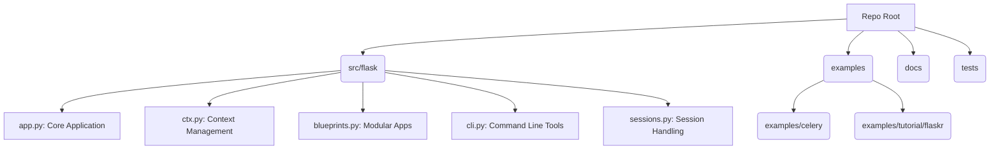
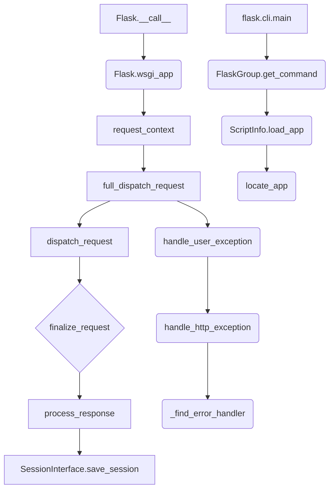

[!!] **WARNING: ANALYSIS INCOMPLETE**
This documentation may be incomplete due to errors encountered during repository analysis or because certain information could not be located. Specifically, detailed setup instructions, quick start guides, key features beyond the project's foundational role, and a full technology stack analysis were marked as missing or could not be determined.

# Project Documentation: flask documentation

## 1. Project Overview
- **Description:** Example Flask application with Celery background tasks. (Note: The core functionality of the repository involves the Flask framework itself, covering HTTP handling, routing, and context management.)
- **Key Features:** 
  - Web Routing and Dispatching.
  - Request and Application Context Management.
  - Jinja Templating Integration.
  - Extensible Command Line Interface (CLI).
  - Secure Session and JSON Serialization.
- **Tech Stack:** Python, Flask, Celery, Werkzeug, Jinja2, itsdangerous, click.

## 2. Architecture
### Repository Structure
The repository follows a typical Python package structure, with core source code under `src/flask`, development and testing materials in `tests/`, and several full application examples in `examples/`.



### Repository Call Graph
This graph illustrates high-level internal workflows, particularly focusing on the request lifecycle and CLI invocation paths within the core `src/flask/` modules.



## 3. Installation
### Dependencies
The minimal dependencies required appear to be:
```
- flask
- celery[redis] (for the background task example)
```
If using a modern Python environment, ensure these are installed via:
```bash
pip install flask
pip install celery[redis]
```

### Setup Guide
[Information not found]

### Quick Startup
[Information not found]

## 4. Use Cases & Commands
The repository structure highlights several primary use cases of the Flask framework:

1.  **Standard Web Application:** Defining routes and views (`route` decorator) for handling HTTP requests (`test_basic.py`).
2.  **Application Factory Pattern:** Using the `create_app` function (e.g., in `examples/tutorial/flaskr/__init__.py`) to enable dynamic configuration and isolation for testing and deployment.
3.  **Command Line Operations:** Using the built-in `flask` CLI command structure for running development servers (`run`) or executing custom setup commands (`init-db`).
4.  **Asynchronous Tasks (External Integration):** Integrating with Celery for background task processing (`examples/celery`), demonstrating non-blocking execution using `shared_task` decorated functions (`tasks.py`).
5.  **Testing:** Extensive use of `flask.testing.FlaskClient` and `pytest` fixtures for verifying application behavior, especially context management and session handling.

**Primary Commands (Inferred):**
*   To initialize the database in the tutorial example:
    ```bash
    flask --app flaskr init-db
    ```
*   To run the application (assuming the main application is configured):
    ```bash
    flask run
    ```

## 5. Function & Class Reference
### File: `examples/tutorial/flaskr/__init__.py`

**Function: `create_app`**
- **Signature:**
  ```python
  def create_app(test_config=None):
  ```
- **Description:** Create and configure an instance of the Flask application.
- **Parameters:**
  - `test_config` (None): [Description could not be determined from the source code.]
- **Returns:** (None) [Could not be determined from the source code.]
- **Calls:** [`Flask`, `from_mapping`, `from_pyfile`, `join`, `makedirs`, `update`, `init_app`, `register_blueprint`]
- **Called By:** [`app` (in `examples/tutorial/tests/conftest.py`)]

### File: `examples/tutorial/flaskr/auth.py`

**Function: `login_required`**
- **Signature:**
  ```python
  def login_required(view):
  ```
- **Description:** View decorator that redirects anonymous users to the login page.
- **Parameters:**
  - `view` (None): [Description could not be determined from the source code.]
- **Returns:** (None) [Could not be determined from the source code.]
- **Calls:** [`redirect`, `url_for`, `view`, `wraps`]
- **Called By:** [`create` (in `examples/tutorial/flaskr/blog.py`), `update` (in `examples/tutorial/flaskr/blog.py`), `delete` (in `examples/tutorial/flaskr/blog.py`)]

### File: `examples/tutorial/flaskr/db.py`

**Function: `init_db_command`**
- **Signature:**
  ```python
  def init_db_command():
  ```
- **Description:** Clear existing data and create new tables.
- **Parameters:**
  - [No Parameters]
- **Returns:** (None) [Could not be determined from the source code.]
- **Calls:** [`command`, `echo`, `init_db`]
- **Called By:** [None]

### File: `examples/celery/src/task_app/tasks.py`

**Function: `add`**
- **Signature:**
  ```python
  def add(a, b):
  ```
- **Description:** [Could not be determined from the source code.]
- **Parameters:**
  - `a` (None): [Description could not be determined from the source code.]
  - `b` (None): [Description could not be determined from the source code.]
- **Returns:** 'int' [Description could not be determined from the source code.]
- **Calls:** [`shared_task`]
- **Called By:** [None]

### File: `src/flask/app.py`

**Class: `Flask`**
*Description: The flask object implements a WSGI application and acts as the central object. It is passed the name of the module or package of the application. Once it is created it will act as a central registry for the view functions, the URL rules, template configuration and much more.*

**Method: `run`**
- **Signature:**
  ```python
  def run(self, host=None, port=None, debug=None, load_dotenv=True, **options):
  ```
- **Description:** Runs the application on a local development server. Do not use ``run()`` in a production setting. It is not intended to meet security and performance requirements for a production server. Instead, see :doc:`/deploying/index` for WSGI server recommendations.
- **Parameters:**
  - `host` (None): the hostname to listen on. Set this to ``'0.0.0.0'`` to have the server available externally as well. Defaults to ``'127.0.0.1'`` or the host in the ``SERVER_NAME`` config variable if present.
  - `port` (None): the port of the webserver. Defaults to ``5000`` or the port defined in the ``SERVER_NAME`` config variable if present.
  - `debug` (None): if given, enable or disable debug mode. See :attr:`debug`.
  - `load_dotenv` (None): Load the nearest :file:`.env` and :file:`.flaskenv` files to set environment variables. Will also change the working directory to the directory containing the first file found.
  - `options` (None): the options to be forwarded to the underlying Werkzeug server. See :func:`werkzeug.serving.run_simple` for more information.
- **Returns:** 'None' [Could not be determined from the source code.]
- **Calls:** [`bool`, `cast`, `get`, `get_debug_flag`, `get_load_dotenv`, `int`, `is_running_from_reloader`, `load_dotenv`, `partition`, `run_simple`, `secho`, `setdefault`, `show_server_banner`]
- **Called By:** [None]

**Method: `full_dispatch_request`**
- **Signature:**
  ```python
  def full_dispatch_request(self):
  ```
- **Description:** Dispatches the request and on top of that performs request pre and postprocessing as well as HTTP exception catching and error handling.
- **Parameters:**
  - [No Parameters]
- **Returns:** 'Response' [Could not be determined from the source code.]
- **Calls:** [`dispatch_request`, `finalize_request`, `handle_user_exception`, `preprocess_request`, `send`]
- **Called By:** [`wsgi_app` (in `src/flask/app.py`)]

### File: `src/flask/cli.py`

**Class: `FlaskGroup`**
*Description: Special subclass of the :class:`AppGroup` group that supports loading more commands from the configured Flask app. Normally a developer does not have to interface with this class but there are some very advanced use cases for which it makes sense to create an instance of this. see :ref:`custom-scripts`.*

**Function: `locate_app`**
- **Signature:**
  ```python
  def locate_app(module_name, app_name, raise_if_not_found=True):
  ```
- **Description:** [Could not be determined from the source code.]
- **Parameters:**
  - `module_name` (None): [Description could not be determined from the source code.]
  - `app_name` (None): [Description could not be determined from the source code.]
  - `raise_if_not_found` (None): [Description could not be determined from the source code.]
- **Returns:** 'Flask | None' [Could not be determined from the source code.]
- **Calls:** [`NoAppException`, `__import__`, `exc_info`, `find_app_by_string`, `find_best_app`, `format_exc`]
- **Called By:** [`load_app` (in `src/flask/cli.py`)]

### File: `src/flask/ctx.py`

**Class: `AppContext`**
*Description: An app context contains information about an app, and about the request when handling a request. A context is pushed at the beginning of each request and CLI command, and popped at the end. The context is referred to as a "request context" if it has request information, and an "app context" if not.*

**Method: `push`**
- **Signature:**
  ```python
  def push(self):
  ```
- **Description:** Push this context so that it is the active context. If this is a request context, calls :meth:`match_request` to perform routing with the context active.
- **Parameters:**
  - [No Parameters]
- **Returns:** 'None' [Could not be determined from the source code.]
- **Calls:** [`match_request`, `send`, `set`]
- **Called By:** [`__enter__` (in `src/flask/ctx.py`), `wsgi_app` (in `src/flask/app.py`), `wrapper` (in `tests/test_reqctx.py`)]

**Function: `has_request_context`**
- **Signature:**
  ```python
  def has_request_context():
  ```
- **Description:** Test if an app context is active and if it has request information.
- **Parameters:**
  - [No Parameters]
- **Returns:** 'bool' [Could not be determined from the source code.]
- **Calls:** [`get`]
- **Called By:** [`wrapper` (in `src/flask/ctx.py`), `test_context_test` (in `tests/test_reqctx.py`)]

### File: `src/flask/sessions.py`

**Class: `SecureCookieSessionInterface`**
*Description: The default session interface that stores sessions in signed cookies through the :mod:`itsdangerous` module.*

**Method: `open_session`**
- **Signature:**
  ```python
  def open_session(self, app, request):
  ```
- **Description:** [Could not be determined from the source code.]
- **Parameters:**
  - `app` (None): [Description could not be determined from the source code.]
  - `request` (None): [Description could not be determined from the source code.]
- **Returns:** 'SecureCookieSession | None' [Could not be determined from the source code.]
- **Calls:** [`NotImplementedError`, `get`, `get_cookie_name`, `get_signing_serializer`, `int`, `loads`, `session_class`, `total_seconds`]
- **Called By:** [`session` (in `src/flask/ctx.py`)]

---