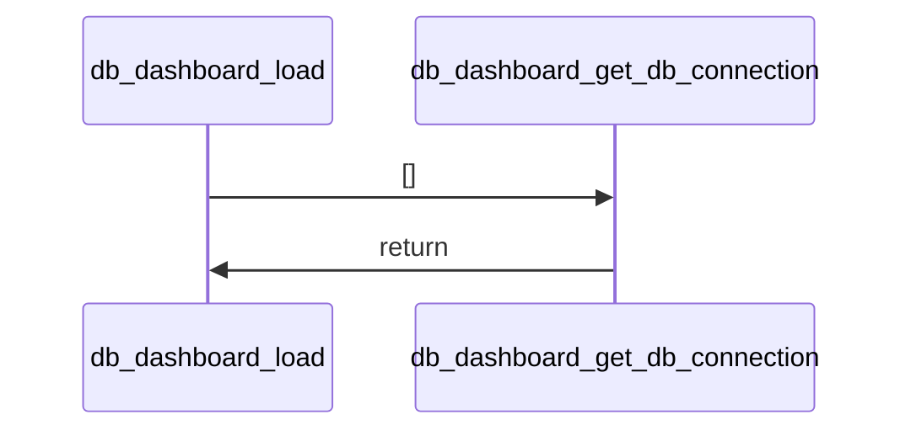
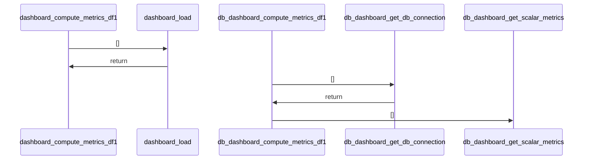
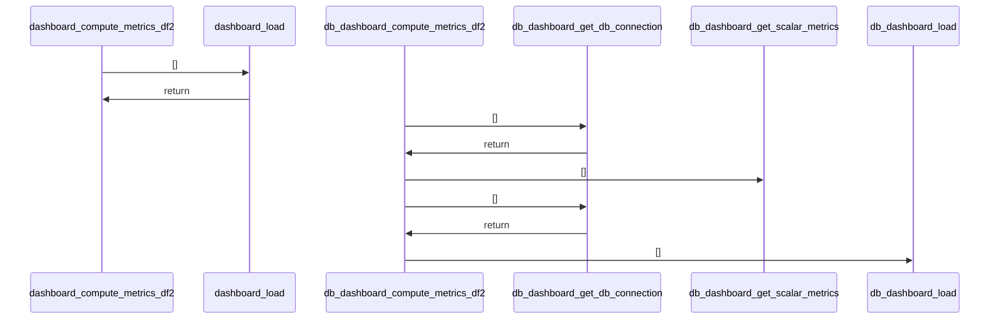
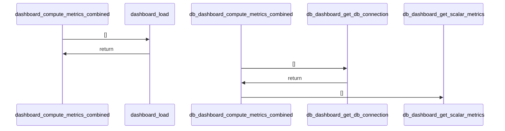
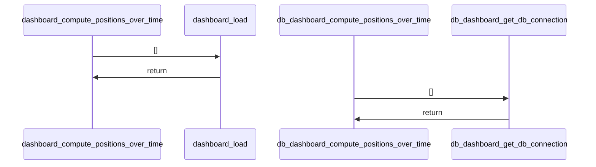
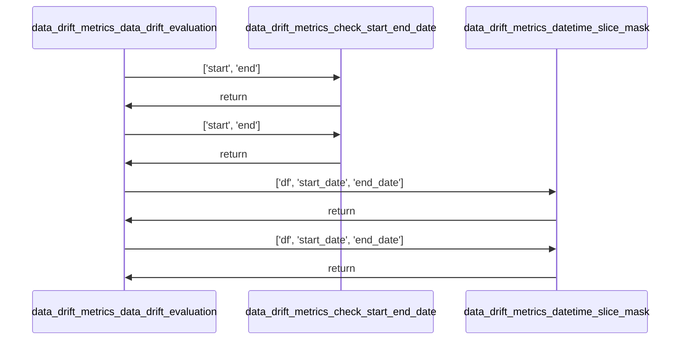
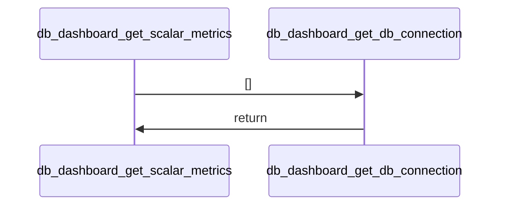
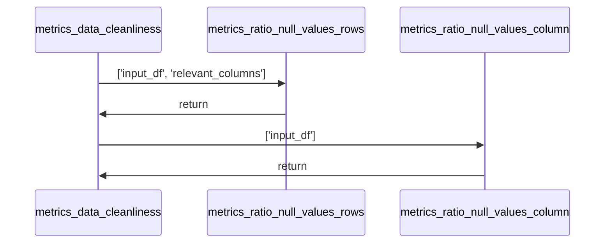

# Project Documentation: analytics-application-development-uni documentation

## 1. Project Overview [Can be accessed under 'basic_info'.]
    - **Description:** Could not be determined due to a missing README file and insufficient context.
    - **Key Features:** 
      - Could not be determined due to a missing README file and insufficient context.
    - **Tech Stack:** Could not be determined due to a missing README file and insufficient context.
*   **Repository Structure:**
    ```mermaid
    graph LR
        root --> .DS_Store
        root --> .gitignore
        root --> .streamlit
        root --> Notebook.ipynb
        root --> Notizen
        root --> app_pages
        root --> assets
        root --> build_db.py
        root --> dashboard.py
        root --> data_cleaning.py
        root --> data_drift.py
        root --> data_drift_metrics.py
        root --> data_exploration.py
        root --> data_exploration2.py
        root --> db_dashboard.py
        root --> metrics.py
        root --> requirements.txt
        .streamlit --> config.toml
        Notizen --> Analytics_Application_Development.md
        Notizen --> Dokumentation_AAD.md
        Notizen --> Meeting_17-11-25.md
        app_pages --> __init__.py
        app_pages --> page1.py
        app_pages --> page2.py
        app_pages --> page3.py
        app_pages --> page4.py
        app_pages --> page5.py
        assets --> logo.png
    ```

    ## 2. Installation (can be accessed under 'basic_info')
    ### Dependencies
    - altair==5.5.0
    - attrs==25.4.0
    - blinker==1.9.0
    - cachetools==6.2.2
    - certifi==2025.11.12
    - charset-normalizer==3.4.4
    - click==8.3.1
    - colorama==0.4.6
    - gitdb==4.0.12
    - GitPython==3.1.45
    - idna==3.11
    - Jinja2==3.1.6
    - jsonschema==4.25.1
    - jsonschema-specifications==2025.9.1
    - MarkupSafe==3.0.3
    - narwhals==2.12.0
    - numpy==2.3.5
    - packaging==25.0
    - pandas==2.3.3
    - pillow==12.0.0
    - protobuf==6.33.1
    - pyarrow==21.0.0
    - pydeck==0.9.1
    - python-dateutil==2.9.0.post0
    - pytz==2025.2
    - referencing==0.37.0
    - requests==2.32.5
    - rpds-py==0.29.0
    - scipy==1.16.3
    - six==1.17.0
    - smmap==5.0.2
    - streamlit==1.51.0
    - streamlit-option-menu==0.4.0
    - tenacity==9.1.2
    - toml==0.10.2
    - tornado==6.5.2
    - typing_extensions==4.15.0
    - tzdata==2025.2
    - urllib3==2.5.0
    - watchdog==6.0.0
    - sentence-transformers
    - torch torchvision --index-url https://download.pytorch.org/whl/cu126
    - duckdb
    pip install -r requirements.txt
    ### Setup Guide
    Information not found
    ### Quick Startup
    Information not found

    ## 3. Use Cases & Commands
    This project appears to be a dashboard application for analyzing financial data, likely related to orders and positions. It focuses on data quality, plausibility checks, and identifying anomalies. Key functionalities include:
    
    *   **Data Quality Monitoring:** Assessing null value ratios, checking data uniqueness, and identifying potential errors in data entries.
    *   **Plausibility and Validation Checks:** Verifying the consistency of financial data, such as comparing order totals with aggregated position totals, and checking for logical errors in specific fields like time values or discounts.
    *   **Anomaly Detection:** Identifying outliers in financial data, potentially related to specific damage types or high-value transactions.
    *   **Data Drift Analysis:** (Inferred from file names like `data_drift.py` and `data_drift_metrics.py`) Potentially monitoring changes in data distribution over time.
    
    The primary interaction point seems to be the `dashboard.py` script, which likely serves as the entry point for running the Streamlit application. Specific commands to run the application are not detailed in the provided information, but typically involve running the main script (e.g., `streamlit run dashboard.py`).

    ## 4. Architecture
```mermaid
graph TD
```
    Information not found

## 5. Code Analysis
### File: `app_pages/page1.py`

#### Function: `show_page`
*   **Signature:** `def show_page(df, df2, metrics_df1, metrics_df2, metrics_combined)`
*   **Description:** The function 'show_page' displays key performance indicators (KPIs) and visualizes data quality metrics using Streamlit components. It calculates and presents various statistics such as row counts, null value ratios, and unique ID checks for two datasets (df and df2). Additionally, it generates two charts: one showing the top columns with the highest null value ratios and another displaying error frequency by weekday and hour. The function relies on precomputed metrics provided via input DataFrames.
*   **Parameters:**
    - **df** (`DataFrame`): The first dataset containing order data.
    - **df2** (`DataFrame`): The second dataset containing position data.
    - **metrics_df1** (`dict`): A dictionary containing metrics computed for the first dataset (df).
    - **metrics_df2** (`dict`): A dictionary containing metrics computed for the second dataset (df2).
    - **metrics_combined** (`dict`): A dictionary containing combined metrics across both datasets.
*   **Returns:**
*   **Usage:**
    *   Calls: `metrics.ratio_null_values_rows`
    *   Called by: This function is not called by any other functions.

### File: `app_pages/page2.py`

#### Function: `show_page`
*   **Signature:** `def show_page(df, df2, metrics_df1, metrics_df2, metrics_combined)`
*   **Description:** The function 'show_page' displays data and metrics related to time value errors and orders exceeding 50,000 EUR on a Streamlit web page. It retrieves or calculates various metrics from input DataFrames and presents them using Streamlit components such as metrics, dataframes, and markdown separators. The function uses helper functions from the 'metrics' module to compute specific values like error counts and filtered dataframes.
*   **Parameters:**
    - **df** (`DataFrame`): The primary dataframe containing general data.
    - **df2** (`DataFrame`): A secondary dataframe, possibly used for additional data processing or comparison.
    - **metrics_df1** (`dict`): A dictionary containing precomputed metrics or placeholders for computed values like error series and counts.
    - **metrics_df2** (`dict`): A dictionary containing additional metrics, though not directly used in the function body.
    - **metrics_combined** (`dict`): A dictionary containing combined metrics, specifically used to retrieve 'auftraege_abgleich'.
*   **Returns:**
*   **Usage:**
    *   Calls: `metrics.above_50k`, `metrics.check_zeitwert`
    *   Called by: This function is not called by any other functions.

### File: `app_pages/page3.py`

#### Function: `show_page`
*   **Signature:** `def show_page(df, df2, metrics_df1, metrics_df2, metrics_combined)`
*   **Description:** The function 'show_page' displays data related to handwerker (craftspeople) and gewerke (trades) using Streamlit components. It retrieves specific metrics from input DataFrames and presents them in a structured layout with KPIs and data visualizations. The function focuses on displaying outlier data and test dataset counts for different trade categories.
*   **Parameters:**
    - **df** (`Any`): A DataFrame containing general data, not directly used in the function body.
    - **df2** (`Any`): A second DataFrame, not directly used in the function body.
    - **metrics_df1** (`Dict[str, Any]`): A dictionary-like DataFrame containing various metrics including outlier data and test dataset counts.
    - **metrics_df2** (`Any`): A second metrics DataFrame, not directly used in the function body.
    - **metrics_combined** (`Any`): A combined metrics DataFrame, not directly used in the function body.
*   **Returns:**
*   **Usage:**
    *   Calls: This function calls no other functions.
    *   Called by: This function is not called by any other functions.

### File: `app_pages/page4.py`

#### Function: `show_page`
*   **Signature:** `def show_page(df, df2, metrics_df1, metrics_df2, metrics_combined)`
*   **Description:** The function 'show_page' displays a set of key performance indicators (KPIs) related to data plausibility and validation checks for two datasets, df and df2. It retrieves specific metrics from two metric dataframes, metrics_df1 and metrics_df2, and presents them using Streamlit components such as st.metric and st.columns. The function also handles default values for missing keys in the metric dataframes by calling helper functions from the 'metrics' module.
*   **Parameters:**
    - **df** (`Any`): First dataset used for calculating false negative metrics.
    - **df2** (`Any`): Second dataset used for calculating discount check and false negative metrics.
    - **metrics_df1** (`Dict[str, Any]`): Dictionary containing metrics related to the first dataset, including plausibility checks and false negatives.
    - **metrics_df2** (`Dict[str, Any]`): Dictionary containing metrics related to the second dataset, including plausibility checks and false negatives.
    - **metrics_combined** (`Any`): Combined metrics data, although not directly used in the function body.
*   **Returns:**
*   **Usage:**
    *   Calls: `metrics.discount_check`, `metrics.false_negative_df`, `metrics.false_negative_df2`
    *   Called by: This function is not called by any other functions.

### File: `app_pages/page5.py`

#### Function: `show_page`
*   **Signature:** `def show_page()`
*   **Description:** This function displays the content for Page 5 of a Streamlit application. It sets the title of the page to 'Page 5' using the Streamlit library. The function performs no complex operations and serves solely to render the page title.
*   **Parameters:**
*   **Returns:**
*   **Usage:**
    *   Calls: This function calls no other functions.
    *   Called by: This function is not called by any other functions.

### File: `build_db.py`

*Analysis data not available for this component.*

### File: `dashboard.py`

#### Function: `load`
   **Sequence diagram for load**

*   **Signature:** `def load()`
*   **Description:** This function loads two pandas DataFrames from Parquet files located at 'resources/Auftragsdaten_konvertiert' and 'resources/Positionsdaten_konvertiert'. It reads these files using pandas' read_parquet method and returns both DataFrames as a tuple. The function serves as a data loading utility for dashboard components.
*   **Parameters:**
*   **Returns:**
    - **df** (`DataFrame`): The first DataFrame loaded from the 'Auftragsdaten_konvertiert' Parquet file.
    - **df2** (`DataFrame`): The second DataFrame loaded from the 'Positionsdaten_konvertiert' Parquet file.
*   **Usage:**
    *   Calls: This function calls no other functions.
    *   Called by: This function is not called by any other functions.

#### Function: `compute_metrics_df1`
   **Sequence diagram for compute_metrics_df1**

*   **Signature:** `def compute_metrics_df1()`
*   **Description:** "This function computes a comprehensive set of metrics for a DataFrame named 'df1' (Auftragsdaten). It performs various data validation checks, statistical computations, and anomaly detection tasks. The function loads data using a helper function, applies multiple metric calculation functions from the 'metrics' module, and aggregates results into a dictionary. Each metric computation is timed and printed for monitoring purposes."
*   **Parameters:**
*   **Returns:**
    - **metrics_df1** (`dict`): "A dictionary containing various computed metrics for the DataFrame including row counts, null value ratios, plausibility checks, data cleanliness ratios, proforma documents, error frequencies, and outlier information."
*   **Usage:**
    *   Calls: `dashboard.load`, `metrics.Kundengruppe_containing_test`, `metrics.above_50k`, `metrics.allgemeine_statistiken_num`, `metrics.check_keywords_vectorized`, `metrics.check_zeitwert`, `metrics.count_rows`, `metrics.data_cleanliness`, `metrics.error_frequency_by_weekday_hour`, `metrics.false_negative_df`, `metrics.handwerker_gewerke_outlier`, `metrics.plausibilitaetscheck_forderung_einigung`, `metrics.proformabelege`, `metrics.ratio_null_values_column`, `metrics.ratio_null_values_rows`
    *   Called by: This function is not called by any other functions.

#### Function: `compute_metrics_df2`
   **Sequence diagram for compute_metrics_df2**

*   **Signature:** `def compute_metrics_df2()`
*   **Description:** "This function computes a set of descriptive statistics and validation metrics for a DataFrame named 'df2', which contains position data. It loads the data using a helper function, performs various checks and calculations on the data, and returns a dictionary of these computed metrics. The function includes timing information to track execution duration."
*   **Parameters:**
*   **Returns:**
    - **metrics_df2** (`dict`): "A dictionary containing various metrics computed from the df2 DataFrame, including row counts, null value ratios, statistical summaries, discount check results, position counts, plausibility check results, and false negative counts."
*   **Usage:**
    *   Calls: `dashboard.load`, `metrics.allgemeine_statistiken_num`, `metrics.count_rows`, `metrics.discount_check`, `metrics.false_negative_df2`, `metrics.plausibilitaetscheck_forderung_einigung`, `metrics.position_count`, `metrics.ratio_null_values_column`, `metrics.ratio_null_values_rows`
    *   Called by: This function is not called by any other functions.

#### Function: `compute_metrics_combined`
   **Sequence diagram for compute_metrics_combined**

*   **Signature:** `def compute_metrics_combined()`
*   **Description:** "This function computes combined metrics that require data from two DataFrames. It loads the required data, performs uniqueness checks and order alignment calculations, and returns a dictionary containing the computed metrics. The function includes timing information to measure execution duration."
*   **Parameters:**
*   **Returns:**
    - **metrics_combined** (`dict`): "A dictionary containing three keys: 'kvarechnung_id_is_unique', 'position_id_is_unique', and 'auftraege_abgleich', each holding the result of their respective computations."
*   **Usage:**
    *   Calls: `dashboard.load`, `metrics.abgleich_auftraege`, `metrics.uniqueness_check`
    *   Called by: This function is not called by any other functions.

#### Function: `compute_positions_over_time`
   **Sequence diagram for compute_positions_over_time**

*   **Signature:** `def compute_positions_over_time()`
*   **Description:** "This function calculates the number of positions per order over time and returns the result as a DataFrame. It loads two datasets using a helper function, performs a computation using a metrics module, and prints timing information during execution. The function is designed to be cached, suggesting it may be used in a web application context where performance optimization is important."
*   **Parameters:**
*   **Returns:**
    - **positions_over_time_df** (`DataFrame`): A DataFrame containing the calculated positions per order over time.
*   **Usage:**
    *   Calls: `dashboard.load`, `metrics.positions_per_order_over_time`
    *   Called by: This function is not called by any other functions.

### File: `data_cleaning.py`

*Analysis data not available for this component.*

### File: `data_drift.py`

#### Function: `load_data`
   **Sequence diagram for load**

*   **Signature:** `def load_data()`
*   **Description:** "This function generates a synthetic dataset representing daily sales data over a period of one year, from January 1, 2022, to December 31, 2023. It creates a DataFrame with three columns: 'datum' for dates, 'umsatz' for sales figures that exhibit a gradual increase with random noise, and 'kunden' for customer counts. The function uses pandas for date range creation and numpy for generating linearly increasing values and random variations."
*   **Parameters:**
*   **Returns:**
    - **df** (`DataFrame`): "A pandas DataFrame containing synthetic daily sales data with columns 'datum', 'umsatz', and 'kunden'."
*   **Usage:**
    *   Calls: This function calls no other functions.
    *   Called by: This function is not called by any other functions.

#### Function: `filterby_timeframe`
*   **Signature:** `def filterby_timeframe(input_df, start_date, end_date)`
*   **Description:** The function filters a pandas DataFrame based on a specified date range. It converts the provided start and end dates into datetime objects and applies a boolean mask to select rows where the 'datum' column falls within the given timeframe. The filtered DataFrame is then returned.
*   **Parameters:**
    - **input_df** (`DataFrame`): The input pandas DataFrame that contains the data to be filtered.
    - **start_date** (`str or datetime-like`): The starting date of the timeframe to filter the data. Can be a string or a datetime-like object.
    - **end_date** (`str or datetime-like`): The ending date of the timeframe to filter the data. Can be a string or a datetime-like object.
*   **Returns:**
    - **filtered_df** (`DataFrame`): A pandas DataFrame containing only the rows where the 'datum' column is within the specified date range.
*   **Usage:**
    *   Calls: This function calls no other functions.
    *   Called by: This function is not called by any other functions.

#### Function: `get_drift_stats`
*   **Signature:** `def get_drift_stats(input_df, frequency)`
*   **Description:** "The function computes statistical measures (mean, median, standard deviation, minimum, and maximum) for two columns ('umsatz' and 'kunden') grouped by a time frequency. It takes an input DataFrame and a frequency parameter to group the data by time periods. The resulting statistics are organized into a flattened DataFrame with column names indicating the metric applied to each original column."
*   **Parameters:**
    - **input_df** (`DataFrame`): "The input DataFrame containing at least the columns 'datum', 'umsatz', and 'kunden'."
    - **frequency** (`str`): "A frequency string used to group the data by time periods (e.g., 'D' for daily, 'M' for monthly)."
*   **Returns:**
    - **stats_df** (`DataFrame`): A DataFrame containing aggregated statistics for 'umsatz' and 'kunden' grouped by the specified frequency.
*   **Usage:**
    *   Calls: This function calls no other functions.
    *   Called by: This function is not called by any other functions.

#### Function: `slicing`
*   **Signature:** `def slicing(input_df, frequency)`
*   **Description:** "The function 'slicing' creates individual slices from an input DataFrame based on a specified frequency grouping. It groups the data by date using pandas' Grouper and iterates through the groups to create a dictionary of slices, keyed by formatted date labels. Each slice corresponds to a time period defined by the frequency parameter. If an exception occurs during the process, it logs an error using Streamlit and returns an empty dictionary."
*   **Parameters:**
    - **input_df** (`DataFrame`): The input DataFrame containing the data to be sliced.
    - **frequency** (`str`): "The frequency string used to group the data by date, such as 'D' for daily or 'M' for monthly."
*   **Returns:**
    - **slices** (`dict`): A dictionary where keys are formatted date strings and values are the corresponding grouped DataFrames.
*   **Usage:**
    *   Calls: This function calls no other functions.
    *   Called by: This function is not called by any other functions.

### File: `data_drift_metrics.py`

#### Function: `load`
   **Sequence diagram for load**

*   **Signature:** `def load()`
*   **Description:** "This function loads two datasets from Parquet files, sorts them by a timestamp column, and merges them based on a common identifier. It returns both the sorted original dataset and the merged dataset. The function primarily handles data ingestion and preprocessing for further analysis."
*   **Parameters:**
*   **Returns:**
    - **df** (`DataFrame`): "The first loaded DataFrame, sorted by CRMEingangszeit."
    - **df2** (`DataFrame`): "The second loaded DataFrame, merged with the first and sorted by CRMEingangszeit."
*   **Usage:**
    *   Calls: This function calls no other functions.
    *   Called by: This function is not called by any other functions.

#### Function: `check_start_end_date`
*   **Signature:** `def check_start_end_date(start, end)`
*   **Description:** "This function serves as a helper to ensure chronological ordering of two datetime objects. It takes two datetime inputs, compares them, and swaps their order if necessary so that the first value is chronologically before or equal to the second. The function returns both values in chronological sequence."
*   **Parameters:**
    - **start** (`datetime`): The assumed beginning of the interval.
    - **end** (`datetime`): The assumed end of the interval.
*   **Returns:**
    - **start** (`datetime`): The chronologically earlier datetime value.
    - **end** (`datetime`): The chronologically later datetime value.
*   **Usage:**
    *   Calls: This function calls no other functions.
    *   Called by: This function is not called by any other functions.

#### Function: `datetime_slice_mask`
*   **Signature:** `def datetime_slice_mask(df, start_date, end_date)`
*   **Description:** "This function filters a pandas DataFrame based on a specified date range and converts the resulting subset into an Evidently Dataset. It checks for specific column names to determine the appropriate data definition schema to use during conversion. The function is designed to work with two types of DataFrames: one with a 'Kundengruppe' column (likely representing order data) and another with a 'Menge' column (likely representing position data)."
*   **Parameters:**
    - **df** (`pandas.DataFrame`): The input DataFrame to be filtered by datetime.
    - **start_date** (`datetime`): The starting date for filtering the DataFrame.
    - **end_date** (`datetime`): The ending date for filtering the DataFrame.
*   **Returns:**
    - **sliced_ds** (`evidently.Dataset`): A sliced DataFrame converted to an Evidently Dataset based on the provided date range and column presence.
*   **Usage:**
    *   Calls: This function calls no other functions.
    *   Called by: This function is not called by any other functions.

#### Function: `data_drift_evaluation`
   **Sequence diagram for data_drift_evaluation**

*   **Signature:** `def data_drift_evaluation(df, start_date_reference, end_date_reference, start_date_eval, end_date_eval)`
*   **Description:** "This function evaluates data drift between two time-sliced datasets using the EvidentlyAI framework. It takes a DataFrame and four datetime parameters to define reference and evaluation periods. The function ensures chronological order of dates, slices the data accordingly, and generates a data drift report based on the presence of specific columns in the DataFrame. The resulting HTML report is saved to disk for visualization."
*   **Parameters:**
    - **df** (`pandas.DataFrame`): DataFrame to sample from
    - **start_date_reference** (`datetime`): "starting datetime of the reference, baseline dataset"
    - **end_date_reference** (`datetime`): "ending datetime of the reference, baseline dataset"
    - **start_date_eval** (`datetime`): starting datetime of the evaluated dataset
    - **end_date_eval** (`datetime`): starting datetime of the evaluated dataset
*   **Returns:**
*   **Usage:**
    *   Calls: `data_drift_metrics.check_start_end_date`, `data_drift_metrics.datetime_slice_mask`
    *   Called by: This function is not called by any other functions.

### File: `data_exploration.py`

#### Function: `load`
   **Sequence diagram for load**

*   **Signature:** `def load()`
*   **Description:** This function loads two datasets from Parquet files located at 'resources/Auftragsdaten_konvertiert' and 'resources/Positionsdaten_konvertiert'. It reads these files using pandas and returns them as a tuple of DataFrames. The function serves as a data loading utility for further processing or analysis.
*   **Parameters:**
*   **Returns:**
    - **df** (`DataFrame`): The first DataFrame loaded from the 'Auftragsdaten_konvertiert' Parquet file.
    - **df2** (`DataFrame`): The second DataFrame loaded from the 'Positionsdaten_konvertiert' Parquet file.
*   **Usage:**
    *   Calls: This function calls no other functions.
    *   Called by: This function is not called by any other functions.

### File: `data_exploration2.py`

*Analysis data not available for this component.*

### File: `db_dashboard.py`

#### Function: `get_db_connection`
*   **Signature:** `def get_db_connection()`
*   **Description:** This function establishes a read-only connection to a DuckDB database using a predefined path. It is designed to provide a consistent and isolated database connection for read operations only. The function does not accept any parameters and directly returns the database connection object. It relies on an external constant DB_PATH to determine the location of the database file.
*   **Parameters:**
*   **Returns:**
    - **connection** (`duckdb.Connection`): A read-only DuckDB database connection object.
*   **Usage:**
    *   Calls: This function calls no other functions.
    *   Called by: This function is not called by any other functions.

#### Function: `load`
   **Sequence diagram for load**

*   **Signature:** `def load()`
*   **Description:** "This function retrieves two dataframes from a DuckDB database by executing SQL queries on the 'auftragsdaten' and 'positionsdaten' tables. It establishes a database connection, performs the queries, and returns the resulting dataframes. The function ensures proper resource management by closing the connection in a finally block."
*   **Parameters:**
*   **Returns:**
    - **df** (`pandas.DataFrame`): The dataframe containing data from the 'auftragsdaten' table.
    - **df2** (`pandas.DataFrame`): The dataframe containing data from the 'positionsdaten' table.
*   **Usage:**
    *   Calls: `db_dashboard.get_db_connection`
    *   Called by: This function is not called by any other functions.

#### Function: `get_scalar_metrics`
   **Sequence diagram for get_scalar_metrics**

*   **Signature:** `def get_scalar_metrics()`
*   **Description:** "This function serves as a helper to retrieve a single row of scalar metrics from a database table named 'scalar_metrics'. It establishes a database connection, executes a query to fetch all columns from the table, converts the result into a pandas DataFrame, and returns the first row of that DataFrame. The function ensures proper resource management by closing the database connection in a finally block."
*   **Parameters:**
*   **Returns:**
    - **result** (`pandas.Series`): A pandas Series representing the first row of the 'scalar_metrics' table.
*   **Usage:**
    *   Calls: `db_dashboard.get_db_connection`
    *   Called by: This function is not called by any other functions.

#### Function: `compute_metrics_df1`
   **Sequence diagram for compute_metrics_df1**

*   **Signature:** `def compute_metrics_df1()`
*   **Description:** "This function retrieves various data quality metrics for the 'df1' dataset (Auftragsdaten) from a database. It performs multiple SQL queries to fetch different types of metrics including null ratios, numeric statistics, plausibility checks, cleanliness metrics, and error frequencies. The function aggregates these results into a dictionary structure for further use. It measures execution time and handles database connections properly using a try-finally block to ensure connection closure."
*   **Parameters:**
*   **Returns:**
    - **metrics_df1** (`dict`): "A dictionary containing various data quality metrics for the Auftragsdaten dataset, including row counts, null ratios, statistical summaries, plausibility checks, and error frequency data."
*   **Usage:**
    *   Calls: `db_dashboard.get_db_connection`, `db_dashboard.get_scalar_metrics`
    *   Called by: This function is not called by any other functions.

#### Function: `compute_metrics_df2`
   **Sequence diagram for compute_metrics_df2**

*   **Signature:** `def compute_metrics_df2()`
*   **Description:** "This function computes a comprehensive set of metrics for the 'df2' dataset, specifically related to 'Positionsdaten'. It retrieves data from a database, performs various aggregations and calculations, and returns a dictionary containing multiple metric values. The function handles database connections, executes SQL queries, processes dataframes, and calculates statistics such as row counts, null ratios, and plausibility checks."
*   **Parameters:**
*   **Returns:**
    - **metrics_df2** (`dict`): "A dictionary containing computed metrics for the df2 dataset, including row count, null ratios, statistical summaries, discount check errors, position counts per rechnung, plausibility differences, and false negative counts."
*   **Usage:**
    *   Calls: `db_dashboard.get_db_connection`, `db_dashboard.get_scalar_metrics`, `db_dashboard.load`
    *   Called by: This function is not called by any other functions.

#### Function: `compute_metrics_combined`
   **Sequence diagram for compute_metrics_combined**

*   **Signature:** `def compute_metrics_combined()`
*   **Description:** "This function retrieves combined metrics from a database by first establishing a connection and fetching scalar metrics. It then executes a query to fetch data related to order position mismatches and constructs a dictionary containing boolean flags for uniqueness checks and the fetched DataFrame. Finally, it prints the loading duration and returns the constructed metrics dictionary."
*   **Parameters:**
*   **Returns:**
    - **metrics_combined** (`dict`): A dictionary containing boolean flags indicating whether certain IDs are unique and a DataFrame with order position mismatch data.
*   **Usage:**
    *   Calls: `db_dashboard.get_db_connection`, `db_dashboard.get_scalar_metrics`
    *   Called by: This function is not called by any other functions.

#### Function: `compute_positions_over_time`
   **Sequence diagram for compute_positions_over_time**

*   **Signature:** `def compute_positions_over_time()`
*   **Description:** "This function retrieves position data over time from a database table named 'metric_positions_over_time'. It establishes a database connection, executes a SELECT query to fetch all records, and returns the resulting data as a pandas DataFrame. The function includes timing functionality to measure the duration of the database operation and prints status messages to indicate progress."
*   **Parameters:**
*   **Returns:**
    - **df_pos_time** (`pandas.DataFrame`): A DataFrame containing all rows from the 'metric_positions_over_time' table.
*   **Usage:**
    *   Calls: `db_dashboard.get_db_connection`
    *   Called by: This function is not called by any other functions.

### File: `metrics.py`

#### Function: `load_data`
   **Sequence diagram for load**

*   **Signature:** `def load_data()`
*   **Description:** This function reads two Parquet files using pandas and returns them as tuple of DataFrames. It is designed to load data from specific resource paths into memory for further processing.
*   **Parameters:**
*   **Returns:**
    - **df** (`DataFrame`): The first DataFrame loaded from the 'resources/Auftragsdaten_konvertiert' Parquet file.
    - **df2** (`DataFrame`): The second DataFrame loaded from the 'resources/Positionsdaten_konvertiert' Parquet file.
*   **Usage:**
    *   Calls: This function calls no other functions.
    *   Called by: This function is not called by any other functions.

#### Function: `ratio_null_values_column`
*   **Signature:** `def ratio_null_values_column(input_df)`
*   **Description:** This function computes the ratio of null values for each column in a given pandas DataFrame. It calculates the percentage of missing data per column and returns the results in a new DataFrame. The implementation leverages pandas' built-in methods to efficiently compute null ratios without explicit loops.
*   **Parameters:**
    - **input_df** (`pandas.DataFrame`): DataFrame that is to be evaluated for null value ratios.
*   **Returns:**
    - **null_ratio_df** (`pd.DataFrame`): "DataFrame containing two columns: 'index' (representing column names) and 'null_ratio' (the percentage of null entries in each column)."
*   **Usage:**
    *   Calls: This function calls no other functions.
    *   Called by: This function is not called by any other functions.

#### Function: `ratio_null_values_rows`
*   **Signature:** `def ratio_null_values_rows(input_df, relevant_columns=None)`
*   **Description:** "This function computes the ratio of rows containing at least one null value in a given DataFrame, either across all columns or a subset of specified columns. It evaluates the proportion of such rows relative to the total number of rows in the DataFrame. The function handles edge cases like empty DataFrames by returning a ratio of 0.0. It uses pandas' built-in methods to detect null values and calculate the required statistics."
*   **Parameters:**
    - **input_df** (`pandas.DataFrame`): DataFrame that is to be evaluated.
    - **relevant_columns** (`list`): "List of column identifiers; function will only evaluate these columns, by default None."
*   **Returns:**
    - **row_ratio** (`float`): Percentage value of rows with at least one null value in the given columns.
*   **Usage:**
    *   Calls: This function calls no other functions.
    *   Called by: This function is not called by any other functions.

#### Function: `Kundengruppe_containing_test`
*   **Signature:** `def Kundengruppe_containing_test(df, return_frame=False)`
*   **Description:** "This function evaluates a pandas DataFrame to determine the number of rows where the 'Kundengruppe' column contains the substring 'test', ignoring case and treating missing values as non-matching. It optionally returns a filtered DataFrame of these rows. The function uses string operations on the DataFrame to identify matching entries and counts them."
*   **Parameters:**
    - **df** (`pandas.DataFrame`): The 'Auftragsdaten'-DataFrame that is to be evaluated.
    - **return_frame** (`bool`): "If True, this function returns a DataFrame with all found test data, by default False."
*   **Returns:**
    - **anzahl_test** (`int`): Total number of test data rows.
    - **test_Kundengruppen** (`pandas.DataFrame or None`): "DataFrame containing all found test data, returned only if return_frame = True."
*   **Usage:**
    *   Calls: This function calls no other functions.
    *   Called by: This function is not called by any other functions.

#### Function: `allgemeine_statistiken_num`
*   **Signature:** `def allgemeine_statistiken_num(input_df)`
*   **Description:** "This function computes basic statistical measures (mean, median, standard deviation, minimum, and maximum) for all numeric columns in a given pandas DataFrame. It iterates through the numeric columns, calculates these statistics, and stores them in a nested dictionary structure keyed by column names. The resulting dictionary provides a comprehensive overview of the distribution and central tendency of numerical data within the DataFrame."
*   **Parameters:**
    - **input_df** (`pandas.DataFrame`): A pandas DataFrame that contains the data to be analyzed for statistical values.
*   **Returns:**
    - **statistiken** (`dict`): "A nested dictionary where each key corresponds to a numeric column in the input DataFrame. Each value is another dictionary containing the computed statistical values (mean, median, std, min, max) for that column."
*   **Usage:**
    *   Calls: This function calls no other functions.
    *   Called by: This function is not called by any other functions.

#### Function: `plausibilitaetscheck_forderung_einigung`
*   **Signature:** `def plausibilitaetscheck_forderung_einigung(input_df)`
*   **Description:** "This function performs a plausibility check on a DataFrame by comparing the 'Einigung_Netto' and 'Forderung_Netto' columns. It identifies rows where the 'Einigung_Netto' value exceeds the 'Forderung_Netto' value, assuming this as a significant error. The function calculates the difference between these values for all such rows, computes the average of these differences, and returns the differences, their count, and the average."
*   **Parameters:**
    - **input_df** (`pandas.DataFrame`): DataFrame that is to be evaluated.
*   **Returns:**
    - **statistik** (`pandas.Series`): A list of all differences >0 as float values
    - **count** (`int`): Total number of rows with difference >0
    - **avg** (`float`): Average difference over all found instances
*   **Usage:**
    *   Calls: This function calls no other functions.
    *   Called by: This function is not called by any other functions.

#### Function: `uniqueness_check`
*   **Signature:** `def uniqueness_check(df, df2)`
*   **Description:** "The function 'uniqueness_check' verifies the uniqueness of specific ID columns across two pandas DataFrames. It takes two DataFrames as inputs, one containing 'Auftragsdaten' data and the other containing 'Positionsdaten' data. For each DataFrame, it checks whether the respective ID columns ('KvaRechnung_ID' and 'Position_ID') contain only unique values. The function returns a tuple of boolean values indicating the uniqueness status of these columns."
*   **Parameters:**
    - **df** (`pandas.DataFrame`): DataFrame that contains the 'Auftragsdaten' data set
    - **df2** (`pandas.DataFrame`): DataFrame that contains the 'Positionsdaten' data set
*   **Returns:**
    - **kvarechnung_id_is_unique** (`bool`): True if column is unique.
    - **position_id_is_unique** (`bool`): True if column is unique.
*   **Usage:**
    *   Calls: This function calls no other functions.
    *   Called by: This function is not called by any other functions.

#### Function: `count_rows`
*   **Signature:** `def count_rows(input_df)`
*   **Description:** "This function serves as a helper utility to determine the number of rows present in a given pandas DataFrame. It takes a single input DataFrame and calculates its length using the built-in `len()` function. The result is then returned as an integer representing the row count. This function is designed to be simple and straightforward, focusing solely on counting rows without any filtering or additional processing."
*   **Parameters:**
    - **input_df** (`pandas.DataFrame`): DataFrame to be evaluated.
*   **Returns:**
    - **count** (`int`): The number of rows in the input DataFrame.
*   **Usage:**
    *   Calls: This function calls no other functions.
    *   Called by: This function is not called by any other functions.

#### Function: `split_dataframe`
*   **Signature:** `def split_dataframe(input_df, chunks=5)`
*   **Description:** "The function splits a given pandas DataFrame into a specified number of chunks using numpy's array_split method. It is intended to simulate time series data by dividing the dataset into segments. The function is marked as deprecated, indicating it is no longer recommended for use due to the addition of datetime columns that make this approach obsolete."
*   **Parameters:**
    - **input_df** (`pandas.DataFrame`): The input DataFrame that needs to be split into multiple chunks.
    - **chunks** (`int`): The number of chunks to split the DataFrame into. Defaults to 5.
*   **Returns:**
    - **split_result** (`list of pandas.DataFrame`): A list containing the DataFrame split into the specified number of chunks.
*   **Usage:**
    *   Calls: This function calls no other functions.
    *   Called by: This function is not called by any other functions.

#### Function: `data_cleanliness`
   **Sequence diagram for data_cleanliness**

*   **Signature:** `def data_cleanliness(input_df, group_by_col=None, specific_group=None)`
*   **Description:** "The function evaluates the cleanliness of a pandas DataFrame by calculating the ratio of null values both per column and per row. It supports optional grouping by a specified column to perform these calculations on subsets of the data. When no grouping is applied, it returns overall null ratios for rows and columns. When grouping is applied, it computes grouped null value ratios for both rows and columns, optionally filtering results for a specific group."
*   **Parameters:**
    - **input_df** (`pandas.DataFrame`): DataFrame that is to be evaluated.
    - **group_by_col** (`string`): "Column identifier for grouping, defaults to None"
    - **specific_group** (`string`): "Passes a group entry to filter the result by, if any; defaults to None"
*   **Returns:**
    - **null_ratio_rows** (`float or None`): Percentage value of rows with at least one null value in the given columns.
    - **null_ratio_cols** (`DataFrame or None`): "DataFrame, with null_ratio being the percentage amount of null entries in the column."
    - **grouped_row_ratios** (`pandas.Series or None`): Series containing the row ratios of all groups as float.
    - **grouped_col_ratios** (`pandas.DataFrame or None`): DataFrame containing groups and null-value-ratios per column for each.
*   **Usage:**
    *   Calls: `metrics.ratio_null_values_column`, `metrics.ratio_null_values_rows`
    *   Called by: This function is not called by any other functions.

#### Function: `groupby_col`
*   **Signature:** `def groupby_col(input_df, col)`
*   **Description:** "This function serves as a helper to group a pandas DataFrame by a specified column. It takes an input DataFrame and a column identifier, then applies the pandas groupby operation on that column with the 'observed' parameter set to True. The result is a grouped DataFrame object which can be used for further aggregation or analysis operations."
*   **Parameters:**
    - **input_df** (`pandas.DataFrame`): DataFrame that is to be evaluated.
    - **col** (`string`): Identifier of the column to be grouped by.
*   **Returns:**
    - **input_df_grouped** (`pandas.DataFrame`): A grouped DataFrame.
*   **Usage:**
    *   Calls: This function calls no other functions.
    *   Called by: This function is not called by any other functions.

#### Function: `discount_check`
*   **Signature:** `def discount_check(df2)`
*   **Description:** "The function 'discount_check' evaluates a DataFrame containing 'Positionsdaten' data to identify rows that may have discrepancies between their 'Plausibel' status and the net values in 'Einigung_Netto' and 'Forderung_Netto'. It counts the number of rows marked as not plausible, indicating potential errors in the dataset. The function uses boolean indexing and summation to determine the count of such rows."
*   **Parameters:**
    - **df2** (`pandas.DataFrame`): DataFrame containing the 'Positionsdaten' dataset.
*   **Returns:**
    - **potential_errors** (`int`): The number of potentially faulty rows.
*   **Usage:**
    *   Calls: This function calls no other functions.
    *   Called by: This function is not called by any other functions.

#### Function: `proformabelege`
*   **Signature:** `def proformabelege(df)`
*   **Description:** "This function evaluates a pandas DataFrame to identify rows that match specific criteria for pro forma receipts based on the 'Einigung_Netto' column. It filters the DataFrame to include only those rows where the 'Einigung_Netto' value is between 0.01 and 1, inclusive. The function then calculates the count of these filtered rows and returns both the filtered DataFrame and the count as a tuple."
*   **Parameters:**
    - **df** (`pandas.DataFrame`): DataFrame that is to be evaluated.
*   **Returns:**
    - **proforma** (`pandas.DataFrame`): DataFrame containing all found pro forma receipt rows
    - **proforma_count** (`int`): Amount of found receipts
*   **Usage:**
    *   Calls: This function calls no other functions.
    *   Called by: This function is not called by any other functions.

#### Function: `position_count`
*   **Signature:** `def position_count(input_df)`
*   **Description:** "This function takes a pandas DataFrame as input and groups the data by the 'KvaRechnung_ID' column to count the number of associated 'Position_ID' entries for each unique identifier. It then returns a new DataFrame containing the 'KvaRechnung_ID' and the corresponding count of positions, renamed to 'PositionsAnzahl'. The function uses pandas groupby and count operations to perform the aggregation."
*   **Parameters:**
    - **input_df** (`pandas.DataFrame`): DataFrame that is to be evaluated.
*   **Returns:**
    - **position_count** (`pandas.DataFrame`): DataFrame with the columns 'KvaRechnung_ID' and the amount of associated positions.
*   **Usage:**
    *   Calls: This function calls no other functions.
    *   Called by: This function is not called by any other functions.

#### Function: `false_negative_df`
*   **Signature:** `def false_negative_df(df)`
*   **Description:** "This function evaluates a DataFrame containing 'Auftragsdaten' data to identify instances where, if at least two values among the columns Forderung_Netto, Empfehlung_Netto, and Einigung_Netto are negative, the third value should also be negative. It counts and returns the number of violations of this rule. The function uses boolean masking to determine which rows fail the condition."
*   **Parameters:**
    - **df** (`pandas.DataFrame`): DataFrame with 'Auftragsdaten' data set that is to be evaluated.
*   **Returns:**
    - **error_count** (`int`): "Number of entries in any of the three columns Forderung, Empfehlung or Einigung failing the check."
*   **Usage:**
    *   Calls: This function calls no other functions.
    *   Called by: This function is not called by any other functions.

#### Function: `false_negative_df2`
*   **Signature:** `def false_negative_df2(df2)`
*   **Description:** "The function evaluates a 'Positionsdaten' dataset contained in a pandas DataFrame for entries in specific columns that fall outside of a reasonable value range. It specifically checks for negative values in columns such as 'Menge', 'Menge_Einigung', 'EP', 'Ep_Einigung', 'Forderung_Netto', and 'Einigung_Netto'. The function aggregates the count of invalid entries across these columns and returns a total error count. This serves as a quality control mechanism to identify potential data anomalies."
*   **Parameters:**
    - **df2** (`pandas.DataFrame`): DataFrame containing 'Positionsdaten' data set that is to be evaluated.
*   **Returns:**
    - **total_errors** (`int`): Total amount of non-valid entries aggregated over all relevant columns.
*   **Usage:**
    *   Calls: This function calls no other functions.
    *   Called by: This function is not called by any other functions.

#### Function: `above_50k`
*   **Signature:** `def above_50k(df)`
*   **Description:** The function 'above_50k' filters a pandas DataFrame to identify records where the 'Einigung_Netto' column has values greater than or equal to 50000. It is designed to flag potentially suspicious financial entries that may require manual review due to their high value. The function takes a DataFrame as input and returns a new DataFrame containing only those rows that meet the specified condition.
*   **Parameters:**
    - **df** (`pandas.DataFrame`): DataFrame that is to be evaluated.
*   **Returns:**
    - **suspicious_data** (`pandas.DataFrame`): Data frame containing suspiciously high positions
*   **Usage:**
    *   Calls: This function calls no other functions.
    *   Called by: This function is not called by any other functions.

#### Function: `outliers_by_damage`
*   **Signature:** `def outliers_by_damage(df, schadenart=None, set_quantile=0.99, column_choice='Forderung_Netto')`
*   **Description:** "This function identifies outliers in a specified numerical column of a pandas DataFrame based on a given quantile range, considering different damage types. It calculates symmetric upper and lower bounds for each group of damage types and filters the DataFrame to return only rows that fall outside these bounds. The function supports filtering by a specific damage type and allows customization of the quantile range and column name."
*   **Parameters:**
    - **df** (`pandas.DataFrame`): DataFrame to be evaluated
    - **schadenart** (`string`): "specific damage type label to filter for, by default None"
    - **set_quantile** (`float`): "desired quantile range, symmetric upper/lower bound is inferred, by default 0.99"
    - **column_choice** (`str`): "numeric column containing outliers, by default 'Forderung_Netto'"
*   **Returns:**
    - **df_outlier** (`pandas.DataFrame`): df containing all suspicious rows
*   **Usage:**
    *   Calls: This function calls no other functions.
    *   Called by: This function is not called by any other functions.

#### Function: `check_zeitwert`
*   **Signature:** `def check_zeitwert(df)`
*   **Description:** The function 'check_zeitwert' evaluates whether the values in the column 'Differenz_vor_Zeitwert_Netto' satisfy a specific condition related to 'Zeitwert = Forderung-Einigung'. It computes the relative error by comparing the difference between 'Forderung_Netto' and 'Einigung_Netto' with the 'Differenz_vor_Zeitwert_Netto'. This function is intended for use with 'Auftragsdaten' datasets. The result is a pandas Series containing only the non-zero error values.
*   **Parameters:**
    - **df** (`_pandas.DataFrame`): DataFrame containing 'Auftragsdaten' data set that is to be evaluated.
*   **Returns:**
    - **zeitwert_error** (`pandas.Series`): Series of all error values (float) found in the data frame
*   **Usage:**
    *   Calls: This function calls no other functions.
    *   Called by: This function is not called by any other functions.

#### Function: `positions_per_order_over_time`
*   **Signature:** `def positions_per_order_over_time(df, df2, time_col="CRMEingangszeit")`
*   **Description:** "This function calculates the average number of positions per order for each month. It takes two DataFrames, one containing order information and another with position details, merges them based on a shared identifier, and aggregates the data by monthly periods. The resulting DataFrame includes metrics such as average positions per order, total positions, and the count of orders for each period, along with a growth rate percentage."
*   **Parameters:**
    - **df** (`DataFrame`): Auftragsdaten mit Spalte 'KvaRechnung_ID' und einer Zeitspalte.
    - **df2** (`DataFrame`): Positionsdaten mit Spalten 'KvaRechnung_ID' und 'Position_ID'.
    - **time_col** (`str`): Name der Zeitspalte in orders_df (z.B. 'CRMEingangszeit').
*   **Returns:**
    - **result** (`DataFrame`): "DataFrame mit Spalten: 'Zeitperiode', 'Avg_Positionen_pro_Auftrag', 'Total_Positionen', 'Anzahl_Auftraege', 'Growth_rate_%'"
*   **Usage:**
    *   Calls: This function calls no other functions.
    *   Called by: This function is not called by any other functions.

#### Function: `error_frequency_by_weekday_hour`
*   **Signature:** `def error_frequency_by_weekday_hour(df, time_col="CRMEingangszeit", relevant_columns=None)`
*   **Description:** "Die Funktion aggregiert die Fehlerhäufigkeit (NaN-Werte) in einem DataFrame nach Wochentag und Stunde. Ein Auftrag gilt als fehlerhaft, wenn in mindestens einer der relevanten Spalten ein NaN-Wert vorhanden ist. Sie wandelt die Zeitspalte in ein Datetime-Format um, extrahiert Wochentag und Stunde, bestimmt relevante Spalten zur Prüfung auf NaN und berechnet dann die Fehlerquote pro Zeitblock. Das Ergebnis ist ein DataFrame mit den Spalten 'weekday', 'hour', 'total_rows', 'error_rows' und 'error_rate'."
*   **Parameters:**
    - **df** (`pandas.DataFrame`): "Auftragsdaten-DataFrame (z.B. Auftragsdaten_konvertiert), muss 'KvaRechnung_ID' und die Zeitspalte enthalten."
    - **time_col** (`string`): "Name der Zeitspalte in df, z.B. 'CRMEingangszeit'."
    - **relevant_columns** (`list`): "Liste der Spalten, die auf NaN geprüft werden sollen. Wenn None -> alle Spalten außer 'KvaRechnung_ID' und time_col."
*   **Returns:**
    - **result** (`pandas.DataFrame`): "DataFrame mit Spalten: 'weekday' (Name des Wochentags), 'hour' (Stunde), 'total_rows' (Anzahl Aufträge in diesem Zeit-Slot), 'error_rows' (Anzahl fehlerhafter Aufträge in diesem Slot), 'error_rate' (Fehlerquote in Prozent)"
*   **Usage:**
    *   Calls: This function calls no other functions.
    *   Called by: This function is not called by any other functions.

#### Function: `get_mismatched_entries`
*   **Signature:** `def get_mismatched_entries(df, threshold=0.2)`
*   **Description:** "The function 'get_mismatched_entries' computes similarity scores between pairs of 'Gewerk_Name' and 'Handwerker_Name' entries in a DataFrame using sentence embeddings. It leverages a pre-trained multilingual model to encode the text data, calculates cosine distances between corresponding embeddings, and identifies mismatched entries based on a configurable similarity threshold. The resulting DataFrame includes similarity scores and is filtered to only include entries below the threshold, sorted by similarity score in ascending order."
*   **Parameters:**
    - **df** (`pandas.DataFrame`): The input DataFrame containing columns 'Gewerk_Name' and 'Handwerker_Name' to compare.
    - **threshold** (`float`): A similarity threshold below which entries are considered mismatches. Default is 0.2.
*   **Returns:**
    - **mismatches** (`pandas.DataFrame`): "A copy of the input DataFrame filtered to include only rows where the similarity score is less than the specified threshold, sorted by similarity score in ascending order."
*   **Usage:**
    *   Calls: This function calls no other functions.
    *   Called by: This function is not called by any other functions.

#### Function: `handwerker_gewerke_outlier`
*   **Signature:** `def handwerker_gewerke_outlier(df)`
*   **Description:** This function processes a DataFrame to identify outliers in the relationship between craftsmen and their trades. It calculates the ratio of each trade per craftsman and flags those trades as outliers if the craftsman has more than one trade and the trade represents less than 20% of their total trades. The function filters out missing values and returns a DataFrame with the results.
*   **Parameters:**
    - **df** (`DataFrame`): Input DataFrame containing columns 'Handwerker_Name' and 'Gewerk_Name'.
*   **Returns:**
    - **stats** (`DataFrame`): "A DataFrame containing information about craftsmen, their trades, counts, ratios, and outlier status."
*   **Usage:**
    *   Calls: This function calls no other functions.
    *   Called by: This function is not called by any other functions.

#### Function: `check_keywords_vectorized`
*   **Signature:** `def check_keywords_vectorized(df)`
*   **Description:** "This function performs keyword-based validation of trade names in a DataFrame by mapping predefined keywords to specific trades. It checks whether the 'Handwerker_Name' column contains keywords associated with the 'Gewerk_Name' column. If a match is found, it confirms the trade; otherwise, it flags conflicts or indicates no information. The function uses vectorized string operations for efficiency."
*   **Parameters:**
    - **df** (`DataFrame`): A pandas DataFrame containing columns 'Handwerker_Name' and 'Gewerk_Name' to be validated.
*   **Returns:**
    - **final_result** (`ndarray or Series`): "An array or Series of strings indicating the result of the keyword validation for each row: 'CONFIRMED_BY_NAME' if a keyword matches the expected trade, 'CONFLICT_WITH_<TRADE>' if there's a mismatch, or 'NO_KEYWORD_INFO' if no keywords are found."
*   **Usage:**
    *   Calls: This function calls no other functions.
    *   Called by: This function is not called by any other functions.

#### Function: `abgleich_auftraege`
*   **Signature:** `def abgleich_auftraege(df1, df2)`
*   **Description:** "Die Funktion 'abgleich_auftraege' vergleicht die Kopfdaten von Aufträgen (df1) mit der Summe ihrer Positionen (df2). Sie gruppiert die Positionsdaten nach 'Kva_RechnungID', bildet die Summen für 'Forderung_Netto' und 'Einigung_Netto', und vergleicht diese mit den Werten in df1. Dabei werden Gleitkomma-Ungenauigkeiten berücksichtigt. Die Funktion gibt einen DataFrame mit den IDs und Differenzen zurück, bei denen die Werte nicht übereinstimmen."
*   **Parameters:**
    - **df1** (`pd.DataFrame`): "Dataframe mit den Auftragsdaten (Soll-Werte). Muss folgende Spalten enthalten: 'KvaRechnung_ID', 'Forderung_Netto', 'Einigung_Netto'."
    - **df2** (`pd.DataFrame`): "Dataframe mit den Positionsdaten (Ist-Werte). Muss folgende Spalten enthalten: 'Kva_RechnungID', 'Forderung_Netto', 'Einigung_Netto'."
*   **Returns:**
    - **result_df** (`pd.DataFrame`): "Eine Liste der Abweichungen. Der Dataframe enthält nur die IDs, bei denen die Werte nicht übereinstimmen. Enthaltene Spalten: 'KvaRechnung_ID', 'Diff_Forderung', 'Diff_Einigung'."
*   **Usage:**
    *   Calls: This function calls no other functions.
    *   Called by: This function is not called by any other functions.

---