# Project Documentation: Repo Onboarding Agent 🚀

## 1. Project Overview
- **Description:** The Repo Onboarding Agent is an automated documentation pipeline designed to analyze Git repositories, extract structured code information, and generate comprehensive Markdown reports. It leverages large language models (LLMs) and static code analysis to provide insights into project structure, code components, dependencies, and call relationships. This tool aims to streamline the onboarding process for new developers and facilitate code understanding for existing teams.
- **Key Features:**
  - Automated repository cloning and file parsing.
  - Abstract Syntax Tree (AST) generation and analysis.
  - Detailed code analysis (functions, classes, methods) using Helper LLMs.
  - Inter-component relationship analysis (calls, instantiations, dependencies).
  - Dynamic documentation report generation with a Main LLM.
- **Tech Stack:** Python, Streamlit, GitPython, NetworkX, LangChain, MongoDB, Pydantic, TOON.
*   **Repository Structure:**
    ```mermaid
    graph LR
        Repo_Onboarding_Agent_🚀["Repo Onboarding Agent 🚀"]
        Repo_Onboarding_Agent_🚀 --> .env_example[.env.example]
        Repo_Onboarding_Agent_🚀 --> .gitignore[.gitignore]
        Repo_Onboarding_Agent_🚀 --> analysis_output_json[analysis_output.json]
        Repo_Onboarding_Agent_🚀 --> output_json[output.json]
        Repo_Onboarding_Agent_🚀 --> output_toon[output.toon]
        Repo_Onboarding_Agent_🚀 --> readme_md[readme.md]
        Repo_Onboarding_Agent_🚀 --> requirements_txt[requirements.txt]
        Repo_Onboarding_Agent_🚀 --> test_json[test.json]
        Repo_Onboarding_Agent_🚀 --> SystemPrompts_SystemPromptClassHelperLLM_txt[SystemPrompts<br/>SystemPromptClassHelperLLM.txt<br/>SystemPromptFunctionHelperLLM.txt<br/>SystemPromptHelperLLM.txt<br/>SystemPromptMainLLM.txt<br/>SystemPromptMainLLMToon.txt<br/>SystemPromptNotebookLLM.txt]
        Repo_Onboarding_Agent_🚀 --> dir_backend[backend]
        Repo_Onboarding_Agent_🚀 --> dir_database[database]
        Repo_Onboarding_Agent_🚀 --> dir_frontend[frontend]
        Repo_Onboarding_Agent_🚀 --> dir_notizen[notizen]
        Repo_Onboarding_Agent_🚀 --> dir_result[result]
        Repo_Onboarding_Agent_🚀 --> dir_schemas[schemas]
        Repo_Onboarding_Agent_🚀 --> dir_statistics[statistics]
        dir_backend[backend<br/>AST_Schema.py<br/>File_Dependency.py<br/>HelperLLM.py<br/>MainLLM.py<br/>__init__.py<br/>basic_info.py<br/>callgraph.py<br/>converter.py<br/>getRepo.py<br/>main.py<br/>relationship_analyzer.py<br/>scads_key_test.py]
        dir_backend --> dir_backend_diagram_generation[diagram_generation]
        dir_backend_diagram_generation[diagram_generation<br/>__init__.py<br/>call_resolver.py<br/>callgraph.py<br/>data_types.py<br/>emitter.py<br/>generator.py<br/>main.py<br/>symbol_collector.py]
        dir_database[database<br/>db.py]
        dir_frontend[frontend<br/>__init__.py<br/>frontend.py]
        dir_frontend --> dir_frontend__streamlit[.streamlit]
        dir_frontend --> dir_frontend_gifs[gifs]
        dir_frontend__streamlit[.streamlit<br/>config.toml]
        dir_frontend_gifs[gifs<br/>4j.gif]
        dir_notizen[notizen<br/>12_20_00.md<br/>Report Agenda.txt<br/>Zwischenpraesentation Agenda.txt<br/>doc_bestandteile.md<br/>graph_15_12_10_54.md<br/>notizen.md<br/>paul_notizen.md<br/>praesentation_notizen.md<br/>technische_notizen.md]
        dir_notizen --> dir_notizen_grafiken[grafiken]
        dir_notizen --> dir_notizen_graphic_diagrams[graphic_diagrams]
        dir_notizen_grafiken[grafiken]
        dir_notizen_grafiken --> dir_notizen_grafiken_1[1]
        dir_notizen_grafiken --> dir_notizen_grafiken_2[2]
        dir_notizen_grafiken --> dir_notizen_grafiken_Flask_Repo[Flask-Repo]
        dir_notizen_grafiken --> dir_notizen_grafiken_Repo_onboarding[Repo-onboarding]
        dir_notizen_grafiken_1[1<br/>File_Dependency_Graph_Repo.dot<br/>global_callgraph.png<br/>global_graph.png<br/>global_graph_2.png<br/>repo.dot]
        dir_notizen_grafiken_2[2<br/>FDG_repo.dot<br/>fdg_graph.png<br/>fdg_graph_2.png<br/>filtered_callgraph_flask.png<br/>filtered_callgraph_repo-agent.png<br/>filtered_callgraph_repo-agent_3.png<br/>filtered_repo_callgraph_flask.dot<br/>filtered_repo_callgraph_repo-agent-3.dot<br/>filtered_repo_callgraph_repo-agent.dot<br/>global_callgraph.png<br/>graph_flask.md<br/>repo.dot]
        dir_notizen_grafiken_Flask_Repo[Flask-Repo<br/>__init__.dot<br/>__main__.dot<br/>app.dot<br/>auth.dot<br/>blog.dot<br/>blueprints.dot<br/>cli.dot<br/>conf.dot<br/>config.dot<br/>conftest.dot<br/>ctx.dot<br/>db.dot<br/>debughelpers.dot<br/>factory.dot<br/>flask.dot<br/>globals.dot<br/>hello.dot<br/>helpers.dot<br/>importerrorapp.dot<br/>logging.dot<br/>make_celery.dot<br/>multiapp.dot<br/>provider.dot<br/>scaffold.dot<br/>sessions.dot<br/>signals.dot<br/>tag.dot<br/>tasks.dot<br/>templating.dot<br/>test_appctx.dot<br/>test_async.dot<br/>test_auth.dot<br/>test_basic.dot<br/>test_blog.dot<br/>test_blueprints.dot<br/>test_cli.dot<br/>test_config.dot<br/>test_config.png<br/>test_converters.dot<br/>test_db.dot<br/>test_factory.dot<br/>test_helpers.dot<br/>test_instance_config.dot<br/>test_js_example.dot<br/>test_json.dot<br/>test_json_tag.dot<br/>test_logging.dot<br/>test_regression.dot<br/>test_reqctx.dot<br/>test_request.dot<br/>test_session_interface.dot<br/>test_signals.dot<br/>test_subclassing.dot<br/>test_templating.dot<br/>test_testing.dot<br/>test_user_error_handler.dot<br/>test_views.dot<br/>testing.dot<br/>typing.dot<br/>typing_app_decorators.dot<br/>typing_error_handler.dot<br/>typing_route.dot<br/>views.dot<br/>wrappers.dot<br/>wsgi.dot]
        dir_notizen_grafiken_Repo_onboarding[Repo-onboarding<br/>AST.dot<br/>Frontend.dot<br/>HelperLLM.dot<br/>HelperLLM.png<br/>MainLLM.dot<br/>agent.dot<br/>basic_info.dot<br/>callgraph.dot<br/>getRepo.dot<br/>graph_AST.png<br/>graph_AST2.png<br/>graph_AST3.png<br/>main.dot<br/>tools.dot<br/>types.dot]
        dir_notizen_graphic_diagrams[graphic_diagrams<br/>SequenceDiagrams.md<br/>SequenceDiagrams_Flask_3.md<br/>SequenceDiagrams_ownRepo_ArrayList.md<br/>SequenceDiagrams_ownRepo_HashSet.md]
        dir_result[result<br/>ast_schema_01_12_2025_11-49-24.json<br/>notebook_report_23_12_2025_12-56-24_NotebookLLM_gemini-2.5-flash.md<br/>notebook_report_27_12_2025_15-06-09_NotebookLLM_gemini-2.5-flash.md<br/>notebook_report_27_12_2025_15-09-29_NotebookLLM_gemini-2.5-flash.md<br/>notebook_report_27_12_2025_15-26-34_NotebookLLM_gemini-2.5-flash.md<br/>notebook_report_27_12_2025_15-33-06_NotebookLLM_gemini-2.5-flash.md<br/>notebook_report_29_12_2025_15-03-21_NotebookLLM_gemini-2.5-flash.md<br/>report_01_12_2025_12-26-46_Helper_gemini-flash-latest_MainLLM_gemini-2.5-pro.md<br/>report_01_12_2025_12-55-01_Helper_gemini-flash-latest_MainLLM_gemini-2.5-pro.md<br/>report_01_12_2025_13-37-30_Helper_gemini-flash-latest_MainLLM_gemini-2.5-pro.md<br/>report_01_12_2025_14-15-04_Helper_gemini-2.5-flash-lite_MainLLM_gemini-2.5-pro.md<br/>report_01_12_2025_14-42-38_Helper_gemini-2.5-flash-lite_MainLLM_gemini-2.5-pro.md<br/>report_01_12_2025_15-27-23_Helper_gemini-2.5-flash-lite_MainLLM_gemini-2.5-pro.md<br/>report_02_12_2025_15-41-27_Helper_gemini-2.5-flash_MainLLM_gemini-2.5-pro.md<br/>report_03_12_2025_22-46-01_Helper_gemini-flash-latest_MainLLM_gemini-2.5-pro.md<br/>report_03_12_2025_23-13-20_Helper_gemini-flash-latest_MainLLM_gemini-2.5-pro.md<br/>report_05_12_2025_11-07-10_Helper_alias-ha_MainLLM_gemini-2.5-pro.md<br/>report_09_12_2025_14-07-49_Helper_alias-code_MainLLM_alias-ha.md<br/>report_11_01_2026_16-26-47_Helper_Qwen-Qwen3-Coder-30B-A3B-Instruct_MainLLM_openai-gpt-oss-120b.md<br/>report_11_01_2026_18-38-56_Helper_Qwen-Qwen3-Coder-30B-A3B-Instruct_MainLLM_openai-gpt-oss-120b.md<br/>report_11_01_2026_18-56-38_Helper_Qwen-Qwen3-Coder-30B-A3B-Instruct_MainLLM_openai-gpt-oss-120b.md<br/>report_14_11_2025_14-52-36.md<br/>report_14_11_2025_15-21-53.md<br/>report_14_11_2025_15-26-24.md<br/>report_21_11_2025_15-43-30.md<br/>report_21_11_2025_16-06-12.md<br/>report_22_11_2025_14-01-50_Helper_llama3_Main_geminipro.md<br/>report_22_11_2025_14-39-55_Helper_llama3_MainLLM_llama3.md<br/>result_2025-11-11_12-30-53.md<br/>result_2025-11-11_12-43-51.md<br/>result_2025-11-11_12-45-37.md]
        dir_schemas[schemas<br/>enums.py<br/>types.py]
        dir_statistics[statistics<br/>savings_01_12_2025_15-27-23_Helper_gemini-2.5-flash-lite_MainLLM_gemini-2.5-pro.png<br/>savings_02_12_2025_15-41-27_Helper_gemini-2.5-flash_MainLLM_gemini-2.5-pro.png<br/>savings_03_12_2025_23-13-20_Helper_gemini-flash-latest_MainLLM_gemini-2.5-pro.png<br/>savings_05_12_2025_11-07-10_Helper_alias-ha_MainLLM_gemini-2.5-pro.png<br/>savings_09_12_2025_14-07-49_Helper_alias-code_MainLLM_alias-ha.png<br/>savings_11_01_2026_18-38-56_Helper_Qwen-Qwen3-Coder-30B-A3B-Instruct_MainLLM_openai-gpt-oss-120b.png<br/>savings_11_01_2026_18-56-38_Helper_Qwen-Qwen3-Coder-30B-A3B-Instruct_MainLLM_openai-gpt-oss-120b.png]
    ```

## 2. Installation
### Dependencies
- altair==4.2.2
- annotated-types==0.7.0
- anyio==4.11.0
- attrs==25.4.0
- bcrypt==5.0.0
- blinker==1.9.0
- cachetools==6.2.2
- captcha==0.7.1
- certifi==2025.11.12
- cffi==2.0.0
- charset-normalizer==3.4.4
- click==8.3.1
- colorama==0.4.6
- contourpy==1.3.3
- cryptography==46.0.3
- cycler==0.12.1
- distro==1.9.0
- dnspython==2.8.0
- dotenv==0.9.9
- entrypoints==0.4
- extra-streamlit-components==0.1.81
- filetype==1.2.0
- fonttools==4.61.0
- gitdb==4.0.12
- GitPython==3.1.45
- google-ai-generativelanguage==0.9.0
- google-api-core==2.28.1
- google-auth==2.43.0
- googleapis-common-protos==1.72.0
- grpcio==1.76.0
- grpcio-status==1.76.0
- h11==0.16.0
- httpcore==1.0.9
- httpx==0.28.1
- idna==3.11
- Jinja2==3.1.6
- jiter==0.12.0
- jsonpatch==1.33
- jsonpointer==3.0.0
- jsonschema==4.25.1
- jsonschema-specifications==2025.9.1
- kiwisolver==1.4.9
- langchain==1.2.3
- langchain-core==1.2.7
- langchain-google-genai==3.1.0
- langchain-ollama==1.0.0
- langchain-openai==1.1.0
- langgraph==1.0.3
- langgraph-checkpoint==3.0.1
- langgraph-prebuilt==1.0.5
- langgraph-sdk==0.2.9
- langsmith==0.4.46
- MarkupSafe==3.0.3
- matplotlib==3.10.7
- narwhals==2.12.0
- networkx==3.6
- numpy==2.3.5
- ollama==0.6.1
- openai==2.8.1
- orjson==3.11.4
- ormsgpack==1.12.0
- packaging==25.0
- pandas==2.3.3
- pillow==12.0.0
- proto-plus==1.26.1
- protobuf==6.33.1
- pyarrow==21.0.0
- pyasn1==0.6.1
- pyasn1_modules==0.4.2
- pycparser==2.23
- pydantic==2.12.4
- pydantic_core==2.41.5
- pydeck==0.9.1
- PyJWT==2.10.1
- pymongo==4.15.4
- pyparsing==3.2.5
- python-dateutil==2.9.0.post0
- python-dotenv==1.2.1
- pytz==2025.2
- PyYAML==6.0.3
- referencing==0.37.0
- regex==2025.11.3
- requests==2.32.5
- requests-toolbelt==1.0.0
- rpds-py==0.29.0
- rsa==4.9.1
- six==1.17.0
- smmap==5.0.2
- sniffio==1.3.1
- streamlit==1.51.0
- streamlit-authenticator==0.4.2
- streamlit-mermaid==0.3.0
- tenacity==9.1.2
- tiktoken==0.12.0
- toml==0.10.2
- toolz==1.1.0
- toon_format @ git+https://github.com/toon-format/toon-python.git@9c4f0c0c24f2a0b0b376315f4b8707f8c9006de6
- tornado==6.5.2
- tqdm==4.67.1
- typing-inspection==0.4.2
- typing_extensions==4.15.0
- tzdata==2025.2
- urllib3==2.5.0
- uuid_utils==0.13.0
- watchdog==6.0.0
- xxhash==3.6.0
- zstandard==0.25.0
- nbformat
pip install -r requirements.txt
### Setup Guide
Information not found
### Quick Startup
Information not found

## 3. Use Cases & Commands
The Repo Onboarding Agent is designed for several key use cases:
*   **Automated Repository Analysis:** Users can provide a GitHub repository URL to trigger a comprehensive analysis of its codebase, generating insights into its structure, components, and relationships.
*   **Documentation Generation:** Automatically produces detailed Markdown documentation for functions, classes, and overall project architecture, significantly reducing manual effort.
*   **Developer Onboarding:** Facilitates faster onboarding for new team members by providing structured and easily digestible documentation of existing codebases.
*   **Code Comprehension:** Helps developers, particularly in large or unfamiliar projects, to quickly understand the purpose, dependencies, and call flows of different code components.
*   **Architectural Visualization:** Generates visual diagrams (e.g., class diagrams, sequence diagrams, component diagrams) to illustrate the system's design and interactions.
*   **Jupyter Notebook Analysis:** Extracts and analyzes content from Jupyter notebooks, integrating them into the overall project documentation.

While specific commands for direct interaction are not explicitly provided in the quick start guide, the primary command interaction would involve initiating the analysis through a frontend (e.g., `streamlit run frontend/frontend.py`) and then providing a repository URL via the UI.

## 4. Architecture
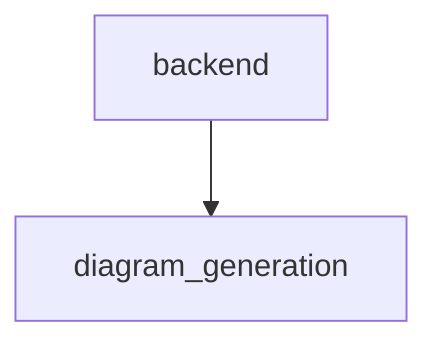
Architecture diagrams could not be generated as no Mermaid syntax was provided in the input.

## 5. Code Analysis
### File: `backend/AST_Schema.py`

#### Function: `path_to_module`
*   **Signature:** `def path_to_module(filepath: str, project_root: str)`
*   **Description:** The function 'path_to_module' converts a file path into a Python module path by computing the relative path from the project root, removing the '.py' extension if present, and replacing directory separators with dots. It handles cases where the filepath is not within the project root by falling back to the basename of the file. If the resulting path ends with '__init__', it removes the trailing part to correctly represent the package structure.
*   **Parameters:**
    - **filepath** (`str`): The absolute or relative path to a Python file.
    - **project_root** (`str`): The root directory of the project used to compute the relative path.
*   **Returns:**
    - **module_path** (`str`): A dot-separated module path derived from the given file path.
*   **Usage:**
    *   **Calls:** This function calls no other functions.
    *   **Called By:** This function is not called by any other functions.

#### Class: `ASTVisitor`
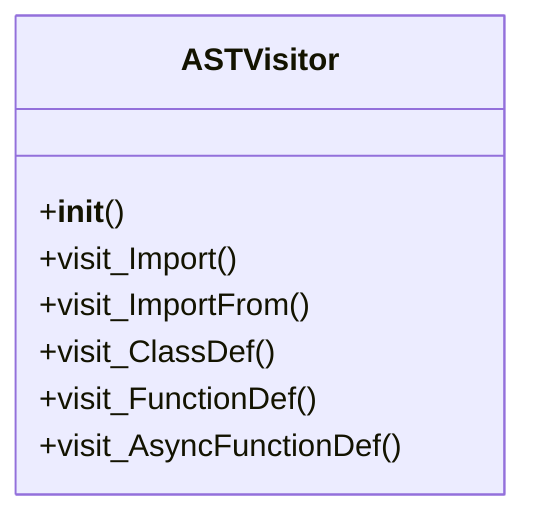
*   **Summary:** The ASTVisitor class is designed to traverse an Abstract Syntax Tree (AST) generated from Python source code. It collects information about imports, classes, and functions, organizing them into a structured schema. The visitor tracks class contexts to associate methods with their respective classes and maintains metadata such as source segments, line numbers, and docstrings.
*   **Instantiation:** This class is not instantiated by any other component according to the provided context.
*   **Dependencies:** This class depends on the backend.AST_Schema.path_to_module function to compute module paths.
*   **Constructor:**
    *   *Description:* Initializes the ASTVisitor with source code, file path, and project root. It computes the module path using a helper function and sets up an initial schema structure to store collected information including imports, functions, and classes. It also initializes a variable to track the current class being visited.
    *   *Parameters:*
        - **source_code** (`str`): The full source code of the file being analyzed.
        - **file_path** (`str`): The file path of the source code being processed.
        - **project_root** (`str`): The root directory of the project to determine module paths.
*   **Methods:**
    *   **`visit_Import`**
        *   *Signature:* `def visit_Import(node)`
        *   *Description:* Handles import nodes in the AST by extracting the names of imported modules and appending them to the schema's imports list. It then continues traversal of the AST node.
        *   *Parameters:*
            - **node** (`ast.Import`): An AST node representing an import statement.
        *   *Returns:*
        *   **Usage:**
            *   **Calls:** This method does not call any other functions directly.
            *   **Called By:** This method is called by the AST traversal mechanism when an import node is encountered.
    *   **`visit_ImportFrom`**
        *   *Signature:* `def visit_ImportFrom(node)`
        *   *Description:* Processes import-from nodes in the AST by extracting module and alias information and appending them to the schema's imports list in a qualified format. It continues traversal of the AST node after processing.
        *   *Parameters:*
            - **node** (`ast.ImportFrom`): An AST node representing an import-from statement.
        *   *Returns:*
        *   **Usage:**
            *   **Calls:** This method does not call any other functions directly.
            *   **Called By:** This method is called by the AST traversal mechanism when an import-from node is encountered.
    *   **`visit_ClassDef`**
        *   *Signature:* `def visit_ClassDef(node)`
        *   *Description:* Handles class definition nodes in the AST by creating a structured representation of the class, including its identifier, name, docstring, source segment, and line numbers. It appends this information to the schema's classes list and tracks it as the current class during traversal.
        *   *Parameters:*
            - **node** (`ast.ClassDef`): An AST node representing a class definition.
        *   *Returns:*
        *   **Usage:**
            *   **Calls:** This method does not call any other functions directly.
            *   **Called By:** This method is called by the AST traversal mechanism when a class definition node is encountered.
    *   **`visit_FunctionDef`**
        *   *Signature:* `def visit_FunctionDef(node)`
        *   *Description:* Processes function definition nodes in the AST. If a class is currently being visited, it associates the function with that class by creating a method context entry. Otherwise, it creates a standalone function entry in the schema. It extracts function metadata such as arguments, docstring, and source segment.
        *   *Parameters:*
            - **node** (`ast.FunctionDef`): An AST node representing a function definition.
        *   *Returns:*
        *   **Usage:**
            *   **Calls:** This method does not call any other functions directly.
            *   **Called By:** This method is called by the AST traversal mechanism when a function definition node is encountered.
    *   **`visit_AsyncFunctionDef`**
        *   *Signature:* `def visit_AsyncFunctionDef(node)`
        *   *Description:* Handles asynchronous function definition nodes by delegating to the standard function definition handler. This ensures that async functions are treated similarly to regular functions in terms of schema collection.
        *   *Parameters:*
            - **node** (`ast.AsyncFunctionDef`): An AST node representing an asynchronous function definition.
        *   *Returns:*
        *   **Usage:**
            *   **Calls:** This method does not call any other functions directly.
            *   **Called By:** This method is called by the AST traversal mechanism when an async function definition node is encountered.

#### Class: `ASTAnalyzer`
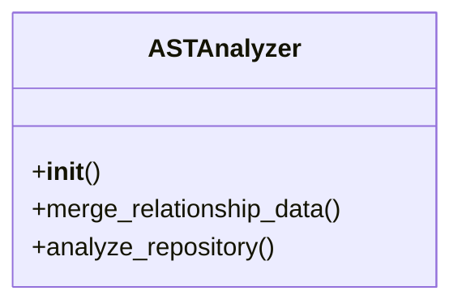
*   **Summary:** The ASTAnalyzer class is responsible for analyzing Python repository files by parsing their Abstract Syntax Trees (ASTs) and building a structured schema representation. It processes files to extract information about imports, functions, classes, and their relationships. The class also merges relationship data such as outgoing calls, incoming calls, and dependencies into the schema. It supports operations like identifying which functions call others, which functions are called by others, and which classes are instantiated by others.
*   **Instantiation:** This class is not instantiated by any other components according to the provided context.
*   **Dependencies:** This class depends on the backend.AST_Schema.ASTVisitor class for AST traversal and schema generation.
*   **Constructor:**
    *   *Description:* The constructor for ASTAnalyzer does not initialize any instance variables and simply passes.
    *   *Parameters:*
*   **Methods:**
    *   **`merge_relationship_data`**
        *   *Signature:* `def merge_relationship_data(full_schema: dict, raw_relationships: dict)`
        *   *Description:* This method takes a full schema and raw relationship data, and enriches the schema with contextual information such as outgoing calls, incoming calls, and dependencies for functions and classes. It iterates over the AST nodes in the schema to update function and class contexts with call-related metadata.
        *   *Parameters:*
            - **full_schema** (`dict`): A dictionary containing the full schema of files and their AST nodes.
            - **raw_relationships** (`dict`): A dictionary containing raw relationship data including outgoing and incoming calls.
        *   *Returns:*
            - **''** (`dict`): The updated full schema with enriched relationship data.
        *   **Usage:**
            *   **Calls:** This method does not directly call other functions or methods.
            *   **Called By:** This method is not called by any other functions or methods according to the provided context.
    *   **`analyze_repository`**
        *   *Signature:* `def analyze_repository(files: list, repo: GitRepository)`
        *   *Description:* This method analyzes a list of files from a Git repository and constructs a schema representation of each file's AST. It parses each Python file, uses an ASTVisitor to traverse the AST and collect schema information, and builds a structured schema including imports, functions, and classes. It handles errors during parsing gracefully by printing warnings.
        *   *Parameters:*
            - **files** (`list`): A list of file objects containing file paths and content.
            - **repo** (`GitRepository`): An object representing the Git repository being analyzed.
        *   *Returns:*
            - **''** (`dict`): A dictionary containing the schema of the analyzed files.
        *   **Usage:**
            *   **Calls:** This method calls the backend.AST_Schema.ASTVisitor class to parse and visit the AST of each file.
            *   **Called By:** This method is not called by any other functions or methods according to the provided context.

### File: `backend/File_Dependency.py`

#### Function: `build_file_dependency_graph`
*   **Signature:** `def build_file_dependency_graph(filename: str, tree: AST, repo_root: str)`
*   **Description:** This function constructs a directed graph representing file dependencies within a codebase. It takes a filename, an abstract syntax tree (AST), and a repository root path as inputs. It uses a custom visitor class to traverse the AST and extract import dependencies. The resulting graph includes nodes for each file and directed edges indicating dependency relationships.
*   **Parameters:**
    - **filename** (`str`): The name of the file being analyzed for dependencies.
    - **tree** (`AST`): The abstract syntax tree representation of the file's source code.
    - **repo_root** (`str`): The root directory path of the repository containing the file.
*   **Returns:**
    - **graph** (`nx.DiGraph`): A NetworkX directed graph where nodes represent files and edges represent import dependencies.
*   **Usage:**
    *   **Calls:** backend.File_Dependency.FileDependencyGraph
    *   **Called By:** This function is not called by any other functions.

#### Function: `build_repository_graph`
   **Sequence diagram for build_repository_graph**
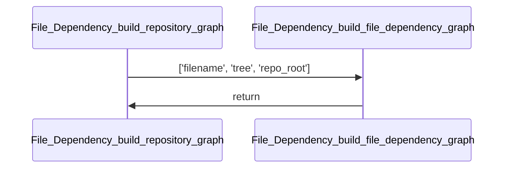
*   **Signature:** `def build_repository_graph(repository: GitRepository)`
*   **Description:** This function constructs a directed graph representing the dependencies between files in a Git repository. It retrieves all files from the repository, filters them to include only Python files or those under the 'backend' directory, and then builds a dependency graph for each file. The individual file graphs are merged into a single global graph that captures the overall dependency structure. Each node in the graph represents a module or component, and edges represent dependency relationships.
*   **Parameters:**
    - **repository** (`GitRepository`): The GitRepository object containing the files to analyze for dependencies.
*   **Returns:**
    - **global_graph** (`nx.DiGraph`): A NetworkX directed graph representing the overall dependency structure of the repository.
*   **Usage:**
    *   **Calls:** backend.File_Dependency.build_file_dependency_graph
    *   **Called By:** This function is not called by any other functions.

#### Function: `get_all_temp_files`
*   **Signature:** `def get_all_temp_files(directory: str)`
*   **Description:** This function retrieves all Python files (.py) from a specified directory and its subdirectories. It resolves the given directory path to an absolute path, then uses recursive globbing to find all .py files. Each found file is converted to a relative path with respect to the root directory. The function returns a list of these relative paths as pathlib.Path objects.
*   **Parameters:**
    - **directory** (`str`): The path to the directory from which to search for Python files.
*   **Returns:**
    - **all_files** (`list[pathlib.Path]`): A list of pathlib.Path objects representing the relative paths of all .py files found in the directory and its subdirectories.
*   **Usage:**
    *   **Calls:** This function calls no other functions.
    *   **Called By:** This function is not called by any other functions.

#### Class: `FileDependencyGraph`
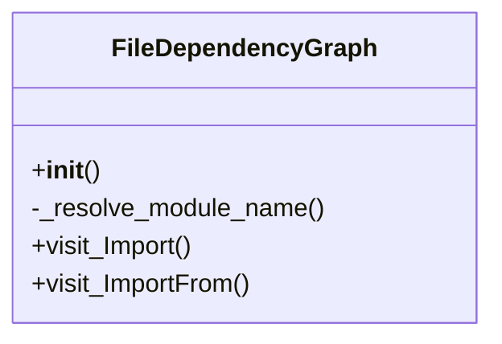
*   **Summary:** The FileDependencyGraph class is designed to analyze and resolve Python import dependencies within a repository. It extends NodeVisitor to traverse AST nodes representing import statements, distinguishing between absolute and relative imports. The class resolves relative imports by identifying candidate files and validating module existence or symbol exports in __init__.py files. It maintains a mapping of import dependencies between files, enabling dependency graph construction.
*   **Instantiation:** This class is not instantiated by any other component within the provided context.
*   **Dependencies:** This class depends on backend.File_Dependency.get_all_temp_files, backend.File_Dependency.init_exports_symbol, and backend.File_Dependency.module_file_exists.
*   **Constructor:**
    *   *Description:* Initializes the FileDependencyGraph with a filename and repository root path. Sets up internal attributes to track the file being analyzed and the root directory of the repository.
    *   *Parameters:*
        - **filename** (`str`): The name of the file being analyzed for dependencies.
        - **repo_root** (`Any`): The root directory path of the repository.
*   **Methods:**
    *   **`_resolve_module_name`**
        *   *Signature:* `def _resolve_module_name(node: ImportFrom)`
        *   *Description:* Resolves relative import statements by analyzing the import node and determining the actual module or symbol names. It identifies candidate files based on the current file's location and resolves relative paths according to the import level. It checks for module existence and symbol exports in __init__.py files to validate the resolution.
        *   *Parameters:*
            - **node** (`ImportFrom`): The AST node representing the import statement to resolve.
        *   *Returns:*
            - **resolved** (`list[str]`): A list of resolved module or symbol names.
        *   **Usage:**
            *   **Calls:** This method calls backend.File_Dependency.get_all_temp_files, backend.File_Dependency.init_exports_symbol, and backend.File_Dependency.module_file_exists.
            *   **Called By:** This method is not called by any other method within the provided context.
    *   **`visit_Import`**
        *   *Signature:* `def visit_Import(node: Import | ImportFrom, base_name: str | None = None)`
        *   *Description:* Handles import statements by adding the imported module names to the import dependencies dictionary. It tracks dependencies for both direct imports and those with base names derived from import statements.
        *   *Parameters:*
            - **node** (`Import | ImportFrom`): The AST node representing the import statement.
            - **base_name** (`str | None`): An optional base name for the imported module.
        *   *Returns:*
        *   **Usage:**
            *   **Calls:** This method does not call any other functions.
            *   **Called By:** This method is not called by any other method within the provided context.
    *   **`visit_ImportFrom`**
        *   *Signature:* `def visit_ImportFrom(node: ImportFrom)`
        *   *Description:* Processes 'from ... import ...' statements by extracting the module name and resolving it. For absolute imports, it uses the last part of the module path. For relative imports, it attempts to resolve them using the _resolve_module_name method.
        *   *Parameters:*
            - **node** (`ImportFrom`): The AST node representing the 'from ... import ...' statement.
        *   *Returns:*
        *   **Usage:**
            *   **Calls:** This method does not call any other functions.
            *   **Called By:** This method is not called by any other method within the provided context.

### File: `backend/HelperLLM.py`

#### Function: `main_orchestrator`
*   **Signature:** `def main_orchestrator()`
*   **Description:** The main_orchestrator function serves as a dummy data and processing loop for testing the LLMHelper class. It defines pre-computed analyses for example functions such as 'add_item', 'check_stock', and 'generate_report'. These analyses are then processed by an LLMHelper instance to generate documentation for these functions. The function simulates a workflow where multiple function inputs are analyzed and aggregated into a final documentation structure.
*   **Parameters:**
*   **Returns:**
*   **Usage:**
    *   **Calls:** backend.HelperLLM.LLMHelper, schemas.types.ClassAnalysisInput, schemas.types.ClassContextInput
    *   **Called By:** This function is not called by any other functions.

#### Class: `LLMHelper`
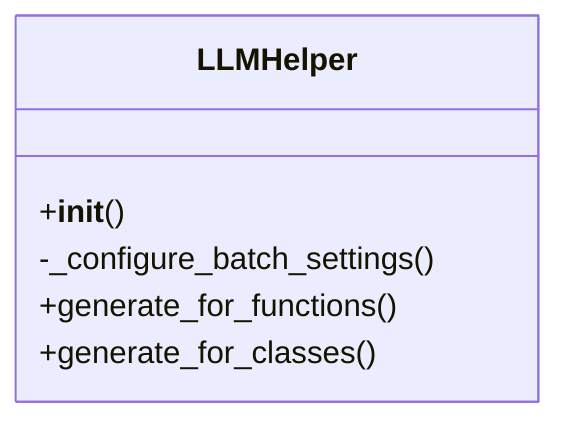
*   **Summary:** The LLMHelper class serves as a centralized interface for interacting with various Large Language Models (LLMs) such as Google Gemini, OpenAI GPT, custom APIs, and Ollama. It handles API configuration, prompt loading, batching, and structured output validation using Pydantic models. The class supports generating documentation for both functions and classes by processing inputs through configured LLMs with appropriate batch sizes and rate-limiting.
*   **Instantiation:** This class is not instantiated by any other components mentioned in the provided context.
*   **Dependencies:** No external dependencies are explicitly listed in the context.
*   **Constructor:**
    *   *Description:* Initializes the LLMHelper with API credentials, prompt file paths, and model configuration. It reads system prompts from specified files, configures batch settings based on the model name, and sets up the appropriate LLM client depending on the model type. It also prepares structured output validators for function and class analysis.
    *   *Parameters:*
        - **api_key** (`str`): API key for authenticating with the LLM provider.
        - **function_prompt_path** (`str`): File path to the system prompt used for function documentation generation.
        - **class_prompt_path** (`str`): File path to the system prompt used for class documentation generation.
        - **model_name** (`str`): Name of the LLM to use, which determines the provider and configuration.
        - **base_url** (`str`): Base URL for custom API endpoints, optional.
*   **Methods:**
    *   **`_configure_batch_settings`**
        *   *Signature:* `def _configure_batch_settings(model_name: str)`
        *   *Description:* Configures the batch size for processing requests based on the specified model name. Different models have different recommended or safe batch sizes to avoid hitting rate limits or exceeding resource constraints.
        *   *Parameters:*
            - **model_name** (`str`): The name of the model for which to configure batch settings.
        *   *Returns:*
        *   **Usage:**
            *   **Calls:** This method does not call any other functions directly.
            *   **Called By:** This method is called by the __init__ method during initialization.
    *   **`generate_for_functions`**
        *   *Signature:* `def generate_for_functions(function_inputs: List[FunctionAnalysisInput])`
        *   *Description:* Processes a batch of function inputs to generate and validate documentation using the configured LLM. It divides the input into batches according to the configured batch size, sends each batch to the LLM, and collects validated results while handling errors gracefully by filling failed items with None.
        *   *Parameters:*
            - **function_inputs** (`List[FunctionAnalysisInput]`): A list of function input models to process for documentation generation.
        *   *Returns:*
            - **result** (`List[Optional[FunctionAnalysis]]`): A list of validated function analysis outputs or None for failed items.
        *   **Usage:**
            *   **Calls:** This method does not call any other functions directly.
            *   **Called By:** This method is not called by any other functions in the provided context.
    *   **`generate_for_classes`**
        *   *Signature:* `def generate_for_classes(class_inputs: List[ClassAnalysisInput])`
        *   *Description:* Processes a batch of class inputs to generate and validate documentation using the configured LLM. Similar to generate_for_functions, it batches inputs, sends them to the LLM, and collects validated results while handling errors by inserting None values for failed items.
        *   *Parameters:*
            - **class_inputs** (`List[ClassAnalysisInput]`): A list of class input models to process for documentation generation.
        *   *Returns:*
            - **result** (`List[Optional[ClassAnalysis]]`): A list of validated class analysis outputs or None for failed items.
        *   **Usage:**
            *   **Calls:** This method does not call any other functions directly.
            *   **Called By:** This method is not called by any other functions in the provided context.

### File: `backend/MainLLM.py`

#### Class: `MainLLM`
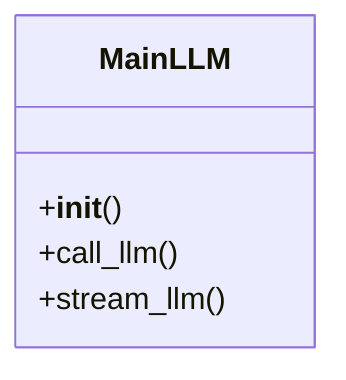
*   **Summary:** The MainLLM class serves as the central interface for interacting with various language learning models (LLMs). It initializes different LLM clients based on the specified model name, supporting Google Generative AI, custom OpenAI-compatible APIs, and local Ollama models. The class provides two primary methods for interacting with the LLM: one for synchronous calls that return the full response content, and another for streaming responses incrementally.
*   **Instantiation:** This class is not instantiated by any other components according to the provided context.
*   **Dependencies:** This class depends on several external libraries including langchain_google_genai.ChatGoogleGenerativeAI, langchain_ollama.ChatOllama, langchain_openai.ChatOpenAI, and langchain_core.messages.HumanMessage and SystemMessage.
*   **Constructor:**
    *   *Description:* Initializes the MainLLM instance by loading a system prompt from a file and setting up an appropriate LLM client based on the model name. It supports multiple LLM providers including Google Generative AI, custom OpenAI-compatible APIs, and Ollama-based models.
    *   *Parameters:*
        - **api_key** (`str`): API key for authenticating with the LLM provider.
        - **prompt_file_path** (`str`): Path to the file containing the system prompt.
        - **model_name** (`str`): Name of the model to use. Defaults to 'gemini-2.5-pro'.
        - **base_url** (`str`): Base URL for the LLM endpoint. Optional, defaults to OLLAMA_BASE_URL.
*   **Methods:**
    *   **`call_llm`**
        *   *Signature:* `def call_llm(user_input: str)`
        *   *Description:* Sends a user input message to the configured LLM and returns the complete response content. It constructs a message sequence including the system prompt and user input, invokes the LLM with these messages, and handles potential exceptions during the call.
        *   *Parameters:*
            - **user_input** (`str`): The input text to send to the LLM.
        *   *Returns:*
            - **response_content** (`str`): The content of the LLM's response, or None if an error occurs.
        *   **Usage:**
            *   **Calls:** This method does not call any other methods within the class.
            *   **Called By:** This method is not called by any other methods within the class.
    *   **`stream_llm`**
        *   *Signature:* `def stream_llm(user_input: str)`
        *   *Description:* Streams the response from the LLM incrementally as chunks of content. It constructs a message sequence including the system prompt and user input, initiates a streaming request to the LLM, and yields each chunk of content as it becomes available. In case of errors, it yields an error message instead.
        *   *Parameters:*
            - **user_input** (`str`): The input text to send to the LLM.
        *   *Returns:*
            - **chunk_content** (`str`): Yields content chunks from the LLM response or an error message.
        *   **Usage:**
            *   **Calls:** This method does not call any other methods within the class.
            *   **Called By:** This method is not called by any other methods within the class.

### File: `backend/basic_info.py`

#### Class: `ProjektInfoExtractor`
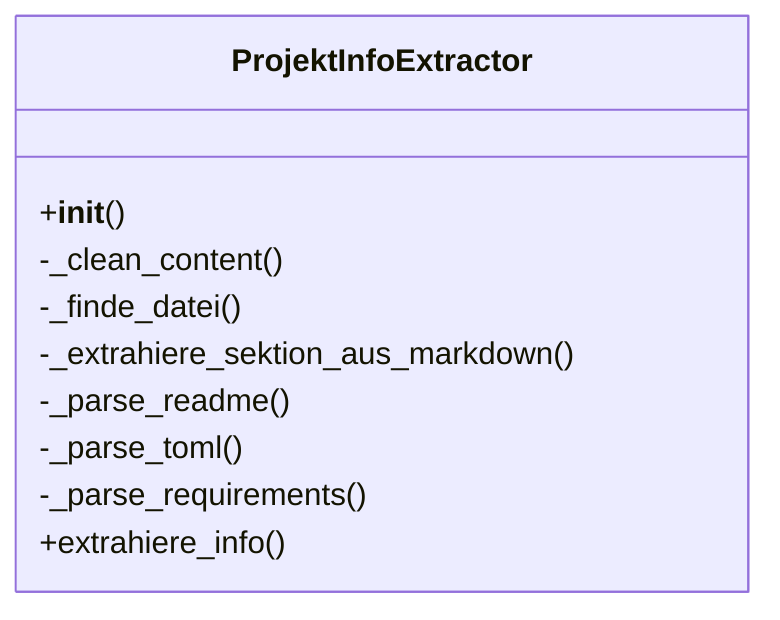
*   **Summary:** The ProjektInfoExtractor class is designed to extract basic project information from common project files such as README.md, pyproject.toml, and requirements.txt. It initializes with a structured dictionary to hold extracted data and provides methods to parse different file types, clean content, find relevant files, and extract specific sections from markdown files. The class orchestrates the extraction process by determining which files are present and parsing them in a prioritized order to fill in project details like title, description, features, technology stack, and installation instructions.
*   **Instantiation:** This class is instantiated by other parts of the backend system that require basic project information extraction functionality.
*   **Dependencies:** This class depends on standard library modules such as re, os, and tomllib, as well as typing annotations from typing module.
*   **Constructor:**
    *   *Description:* Initializes the ProjektInfoExtractor with a predefined structure for storing project information. It sets up placeholder values for various project details and defines a constant for indicating missing information.
    *   *Parameters:*
*   **Methods:**
    *   **`_clean_content`**
        *   *Signature:* `def _clean_content(content: str)`
        *   *Description:* This method removes null bytes from the given string content, which can occur due to encoding errors when reading files in UTF-16 format but interpreted as UTF-8. It ensures that the content is clean before further processing.
        *   *Parameters:*
            - **content** (`str`): The input string content that may contain null bytes.
        *   *Returns:*
            - **''** (`str`): The cleaned string with null bytes removed.
        *   **Usage:**
            *   **Calls:** No external functions are called by this method.
            *   **Called By:** This method is called by other internal methods such as `_parse_readme`, `_parse_toml`, and `_parse_requirements` to sanitize input content before processing.
    *   **`_finde_datei`**
        *   *Signature:* `def _finde_datei(patterns: List[str], dateien: List[Any])`
        *   *Description:* This method searches through a list of files to find one that matches any of the specified file patterns, ignoring case differences. It returns the first matching file or None if no match is found.
        *   *Parameters:*
            - **patterns** (`List[str]`): A list of file extension patterns to search for.
            - **dateien** (`List[Any]`): A list of file objects to search through.
        *   *Returns:*
            - **''** (`Optional[Any]`): The first matching file object or None if no match is found.
        *   **Usage:**
            *   **Calls:** No external functions are called by this method.
            *   **Called By:** This method is called by the `extrahiere_info` method to locate relevant project files such as README, pyproject.toml, and requirements.txt.
    *   **`_extrahiere_sektion_aus_markdown`**
        *   *Signature:* `def _extrahiere_sektion_aus_markdown(inhalt: str, keywords: List[str])`
        *   *Description:* This method extracts text from a markdown document that appears under a specific heading (indicated by ##). It uses regular expressions to find the section associated with the given keywords and returns the content between the heading and the next heading or end of the document.
        *   *Parameters:*
            - **inhalt** (`str`): The markdown content to extract from.
            - **keywords** (`List[str]`): A list of keywords to look for as headings.
        *   *Returns:*
            - **''** (`Optional[str]`): The extracted text under the specified heading or None if no match is found.
        *   **Usage:**
            *   **Calls:** No external functions are called by this method.
            *   **Called By:** This method is called by the `_parse_readme` method to extract sections like Features, Tech Stack, Status, Installation, and Quick Start from README files.
    *   **`_parse_readme`**
        *   *Signature:* `def _parse_readme(inhalt: str)`
        *   *Description:* This method parses the content of a README file to extract key project information such as title, description, key features, technology stack, current status, setup instructions, and quick start guide. It uses helper methods to clean content and extract sections from markdown.
        *   *Parameters:*
            - **inhalt** (`str`): The content of the README file to parse.
        *   *Returns:*
        *   **Usage:**
            *   **Calls:** Calls `_clean_content` to sanitize input and `_extrahiere_sektion_aus_markdown` to extract specific sections from the markdown content.
            *   **Called By:** This method is called by the `extrahiere_info` method during the extraction process.
    *   **`_parse_toml`**
        *   *Signature:* `def _parse_toml(inhalt: str)`
        *   *Description:* This method parses the content of a pyproject.toml file to extract project metadata such as name, description, and dependencies. It handles potential TOML decoding errors gracefully and only processes the file if the required library is available.
        *   *Parameters:*
            - **inhalt** (`str`): The content of the pyproject.toml file to parse.
        *   *Returns:*
        *   **Usage:**
            *   **Calls:** Calls `_clean_content` to sanitize input and attempts to use `tomllib` to decode the TOML content.
            *   **Called By:** This method is called by the `extrahiere_info` method during the extraction process.
    *   **`_parse_requirements`**
        *   *Signature:* `def _parse_requirements(inhalt: str)`
        *   *Description:* This method parses the content of a requirements.txt file to extract dependency information. It filters out comments and empty lines, and only populates dependencies if they haven't already been set from a TOML file.
        *   *Parameters:*
            - **inhalt** (`str`): The content of the requirements.txt file to parse.
        *   *Returns:*
        *   **Usage:**
            *   **Calls:** Calls `_clean_content` to sanitize input.
            *   **Called By:** This method is called by the `extrahiere_info` method during the extraction process.
    *   **`extrahiere_info`**
        *   *Signature:* `def extrahiere_info(dateien: List[Any], repo_url: str)`
        *   *Description:* This method orchestrates the entire information extraction process. It identifies relevant project files, parses them in a prioritized order (pyproject.toml first, then requirements.txt, then README), formats dependencies, and fills in default titles based on repository URLs if necessary.
        *   *Parameters:*
            - **dateien** (`List[Any]`): A list of file objects representing project files.
            - **repo_url** (`str`): The URL of the repository, used to derive a default project title if needed.
        *   *Returns:*
            - **''** (`Dict[str, Any]`): A dictionary containing the extracted project information.
        *   **Usage:**
            *   **Calls:** Calls `_finde_datei` to locate relevant files, and then calls `_parse_toml`, `_parse_requirements`, and `_parse_readme` to process those files. Also calls `_clean_content` and performs formatting operations on dependencies.
            *   **Called By:** This method is the main interface for extracting project information and is likely called by higher-level components in the application.

### File: `backend/callgraph.py`

#### Function: `build_callGraph`
*   **Signature:** `def build_callGraph(tree: ast.AST, filename: str)`
*   **Description:** This function constructs a call graph from an Abstract Syntax Tree (AST) by utilizing a custom CallGraph visitor. It processes the AST to extract function call relationships and builds a NetworkX directed graph representing these relationships. The function filters the graph to only include nodes and edges corresponding to functions defined within the same file. It returns the resulting directed graph.
*   **Parameters:**
    - **tree** (`ast.AST`): The abstract syntax tree of the source code to analyze.
    - **filename** (`str`): The name of the file being analyzed, used for context in the call graph.
*   **Returns:**
    - **graph** (`nx.DiGraph`): A NetworkX directed graph representing the call relationships between functions in the provided AST.
*   **Usage:**
    *   **Calls:** backend.callgraph.CallGraph
    *   **Called By:** This function is not called by any other functions.

#### Function: `make_safe_dot`
*   **Signature:** `def make_safe_dot(graph: nx.DiGraph, out_path: str)`
*   **Description:** The function 'make_safe_dot' takes a NetworkX directed graph and a file path as inputs. It creates a safe version of the graph by relabeling all nodes with simplified identifiers (e.g., 'n0', 'n1') while preserving the original node labels as attributes. Finally, it writes the transformed graph to a file in DOT format. This process ensures that node names are sanitized for compatibility with graph visualization tools.
*   **Parameters:**
    - **graph** (`nx.DiGraph`): A NetworkX directed graph to be processed and saved.
    - **out_path** (`str`): The file path where the DOT representation of the graph will be written.
*   **Returns:**
*   **Usage:**
    *   **Calls:** This function calls no other functions.
    *   **Called By:** This function is not called by any other functions.

#### Function: `build_filtered_callgraph`
*   **Signature:** `def build_filtered_callgraph(repo: GitRepository)`
*   **Description:** The function builds a filtered call graph from a Git repository by parsing Python files and extracting function call relationships. It first collects all Python files and their Abstract Syntax Trees (ASTs), then uses a custom CallGraph visitor to identify functions and edges. The resulting global call graph is filtered to only include edges between functions that are considered 'own' (i.e., written by the project's developers).
*   **Parameters:**
    - **repo** (`GitRepository`): The Git repository object containing the files to analyze.
*   **Returns:**
    - **global_graph** (`nx.DiGraph`): A directed graph representing the filtered call graph of functions defined in the repository.
*   **Usage:**
    *   **Calls:** backend.callgraph.CallGraph
    *   **Called By:** This function is not called by any other functions.

#### Class: `CallGraph`
*   **Summary:** The CallGraph class is an AST visitor designed to analyze Python source code and construct a call graph representation. It tracks function and method definitions, imports, and function calls to build a directed graph showing relationships between different callable entities. The class maintains internal state such as current function and class contexts, local definitions, and import mappings to resolve names correctly. It leverages the networkx library to represent the call graph as a directed graph and stores edges representing function call relationships.
*   **Instantiation:** This class is instantiated by code that needs to analyze Python files for call graph generation.
*   **Dependencies:** This class depends on the ast module for parsing Python code, networkx for graph operations, pathlib.Path for path handling, and getRepo.GitRepository for repository-related functionality.
*   **Constructor:**
    *   *Description:* Initializes the CallGraph with a filename and sets up internal data structures including tracking for current function and class, local definitions, a networkx directed graph, import mappings, a set of function names, and a dictionary of edges.
    *   *Parameters:*
        - **filename** (`str`): The name of the file being analyzed for call graph construction.
*   **Methods:**
    *   **`_recursive_call`**
        *   *Signature:* `def _recursive_call(node)`
        *   *Description:* Recursively traverses an AST node to extract the dotted name components of a function or attribute access. It handles different types of AST nodes like Call, Name, and Attribute to reconstruct a path from nested accesses.
        *   *Parameters:*
            - **node** (`ast.AST`): The AST node to traverse for extracting name components.
        *   *Returns:*
            - **parts** (`list[str]`): A list of strings representing the dotted name components.
        *   **Usage:**
            *   **Calls:** This method does not call any other methods internally.
            *   **Called By:** This method is called by the _resolve_all_callee_names method.
    *   **`_resolve_all_callee_names`**
        *   *Signature:* `def _resolve_all_callee_names(callee_nodes: list[list[str]])`
        *   *Description:* Resolves a list of dotted name components into fully qualified names based on local definitions, import mappings, and current class context. It checks for local definitions first, then import mappings, and finally constructs full names using the filename and class context.
        *   *Parameters:*
            - **callee_nodes** (`list[list[str]]`): A list of lists containing name components for potential callees.
        *   *Returns:*
            - **resolved** (`list[str]`): A list of fully qualified names for the callees.
        *   **Usage:**
            *   **Calls:** This method calls the _recursive_call method to extract name components.
            *   **Called By:** This method is called by the visit_Call method.
    *   **`_make_full_name`**
        *   *Signature:* `def _make_full_name(basename: str, class_name: str | None = None)`
        *   *Description:* Constructs a fully qualified name for a function or method using the filename, optional class name, and base name. This helps in creating unique identifiers for functions within their scope.
        *   *Parameters:*
            - **basename** (`str`): The base name of the function or method.
            - **class_name** (`Optional[str]`): The name of the class if the function is a method.
        *   *Returns:*
            - **full_name** (`str`): The fully qualified name constructed from filename, class name, and basename.
        *   **Usage:**
            *   **Calls:** This method does not call any other methods internally.
            *   **Called By:** This method is called by the visit_FunctionDef method.
    *   **`_current_caller`**
        *   *Signature:* `def _current_caller()`
        *   *Description:* Determines the current caller's name based on whether there is an active function context. If a function is currently being visited, it returns the function name; otherwise, it returns a generic scope identifier.
        *   *Parameters:*
        *   *Returns:*
            - **caller** (`str`): The name of the current caller or a generic scope identifier.
        *   **Usage:**
            *   **Calls:** This method does not call any other methods internally.
            *   **Called By:** This method is called by the visit_Call method.
    *   **`visit_Import`**
        *   *Signature:* `def visit_Import(node)`
        *   *Description:* Handles import statements in the AST by mapping aliases to their actual module names. This allows the class to resolve imported names correctly when building the call graph.
        *   *Parameters:*
            - **node** (`ast.Import`): The AST node representing an import statement.
        *   *Returns:*
        *   **Usage:**
            *   **Calls:** This method calls the generic_visit method to continue traversal.
            *   **Called By:** This method is called by the AST visitor framework.
    *   **`visit_ImportFrom`**
        *   *Signature:* `def visit_ImportFrom(node)`
        *   *Description:* Handles 'from ... import ...' statements by mapping imported names to their respective modules. It processes aliases and constructs appropriate mappings for later resolution during call analysis.
        *   *Parameters:*
            - **node** (`ast.ImportFrom`): The AST node representing a 'from ... import ...' statement.
        *   *Returns:*
        *   **Usage:**
            *   **Calls:** This method does not call any other methods internally.
            *   **Called By:** This method is called by the AST visitor framework.
    *   **`visit_ClassDef`**
        *   *Signature:* `def visit_ClassDef(node: ast.ClassDef)`
        *   *Description:* Processes class definitions by temporarily setting the current class context before visiting the class body. After processing, it restores the previous class context to maintain proper scoping.
        *   *Parameters:*
            - **node** (`ast.ClassDef`): The AST node representing a class definition.
        *   *Returns:*
        *   **Usage:**
            *   **Calls:** This method calls the generic_visit method to continue traversal.
            *   **Called By:** This method is called by the AST visitor framework.
    *   **`visit_FunctionDef`**
        *   *Signature:* `def visit_FunctionDef(node)`
        *   *Description:* Processes function definitions by recording local definitions, updating the current function context, adding the function to the graph, and marking it in the function set. It ensures that functions are uniquely identified within their scope.
        *   *Parameters:*
            - **node** (`ast.FunctionDef`): The AST node representing a function definition.
        *   *Returns:*
        *   **Usage:**
            *   **Calls:** This method calls the _make_full_name and generic_visit methods.
            *   **Called By:** This method is called by the AST visitor framework.
    *   **`visit_AsyncFunctionDef`**
        *   *Signature:* `def visit_AsyncFunctionDef(node)`
        *   *Description:* Handles asynchronous function definitions by delegating to the standard function definition handler. This ensures that async functions are treated similarly to regular functions in terms of call graph construction.
        *   *Parameters:*
            - **node** (`ast.AsyncFunctionDef`): The AST node representing an async function definition.
        *   *Returns:*
        *   **Usage:**
            *   **Calls:** This method calls the visit_FunctionDef method.
            *   **Called By:** This method is called by the AST visitor framework.
    *   **`visit_Call`**
        *   *Signature:* `def visit_Call(node)`
        *   *Description:* Analyzes function calls by determining the caller, resolving the callee names, and adding edges to the graph. It manages the edge collection for later use in constructing the call graph.
        *   *Parameters:*
            - **node** (`ast.Call`): The AST node representing a function call.
        *   *Returns:*
        *   **Usage:**
            *   **Calls:** This method calls the _current_caller, _recursive_call, and _resolve_all_callee_names methods.
            *   **Called By:** This method is called by the AST visitor framework.
    *   **`visit_If`**
        *   *Signature:* `def visit_If(node)`
        *   *Description:* Handles conditional statements that check for '__name__ == \"__main__\"'. In such cases, it temporarily changes the current function context to '<main_block>' to correctly associate code blocks with the main execution context.
        *   *Parameters:*
            - **node** (`ast.If`): The AST node representing an if statement.
        *   *Returns:*
        *   **Usage:**
            *   **Calls:** This method calls the generic_visit method to continue traversal.
            *   **Called By:** This method is called by the AST visitor framework.

### File: `backend/converter.py`

#### Function: `wrap_cdata`
*   **Signature:** `def wrap_cdata(content)`
*   **Description:** The function 'wrap_cdata' takes a string input named 'content' and wraps it with CDATA tags, which are commonly used in XML to preserve special characters and prevent them from being interpreted as markup. The function returns a formatted string that includes the original content enclosed within the CDATA section delimiters. This is useful when generating XML content where the data might contain characters that would otherwise break the XML syntax.
*   **Parameters:**
    - **content** (`str`): The string content that needs to be wrapped in CDATA tags.
*   **Returns:**
    - **wrapped_content** (`str`): A string that contains the original content wrapped in CDATA tags.
*   **Usage:**
    *   **Calls:** This function calls no other functions.
    *   **Called By:** This function is not called by any other functions.

#### Function: `extract_output_content`
   **Sequence diagram for extract_output_content**
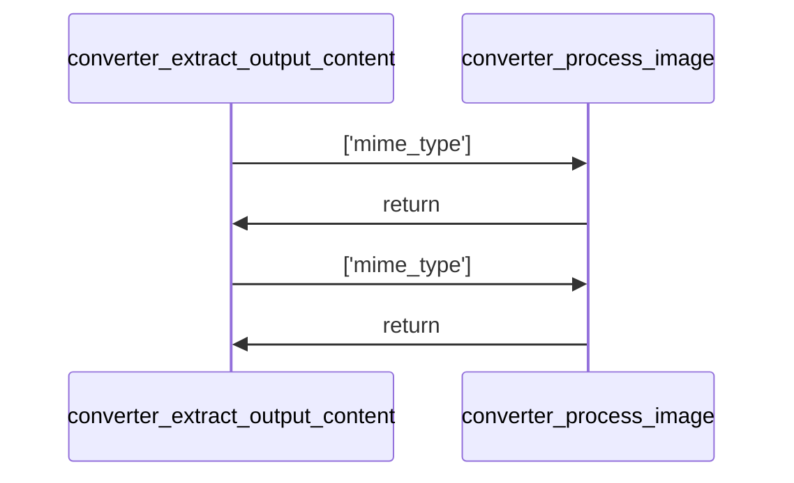
*   **Signature:** `def extract_output_content(outputs, image_list)`
*   **Description:** The function extracts content from notebook outputs, handling both text and image data. It processes outputs of different types such as display_data, execute_result, stream, and error, returning a list of text snippets or image placeholders. For images, it decodes Base64-encoded data and appends it to an image list while generating a placeholder XML string. Text content is directly appended to the result list.
*   **Parameters:**
    - **outputs** (`Any`): A collection of notebook output objects containing various types of data including text, images, streams, or errors.
    - **image_list** (`List[Dict[str, Any]]`): A mutable list that accumulates decoded image data along with metadata such as MIME type.
*   **Returns:**
    - **extracted_xml_snippets** (`List[str]`): A list of strings representing either plain text content or XML placeholders for images derived from the notebook outputs.
*   **Usage:**
    *   **Calls:** This function calls backend.converter.process_image.
    *   **Called By:** This function is not called by any other functions.

#### Function: `process_image`
*   **Signature:** `def process_image(mime_type)`
*   **Description:** The function processes an image based on its MIME type by checking if the MIME type exists in a data dictionary. If found, it decodes the base64 string, appends the image data to a global list, and returns an XML placeholder string with the image index and MIME type. If any error occurs during processing, it returns an error message. If the MIME type is not found in the data, it returns None.
*   **Parameters:**
    - **mime_type** (`str`): The MIME type of the image to be processed.
*   **Returns:**
    - **return_value** (`str or None`): Returns an XML placeholder string with image details if successful, an error message if decoding fails, or None if the MIME type is not found in the data.
*   **Usage:**
    *   **Calls:** This function calls no other functions.
    *   **Called By:** This function is not called by any other functions.

#### Function: `convert_notebook_to_xml`
   **Sequence diagram for convert_notebook_to_xml**
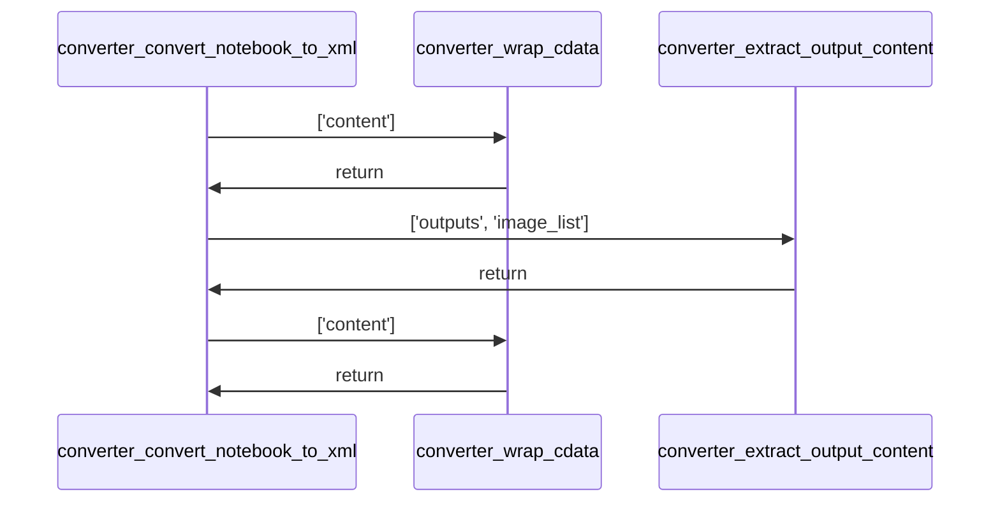
*   **Signature:** `def convert_notebook_to_xml(file_content)`
*   **Description:** The function converts a Jupyter notebook, represented as a string of JSON content, into an XML format. It parses the notebook using nbformat, iterates through each cell, and transforms markdown and code cells into XML elements. For code cells, it also extracts and includes output content if present. The function returns the constructed XML string along with a list of extracted images.
*   **Parameters:**
    - **file_content** (`str`): A string containing the raw JSON content of a Jupyter notebook.
*   **Returns:**
    - **xml_output** (`str`): A string representing the XML-formatted content of the notebook cells.
    - **extracted_images** (`list`): A list of extracted image data or identifiers from the notebook.
*   **Usage:**
    *   **Calls:** backend.converter.extract_output_content, backend.converter.wrap_cdata
    *   **Called By:** This function is not called by any other functions.

#### Function: `process_repo_notebooks`
   **Sequence diagram for process_repo_notebooks**
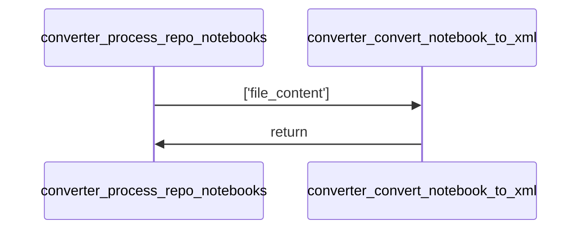
*   **Signature:** `def process_repo_notebooks(repo_files)`
*   **Description:** This function processes a list of repository files to identify and convert Jupyter notebook files (.ipynb) into XML format along with associated images. It iterates through the notebook files, logs the processing status, and returns a dictionary mapping each notebook file path to its converted XML content and image data.
*   **Parameters:**
    - **repo_files** (`List[File]`): A list of file objects representing files in a repository, each expected to have a 'path' attribute and a 'content' attribute.
*   **Returns:**
    - **results** (`Dict[str, Dict[str, Any]]`): A dictionary where keys are the paths of notebook files and values are dictionaries containing 'xml' and 'images' keys with their respective conversion outputs.
*   **Usage:**
    *   **Calls:** This function calls backend.converter.convert_notebook_to_xml.
    *   **Called By:** This function is not called by any other functions.

### File: `backend/diagram_generation/call_resolver.py`

#### Class: `CallResolver`
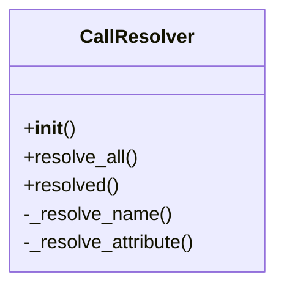
*   **Summary:** The CallResolver class is responsible for resolving raw function calls into their resolved counterparts by analyzing the call context and mapping them to actual function definitions or methods. It operates on a project index to determine which functions or methods are called and resolves these calls based on different types such as direct calls, imported functions, method calls, and dynamic lookups. The class supports various resolution strategies depending on whether the call is made to a local function, an imported function, or a method of a class.
*   **Instantiation:** No instantiation locations are specified.
*   **Dependencies:** This class depends on several data types including CallType, RawCall, ResolvedCall, and ProjectIndex, which are imported from diagram_generation.data_types and are essential for its functionality.
*   **Constructor:**
    *   *Description:* Initializes the CallResolver with a project index, which is used to resolve function calls against known modules and their contents.
    *   *Parameters:*
        - **project** (`ProjectIndex`): An index of the project containing modules, functions, and imports to be used for resolving calls.
*   **Methods:**
    *   **`resolve_all`**
        *   *Signature:* `def resolve_all(calls: dict[str, list[RawCall]])`
        *   *Description:* Processes a dictionary of raw calls grouped by module and resolves each call into a list of resolved calls. It iterates over the provided calls and extends the resolved list for each module with the results of resolving individual calls.
        *   *Parameters:*
            - **calls** (`dict[str, list[RawCall]]`): A dictionary mapping module names to lists of raw calls to be resolved.
        *   *Returns:*
            - **resolved** (`dict[str, list[ResolvedCall]]`): A dictionary mapping module names to lists of resolved calls.
        *   **Usage:**
            *   **Calls:** This method does not explicitly call any other methods within the class.
            *   **Called By:** This method is not called by any other methods according to the provided context.
    *   **`resolved`**
        *   *Signature:* `def resolved(call: RawCall)`
        *   *Description:* Resolves a single raw call by determining the type of function call (name or attribute) and delegating to appropriate resolution methods. If the call cannot be resolved, it returns a resolved call with an unknown type.
        *   *Parameters:*
            - **call** (`RawCall`): The raw call to be resolved.
        *   *Returns:*
            - **resolved_calls** (`list[ResolvedCall]`): A list of resolved calls derived from the raw call.
        *   **Usage:**
            *   **Calls:** This method calls internal helper methods _resolve_name and _resolve_attribute based on the type of the function node.
            *   **Called By:** This method is not called by any other methods according to the provided context.
    *   **`_resolve_name`**
        *   *Signature:* `def _resolve_name(call: RawCall, node: ast.Name)`
        *   *Description:* Resolves a raw call when the function node is an ast.Name, checking if the name corresponds to a local function or an imported function. If found, it creates a resolved call with the appropriate call type; otherwise, it returns an unknown call type.
        *   *Parameters:*
            - **call** (`RawCall`): The raw call being resolved.
            - **node** (`ast.Name`): The AST node representing the function name.
        *   *Returns:*
            - **resolved_calls** (`list[ResolvedCall]`): A list of resolved calls derived from the name-based call.
        *   **Usage:**
            *   **Calls:** This method does not explicitly call any other methods within the class.
            *   **Called By:** This method is called by the resolved method based on the type of the function node.
    *   **`_resolve_attribute`**
        *   *Signature:* `def _resolve_attribute(call: RawCall, node: ast.Attribute)`
        *   *Description:* Resolves a raw call when the function node is an ast.Attribute, handling cases like method calls on 'self' or calls to imported modules. It attempts to find matching methods or functions in classes or modules and returns resolved calls accordingly, falling back to dynamic or unknown resolutions if necessary.
        *   *Parameters:*
            - **call** (`RawCall`): The raw call being resolved.
            - **node** (`ast.Attribute`): The AST node representing the attribute-based function call.
        *   *Returns:*
            - **resolved_calls** (`list[ResolvedCall]`): A list of resolved calls derived from the attribute-based call.
        *   **Usage:**
            *   **Calls:** This method does not explicitly call any other methods within the class.
            *   **Called By:** This method is called by the resolved method based on the type of the function node.

### File: `backend/diagram_generation/callgraph.py`

#### Class: `TreeVisitor`
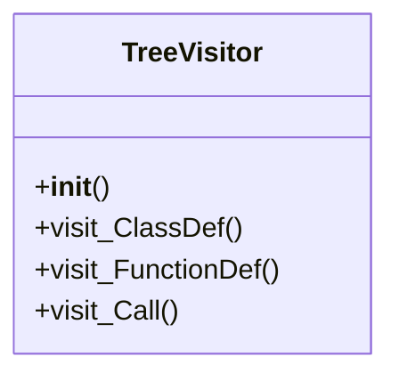
*   **Summary:** The TreeVisitor class is designed to traverse an Abstract Syntax Tree (AST) and collect call relationships between functions and methods within a Python project. It extends NodeVisitor to customize traversal behavior for ClassDef, FunctionDef, and Call nodes. During traversal, it tracks the current function and class being processed, enabling accurate attribution of calls to their respective contexts. The collected call information is stored in a list of RawCall objects, which can later be used to generate call graphs.
*   **Instantiation:** No instantiation locations are specified.
*   **Dependencies:** No external dependencies are explicitly listed.
*   **Constructor:**
    *   *Description:* Initializes the TreeVisitor with a module symbol and a project index. It sets up tracking variables for the current function and class during AST traversal, and initializes an empty list to store call relationships.
    *   *Parameters:*
        - **module** (`ModuleSymbol`): Represents the module being analyzed.
        - **project** (`ProjectIndex`): Provides access to the entire project's symbol table.
*   **Methods:**
    *   **`visit_ClassDef`**
        *   *Signature:* `def visit_ClassDef(node: ClassDef)`
        *   *Description:* Handles the traversal of class definitions in the AST. It temporarily updates the current class being visited, processes the class node recursively, and then restores the previous class context.
        *   *Parameters:*
            - **node** (`ClassDef`): The AST node representing the class definition.
        *   *Returns:*
        *   **Usage:**
            *   **Calls:** This method does not explicitly call other functions directly.
            *   **Called By:** This method is called by the generic AST visitor when encountering a ClassDef node.
    *   **`visit_FunctionDef`**
        *   *Signature:* `def visit_FunctionDef(node: FunctionDef)`
        *   *Description:* Handles the traversal of function definitions in the AST. It determines whether the function belongs to a class or is a top-level function, updates the current function context accordingly, processes the function node recursively, and then restores the previous function context.
        *   *Parameters:*
            - **node** (`FunctionDef`): The AST node representing the function definition.
        *   *Returns:*
        *   **Usage:**
            *   **Calls:** This method does not explicitly call other functions directly.
            *   **Called By:** This method is called by the generic AST visitor when encountering a FunctionDef node.
    *   **`visit_Call`**
        *   *Signature:* `def visit_Call(node)`
        *   *Description:* Processes call expressions in the AST. It checks if the current function context is available and validates the called function or method. If valid, it creates a RawCall object with contextual information and appends it to the internal calls list.
        *   *Parameters:*
            - **node** (`Call`): The AST node representing the function call.
        *   *Returns:*
        *   **Usage:**
            *   **Calls:** This method calls generic_visit to continue traversing the AST subtree and constructs a RawCall object with associated context.
            *   **Called By:** This method is called by the generic AST visitor when encountering a Call node.

### File: `backend/diagram_generation/data_types.py`

#### Class: `FunctionSymbol`
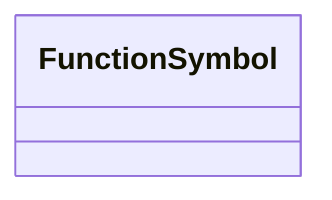
*   **Summary:** The FunctionSymbol class is a data structure designed to represent a function symbol within a diagram generation system. It encapsulates essential metadata about a function, including its name, module, qualified name, whether it is asynchronous, input parameters, return type indicator, and line number. This class serves as a lightweight container for function-related information, facilitating the construction and visualization of diagrams that depict function relationships and structures.
*   **Instantiation:** This class is not instantiated by any other components as per the provided context.
*   **Dependencies:** This class does not depend on any external modules or libraries beyond standard Python typing and dataclass utilities.
*   **Constructor:**
    *   *Description:* The class does not define an explicit __init__ method, relying instead on default initialization behavior for its attributes.
    *   *Parameters:*

#### Class: `ClassSymbol`
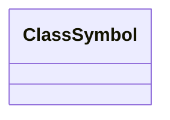
*   **Summary:** The ClassSymbol class represents a symbolic representation of a class within a diagram generation system. It encapsulates essential metadata about a class, including its name, module of origin, and a collection of its methods represented as FunctionSymbol objects. This class serves as a data structure for organizing and storing information related to classes during the diagram generation process.
*   **Instantiation:** This class is not explicitly instantiated by any other component mentioned in the provided context.
*   **Dependencies:** This class depends on external modules such as ast.expr, dataclasses.dataclass, enum.Enum, and typing.Optional, which are likely used for type hinting and data structure definitions.
*   **Constructor:**
    *   *Description:* The ClassSymbol class does not define an explicit __init__ method, relying on default initialization behavior. It uses type annotations to define its attributes but does not perform any initialization logic.
    *   *Parameters:*

#### Class: `ModuleSymbol`
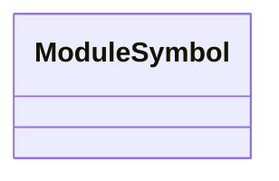
*   **Summary:** The ModuleSymbol class represents a module in a Python codebase, encapsulating metadata about the module such as its name, the packages it belongs to, and the functions and classes it contains. It also tracks the module's imports. This class serves as a data structure for organizing and representing module-level information during diagram generation.
*   **Instantiation:** This class is not instantiated by any other component based on the provided context.
*   **Dependencies:** This class does not depend on any external modules or libraries beyond standard Python typing and dataclass features.
*   **Constructor:**
    *   *Description:* The constructor for ModuleSymbol does not explicitly define any parameters. It relies on class variables declared at the class level to initialize the module's attributes.
    *   *Parameters:*

#### Class: `CallContext`
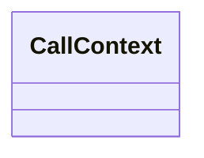
*   **Summary:** The CallContext class is a data structure designed to hold symbolic references to a module, function, and optionally a class. It serves as a container for contextual information related to code elements during diagram generation, particularly focusing on the relationships between modules, functions, and classes.
*   **Instantiation:** This class is not explicitly instantiated by any other component according to the provided context.
*   **Dependencies:** This class depends on symbols such as ModuleSymbol, FunctionSymbol, and ClassSymbol, which are likely defined elsewhere in the codebase.
*   **Constructor:**
    *   *Description:* The CallContext class does not define an explicit __init__ method. Instead, it relies on default initialization behavior for its attributes, which are type-hinted but not assigned values in the constructor.
    *   *Parameters:*

#### Class: `RawCall`
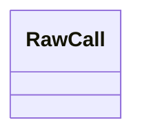
*   **Summary:** The RawCall class is a data structure designed to represent a function call within a codebase, capturing essential metadata such as the caller, the function node, line number, and context. It serves as a simplified representation of a call site, likely used during diagram generation processes to track and analyze inter-function relationships.
*   **Instantiation:** This class is not instantiated by any other component as per the provided context.
*   **Dependencies:** This class depends on no external modules beyond standard library imports such as ast.expr, dataclasses.dataclass, enum.Enum, and typing.Optional.
*   **Constructor:**
    *   *Description:* The class does not define an explicit __init__ method, relying instead on dataclass-style initialization based on the declared attributes.
    *   *Parameters:*

#### Class: `CallType`
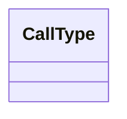
*   **Summary:** The CallType class is an enumeration that defines various types of method calls within a codebase. It provides a standardized way to categorize different kinds of call interactions, such as direct calls, method calls, imported calls, dynamic calls, and unknown calls. This enum serves as a type-safe representation for identifying and handling different call patterns during diagram generation or static analysis tasks.
*   **Instantiation:** This class is not directly instantiated by any other component; it is used as an enumeration type throughout the system.
*   **Dependencies:** This class does not depend on any external modules or libraries beyond standard Python enums.
*   **Constructor:**
    *   *Description:* Initializes the CallType enumeration with predefined constant values representing different types of method calls.
    *   *Parameters:*

#### Class: `ResolvedCall`
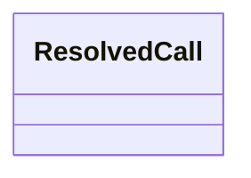
*   **Summary:** The ResolvedCall class is a data structure designed to represent a resolved function call within a diagram generation context. It encapsulates information about the caller, the callee (if available), the type of call, and the line number where the call occurs. This class serves as a lightweight container for storing and passing around details related to function calls during the analysis and visualization process.
*   **Instantiation:** This class is not instantiated by any other component as indicated by the empty instantiated_by list.
*   **Dependencies:** This class has no external dependencies beyond standard library imports such as typing.Optional and enum.Enum.
*   **Constructor:**
    *   *Description:* The class does not define an explicit __init__ method, relying instead on dataclass-style initialization based on the declared attributes.
    *   *Parameters:*

#### Class: `ProjectIndex`
```mermaid
classDiagram
    class ProjectIndex {
        +all_classes()
    }
```
*   **Summary:** The ProjectIndex class serves as a container for managing modules within a project, specifically storing them in a dictionary keyed by their identifiers. It provides a method to retrieve all classes across all modules, facilitating traversal and access to class symbols in a structured manner.
*   **Instantiation:** This class is not instantiated by any other components as per the provided context.
*   **Dependencies:** No external dependencies were specified for this class.
*   **Constructor:**
    *   *Description:* Initializes the ProjectIndex with a dictionary of modules. The modules are stored under the 'modules' attribute, which maps module identifiers to ModuleSymbol instances.
    *   *Parameters:*
*   **Methods:**
    *   **`all_classes`**
        *   *Signature:* `def all_classes(self)`
        *   *Description:* Retrieves a flattened list of all ClassSymbol instances from all modules managed by this ProjectIndex. It iterates over each module in the modules dictionary and collects all classes from each module's classes dictionary.
        *   *Parameters:*
            - **self** (`ProjectIndex`): Reference to the current instance of ProjectIndex.
        *   *Returns:*
            - **list[ClassSymbol]** (`list[ClassSymbol]`): A list containing all ClassSymbol instances from all modules.
        *   **Usage:**
            *   **Calls:** This method does not call any other functions or methods.
            *   **Called By:** This method is not called by any other functions or methods.

### File: `backend/diagram_generation/emitter.py`

#### Function: `mermaid_id`
*   **Signature:** `def mermaid_id(name: str)`
*   **Description:** The function 'mermaid_id' takes a string input named 'name' and returns a modified version of that string where all periods ('.') are replaced with underscores ('_'). This is necessary because Mermaid identifiers are not allowed to contain periods. The function performs a simple string transformation using the built-in 'replace' method.
*   **Parameters:**
    - **name** (`str`): A string representing the identifier to be converted for use in Mermaid diagrams.
*   **Returns:**
    - **return_value** (`str`): A string with all periods replaced by underscores, suitable for use as a Mermaid identifier.
*   **Usage:**
    *   **Calls:** This function calls no other functions.
    *   **Called By:** This function is not called by any other functions.

#### Class: `MermaidSequenceEmitter`
```mermaid
classDiagram
    class MermaidSequenceEmitter {
        +emit()
        -_collect_participants()
        -_emit_response()
        -_emit_call()
    }
```
*   **Summary:** The MermaidSequenceEmitter class is responsible for generating Mermaid.js sequence diagram representations from a list of resolved function calls. It collects participants involved in the calls, emits the call interactions in chronological order, and includes response lines when applicable. The class uses helper functions to format identifiers according to Mermaid syntax.
*   **Instantiation:** This class is not instantiated anywhere within the provided context.
*   **Dependencies:** This class depends on the backend.diagram_generation.emitter.mermaid_id function for formatting identifiers in Mermaid syntax.
*   **Constructor:**
    *   *Description:* The class does not define an explicit constructor (__init__ method). Therefore, it relies on default initialization behavior.
    *   *Parameters:*
*   **Methods:**
    *   **`emit`**
        *   *Signature:* `def emit(calls: list[ResolvedCall])`
        *   *Description:* The emit method generates a complete Mermaid sequence diagram string by first initializing the diagram block with the appropriate header, collecting all unique participants involved in the calls, sorting and emitting each call in order of line number, and appending any necessary return messages. It concludes by closing the diagram block.
        *   *Parameters:*
            - **calls** (`list[ResolvedCall]`): A list of ResolvedCall objects representing function calls to be included in the diagram.
        *   *Returns:*
            - **''** (`str`): A formatted Mermaid sequence diagram as a string.
        *   **Usage:**
            *   **Calls:** This method does not directly call other methods defined in the class but orchestrates the flow by invoking internal helper methods like _collect_participants, _emit_call, and _emit_response.
            *   **Called By:** This method is not called by any other method within the provided context.
    *   **`_collect_participants`**
        *   *Signature:* `def _collect_participants(calls: list[ResolvedCall])`
        *   *Description:* The _collect_participants method iterates over a list of ResolvedCall objects to gather unique participant names from both callers and callees. It ensures that each participant is added only once to the list, using a helper function to format their names appropriately.
        *   *Parameters:*
            - **calls** (`list[ResolvedCall]`): A list of ResolvedCall objects from which to extract participant information.
        *   *Returns:*
            - **''** (`list[str]`): A list of formatted participant names for use in the Mermaid diagram.
        *   **Usage:**
            *   **Calls:** This method calls the mermaid_id function to format participant names before adding them to the list.
            *   **Called By:** This method is not called by any other method within the provided context.
    *   **`_emit_response`**
        *   *Signature:* `def _emit_response(call: ResolvedCall)`
        *   *Description:* The _emit_response method generates a Mermaid notation line representing a return message from a callee back to its caller. It formats the names of the callee and caller using a helper function and constructs the appropriate arrow notation for the return statement.
        *   *Parameters:*
            - **call** (`ResolvedCall`): A ResolvedCall object representing a function call that includes a return symbol.
        *   *Returns:*
            - **''** (`str`): A formatted Mermaid line describing the return interaction.
        *   **Usage:**
            *   **Calls:** This method calls the mermaid_id function to format the names of the callee and caller.
            *   **Called By:** This method is not called by any other method within the provided context.
    *   **`_emit_call`**
        *   *Signature:* `def _emit_call(call: ResolvedCall)`
        *   *Description:* The _emit_call method creates a Mermaid notation line representing a function call from a caller to a callee. It handles cases where the callee may be unknown by using a placeholder ('?') and formats the input parameters for display.
        *   *Parameters:*
            - **call** (`ResolvedCall`): A ResolvedCall object representing a function call to be emitted.
        *   *Returns:*
            - **''** (`str`): A formatted Mermaid line describing the function call.
        *   **Usage:**
            *   **Calls:** This method calls the mermaid_id function to format the names of the caller and callee.
            *   **Called By:** This method is not called by any other method within the provided context.

#### Class: `MermaidOverviewArchitectureEmitter`
```mermaid
classDiagram
    class MermaidOverviewArchitectureEmitter {
        +emit()
    }
```
*   **Summary:** The MermaidOverviewArchitectureEmitter class is responsible for generating a Mermaid.js diagram representation of the architectural overview of a set of modules. It takes a dictionary of ModuleSymbol objects and produces a string containing a Mermaid graph definition that visualizes the relationships between modules based on their imports.
*   **Instantiation:** This class is not instantiated by any other classes or functions as per the provided context.
*   **Dependencies:** No external dependencies were specified for this class.
*   **Constructor:**
    *   *Description:* The class does not define an explicit constructor (__init__ method), so it inherits the default initialization behavior from the base object class.
    *   *Parameters:*
*   **Methods:**
    *   **`emit`**
        *   *Signature:* `def emit(modules: dict[str, ModuleSymbol])`
        *   *Description:* The emit method generates a Mermaid diagram string that represents the architecture of modules by analyzing their import relationships. It constructs a graph where nodes represent module names and edges represent import dependencies. The method processes a dictionary of ModuleSymbol objects, extracts unique import names, and creates directional links between modules based on these imports.
        *   *Parameters:*
            - **modules** (`dict[str, ModuleSymbol]`): A dictionary mapping module names to ModuleSymbol objects which contain information about module imports.
        *   *Returns:*
            - **''** (`str`): A string containing the Mermaid diagram code formatted as a code block.
        *   **Usage:**
            *   **Calls:** This method does not call any other methods within the class or external functions.
            *   **Called By:** This method is not called by any other methods according to the provided context.

#### Class: `MermaidOverviewEmitter`
```mermaid
classDiagram
    class MermaidOverviewEmitter {
        +emit()
    }
```
*   **Summary:** The MermaidOverviewEmitter class is responsible for generating a Mermaid.js diagram representation of module package hierarchies. It takes a dictionary of ModuleSymbol objects and constructs a top-down graph showing relationships between packages in the module hierarchy. The output is a string formatted as a Mermaid diagram block.
*   **Instantiation:** This class is not instantiated by any other classes or functions according to the provided context.
*   **Dependencies:** This class has no external dependencies listed.
*   **Constructor:**
    *   *Description:* The class does not define an explicit __init__ method, so it inherits the default initialization behavior from the base object class.
    *   *Parameters:*
*   **Methods:**
    *   **`emit`**
        *   *Signature:* `def emit(modules: dict[str, ModuleSymbol])`
        *   *Description:* The emit method generates a Mermaid-formatted diagram representing the hierarchical relationships between packages in a collection of modules. It processes each module to extract package hierarchies, identifies unique parent-child relationships between consecutive packages, and formats these relationships into a Mermaid graph structure with a top-down layout.
        *   *Parameters:*
            - **modules** (`dict[str, ModuleSymbol]`): A dictionary mapping module identifiers to ModuleSymbol objects containing package hierarchy information.
        *   *Returns:*
            - **None** (`str`): A string containing the complete Mermaid diagram block with package relationships.
        *   **Usage:**
            *   **Calls:** This method does not call any other methods within the class or external functions.
            *   **Called By:** This method is not called by any other methods according to the provided context.

#### Class: `MermaidClassDiagramEmitter`
```mermaid
classDiagram
    class MermaidClassDiagramEmitter {
        +emit()
    }
```
*   **Summary:** The MermaidClassDiagramEmitter class is responsible for generating Mermaid.js class diagrams from a collection of module symbols. It processes each class within the modules and constructs a textual representation of the diagram using Mermaid syntax. Each class is rendered with its methods, distinguishing between public and private methods by their naming convention. The emitter returns a dictionary mapping class names to their respective Mermaid diagram strings.
*   **Instantiation:** This class is not instantiated by any other component according to the provided context.
*   **Dependencies:** This class depends on the backend.diagram_generation.emitter.mermaid_id function for sanitizing identifiers used in Mermaid diagrams.
*   **Constructor:**
    *   *Description:* The class does not define an explicit constructor (__init__ method). Therefore, it relies on default initialization behavior.
    *   *Parameters:*
*   **Methods:**
    *   **`emit`**
        *   *Signature:* `def emit(modules: dict[str, ModuleSymbol])`
        *   *Description:* The emit method generates Mermaid class diagrams for each class within the provided modules. It iterates over the classes in each module, constructs a Mermaid diagram string for each class, and stores these in a dictionary indexed by class name. Private methods (those starting with '_') are prefixed with '-' while public methods are prefixed with '+'. The method uses a helper function mermaid_id to sanitize class names for use in Mermaid syntax.
        *   *Parameters:*
            - **modules** (`dict[str, ModuleSymbol]`): A dictionary mapping module names to ModuleSymbol objects, which contain information about classes and their methods.
        *   *Returns:*
            - **class_diagrams** (`dict[str, str]`): A dictionary mapping class names to their corresponding Mermaid class diagram strings.
        *   **Usage:**
            *   **Calls:** This method calls the mermaid_id function to sanitize class names for Mermaid syntax.
            *   **Called By:** This method is not called by any other method according to the provided context.

### File: `backend/diagram_generation/generator.py`

#### Function: `analyze_project`
*   **Signature:** `def analyze_project(all_files: list[RepoFile])`
*   **Description:** The function 'analyze_project' processes a list of repository files to build a project index and resolve function calls within the codebase. It filters Python files, parses their Abstract Syntax Trees (ASTs), collects symbols, and builds a structured representation of modules. It then traverses these ASTs to identify function calls and resolves them using a call resolver. Finally, it returns both the project index and the resolved calls.
*   **Parameters:**
    - **all_files** (`list[RepoFile]`): A list of repository files to be analyzed.
*   **Returns:**
    - **project** (`ProjectIndex`): An index representing the structure of the project, including collected modules.
    - **resolved_calls** (`ResolvedCall`): A mapping of resolved function calls within the project.
*   **Usage:**
    *   **Calls:** This function calls no other functions.
    *   **Called By:** This function is not called by any other functions.

#### Function: `main_diagram_generation`
   **Sequence diagram for main_diagram_generation**
```mermaid
sequenceDiagram
    participant generator_main_diagram_generation
    participant generator_analyze_project
    generator_main_diagram_generation ->> generator_analyze_project: ['all_files']
    generator_analyze_project ->> generator_main_diagram_generation: return
```
*   **Signature:** `def main_diagram_generation(py_files: list[str])`
*   **Description:** The function `main_diagram_generation` processes a list of Python files to generate various diagram representations including sequence diagrams, class diagrams, and component diagrams. It first analyzes the project structure and resolved function calls, then organizes these calls by their originating functions. Sequence diagrams are generated for each function based on its resolved calls, while class and component diagrams are created from the project modules. The function returns a tuple containing the sequence diagrams, class diagrams, and component diagram.
*   **Parameters:**
    - **py_files** (`list[str]`): A list of paths to Python files to be analyzed for diagram generation.
*   **Returns:**
    - **seqs** (`dict[str, str]`): A dictionary mapping function names to their corresponding Mermaid sequence diagram strings.
    - **class_diagrams** (`dict`): A dictionary representation of the class diagrams generated from the project modules.
    - **component_diagram** (`str`): A string representation of the component diagram generated from the project modules.
*   **Usage:**
    *   **Calls:** This function calls backend.diagram_generation.generator.analyze_project.
    *   **Called By:** This function is not called by any other functions.

#### Function: `enrich_report_with_diagrams`
*   **Signature:** `def enrich_report_with_diagrams(final_report: str, diagrams: dict, component_diagram: str, class_diagrams: dict)`
*   **Description:** The function enrich_report_with_diagrams integrates diagrams into a final report based on specific markers within the report's content. It processes the report line by line, appending sequence diagrams when a function marker is detected, component diagrams when an architecture section is encountered, and class diagrams when a class marker is found. The function uses regular expressions to match class names within lines and inserts the appropriate diagrams accordingly.
*   **Parameters:**
    - **final_report** (`str`): The original report content as a string, which will have diagrams inserted into it.
    - **diagrams** (`dict`): A dictionary mapping filenames to sequence diagrams that should be inserted into the report.
    - **component_diagram** (`str`): A string representing the component diagram to be inserted at the architecture section of the report.
    - **class_diagrams** (`dict`): A dictionary mapping class names to their respective class diagrams that should be inserted into the report.
*   **Returns:**
    - **enriched_report** (`str`): The final report string with diagrams inserted at appropriate locations based on markers.
*   **Usage:**
    *   **Calls:** This function calls no other functions.
    *   **Called By:** This function is not called by any other functions.

### File: `backend/diagram_generation/main.py`

#### Function: `analyze_project`
*   **Signature:** `def analyze_project(py_files: list[RepoFile])`
*   **Description:** The function 'analyze_project' processes a list of Python files to build a project index and resolve function calls within the codebase. It parses each file into an Abstract Syntax Tree (AST), collects symbols, and builds a module-based structure. The function then traverses these trees to identify function calls and resolves them using a call resolver. Finally, it returns both the constructed project index and the resolved call graph.
*   **Parameters:**
    - **py_files** (`list[RepoFile]`): A list of RepoFile objects representing Python source files to be analyzed.
*   **Returns:**
    - **project** (`ProjectIndex`): An index of all modules in the project, including their symbol information.
    - **resolved_calls** (`dict[str, list[ResolvedCall]]`): A dictionary mapping module names to lists of resolved function calls.
*   **Usage:**
    *   **Calls:** This function calls no other functions.
    *   **Called By:** This function is not called by any other functions.

#### Function: `construct_overview_diagram`
*   **Signature:** `def construct_overview_diagram(project: ProjectIndex)`
*   **Description:** This function constructs an overview diagram by extracting package information from a project's modules. It iterates through each module in the project, collects their overlying packages, and aggregates them into a list. The function then deduplicates these packages using a set and returns the resulting list of packages. The function appears to be designed to prepare data for generating a visual representation of the project's package structure.
*   **Parameters:**
    - **project** (`ProjectIndex`): An object containing the project's modules and their associated metadata.
*   **Returns:**
    - **packages** (`list[list[str]]`): A list of lists containing package names extracted from the project's modules.
*   **Usage:**
    *   **Calls:** This function calls no other functions.
    *   **Called By:** This function is not called by any other functions.

#### Function: `main_diagram_generation`
   **Sequence diagram for main_diagram_generation**
```mermaid
sequenceDiagram
    participant generator_main_diagram_generation
    participant generator_analyze_project
    generator_main_diagram_generation ->> generator_analyze_project: ['all_files']
    generator_analyze_project ->> generator_main_diagram_generation: return
```
*   **Signature:** `def main_diagram_generation()`
*   **Description:** This function generates sequence diagrams for a given Python project by analyzing its structure and resolving function calls. It initializes a Git repository, retrieves all Python files, and processes them to build a project index and resolve inter-function dependencies. The function then organizes these resolved calls into sequence diagrams and writes them to a markdown file. It focuses on visualizing how functions within the same module interact with each other.
*   **Parameters:**
*   **Returns:**
*   **Usage:**
    *   **Calls:** backend.diagram_generation.main.analyze_project
    *   **Called By:** This function is not called by any other functions.

### File: `backend/diagram_generation/symbol_collector.py`

#### Function: `attach_with_parents`
*   **Signature:** `def attach_with_parents(tree: AST)`
*   **Description:** The function 'attach_with_parents' traverses an Abstract Syntax Tree (AST) and assigns parent references to each node in the tree. It uses the 'walk' function to iterate through all nodes and 'iter_child_nodes' to access children, setting the 'parent' attribute of each child to its corresponding parent node. This operation facilitates hierarchical navigation and analysis of the AST structure.
*   **Parameters:**
    - **tree** (`ast.AST`): The root node of the Abstract Syntax Tree to process.
*   **Returns:**
*   **Usage:**
    *   **Calls:** This function calls no other functions.
    *   **Called By:** This function is not called by any other functions.

#### Class: `SymbolCollector`
```mermaid
classDiagram
    class SymbolCollector {
        +__init__()
        -_has_return()
        -_declare_input_parameters()
        +visit_Import()
        +visit_ImportFrom()
        +visit_ClassDef()
        +visit_AsyncFunctionDef()
        +visit_FunctionDef()
    }
```
*   **Summary:** The SymbolCollector class is a subclass of ast.NodeVisitor designed to traverse Python AST nodes and collect symbolic information about modules, including their imports, classes, and functions. It builds a hierarchical representation of a module's structure by analyzing different types of AST nodes such as imports, class definitions, and function definitions. The collected symbols are stored in a ModuleSymbol object which contains nested structures for functions, classes, and imports.
*   **Instantiation:** This class is not directly instantiated by any other components based on the provided context.
*   **Dependencies:** This class depends on several AST-related modules and custom data types including ModuleSymbol, FunctionSymbol, and ClassSymbol from diagram_generation.data_types.
*   **Constructor:**
    *   *Description:* Initializes the SymbolCollector with a module name and a list of packages. It creates a ModuleSymbol object to store the collected symbolic information about the module being processed.
    *   *Parameters:*
        - **module_name** (`str`): The name of the module being processed.
        - **packages** (`list[str]`): A list of package names that the module belongs to.
*   **Methods:**
    *   **`_has_return`**
        *   *Signature:* `def _has_return(node: FunctionDef)`
        *   *Description:* Checks whether a given function definition AST node contains any return statements. It iterates through the body of the function and identifies if any statement is of type Return. This helper method is used to determine if a function has a return value.
        *   *Parameters:*
            - **node** (`FunctionDef`): The AST node representing a function definition.
        *   *Returns:*
            - **has_return** (`bool`): True if the function has at least one return statement, False otherwise.
        *   **Usage:**
            *   **Calls:** This method does not call any other functions.
            *   **Called By:** This method is called by the visit_ClassDef method.
    *   **`_declare_input_parameters`**
        *   *Signature:* `def _declare_input_parameters(node: FunctionDef)`
        *   *Description:* Extracts the names of input parameters from a function definition AST node. It iterates through the arguments of the function and collects the names of all positional arguments into a list. This information is used to represent the function's signature.
        *   *Parameters:*
            - **node** (`FunctionDef`): The AST node representing a function definition.
        *   *Returns:*
            - **input_parameters** (`list[str]`): A list of strings representing the names of the function's input parameters.
        *   **Usage:**
            *   **Calls:** This method does not call any other functions.
            *   **Called By:** This method is called by the visit_ClassDef and visit_AsyncFunctionDef methods.
    *   **`visit_Import`**
        *   *Signature:* `def visit_Import(node: Import)`
        *   *Description:* Handles import statements in the AST by extracting the imported names and storing them in the module's imports dictionary. Each imported name is mapped to its original name, handling both regular imports and aliased imports.
        *   *Parameters:*
            - **node** (`Import`): The AST node representing an import statement.
        *   *Returns:*
            - **None** (`None`): This method does not return anything.
        *   **Usage:**
            *   **Calls:** This method does not call any other functions.
            *   **Called By:** This method is called by the generic AST traversal mechanism.
    *   **`visit_ImportFrom`**
        *   *Signature:* `def visit_ImportFrom(node: ImportFrom)`
        *   *Description:* Handles 'from ... import ...' statements in the AST by extracting the imported names and mapping them to their full qualified names. It handles cases where the module path is relative by skipping those cases for now. For valid imports, it stores the mapping in the module's imports dictionary.
        *   *Parameters:*
            - **node** (`ImportFrom`): The AST node representing a 'from ... import ...' statement.
        *   *Returns:*
            - **None** (`None`): This method does not return anything.
        *   **Usage:**
            *   **Calls:** This method does not call any other functions.
            *   **Called By:** This method is called by the generic AST traversal mechanism.
    *   **`visit_ClassDef`**
        *   *Signature:* `def visit_ClassDef(node)`
        *   *Description:* Processes class definitions in the AST by creating a ClassSymbol object and populating it with information about the class and its methods. It iterates through the class body and identifies function definitions to create FunctionSymbol objects for each method. It also checks for return statements and input parameters for each method.
        *   *Parameters:*
            - **node** (`ClassDef`): The AST node representing a class definition.
        *   *Returns:*
            - **None** (`None`): This method does not return anything.
        *   **Usage:**
            *   **Calls:** This method calls the _has_return and _declare_input_parameters helper methods.
            *   **Called By:** This method is called by the generic AST traversal mechanism.
    *   **`visit_AsyncFunctionDef`**
        *   *Signature:* `def visit_AsyncFunctionDef(node)`
        *   *Description:* Processes asynchronous function definitions in the AST by creating a FunctionSymbol object for the function. It determines if the function is asynchronous and collects information about its input parameters and return status. It also skips processing if the function is defined inside a class.
        *   *Parameters:*
            - **node** (`AsyncFunctionDef`): The AST node representing an asynchronous function definition.
        *   *Returns:*
            - **None** (`None`): This method does not return anything.
        *   **Usage:**
            *   **Calls:** This method calls the _has_return and _declare_input_parameters helper methods.
            *   **Called By:** This method is called by the generic AST traversal mechanism and indirectly by visit_FunctionDef.
    *   **`visit_FunctionDef`**
        *   *Signature:* `def visit_FunctionDef(node: FunctionDef)`
        *   *Description:* Processes regular function definitions in the AST by delegating the work to visit_AsyncFunctionDef. This method essentially acts as a wrapper that ensures regular functions are handled the same way as asynchronous ones.
        *   *Parameters:*
            - **node** (`FunctionDef`): The AST node representing a regular function definition.
        *   *Returns:*
            - **None** (`None`): This method does not return anything.
        *   **Usage:**
            *   **Calls:** This method calls the visit_AsyncFunctionDef method.
            *   **Called By:** This method is called by the generic AST traversal mechanism.

### File: `backend/getRepo.py`

#### Class: `RepoFile`
```mermaid
classDiagram
    class RepoFile {
        +__init__()
        +blob()
        +content()
        +size()
        +analyze_word_count()
        -__repr__()
        +to_dict()
    }
```
*   **Summary:** The RepoFile class represents a single file within a Git repository and implements lazy loading for its content, size, and blob attributes to optimize performance. It provides properties to access these attributes on-demand and includes utility methods such as word count analysis and conversion to dictionary format. The class is designed to work with Git tree structures and handles file retrieval and decoding from Git blobs.
*   **Instantiation:** This class is not instantiated by any other components according to the provided context.
*   **Dependencies:** This class depends on external modules such as tempfile, git.Repo, git.GitCommandError, logging, and os.
*   **Constructor:**
    *   *Description:* Initializes a RepoFile object by storing the file path and commit tree, setting up internal attributes for lazy-loaded data including blob, content, and size.
    *   *Parameters:*
        - **file_path** (`str`): The path to the file within the repository.
        - **commit_tree** (`git.Tree`): The tree object of the commit from which the file originates.
*   **Methods:**
    *   **`blob`**
        *   *Signature:* `def blob(self)`
        *   *Description:* A property that lazily loads and returns the Git blob object associated with the file path in the commit tree. If the blob is not yet loaded, it attempts to retrieve it from the tree and raises a FileNotFoundError if the file is not found.
        *   *Parameters:*
        *   *Returns:*
            - **blob** (`git.Blob`): The Git blob object representing the file.
        *   **Usage:**
            *   **Calls:** This method does not call any other functions or methods.
            *   **Called By:** This method is not called by any other functions or methods.
    *   **`content`**
        *   *Signature:* `def content(self)`
        *   *Description:* A property that lazily loads and returns the decoded UTF-8 content of the file. It reads the data stream from the blob and decodes it, ignoring encoding errors.
        *   *Parameters:*
        *   *Returns:*
            - **content** (`str`): The decoded content of the file.
        *   **Usage:**
            *   **Calls:** This method does not call any other functions or methods.
            *   **Called By:** This method is not called by any other functions or methods.
    *   **`size`**
        *   *Signature:* `def size(self)`
        *   *Description:* A property that lazily loads and returns the size of the file in bytes by accessing the size attribute of the blob.
        *   *Parameters:*
        *   *Returns:*
            - **size** (`int`): The size of the file in bytes.
        *   **Usage:**
            *   **Calls:** This method does not call any other functions or methods.
            *   **Called By:** This method is not called by any other functions or methods.
    *   **`analyze_word_count`**
        *   *Signature:* `def analyze_word_count(self)`
        *   *Description:* An example analysis method that counts the number of words in the file's content by splitting the content string and returning the length of the resulting list.
        *   *Parameters:*
        *   *Returns:*
            - **word_count** (`int`): The total number of words in the file content.
        *   **Usage:**
            *   **Calls:** This method does not call any other functions or methods.
            *   **Called By:** This method is not called by any other functions or methods.
    *   **`__repr__`**
        *   *Signature:* `def __repr__(self)`
        *   *Description:* Returns a useful string representation of the RepoFile object, showing the file path for debugging and logging purposes.
        *   *Parameters:*
        *   *Returns:*
            - **repr** (`str`): A string representation of the RepoFile object.
        *   **Usage:**
            *   **Calls:** This method does not call any other functions or methods.
            *   **Called By:** This method is not called by any other functions or methods.
    *   **`to_dict`**
        *   *Signature:* `def to_dict(self, include_content=False)`
        *   *Description:* Converts the RepoFile object into a dictionary representation, including basic metadata like path, name, size, and type. Optionally includes the file content if specified.
        *   *Parameters:*
            - **include_content** (`bool`): Flag indicating whether to include the file content in the returned dictionary.
        *   *Returns:*
            - **data** (`dict`): A dictionary containing metadata about the file.
        *   **Usage:**
            *   **Calls:** This method does not call any other functions or methods.
            *   **Called By:** This method is not called by any other functions or methods.

#### Class: `GitRepository`
```mermaid
classDiagram
    class GitRepository {
        +__init__()
        +get_all_files()
        +close()
        -__enter__()
        -__exit__()
        +get_file_tree()
    }
```
*   **Summary:** The GitRepository class manages a Git repository by cloning it into a temporary directory and providing functionality to retrieve files and construct a hierarchical file tree. It supports initialization with a repository URL, cloning the repository, listing all files as RepoFile objects, and cleaning up the temporary directory upon closing. The class also implements context manager protocols (__enter__ and __exit__) to facilitate automatic resource cleanup.
*   **Instantiation:** This class is not instantiated by any other method or class according to the provided context.
*   **Dependencies:** This class depends on the backend.getRepo.RepoFile class.
*   **Constructor:**
    *   *Description:* Initializes a GitRepository instance by setting the repository URL, creating a temporary directory, and cloning the repository from the given URL into that directory. It also retrieves metadata about the latest commit and its file tree. If cloning fails, it raises a RuntimeError after cleaning up resources.
    *   *Parameters:*
        - **repo_url** (`str`): The URL of the Git repository to clone.
*   **Methods:**
    *   **`get_all_files`**
        *   *Signature:* `def get_all_files(self)`
        *   *Description:* Retrieves a list of all files in the cloned repository and creates RepoFile objects for each file. These objects are stored in the instance's 'files' attribute and returned as a list.
        *   *Parameters:*
            - **self** (`GitRepository`): The instance of the GitRepository class.
        *   *Returns:*
            - **files** (`list[RepoFile]`): A list of RepoFile instances representing all files in the repository.
        *   **Usage:**
            *   **Calls:** This method calls the RepoFile class to instantiate file objects.
            *   **Called By:** This method is not called by any other method according to the provided context.
    *   **`close`**
        *   *Signature:* `def close(self)`
        *   *Description:* Deletes the temporary directory used for cloning the repository and cleans up associated resources.
        *   *Parameters:*
            - **self** (`GitRepository`): The instance of the GitRepository class.
        *   *Returns:*
        *   **Usage:**
            *   **Calls:** This method does not call any other functions or methods.
            *   **Called By:** This method is not called by any other method according to the provided context.
    *   **`__enter__`**
        *   *Signature:* `def __enter__(self)`
        *   *Description:* Enables the use of the GitRepository instance in a 'with' statement, returning the instance itself for use within the context block.
        *   *Parameters:*
            - **self** (`GitRepository`): The instance of the GitRepository class.
        *   *Returns:*
            - **self** (`GitRepository`): The GitRepository instance itself.
        *   **Usage:**
            *   **Calls:** This method does not call any other functions or methods.
            *   **Called By:** This method is not called by any other method according to the provided context.
    *   **`__exit__`**
        *   *Signature:* `def __exit__(self, exc_type, exc_val, exc_tb)`
        *   *Description:* Cleans up resources when exiting a 'with' block by calling the close() method.
        *   *Parameters:*
            - **self** (`GitRepository`): The instance of the GitRepository class.
            - **exc_type** (`Any`): Exception type, if an exception occurred in the with block.
            - **exc_val** (`Any`): Exception value, if an exception occurred in the with block.
            - **exc_tb** (`Any`): Exception traceback, if an exception occurred in the with block.
        *   *Returns:*
        *   **Usage:**
            *   **Calls:** This method does not call any other functions or methods.
            *   **Called By:** This method is not called by any other method according to the provided context.
    *   **`get_file_tree`**
        *   *Signature:* `def get_file_tree(self, include_content=False)`
        *   *Description:* Constructs a hierarchical tree representation of the repository's file structure. If no files have been retrieved yet, it first fetches all files. Then, it iterates through the files and builds nested dictionaries representing directories and files.
        *   *Parameters:*
            - **self** (`GitRepository`): The instance of the GitRepository class.
            - **include_content** (`bool`): Flag indicating whether to include file content in the returned dictionary.
        *   *Returns:*
            - **tree** (`dict`): A nested dictionary representing the file tree structure.
        *   **Usage:**
            *   **Calls:** This method does not call any other functions or methods directly.
            *   **Called By:** This method is not called by any other method according to the provided context.

### File: `backend/main.py`

#### Function: `create_savings_chart`
*   **Signature:** `def create_savings_chart(json_tokens, toon_tokens, savings_percent, output_path)`
*   **Description:** The function creates a bar chart comparing token counts between JSON and TOON formats and saves it to a specified file path. It uses matplotlib to generate the visualization, including labeled axes, a title with savings percentage, grid lines, and value labels on top of each bar. The chart is saved as a PNG image at the given output path.
*   **Parameters:**
    - **json_tokens** (`int`): The number of tokens associated with the JSON format.
    - **toon_tokens** (`int`): The number of tokens associated with the TOON format.
    - **savings_percent** (`float`): The percentage savings represented in the chart title.
    - **output_path** (`str`): The file path where the generated chart will be saved.
*   **Returns:**
*   **Usage:**
    *   **Calls:** This function calls no other functions.
    *   **Called By:** This function is not called by any other functions.

#### Function: `calculate_net_time`
*   **Signature:** `def calculate_net_time(start_time, end_time, total_items, batch_size, model_name)`
*   **Description:** The function calculates the net time duration between a start and end time, adjusted for sleep periods caused by rate limits. It specifically handles cases where the model name starts with 'gemini-', applying additional logic to account for batching and associated sleep times. If the model is not a gemini model, it returns the total duration directly. For zero items, it returns zero. Otherwise, it computes the number of batches, determines the number of sleep periods, and subtracts the total sleep time from the overall duration.
*   **Parameters:**
    - **start_time** (`float or datetime`): The starting timestamp or time value.
    - **end_time** (`float or datetime`): The ending timestamp or time value.
    - **total_items** (`int`): The total number of items processed.
    - **batch_size** (`int`): The number of items per batch.
    - **model_name** (`str`): The name of the model being used, which determines whether rate limit adjustments apply.
*   **Returns:**
    - **net_time** (`float or int`): The calculated net time after subtracting sleep durations due to rate limiting.
*   **Usage:**
    *   **Calls:** This function calls no other functions.
    *   **Called By:** This function is not called by any other functions.

#### Function: `main_workflow`
   **Sequence diagram for main_workflow**
```mermaid
sequenceDiagram
    participant main_main_workflow
    participant main_update_status
    participant main_main_workflow
    participant main_get_key_and_url
    participant main_main_workflow
    participant main_get_key_and_url
    participant main_main_workflow
    participant main_update_status
    participant main_main_workflow
    participant main_update_status
    participant main_main_workflow
    participant main_update_status
    participant main_main_workflow
    participant main_update_status
    participant main_main_workflow
    participant main_update_status
    participant main_main_workflow
    participant main_update_status
    participant main_main_workflow
    participant main_update_status
    participant main_main_workflow
    participant main_update_status
    participant main_main_workflow
    participant main_calculate_net_time
    participant main_main_workflow
    participant main_update_status
    participant main_main_workflow
    participant main_update_status
    participant main_main_workflow
    participant main_calculate_net_time
    participant main_main_workflow
    participant main_update_status
    participant main_main_workflow
    participant main_update_status
    participant main_main_workflow
    participant main_enrich_report_with_diagrams
    participant main_main_workflow
    participant main_create_savings_chart
    main_main_workflow ->> main_update_status: ['msg']
    main_main_workflow ->> main_get_key_and_url: ['model_name']
    main_get_key_and_url ->> main_main_workflow: return
    main_main_workflow ->> main_get_key_and_url: ['model_name']
    main_get_key_and_url ->> main_main_workflow: return
    main_main_workflow ->> main_update_status: ['msg']
    main_main_workflow ->> main_update_status: ['msg']
    main_main_workflow ->> main_update_status: ['msg']
    main_main_workflow ->> main_update_status: ['msg']
    main_main_workflow ->> main_update_status: ['msg']
    main_main_workflow ->> main_update_status: ['msg']
    main_main_workflow ->> main_update_status: ['msg']
    main_main_workflow ->> main_update_status: ['msg']
    main_main_workflow ->> main_calculate_net_time: ['start_time', 'end_time', 'total_items', 'batch_size', 'model_name']
    main_calculate_net_time ->> main_main_workflow: return
    main_main_workflow ->> main_update_status: ['msg']
    main_main_workflow ->> main_update_status: ['msg']
    main_main_workflow ->> main_calculate_net_time: ['start_time', 'end_time', 'total_items', 'batch_size', 'model_name']
    main_calculate_net_time ->> main_main_workflow: return
    main_main_workflow ->> main_update_status: ['msg']
    main_main_workflow ->> main_update_status: ['msg']
    main_main_workflow ->> main_enrich_report_with_diagrams: ['final_report', 'diagrams', 'component_diagram', 'class_diagrams']
    main_enrich_report_with_diagrams ->> main_main_workflow: return
    main_main_workflow ->> main_create_savings_chart: ['json_tokens', 'toon_tokens', 'savings_percent', 'output_path']
```
*   **Signature:** `def main_workflow(user_input, api_keys: dict, model_names: dict, status_callback=None, check_stop=None)`
*   **Description:** The `main_workflow` function orchestrates a comprehensive code analysis and documentation generation process for a given GitHub repository. It begins by validating and extracting API keys and model configurations, followed by cloning the repository and analyzing its structure. The function then performs static analysis on the codebase using AST and relationship analysis to extract detailed information about functions and classes. It prepares inputs for a helper LLM to analyze individual functions and classes, and subsequently calls the helper LLM to generate detailed documentation for them. Afterward, it uses a main LLM to synthesize a final report based on all collected data. Finally, it generates diagrams and saves the results along with performance metrics.
*   **Parameters:**
    - **user_input** (`Any`): Input provided by the user, typically containing a GitHub repository URL.
    - **api_keys** (`dict`): A dictionary containing API keys and URLs required for accessing various language models and services.
    - **model_names** (`dict`): A dictionary specifying the names of helper and main language models to be used.
    - **status_callback** (`Callable[[str], None]`): An optional callback function to report progress updates during execution.
    - **check_stop** (`Callable[[], bool]`): An optional function to check if the workflow should be interrupted.
*   **Returns:**
    - **report** (`str`): The final generated documentation report as a markdown string.
    - **metrics** (`dict`): A dictionary containing timing and token usage statistics for the workflow.
*   **Usage:**
    *   **Calls:** backend.AST_Schema.ASTAnalyzer, backend.AST_Schema.ASTAnalyzer.analyze_repository, backend.AST_Schema.ASTAnalyzer.merge_relationship_data, backend.HelperLLM.LLMHelper, backend.HelperLLM.LLMHelper.generate_for_classes, backend.HelperLLM.LLMHelper.generate_for_functions, backend.MainLLM.MainLLM, backend.MainLLM.MainLLM.call_llm, backend.basic_info.ProjektInfoExtractor, backend.basic_info.ProjektInfoExtractor.extrahiere_info, backend.diagram_generation.generator.main_diagram_generation, backend.getRepo.GitRepository, backend.main.calculate_net_time, backend.main.create_savings_chart, backend.main.enrich_report_with_diagrams, backend.main.get_key_and_url, backend.main.update_status, backend.relationship_analyzer.ProjectAnalyzer, backend.relationship_analyzer.ProjectAnalyzer.analyze, backend.relationship_analyzer.ProjectAnalyzer.get_raw_relationships, schemas.types.ClassAnalysisInput, schemas.types.ClassContextInput, schemas.types.FunctionAnalysisInput, schemas.types.FunctionContextInput, schemas.types.MethodContextInput
    *   **Called By:** This function is not called by any other functions.

#### Function: `update_status`
*   **Signature:** `def update_status(msg)`
*   **Description:** The function 'update_status' is designed to handle status updates within a workflow process. It first checks if a stop condition has been triggered by calling the 'check_stop' function, and if so, logs an interrupt message and raises an 'InterruptedError'. If a 'status_callback' function is defined, it invokes this callback with the provided message. Finally, it logs the message using the standard logging mechanism.
*   **Parameters:**
    - **msg** (`str`): A string message representing the status update to be logged and optionally passed to a callback function.
*   **Returns:**
*   **Usage:**
    *   **Calls:** This function calls no other functions.
    *   **Called By:** This function is not called by any other functions.

#### Function: `get_key_and_url`
*   **Signature:** `def get_key_and_url(model_name)`
*   **Description:** The function determines the appropriate API key and base URL for a given model name. It checks the model name prefix to decide which key and URL to return. For GPT models, it returns the OpenAI API key and no URL. For Gemini models, it validates the presence of the Gemini API key before returning it along with no URL. For the 'llama3' model, it returns no key but the Ollama base URL. For other models, it first checks for user-defined Open Source settings, falling back to system defaults if those are not set.
*   **Parameters:**
    - **model_name** (`str`): The name of the model for which the API key and base URL are to be determined.
*   **Returns:**
    - **key** (`Union[str, None]`): The API key corresponding to the model, or None if not applicable.
    - **url** (`Union[str, None]`): The base URL corresponding to the model, or None if not applicable.
*   **Usage:**
    *   **Calls:** This function calls no other functions.
    *   **Called By:** This function is not called by any other functions.

#### Function: `enrich_report_with_diagrams`
*   **Signature:** `def enrich_report_with_diagrams(final_report: str, diagrams: dict, component_diagram: str, class_diagrams: dict)`
*   **Description:** The function enrich_report_with_diagrams integrates diagrams into a final report based on specific markers within the report's content. It processes the report line by line, appending sequence diagrams when a function section is detected, inserting a component diagram at the architecture section, and adding class diagrams when a class section is identified. The function uses regular expressions to match class names within lines and ensures proper formatting of the enriched report.
*   **Parameters:**
    - **final_report** (`str`): The original report text that needs to be enriched with diagrams.
    - **diagrams** (`dict`): A dictionary mapping filenames to sequence diagrams that should be inserted into the report.
    - **component_diagram** (`str`): The component diagram to be inserted at the architecture section of the report.
    - **class_diagrams** (`dict`): A dictionary mapping class names to their respective class diagrams for insertion into the report.
*   **Returns:**
    - **enriched_report** (`str`): The final report with diagrams inserted at appropriate locations based on markers.
*   **Usage:**
    *   **Calls:** This function calls no other functions.
    *   **Called By:** This function is not called by any other functions.

#### Function: `notebook_workflow`
   **Sequence diagram for notebook_workflow**
```mermaid
sequenceDiagram
    participant main_notebook_workflow
    participant main_update_status
    participant main_notebook_workflow
    participant main_update_status
    participant main_notebook_workflow
    participant main_update_status
    participant main_notebook_workflow
    participant main_update_status
    participant main_notebook_workflow
    participant main_update_status
    participant main_notebook_workflow
    participant main_gemini_payload
    main_notebook_workflow ->> main_update_status: ['msg']
    main_notebook_workflow ->> main_update_status: ['msg']
    main_notebook_workflow ->> main_update_status: ['msg']
    main_notebook_workflow ->> main_update_status: ['msg']
    main_notebook_workflow ->> main_update_status: ['msg']
    main_notebook_workflow ->> main_gemini_payload: ['info', 'path', 'xml', 'imgs']
    main_gemini_payload ->> main_notebook_workflow: return
```
*   **Signature:** `def notebook_workflow(input, api_keys, model, status_callback=None, check_stop=None)`
*   **Description:** The `notebook_workflow` function orchestrates the analysis of Jupyter notebooks within a GitHub repository. It begins by validating the input for a valid GitHub URL, clones the repository, and extracts all files. It then processes these files to identify and prepare notebooks for analysis. Based on the specified model, it configures the appropriate API keys and base URLs for communication with various language models. It sequentially analyzes each notebook using the configured LLM, generating reports for each. Finally, it aggregates all individual reports into a comprehensive final report along with timing metrics.
*   **Parameters:**
    - **input** (`str`): A string containing either a GitHub repository URL or other input that includes a GitHub URL.
    - **api_keys** (`dict`): A dictionary mapping provider names (e.g., 'gemini', 'gpt', 'scadsllm') to their respective API keys or configuration values.
    - **model** (`str`): A string indicating the language model to be used for analysis, such as 'gpt-4', 'gemini-pro', or 'llama3'.
    - **status_callback** (`callable`): An optional callback function to report progress updates during execution.
    - **check_stop** (`callable`): An optional function that returns True if the workflow should be interrupted.
*   **Returns:**
    - **report** (`str`): A concatenated string of individual notebook analysis reports, separated by markdown dividers.
    - **metrics** (`dict`): A dictionary containing timing and model information including total time, main model used, and token usage metrics.
*   **Usage:**
    *   **Calls:** backend.MainLLM.MainLLM, backend.MainLLM.MainLLM.call_llm, backend.basic_info.ProjektInfoExtractor, backend.basic_info.ProjektInfoExtractor.extrahiere_info, backend.converter.process_repo_notebooks, backend.getRepo.GitRepository, backend.main.gemini_payload, backend.main.update_status
    *   **Called By:** This function is not called by any other functions.

#### Function: `update_status`
*   **Signature:** `def update_status(msg)`
*   **Description:** The function 'update_status' is designed to handle status updates within a workflow process. It first checks if a stop condition has been triggered by calling the 'check_stop' function, and if so, logs an interrupt message and raises an 'InterruptedError'. If a 'status_callback' function is defined, it invokes this callback with the provided message. Finally, it logs the message using the standard logging mechanism.
*   **Parameters:**
    - **msg** (`str`): A string message representing the status update to be logged and optionally passed to a callback function.
*   **Returns:**
*   **Usage:**
    *   **Calls:** This function calls no other functions.
    *   **Called By:** This function is not called by any other functions.

#### Function: `gemini_payload`
*   **Signature:** `def gemini_payload(info, path, xml, imgs)`
*   **Description:** The function `gemini_payload` constructs a structured payload for use with a Gemini API by combining basic information, a notebook path, and an XML structure with embedded image placeholders. It processes the XML to replace image placeholders with base64-encoded image data from a provided list. The resulting payload is formatted as a list of dictionaries, each representing either text or image content.
*   **Parameters:**
    - **info** (`Any`): Basic information to be included in the payload.
    - **path** (`Any`): The current notebook path to be included in the payload.
    - **xml** (`str`): The XML structure containing image placeholders to be processed.
    - **imgs** (`List[Dict[str, Any]]`): A list of dictionaries containing image data, indexed by placeholder position.
*   **Returns:**
    - **payload** (`List[Dict[str, Any]]`): A list of dictionaries representing the constructed payload, including text and image content.
*   **Usage:**
    *   **Calls:** This function calls no other functions.
    *   **Called By:** This function is not called by any other functions.

### File: `backend/relationship_analyzer.py`

#### Function: `path_to_module`
*   **Signature:** `def path_to_module(filepath, project_root)`
*   **Description:** The function converts a file path into a Python module path by computing the relative path from the project root, removing the '.py' extension if present, and replacing directory separators with dots. It handles cases where the filepath is not under the project root by falling back to the basename of the file. If the resulting path ends with '__init__', it removes the trailing part to correctly represent the package structure.
*   **Parameters:**
    - **filepath** (`str`): The absolute or relative path to a Python file.
    - **project_root** (`str`): The root directory of the project used to compute the relative path.
*   **Returns:**
    - **module_path** (`str`): A dot-separated module path derived from the given file path.
*   **Usage:**
    *   **Calls:** This function calls no other functions.
    *   **Called By:** This function is not called by any other functions.

#### Class: `ProjectAnalyzer`
```mermaid
classDiagram
    class ProjectAnalyzer {
        +__init__()
        +analyze()
        +get_raw_relationships()
        -_find_py_files()
        -_collect_definitions()
        -_get_parent()
        -_resolve_calls()
    }
```
*   **Summary:** The ProjectAnalyzer class is designed to analyze Python project structures by examining source code files to extract definitions (functions, classes, methods) and their call relationships. It traverses the project directory, parses Python files into Abstract Syntax Trees (ASTs), collects definitions with their metadata, resolves inter-file function and method calls, and generates a call graph representing these relationships. The class supports filtering out common non-source directories like .git, venv, etc., and provides functionality to retrieve raw relationship data between definitions.
*   **Instantiation:** This class is not instantiated by any other component according to the provided context.
*   **Dependencies:** This class depends on the backend.relationship_analyzer.CallResolverVisitor and backend.relationship_analyzer.path_to_module for resolving calls and computing module paths respectively.
*   **Constructor:**
    *   *Description:* Initializes the ProjectAnalyzer with a project root directory. Sets up internal data structures including dictionaries for storing definitions, call graphs, and ASTs, as well as a set of directory names to ignore during traversal.
    *   *Parameters:*
        - **project_root** (`str`): The absolute path to the root directory of the Python project to be analyzed.
*   **Methods:**
    *   **`analyze`**
        *   *Signature:* `def analyze(self)`
        *   *Description:* The main analysis method that orchestrates the process of finding Python files, collecting definitions from those files, resolving call relationships, and cleaning up temporary data structures. It iterates over all Python files identified in the project root, processes each file for definitions and calls, and finally returns the constructed call graph.
        *   *Parameters:*
        *   *Returns:*
            - **call_graph** (`defaultdict(list)`): A dictionary mapping callee identifiers to lists of caller information, representing the resolved call relationships in the project.
        *   **Usage:**
            *   **Calls:** This method does not directly call any other methods defined in the class itself but relies on helper methods such as `_find_py_files`, `_collect_definitions`, and `_resolve_calls`.
            *   **Called By:** This method is not called by any other method within the provided context.
    *   **`get_raw_relationships`**
        *   *Signature:* `def get_raw_relationships(self)`
        *   *Description:* Transforms the internal call graph into a more accessible format by separating outgoing and incoming relationships for each definition. It constructs two dictionaries: one showing which definitions call others (outgoing), and another showing which definitions are called by others (incoming). Both dictionaries are sorted for consistent representation.
        *   *Parameters:*
        *   *Returns:*
            - **relationships** (`dict`): A dictionary containing 'outgoing' and 'incoming' keys mapping definition identifiers to sets of related identifiers.
        *   **Usage:**
            *   **Calls:** This method does not directly call any other methods defined in the class itself.
            *   **Called By:** This method is not called by any other method within the provided context.
    *   **`_find_py_files`**
        *   *Signature:* `def _find_py_files(self)`
        *   *Description:* Recursively walks through the project root directory and identifies all Python (.py) files while excluding predefined directories such as .git, venv, etc. It returns a list of absolute paths to these Python files.
        *   *Parameters:*
        *   *Returns:*
            - **py_files** (`list[str]`): A list of absolute file paths to all Python source files in the project, excluding ignored directories.
        *   **Usage:**
            *   **Calls:** This method does not directly call any other methods defined in the class itself.
            *   **Called By:** This method is called by the `analyze` method.
    *   **`_collect_definitions`**
        *   *Signature:* `def _collect_definitions(self, filepath)`
        *   *Description:* Parses a given Python file into an AST and extracts all function, class, and method definitions along with their metadata (file location, line number, type). It uses a helper function `path_to_module` to determine the module path for each definition and stores this information in the `self.definitions` dictionary.
        *   *Parameters:*
            - **filepath** (`str`): The absolute path to the Python file whose definitions need to be collected.
        *   *Returns:*
        *   **Usage:**
            *   **Calls:** This method calls the `path_to_module` function to compute the module path for each definition.
            *   **Called By:** This method is called by the `analyze` method.
    *   **`_get_parent`**
        *   *Signature:* `def _get_parent(self, tree, node)`
        *   *Description:* Given an AST and a node within that AST, this method attempts to find the parent node of the specified node by walking the AST. It is used primarily to determine whether a function or method definition is nested inside a class.
        *   *Parameters:*
            - **tree** (`ast.AST`): The root of the Abstract Syntax Tree being searched.
            - **node** (`ast.AST`): The node for which the parent needs to be found.
        *   *Returns:*
            - **parent** (`ast.AST or None`): The parent node of the given node, or None if not found.
        *   **Usage:**
            *   **Calls:** This method does not directly call any other methods defined in the class itself.
            *   **Called By:** This method is called by the `_collect_definitions` method.
    *   **`_resolve_calls`**
        *   *Signature:* `def _resolve_calls(self, filepath)`
        *   *Description:* Processes a Python file's AST using a CallResolverVisitor to identify and resolve inter-file calls. It aggregates the results into the shared `call_graph` attribute, associating each callee with a list of caller details.
        *   *Parameters:*
            - **filepath** (`str`): The absolute path to the Python file whose calls need to be resolved.
        *   *Returns:*
        *   **Usage:**
            *   **Calls:** This method instantiates and utilizes the `CallResolverVisitor` class to parse and resolve calls within the file.
            *   **Called By:** This method is called by the `analyze` method.

#### Class: `CallResolverVisitor`
```mermaid
classDiagram
    class CallResolverVisitor {
        +__init__()
        +visit_ClassDef()
        +visit_FunctionDef()
        +visit_Call()
        +visit_Import()
        +visit_ImportFrom()
        +visit_Assign()
        -_resolve_call_qname()
    }
```
*   **Summary:** The CallResolverVisitor class is an AST (Abstract Syntax Tree) visitor designed to analyze Python code and track function calls, class definitions, and variable assignments. It maintains scope information, resolves qualified names for functions and methods, and records call relationships between different parts of the codebase. This class is particularly useful for static analysis tools that need to understand how functions and methods interact within a project.
*   **Instantiation:** This class is not instantiated directly by any known code paths in the provided context.
*   **Dependencies:** This class depends on backend.relationship_analyzer.path_to_module for computing module paths.
*   **Constructor:**
    *   *Description:* Initializes the CallResolverVisitor with a file path, project root directory, and a set of definitions. It sets up internal tracking structures such as scope, instance types, and call records, and determines the module path based on the file path and project root.
    *   *Parameters:*
        - **filepath** (`str`): The absolute path to the Python file being analyzed.
        - **project_root** (`str`): The root directory of the project, used to compute relative module paths.
        - **definitions** (`dict`): A dictionary mapping qualified names to their definitions, used for resolving call targets.
*   **Methods:**
    *   **`visit_ClassDef`**
        *   *Signature:* `def visit_ClassDef(node)`
        *   *Description:* Handles the visitation of class definitions in the AST. It temporarily updates the current class name during traversal to correctly resolve identifiers within the class scope, then restores the previous class name after processing.
        *   *Parameters:*
            - **node** (`ast.ClassDef`): The AST node representing the class definition.
        *   *Returns:*
        *   **Usage:**
            *   **Calls:** This method does not explicitly call any other methods.
            *   **Called By:** This method is called by the generic AST visitor framework when encountering a class definition node.
    *   **`visit_FunctionDef`**
        *   *Signature:* `def visit_FunctionDef(node)`
        *   *Description:* Processes function definitions in the AST. It manages the caller name context by setting it to a fully qualified identifier that includes the module, class (if applicable), and function name, allowing accurate tracking of call relationships.
        *   *Parameters:*
            - **node** (`ast.FunctionDef`): The AST node representing the function definition.
        *   *Returns:*
        *   **Usage:**
            *   **Calls:** This method does not explicitly call any other methods.
            *   **Called By:** This method is called by the generic AST visitor framework when encountering a function definition node.
    *   **`visit_Call`**
        *   *Signature:* `def visit_Call(node)`
        *   *Description:* Analyzes function calls in the AST. It resolves the qualified name of the called function, checks if it exists in the definitions, and records the call relationship along with metadata like file, line number, and caller type.
        *   *Parameters:*
            - **node** (`ast.Call`): The AST node representing the function call.
        *   *Returns:*
        *   **Usage:**
            *   **Calls:** This method does not explicitly call any other methods.
            *   **Called By:** This method is called by the generic AST visitor framework when encountering a function call node.
    *   **`visit_Import`**
        *   *Signature:* `def visit_Import(node)`
        *   *Description:* Handles import statements in the AST. It maps imported names to their actual module paths in the scope dictionary, enabling later resolution of qualified names.
        *   *Parameters:*
            - **node** (`ast.Import`): The AST node representing the import statement.
        *   *Returns:*
        *   **Usage:**
            *   **Calls:** This method does not explicitly call any other methods.
            *   **Called By:** This method is called by the generic AST visitor framework when encountering an import node.
    *   **`visit_ImportFrom`**
        *   *Signature:* `def visit_ImportFrom(node)`
        *   *Description:* Processes 'from ... import ...' statements in the AST. It resolves the full module path for imports, especially handling relative imports, and stores the mapping in the scope dictionary.
        *   *Parameters:*
            - **node** (`ast.ImportFrom`): The AST node representing the 'from ... import ...' statement.
        *   *Returns:*
        *   **Usage:**
            *   **Calls:** This method does not explicitly call any other methods.
            *   **Called By:** This method is called by the generic AST visitor framework when encountering an 'import from' node.
    *   **`visit_Assign`**
        *   *Signature:* `def visit_Assign(node)`
        *   *Description:* Analyzes assignment statements in the AST. Specifically, it identifies assignments to variables that involve calls to constructors, and records the type of the assigned variable based on the resolved class name.
        *   *Parameters:*
            - **node** (`ast.Assign`): The AST node representing the assignment statement.
        *   *Returns:*
        *   **Usage:**
            *   **Calls:** This method does not explicitly call any other methods.
            *   **Called By:** This method is called by the generic AST visitor framework when encountering an assignment node.
    *   **`_resolve_call_qname`**
        *   *Signature:* `def _resolve_call_qname(func_node)`
        *   *Description:* Resolves the qualified name of a function call node. It handles both simple names and attribute access (e.g., obj.method) by looking up names in the scope or instance types, and constructs fully qualified names for further processing.
        *   *Parameters:*
            - **func_node** (`ast.expr`): The AST node representing the function being called.
        *   *Returns:*
            - **resolved_name** (`str or None`): The fully qualified name of the function if resolved, otherwise None.
        *   **Usage:**
            *   **Calls:** This method does not explicitly call any other methods.
            *   **Called By:** This method is called by the visit_Call method to resolve the qualified name of a function call.

### File: `database/db.py`

#### Function: `encrypt_text`
*   **Signature:** `def encrypt_text(text: str)`
*   **Description:** The function encrypts a given text string using a Fernet cipher suite. It first checks if the input text is empty or if the cipher suite is not available, returning the original text in such cases. If both conditions are met, it encodes the stripped text, encrypts it, and returns the decrypted result as a string.
*   **Parameters:**
    - **text** (`str`): The text string to be encrypted.
*   **Returns:**
    - **encrypted_text** (`str`): The encrypted version of the input text, returned as a string.
*   **Usage:**
    *   **Calls:** This function calls no other functions.
    *   **Called By:** This function is not called by any other functions.

#### Function: `decrypt_text`
*   **Signature:** `def decrypt_text(text: str)`
*   **Description:** The function decrypts a given text string using a cipher suite if both the text and cipher suite are present. It handles potential decryption errors gracefully by returning the original text in case of failure. The function first checks for the presence of the text and cipher suite before attempting decryption. If either is missing, it returns the text as-is. The decryption process involves stripping whitespace from the input text, encoding it, decrypting it with the cipher suite, and then decoding the result back to a string.
*   **Parameters:**
    - **text** (`str`): The encrypted text string that needs to be decrypted.
*   **Returns:**
    - **result** (`str`): The decrypted text string if decryption is successful; otherwise, the original text string.
*   **Usage:**
    *   **Calls:** This function calls no other functions.
    *   **Called By:** This function is not called by any other functions.

#### Function: `insert_user`
*   **Signature:** `def insert_user(username: str, name: str, password: str)`
*   **Description:** The function inserts a new user into the database by creating a user document with the provided username, name, and password. It hashes the password using a hasher utility before storing the user information. The function also initializes several API key fields with empty strings. It returns the ID of the inserted user document.
*   **Parameters:**
    - **username** (`str`): The unique identifier for the user, used as the '_id' field in the database.
    - **name** (`str`): The full name of the user.
    - **password** (`str`): The plain text password of the user, which gets hashed before storage.
*   **Returns:**
    - **result.inserted_id** (`Any`): The unique identifier of the newly inserted user document in the database.
*   **Usage:**
    *   **Calls:** This function calls no other functions.
    *   **Called By:** This function is not called by any other functions.

#### Function: `fetch_all_users`
*   **Signature:** `def fetch_all_users()`
*   **Description:** This function retrieves all user documents from a MongoDB collection named 'dbusers'. It performs a database query to find all records in the collection and returns them as a list. The function does not take any parameters and directly accesses the global 'dbusers' variable, which is expected to be initialized elsewhere in the codebase.
*   **Parameters:**
*   **Returns:**
    - **result** (`list`): A list containing all user documents retrieved from the 'dbusers' collection.
*   **Usage:**
    *   **Calls:** This function calls no other functions.
    *   **Called By:** This function is not called by any other functions.

#### Function: `fetch_user`
*   **Signature:** `def fetch_user(username: str)`
*   **Description:** The function fetch_user retrieves a user document from a MongoDB collection based on the provided username. It uses the find_one method to query the database with a filter matching the '_id' field to the given username. The function assumes the existence of a global variable 'dbusers' which represents a MongoDB collection. No explicit error handling or validation is present in the function body.
*   **Parameters:**
    - **username** (`str`): The unique identifier (username) used to locate the specific user document in the database.
*   **Returns:**
    - **result** (`Any`): The user document retrieved from the database if found; otherwise, None if no matching document exists.
*   **Usage:**
    *   **Calls:** This function calls no other functions.
    *   **Called By:** This function is not called by any other functions.

#### Function: `update_user_name`
*   **Signature:** `def update_user_name(username: str, new_name: str)`
*   **Description:** This function updates the name field of a user document in a MongoDB collection identified by the user's username. It uses the MongoDB update_one method to modify only the name field, leaving other fields unchanged. The function returns the count of modified documents, which indicates whether the update was successful.
*   **Parameters:**
    - **username** (`str`): The unique identifier (username) of the user whose name needs to be updated.
    - **new_name** (`str`): The new name value that will replace the existing name field for the specified user.
*   **Returns:**
    - **result.modified_count** (`int`): The number of documents that were successfully modified by the update operation. This will typically be 1 if the user exists, or 0 if no matching document was found.
*   **Usage:**
    *   **Calls:** This function calls no other functions.
    *   **Called By:** This function is not called by any other functions.

#### Function: `update_gemini_key`
   **Sequence diagram for update_gemini_key**
```mermaid
sequenceDiagram
    participant db_update_gemini_key
    participant db_encrypt_text
    db_update_gemini_key ->> db_encrypt_text: ['text']
    db_encrypt_text ->> db_update_gemini_key: return
```
*   **Signature:** `def update_gemini_key(username: str, gemini_api_key: str)`
*   **Description:** This function updates the Gemini API key for a specified user in the database. It first encrypts the provided API key using an encryption function, then performs an update operation on the user document in the database to store the encrypted key. The function returns the count of modified documents, indicating whether the update was successful.
*   **Parameters:**
    - **username** (`str`): The unique identifier for the user whose Gemini API key needs to be updated.
    - **gemini_api_key** (`str`): The new Gemini API key to be stored for the user, which will be stripped of whitespace and encrypted before storage.
*   **Returns:**
    - **modified_count** (`int`): The number of documents that were successfully modified by the update operation.
*   **Usage:**
    *   **Calls:** This function calls database.db.encrypt_text.
    *   **Called By:** This function is not called by any other functions.

#### Function: `update_gpt_key`
   **Sequence diagram for update_gpt_key**
```mermaid
sequenceDiagram
    participant db_update_gpt_key
    participant db_encrypt_text
    db_update_gpt_key ->> db_encrypt_text: ['text']
    db_encrypt_text ->> db_update_gpt_key: return
```
*   **Signature:** `def update_gpt_key(username: str, gpt_api_key: str)`
*   **Description:** This function updates the GPT API key for a specified user in the database. It first encrypts the provided API key using an encryption function, then performs a MongoDB update operation to store the encrypted key under the user's ID. The function returns the count of modified documents, indicating whether the update was successful.
*   **Parameters:**
    - **username** (`str`): The unique identifier for the user whose GPT API key needs to be updated.
    - **gpt_api_key** (`str`): The new GPT API key to be stored for the user, which will be stripped of whitespace and encrypted before storage.
*   **Returns:**
    - **result.modified_count** (`int`): The number of documents that were successfully modified by the update operation. This indicates whether the user's GPT API key was updated.
*   **Usage:**
    *   **Calls:** This function calls database.db.encrypt_text.
    *   **Called By:** This function is not called by any other functions.

#### Function: `update_ollama_url`
*   **Signature:** `def update_ollama_url(username: str, ollama_base_url: str)`
*   **Description:** This function updates the Ollama base URL for a user in the database. It takes a username and a new Ollama base URL as inputs, strips any leading or trailing whitespace from the URL, and performs an update operation on the user document in the database. The function returns the count of modified documents, which should be 1 if the update was successful.
*   **Parameters:**
    - **username** (`str`): The unique identifier for the user whose Ollama base URL needs to be updated.
    - **ollama_base_url** (`str`): The new Ollama base URL to be set for the user. Leading and trailing whitespace will be stripped.
*   **Returns:**
    - **modified_count** (`int`): The number of documents that were successfully modified by the update operation. Typically 1 if the user exists and the update was applied.
*   **Usage:**
    *   **Calls:** This function calls no other functions.
    *   **Called By:** This function is not called by any other functions.

#### Function: `update_opensrc_key`
   **Sequence diagram for update_opensrc_key**
```mermaid
sequenceDiagram
    participant db_update_opensrc_key
    participant db_encrypt_text
    db_update_opensrc_key ->> db_encrypt_text: ['text']
    db_encrypt_text ->> db_update_opensrc_key: return
```
*   **Signature:** `def update_opensrc_key(username: str, opensrc_api_key: str)`
*   **Description:** This function updates the OpenSource API key for a given user in the database. It first encrypts the provided API key using an encryption function, then performs a MongoDB update operation to store the encrypted key under the user's document. The function returns the count of modified documents, indicating whether the update was successful.
*   **Parameters:**
    - **username** (`str`): The unique identifier for the user whose OpenSource API key needs to be updated.
    - **opensrc_api_key** (`str`): The OpenSource API key to be updated for the specified user.
*   **Returns:**
    - **modified_count** (`int`): The number of documents that were successfully modified by the update operation.
*   **Usage:**
    *   **Calls:** This function calls database.db.encrypt_text.
    *   **Called By:** This function is not called by any other functions.

#### Function: `update_opensrc_url`
*   **Signature:** `def update_opensrc_url(username: str, opensrc_base_url: str)`
*   **Description:** This function updates the open source base URL for a user in the database. It takes a username and a new open source base URL as inputs, strips any leading or trailing whitespace from the URL, and then performs an update operation on the user document in the database. The function returns the count of modified documents, which should be 1 if the update was successful.
*   **Parameters:**
    - **username** (`str`): The unique identifier for the user whose open source base URL needs to be updated.
    - **opensrc_base_url** (`str`): The new open source base URL to be set for the user. Leading and trailing whitespace will be stripped.
*   **Returns:**
    - **modified_count** (`int`): The number of documents that were successfully modified by the update operation. This should typically be 1 if the user exists and the update was successful.
*   **Usage:**
    *   **Calls:** This function calls no other functions.
    *   **Called By:** This function is not called by any other functions.

#### Function: `fetch_gemini_key`
*   **Signature:** `def fetch_gemini_key(username: str)`
*   **Description:** The function retrieves a Gemini API key associated with a given username from a MongoDB collection. It queries the 'dbusers' collection to find a document matching the username and extracts the 'gemini_api_key' field. If no matching user is found, it returns None.
*   **Parameters:**
    - **username** (`str`): The unique identifier for the user whose Gemini API key is to be retrieved.
*   **Returns:**
    - **gemini_api_key** (`str or None`): The Gemini API key associated with the user, or None if no such user exists.
*   **Usage:**
    *   **Calls:** This function calls no other functions.
    *   **Called By:** This function is not called by any other functions.

#### Function: `fetch_ollama_url`
*   **Signature:** `def fetch_ollama_url(username: str)`
*   **Description:** The function retrieves the Ollama base URL associated with a given username from a MongoDB collection. It queries the 'dbusers' collection to find a document matching the username and extracts the 'ollama_base_url' field. If no matching user is found, it returns None.
*   **Parameters:**
    - **username** (`str`): The unique identifier for the user whose Ollama base URL is to be retrieved.
*   **Returns:**
    - **ollama_base_url** (`str or None`): The Ollama base URL associated with the user, or None if the user is not found.
*   **Usage:**
    *   **Calls:** This function calls no other functions.
    *   **Called By:** This function is not called by any other functions.

#### Function: `fetch_gpt_key`
*   **Signature:** `def fetch_gpt_key(username: str)`
*   **Description:** The function retrieves a GPT API key associated with a given username from a MongoDB collection. It queries the 'dbusers' collection to find a document matching the username and extracts the 'gpt_api_key' field. If no matching user is found, it returns None.
*   **Parameters:**
    - **username** (`str`): The unique identifier for the user whose GPT API key is to be retrieved.
*   **Returns:**
    - **gpt_api_key** (`str or None`): The GPT API key associated with the user, or None if no such user exists.
*   **Usage:**
    *   **Calls:** This function calls no other functions.
    *   **Called By:** This function is not called by any other functions.

#### Function: `fetch_opensrc_key`
*   **Signature:** `def fetch_opensrc_key(username: str)`
*   **Description:** This function retrieves the OpenSource API key associated with a given username from a MongoDB collection. It queries the 'dbusers' collection to find a document matching the username and extracts the 'opensrc_api_key' field. If no matching user is found, it returns None.
*   **Parameters:**
    - **username** (`str`): The unique identifier for the user whose OpenSource API key is to be retrieved.
*   **Returns:**
    - **opensrc_api_key** (`str or None`): The OpenSource API key if a matching user is found; otherwise, None.
*   **Usage:**
    *   **Calls:** This function calls no other functions.
    *   **Called By:** This function is not called by any other functions.

#### Function: `fetch_opensrc_url`
*   **Signature:** `def fetch_opensrc_url(username: str)`
*   **Description:** The function retrieves the open source base URL associated with a given username from a MongoDB collection. It queries the 'dbusers' collection to find a document matching the username and extracts the 'opensrc_base_url' field. If no matching user is found, it returns None.
*   **Parameters:**
    - **username** (`str`): The unique identifier for the user whose open source base URL is to be retrieved.
*   **Returns:**
    - **opensrc_base_url** (`str or None`): The open source base URL associated with the user, or None if no such user exists.
*   **Usage:**
    *   **Calls:** This function calls no other functions.
    *   **Called By:** This function is not called by any other functions.

#### Function: `delete_user`
*   **Signature:** `def delete_user(username: str)`
*   **Description:** The function 'delete_user' removes a user document from a MongoDB collection based on the provided username. It uses the 'delete_one' method to target a specific user by their '_id', which corresponds to the username. The function then returns the count of deleted documents, which should be 1 if the user was successfully deleted or 0 if no matching user was found.
*   **Parameters:**
    - **username** (`str`): The unique identifier (username) of the user to be deleted from the database.
*   **Returns:**
    - **deleted_count** (`int`): The number of documents deleted, typically 1 if the user was found and deleted, or 0 if no such user existed.
*   **Usage:**
    *   **Calls:** This function calls no other functions.
    *   **Called By:** This function is not called by any other functions.

#### Function: `get_decrypted_api_keys`
   **Sequence diagram for get_decrypted_api_keys**
```mermaid
sequenceDiagram
    participant db_get_decrypted_api_keys
    participant db_decrypt_text
    participant db_get_decrypted_api_keys
    participant db_decrypt_text
    participant db_get_decrypted_api_keys
    participant db_decrypt_text
    db_get_decrypted_api_keys ->> db_decrypt_text: ['text']
    db_get_decrypted_api_keys ->> db_decrypt_text: ['text']
    db_get_decrypted_api_keys ->> db_decrypt_text: ['text']
```
*   **Signature:** `def get_decrypted_api_keys(username: str)`
*   **Description:** This function retrieves and decrypts API keys for a given username from a database. It first fetches the user document using the username as the identifier. If the user does not exist, it returns None for all keys. Otherwise, it decrypts the Gemini and GPT API keys while leaving Ollama and OpenSRC base URLs in plain text. Finally, it returns all decrypted and plain text values.
*   **Parameters:**
    - **username** (`str`): The unique identifier for the user whose API keys are to be retrieved.
*   **Returns:**
    - **gemini_plain** (`str`): The decrypted Gemini API key for the user.
    - **ollama_plain** (`str`): The plain-text Ollama base URL for the user.
    - **gpt_plain** (`str`): The decrypted GPT API key for the user.
    - **opensrc_plain** (`str`): The decrypted OpenSRC API key for the user.
    - **opensrc_url** (`str`): The plain-text OpenSRC base URL for the user.
*   **Usage:**
    *   **Calls:** database.db.decrypt_text
    *   **Called By:** This function is not called by any other functions.

#### Function: `insert_chat`
*   **Signature:** `def insert_chat(username: str, chat_name: str)`
*   **Description:** The function 'insert_chat' creates a new chat entry in a database collection. It generates a unique identifier using UUID, assigns the provided username and chat name, and records the creation timestamp. The function then inserts this chat document into the database and returns the ID of the inserted document.
*   **Parameters:**
    - **username** (`str`): The username associated with the chat.
    - **chat_name** (`str`): The name of the chat to be created.
*   **Returns:**
    - **result.inserted_id** (`Any`): The ID of the newly inserted chat document in the database.
*   **Usage:**
    *   **Calls:** This function calls no other functions.
    *   **Called By:** This function is not called by any other functions.

#### Function: `fetch_chats_by_user`
*   **Signature:** `def fetch_chats_by_user(username: str)`
*   **Description:** Die Funktion fetch_chats_by_user ruft alle Chats eines bestimmten Benutzers aus einer MongoDB-Datenbank ab. Sie verwendet den Benutzernamen als Filterkriterium und sortiert die Ergebnisse nach dem Erstellungsdatum in aufsteigender Reihenfolge. Das Ergebnis ist eine Liste der Chat-Dokumente, die dem Benutzer zugeordnet sind.
*   **Parameters:**
    - **username** (`str`): Der Benutzername des Benutzers, dessen Chats abgerufen werden sollen.
*   **Returns:**
    - **chats** (`list`): Eine Liste von Chat-Dokumenten, die dem angegebenen Benutzernamen zugeordnet sind und nach Erstellungsdatum sortiert sind.
*   **Usage:**
    *   **Calls:** This function calls no other functions.
    *   **Called By:** This function is not called by any other functions.

#### Function: `check_chat_exists`
*   **Signature:** `def check_chat_exists(username: str, chat_name: str)`
*   **Description:** The function checks whether a specific chat entry exists in the database for a given username and chat name. It performs a query using MongoDB's find_one method to locate the document matching both criteria. If a matching document is found, the function returns True; otherwise, it returns False. This function is typically used to verify the existence of a chat before performing operations such as retrieval or modification.
*   **Parameters:**
    - **username** (`str`): The username associated with the chat.
    - **chat_name** (`str`): The name of the chat to check for existence.
*   **Returns:**
    - **exists** (`bool`): True if a chat with the specified username and chat_name exists in the database, False otherwise.
*   **Usage:**
    *   **Calls:** This function calls no other functions.
    *   **Called By:** This function is not called by any other functions.

#### Function: `rename_chat_fully`
*   **Signature:** `def rename_chat_fully(username: str, old_name: str, new_name: str)`
*   **Description:** This function renames a chat and updates all associated exchanges in the database. It first updates the chat entry in the chats collection, then updates all related exchange entries in the exchanges collection. The function returns the number of modified chat documents.
*   **Parameters:**
    - **username** (`str`): The username associated with the chat to be renamed.
    - **old_name** (`str`): The current name of the chat to be renamed.
    - **new_name** (`str`): The new name to assign to the chat.
*   **Returns:**
    - **modified_count** (`int`): The number of chat documents that were successfully modified during the renaming operation.
*   **Usage:**
    *   **Calls:** This function calls no other functions.
    *   **Called By:** This function is not called by any other functions.

#### Function: `insert_exchange`
*   **Signature:** `def insert_exchange(question: str, answer: str, feedback: str, username: str, chat_name: str, helper_used: str = "", main_used: str = "", total_time: str = "", helper_time: str = "", main_time: str = "", json_tokens=0, toon_tokens=0, savings_percent=0.0)`
*   **Description:** The function inserts a new exchange record into a MongoDB collection. It generates a unique ID for the exchange, constructs a dictionary with all the provided details including optional fields with default values, and attempts to insert this document into the database. If the insertion fails, it catches the exception, prints an error message, and returns None.
*   **Parameters:**
    - **question** (`str`): The question asked in the exchange.
    - **answer** (`str`): The answer provided in response to the question.
    - **feedback** (`str`): Feedback associated with the exchange.
    - **username** (`str`): The username of the user involved in the exchange.
    - **chat_name** (`str`): The name of the chat session.
    - **helper_used** (`str`): The helper tool used during the exchange, defaults to an empty string.
    - **main_used** (`str`): The main tool used during the exchange, defaults to an empty string.
    - **total_time** (`str`): Total time taken for the exchange, defaults to an empty string.
    - **helper_time** (`str`): Time taken by the helper tool, defaults to an empty string.
    - **main_time** (`str`): Time taken by the main tool, defaults to an empty string.
    - **json_tokens** (`int`): Number of JSON tokens used, defaults to 0.
    - **toon_tokens** (`int`): Number of Toon tokens used, defaults to 0.
    - **savings_percent** (`float`): Percentage saved during the exchange, defaults to 0.0.
*   **Returns:**
    - **new_id** (`str`): The unique ID of the inserted exchange record if successful, otherwise None.
*   **Usage:**
    *   **Calls:** This function calls no other functions.
    *   **Called By:** This function is not called by any other functions.

#### Function: `fetch_exchanges_by_user`
*   **Signature:** `def fetch_exchanges_by_user(username: str)`
*   **Description:** This function retrieves all exchange records from a MongoDB collection for a given username. It sorts the results by creation timestamp in ascending order to ensure chronological display. The function directly queries the database using a MongoDB find operation with a sort condition. No explicit error handling or validation is present in the code snippet.
*   **Parameters:**
    - **username** (`str`): The unique identifier of the user whose exchange records are to be fetched.
*   **Returns:**
    - **exchanges** (`list`): A list of exchange records sorted by creation timestamp in ascending order.
*   **Usage:**
    *   **Calls:** This function calls no other functions.
    *   **Called By:** This function is not called by any other functions.

#### Function: `fetch_exchanges_by_chat`
*   **Signature:** `def fetch_exchanges_by_chat(username: str, chat_name: str)`
*   **Description:** This function retrieves a sorted list of exchanges from a MongoDB collection based on a given username and chat name. It queries the 'dbexchanges' collection with specific criteria and orders the results by creation time in ascending order. The function returns the fetched documents as a list.
*   **Parameters:**
    - **username** (`str`): The username associated with the exchanges to be retrieved.
    - **chat_name** (`str`): The name of the chat associated with the exchanges to be retrieved.
*   **Returns:**
    - **exchanges** (`list`): A list of exchange documents matching the provided username and chat name, sorted by creation time in ascending order.
*   **Usage:**
    *   **Calls:** This function calls no other functions.
    *   **Called By:** This function is not called by any other functions.

#### Function: `update_exchange_feedback`
*   **Signature:** `def update_exchange_feedback(exchange_id, feedback: int)`
*   **Description:** This function updates the feedback field of a document in the 'dbexchanges' collection within a MongoDB database. It takes an exchange ID and a feedback value, then attempts to update the corresponding document with the new feedback value. The function returns the count of modified documents, which should be 1 if the update was successful.
*   **Parameters:**
    - **exchange_id** (`Any`): The unique identifier of the exchange document to be updated.
    - **feedback** (`int`): The feedback value to be set in the document.
*   **Returns:**
    - **modified_count** (`int`): The number of documents that were modified by the update operation.
*   **Usage:**
    *   **Calls:** This function calls no other functions.
    *   **Called By:** This function is not called by any other functions.

#### Function: `update_exchange_feedback_message`
*   **Signature:** `def update_exchange_feedback_message(exchange_id, feedback_message: str)`
*   **Description:** This function updates the feedback message associated with a specific exchange ID in a MongoDB collection. It uses the 'update_one' method to modify a document where the '_id' field matches the provided exchange ID, setting the 'feedback_message' field to the new value. The function returns the count of modified documents, which indicates whether the update was successful.
*   **Parameters:**
    - **exchange_id** (`Any`): The unique identifier of the exchange to be updated.
    - **feedback_message** (`str`): The new feedback message to be set for the specified exchange.
*   **Returns:**
    - **modified_count** (`int`): The number of documents that were modified by the update operation.
*   **Usage:**
    *   **Calls:** This function calls no other functions.
    *   **Called By:** This function is not called by any other functions.

#### Function: `delete_exchange_by_id`
*   **Signature:** `def delete_exchange_by_id(exchange_id: str)`
*   **Description:** This function deletes a document from the 'dbexchanges' collection in a MongoDB database based on a provided exchange ID. It performs a deletion operation and returns the count of deleted documents. The function takes a single string parameter representing the unique identifier of the exchange to be deleted.
*   **Parameters:**
    - **exchange_id** (`str`): A string representing the unique identifier of the exchange document to be deleted.
*   **Returns:**
    - **deleted_count** (`int`): The number of documents deleted from the collection, typically 0 or 1.
*   **Usage:**
    *   **Calls:** This function calls no other functions.
    *   **Called By:** This function is not called by any other functions.

#### Function: `delete_full_chat`
*   **Signature:** `def delete_full_chat(username: str, chat_name: str)`
*   **Description:** The function deletes all exchanges and the chat entry associated with a given username and chat name from the database. It first removes all exchange records matching the criteria, then deletes the corresponding chat record. Finally, it returns the count of deleted chat entries. This ensures data consistency between the frontend and backend by removing all related chat data in a single operation.
*   **Parameters:**
    - **username** (`str`): The username associated with the chat to be deleted.
    - **chat_name** (`str`): The name of the chat to be deleted.
*   **Returns:**
    - **del_chat.deleted_count** (`int`): The number of chat entries that were deleted from the database.
*   **Usage:**
    *   **Calls:** This function calls no other functions.
    *   **Called By:** This function is not called by any other functions.

### File: `frontend/frontend.py`

#### Function: `clean_names`
*   **Signature:** `def clean_names(model_list)`
*   **Description:** The function 'clean_names' takes a list of model names, which are expected to be strings containing forward slashes, and extracts the last part of each string after splitting by the slash character. This effectively strips away any directory or path components, leaving only the base name of each model. It uses a list comprehension for efficient processing.
*   **Parameters:**
    - **model_list** (`List[str]`): A list of strings representing model names, potentially including path components separated by forward slashes.
*   **Returns:**
    - **cleaned_names** (`List[str]`): A list of strings containing only the base names of the models, obtained by taking the last segment after splitting each input string on the forward slash.
*   **Usage:**
    *   **Calls:** This function calls no other functions.
    *   **Called By:** This function is not called by any other functions.

#### Function: `get_filtered_models`
*   **Signature:** `def get_filtered_models(source_list, category_name)`
*   **Description:** The function filters a given list of models based on a specified category name. It retrieves keywords associated with the category and uses them to filter the models. If the category includes 'STANDARD', it returns only the standard models. Otherwise, it filters models based on whether any of the keywords are present in the model names (case-insensitive). If no models match the criteria, it defaults to returning the original list.
*   **Parameters:**
    - **source_list** (`list`): A list of model names to be filtered.
    - **category_name** (`str`): The name of the category used to determine filtering criteria.
*   **Returns:**
    - **filtered_models** (`list`): A list of models that match the filtering criteria based on the category name.
*   **Usage:**
    *   **Calls:** This function calls no other functions.
    *   **Called By:** This function is not called by any other functions.

#### Function: `handle_abort`
*   **Signature:** `def handle_abort()`
*   **Description:** The function 'handle_abort' is designed to signal an abort request within the application's session state and display a toast notification to the user indicating that the abort is being processed. It directly manipulates the Streamlit session state and uses Streamlit's toast functionality for user feedback. This function does not take any parameters and does not return any value.
*   **Parameters:**
*   **Returns:**
*   **Usage:**
    *   **Calls:** This function calls no other functions.
    *   **Called By:** This function is not called by any other functions.

#### Function: `save_gemini_cb`
*   **Signature:** `def save_gemini_cb()`
*   **Description:** This function handles the saving of a Gemini API key entered by the user in the frontend interface. It retrieves the key from the session state, updates the database with the new key for the current user, clears the input field, and displays a success message to the user.
*   **Parameters:**
*   **Returns:**
*   **Usage:**
    *   **Calls:** database.db.update_gemini_key
    *   **Called By:** This function is not called by any other functions.

#### Function: `save_ollama_cb`
*   **Signature:** `def save_ollama_cb()`
*   **Description:** This function retrieves an Ollama URL from the Streamlit session state and updates the database with the new URL for the current user. It also displays a success toast message upon completion. The function does not perform any validation on the URL format or existence.
*   **Parameters:**
*   **Returns:**
*   **Usage:**
    *   **Calls:** database.db.update_ollama_url
    *   **Called By:** This function is not called by any other functions.

#### Function: `get_last_activity`
*   **Signature:** `def get_last_activity(chat_name)`
*   **Description:** The function 'get_last_activity' determines the timestamp of the last message in a specified chat. It retrieves chat data from the session state, extracts the exchanges list, and checks for the most recent exchange's datetime. If no exchanges exist, it returns the chat's creation timestamp. If the datetime is stored as a string, it attempts to parse it into a datetime object.
*   **Parameters:**
    - **chat_name** (`str`): The name of the chat for which to retrieve the last activity timestamp.
*   **Returns:**
    - **dt** (`datetime.datetime`): The timestamp of the last message in the chat, or the chat's creation timestamp if no messages exist.
*   **Usage:**
    *   **Calls:** This function calls no other functions.
    *   **Called By:** This function is not called by any other functions.

#### Function: `load_data_from_db`
*   **Signature:** `def load_data_from_db(username: str)`
*   **Description:** The function loads user-specific chat data from a database and initializes session state variables for managing chats and exchanges. It checks whether the user data is already loaded in the session state; if not, it fetches chats and exchanges associated with the given username. It processes these fetched items to build a structured representation in the session state, including handling missing feedback values and setting up an initial chat if none exist. Finally, it marks the user data as loaded in the session state.
*   **Parameters:**
    - **username** (`str`): The username for which chat data is to be loaded from the database.
*   **Returns:**
*   **Usage:**
    *   **Calls:** database.db.fetch_chats_by_user, database.db.fetch_exchanges_by_user, database.db.insert_chat
    *   **Called By:** This function is not called by any other function.

#### Function: `handle_feedback_change`
*   **Signature:** `def handle_feedback_change(ex, val)`
*   **Description:** This function updates the feedback value for a given exchange object in the database and triggers a rerun of the Streamlit application. It modifies the 'feedback' key in the exchange dictionary and calls a database update function to persist the change. Finally, it instructs Streamlit to re-execute the app to reflect the updated feedback.
*   **Parameters:**
    - **ex** (`dict`): A dictionary representing an exchange object, expected to contain at least '_id' and 'feedback' keys.
    - **val** (`Any`): The new feedback value to be assigned to the exchange object.
*   **Returns:**
*   **Usage:**
    *   **Calls:** database.db.update_exchange_feedback
    *   **Called By:** This function is not called by any other functions.

#### Function: `handle_delete_exchange`
*   **Signature:** `def handle_delete_exchange(chat_name, ex)`
*   **Description:** This function handles the deletion of an exchange from the database and updates the session state to reflect the removal of the exchange from the specified chat. It first deletes the exchange from the database using its ID, then checks if the exchange exists in the session state for the given chat and removes it if found. Finally, it triggers a rerun of the Streamlit app to update the UI.
*   **Parameters:**
    - **chat_name** (`str`): The name of the chat from which the exchange is to be removed.
    - **ex** (`dict`): A dictionary representing the exchange to be deleted, expected to contain an '_id' key for database identification.
*   **Returns:**
*   **Usage:**
    *   **Calls:** database.db.delete_exchange_by_id
    *   **Called By:** This function is not called by any other functions.

#### Function: `handle_delete_chat`
*   **Signature:** `def handle_delete_chat(username, chat_name)`
*   **Description:** The function handles the deletion of a chat by removing it from the database and updating the session state accordingly. It ensures that the active chat is updated to either another existing chat or a new default chat if none remain. The function also triggers a rerun of the Streamlit app to reflect the changes.
*   **Parameters:**
    - **username** (`str`): The username associated with the chat to be deleted.
    - **chat_name** (`str`): The name of the chat to be deleted.
*   **Returns:**
*   **Usage:**
    *   **Calls:** database.db.delete_full_chat, database.db.insert_chat
    *   **Called By:** This function is not called by any other functions.

#### Function: `extract_repo_name`
*   **Signature:** `def extract_repo_name(text)`
*   **Description:** The function 'extract_repo_name' takes a text input and attempts to extract a repository name from any URL present in the text. It uses regular expressions to find a URL, parses it using urllib.parse.urlparse, and then extracts the last segment of the URL path, which typically represents the repository name. If the extracted name ends with '.git', that suffix is removed. If no URL is found or the path is empty, the function returns None.
*   **Parameters:**
    - **text** (`str`): A string that may contain a URL from which the repository name is to be extracted.
*   **Returns:**
    - **repo_name** (`str`): The extracted repository name from the URL, with '.git' suffix removed if present.
    - **None** (`NoneType`): Returned when no valid URL is found in the input text or when the URL path is empty.
*   **Usage:**
    *   **Calls:** This function calls no other functions.
    *   **Called By:** This function is not called by any other functions.

#### Function: `stream_text_generator`
*   **Signature:** `def stream_text_generator(text)`
*   **Description:** The function `stream_text_generator` takes a string of text as input and yields each word from the text followed by a space. It introduces a small delay of 0.01 seconds between yielding each word. This function is designed to simulate a streaming effect for text output, likely for use in a real-time UI component such as a Streamlit app.
*   **Parameters:**
    - **text** (`str`): A string of text to be processed and streamed word by word.
*   **Returns:**
*   **Usage:**
    *   **Calls:** This function calls no other functions.
    *   **Called By:** This function is not called by any other functions.

#### Function: `render_text_with_mermaid`
*   **Signature:** `def render_text_with_mermaid(markdown_text, should_stream=False)`
*   **Description:** The function processes a markdown text string to identify and render Mermaid diagrams embedded within code blocks. It splits the input text based on Mermaid code block delimiters and handles regular text and Mermaid diagrams differently. Regular text is rendered using Streamlit's markdown or streaming capabilities, while Mermaid diagrams are rendered using the st_mermaid component. If rendering fails, it falls back to displaying the diagram as plain code.
*   **Parameters:**
    - **markdown_text** (`str`): A string containing markdown text that may include Mermaid code blocks enclosed in triple backticks with 'mermaid' language specifier.
    - **should_stream** (`bool`): A boolean flag indicating whether regular text should be streamed to the UI instead of rendered all at once.
*   **Returns:**
*   **Usage:**
    *   **Calls:** frontend.frontend.stream_text_generator
    *   **Called By:** This function is not called by any other functions.

#### Function: `render_exchange`
   **Sequence diagram for render_exchange**
```mermaid
sequenceDiagram
    participant frontend_render_exchange
    participant frontend_handle_delete_exchange
    participant frontend_render_exchange
    participant frontend_handle_feedback_change
    participant frontend_render_exchange
    participant frontend_handle_feedback_change
    participant frontend_render_exchange
    participant frontend_handle_delete_exchange
    participant frontend_render_exchange
    participant frontend_render_text_with_mermaid
    frontend_render_exchange ->> frontend_handle_delete_exchange: ['chat_name', 'ex']
    frontend_render_exchange ->> frontend_handle_feedback_change: ['ex', 'val']
    frontend_render_exchange ->> frontend_handle_feedback_change: ['ex', 'val']
    frontend_render_exchange ->> frontend_handle_delete_exchange: ['chat_name', 'ex']
    frontend_render_exchange ->> frontend_render_text_with_mermaid: ['markdown_text', 'should_stream']
```
*   **Signature:** `def render_exchange(ex, current_chat_name)`
*   **Description:** The `render_exchange` function renders a chat exchange in a Streamlit interface, displaying a user's question and an assistant's answer. It handles both regular responses and error messages, providing interactive elements such as feedback buttons, note-taking capabilities, and download options. Error messages are styled with a warning, and users can delete exchanges or provide feedback on the helpfulness of responses.
*   **Parameters:**
    - **ex** (`dict`): A dictionary containing the exchange data, including the question, answer, feedback status, and ID.
    - **current_chat_name** (`str`): The name of the current chat session, used for handling exchange deletion.
*   **Returns:**
*   **Usage:**
    *   **Calls:** database.db.update_exchange_feedback_message, frontend.frontend.handle_delete_exchange, frontend.frontend.handle_feedback_change, frontend.frontend.render_text_with_mermaid
    *   **Called By:** This function is not called by any other functions.

#### Function: `get_provider`
*   **Signature:** `def get_provider(model_name)`
*   **Description:** The function 'get_provider' determines the provider name based on the given model name. It evaluates the model name against several conditions to return a corresponding provider label. If the model name is null, empty, or 'None', it returns None. For model names starting with 'gemini', it returns 'Google Gemini'. If the model name is exactly 'llama3', it returns 'ollama'. For model names starting with 'gpt-5', it returns 'gpt'. For all other cases, it defaults to returning 'Open Source LLM'.
*   **Parameters:**
    - **model_name** (`str`): The name of the model to determine the provider for.
*   **Returns:**
    - **provider** (`str | None`): The provider name associated with the model, or None if the model name is invalid.
*   **Usage:**
    *   **Calls:** This function calls no other functions.
    *   **Called By:** This function is not called by any other functions.

#### Function: `render_config_form`
   **Sequence diagram for render_config_form**
```mermaid
sequenceDiagram
    participant frontend_render_config_form
    participant frontend_get_provider
    frontend_render_config_form ->> frontend_get_provider: ['model_name']
    frontend_get_provider ->> frontend_render_config_form: return
```
*   **Signature:** `def render_config_form(model_name)`
*   **Description:** The function 'render_config_form' renders a configuration form for different AI model providers based on the model name. It checks the provider type and displays appropriate UI elements such as status icons, text inputs, and submit buttons for saving or deleting API keys or URLs. The function interacts with a database to update user-specific configurations and refreshes the Streamlit interface upon successful updates.
*   **Parameters:**
    - **model_name** (`str`): The name of the model for which the configuration form is rendered.
*   **Returns:**
*   **Usage:**
    *   **Calls:** database.db.update_gemini_key, database.db.update_gpt_key, database.db.update_ollama_url, database.db.update_opensrc_key, database.db.update_opensrc_url, frontend.frontend.get_provider
    *   **Called By:** This function is not called by any other functions.

#### Function: `check_stop_callback`
*   **Signature:** `def check_stop_callback()`
*   **Description:** This function is designed to check whether the user has requested to abort a process by examining the Streamlit session state. It retrieves a boolean value indicating if the 'abort_requested' flag is set. The function serves as a callback mechanism to allow the backend to periodically poll for user interruption requests.
*   **Parameters:**
*   **Returns:**
    - **return_value** (`bool`): A boolean value indicating whether the user has requested to abort the process. Returns True if 'abort_requested' is set to True in the session state, otherwise returns False.
*   **Usage:**
    *   **Calls:** This function calls no other functions.
    *   **Called By:** This function is not called by any other functions.

### File: `schemas/enums.py`

#### Class: `AnalysisMode`
```mermaid
classDiagram
    class AnalysisMode {
    }
```
*   **Summary:** The AnalysisMode class is an enumeration that defines different levels of analysis detail. It inherits from both str and Enum, allowing each member to be used as a string value while maintaining the benefits of an enumerated type. The enum includes four distinct modes: OVERVIEW, STANDARD, DETAILED, and DEEP_DIVE, each associated with a specific string identifier.
*   **Instantiation:** This class is not directly instantiated by any other component based on the provided context.
*   **Dependencies:** No external dependencies are required for this class.
*   **Constructor:**
    *   *Description:* The class does not define a custom __init__ method. It relies on the default initialization behavior inherited from the Enum base class.
    *   *Parameters:*

#### Class: `DiagramFocus`
```mermaid
classDiagram
    class DiagramFocus {
    }
```
*   **Summary:** The DiagramFocus class is an enumeration that defines different focus areas for diagram visualization. It inherits from both str and Enum, allowing each member to be used as a string value while maintaining the benefits of an enumeration. Each member represents a specific aspect of diagramming such as architecture, data flow, dependencies, and call graphs.
*   **Instantiation:** This class is not instantiated by any other component based on the provided context.
*   **Dependencies:** No external dependencies are required for this class.
*   **Constructor:**
    *   *Description:* The class does not define a custom __init__ method, relying on the default initialization inherited from str and Enum.
    *   *Parameters:*

#### Class: `DiagramType`
```mermaid
classDiagram
    class DiagramType {
    }
```
*   **Summary:** The DiagramType class is an enumeration that defines various types of Mermaid diagrams. It inherits from both str and Enum, allowing each diagram type to be represented as a string value. This class serves as a type-safe way to represent different diagram types within the application.
*   **Instantiation:** This class is not instantiated by any other component based on the provided context.
*   **Dependencies:** No external dependencies are required for this class.
*   **Constructor:**
    *   *Description:* The class does not define an explicit __init__ method, relying on the default initialization behavior inherited from str and Enum.
    *   *Parameters:*

#### Class: `GraphType`
```mermaid
classDiagram
    class GraphType {
    }
```
*   **Summary:** The GraphType class is an enumeration that defines the types of input graphs used in the system. It inherits from both str and Enum, allowing it to be used as a string while providing predefined constants for different graph types. The class specifies three distinct graph types: CALLGRAPH, DEPENDENCY, and COMBINED.
*   **Instantiation:** This class is not instantiated by any other component.
*   **Dependencies:** No external dependencies are required for this class.
*   **Constructor:**
    *   *Description:* The GraphType class does not define a custom __init__ method. It relies on the default initialization inherited from the Enum base class.
    *   *Parameters:*

### File: `schemas/types.py`

#### Class: `ParameterDescription`
```mermaid
classDiagram
    class ParameterDescription {
    }
```
*   **Summary:** The ParameterDescription class is a Pydantic BaseModel designed to represent and validate the metadata of a single function parameter. It encapsulates three core attributes: the parameter's name, its type, and a descriptive explanation. This class ensures consistent data representation for parameter details within the system, likely used in contexts such as API documentation, function introspection, or code analysis tools.
*   **Instantiation:** This class is not instantiated by any other components according to the provided context.
*   **Dependencies:** No external dependencies were explicitly listed in the context.
*   **Constructor:**
    *   *Description:* Initializes a ParameterDescription instance with required fields for describing a function parameter. The constructor accepts three parameters that define the name, type, and description of the parameter.
    *   *Parameters:*
        - **name** (`str`): The name of the function parameter.
        - **type** (`str`): The data type of the function parameter.
        - **description** (`str`): A textual description explaining the purpose or usage of the function parameter.

#### Class: `ReturnDescription`
```mermaid
classDiagram
    class ReturnDescription {
    }
```
*   **Summary:** The ReturnDescription class is a Pydantic model designed to describe the return value of a function. It encapsulates three key pieces of information about a function's return: the name of the return value, its type, and a textual description. This class serves as a structured way to document and validate function return values within a larger system.
*   **Instantiation:** This class is not instantiated by any other component as per the provided context.
*   **Dependencies:** No external dependencies are explicitly listed for this class.
*   **Constructor:**
    *   *Description:* The class is initialized with three required string fields: 'name', 'type', and 'description'. These fields collectively define the characteristics of a function's return value.
    *   *Parameters:*
        - **name** (`str`): The name of the return value.
        - **type** (`str`): The type of the return value.
        - **description** (`str`): A textual description of the return value.

#### Class: `UsageContext`
```mermaid
classDiagram
    class UsageContext {
    }
```
*   **Summary:** The UsageContext class is a Pydantic model designed to represent and validate the calling context of a function, specifically capturing information about what functions are called and by whom. It serves as a structured data container for metadata related to function usage within a system.
*   **Instantiation:** This class is not instantiated by any other component as indicated by the context.
*   **Dependencies:** This class does not depend on any external modules beyond those already imported in the file.
*   **Constructor:**
    *   *Description:* Initializes the UsageContext model with two string fields: 'calls' and 'called_by'. These fields store textual descriptions of the functions being called and the entities that call them, respectively.
    *   *Parameters:*
        - **calls** (`str`): A string describing the functions or methods that are called within the context.
        - **called_by** (`str`): A string describing the entity or function that invokes the current function.

#### Class: `FunctionDescription`
```mermaid
classDiagram
    class FunctionDescription {
    }
```
*   **Summary:** The FunctionDescription class is a Pydantic model designed to encapsulate detailed information about a function's purpose, parameters, return values, and usage context. It serves as a structured representation for documenting function signatures and behaviors, making it suitable for use in automated documentation systems or code analysis tools.
*   **Instantiation:** This class is instantiated by components responsible for generating or managing function documentation, likely within a code analysis or documentation generation pipeline.
*   **Dependencies:** This class depends on external schemas including ParameterDescription, ReturnDescription, and UsageContext, which define the structure of parameter and return value details as well as usage context information.
*   **Constructor:**
    *   *Description:* Initializes a FunctionDescription instance with fields for overall function description, a list of parameter descriptions, a list of return value descriptions, and usage context information.
    *   *Parameters:*
*   **Methods:**
    *   **`model_post_init`**
        *   *Signature:* `def model_post_init(model)`
        *   *Description:* This method is automatically invoked after the model is initialized. It ensures that the 'returns' field is properly populated with an empty list if no return descriptions are provided during initialization. This guarantees consistent data structure regardless of how the model is instantiated.
        *   *Parameters:*
            - **model** (`Any`): The model instance being initialized.
        *   *Returns:*
        *   **Usage:**
            *   **Calls:** This method does not call any other functions directly.
            *   **Called By:** This method is called by the Pydantic framework after model instantiation.

#### Class: `FunctionAnalysis`
```mermaid
classDiagram
    class FunctionAnalysis {
    }
```
*   **Summary:** The FunctionAnalysis class serves as the primary data model for representing the complete JSON schema of a function within the system. It encapsulates essential metadata about a function, including its unique identifier, a detailed description of its behavior, and an optional error field that can indicate issues during processing.
*   **Instantiation:** This class is not instantiated by any other components according to the provided context.
*   **Dependencies:** This class does not depend on any external modules beyond those already imported in the file.
*   **Constructor:**
    *   *Description:* Initializes a FunctionAnalysis instance with a required identifier string, a FunctionDescription object, and an optional error string.
    *   *Parameters:*
        - **identifier** (`str`): A unique string identifier for the function being analyzed.
        - **description** (`FunctionDescription`): An object containing detailed information about the function's purpose, parameters, and behavior.
        - **error** (`Optional[str]`): An optional string field that may contain error messages related to the function analysis.

#### Class: `ConstructorDescription`
```mermaid
classDiagram
    class ConstructorDescription {
    }
```
*   **Summary:** The ConstructorDescription class is a Pydantic model designed to describe the initialization method (__init__) of a class. It encapsulates a textual description of the constructor and a list of parameter descriptions, providing a structured way to represent constructor details.
*   **Instantiation:** This class is not instantiated by any other component according to the provided context.
*   **Dependencies:** This class does not depend on any external modules beyond those already imported in the file.
*   **Constructor:**
    *   *Description:* Initializes a ConstructorDescription instance with a description of the constructor and a list of parameter descriptions.
    *   *Parameters:*
        - **description** (`str`): A textual description of the constructor's purpose and behavior.
        - **parameters** (`List[ParameterDescription]`): A list of ParameterDescription objects detailing each parameter of the constructor.

#### Class: `ClassContext`
```mermaid
classDiagram
    class ClassContext {
    }
```
*   **Summary:** The ClassContext class is a Pydantic model designed to encapsulate information about a class's external dependencies and the entities that instantiate it. It serves as a structured representation of metadata related to class usage and integration within a system.
*   **Instantiation:** This class is not instantiated by any other component as indicated in the context.
*   **Dependencies:** This class does not depend on any external modules beyond those imported at the top level.
*   **Constructor:**
    *   *Description:* Initializes a ClassContext instance with two string attributes: 'dependencies' and 'instantiated_by'. These fields are intended to store information about the class's external dependencies and the entities responsible for its instantiation.
    *   *Parameters:*
        - **dependencies** (`str`): A string describing the external dependencies of the class.
        - **instantiated_by** (`str`): A string describing the entities or components that instantiate the class.

#### Class: `ClassDescription`
```mermaid
classDiagram
    class ClassDescription {
    }
```
*   **Summary:** The ClassDescription class is a Pydantic model designed to encapsulate a comprehensive analysis of a class. It holds information about the class's overall purpose, its constructor details, a list of its methods along with their descriptions, and contextual usage information. This structure serves as a standardized way to represent detailed class analysis within a documentation or code analysis system.
*   **Instantiation:** This class is not instantiated by any other component as indicated by the context.
*   **Dependencies:** This class does not depend on any external modules beyond those already imported in the file.
*   **Constructor:**
    *   *Description:* Initializes an instance of the ClassDescription model with fields for overall class description, constructor details, a list of method analyses, and usage context.
    *   *Parameters:*

#### Class: `ClassAnalysis`
```mermaid
classDiagram
    class ClassAnalysis {
    }
```
*   **Summary:** The ClassAnalysis model serves as the primary data structure for representing the complete JSON schema of a class. It encapsulates essential metadata about the class, including its identifier, a detailed description of its purpose and functionality, and an optional error field for capturing any issues during processing.
*   **Instantiation:** This class is not instantiated by any other components according to the provided context.
*   **Dependencies:** No external dependencies are explicitly listed for this class.
*   **Constructor:**
    *   *Description:* Initializes the ClassAnalysis model with required fields for identifying the class, describing its functionality, and optionally storing error information.
    *   *Parameters:*
        - **identifier** (`str`): A unique string identifier for the class being analyzed.
        - **description** (`ClassDescription`): An object providing a comprehensive description of the class's purpose and functionality.
        - **error** (`Optional[str]`): An optional string field to store error messages if any issues occur during analysis.

#### Class: `CallInfo`
```mermaid
classDiagram
    class CallInfo {
    }
```
*   **Summary:** The CallInfo class represents a specific call event from the relationship analyzer, used to track information about function calls including the file, function name, call mode, and line number. It is a Pydantic BaseModel subclass that enforces data validation and serialization for call-related metadata.
*   **Instantiation:** This class is not instantiated by any other components according to the provided context.
*   **Dependencies:** No external dependencies were specified for this class.
*   **Constructor:**
    *   *Description:* Initializes a CallInfo instance with file path, function name, call mode, and line number attributes.
    *   *Parameters:*
        - **file** (`str`): The file path where the call occurred.
        - **function** (`str`): The name of the function that made the call.
        - **mode** (`str`): The mode of the call, such as 'method', 'function', or 'module'.
        - **line** (`int`): The line number in the file where the call occurred.

#### Class: `FunctionContextInput`
```mermaid
classDiagram
    class FunctionContextInput {
    }
```
*   **Summary:** The FunctionContextInput class is a Pydantic model designed to represent structured context for analyzing a function. It encapsulates two key pieces of information: a list of function names that the analyzed function calls, and a list of CallInfo objects indicating which functions call the analyzed function. This class serves as a data transfer object to facilitate function analysis workflows by providing a standardized representation of a function's calling relationships.
*   **Instantiation:** This class is not instantiated by any other components according to the provided context.
*   **Dependencies:** This class does not depend on any external modules beyond those already imported in the file.
*   **Constructor:**
    *   *Description:* The constructor initializes the FunctionContextInput class with two required fields: 'calls', which is a list of strings representing function names called by the analyzed function, and 'called_by', which is a list of CallInfo objects representing functions that call the analyzed function.
    *   *Parameters:*
        - **calls** (`List[str]`): A list of strings representing the names of functions called by the analyzed function.
        - **called_by** (`List[CallInfo]`): A list of CallInfo objects representing the functions that call the analyzed function.

#### Class: `FunctionAnalysisInput`
```mermaid
classDiagram
    class FunctionAnalysisInput {
    }
```
*   **Summary:** The FunctionAnalysisInput class serves as a structured input model for generating FunctionAnalysis objects. It encapsulates all necessary information including the analysis mode, identifier, source code, imports, and contextual data required for function analysis.
*   **Instantiation:** This class is not explicitly instantiated by any known component based on the provided context.
*   **Dependencies:** This class depends on pydantic.BaseModel for data validation and serialization, along with various enums and schemas from the schemas package.
*   **Constructor:**
    *   *Description:* Initializes the FunctionAnalysisInput instance with required fields including the analysis mode, identifier, source code, imports list, and contextual input data.
    *   *Parameters:*
        - **mode** (`Literal["function_analysis"]`): Specifies the analysis mode as 'function_analysis'.
        - **identifier** (`str`): A unique identifier for the function being analyzed.
        - **source_code** (`str`): The raw source code of the function to be analyzed.
        - **imports** (`List[str]`): A list of import statements used in the function's source code.
        - **context** (`FunctionContextInput`): Contains contextual information about the function analysis.

#### Class: `MethodContextInput`
```mermaid
classDiagram
    class MethodContextInput {
    }
```
*   **Summary:** The MethodContextInput class is a Pydantic model designed to represent structured context information for a class's methods. It encapsulates details such as the method's identifier, the methods it calls, the methods that call it, its arguments, and its docstring. This class serves as a data transfer object to facilitate the exchange of method-level contextual information within a larger system.
*   **Instantiation:** This class is not instantiated by any other component as indicated in the context.
*   **Dependencies:** This class does not depend on any external modules beyond those imported in the file, which include standard typing constructs and Pydantic components.
*   **Constructor:**
    *   *Description:* The class is initialized with standard Pydantic BaseModel parameters, inheriting validation and serialization capabilities. No custom initialization logic is present beyond what is provided by the parent BaseModel class.
    *   *Parameters:*

#### Class: `ClassContextInput`
```mermaid
classDiagram
    class ClassContextInput {
    }
```
*   **Summary:** The ClassContextInput class is a Pydantic model designed to structure contextual information required for analyzing a class. It encapsulates three key pieces of information: a list of dependencies, a list of call information for instantiation, and a list of method contexts. This model serves as a standardized format for passing class analysis metadata between different components of a system.
*   **Instantiation:** This class is not instantiated by any other component according to the provided context.
*   **Dependencies:** This class does not depend on any external modules beyond those already imported in the source file.
*   **Constructor:**
    *   *Description:* The constructor initializes the ClassContextInput model with three fields: dependencies, instantiated_by, and method_context. These fields are expected to be lists containing strings, CallInfo objects, and MethodContextInput objects respectively.
    *   *Parameters:*
        - **dependencies** (`List[str]`): A list of string identifiers representing the dependencies of the class being analyzed.
        - **instantiated_by** (`List[CallInfo]`): A list of CallInfo objects detailing how the class is instantiated.
        - **method_context** (`List[MethodContextInput]`): A list of MethodContextInput objects providing context for each method within the class.

#### Class: `ClassAnalysisInput`
```mermaid
classDiagram
    class ClassAnalysisInput {
    }
```
*   **Summary:** The ClassAnalysisInput is a Pydantic model designed to encapsulate the necessary input data required for generating a ClassAnalysis object. It serves as a structured data container that defines the expected fields and types for class analysis operations, including the mode of analysis, the class identifier, its source code, associated imports, and contextual information.
*   **Instantiation:** This class is instantiated by components responsible for preparing input data for class analysis workflows.
*   **Dependencies:** This class depends on Pydantic for data validation and serialization, and uses custom schemas from 'schemas.enums' for defining analysis modes and diagram types.
*   **Constructor:**
    *   *Description:* Initializes the ClassAnalysisInput model with fields representing the mode of analysis, the identifier of the class being analyzed, its source code, a list of import statements, and contextual input data.
    *   *Parameters:*
        - **mode** (`Literal["class_analysis"]`): Specifies the mode of analysis as 'class_analysis', indicating that this input is intended for class analysis operations.
        - **identifier** (`str`): A string identifier for the class being analyzed.
        - **source_code** (`str`): The raw source code of the class being analyzed.
        - **imports** (`List[str]`): A list of import statements associated with the class.
        - **context** (`ClassContextInput`): An object containing contextual information related to the class analysis.

#### Class: `DiagramRequest`
```mermaid
classDiagram
    class DiagramRequest {
    }
```
*   **Summary:** The DiagramRequest class serves as an input schema for requesting diagram generation. It defines the structure of the data required to generate a diagram, including the nodes and edges that make up the diagram's structure, along with optional configuration parameters such as the analysis mode and focus.
*   **Instantiation:** This class is not instantiated by any other component as per the provided context.
*   **Dependencies:** No external dependencies were specified for this class.
*   **Constructor:**
    *   *Description:* Initializes the DiagramRequest class with required fields for nodes and edges, and optional fields for mode and focus with default values.
    *   *Parameters:*
        - **nodes** (`list[dict]`): A list of dictionaries representing the nodes in the diagram.
        - **edges** (`list[tuple]`): A list of tuples representing the edges connecting nodes in the diagram.
        - **mode** (`AnalysisMode`): The analysis mode for diagram generation, defaults to AnalysisMode.STANDARD.
        - **focus** (`DiagramFocus`): The focus area for diagram generation, defaults to DiagramFocus.ARCHITECTURE.

#### Class: `GraphInput`
```mermaid
classDiagram
    class GraphInput {
    }
```
*   **Summary:** The GraphInput class represents a serializable form of a call graph, designed to encapsulate the structural elements of a graph including nodes, edges, graph type, and associated metadata. It inherits from pydantic.BaseModel, enabling validation and serialization capabilities. The class serves as a data transfer object for representing graph structures in a standardized format.
*   **Instantiation:** This class is not instantiated by any other components as per the provided context.
*   **Dependencies:** No external dependencies were explicitly listed in the context.
*   **Constructor:**
    *   *Description:* Initializes a GraphInput instance with required fields for nodes, edges, and graph_type, along with optional metadata. The metadata field defaults to an empty dictionary if not provided.
    *   *Parameters:*
        - **nodes** (`list[dict]`): A list of dictionaries representing the nodes in the graph.
        - **edges** (`list[tuple]`): A list of tuples representing the edges connecting nodes in the graph.
        - **graph_type** (`str`): A string indicating the type of graph being represented.
        - **metadata** (`dict`): An optional dictionary containing additional metadata about the graph. Defaults to an empty dictionary.

#### Class: `DiagramOutput`
```mermaid
classDiagram
    class DiagramOutput {
    }
```
*   **Summary:** The DiagramOutput class is a Pydantic BaseModel designed to represent the output schema for generated diagram information. It encapsulates three key fields: the type of diagram, the Mermaid code representing the diagram, and an explanation of the diagram's content. This class serves as a structured data container for diagram-related outputs, ensuring consistent formatting and validation of diagram data.
*   **Instantiation:** This class is not instantiated by any other components as per the provided context.
*   **Dependencies:** No external dependencies are explicitly listed for this class.
*   **Constructor:**
    *   *Description:* The constructor initializes the DiagramOutput class with three required fields: diagramtype, mermaid_code, and explanation. These fields define the type of diagram, the Mermaid code, and an explanation of the diagram respectively.
    *   *Parameters:*
        - **diagramtype** (`DiagramType`): The type of diagram being represented.
        - **mermaid_code** (`str`): The Mermaid code that represents the diagram.
        - **explanation** (`str`): A textual explanation of the diagram's content.

---