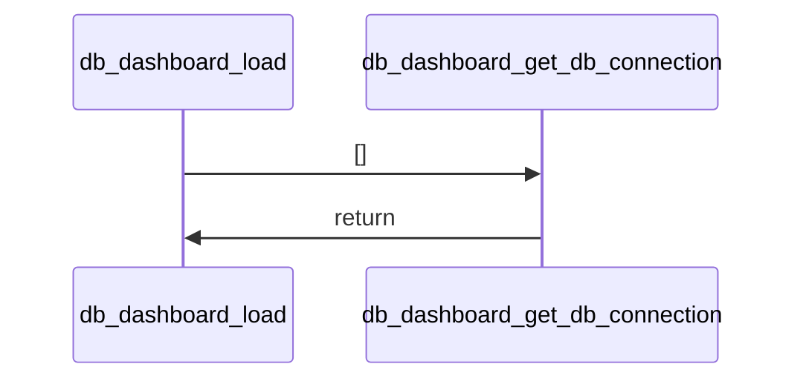
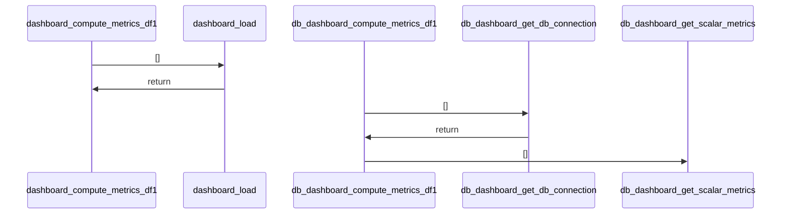
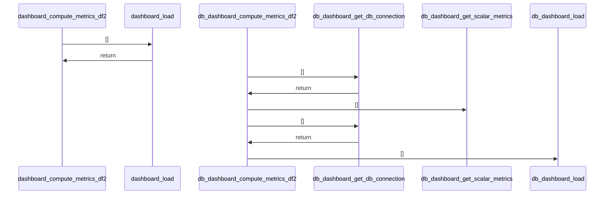
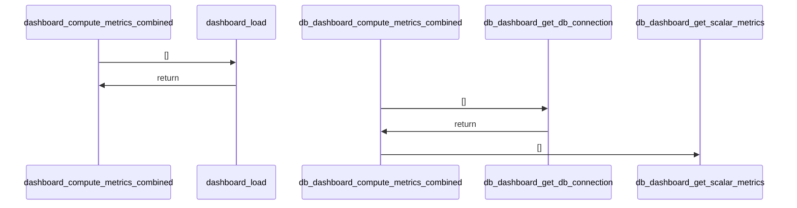
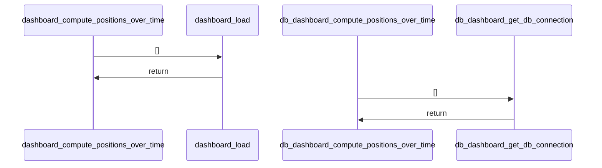
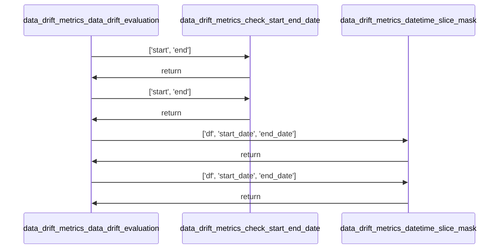
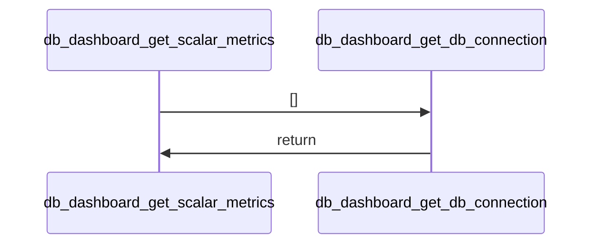
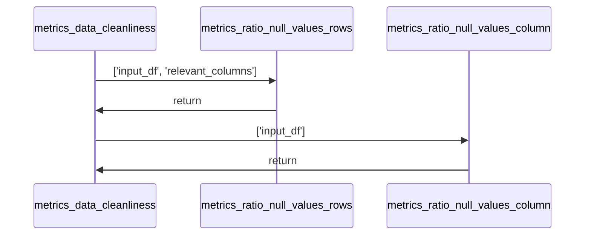

# Project Documentation: analytics-application-development-uni

## 1. Project Overview [Can be accessed under 'basic_info'.]
    - **Description:** Information not found
    - **Key Features:** 
      - Information not found
    - **Tech Stack:** Information not found
*   **Repository Structure:**
    ```mermaid
    graph LR
        root --> streamlit_config[".streamlit" <br/> config.toml]
        root --> app_pages[app_pages <br/> __init__.py <br/> page1.py <br/> page2.py <br/> page3.py <br/> page4.py <br/> page5.py]
        root --> assets[assets <br/> logo.png]
        root --> notebooks[Notizen <br/> Analytics Application Development.md <br/> Dokumentation AAD.md <br/> Meeting_17-11-25.md]
        root --> other_files[.DS_Store <br/> .gitignore <br/> Notebook.ipynb <br/> build_db.py <br/> dashboard.py <br/> data_cleaning.py <br/> data_drift.py <br/> data_drift_metrics.py <br/> data_exploration.py <br/> data_exploration2.py <br/> db_dashboard.py <br/> metrics.py <br/> requirements.txt]
    ```

    ## 2. Installation (can be accessed under 'basic_info')
    ### Dependencies
    - altair==5.5.0
    - attrs==25.4.0
    - blinker==1.9.0
    - cachetools==6.2.2
    - certifi==2025.11.12
    - charset-normalizer==3.4.4
    - click==8.3.1
    - colorama==0.4.6
    - gitdb==4.0.12
    - GitPython==3.1.45
    - idna==3.11
    - Jinja2==3.1.6
    - jsonschema==4.25.1
    - jsonschema-specifications==2025.9.1
    - MarkupSafe==3.0.3
    - narwhals==2.12.0
    - numpy==2.3.5
    - packaging==25.0
    - pandas==2.3.3
    - pillow==12.0.0
    - protobuf==6.33.1
    - pyarrow==21.0.0
    - pydeck==0.9.1
    - python-dateutil==2.9.0.post0
    - pytz==2025.2
    - referencing==0.37.0
    - requests==2.32.5
    - rpds-py==0.29.0
    - scipy==1.16.3
    - six==1.17.0
    - smmap==5.0.2
    - streamlit==1.51.0
    - streamlit-option-menu==0.4.0
    - tenacity==9.1.2
    - toml==0.10.2
    - tornado==6.5.2
    - typing_extensions==4.15.0
    - tzdata==2025.2
    - urllib3==2.5.0
    - watchdog==6.0.0
    - sentence-transformers
    - torch torchvision --index-url https://download.pytorch.org/whl/cu126
    - duckdb
    **Note:** pip install -r requirements.txt
### Setup Guide
Information not found
### Quick Startup
Information not found

## 3. Use Cases & Commands
This project appears to be a Streamlit application designed for analytics and data exploration. The application is structured into multiple pages, each likely focusing on a specific aspect of data analysis, such as:

*   **Page 1:** Displays key performance indicators (KPIs) and data quality metrics, including null value ratios and error frequencies.
*   **Page 2:** Focuses on specific data issues like time value errors and large order values, presenting them with detailed dataframes.
*   **Page 3:** Visualizes data related to craftspeople and trades, including outlier analysis and test dataset counts.
*   **Page 4:** Presents plausibility checks and various metrics for both order and position data, highlighting potential discrepancies.
*   **Page 5:** A placeholder page, currently displaying only a title.

The core functionality seems to involve loading data (from Parquet files or a DuckDB database), computing various metrics using the `metrics` module, and displaying these metrics and data visualizations using Streamlit. The `dashboard.py` and `db_dashboard.py` scripts appear to be the main entry points for running the application, orchestrating data loading, metric computation, and page rendering.

## 4. Architecture
```mermaid
graph TD
```
Information not found

## 5. Code Analysis
### File: `app_pages/page1.py`

#### Function: `show_page`
*   **Signature:** `def show_page(df, df2, metrics_df1, metrics_df2, metrics_combined)`
*   **Description:** The function 'show_page' displays key performance indicators (KPIs) and visualizes data quality metrics using Streamlit components. It calculates and presents various statistics such as row counts, null value ratios, and unique ID checks for two datasets. Additionally, it generates two charts: one showing the top null value ratios per column and another displaying error frequency by weekday and hour. The function relies on external metric dictionaries and helper functions to compute these values.
*   **Parameters:**
    *   **df** (`DataFrame`): The first dataset containing order information.
    *   **df2** (`DataFrame`): The second dataset containing position information.
    *   **metrics_df1** (`dict`): A dictionary containing metrics related to the first dataset.
    *   **metrics_df2** (`dict`): A dictionary containing metrics related to the second dataset.
    *   **metrics_combined** (`dict`): A dictionary containing combined metrics for both datasets.
*   **Returns:** None
*   **Usage:**
    *   Calls: `metrics.ratio_null_values_rows`

### File: `app_pages/page2.py`

#### Function: `show_page`
*   **Signature:** `def show_page(df, df2, metrics_df1, metrics_df2, metrics_combined)`
*   **Description:** The function 'show_page' displays data and metrics related to time value errors and orders exceeding 50,000 EUR on a Streamlit web page. It retrieves or calculates various metrics from provided dataframes and presents them using Streamlit components such as metrics, dataframes, and markdown separators. The function uses helper functions from the 'metrics' module to compute specific values like time value errors and counts of large orders.
*   **Parameters:**
    *   **df** (`pandas.DataFrame`): The main dataframe containing general data.
    *   **df2** (`pandas.DataFrame`): A secondary dataframe, possibly used for additional data processing or comparison.
    *   **metrics_df1** (`dict`): A dictionary containing pre-computed metrics or fallback values for time value errors and large orders.
    *   **metrics_df2** (`dict`): A dictionary containing additional metrics, though not directly used in the function body.
    *   **metrics_combined** (`dict`): A dictionary containing combined metrics, specifically used for retrieving order reconciliation data.
*   **Returns:** None
*   **Usage:**
    *   Calls: `metrics.above_50k`, `metrics.check_zeitwert`

### File: `app_pages/page3.py`

#### Function: `show_page`
*   **Signature:** `def show_page(df, df2, metrics_df1, metrics_df2, metrics_combined)`
*   **Description:** The function 'show_page' displays data related to handwerker (craftspeople) and gewerke (trades) using Streamlit components. It retrieves specific metrics from 'metrics_df1' and presents them as KPIs and dataframes in a Streamlit layout. The function organizes the display into columns for metrics and charts, focusing on outlier data and test dataset counts.
*   **Parameters:**
    *   **df** (`Any`): A dataframe containing general data, although not directly used in the function.
    *   **df2** (`Any`): A second dataframe, not used directly in the function.
    *   **metrics_df1** (`Dict[str, Any]`): A dictionary containing metric data, including keys like 'handwerker_gewerke_outlier' and 'test_kundengruppen_anzahl'.
    *   **metrics_df2** (`Any`): A second metrics dataframe, not used directly in the function.
    *   **metrics_combined** (`Any`): A combined metrics dataframe, not used directly in the function.
*   **Returns:** None
*   **Usage:**

### File: `app_pages/page4.py`

#### Function: `show_page`
*   **Signature:** `def show_page(df, df2, metrics_df1, metrics_df2, metrics_combined)`
*   **Description:** The function 'show_page' displays various plausibility and metric-related data from two datasets (df and df2) and their corresponding metrics dataframes (metrics_df1 and metrics_df2). It extracts specific metrics such as plausibility counts, average differences, and error flags, then visualizes them using Streamlit components like 'st.metric' and 'st.columns'. The function also handles default fallbacks for missing keys in the metrics dataframes by calling helper functions from the 'metrics' module.
*   **Parameters:**
    *   **df** (`Any`): First dataset containing order data.
    *   **df2** (`Any`): Second dataset containing position data.
    *   **metrics_df1** (`Dict[str, Any]`): Metrics dataframe related to order data.
    *   **metrics_df2** (`Dict[str, Any]`): Metrics dataframe related to position data.
    *   **metrics_combined** (`Any`): Combined metrics dataframe (not directly used in the function body).
*   **Returns:** None
*   **Usage:**
    *   Calls: `metrics.discount_check`, `metrics.false_negative_df`, `metrics.false_negative_df2`

### File: `app_pages/page5.py`

#### Function: `show_page`
*   **Signature:** `def show_page()`
*   **Description:** This function displays the content for Page 5 of a Streamlit application. It sets the title of the page to 'Page 5' using the Streamlit library. The function performs no complex logic or data processing; it simply renders a static title on the page.
*   **Parameters:** None
*   **Returns:** None
*   **Usage:**

### File: `build_db.py`
*Analysis data not available for this component.*
### File: `dashboard.py`

#### Function: `load`
   **Sequence diagram for load**

*   **Signature:** `def load()`
*   **Description:** This function loads two pandas DataFrames from Parquet files located at 'resources/Auftragsdaten_konvertiert' and 'resources/Positionsdaten_konvertiert'. It reads the data using pandas' read_parquet method and returns both DataFrames as a tuple. The function serves as a data loading utility for dashboard components.
*   **Parameters:** None
*   **Returns:**
    *   **df** (`DataFrame`): The first DataFrame loaded from the 'Auftragsdaten_konvertiert' Parquet file.
    *   **df2** (`DataFrame`): The second DataFrame loaded from the 'Positionsdaten_konvertiert' Parquet file.
*   **Usage:**

#### Function: `compute_metrics_df1`
   **Sequence diagram for compute_metrics_df1**

*   **Signature:** `def compute_metrics_df1()`
*   **Description:** This function computes a comprehensive set of metrics for a DataFrame named 'df1' (Auftragsdaten). It performs various data quality checks, statistical calculations, and anomaly detection tasks using helper functions from the 'metrics' module. The function measures execution time for each operation and prints progress updates. It aggregates results into a dictionary and returns it.
*   **Parameters:** None
*   **Returns:**
    *   **metrics_df1** (`dict`): A dictionary containing various computed metrics such as row counts, null value ratios, plausibility checks, data cleanliness ratios, proforma documents, error frequencies, and outlier information.
*   **Usage:**
    *   Calls: `dashboard.load`, `metrics.Kundengruppe_containing_test`, `metrics.above_50k`, `metrics.allgemeine_statistiken_num`, `metrics.check_keywords_vectorized`, `metrics.check_zeitwert`, `metrics.count_rows`, `metrics.data_cleanliness`, `metrics.error_frequency_by_weekday_hour`, `metrics.false_negative_df`, `metrics.handwerker_gewerke_outlier`, `metrics.plausibilitaetscheck_forderung_einigung`, `metrics.proformabelege`, `metrics.ratio_null_values_column`, `metrics.ratio_null_values_rows`

#### Function: `compute_metrics_df2`
   **Sequence diagram for compute_metrics_df2**

*   **Signature:** `def compute_metrics_df2()`
*   **Description:** This function computes a set of descriptive and quality metrics for a DataFrame named 'df2', which contains position data. It loads the DataFrame using a helper function, performs various checks and calculations on the data, and returns a dictionary of these metrics. The function includes timing information to track execution duration and prints progress messages during computation.
*   **Parameters:** None
*   **Returns:**
    *   **metrics_df2** (`dict`): A dictionary containing various metrics computed for the df2 DataFrame, including row count, null value ratios, statistical summaries, discount check results, position counts, plausibility check results, and false negative counts.
*   **Usage:**
    *   Calls: `dashboard.load`, `metrics.allgemeine_statistiken_num`, `metrics.count_rows`, `metrics.discount_check`, `metrics.false_negative_df2`, `metrics.plausibilitaetscheck_forderung_einigung`, `metrics.position_count`, `metrics.ratio_null_values_column`, `metrics.ratio_null_values_rows`

#### Function: `compute_metrics_combined`
   **Sequence diagram for compute_metrics_combined**

*   **Signature:** `def compute_metrics_combined()`
*   **Description:** This function computes combined metrics that require data from two DataFrames. It loads the required data, performs uniqueness checks and order alignment calculations, and returns a dictionary containing these metrics. The function includes timing information to measure execution duration.
*   **Parameters:** None
*   **Returns:**
    *   **metrics_combined** (`dict`): A dictionary containing the computed combined metrics including uniqueness checks and order alignment results.
*   **Usage:**
    *   Calls: `dashboard.load`, `metrics.abgleich_auftraege`, `metrics.uniqueness_check`

#### Function: `compute_positions_over_time`
   **Sequence diagram for compute_positions_over_time**

*   **Signature:** `def compute_positions_over_time()`
*   **Description:** This function calculates the number of positions per order over time and returns the result as a DataFrame. It loads two datasets using a helper function, performs a computation using a metrics module, and prints timing information during execution. The function is designed to be cached, although caching behavior is not explicitly shown in the code.
*   **Parameters:** None
*   **Returns:**
    *   **positions_over_time_df** (`DataFrame`): A DataFrame containing the calculated positions per order over time.
*   **Usage:**
    *   Calls: `dashboard.load`, `metrics.positions_per_order_over_time`

### File: `data_cleaning.py`
*Analysis data not available for this component.*
### File: `data_drift.py`

#### Function: `load_data`
   **Sequence diagram for load**

*   **Signature:** `def load_data()`
*   **Description:** This function generates a synthetic dataset representing daily sales data over a period of one year (2022-01-01 to 2023-12-31). It creates a DataFrame with three columns: 'datum' for dates, 'umsatz' for sales figures that gradually increase with some random noise, and 'kunden' for customer counts. The function uses pandas for date range creation and DataFrame construction, and numpy for generating linearly increasing values and random noise.
*   **Parameters:** None
*   **Returns:**
    *   **df** (`DataFrame`): A pandas DataFrame containing synthetic sales data with columns 'datum', 'umsatz', and 'kunden'.
*   **Usage:**

#### Function: `filterby_timeframe`
*   **Signature:** `def filterby_timeframe(input_df, start_date, end_date)`
*   **Description:** The function filters a pandas DataFrame based on a specified date range. It converts the input start and end dates into datetime objects and applies a boolean mask to select rows where the 'datum' column falls within the given timeframe. The filtered DataFrame is then returned.
*   **Parameters:**
    *   **input_df** (`DataFrame`): The input pandas DataFrame that contains the data to be filtered.
    *   **start_date** (`str or datetime-like`): The starting date of the desired time range, which will be converted to a datetime object.
    *   **end_date** (`str or datetime-like`): The ending date of the desired time range, which will be converted to a datetime object.
*   **Returns:**
    *   **filtered_df** (`DataFrame`): A pandas DataFrame containing only the rows where the 'datum' column is within the specified date range.
*   **Usage:**

#### Function: `get_drift_stats`
*   **Signature:** `def get_drift_stats(input_df, frequency)`
*   **Description:** The function computes statistical measures (mean, median, standard deviation, minimum, and maximum) for two columns ('umsatz' and 'kunden') grouped by a time frequency. It takes an input DataFrame and a frequency parameter to group the data by time periods. The resulting statistics are organized into a flattened DataFrame with column names indicating the metric and variable.
*   **Parameters:**
    *   **input_df** (`DataFrame`): The input DataFrame containing at least the columns 'datum', 'umsatz', and 'kunden'.
    *   **frequency** (`str`): A frequency string used to group the data by time periods (e.g., 'D' for daily, 'W' for weekly).
*   **Returns:**
    *   **stats_df** (`DataFrame`): A DataFrame containing aggregated statistics for 'umsatz' and 'kunden' grouped by the specified frequency.
*   **Usage:**

#### Function: `slicing`
*   **Signature:** `def slicing(input_df, frequency)`
*   **Description:** The function 'slicing' creates individual slices from an input DataFrame based on a specified frequency grouping. It groups the data by date using pandas' Grouper and iterates through the groups to build a dictionary of slices, keyed by formatted date labels. Each slice corresponds to a time period defined by the frequency parameter. In case of an exception during processing, it displays an error message using Streamlit and returns an empty dictionary.
*   **Parameters:**
    *   **input_df** (`DataFrame`): The input DataFrame containing the data to be sliced.
    *   **frequency** (`str`): The frequency string used to group the data by date, such as 'D' for daily or 'M' for monthly.
*   **Returns:**
    *   **slices** (`dict`): A dictionary where keys are formatted date strings and values are the corresponding grouped DataFrames.
*   **Usage:**

### File: `data_drift_metrics.py`

#### Function: `load`
   **Sequence diagram for load**

*   **Signature:** `def load()`
*   **Description:** This function loads two datasets from Parquet files, sorts them by a timestamp column, and merges them based on a common identifier. It returns both the sorted original dataset and the merged dataset. The function performs data loading, sorting, and merging operations using pandas.
*   **Parameters:** None
*   **Returns:**
    *   **df** (`DataFrame`): The first loaded DataFrame sorted by CRMEingangszeit in ascending order.
    *   **df2** (`DataFrame`): The second loaded DataFrame merged with selected columns from the first DataFrame, also sorted by CRMEingangszeit in ascending order.
*   **Usage:**

#### Function: `check_start_end_date`
*   **Signature:** `def check_start_end_date(start, end)`
*   **Description:** This function serves as a helper to ensure chronological ordering of two datetime objects. It takes two datetime inputs, compares them, and swaps their order if necessary so that the first value is chronologically before or equal to the second. The function returns both values in chronological sequence.
*   **Parameters:**
    *   **start** (`datetime`): The assumed beginning of the interval.
    *   **end** (`datetime`): The assumed end of the interval.
*   **Returns:**
    *   **start** (`datetime`): The chronologically earlier datetime value.
    *   **end** (`datetime`): The chronologically later datetime value.
*   **Usage:**

#### Function: `datetime_slice_mask`
*   **Signature:** `def datetime_slice_mask(df, start_date, end_date)`
*   **Description:** This function filters a pandas DataFrame based on a specified date range and converts the resulting subset into an Evidently Dataset. It checks for specific column names to determine the appropriate data definition schema to use during conversion. The function assumes the presence of a 'CRMEingangszeit' column for datetime filtering.
*   **Parameters:**
    *   **df** (`pandas.DataFrame`): The input DataFrame to be filtered by datetime.
    *   **start_date** (`datetime`): The starting datetime for the filter range (inclusive).
    *   **end_date** (`datetime`): The ending datetime for the filter range (exclusive).
*   **Returns:**
    *   **sliced_ds** (`evidently.Dataset`): A sliced DataFrame converted to an Evidently Dataset, using either schema_df or schema_df2 depending on the presence of 'Kundengruppe' or 'Menge' columns.
*   **Usage:**

#### Function: `data_drift_evaluation`
   **Sequence diagram for data_drift_evaluation**

*   **Signature:** `def data_drift_evaluation(df, start_date_reference, end_date_reference, start_date_eval, end_date_eval)`
*   **Description:** This function evaluates data drift between two time-sliced datasets using the EvidentlyAI framework. It takes a DataFrame and four datetime parameters to define reference and evaluation periods. The function ensures chronological order of date ranges, slices the data accordingly, and generates a data drift report tailored to either an 'Auftragsdaten' or 'Positionsdaten' dataset based on column presence. The resulting HTML report is saved to disk for visualization.
*   **Parameters:**
    *   **df** (`pandas.DataFrame`): DataFrame to sample from
    *   **start_date_reference** (`datetime`): starting datetime of the reference, baseline dataset
    *   **end_date_reference** (`datetime`): ending datetime of the reference, baseline dataset
    *   **start_date_eval** (`datetime`): starting datetime of the evaluated dataset
    *   **end_date_eval** (`datetime`): starting datetime of the evaluated dataset
*   **Returns:** None
*   **Usage:**
    *   Calls: `data_drift_metrics.check_start_end_date`, `data_drift_metrics.datetime_slice_mask`

### File: `data_exploration.py`

#### Function: `load`
   **Sequence diagram for load**

*   **Signature:** `def load()`
*   **Description:** This function loads two pandas DataFrames from Parquet files located at specific resource paths. It reads data from 'resources/Auftragsdaten_konvertiert' and 'resources/Positionsdaten_konvertiert', returning both DataFrames as a tuple. The function serves as a data loading utility for subsequent processing or analysis tasks.
*   **Parameters:** None
*   **Returns:**
    *   **df** (`DataFrame`): The first DataFrame loaded from the 'Auftragsdaten_konvertiert' Parquet file.
    *   **df2** (`DataFrame`): The second DataFrame loaded from the 'Positionsdaten_konvertiert' Parquet file.
*   **Usage:**

### File: `data_exploration2.py`
*Analysis data not available for this component.*
### File: `db_dashboard.py`

#### Function: `get_db_connection`
*   **Signature:** `def get_db_connection()`
*   **Description:** This function establishes a read-only connection to a DuckDB database using a predefined database path. It is designed to provide a simple interface for accessing the database in a read-only mode, ensuring data integrity by preventing modifications. The function does not take any parameters and directly returns the database connection object.
*   **Parameters:** None
*   **Returns:**
    *   **connection** (`duckdb.Connection`): A read-only connection object to the DuckDB database.
*   **Usage:**

#### Function: `load`
   **Sequence diagram for load**

*   **Signature:** `def load()`
*   **Description:** This function retrieves two dataframes from a DuckDB database by executing SQL queries on the 'auftragsdaten' and 'positionsdaten' tables. It establishes a database connection, performs the queries, and returns the resulting dataframes. The function ensures proper resource management by closing the connection in a finally block.
*   **Parameters:** None
*   **Returns:**
    *   **df** (`pandas.DataFrame`): The dataframe containing data from the 'auftragsdaten' table.
    *   **df2** (`pandas.DataFrame`): The dataframe containing data from the 'positionsdaten' table.
*   **Usage:**
    *   Calls: `db_dashboard.get_db_connection`

#### Function: `get_scalar_metrics`
   **Sequence diagram for get_scalar_metrics**

*   **Signature:** `def get_scalar_metrics()`
*   **Description:** This function serves as a helper to retrieve a single row of scalar metrics from a database table named 'scalar_metrics'. It establishes a database connection, executes a query to fetch all records, converts the result into a pandas DataFrame, and returns the first row of that DataFrame. The function ensures proper resource management by closing the database connection in a finally block.
*   **Parameters:** None
*   **Returns:**
    *   **result** (`pandas.Series`): A pandas Series representing the first row of the 'scalar_metrics' table.
*   **Usage:**
    *   Calls: `db_dashboard.get_db_connection`

#### Function: `compute_metrics_df1`
   **Sequence diagram for compute_metrics_df1**

*   **Signature:** `def compute_metrics_df1()`
*   **Description:** This function retrieves and processes various data quality metrics for the 'df1' dataset (Auftragsdaten) from a database. It establishes a database connection, executes multiple SQL queries to fetch different metric tables, performs data transformations such as setting indices and converting dataframes to dictionaries, and aggregates all retrieved data into a single dictionary. The function measures execution time and ensures proper resource cleanup by closing the database connection in a finally block.
*   **Parameters:** None
*   **Returns:**
    *   **metrics_df1** (`dict`): A dictionary containing various data quality metrics for the 'df1' dataset, including row counts, null ratios, statistical summaries, plausibility checks, grouped cleanliness metrics, proforma documents, error frequencies, and semantic mismatches.
*   **Usage:**
    *   Calls: `db_dashboard.get_db_connection`, `db_dashboard.get_scalar_metrics`

#### Function: `compute_metrics_df2`
   **Sequence diagram for compute_metrics_df2**

*   **Signature:** `def compute_metrics_df2()`
*   **Description:** This function computes a comprehensive set of metrics for the 'df2' dataset, specifically related to 'Positionsdaten'. It retrieves data from a database, performs various aggregations and calculations, and returns a dictionary containing multiple metric values. The function handles database connections, executes SQL queries, and processes the resulting dataframes to extract meaningful statistics.
*   **Parameters:** None
*   **Returns:**
    *   **metrics_df2** (`dict`): A dictionary containing various computed metrics for the 'df2' dataset including row counts, null ratios, statistical summaries, and plausibility checks.
*   **Usage:**
    *   Calls: `db_dashboard.get_db_connection`, `db_dashboard.get_scalar_metrics`, `db_dashboard.load`

#### Function: `compute_metrics_combined`
   **Sequence diagram for compute_metrics_combined**

*   **Signature:** `def compute_metrics_combined()`
*   **Description:** This function retrieves combined metrics from a database by first establishing a connection and fetching scalar metrics. It then executes a query to fetch data related to order position mismatches and constructs a dictionary containing boolean flags for uniqueness checks and the fetched DataFrame. Finally, it prints the loading duration and returns the constructed metrics dictionary.
*   **Parameters:** None
*   **Returns:**
    *   **metrics_combined** (`dict`): A dictionary containing boolean flags indicating whether certain IDs are unique and a DataFrame with order position mismatch data.
*   **Usage:**
    *   Calls: `db_dashboard.get_db_connection`, `db_dashboard.get_scalar_metrics`

#### Function: `compute_positions_over_time`
   **Sequence diagram for compute_positions_over_time**

*   **Signature:** `def compute_positions_over_time()`
*   **Description:** This function retrieves position data over time from a database table named 'metric_positions_over_time'. It establishes a database connection, executes a SELECT query to fetch all records, and returns the result as a pandas DataFrame. The function also measures and prints the execution time for performance monitoring.
*   **Parameters:** None
*   **Returns:**
    *   **df_pos_time** (`pandas.DataFrame`): A DataFrame containing all rows from the 'metric_positions_over_time' table.
*   **Usage:**
    *   Calls: `db_dashboard.get_db_connection`

### File: `metrics.py`

#### Function: `load_data`
   **Sequence diagram for load**

*   **Signature:** `def load_data()`
*   **Description:** This function loads two datasets from Parquet files located at 'resources/Auftragsdaten_konvertiert' and 'resources/Positionsdaten_konvertiert'. It uses pandas to read these files into DataFrame objects and returns both DataFrames as a tuple. The function serves as a data loading utility for subsequent processing steps.
*   **Parameters:** None
*   **Returns:**
    *   **df** (`DataFrame`): The first DataFrame loaded from the 'Auftragsdaten_konvertiert' Parquet file.
    *   **df2** (`DataFrame`): The second DataFrame loaded from the 'Positionsdaten_konvertiert' Parquet file.
*   **Usage:**

#### Function: `ratio_null_values_column`
*   **Signature:** `def ratio_null_values_column(input_df)`
*   **Description:** This function computes the ratio of null values for each column in a given pandas DataFrame. It calculates the percentage of missing data per column and returns the results in a new DataFrame. The implementation uses vectorized operations with pandas' built-in methods for efficiency.
*   **Parameters:**
    *   **input_df** (`pandas.DataFrame`): DataFrame that is to be evaluated for null value ratios.
*   **Returns:**
    *   **null_ratio_df** (`pd.DataFrame`): DataFrame containing two columns: 'index' (representing column names) and 'null_ratio' (the percentage of null entries in each column).
*   **Usage:**

#### Function: `ratio_null_values_rows`
*   **Signature:** `def ratio_null_values_rows(input_df, relevant_columns=None)`
*   **Description:** "This function computes the ratio of rows containing at least one null value in a given DataFrame, either across all columns or a subset of specified columns. It takes a pandas DataFrame as input and optionally filters columns based on a provided list. The result is expressed as a percentage of rows with null values relative to the total number of rows in the dataset."
*   **Parameters:**
    *   **input_df** (`pandas.DataFrame`): DataFrame that is to be evaluated.
    *   **relevant_columns** (`list`): List of column identifiers; function will only evaluate these columns, by default None.
*   **Returns:**
    *   **row_ratio** (`float`): Percentage value of rows with at least one null value in the given columns.
*   **Usage:**

#### Function: `Kundengruppe_containing_test`
*   **Signature:** `def Kundengruppe_containing_test(df, return_frame=False)`
*   **Description:** "This function evaluates a pandas DataFrame to determine the number of rows where the 'Kundengruppe' column contains the substring 'test', ignoring case and treating missing values as non-matching. It optionally returns a filtered DataFrame of those matching rows. The function uses string operations on the DataFrame to identify test data based on naming conventions."
*   **Parameters:**
    *   **df** (`pandas.DataFrame`): The 'Auftragsdaten'-DataFrame that is to be evaluated.
    *   **return_frame** (`bool`): If True, this function returns a DataFrame with all found test data; otherwise, only the count is returned.
*   **Returns:**
    *   **anzahl_test** (`int`): Total number of test data rows.
    *   **test_Kundengruppen** (`pandas.DataFrame or None`): DataFrame containing all found test data, returned only if return_frame = True.
*   **Usage:**

#### Function: `allgemeine_statistiken_num`
*   **Signature:** `def allgemeine_statistiken_num(input_df)`
*   **Description:** "This function computes basic statistical measures (mean, median, standard deviation, minimum, and maximum) for all numeric columns in a given pandas DataFrame. It iterates through the numeric columns, calculates these statistics, and stores them in a nested dictionary structure keyed by column names. The function returns a dictionary where each key corresponds to a numeric column, and the value is another dictionary containing the computed statistics."
*   **Parameters:**
    *   **input_df** (`pandas.DataFrame`): DataFrame that is to be evaluated.
*   **Returns:**
    *   **statistiken** (`dict`): nested dictionary containing a dictionary for each column of input_df of the following form: {mean= float, median= float, std= float, min= float, max= float}
*   **Usage:**

#### Function: `plausibilitaetscheck_forderung_einigung`
*   **Signature:** `def plausibilitaetscheck_forderung_einigung(input_df)`
*   **Description:** "This function performs a plausibility check on a DataFrame by comparing the 'Einigung_Netto' and 'Forderung_Netto' columns. It identifies rows where the 'Einigung_Netto' value exceeds the 'Forderung_Netto' value, assuming this as a significant error. The function calculates the difference between these values for all such rows, computes the average of these differences, and returns the differences, their count, and the average."
*   **Parameters:**
    *   **input_df** (`pandas.DataFrame`): DataFrame that is to be evaluated.
*   **Returns:**
    *   **statistik** (`pandas.Series`): A list of all differences >0 as float values
    *   **count** (`int`): Total number of rows with difference >0
    *   **avg** (`float`): Average difference over all found instances
*   **Usage:**

#### Function: `uniqueness_check`
*   **Signature:** `def uniqueness_check(df, df2)`
*   **Description:** "The function 'uniqueness_check' verifies the uniqueness of specific ID columns across two pandas DataFrames. It takes two DataFrames as inputs, one containing 'Auftragsdaten' data and another containing 'Positionsdaten' data. For each DataFrame, it checks whether the respective ID columns ('KvaRechnung_ID' and 'Position_ID') contain only unique values. The function returns a tuple of boolean values indicating the uniqueness status of these columns."
*   **Parameters:**
    *   **df** (`pandas.DataFrame`): DataFrame that contains the 'Auftragsdaten' data set
    *   **df2** (`pandas.DataFrame`): DataFrame that contains the 'Positionsdaten' data set
*   **Returns:**
    *   **kvarechnung_id_is_unique** (`bool`): True if column is unique.
    *   **position_id_is_unique** (`bool`): True if column is unique.
*   **Usage:**

#### Function: `count_rows`
*   **Signature:** `def count_rows(input_df)`
*   **Description:** "This function serves as a helper utility to determine the number of rows present in a given pandas DataFrame. It takes a DataFrame as input, calculates its length using the built-in `len()` function, and returns the resulting count. The function is designed to be simple and straightforward, focusing solely on row counting without any filtering or additional processing."
*   **Parameters:**
    *   **input_df** (`pandas.DataFrame`): DataFrame to be evaluated.
*   **Returns:**
    *   **count** (`int`): The number of rows in the input DataFrame.
*   **Usage:**

#### Function: `split_dataframe`
*   **Signature:** `def split_dataframe(input_df, chunks=5)`
*   **Description:** "The function splits a given pandas DataFrame into a specified number of chunks using numpy's array_split method. It is intended to simulate time series data by dividing the dataset into segments. The function is marked as deprecated, indicating it has been superseded by the addition of datetime columns."
*   **Parameters:**
    *   **input_df** (`pandas.DataFrame`): The input DataFrame to be split into multiple chunks.
    *   **chunks** (`int`): The number of chunks to split the DataFrame into. Defaults to 5.
*   **Returns:**
    *   **split_result** (`numpy.ndarray`): An array of DataFrames resulting from splitting the input DataFrame.
*   **Usage:**

#### Function: `data_cleanliness`
   **Sequence diagram for data_cleanliness**

*   **Signature:** `def data_cleanliness(input_df, group_by_col=None, specific_group=None)`
*   **Description:** "The function evaluates the cleanliness of a pandas DataFrame by calculating the ratio of null values both per column and per row. It supports optional grouping by a specified column to perform these calculations on subsets of the data. When no grouping is applied, it returns overall null ratios for rows and columns. When grouping is applied, it computes grouped null value ratios for both rows and columns, optionally filtering results for a specific group."
*   **Parameters:**
    *   **input_df** (`pandas.DataFrame`): DataFrame that is to be evaluated.
    *   **group_by_col** (`string`): Column identifier for grouping, defaults to None
    *   **specific_group** (`string`): Passes a group entry to filter the result by, if any; defaults to None
*   **Returns:**
    *   **null_ratio_rows** (`float or None`): Percentage value of rows with at least one null value in the given columns.
    *   **null_ratio_cols** (`DataFrame or None`): DataFrame, with null_ratio being the percentage amount of null entries in the column.
    *   **grouped_row_ratios** (`pandas.Series or None`): Series containing the row ratios of all groups as float.
    *   **grouped_col_ratios** (`pandas.DataFrame or None`): DataFrame containing groups and null-value-ratios per column for each.
*   **Usage:**
    *   Calls: `metrics.ratio_null_values_column`, `metrics.ratio_null_values_rows`

#### Function: `groupby_col`
*   **Signature:** `def groupby_col(input_df, col)`
*   **Description:** "This function serves as a helper to group a pandas DataFrame by a specified column. It takes an input DataFrame and a column identifier, then applies the pandas groupby operation on that column with the 'observed' parameter set to True. The result is a grouped DataFrame object which can be used for further aggregation or analysis operations."
*   **Parameters:**
    *   **input_df** (`pandas.DataFrame`): DataFrame that is to be evaluated.
    *   **col** (`string`): Identifier of the column to be grouped by.
*   **Returns:**
    *   **input_df_grouped** (`pandas.DataFrame`): A grouped DataFrame.
*   **Usage:**

#### Function: `discount_check`
*   **Signature:** `def discount_check(df2)`
*   **Description:** "The function 'discount_check' evaluates a DataFrame containing 'Positionsdaten' data to identify rows that may have discrepancies between their 'Plausibel' status and the actual net values ('Einigung_Netto' and 'Forderung_Netto'). It counts the number of rows marked as not plausible, indicating potential errors in the dataset. The function uses a boolean mask to filter rows where the 'Plausibel' column is False and sums these occurrences to determine the count of potential errors."
*   **Parameters:**
    *   **df2** (`pandas.DataFrame`): DataFrame containing the 'Positionsdaten' dataset.
*   **Returns:**
    *   **potential_errors** (`int`): The number of potentially faulty rows based on the 'Plausibel' column.
*   **Usage:**

#### Function: `proformabelege`
*   **Signature:** `def proformabelege(df)`
*   **Description:** "This function evaluates a pandas DataFrame to identify rows that match specific criteria for pro forma receipts based on the 'Einigung_Netto' column. It filters the DataFrame to include only those rows where the 'Einigung_Netto' value is between 0.01 and 1, inclusive. The function then calculates the count of such rows and returns both the filtered DataFrame and the count as a tuple."
*   **Parameters:**
    *   **df** (`pandas.DataFrame`): DataFrame that is to be evaluated.
*   **Returns:**
    *   **proforma** (`pandas.DataFrame`): DataFrame containing all found pro forma receipt rows
    *   **proforma_count** (`int`): Amount of found receipts
*   **Usage:**

#### Function: `position_count`
*   **Signature:** `def position_count(input_df)`
*   **Description:** "This function takes a pandas DataFrame as input and groups the data by the 'KvaRechnung_ID' column to count the number of associated 'Position_ID' entries for each unique identifier. It then returns a new DataFrame containing the 'KvaRechnung_ID' and the corresponding count of positions, renamed to 'PositionsAnzahl'. The function leverages pandas groupby and count operations to perform the aggregation."
*   **Parameters:**
    *   **input_df** (`pandas.DataFrame`): DataFrame that is to be evaluated.
*   **Returns:**
    *   **position_count** (`pandas.DataFrame`): DataFrame with the columns 'KvaRechnung_ID' and the amount of associated positions.
*   **Usage:**

#### Function: `false_negative_df`
*   **Signature:** `def false_negative_df(df)`
*   **Description:** "This function evaluates a DataFrame containing 'Auftragsdaten' data to identify instances where, if at least two values among the three columns Forderung_Netto, Empfehlung_Netto, and Einigung_Netto are negative, the third value should also be negative. It counts how many entries fail this condition. The function uses boolean masking to determine which rows meet the criteria and sums up the mismatches across all three columns."
*   **Parameters:**
    *   **df** (`pandas.DataFrame`): DataFrame with 'Auftragsdaten' data set that is to be evaluated.
*   **Returns:**
    *   **error_count** (`int`): Number of entries in any of the three columns Forderung, Empfehlung or Einigung failing the check.
*   **Usage:**

#### Function: `false_negative_df2`
*   **Signature:** `def false_negative_df2(df2)`
*   **Description:** The function 'false_negative_df2' evaluates a pandas DataFrame containing 'Positionsdaten' data for entries in specific columns that fall outside of reasonable value ranges. It checks for negative values in several monetary and quantity-related columns and counts how many such invalid entries exist across all relevant columns. The function aggregates these counts and returns a total error count. This is useful for identifying potential data quality issues in financial or inventory datasets.
*   **Parameters:**
    *   **df2** (`pandas.DataFrame`): DataFrame containing 'Positionsdaten' data set that is to be evaluated.
*   **Returns:**
    *   **total_errors** (`int`): Total amount of non-valid entries aggregated over all relevant columns.
*   **Usage:**

#### Function: `above_50k`
*   **Signature:** `def above_50k(df)`
*   **Description:** "This function filters a pandas DataFrame to identify rows where the 'Einigung_Netto' column has values greater than or equal to 50,000. It is designed to flag potentially suspicious financial entries that may require manual review due to their high value. The function takes a DataFrame as input and returns a new DataFrame containing only the rows that meet the specified condition."
*   **Parameters:**
    *   **df** (`pandas.DataFrame`): DataFrame that is to be evaluated.
*   **Returns:**
    *   **suspicious_data** (`pandas.DataFrame`): Data frame containing suspiciously high positions
*   **Usage:**

#### Function: `outliers_by_damage`
*   **Signature:** `def outliers_by_damage(df, schadenart=None, set_quantile=0.99, column_choice='Forderung_Netto')`
*   **Description:** "This function identifies outliers in a specified numerical column of a pandas DataFrame based on a given quantile range, considering different damage types. It calculates symmetric upper and lower bounds for each group defined by 'Schadenart_Name' and filters rows that fall outside these bounds. The function allows filtering by a specific damage type and supports custom column selection for outlier detection."
*   **Parameters:**
    *   **df** (`pandas.DataFrame`): DataFrame to be evaluated
    *   **schadenart** (`string`): specific damage type label to filter for, by default None
    *   **set_quantile** (`float`): desired quantile range, symmetric upper/lower bound is inferred, by default 0.99
    *   **column_choice** (`str`): numeric column containing outliers, by default 'Forderung_Netto'
*   **Returns:**
    *   **df_outlier** (`pandas.DataFrame`): df containing all suspicious rows
*   **Usage:**

#### Function: `check_zeitwert`
*   **Signature:** `def check_zeitwert(df)`
*   **Description:** The function 'check_zeitwert' evaluates whether the values in the column 'Differenz_vor_Zeitwert_Netto' satisfy a specific condition related to 'Zeitwert = Forderung-Einigung'. It computes the relative error by comparing the difference between 'Forderung_Netto' and 'Einigung_Netto' with the 'Differenz_vor_Zeitwert_Netto'. This function is intended for use with 'Auftragsdaten' datasets. The result is a pandas Series containing only the non-zero error values.
*   **Parameters:**
    *   **df** (`_pandas.DataFrame`): DataFrame containing 'Auftragsdaten' data set that is to be evaluated.
*   **Returns:**
    *   **zeitwert_error** (`pandas.Series`): Series of all error values (float) found in the data frame
*   **Usage:**

#### Function: `positions_per_order_over_time`
*   **Signature:** `def positions_per_order_over_time(df, df2, time_col="CRMEingangszeit")`
*   **Description:** "The function calculates the average number of positions per order for each month based on two input DataFrames. It first counts the number of positions associated with each order ID in the second DataFrame, then merges this information with the first DataFrame to associate orders with their respective position counts. The function aggregates these counts by month, computing mean, sum, and count of positions per order. Finally, it computes the percentage growth rate of the average positions per order over time."
*   **Parameters:**
    *   **df** (`DataFrame`): Auftragsdaten mit Spalte 'KvaRechnung_ID' und einer Zeitspalte.
    *   **df2** (`DataFrame`): Positionsdaten mit Spalten 'KvaRechnung_ID' und 'Position_ID'.
    *   **time_col** (`str`): Name der Zeitspalte in orders_df (z.B. 'CRMEingangszeit').
*   **Returns:**
    *   **result** (`DataFrame`): DataFrame mit Spalten: 'Zeitperiode', 'Avg_Positionen_pro_Auftrag', 'Total_Positionen', 'Anzahl_Auftraege', 'Growth_rate_%'
*   **Usage:**

#### Function: `error_frequency_by_weekday_hour`
*   **Signature:** `def error_frequency_by_weekday_hour(df, time_col="CRMEingangszeit", relevant_columns=None)`
*   **Description:** "Die Funktion aggregiert die Fehlerhäufigkeit (NaN-Werte) in einem DataFrame nach Wochentag und Stunde. Ein Auftrag gilt als fehlerhaft, wenn in mindestens einer der relevanten Spalten ein NaN-Wert vorkommt. Sie wandelt die Zeitspalte in ein Datetime-Format um, extrahiert Wochentag und Stunde, bestimmt relevante Spalten zur Prüfung auf NaN-Werte und berechnet anschließend eine Fehlerquote pro Zeitslot. Das Ergebnis ist ein DataFrame mit den Spalten 'weekday', 'hour', 'total_rows', 'error_rows' und 'error_rate'."
*   **Parameters:**
    *   **df** (`pandas.DataFrame`): Auftragsdaten-DataFrame (z.B. Auftragsdaten_konvertiert), muss 'KvaRechnung_ID' und die Zeitspalte enthalten.
    *   **time_col** (`string`): Name der Zeitspalte in df, z.B. 'CRMEingangszeit'.
    *   **relevant_columns** (`list`): Liste der Spalten, die auf NaN geprüft werden sollen. Wenn None -> alle Spalten außer 'KvaRechnung_ID' und time_col.
*   **Returns:**
    *   **result** (`pandas.DataFrame`): DataFrame mit Spalten: 'weekday' (Name des Wochentags), 'hour' (Stunde), 'total_rows' (Anzahl Aufträge in diesem Zeit-Slot), 'error_rows' (Anzahl fehlerhafter Aufträge in diesem Slot), 'error_rate' (Fehlerquote in Prozent).
*   **Usage:**

#### Function: `get_mismatched_entries`
*   **Signature:** `def get_mismatched_entries(df, threshold=0.2)`
*   **Description:** The function computes similarity scores between pairs of 'Gewerk_Name' and 'Handwerker_Name' entries in a DataFrame using sentence embeddings. It leverages a pre-trained multilingual model to encode the text and calculates cosine distances to determine similarity. Entries with similarity scores below a given threshold are identified as mismatches and returned sorted by similarity score.
*   **Parameters:**
    *   **df** (`DataFrame`): A pandas DataFrame containing columns 'Gewerk_Name' and 'Handwerker_Name' to compare.
    *   **threshold** (`float`): A float value representing the minimum similarity score threshold below which entries are considered mismatches. Default is 0.2.
*   **Returns:**
    *   **mismatches** (`DataFrame`): A copy of the input DataFrame filtered to include only rows where the similarity score is less than the specified threshold, sorted in ascending order of similarity score.
*   **Usage:**

#### Function: `handwerker_gewerke_outlier`
*   **Signature:** `def handwerker_gewerke_outlier(df)`
*   **Description:** This function processes a DataFrame to identify outliers in the relationship between craftsmen and their specialties (Gewerke). It calculates the ratio of each specialty per craftsman and flags those specialties as outliers if they represent less than 20% of the craftsman's total specialties and the craftsman has more than one specialty. The function filters out missing values and returns a DataFrame with the results.
*   **Parameters:**
    *   **df** (`DataFrame`): A pandas DataFrame containing columns 'Handwerker_Name' and 'Gewerk_Name'.
*   **Returns:**
    *   **stats** (`DataFrame`): A pandas DataFrame containing the processed data including counts, ratios, and outlier flags.
*   **Usage:**

#### Function: `check_keywords_vectorized`
*   **Signature:** `def check_keywords_vectorized(df)`
*   **Description:** "This function performs keyword-based validation of trade names in a DataFrame by mapping predefined keywords to specific trades. It checks whether the 'Handwerker_Name' column contains keywords associated with the 'Gewerk_Name' column. If a match is found, it confirms the trade; otherwise, it flags conflicts or indicates no keyword information. The function uses vectorized string operations for efficiency."
*   **Parameters:**
    *   **df** (`DataFrame`): A pandas DataFrame containing columns 'Handwerker_Name' and 'Gewerk_Name' to be validated.
*   **Returns:**
    *   **final_result** (`ndarray`): An array of strings indicating the result of the keyword validation for each row: 'CONFIRMED_BY_NAME', 'CONFLICT_WITH_<TRADE>', or 'NO_KEYWORD_INFO'.
*   **Usage:**

#### Function: `abgleich_auftraege`
*   **Signature:** `def abgleich_auftraege(df1, df2)`
*   **Description:** "Die Funktion 'abgleich_auftraege' vergleicht die Kopfdaten von Aufträgen (df1) mit der Summe ihrer Positionen (df2). Sie gruppiert die Positionsdaten nach 'Kva_RechnungID', bildet die Summen für 'Forderung_Netto' und 'Einigung_Netto', und vergleicht diese mit den Werten in df1. Die Funktion berücksichtigt Gleitkommagenauigkeitsunterschiede durch den Einsatz von np.isclose. Sie gibt einen DataFrame mit den IDs und Differenzen zurück, bei denen die Werte nicht übereinstimmen."
*   **Parameters:**
    *   **df1** (`pd.DataFrame`): Dataframe mit den Auftragsdaten (Soll-Werte). Muss folgende Spalten enthalten: 'Kva_RechnungID', 'Forderung_Netto', 'Einigung_Netto'.
    *   **df2** (`pd.DataFrame`): Dataframe mit den Positionsdaten (Ist-Werte). Muss folgende Spalten enthalten: 'Kva_RechnungID', 'Forderung_Netto', 'Einigung_Netto'.
*   **Returns:**
    *   **result_df** (`pd.DataFrame`): Eine Liste der Abweichungen. Der Dataframe enthält nur die IDs, bei denen die Werte nicht übereinstimmen. Enthaltene Spalten: 'KvaRechnung_ID', 'Diff_Forderung', 'Diff_Einigung'.
*   **Usage:**

---