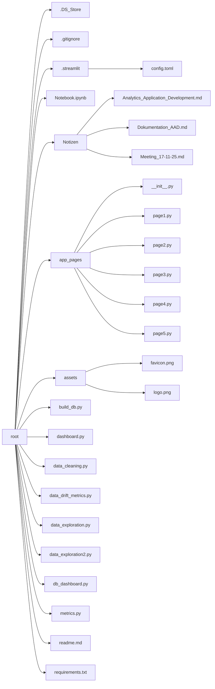
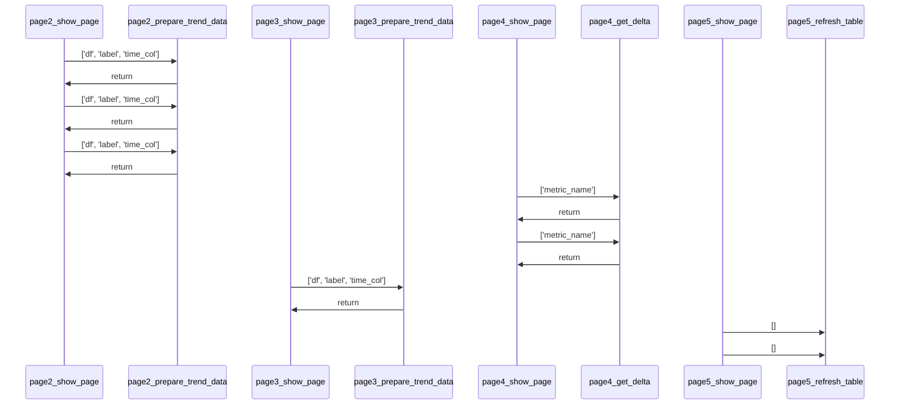
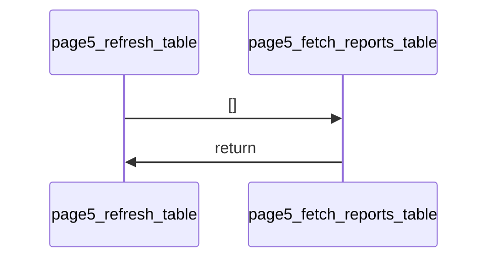
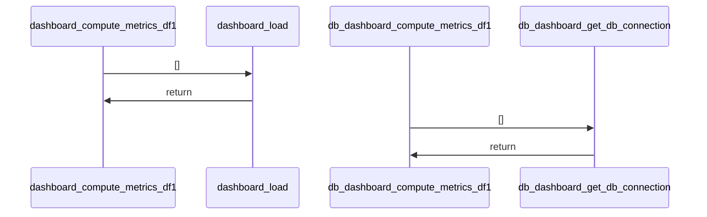
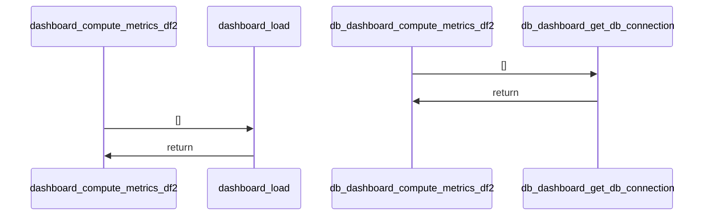
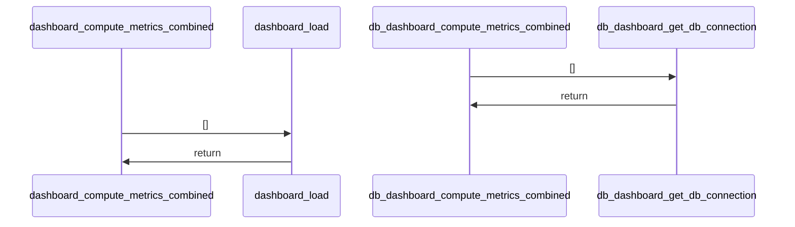
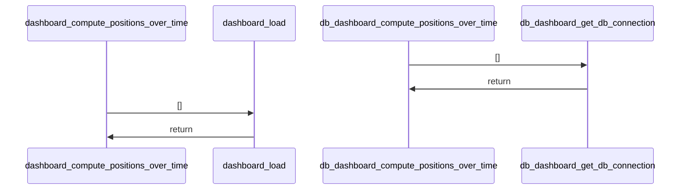
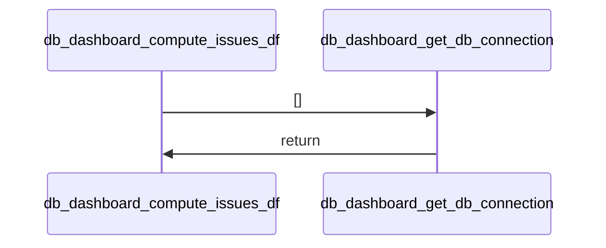
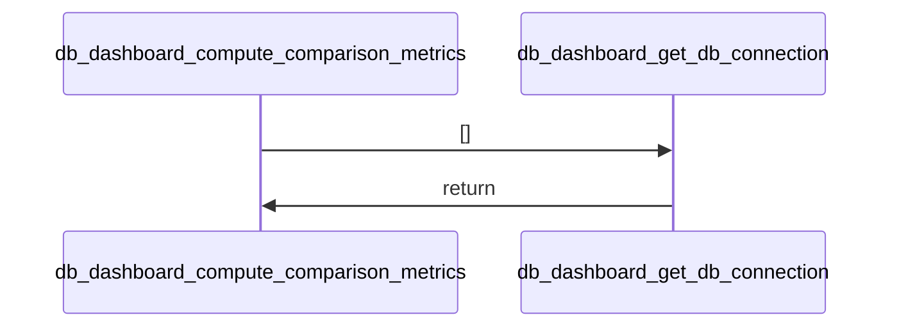
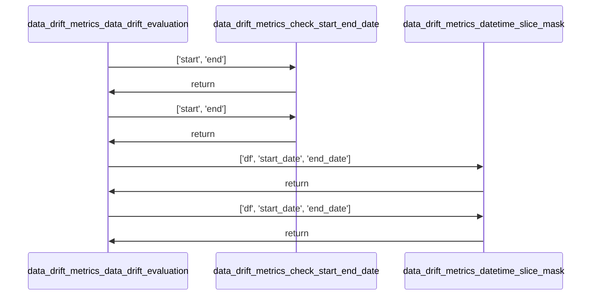

# Project Documentation: analytics-application-development-uni documentation

## 1. Project Overview
- **Description:** This project is an analytics application for data quality monitoring and visualization. It provides dashboards to analyze various aspects of business data including null value ratios, plausibility checks, error frequencies, and more.
- **Key Features:** 
  - Real-time dashboard visualization using Streamlit
  - Data quality metrics computation and comparison
  - Time-series trend analysis for business metrics
  - Plausibility checks for financial data
  - Statistical outlier detection for business entities
- **Tech Stack:** Python, Streamlit, DuckDB, Pandas, Altair, Evidently AI, Sentence Transformers

### Repository Structure


## 2. Installation

### Dependencies
- altair==5.5.0
- duckdb==1.4.3
- evidently==0.7.20
- ipython==8.12.3
- numpy==2.3.5
- pandas==2.3.3
- sentence-transformers==5.2.0
- streamlit==1.51.0
- streamlit-option-menu==0.4.0
- torch==2.9.1+cu126

### Setup Guide
1. Clone the repository to your local machine
2. Ensure Python 3.8+ is installed
3. Install the required dependencies using `pip install -r requirements.txt`

### Quick Startup
To start the analytics dashboard, run:
```bash
streamlit run dashboard.py
```

## 3. Use Cases & Commands
This application serves as a comprehensive data quality monitoring tool with multiple use cases:
- Real-time dashboard visualization for business metrics
- Data quality assessment through various analytical lenses
- Plausibility checking for financial data in business transactions
- Trend analysis of business metrics over time
- Statistical outlier detection for business entities
- Data drift evaluation between different time periods

The primary command to launch the application is `streamlit run dashboard.py`.

## 4. Architecture
```mermaid
graph TD
```

## 5. Code Analysis

### File: `app_pages/page1.py`

#### Function: `show_page`
   **Sequence diagram for show_page**

*   **Signature:** `def show_page(metrics_df1, metrics_df2, metrics_combined, pot_df, comparison_df, issues_df)`
*   **Description:** The function `show_page` displays a dashboard page with key performance indicators (KPIs) and charts based on provided dataframes. It calculates and presents metrics such as issue counts, row counts, null ratios, and unique ID checks. It also visualizes null value distributions, error frequency over weekdays and hours, and trends in average positions per order over time. The function uses helper functions like `get_delta` to compute percentage changes for KPIs.
*   **Parameters:**
    *   **metrics_df1** (`Any`): DataFrame containing metrics related to the first dataset, including row counts, null ratios, and error frequencies.
    *   **metrics_df2** (`Any`): DataFrame containing metrics related to the second dataset, particularly row counts.
    *   **metrics_combined** (`Any`): DataFrame combining metrics from both datasets, including uniqueness checks for IDs.
    *   **pot_df** (`Any`): DataFrame containing time-series data for position trends over months.
    *   **comparison_df** (`Any`): DataFrame used to compare metrics and calculate percentage changes.
    *   **issues_df** (`Any`): DataFrame containing overall issue counts.
*   **Returns:** 
*   **Usage:** This function is called by dashboard.py and db_dashboard.py

#### Function: `get_delta`
*   **Signature:** `def get_delta(metric_name)`
*   **Description:** The function 'get_delta' retrieves the percentage change for a specified metric from a DataFrame named 'comparison_df'. It first checks if the DataFrame is None or empty, returning None in such cases. If the DataFrame contains data, it searches for the row corresponding to the given metric name and extracts the 'Percent_Change' value. This value is then formatted as a string with two decimal places and a '+' or '-' sign, followed by a '%'. If the metric is not found, the function returns None.
*   **Parameters:**
    *   **metric_name** (`str`): The name of the metric for which the percentage change is to be retrieved.
*   **Returns:**
    *   **delta** (`str or None`): A formatted string representing the percentage change with two decimal places and a '+' or '-' prefix, or None if the metric is not found or the DataFrame is empty.
*   **Usage:** This function is called by app_pages.page1.show_page

### File: `app_pages/page2.py`

#### Function: `show_page`
   **Sequence diagram for show_page**

*   **Signature:** `def show_page(metrics_df1, metrics_df2, metrics_combined, comparison_df, issues_df)`
*   **Description:** The function 'show_page' displays a Streamlit-based dashboard page that visualizes and summarizes data quality metrics from multiple DataFrames. It calculates various percentages and presents them using Streamlit's metric components. It also generates trend charts and data tables for specific error categories such as 'Zeitwert Fehler', 'Aufträge > 50k', and 'Abweichung Summen'. The function uses helper functions to compute deltas and prepare trend data.
*   **Parameters:**
    *   **metrics_df1** (`dict`): Dictionary containing metrics related to the first dataset, including error counts and dataframes.
    *   **metrics_df2** (`dict`): Dictionary containing metrics related to the second dataset, particularly row count.
    *   **metrics_combined** (`dict`): Dictionary containing combined metrics, such as 'auftraege_abgleich'.
    *   **comparison_df** (`DataFrame or None`): DataFrame containing comparison data with metrics and percent changes.
    *   **issues_df** (`DataFrame`): DataFrame containing issue-related information, specifically 'numeric_issues'.
*   **Returns:** 
*   **Usage:** This function is called by dashboard.py and db_dashboard.py

#### Function: `get_delta`
*   **Signature:** `def get_delta(metric_name)`
*   **Description:** The function 'get_delta' retrieves the percentage change for a specified metric from a DataFrame named 'comparison_df'. It first checks whether the DataFrame is None or empty, returning None in such cases. If the DataFrame contains data, it searches for the row corresponding to the given metric name and extracts the 'Percent_Change' value. This value is then formatted as a string with two decimal places and a plus/minus sign, followed by a percent symbol. If the metric is not found, the function returns None.
*   **Parameters:**
    *   **metric_name** (`str`): The name of the metric for which the percentage change is to be retrieved.
*   **Returns:**
    *   **delta** (`str`): A formatted string representing the percentage change with two decimal places and a '+' or '-' prefix, or None if the metric is not found or the DataFrame is empty.
*   **Usage:** This function is called by app_pages.page2.show_page

#### Function: `prepare_trend_data`
*   **Signature:** `def prepare_trend_data(df, label, time_col)`
*   **Description:** The function 'prepare_trend_data' processes a DataFrame to aggregate and format trend data based on a specified time column. It first validates the input DataFrame and ensures the time column exists. It then converts the time column to datetime format, drops any rows with invalid dates, groups the data by month, counts occurrences, and assigns a category label. Finally, it returns a new DataFrame with monthly counts and the assigned label.
*   **Parameters:**
    *   **df** (`DataFrame`): The input DataFrame containing the data to be processed.
    *   **label** (`str`): A string label to assign to the 'Kategorie' column in the output DataFrame.
    *   **time_col** (`str`): The name of the column to use for time-based grouping. Defaults to 'CRMEingangszeit'.
*   **Returns:**
    *   **aggregated** (`DataFrame`): A DataFrame containing monthly counts ('Anzahl') and the assigned category ('Kategorie').
*   **Usage:** This function is called by app_pages.page2.show_page

### File: `app_pages/page3.py`

#### Function: `show_page`
   **Sequence diagram for show_page**

*   **Signature:** `def show_page(metrics_df1, metrics_df2, comparison_df, issues_df)`
*   **Description:** The function `show_page` displays a Streamlit-based dashboard page that visualizes data quality metrics and trends. It processes multiple DataFrames to compute various KPIs such as text issues, test data counts, and outlier statistics. These metrics are displayed using Streamlit's `st.metric` components with dynamic deltas calculated via a helper function. The function also includes interactive charts and tables for trend analysis and outlier detection, supporting both graphical and tabular views. It handles data aggregation, filtering, and visualization using Altair and Pandas.
*   **Parameters:**
    *   **metrics_df1** (`dict`): Dictionary containing various DataFrames related to metrics, including outlier data, semantic mismatches, and test data.
    *   **metrics_df2** (`dict`): Dictionary containing additional metrics data, particularly row count information.
    *   **comparison_df** (`DataFrame or None`): DataFrame containing comparison data, used to calculate percentage changes for KPIs.
    *   **issues_df** (`dict`): Dictionary containing issue-related data, specifically text issues.
*   **Returns:** 
*   **Usage:** This function is called by dashboard.py and db_dashboard.py

#### Function: `get_delta`
*   **Signature:** `def get_delta(metric_name)`
*   **Description:** The function 'get_delta' retrieves the percentage change for a specified metric from a DataFrame named 'comparison_df'. It first checks whether the DataFrame is None or empty, returning None if so. If the DataFrame contains data, it searches for a row matching the given metric name and extracts the corresponding percent change value. This value is then formatted as a string with two decimal places and a '+' or '-' sign, followed by a '%' symbol. If no matching row is found, the function returns None.
*   **Parameters:**
    *   **metric_name** (`str`): The name of the metric to look up in the comparison DataFrame.
*   **Returns:**
    *   **delta_value** (`str`): A formatted string representing the percent change for the specified metric, including a '+' or '-' sign and a '%' symbol, or None if the metric is not found or the DataFrame is empty.
*   **Usage:** This function is called by app_pages.page3.show_page

#### Function: `prepare_trend_data`
*   **Signature:** `def prepare_trend_data(df, label, time_col)`
*   **Description:** The function prepares a DataFrame for time-series chart aggregation by performing data validation, converting a specified time column to datetime format, removing rows with invalid timestamps, extracting month information, aggregating the data by month, and adding a category label. It returns an aggregated DataFrame with monthly counts and a category column. If the input DataFrame is None, empty, or lacks the specified time column, it returns an empty DataFrame.
*   **Parameters:**
    *   **df** (`DataFrame`): The input DataFrame containing the data to be prepared for trend visualization.
    *   **label** (`str`): A string label to be added as a category column in the resulting DataFrame.
    *   **time_col** (`str`): The name of the column containing time data, defaulting to 'CRMEingangszeit'.
*   **Returns:**
    *   **aggregated** (`DataFrame`): A DataFrame containing aggregated data grouped by month with columns 'Monat', 'Anzahl', and 'Kategorie'.
*   **Usage:** This function is called by app_pages.page3.show_page

### File: `app_pages/page4.py`

#### Function: `show_page`
   **Sequence diagram for show_page**

*   **Signature:** `def show_page(metrics_df1, metrics_df2, comparison_df, issues_df)`
*   **Description:** The function `show_page` displays a Streamlit-based dashboard for analyzing data quality metrics across multiple datasets. It visualizes plausibility checks, discount logic errors, proforma receipts, and false negative validations using tabs, metrics, charts, and data tables. The function leverages helper data structures like DataFrames and dictionaries to extract and present key statistics. It dynamically selects between two datasets (df1 and df2) based on user input for certain sections. The helper function `get_delta` is used to compute percentage changes for metric deltas.
*   **Parameters:**
    *   **metrics_df1** (`dict`): A dictionary containing metrics related to the first dataset (df1), such as plausibility checks, false negatives, and proforma data.
    *   **metrics_df2** (`dict`): A dictionary containing metrics related to the second dataset (df2), including discount errors, false negatives, and outlier details.
    *   **comparison_df** (`DataFrame or None`): A DataFrame containing comparison data, used to calculate percentage changes for metrics via the helper function.
    *   **issues_df** (`DataFrame or None`): A DataFrame containing issue counts for various categories, used to compute overall plausibility issue percentages.
*   **Returns:** 
*   **Usage:** This function is called by dashboard.py and db_dashboard.py

#### Function: `get_delta`
*   **Signature:** `def get_delta(metric_name)`
*   **Description:** The function 'get_delta' retrieves the percentage change for a specified metric from a DataFrame named 'comparison_df'. It first checks if the DataFrame is None or empty, returning None in such cases. If the DataFrame contains data, it searches for the row corresponding to the given metric name and extracts the 'Percent_Change' value. This value is then formatted as a string with two decimal places and a plus/minus sign, followed by a percent symbol. If the metric is not found, the function returns None.
*   **Parameters:**
    *   **metric_name** (`str`): The name of the metric for which the percentage change is to be retrieved.
*   **Returns:**
    *   **delta_value** (`str or None`): A formatted string representing the percentage change with two decimal places and a '+' or '-' prefix, or None if the metric is not found or the DataFrame is empty.
*   **Usage:** This function is called by app_pages.page4.show_page

### File: `app_pages/page5.py`

#### Function: `load_df`
*   **Signature:** `def load_df(df_type)`
*   **Description:** The function 'load_df' is designed to load data from a DuckDB database into a pandas DataFrame based on the specified data frame type. It establishes a connection to a DuckDB database file, executes a SQL query depending on the input parameter 'df_type', and returns the resulting DataFrame. The function ensures proper resource management by closing the database connection after each operation.
*   **Parameters:**
    *   **df_type** (`str`): A string indicating the type of DataFrame to load. It can be either 'df' to load data from the 'auftragsdaten' table or 'df2' to load data from the 'positionsdaten' table.
*   **Returns:**
    *   **df** (`pandas.DataFrame`): The DataFrame containing the data retrieved from the specified table in the DuckDB database.
*   **Usage:** This function is called by app_pages.page5.show_page

#### Function: `fetch_reports_table`
*   **Signature:** `def fetch_reports_table()`
*   **Description:** This function retrieves all report files from a specific directory, extracts their filenames, splits the filenames into components, and constructs a pandas DataFrame with structured column names. It processes the data to remove an unnecessary 'eval' column and maps certain values in the 'Quelle' column to more descriptive labels. The function ultimately returns a cleaned and structured DataFrame representing the reports table.
*   **Parameters:** 
*   **Returns:**
    *   **df_reports** (`pandas.DataFrame`): A DataFrame containing the processed report data with columns for evaluation details, source, and reference periods.
*   **Usage:** This function is called by app_pages.page5.refresh_table

#### Function: `refresh_table`
   **Sequence diagram for refresh_table**

*   **Signature:** `def refresh_table()`
*   **Description:** The function 'refresh_table' updates the session state variable 'reports_table' with the latest data fetched from the 'fetch_reports_table' function. It serves as a utility to synchronize the displayed table data with the most recent reports. This function does not take any parameters and does not return any value. It directly manipulates the Streamlit session state to reflect updated data.
*   **Parameters:** 
*   **Returns:** 
*   **Usage:** This function is called by app_pages.page5.show_page

#### Function: `show_page`
   **Sequence diagram for show_page**

*   **Signature:** `def show_page()`
*   **Description:** The function 'show_page' displays a Streamlit-based user interface for selecting date ranges and data sources to generate or retrieve reports. It connects to a DuckDB database to determine the minimum and maximum dates available in the 'auftragsdaten' table. Based on user selections, it constructs file paths for HTML reports and either displays existing reports or triggers their creation via a data drift evaluation process. The UI includes expanders for report selection and availability, along with date pickers and form submission controls.
*   **Parameters:** 
*   **Returns:** 
*   **Usage:** This function is called by dashboard.py and db_dashboard.py

### File: `build_db.py`

#### Function: `calc_percent`
*   **Signature:** `def calc_percent(row)`
*   **Description:** The function calculates the percentage change between an old value and a new value based on an absolute difference. It handles special cases where the old value is zero to avoid division by zero errors. The calculation is performed using the formula ((new - old) / old) * 100, which is simplified here as (absolute_change / old) * 100.
*   **Parameters:**
    *   **row** (`dict`): A dictionary-like object representing a row of data containing keys 'Old_Value', 'Current_Value', and 'Absolute_Change'.
*   **Returns:**
    *   **percentage_change** (`float`): The calculated percentage change, represented as a float. Returns 0.0 if both old and new values are zero, and 100.0 if old is zero but new is not.
*   **Usage:** This function is called by no other functions

### File: `dashboard.py`

#### Function: `load`
*   **Signature:** `def load()`
*   **Description:** This function loads two pandas DataFrames from parquet files located at 'resources/Auftragsdaten_konvertiert' and 'resources/Positionsdaten_konvertiert'. It reads the data using pandas' read_parquet method and returns both DataFrames as a tuple. The function serves as a data loading utility for dashboard components.
*   **Parameters:** 
*   **Returns:**
    *   **df** (`DataFrame`): The first DataFrame loaded from the 'Auftragsdaten_konvertiert' parquet file.
    *   **df2** (`DataFrame`): The second DataFrame loaded from the 'Positionsdaten_konvertiert' parquet file.
*   **Usage:** This function is called by dashboard.compute_metrics_df1, dashboard.compute_metrics_df2, dashboard.compute_metrics_combined, and dashboard.compute_positions_over_time

#### Function: `compute_metrics_df1`
   **Sequence diagram for compute_metrics_df1**

*   **Signature:** `def compute_metrics_df1()`
*   **Description:** This function computes a comprehensive set of metrics for a DataFrame named 'df1' (Auftragsdaten). It performs various data quality checks, including plausibility checks, time value validation, proforma document identification, data cleanliness assessments, error frequency analysis by weekday and hour, false negative detection, and outlier detection for craftsmen and trades. The results are aggregated into a dictionary and returned.
*   **Parameters:** 
*   **Returns:**
    *   **metrics_df1** (`dict`): A dictionary containing computed metrics for df1, including row counts, null value ratios, plausibility check results, proforma counts, data cleanliness metrics, error frequencies, false negatives, mismatched entries, and outlier information.
*   **Usage:** This function is called by dashboard

#### Function: `compute_metrics_df2`
   **Sequence diagram for compute_metrics_df2**

*   **Signature:** `def compute_metrics_df2()`
*   **Description:** This function computes a comprehensive set of metrics for df2 (Position data) and returns them in a dictionary format. It first loads the required data using a load function, then performs several checks and calculations including plausibility checks, discount details, false negative statistics, and various null value ratios. The function also tracks and prints timing information for each major computation step.
*   **Parameters:** 
*   **Returns:**
    *   **metrics_df2** (`dict`): A dictionary containing various computed metrics for df2 including row count, null value ratios, discount check results, position counts, plausibility check results, false negative statistics, and discount details.
*   **Usage:** This function is called by dashboard

#### Function: `compute_metrics_combined`
   **Sequence diagram for compute_metrics_combined**

*   **Signature:** `def compute_metrics_combined()`
*   **Description:** This function computes combined metrics that require data from two DataFrames. It loads the required data, performs uniqueness checks and order alignment calculations, and returns a dictionary containing the computed metrics. The function includes timing information to measure execution duration.
*   **Parameters:** 
*   **Returns:**
    *   **metrics_combined** (`dict`): A dictionary containing three keys: 'kvarechnung_id_is_unique', 'position_id_is_unique', and 'auftraege_abgleich', each holding the result of their respective computations.
*   **Usage:** This function is called by dashboard

#### Function: `compute_positions_over_time`
   **Sequence diagram for compute_positions_over_time**

*   **Signature:** `def compute_positions_over_time()`
*   **Description:** This function calculates the number of positions per order over time and returns the result as a DataFrame. It loads two datasets using a helper function, performs a computation using a metrics module, and prints timing information during execution. The function is intended to be cached, although caching behavior is not explicitly implemented in the provided code.
*   **Parameters:** 
*   **Returns:**
    *   **positions_over_time_df** (`DataFrame`): A DataFrame containing the calculated positions per order over time.
*   **Usage:** This function is called by dashboard

#### Function: `compute_issues_df`
   **Sequence diagram for compute_issues_df**

*   **Signature:** `def compute_issues_df()`
*   **Description:** The function computes a DataFrame summarizing various types of issues detected in different data sets. It aggregates counts from multiple metrics DataFrames and organizes them into categories such as numeric, text, and plausibility issues. The result is a single-row DataFrame containing all aggregated issue counts.
*   **Parameters:** 
*   **Returns:**
    *   **df_issues** (`pandas.DataFrame`): A DataFrame containing columns for different types of issues (numeric, text, plausibility) and their respective counts.
*   **Usage:** This function is called by dashboard

#### Function: `compute_comparison_metrics`
   **Sequence diagram for compute_comparison_metrics**

*   **Signature:** `def compute_comparison_metrics()`
*   **Description:** This function computes comparison metrics by creating a pandas DataFrame with predefined metric data, including current values, old values, and percent changes. It defines specific indices and constructs a structured dataset for further analysis or display. The function initializes a dictionary with metric names and their corresponding values, then converts this into a DataFrame using pandas.
*   **Parameters:** 
*   **Returns:**
    *   **df** (`pandas.DataFrame`): A DataFrame containing the computed comparison metrics with columns 'Metric', 'Current_Value', 'Old_Value', and 'Percent_Change', indexed by the specified indices.
*   **Usage:** This function is called by dashboard

### File: `data_cleaning.py`

#### Function: `load_data`
*   **Signature:** `def load_data()`
*   **Description:** This function loads three different datasets from Parquet files located in the 'resources' directory. It reads data from 'Auftragsdaten', 'Positionsdaten', and 'Auftragsdaten_Zeit' files using pandas. The function returns a tuple containing the three loaded dataframes. It prints a message indicating that data loading has started.
*   **Parameters:** 
*   **Returns:**
    *   **df** (`DataFrame`): The first dataframe loaded from 'resources/Auftragsdaten.parquet'
    *   **df2** (`DataFrame`): The second dataframe loaded from 'resources/Positionsdaten.parquet'
    *   **df3** (`DataFrame`): The third dataframe loaded from 'resources/Auftragsdaten_Zeit.parquet'
*   **Usage:** This function is called by build_db and data_cleaning

#### Function: `data_cleaning`
*   **Signature:** `def data_cleaning(df, df2, df3)`
*   **Description:** The function performs comprehensive data cleaning and transformation on three pandas DataFrames (df, df2, df3). It merges datasets based on shared keys, renames columns, handles missing data placeholders, corrects typos in categorical data, converts data types for memory efficiency, and adds new boolean columns to flag plausible entries. The process includes merging with an external metrics function, applying dtype conversions, and downcasting numeric types to reduce memory usage.
*   **Parameters:**
    *   **df** (`DataFrame`): Primary DataFrame containing main data records.
    *   **df2** (`DataFrame`): Secondary DataFrame containing additional transactional or detail data.
    *   **df3** (`DataFrame`): Third DataFrame used for merging with the primary dataset.
*   **Returns:**
    *   **df** (`DataFrame`): The cleaned and transformed primary DataFrame.
    *   **df2** (`DataFrame`): The cleaned and transformed secondary DataFrame.
*   **Usage:** This function is called by build_db and data_cleaning

### File: `data_drift_metrics.py`

#### Function: `check_start_end_date`
*   **Signature:** `def check_start_end_date(start, end)`
*   **Description:** This function serves as a helper to ensure chronological ordering of two datetime objects. It takes two datetime inputs, compares them, and swaps their order if necessary so that the first value is earlier than or equal to the second. The function returns both values in chronological sequence.
*   **Parameters:**
    *   **start** (`datetime`): The assumed beginning of the interval.
    *   **end** (`datetime`): The assumed end of the interval.
*   **Returns:**
    *   **start** (`datetime`): The earlier datetime value after ensuring chronological order.
    *   **end** (`datetime`): The later datetime value after ensuring chronological order.
*   **Usage:** This function is called by data_drift_metrics.data_drift_evaluation

#### Function: `datetime_slice_mask`
*   **Signature:** `def datetime_slice_mask(df, start_date, end_date)`
*   **Description:** This function filters a pandas DataFrame based on a date range and converts the resulting subset into an Evidently Dataset. It ensures that the input dates are treated as full datetimes by setting the time component to midnight. The function checks for specific column names to determine how to define the dataset schema. It returns the filtered dataset.
*   **Parameters:**
    *   **df** (`pandas.DataFrame`): The input DataFrame to be filtered.
    *   **start_date** (`date`): The starting date for filtering the DataFrame.
    *   **end_date** (`date`): The ending date for filtering the DataFrame.
*   **Returns:**
    *   **sliced_ds** (`evidently.Dataset`): A sliced DataFrame converted to an Evidently Dataset.
*   **Usage:** This function is called by data_drift_metrics.data_drift_evaluation

#### Function: `data_drift_evaluation`
   **Sequence diagram for data_drift_evaluation**

*   **Signature:** `def data_drift_evaluation(df, start_date_reference, end_date_reference, start_date_eval, end_date_eval)`
*   **Description:** This function evaluates data drift between two time-sliced datasets using the EvidentlyAI framework. It takes a DataFrame and four datetime parameters to define reference and evaluation periods. The function ensures chronological order of dates, slices the data accordingly, and generates a data drift report based on the DataFrame's column structure. The resulting HTML report is saved to a specified directory.
*   **Parameters:**
    *   **df** (`pandas.DataFrame`): DataFrame to sample from
    *   **start_date_reference** (`datetime`): starting datetime of the reference, baseline dataset
    *   **end_date_reference** (`datetime`): ending datetime of the reference, baseline dataset
    *   **start_date_eval** (`datetime`): starting datetime of the evaluated dataset
    *   **end_date_eval** (`datetime`): starting datetime of the evaluated dataset
*   **Returns:** 
*   **Usage:** This function is called by app_pages.page5.show_page

### File: `data_exploration.py`

#### Function: `load`
*   **Signature:** `def load()`
*   **Description:** This function loads two datasets from Parquet files located at specific resource paths. It reads the first dataset from 'resources/Auftragsdaten_konvertiert' and the second from 'resources/Positionsdaten_konvertiert'. Both datasets are returned as a tuple of pandas DataFrames. The function serves as a data loading utility for subsequent processing steps.
*   **Parameters:** 
*   **Returns:**
    *   **df** (`DataFrame`): The first DataFrame loaded from the 'Auftragsdaten_konvertiert' Parquet file.
    *   **df2** (`DataFrame`): The second DataFrame loaded from the 'Positionsdaten_konvertiert' Parquet file.
*   **Usage:** This function is called by data_exploration

### File: `db_dashboard.py`

#### Function: `get_db_connection`
*   **Signature:** `def get_db_connection()`
*   **Description:** This function establishes a read-only connection to a DuckDB database located at a predefined path. It uses the duckdb library to create the connection with the read-only flag set to True, ensuring that no modifications can be made to the database during the session. The function returns the established connection object for use in subsequent database operations.
*   **Parameters:** 
*   **Returns:**
    *   **con** (`Connection`): A read-only connection object to the DuckDB database.
*   **Usage:** This function is called by db_dashboard.compute_metrics_df1, db_dashboard.compute_metrics_df2, db_dashboard.compute_metrics_combined, db_dashboard.compute_positions_over_time, db_dashboard.compute_comparison_metrics, db_dashboard.compute_issues_df

#### Function: `compute_metrics_df1`
   **Sequence diagram for compute_metrics_df1**

*   **Signature:** `def compute_metrics_df1()`
*   **Description:** This function retrieves various data quality metrics for the 'df1' dataset (Auftragsdaten) from a database. It loads multiple tables related to scalar metrics, null ratios, test data entries, plausibility checks, cleanliness metrics, proforma documents, outlier detection, and semantic mismatches. The function organizes these into a dictionary structure for further use in dashboard visualization. It measures execution time for performance monitoring.
*   **Parameters:** 
*   **Returns:**
    *   **metrics_df1** (`dict`): A dictionary containing various data quality metrics for the Auftragsdaten dataset, including counts, dataframes, and aggregated statistics.
*   **Usage:** This function is called by db_dashboard

#### Function: `compute_metrics_df2`
   **Sequence diagram for compute_metrics_df2**

*   **Signature:** `def compute_metrics_df2()`
*   **Description:** This function retrieves various metrics related to the 'df2' dataset (Positionsdaten) from a database. It loads scalar metrics and multiple DataFrames from different tables, aggregates them into a dictionary, and returns the result. The function includes timing information to measure execution duration.
*   **Parameters:** 
*   **Returns:**
    *   **metrics_df2** (`dict`): A dictionary containing various metrics and DataFrames related to the Positionsdaten dataset.
*   **Usage:** This function is called by db_dashboard

#### Function: `compute_metrics_combined`
   **Sequence diagram for compute_metrics_combined**

*   **Signature:** `def compute_metrics_combined()`
*   **Description:** This function retrieves combined metrics from a database by establishing a connection, executing two SQL queries to fetch scalar metrics and order-position mismatch data, and then constructs a dictionary containing these metrics. It measures and reports the execution time for loading the data. The function does not take any parameters and returns a dictionary with keys indicating uniqueness of IDs and the fetched mismatch data.
*   **Parameters:** 
*   **Returns:**
    *   **metrics_combined** (`dict`): A dictionary containing the combined metrics including boolean flags for ID uniqueness and a DataFrame with order-position mismatch data.
*   **Usage:** This function is called by db_dashboard

#### Function: `compute_positions_over_time`
   **Sequence diagram for compute_positions_over_time**

*   **Signature:** `def compute_positions_over_time()`
*   **Description:** This function retrieves position data over time from a database table named 'metric_positions_over_time'. It measures the execution time of the query, prints loading status messages, and returns the resulting DataFrame. The function uses a database connection obtained via a helper function 'get_db_connection'.
*   **Parameters:** 
*   **Returns:**
    *   **df_pos_time** (`DataFrame`): A DataFrame containing the position data over time retrieved from the 'metric_positions_over_time' table.
*   **Usage:** This function is called by db_dashboard

#### Function: `compute_comparison_metrics`
   **Sequence diagram for compute_comparison_metrics**

*   **Signature:** `def compute_comparison_metrics()`
*   **Description:** This function retrieves comparison metrics from a database by establishing a connection, executing a query to fetch all records from the 'metric_comparison' table, and returning the results as a DataFrame. It includes timing functionality to measure the duration of the data loading process. The function prints status messages to indicate the progress of the operation.
*   **Parameters:** 
*   **Returns:**
    *   **comparison_df** (`DataFrame`): A DataFrame containing all records retrieved from the 'metric_comparison' table in the database.
*   **Usage:** This function is called by db_dashboard

#### Function: `compute_issues_df`
   **Sequence diagram for compute_issues_df**
```mermaid
sequenceDiagram
    participant db_dashboard_compute_issues_df
    participant db_dashboard_get_db_connection
    db_dashboard_compute_issues_df ->> db_dashboard_get_db_connection: []
    db_dashboard_get_db_connection ->> db_dashboard_compute_issues_df: return
```
*   **Signature:** `def compute_issues_df()`
*   **Description:** This function retrieves issue metrics from a database by establishing a connection, executing a query to fetch all records from the 'issues' table, and returning the first row of the resulting DataFrame. It includes timing functionality to measure the duration of the database operation and prints status messages during execution.
*   **Parameters:** 
*   **Returns:**
    *   **issues_df** (`DataFrame`): A pandas DataFrame representing the first row of data retrieved from the 'issues' table in the database.
*   **Usage:** This function is called by db_dashboard

### File: `metrics.py`

#### Function: `load_data`
*   **Signature:** `def load_data()`
*   **Description:** The function 'load_data' reads two Parquet files using pandas and returns them as two separate DataFrames. It is designed to load structured data from disk into memory for further processing. The function does not take any parameters and directly accesses predefined file paths. There are no explicit return type annotations, but based on the code, it returns a tuple of two pandas DataFrames.
*   **Parameters:** 
*   **Returns:**
    *   **df** (`pandas.DataFrame`): The first DataFrame loaded from the 'resources/Auftragsdaten_konvertiert' Parquet file.
    *   **df2** (`pandas.DataFrame`): The second DataFrame loaded from the 'resources/Positionsdaten_konvertiert' Parquet file.
*   **Usage:** This function is called by metrics

#### Function: `ratio_null_values_column`
*   **Signature:** `def ratio_null_values_column(input_df)`
*   **Description:** This function computes the ratio of null values for each column in a given pandas DataFrame and returns the results as a new DataFrame. It leverages pandas' built-in methods to detect missing values, calculate their proportion, convert to percentages, and format the output. The function is designed to assist in data quality assessment by providing insights into the completeness of each column.
*   **Parameters:**
    *   **input_df** (`pandas.DataFrame`): DataFrame that is to be evaluated.
*   **Returns:**
    *   **null_ratio_df** (`pd.DataFrame`): DataFrame containing two columns: 'index' (representing column names) and 'null_ratio' (the percentage of null entries in each column).
*   **Usage:** This function is called by build_db, dashboard.compute_metrics_df1, dashboard.compute_metrics_df2, and metrics.data_cleanliness

#### Function: `ratio_null_values_rows`
*   **Signature:** `def ratio_null_values_rows(input_df, exclude_cols)`
*   **Description:** This function computes the ratio of rows in a pandas DataFrame that contain at least one null value, expressed as a percentage. It allows for excluding specific columns from the calculation. The function first filters out unwanted columns, then determines the total number of rows and counts how many rows have at least one null value. Finally, it calculates the percentage of such rows relative to the total.
*   **Parameters:**
    *   **input_df** (`pandas.DataFrame`): DataFrame that is to be evaluated.
    *   **exclude_cols** (`list`): List of column identifiers; these columns will be pruned from calculations, by default None.
*   **Returns:**
    *   **row_ratio** (`float`): Percentage value of rows with at least one null value in the given columns.
*   **Usage:** This function is called by dashboard.compute_metrics_df1, dashboard.compute_metrics_df2, and metrics.data_cleanliness

#### Function: `Kundengruppe_containing_test`
*   **Signature:** `def Kundengruppe_containing_test(df, return_frame)`
*   **Description:** This function evaluates a pandas DataFrame to identify rows where the 'Kundengruppe' column contains the substring 'test', case-insensitively. It counts these rows and optionally returns a filtered DataFrame of the matching entries. The function is designed to detect potential test data within an 'Auftragsdaten' dataset based on customer group naming conventions.
*   **Parameters:**
    *   **df** (`pandas.DataFrame`): The 'Auftragsdaten'-DataFrame that is to be evaluated.
    *   **return_frame** (`bool`): If True, this function returns exclusively a DataFrame with all found test data, by default False
*   **Returns:**
    *   **anzahl_test** (`int`): Total number of test data rows.
    *   **test_Kundengruppen** (`pandas.DataFrame or None`): DataFrame containing all found test data, returned only if return_frame = True
*   **Usage:** This function is called by build_db and dashboard.compute_metrics_df1

#### Function: `plausibilitaetscheck_forderung_einigung`
*   **Signature:** `def plausibilitaetscheck_forderung_einigung(input_df)`
*   **Description:** This function performs a plausibility check on a DataFrame by comparing the 'Einigung_Netto' and 'Forderung_Netto' columns for each row. It identifies cases where the 'Einigung_Netto' value exceeds the 'Forderung_Netto' value, flagging these as potentially faulty records. The function returns a subset of these faulty rows along with a count of such rows and the average difference between the two values.
*   **Parameters:**
    *   **input_df** (`pandas.DataFrame`): DataFrame that is to be evaluated.
*   **Returns:**
    *   **results** (`pandas.DataFrame`): A DataFrame of all differences > 0 as float values alongside their ID, Forderung_Netto and Einigung_Netto
    *   **count** (`int`): Total number of rows with difference > 0
    *   **avg** (`float`): Average difference over all found instances
*   **Usage:** This function is called by build_db, dashboard.compute_metrics_df1, dashboard.compute_metrics_df2, and metrics

#### Function: `uniqueness_check`
*   **Signature:** `def uniqueness_check(df, df2)`
*   **Description:** The function 'uniqueness_check' verifies the uniqueness of specific ID columns across two pandas DataFrames. It takes two DataFrames as inputs, one containing 'Auftragsdaten' and the other 'Positionsdaten'. For each DataFrame, it checks whether the respective ID columns ('KvaRechnung_ID' and 'Position_ID') contain only unique values. The function returns a tuple of boolean values indicating the uniqueness status of each ID column.
*   **Parameters:**
    *   **df** (`pandas.DataFrame`): DataFrame that contains the 'Auftragsdaten' data set
    *   **df2** (`pandas.DataFrame`): DataFrame that contains the 'Positionsdaten' data set
*   **Returns:**
    *   **kvarechnung_id_is_unique** (`bool`): True if column is unique.
    *   **position_id_is_unique** (`bool`): True if column is unique.
*   **Usage:** This function is called by build_db and dashboard.compute_metrics_combined

#### Function: `count_rows`
*   **Signature:** `def count_rows(input_df)`
*   **Description:** This function serves as a helper to determine the number of rows present in a given pandas DataFrame. It takes a DataFrame as input and returns an integer representing the total row count. The implementation is straightforward, relying on the built-in `len()` function to compute the row count.
*   **Parameters:**
    *   **input_df** (`pandas.DataFrame`): DataFrame to be evaluated.
*   **Returns:**
    *   **count** (`int`): _description_
*   **Usage:** This function is called by build_db, dashboard.compute_metrics_df1, and dashboard.compute_metrics_df2

#### Function: `data_cleanliness`
   **Sequence diagram for data_cleanliness**
```mermaid
sequenceDiagram
    participant metrics_data_cleanliness
    participant metrics_ratio_null_values_rows
    participant metrics_data_cleanliness
    participant metrics_ratio_null_values_column
    participant metrics_data_cleanliness
    participant metrics_ratio_null_values_rows
    participant metrics_data_cleanliness
    participant metrics_ratio_null_values_column
    metrics_data_cleanliness ->> metrics_ratio_null_values_rows: ['input_df', 'exclude_cols']
    metrics_ratio_null_values_rows ->> metrics_data_cleanliness: return
    metrics_data_cleanliness ->> metrics_ratio_null_values_column: ['input_df']
    metrics_ratio_null_values_column ->> metrics_data_cleanliness: return
    metrics_data_cleanliness ->> metrics_ratio_null_values_rows: ['input_df', 'exclude_cols']
    metrics_ratio_null_values_rows ->> metrics_data_cleanliness: return
    metrics_data_cleanliness ->> metrics_ratio_null_values_column: ['input_df']
    metrics_ratio_null_values_column ->> metrics_data_cleanliness: return
```
*   **Signature:** `def data_cleanliness(input_df, group_by_col, specific_group)`
*   **Description:** The function evaluates the cleanliness of a pandas DataFrame by calculating the ratio of null values both per column and per row. It supports optional grouping by a specified column to compute these ratios for different groups within the data. When no grouping is applied, it returns overall null value ratios for rows and columns. When grouping is applied, it computes grouped ratios for both rows and columns, optionally filtered to a specific group.
*   **Parameters:**
    *   **input_df** (`pandas.DataFrame`): DataFrame that is to be evaluated.
    *   **group_by_col** (`string`): Column identifier for grouping, default = 'Kundengruppe'
    *   **specific_group** (`string`): Passes a group entry to filter the result by, if any. Default = None
*   **Returns:**
    *   **null_ratio_rows** (`float or None`): Percentage value of rows with at least one null value in the given columns.
    *   **null_ratio_cols** (`DataFrame or None`): DataFrame, with null_ratio being the percentage amount of null entries in the column.
    *   **grouped_row_ratios** (`pandas.Series or None`): Series containing the row ratios of all groups as float.
    *   **grouped_col_ratios** (`pandas.DataFrame or None`): DataFrame containing groups and null-value-ratios per column for each.
*   **Usage:** This function is called by build_db and dashboard.compute_metrics_df1

#### Function: `discount_check`
*   **Signature:** `def discount_check(df2)`
*   **Description:** The function 'discount_check' evaluates a DataFrame to identify rows that may contain discrepancies between the 'Plausibel' column and the 'Einigung_Netto' and 'Forderung_Netto' values. It counts the number of rows where the 'Plausibel' column is False, indicating potential errors. The function uses a boolean inversion and summation to calculate the count of such rows. It returns an integer representing the number of potentially faulty rows based on the plausibility check.
*   **Parameters:**
    *   **df2** (`pandas.DataFrame`): DataFrame containing the 'Positionsdaten' dataset.
*   **Returns:**
    *   **potential_errors** (`int`): The number of potentially faulty rows.
*   **Usage:** This function is called by build_db and dashboard.compute_metrics_df2

#### Function: `proformabelege`
*   **Signature:** `def proformabelege(df)`
*   **Description:** This function evaluates a pandas DataFrame to identify rows that correspond to pro-forma receipts based on a specific condition applied to the 'Einigung_Netto' column. It filters the DataFrame to include only those rows where the value in the 'Einigung_Netto' column is between 0.01 and 1, inclusive. The function then calculates the count of such rows and returns both the filtered DataFrame and the count as a tuple.
*   **Parameters:**
    *   **df** (`pandas.DataFrame`): DataFrame that is to be evaluated.
*   **Returns:**
    *   **proforma** (`pandas.DataFrame`): DataFrame containing all found pro-forma receipt rows
    *   **proforma_count** (`int`): Amount of found receipts
*   **Usage:** This function is called by build_db and dashboard.compute_metrics_df1

#### Function: `position_count`
*   **Signature:** `def position_count(input_df)`
*   **Description:** This function takes a pandas DataFrame as input and groups the data by the 'KvaRechnung_ID' column to count the number of associated positions for each unique ID. It then returns a new DataFrame containing the 'KvaRechnung_ID' and the corresponding count of positions. The function uses pandas groupby and count operations to perform the aggregation.
*   **Parameters:**
    *   **input_df** (`pandas.DataFrame`): DataFrame that is to be evaluated.
*   **Returns:**
    *   **position_count** (`pandas.DataFrame`): DataFrame with the columns 'KvaRechnung_ID' and the amount of associated positions.
*   **Usage:** This function is called by build_db, dashboard.compute_metrics_df2, and data_cleaning.data_cleaning

#### Function: `empty_orders`
*   **Signature:** `def empty_orders(df)`
*   **Description:** This function evaluates a pandas DataFrame containing order data to identify and count orders that lack associated positions. It filters the DataFrame based on the presence of position data and returns both the total count of such empty orders and the filtered DataFrame of those orders. The function uses the 'PositionsAnzahl' column to determine which orders are empty.
*   **Parameters:**
    *   **df** (`pandas.DataFrame`): DataFrame with 'Auftragsdaten' data set that is to be evaluated.
*   **Returns:**
    *   **empty_orders** (`int`): Total amount of orders that do not have any positions associated with them.
    *   **empty_order_df** (`pandas.DateFrame`): DataFrame containing all empty orders.
*   **Usage:** This function is called by build_db and dashboard.compute_metrics_df1

#### Function: `above_50k`
*   **Signature:** `def above_50k(df)`
*   **Description:** The function 'above_50k' filters a pandas DataFrame to identify records where the 'Einigung_Netto' column has values greater than or equal to 50000. It then selects specific columns from these filtered records and returns them in a new DataFrame. This function is designed to flag potentially suspicious financial entries that require manual review.
*   **Parameters:**
    *   **df** (`pandas.DataFrame`): DataFrame that is to be evaluated.
*   **Returns:**
    *   **suspicious_data** (`pandas.DataFrame`): Data frame containing suspiciously high positions
*   **Usage:** This function is called by build_db and dashboard.compute_metrics_df1

#### Function: `outliers_by_damage`
*   **Signature:** `def outliers_by_damage(df, schadenart, set_quantile, column_choice)`
*   **Description:** This function identifies outliers in a specified numerical column of a pandas DataFrame based on a given quantile range, considering different damage types. It calculates symmetric upper and lower bounds for each group of damage types and filters the DataFrame to return only rows that fall outside these bounds. The function allows filtering by a specific damage type and supports custom column selection for outlier detection.
*   **Parameters:**
    *   **df** (`pandas.DataFrame`): DataFrame to be evaluated
    *   **schadenart** (`string`): specific damage type label to filter for, by default None
    *   **set_quantile** (`float`): desired quantile range, symmetric upper/lower bound is inferred, by default 0.99
    *   **column_choice** (`str`): numeric column containing outliers, by default 'Forderung_Netto'
*   **Returns:**
    *   **df_outlier** (`pandas.DataFrame`): df containing all suspicious rows
*   **Usage:** This function is called by no other functions

#### Function: `check_zeitwert`
*   **Signature:** `def check_zeitwert(df)`
*   **Description:** The function 'check_zeitwert' evaluates whether the difference between 'Forderung_Netto' and 'Einigung_Netto' aligns with the value in 'Differenz_vor_Zeitwert_Netto' within a tolerance of 0.01. It computes the relative error and filters the DataFrame to return only rows where this condition is not met. This function is specifically designed for 'Auftragsdaten' datasets.
*   **Parameters:**
    *   **df** (`_pandas.DataFrame`): DataFrame containing 'Auftragsdaten' data set that is to be evaluated.
*   **Returns:**
    *   **result_df** (`pandas.DataFrame`): DataFrame of all error values (float) alongside the ID found in the original data frame
*   **Usage:** This function is called by build_db and dashboard.compute_metrics_df1

#### Function: `positions_per_order_over_time`
*   **Signature:** `def positions_per_order_over_time(df, df2, time_col)`
*   **Description:** This function calculates the average number of positions per order for each month based on two input DataFrames. It first counts the number of positions associated with each order ID in the second DataFrame, then merges this information with the first DataFrame to associate orders with their respective position counts. The function aggregates these counts by month, computing the mean, sum, and count of positions per order for each time period. Finally, it computes the percentage growth rate of the average positions per order over time.
*   **Parameters:**
    *   **df** (`DataFrame`): Auftragsdaten mit Spalte 'KvaRechnung_ID' und einer Zeitspalte.
    *   **df2** (`DataFrame`): Positionsdaten mit Spalten 'KvaRechnung_ID' und 'Position_ID'.
    *   **time_col** (`str`): Name der Zeitspalte in orders_df (z.B. 'CRMEingangszeit').
*   **Returns:**
    *   **result** (`DataFrame`): DataFrame mit Spalten: 'Zeitperiode', 'Avg_Positionen_pro_Auftrag', 'Total_Positionen', 'Anzahl_Auftraege', 'Growth_rate_%'
*   **Usage:** This function is called by build_db and dashboard.compute_positions_over_time

#### Function: `error_frequency_by_weekday_hour`
*   **Signature:** `def error_frequency_by_weekday_hour(df, time_col, relevant_columns)`
*   **Description:** Die Funktion aggregiert die Fehlerhäufigkeit (NaN-Werte) in einem DataFrame nach Wochentag und Stunde. Sie identifiziert fehlerhafte Aufträge, bei denen mindestens eine der relevanten Spalten einen NaN-Wert enthält. Anschließend berechnet sie die Fehlerquote für jeden Zeit-Slot und gibt ein resultierendes DataFrame zurück, das die Anzahl der Aufträge, fehlerhaften Aufträge sowie die Fehlerquote pro Wochentag und Stunde enthält.
*   **Parameters:**
    *   **df** (`pandas.DataFrame`): Auftragsdaten-DataFrame (z.B. Auftragsdaten_konvertiert), muss 'KvaRechnung_ID' und die Zeitspalte enthalten.
    *   **time_col** (`string`): Name der Zeitspalte in df, z.B. 'CRMEingangszeit'.
    *   **relevant_columns** (`list`): Liste der Spalten, die auf NaN geprüft werden sollen. Wenn None -> alle Spalten außer 'KvaRechnung_ID' und time_col.
*   **Returns:**
    *   **result** (`pandas.DataFrame`): DataFrame mit Spalten: 'weekday' (Name des Wochentags), 'hour' (Stunde), 'total_rows' (Anzahl Aufträge in diesem Zeit-Slot), 'error_rows' (Anzahl fehlerhafter Aufträge in diesem Slot), 'error_rate' (Fehlerquote in Prozent).
*   **Usage:** This function is called by build_db and dashboard.compute_metrics_df1

#### Function: `mismatched_entries`
*   **Signature:** `def mismatched_entries(df, threshold, process_batch_size, encode_batch_size)`
*   **Description:** The function calculates semantic similarity between 'Gewerk_Name' and 'Handwerker_Name' columns in a DataFrame using a Sentence Transformer model. It drops null values, encodes unique terms into embeddings, computes cosine similarity scores in batches for efficiency, and returns entries where the similarity falls below a given threshold. The function dynamically selects GPU or CPU based on availability and manages GPU memory cleanup after processing.
*   **Parameters:**
    *   **df** (`pandas.DataFrame`): DataFrame containing the columns 'Gewerk_Name' and 'Handwerker_Name' to compare.
    *   **threshold** (`float`): Similarity threshold; values below this limit are considered mismatches (default: 0.2).
    *   **process_batch_size** (`int`): Number of rows to process simultaneously during similarity calculation (default: 16384).
    *   **encode_batch_size** (`int`): Number of unique terms to encode at once by the model (default: 128).
*   **Returns:**
    *   **mismatches** (`pandas.DataFrame`): DataFrame containing rows where 'Similarity_Score' < threshold, sorted ascending by similarity and including the new column 'Similarity_Score'.
*   **Usage:** This function is called by build_db and dashboard.compute_metrics_df1

#### Function: `handwerker_gewerke_outlier`
*   **Signature:** `def handwerker_gewerke_outlier(df)`
*   **Description:** The function 'handwerker_gewerke_outlier' identifies companies with unusual trade entries by analyzing a DataFrame of contractor and trade data. It calculates the frequency of each trade-company combination and determines whether a trade is an outlier based on the ratio of occurrences relative to the total number of trades per company. The function returns a DataFrame containing detailed statistics including counts, ratios, and outlier flags.
*   **Parameters:**
    *   **df** (`pandas.DataFrame`): The 'Auftragsdaten'-DataFrame containing contractor and trade information.
*   **Returns:**
    *   **stats** (`pandas.DataFrame`): A DataFrame containing the following columns: 'Handwerker_Name' (company name), 'Gewerk_Name' (associated trades), 'count' (amount of observed instances of trade-company combination), 'total_count' (total amount of observations per company), 'ratio' (count/total_count per company), 'anzahl_gewerke' (absolute amount of trades per company), and 'is_outlier' (True for more than 1 trade with ratio < 0.2).
*   **Usage:** This function is called by build_db and dashboard.compute_metrics_df1

#### Function: `check_keywords`
*   **Signature:** `def check_keywords(df)`
*   **Description:** The function 'check_keywords' evaluates whether a company name aligns with a given trade by matching keywords found in the company name against predefined keyword sets associated with each trade. It processes a DataFrame containing company and trade information, returning an array indicating the validation status of each entry based on keyword matching. The function uses regular expressions to detect keyword occurrences in company names and applies boolean logic to determine if a match confirms or conflicts with the assigned trade.
*   **Parameters:**
    *   **df** (`pandas.DataFrame`): DataFrame containing orders; company and trade information
*   **Returns:**
    *   **final_result** (`numpy.ndarray`): An array with length of df, with each element being one of the following strings: 'CONFIRMED_BY_NAME' if the trade coheres with the company name, 'CONFLICT_WITH_<TRADE>' if the trade is not confirmed by the company name, or 'NO_KEYWORD_INFO' if keyword information is unavailable.
*   **Usage:** This function is called by build_db and dashboard.compute_metrics_df1

#### Function: `abgleich_auftraege`
*   **Signature:** `def abgleich_auftraege(df1, df2)`
*   **Description:** Die Funktion 'abgleich_auftraege' vergleicht die Kopfdaten von Aufträgen (df1) mit der Summe ihrer Positionen (df2). Sie gruppiert die Positionsdaten nach 'Kva_RechnungID', bildet die Summen für 'Forderung_Netto' und 'Einigung_Netto', und vergleicht diese mit den Werten in df1. Die Funktion berücksichtigt Gleitkomma-Ungenauigkeiten durch den Einsatz von np.isclose. Die Ergebnisse werden als DataFrame zurückgegeben, das nur die IDs mit Abweichungen enthält.
*   **Parameters:**
    *   **df1** (`pd.DataFrame`): Dataframe mit den Auftragsdaten (Soll-Werte). Muss folgende Spalten enthalten: 'Kva_RechnungID', 'Forderung_Netto', 'Einigung_Netto'.
    *   **df2** (`pd.DataFrame`): Dataframe mit den Positionsdaten (Ist-Werte). Muss folgende Spalten enthalten: 'Kva_RechnungID', 'Forderung_Netto', 'Einigung_Netto'.
*   **Returns:**
    *   **result_df** (`pd.DataFrame`): Ein DataFrame mit den IDs von Aufträgen, bei denen die Werte nicht übereinstimmen. Enthält die Spalten 'KvaRechnung_ID', 'Diff_Forderung', 'Diff_Einigung' und 'CRMEingangszeit'.
*   **Usage:** This function is called by build_db and dashboard.compute_metrics_combined

#### Function: `false_negative_df1`
*   **Signature:** `def false_negative_df1(df)`
*   **Description:** This function calculates detailed statistics and specific error instances for singular sign errors in the columns 'Einigung_Netto', 'Empfehlung_Netto', and 'Forderung_Netto' within the 'Auftragsdaten' dataset. It identifies cases where only one of the three columns has a negative value, indicating a potential sign error. The function returns two DataFrames: one with error counts per column and another with the actual error instances. The function is designed to detect single sign errors but cannot accurately detect multiple combined errors.
*   **Parameters:**
    *   **df** (`pandas.DataFrame`): DataFrame containing 'Auftragsdaten' data set that is to be evaluated.
*   **Returns:**
    *   **stats_df** (`pandas.DataFrame`): Small DataFrame containing error counts per column (Einigung_Netto, Empfehlung_Netto, Forderung_Netto) for visualization.
    *   **details_df** (`pandas.DataFrame`): DataFrame containing the error instances.
*   **Usage:** This function is called by build_db and dashboard.compute_metrics_df1

#### Function: `false_negative_df2`
*   **Signature:** `def false_negative_df2(df2)`
*   **Description:** The function performs detailed consistency checks on a pandas DataFrame, evaluating specific criteria related to data plausibility and sign consistency. It identifies potential errors in columns such as 'Menge', 'Menge_Einigung', 'EP', 'EP_Einigung', 'Forderung_Netto', and 'Einigung_Netto'. The function returns two DataFrames: one summarizing the detected error categories and their counts, and another containing the rows with identified inconsistencies.
*   **Parameters:**
    *   **df2** (`pandas.DataFrame`): The DataFrame with position data to be checked. Expected columns include 'Menge', 'EP', 'Forderung_Netto', etc. Missing columns are ignored.
*   **Returns:**
    *   **stats_df** (`pandas.DataFrame`): A table with two columns: 'Kategorie' (type of error) and 'Anzahl' (frequency). Empty if no errors found.
    *   **details_df** (`pandas.DataFrame`): A subset of df2 containing only the rows with at least one error. Includes relevant columns like 'Position_ID', 'Menge', 'EP', and financial amounts. Uses the DataFrame index as ID if 'Position_ID' is missing.
*   **Usage:** This function is called by build_db and dashboard.compute_metrics_df2

#### Function: `discount_details`
*   **Signature:** `def discount_details(df2)`
*   **Description:** The function 'discount_details' evaluates a DataFrame for discount logic errors by checking the 'Plausibel' column. It aggregates statistics on the most frequent descriptions ('Bezeichnung') among invalid entries and returns detailed information about those invalid rows. The function handles cases where required columns may be missing and ensures safe data access. It uses pandas operations to filter and summarize the data.
*   **Parameters:**
    *   **df2** (`pandas.DataFrame`): DataFrame containing 'Positionsdaten' data set that is to be evaluated.
*   **Returns:**
    *   **stats_df** (`pandas.DataFrame`): DataFrame with counts of the most frequent descriptions (Bezeichnung) among invalid entries.
    *   **details_df** (`pandas.DataFrame`): DataFrame containing specific invalid rows.
*   **Usage:** This function is called by build_db and dashboard.compute_metrics_df2