# Project Documentation: Repo Onboarding Agent 🚀

## 1. Project Overview
- **Description:** An automated software documentation tool that analyzes a given Git repository, extracts its structure and code components, and utilizes a multi-LLM pipeline to generate a comprehensive technical report.
- **Key Features:**
  - Git Repository Cloning and Analysis
  - Abstract Syntax Tree (AST) generation and relationship analysis
  - Hierarchical LLM pipeline for detailed code analysis and report synthesis
  - Jupyter Notebook analysis and conversion capability
  - Interactive web frontend built with Streamlit for user interaction
- **Tech Stack:** streamlit, langchain, networkx, GitPython, pydantic, matplotlib, toon-format

*   **Repository Structure:**
    ```mermaid
    graph TD
    root("Repo Onboarding Agent 🚀")
    root --- files_in_root["'.env.example<br/>.gitignore<br/>analysis_output.json<br/>output.json<br/>output.toon<br/>readme.md<br/>requirements.txt<br/>test.json'"]
    root --- D_SystemPrompts("SystemPrompts")
    D_SystemPrompts --- F_SystemPrompts("SystemPromptClassHelperLLM.txt<br/>SystemPromptFunctionHelperLLM.txt<br/>SystemPromptHelperLLM.txt<br/>SystemPromptMainLLM.txt<br/>SystemPromptMainLLMToon.txt<br/>SystemPromptNotebookLLM.txt")
    root --- D_backend("backend")
    D_backend --- F_backend("AST_Schema.py<br/>File_Dependency.py<br/>HelperLLM.py<br/>MainLLM.py<br/>__init__.py<br/>basic_info.py<br/>callgraph.py<br/>converter.py<br/>getRepo.py<br/>main.py<br/>relationship_analyzer.py<br/>scads_key_test.py")
    D_backend --- D_diagram_generation("diagram_generation")
    D_diagram_generation --- F_diagram_generation("__init__.py<br/>call_resolver.py<br/>callgraph.py<br/>data_types.py<br/>emitter.py<br/>generator.py<br/>symbol_collector.py")
    root --- D_database("database")
    D_database --- F_database("db.py")
    root --- D_frontend("frontend")
    D_frontend --- F_frontend("__init__.py<br/>frontend.py")
    D_frontend --- D_streamlit(".streamlit")
    D_streamlit --- F_streamlit("config.toml")
    D_frontend --- D_gifs("gifs")
    D_gifs --- F_gifs("4j.gif")
    root --- D_notizen("notizen")
    D_notizen --- F_notizen("12_20_00.md<br/>Report Agenda.txt<br/>Zwischenpraesentation Agenda.txt<br/>doc_bestandteile.md<br/>graph_15_12_10_54.md<br/>notizen.md<br/>paul_notizen.md<br/>praesentation_notizen.md<br/>technische_notizen.md")
    D_notizen --- D_grafiken("grafiken")
    D_notizen --- D_graphic_diagrams("graphic_diagrams")
    D_graphic_diagrams --- F_graphic_diagrams("SequenceDiagrams.md<br/>SequenceDiagrams_Flask_3.md<br/>SequenceDiagrams_ownRepo_ArrayList.md<br/>SequenceDiagrams_ownRepo_HashSet.md")
    root --- D_result("result")
    D_result --- F_result("ast_schema_01_12_2025_11-49-24.json<br/>notebook_report_23_12_2025_12-56-24_NotebookLLM_gemini-2.5-flash.md<br/>...")
    root --- D_schemas("schemas")
    D_schemas --- F_schemas("enums.py<br/>types.py")
    root --- D_statistics("statistics")
    D_statistics --- F_statistics("savings_01_12_2025_15-27-23_Helper_gemini-2.5-flash-lite_MainLLM_gemini-2.5-pro.png<br/>...")
    ```

## 2. Installation
### Dependencies
To install the required dependencies, run the following command:
`pip install -r requirements.txt`
```
- altair==4.2.2
- annotated-types==0.7.0
- anyio==4.11.0
- attrs==25.4.0
- bcrypt==5.0.0
- blinker==1.9.0
- cachetools==6.2.2
- captcha==0.7.1
- certifi==2025.11.12
- cffi==2.0.0
- charset-normalizer==3.4.4
- click==8.3.1
- colorama==0.4.6
- contourpy==1.3.3
- cryptography==46.0.3
- cycler==0.12.1
- distro==1.9.0
- dnspython==2.8.0
- dotenv==0.9.9
- entrypoints==0.4
- extra-streamlit-components==0.1.81
- filetype==1.2.0
- fonttools==4.61.0
- gitdb==4.0.12
- GitPython==3.1.45
- google-ai-generativelanguage==0.9.0
- google-api-core==2.28.1
- google-auth==2.43.0
- googleapis-common-protos==1.72.0
- grpcio==1.76.0
- grpcio-status==1.76.0
- h11==0.16.0
- httpcore==1.0.9
- httpx==0.28.1
- idna==3.11
- Jinja2==3.1.6
- jiter==0.12.0
- jsonpatch==1.33
- jsonpointer==3.0.0
- jsonschema==4.25.1
- jsonschema-specifications==2025.9.1
- kiwisolver==1.4.9
- langchain==1.2.3
- langchain-core==1.2.7
- langchain-google-genai==3.1.0
- langchain-ollama==1.0.0
- langchain-openai==1.1.0
- langgraph==1.0.3
- langgraph-checkpoint==3.0.1
- langgraph-prebuilt==1.0.5
- langgraph-sdk==0.2.9
- langsmith==0.4.46
- MarkupSafe==3.0.3
- matplotlib==3.10.7
- narwhals==2.12.0
- networkx==3.6
- numpy==2.3.5
- ollama==0.6.1
- openai==2.8.1
- orjson==3.11.4
- ormsgpack==1.12.0
- packaging==25.0
- pandas==2.3.3
- pillow==12.0.0
- proto-plus==1.26.1
- protobuf==6.33.1
- pyarrow==21.0.0
- pyasn1==0.6.1
- pyasn1_modules==0.4.2
- pycparser==2.23
- pydantic==2.12.4
- pydantic_core==2.41.5
- pydeck==0.9.1
- PyJWT==2.10.1
- pymongo==4.15.4
- pyparsing==3.2.5
- python-dateutil==2.9.0.post0
- python-dotenv==1.2.1
- pytz==2025.2
- PyYAML==6.0.3
- referencing==0.37.0
- regex==2025.11.3
- requests==2.32.5
- requests-toolbelt==1.0.0
- rpds-py==0.29.0
- rsa==4.9.1
- six==1.17.0
- smmap==5.0.2
- sniffio==1.3.1
- streamlit==1.51.0
- streamlit-authenticator==0.4.2
- streamlit-mermaid==0.3.0
- tenacity==9.1.2
- tiktoken==0.12.0
- toml==0.10.2
- toolz==1.1.0
- toon_format @ git+https://github.com/toon-format/toon-python.git@9c4f0c0c24f2a0b0b376315f4b8707f8c9006de6
- tornado==6.5.2
- tqdm==4.67.1
- typing-inspection==0.4.2
- typing_extensions==4.15.0
- tzdata==2025.2
- urllib3==2.5.0
- uuid_utils==0.13.0
- watchdog==6.0.0
- xxhash==3.6.0
- zstandard==0.25.0
- nbformat
```
### Setup Guide
1. Clone the repository to your local machine.
2. Install all dependencies using the `requirements.txt` file as shown above.
3. Copy the `.env.example` file to a new file named `.env`.
4. Fill in the required API keys and other environment variables in the `.env` file. This is crucial for connecting to the LLM services.
### Quick Startup
To run the application, execute the following command from the root directory:
```bash
streamlit run frontend/frontend.py
```

## 3. Use Cases & Commands
The primary use case for this application is to automatically generate technical documentation for a software project hosted on a public Git repository.

- **Standard Code Documentation:** Users can input the URL of a GitHub repository containing Python code. The application will analyze the entire codebase, including its structure, dependencies, classes, and functions, and produce a detailed Markdown report.
- **Jupyter Notebook Analysis:** The tool can specifically identify and analyze Jupyter Notebooks (`.ipynb` files) within a repository. It converts the notebook structure into an analyzable format and uses a specialized LLM to interpret the combination of code, markdown, and outputs to generate a summary.

The application is operated through a Streamlit web interface. No command-line arguments are required; all interactions are managed through the UI.

## 4. Architecture
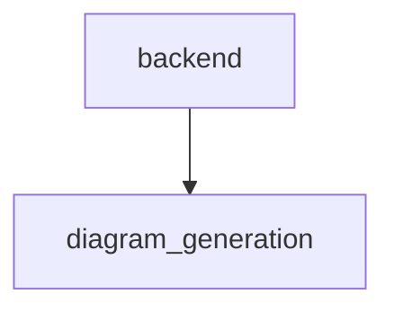
No specific architectural diagram was provided in the analysis data. The system follows a pipeline architecture composed of distinct stages:
1.  **Repository Ingestion:** Clones a Git repository.
2.  **Static Analysis:** Builds an AST, analyzes file dependencies, and identifies code relationships.
3.  **LLM-based Enrichment (Helper LLMs):** Individual code components (functions, classes) are sent to specialized LLMs for detailed analysis.
4.  **Report Synthesis (Main LLM):** The structured data from all previous stages is compiled and sent to a main LLM to generate the final, cohesive documentation.
5.  **Frontend:** A Streamlit application provides the user interface for input and displays the results.

## 5. Code Analysis
### File: `backend/AST_Schema.py`
#### Function: `path_to_module`
*   **Signature:** `def path_to_module(filepath: str, project_root: str)`
*   **Description:** This function converts a given file system path into a Python module path string. It first attempts to calculate a relative path from the `filepath` to the `project_root`, falling back to the base filename if a `ValueError` occurs. It then removes the '.py' extension if present and replaces system path separators with dots. Finally, it handles '__init__' modules by removing the '.__init__' suffix to yield the correct package path.
*   **Parameters:**
    - **name** (`str`): The absolute or relative path to a Python file.
    - **project_root** (`str`): The root directory of the project, used to calculate the relative path.
*   **Returns:**
    - **module_path** (`str`): The converted Python module path string.
*   **Usage:**
    - **Calls:** This function calls no other functions.
    - **Called By:** This function is not explicitly called by any other functions in the provided context.
   **Sequence diagram for path_to_module**
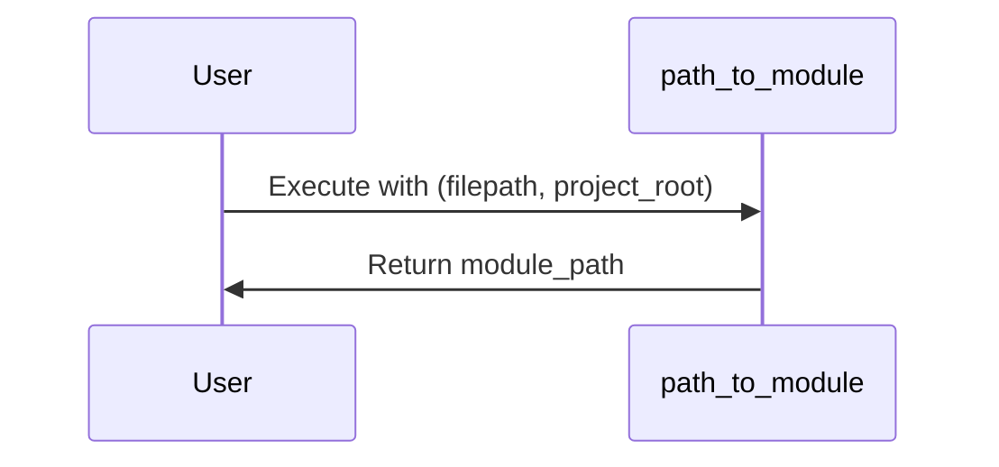

#### Class: `ASTVisitor`
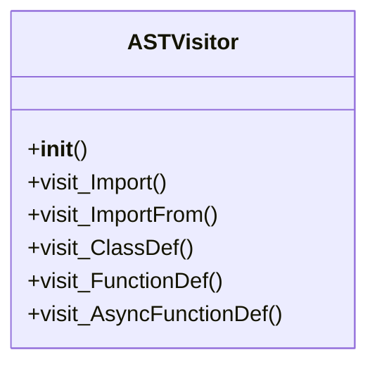
*   **Summary:** The ASTVisitor class extends Python's built-in `ast.NodeVisitor` to systematically traverse the Abstract Syntax Tree (AST) of a given Python source file. Its primary purpose is to extract and structure metadata about imports, class definitions, and function definitions within that file. By overriding specific `visit_` methods, it collects details like identifiers, names, docstrings, and source code segments, organizing them into a `schema` dictionary for further processing. This class serves as a foundational component for static code analysis, enabling the generation of a structured representation of a Python module's contents.
*   **Instantiation:** This class is not explicitly shown to be instantiated by any other components in the provided context.
*   **Dependencies:** The class depends on backend.AST_Schema.path_to_module for converting file paths to module paths.
*   **Constructor:**
    *   *Description:* The `__init__` method initializes an instance of the ASTVisitor. It stores the raw source code, the file's absolute path, and the project's root directory. It then calculates the module's qualified path and sets up an empty `schema` dictionary to accumulate discovered imports, functions, and classes during the AST traversal. Additionally, it initializes `_current_class` to `None` to manage context for nested methods.
    *   *Parameters:*
        - **source_code** (`str`): The raw string content of the Python file being analyzed.
        - **file_path** (`str`): The absolute path to the Python file being visited.
        - **project_root** (`str`): The root directory of the entire project, used for calculating module paths.
*   **Methods:**
    *   **`visit_Import`**
        *   *Signature:* `def visit_Import(self, node: ast.Import)`
        *   *Description:* This method is invoked by the AST traversal mechanism when an `ast.Import` node is encountered. It processes standard import statements (e.g., `import module_name`). For each alias specified in the import, it extracts the module name and appends it to the `imports` list within the visitor's `schema` dictionary. After recording the import, it calls `self.generic_visit(node)` to ensure that any child nodes of the import statement (though rare for simple imports) are also visited.
        *   *Parameters:*
            - **node** (`ast.Import`): The AST node representing an 'import' statement.
        *   *Returns:* This method does not return a value.
        *   **Usage:**
            - **Calls:** This method calls self.generic_visit to continue the AST traversal.
            - **Called By:** This method is called by the ast.NodeVisitor mechanism when an ast.Import node is encountered during traversal.
    *   **`visit_ImportFrom`**
        *   *Signature:* `def visit_ImportFrom(self, node: ast.ImportFrom)`
        *   *Description:* This method handles `ast.ImportFrom` nodes, which correspond to 'from ... import ...' statements. It iterates through each alias within the import statement, constructing a fully qualified name by combining the module name (e.g., `node.module`) with the imported alias (e.g., `alias.name`). This fully qualified import string is then added to the `imports` list in the `self.schema` dictionary. Finally, `self.generic_visit(node)` is called to ensure proper traversal of any potential child nodes.
        *   *Parameters:*
            - **node** (`ast.ImportFrom`): The AST node representing a 'from ... import ...' statement.
        *   *Returns:* This method does not return a value.
        *   **Usage:**
            - **Calls:** This method calls self.generic_visit to continue the AST traversal.
            - **Called By:** This method is called by the ast.NodeVisitor mechanism when an ast.ImportFrom node is encountered during traversal.
    *   **`visit_ClassDef`**
        *   *Signature:* `def visit_ClassDef(self, node: ast.ClassDef)`
        *   *Description:* This method is responsible for processing `ast.ClassDef` nodes, which represent Python class definitions. It constructs a unique identifier for the class, extracts its name, docstring, and the raw source code segment corresponding to the class definition, along with its start and end line numbers. This collected information is then encapsulated into a dictionary and appended to the `classes` list within the `self.schema`. To facilitate the analysis of nested methods, the `_current_class` attribute is temporarily set to the newly created class information before calling `self.generic_visit(node)` for deep traversal, and then reset to `None` afterwards.
        *   *Parameters:*
            - **node** (`ast.ClassDef`): The AST node representing a class definition.
        *   *Returns:* This method does not return a value.
        *   **Usage:**
            - **Calls:** This method calls ast.get_docstring, ast.get_source_segment, and self.generic_visit for AST traversal.
            - **Called By:** This method is called by the ast.NodeVisitor mechanism when an ast.ClassDef node is encountered during traversal.
    *   **`visit_FunctionDef`**
        *   *Signature:* `def visit_FunctionDef(self, node: ast.FunctionDef)`
        *   *Description:* This method processes `ast.FunctionDef` nodes, which represent standard function definitions. It intelligently distinguishes between methods nested within a class and top-level functions by checking the `_current_class` attribute. If a class is active, it creates a method-specific context and appends it to the `method_context` of the current class. Otherwise, it creates a function-specific context and adds it to the `functions` list in `self.schema`. The extracted details include the identifier, name, arguments, docstring, and line numbers. Finally, `self.generic_visit(node)` is called to ensure all child nodes, such as nested functions or expressions, are also processed.
        *   *Parameters:*
            - **node** (`ast.FunctionDef`): The AST node representing a function definition.
        *   *Returns:* This method does not return a value.
        *   **Usage:**
            - **Calls:** This method calls ast.get_docstring, ast.get_source_segment, and self.generic_visit for AST traversal.
            - **Called By:** This method is called by the ast.NodeVisitor mechanism when an ast.FunctionDef node is encountered during traversal.
    *   **`visit_AsyncFunctionDef`**
        *   *Signature:* `def visit_AsyncFunctionDef(self, node: ast.AsyncFunctionDef)`
        *   *Description:* This method is designed to handle `ast.AsyncFunctionDef` nodes, which represent asynchronous function definitions (e.g., `async def`). Instead of implementing separate logic, it directly delegates the processing of these nodes to the `visit_FunctionDef` method. This approach ensures that asynchronous functions are treated consistently with regular functions in terms of how their structural metadata, such as identifiers, arguments, and docstrings, is extracted and stored within the `self.schema`.
        *   *Parameters:*
            - **node** (`ast.AsyncFunctionDef`): The AST node representing an asynchronous function definition.
        *   *Returns:* This method does not return a value.
        *   **Usage:**
            - **Calls:** This method calls self.visit_FunctionDef to process the async function node.
            - **Called By:** This method is called by the ast.NodeVisitor mechanism when an ast.AsyncFunctionDef node is encountered during traversal.
#### Class: `ASTAnalyzer`
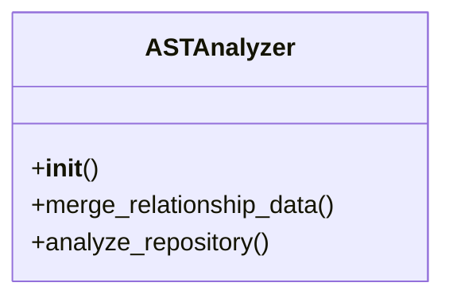
*   **Summary:** The ASTAnalyzer class is designed to perform static analysis on a Python codebase within a Git repository. Its primary responsibilities include parsing Python files to extract their Abstract Syntax Tree (AST) nodes, organizing this information into a structured schema, and then enriching this schema with inter-component relationship data (like function calls and class instantiations). It acts as a central orchestrator for building a detailed, graph-like representation of a project's code structure and its internal dependencies.
*   **Instantiation:** This class is not explicitly instantiated by any known components within the provided context.
*   **Dependencies:** This class depends on 'ast' for parsing Python code, 'os' for path manipulation, and 'backend.AST_Schema.ASTVisitor' for traversing ASTs and extracting schema information.
*   **Constructor:**
    *   *Description:* This constructor initializes an instance of the ASTAnalyzer class. It does not take any specific parameters beyond 'self' and performs no explicit setup or attribute assignments.
    *   *Parameters:*
*   **Methods:**
    *   **`merge_relationship_data`**
        *   *Signature:* `def merge_relationship_data(self, full_schema: dict, raw_relationships: dict)`
        *   *Description:* This method integrates raw relationship data (incoming and outgoing calls) into a structured full schema. It iterates through files, functions, and classes within the schema, updating their respective 'context' fields with call relationships and identifying class-level dependencies. The method ensures that each function's 'calls' and 'called_by' lists are populated, and for classes, it populates 'instantiated_by', 'method_context' calls/called_by, and calculates 'class_dependencies'.
        *   *Parameters:*
            - **self** (`ASTAnalyzer`): The instance of the class.
            - **full_schema** (`dict`): The comprehensive schema structure to be updated, representing the complete AST schema of the repository.
            - **raw_relationships** (`dict`): A dictionary containing raw incoming and outgoing call relationships, including function/method calls and class instantiations.
        *   *Returns:*
            - **full_schema** (`dict`): The updated 'full_schema' dictionary, now enriched with call and instantiation relationship data.
        *   **Usage:**
            - **Calls:** This method primarily uses dictionary 'get' operations and list manipulations. It does not explicitly call other methods or classes.
            - **Called By:** This method is not called by any other function or method within the provided context.
    *   **`analyze_repository`**
        *   *Signature:* `def analyze_repository(self, files: list, repo: GitRepository)`
        *   *Description:* This method processes a list of file objects from a Git repository to build a comprehensive AST schema. It filters for Python files, reads their content, and uses an ASTVisitor to parse each file's Abstract Syntax Tree. The method constructs a 'full_schema' dictionary, organizing parsed functions, classes, and imports by file path, while handling potential SyntaxError or ValueError exceptions during parsing. It also determines the project root for relative path calculations.
        *   *Parameters:*
            - **self** (`ASTAnalyzer`): The instance of the class.
            - **files** (`list`): A list of file objects, each expected to have 'path' and 'content' attributes, to be analyzed from the repository.
            - **repo** (`GitRepository`): The Git repository object from which files are sourced.
        *   *Returns:*
            - **full_schema** (`dict`): A dictionary representing the AST schema of the analyzed repository, structured by file path, containing parsed nodes like imports, functions, and classes.
        *   **Usage:**
            - **Calls:** This method calls 'os.path.commonpath', 'os.path.isfile', 'os.path.dirname', 'ast.parse', and instantiates 'ASTVisitor'.
            - **Called By:** This method is not called by any other function or method within the provided context.
---
### File: `backend/File_Dependency.py`
#### Function: `build_file_dependency_graph`
*   **Signature:** `def build_file_dependency_graph(filename: str, tree: AST, repo_root: str)`
*   **Description:** This function constructs a directed graph representing file-level import dependencies within a given Abstract Syntax Tree (AST). It initializes a networkx.DiGraph and then uses a FileDependencyGraph visitor to traverse the provided AST. The visitor extracts import relationships, which are then used to populate the graph. Each file involved in an import relationship becomes a node, and a directed edge is added from the importing file to the imported file, effectively mapping out the project's internal file dependencies.
*   **Parameters:**
    - **filename** (`str`): The name of the file currently being analyzed for dependencies.
    - **tree** (`AST`): The Abstract Syntax Tree (AST) of the file to be analyzed.
    - **repo_root** (`str`): The root directory of the repository, used for resolving relative import paths.
*   **Returns:**
    - **graph** (`networkx.DiGraph`): A directed graph where nodes represent files and edges represent import dependencies (from caller to callee).
*   **Usage:**
    - **Calls:** This function calls backend.File_Dependency.FileDependencyGraph.
    - **Called By:** This function is called by no other functions.
   **Sequence diagram for build_file_dependency_graph**
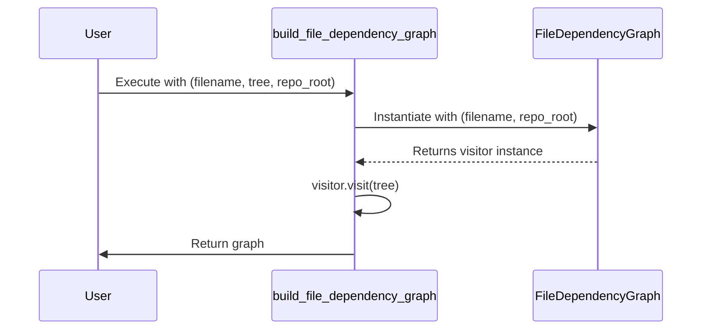

#### Function: `build_repository_graph`
   **Sequence diagram for build_repository_graph**
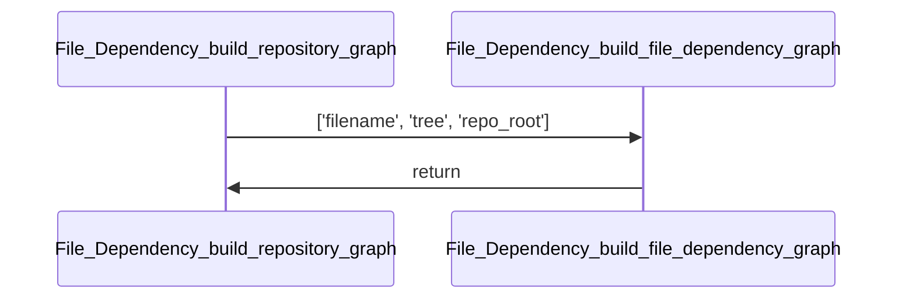
*   **Signature:** `def build_repository_graph(repository: GitRepository)`
*   **Description:** This function constructs a directed graph representing the dependencies between files within a given Git repository. It first retrieves all files from the repository and filters them to include Python files or those located in the 'backend' directory. For each relevant file, it parses its content to build a file-specific dependency graph. Finally, it aggregates these individual file graphs into a single, comprehensive global directed graph, which is then returned.
*   **Parameters:**
    - **repository** (`GitRepository`): The GitRepository object representing the repository from which to build the dependency graph.
*   **Returns:**
    - **global_graph** (`nx.DiGraph`): A NetworkX directed graph where nodes represent files or entities within files, and edges represent dependencies between them across the repository.
*   **Usage:**
    - **Calls:** This function calls backend.File_Dependency.build_file_dependency_graph.
    - **Called By:** This function is not explicitly called by any other functions in the provided context.
   **Sequence diagram for build_repository_graph**
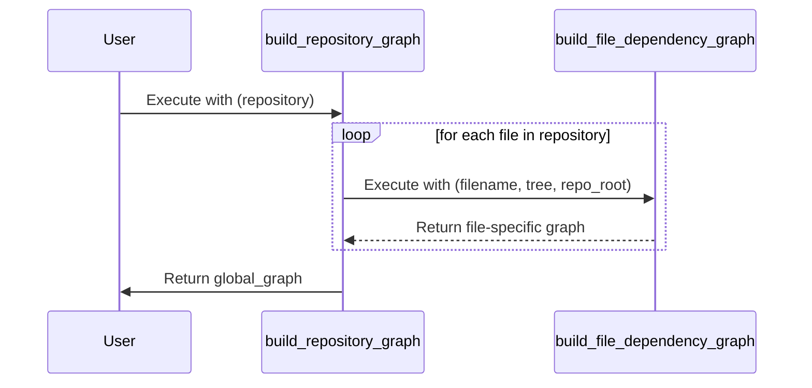

#### Function: `get_all_temp_files`
*   **Signature:** `def get_all_temp_files(directory: str)`
*   **Description:** The `get_all_temp_files` function takes a directory path as a string input. It converts this string into an absolute `pathlib.Path` object to establish the root for its search. The function then recursively traverses this root directory to locate all files that have a '.py' extension. Finally, it compiles these found Python files into a list, with each file's path represented as a `pathlib.Path` object relative to the initial root directory, and returns this list.
*   **Parameters:**
    - **directory** (`str`): The string path to the root directory from which to begin the recursive search for Python files.
*   **Returns:**
    - **all_files** (`list[Path]`): A list of `pathlib.Path` objects, where each object represents a Python file found within the specified directory, with its path relative to the provided `directory`.
*   **Usage:**
    - **Calls:** This function calls no other functions.
    - **Called By:** This function is not called by any other functions.
   **Sequence diagram for get_all_temp_files**
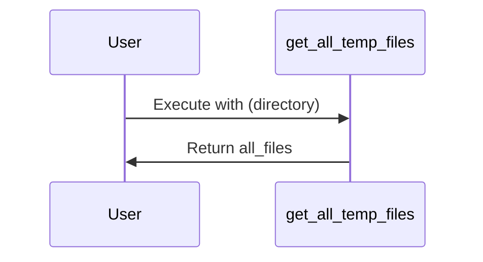

#### Class: `FileDependencyGraph`
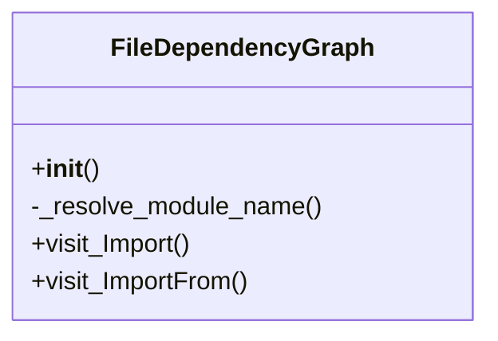
*   **Summary:** The FileDependencyGraph class is an AST NodeVisitor designed to analyze Python source code files and build a graph of their import dependencies. It processes both absolute and relative import statements, identifying which modules or symbols a given file depends on. The class maintains an 'import_dependencies' dictionary, mapping each analyzed filename to a set of its direct imported modules or symbols, effectively capturing the file-level dependencies within a repository.
*   **Instantiation:** The instantiation points for this class are not specified in the provided context.
*   **Dependencies:** The class depends on 'get_all_temp_files' for listing repository files, and internally defines and uses 'module_file_exists' and 'init_exports_symbol' for resolving module paths and exported symbols. It also relies heavily on the 'ast' module for parsing and traversing the Abstract Syntax Tree, and 'pathlib.Path' for path manipulations.
*   **Constructor:**
    *   *Description:* The constructor initializes a new instance of the FileDependencyGraph. It takes the current filename being analyzed and the root directory of the repository as arguments, storing them as instance attributes for later use in dependency resolution.
    *   *Parameters:*
        - **filename** (`str`): The name of the file currently being analyzed for dependencies.
        - **repo_root** (`str`): The root directory path of the repository where the files reside.
*   **Methods:**
    *   **`_resolve_module_name`**
        *   *Signature:* `def _resolve_module_name(self, node: ImportFrom)`
        *   *Description:* This private method is responsible for resolving relative import statements, such as 'from .. import name1, name2'. It calculates the correct module path based on the import level and the current file's location within the repository. The method searches for existing Python files or '__init__.py' files that export the specified symbols, returning a list of successfully resolved module or symbol names. If no modules or symbols can be resolved, it raises an ImportError.
        *   *Parameters:*
            - **node** (`ImportFrom`): The AST ImportFrom node representing the relative import statement to be resolved.
        *   *Returns:*
            - **resolved** (`list[str]`): A list of strings, where each string is a successfully resolved module or symbol name.
        *   **Usage:**
            - **Calls:** This method calls 'get_all_temp_files' to retrieve all files in the repository, and internally defines and calls 'module_file_exists' and 'init_exports_symbol' to verify module and symbol existence. It also uses 'Path' for path manipulation, 'iskeyword' for identifier validation, and 'parse', 'walk', and 'literal_eval' from the 'ast' module for source code analysis.
            - **Called By:** This method is called by 'visit_ImportFrom' when processing an 'ImportFrom' node that represents a relative import.
    *   **`visit_Import`**
        *   *Signature:* `def visit_Import(self, node: Import | ImportFrom, base_name: str | None)`
        *   *Description:* This method is a visitor function for AST 'Import' and 'ImportFrom' nodes. Its primary role is to record the identified import dependencies. It adds the imported module or symbol name to the 'import_dependencies' dictionary, associating it with the current file being analyzed. If a 'base_name' is provided, it uses that; otherwise, it uses the alias name from the import node.
        *   *Parameters:*
            - **node** (`Import | ImportFrom`): The AST node representing either an 'import' or 'from ... import' statement.
            - **base_name** (`str | None`): An optional base name for the module, typically used when the module part of a 'from ... import' statement has been pre-resolved.
        *   *Returns:* This method does not return a value.
        *   **Usage:**
            - **Calls:** This method calls 'self.generic_visit(node)' to ensure that the AST traversal continues to child nodes of the current import statement.
            - **Called By:** This method is called by the AST 'NodeVisitor' framework when an 'Import' node is encountered, and explicitly by 'visit_ImportFrom' after resolving module names.
    *   **`visit_ImportFrom`**
        *   *Signature:* `def visit_ImportFrom(self, node: ImportFrom)`
        *   *Description:* This method is a specialized visitor for AST 'ImportFrom' nodes, handling 'from ... import ...' statements. It distinguishes between absolute and relative imports. For absolute imports, it extracts the base module name and delegates to 'visit_Import'. For relative imports, it calls '_resolve_module_name' to determine the actual modules or symbols before passing them to 'visit_Import'. It also includes error handling for failed relative import resolutions.
        *   *Parameters:*
            - **node** (`ImportFrom`): The AST ImportFrom node representing the 'from ... import ...' statement to be visited.
        *   *Returns:* This method does not return a value.
        *   **Usage:**
            - **Calls:** This method calls 'self._resolve_module_name' to handle the resolution of relative imports and 'self.visit_Import' to record the identified dependencies. It also calls 'self.generic_visit(node)' to continue the AST traversal.
            - **Called By:** This method is implicitly called by the AST 'NodeVisitor' framework when an 'ImportFrom' node is encountered during AST traversal.
---
### File: `backend/HelperLLM.py`
#### Class: `LLMHelper`
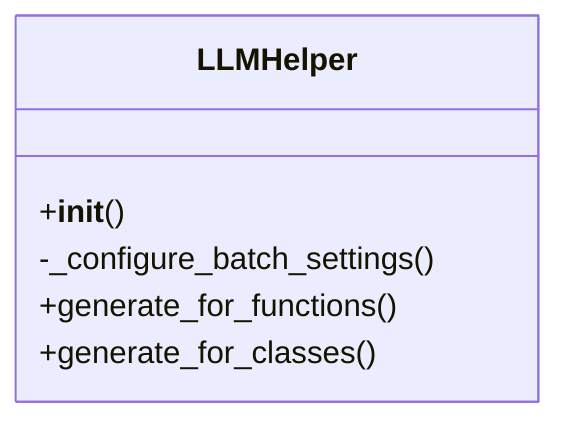
*   **Summary:** The LLMHelper class serves as a robust interface for interacting with various Large Language Models (LLMs) to generate structured documentation for Python functions and classes. It centralizes API interaction, manages model-specific configurations like batch sizes, and handles error conditions. The class is designed to load specific system prompts for different analysis types and uses LangChain's structured output features to ensure the generated documentation adheres to predefined Pydantic schemas, facilitating reliable and validated data generation.
*   **Instantiation:** This class is not explicitly instantiated by other methods or functions within the provided context.
*   **Dependencies:** The class depends on `json`, `logging`, `time`, `typing.List`, `typing.Optional`, `dotenv.load_dotenv`, `langchain_google_genai.ChatGoogleGenerativeAI`, `langchain_ollama.ChatOllama`, `langchain_openai.ChatOpenAI`, `langchain_core.messages.HumanMessage`, `langchain_core.messages.SystemMessage`, `schemas.types.FunctionAnalysis`, `schemas.types.ClassAnalysis`, `schemas.types.FunctionAnalysisInput`, and `schemas.types.ClassAnalysisInput`.
*   **Constructor:**
    *   *Description:* The constructor initializes the LLMHelper by loading system prompts from specified file paths, configuring batch settings based on the model name, and setting up various LangChain LLM instances (Google Gemini, OpenAI, custom API, or Ollama) with structured output capabilities for function and class analysis, as well as a raw LLM. It handles FileNotFoundError for prompt files and ValueError if base_url is missing for custom models.
    *   *Parameters:*
        - **api_key** (`str`): The API key required for authenticating with the chosen LLM service.
        - **function_prompt_path** (`str`): The file path to the system prompt specifically designed for function analysis.
        - **class_prompt_path** (`str`): The file path to the system prompt specifically designed for class analysis.
        - **model_name** (`str`): The name of the LLM model to be used, defaulting to 'gemini-2.0-flash-lite'.
        - **base_url** (`str | None`): An optional base URL for custom LLM API endpoints, required for certain model types.
*   **Methods:**
    *   **`_configure_batch_settings`**
        *   *Signature:* `def _configure_batch_settings(self, model_name: str)`
        *   *Description:* This private method sets the `batch_size` attribute of the instance based on the provided `model_name`. It assigns specific batch sizes for various Gemini and Llama models, and a default large batch size for custom or generic models, logging a warning for unknown models. This helps optimize API calls by grouping requests according to model-specific rate limits or recommendations.
        *   *Parameters:*
            - **model_name** (`str`): The name of the LLM model for which to configure batch settings.
        *   *Returns:* This method does not return a value.
        *   **Usage:**
            - **Calls:** This method does not explicitly call other methods, classes, or functions within its source code.
            - **Called By:** This method is called by `__init__`.
    *   **`generate_for_functions`**
        *   *Signature:* `def generate_for_functions(self, function_inputs: List[FunctionAnalysisInput])`
        *   *Description:* This method takes a list of `FunctionAnalysisInput` objects, converts them into JSON payloads, and then sends them in batches to the configured `function_llm` for structured function analysis. It handles batching, includes a system prompt, and incorporates a waiting period between batches to respect API rate limits. If an error occurs during a batch call, it logs the error and fills the corresponding results with `None` to maintain order.
        *   *Parameters:*
            - **function_inputs** (`List[FunctionAnalysisInput]`): A list of input objects containing function source code and context for analysis.
        *   *Returns:*
            - **all_validated_functions** (`List[Optional[FunctionAnalysis]]`): A list of `FunctionAnalysis` objects or `None` for each input, representing the structured documentation.
        *   **Usage:**
            - **Calls:** This method calls `json.dumps`, `function_input.model_dump`, `SystemMessage`, `HumanMessage`, `self.function_llm.batch`, `logging.info`, `logging.error`, and `time.sleep`.
            - **Called By:** This method is not explicitly called by other methods or functions within the provided context.
    *   **`generate_for_classes`**
        *   *Signature:* `def generate_for_classes(self, class_inputs: List[ClassAnalysisInput])`
        *   *Description:* This method is designed to generate and validate documentation for a batch of classes. It takes a list of `ClassAnalysisInput` objects, converts them into JSON payloads, and submits them in batches to the `class_llm` for structured class analysis. Similar to `generate_for_functions`, it manages batching, applies a system prompt, and includes a delay between batches to adhere to rate limits. Errors during batch processing are logged, and `None` values are inserted for failed items to preserve result order.
        *   *Parameters:*
            - **class_inputs** (`List[ClassAnalysisInput]`): A list of input objects containing class source code and context for analysis.
        *   *Returns:*
            - **all_validated_classes** (`List[Optional[ClassAnalysis]]`): A list of `ClassAnalysis` objects or `None` for each input, representing the structured documentation.
        *   **Usage:**
            - **Calls:** This method calls `json.dumps`, `class_input.model_dump`, `SystemMessage`, `HumanMessage`, `self.class_llm.batch`, `logging.info`, `logging.error`, and `time.sleep`.
            - **Called By:** This method is not explicitly called by other methods or functions within the provided context.
---
### File: `backend/MainLLM.py`
#### Class: `MainLLM`
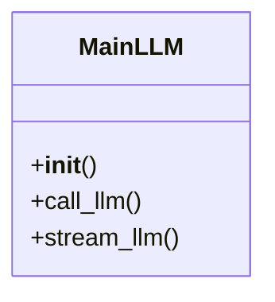
*   **Summary:** The MainLLM class provides a unified interface for interacting with various Large Language Models (LLMs), abstracting away the underlying provider specifics. It initializes by loading a system prompt from a specified file and configuring the appropriate LLM client (e.g., Google Generative AI, OpenAI-compatible, or Ollama) based on the provided model name and base URL. The class offers methods for both direct, single-response LLM calls and streaming interactions, ensuring robust error handling for both scenarios.
*   **Instantiation:** This class is not explicitly instantiated by any other component within the provided context.
*   **Dependencies:** The class depends on the 'logging' module for output, 'langchain_google_genai.ChatGoogleGenerativeAI', 'langchain_ollama.ChatOllama', and 'langchain_openai.ChatOpenAI' for integrating with different LLM providers, and 'langchain_core.messages.HumanMessage', 'langchain_core.messages.SystemMessage' for structuring messages.
*   **Constructor:**
    *   *Description:* This constructor initializes the MainLLM instance by first reading the system prompt from the given file path. It then dynamically sets up the appropriate LLM client (ChatGoogleGenerativeAI, ChatOpenAI, or ChatOllama) based on the `model_name` and `base_url` parameters, handling different LLM providers and custom API endpoints. It stores the system prompt, model name, and the configured LLM client as instance attributes.
    *   *Parameters:*
        - **api_key** (`str`): The API key required for authenticating with the chosen LLM service.
        - **prompt_file_path** (`str`): The file path to a text file containing the system-level prompt for the LLM.
        - **model_name** (`str`): The name of the LLM model to be used, defaulting to 'gemini-2.5-pro'. This determines which LLM client is instantiated.
        - **base_url** (`str`): An optional base URL for custom LLM APIs or Ollama. It is required for certain custom or self-hosted models.
*   **Methods:**
    *   **`call_llm`**
        *   *Signature:* `def call_llm(self, user_input: str)`
        *   *Description:* This method facilitates a synchronous, single-shot interaction with the configured LLM. It constructs a list of messages, combining the instance's system prompt with the provided user input, and then invokes the LLM to get a response. The method includes error handling to log any exceptions during the LLM call and returns the content of the LLM's response or None if an error occurs.
        *   *Parameters:*
            - **user_input** (`str`): The user's input string to be sent to the LLM for a response.
        *   *Returns:*
            - **content** (`str`): The textual content of the LLM's response.
            - **None** (`None`): Returns None if an error occurs during the LLM invocation.
        *   **Usage:**
            - **Calls:** This method constructs SystemMessage and HumanMessage objects and then calls the 'invoke' method on the internal LLM client.
            - **Called By:** This method is not explicitly called by any other method within the provided context.
    *   **`stream_llm`**
        *   *Signature:* `def stream_llm(self, user_input: str)`
        *   *Description:* This method provides a streaming interface to the LLM, allowing for real-time reception of content chunks as they are generated. It prepares the system and human messages, similar to `call_llm`, but then utilizes the LLM's `stream` method to yield each chunk of content. Error handling is implemented to catch exceptions during the streaming process and yield an informative error message.
        *   *Parameters:*
            - **user_input** (`str`): The user's input string to be sent to the LLM for a streaming response.
        *   *Returns:*
            - **chunk.content** (`str`): Yields individual chunks of text content from the LLM's streamed response.
            - **error_message** (`str`): Yields an error message string if an exception occurs during the streaming call.
        *   **Usage:**
            - **Calls:** This method constructs SystemMessage and HumanMessage objects and then calls the 'stream' method on the internal LLM client.
            - **Called By:** This method is not explicitly called by any other method within the provided context.
---
### File: `backend/basic_info.py`
#### Class: `ProjektInfoExtractor`
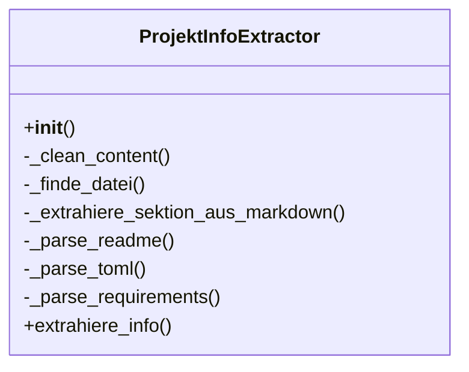
*   **Summary:** The ProjektInfoExtractor class is designed to systematically extract and consolidate fundamental project details from common project files such as README, pyproject.toml, and requirements.txt. It initializes a structured dictionary to store various project overview and installation-related information, using placeholder values for data not found. The class orchestrates the parsing of these files, prioritizing information from configuration files like pyproject.toml and requirements.txt over README, and can also derive a project title from a repository URL if no other title is found.
*   **Instantiation:** This class is not explicitly instantiated by other components within the provided context.
*   **Dependencies:** This class depends on the 're' module for regular expressions, the 'os' module for path manipulation, and optionally the 'tomllib' module for TOML parsing. It also uses types from the 'typing' module.
*   **Constructor:**
    *   *Description:* The constructor initializes the ProjektInfoExtractor instance by setting a default 'Information not found' string and creating a nested dictionary `self.info`. This dictionary serves as the central storage for extracted project details, including project overview (title, description, status, features, tech stack) and installation information (dependencies, setup guide, quick start guide), all pre-filled with the 'Information not found' placeholder.
    *   *Parameters:*
*   **Methods:**
    *   **`_clean_content`**
        *   *Signature:* `def _clean_content(self, content: str)`
        *   *Description:* This private helper method is responsible for sanitizing input string content by removing null bytes. Null bytes can often appear due to encoding errors, particularly when a file encoded in UTF-16 is incorrectly read as UTF-8. The method checks if the content is empty and returns an empty string if so; otherwise, it performs a simple string replacement to eliminate any '\x00' characters.
        *   *Parameters:*
            - **content** (`str`): The string content to be cleaned.
        *   *Returns:*
            - **cleaned_content** (`str`): The cleaned string content with null bytes removed.
        *   **Usage:**
            - **Calls:** This method does not explicitly call other functions or methods.
            - **Called By:** This method is called by _parse_readme, _parse_toml, and _parse_requirements.
    *   **`_finde_datei`**
        *   *Signature:* `def _finde_datei(self, patterns: List[str], dateien: List[Any])`
        *   *Description:* This private helper method searches for a specific file within a given list of file objects, matching against a list of patterns in a case-insensitive manner. It iterates through each file and then through each pattern, checking if the file's path attribute ends with the current pattern. The first file found that matches any of the provided patterns is returned, otherwise, it returns None.
        *   *Parameters:*
            - **patterns** (`List[str]`): A list of string patterns (e.g., file extensions or full names) to match against file paths.
            - **dateien** (`List[Any]`): A list of file objects, where each object is expected to have a 'path' attribute.
        *   *Returns:*
            - **found_file** (`Optional[Any]`): The first file object that matches one of the patterns, or None if no match is found.
        *   **Usage:**
            - **Calls:** This method does not explicitly call other functions or methods.
            - **Called By:** This method is called by extrahiere_info.
    *   **`_extrahiere_sektion_aus_markdown`**
        *   *Signature:* `def _extrahiere_sektion_aus_markdown(self, inhalt: str, keywords: List[str])`
        *   *Description:* This private method extracts text content located directly beneath a Markdown H2 heading (##) identified by a list of keywords. It constructs a regular expression pattern to find headings that match any of the provided keywords, then captures all content following that heading until the next H2 heading or the end of the document. The search is case-insensitive and handles multi-line content.
        *   *Parameters:*
            - **inhalt** (`str`): The full Markdown content string from which to extract a section.
            - **keywords** (`List[str]`): A list of keywords to match against Markdown H2 headings.
        *   *Returns:*
            - **section_content** (`Optional[str]`): The stripped string content of the section found under the matching heading, or None if no matching section is found.
        *   **Usage:**
            - **Calls:** This method calls re.escape, re.compile, and re.search.
            - **Called By:** This method is called by _parse_readme.
    *   **`_parse_readme`**
        *   *Signature:* `def _parse_readme(self, inhalt: str)`
        *   *Description:* This private method parses the content of a README file to extract various project details, including title, description, key features, tech stack, status, installation instructions, and a quick start guide. It first cleans the content of null bytes. It then uses regular expressions to find the main title and a fallback description. For other sections, it utilizes the `_extrahiere_sektion_aus_markdown` helper to locate and extract content under specific H2 headings, updating the `self.info` dictionary if information is found and not already populated.
        *   *Parameters:*
            - **inhalt** (`str`): The string content of the README file to be parsed.
        *   *Returns:* This method does not return a value.
        *   **Usage:**
            - **Calls:** This method calls self._clean_content, re.search, and self._extrahiere_sektion_aus_markdown.
            - **Called By:** This method is called by extrahiere_info.
    *   **`_parse_toml`**
        *   *Signature:* `def _parse_toml(self, inhalt: str)`
        *   *Description:* This private method parses the content of a `pyproject.toml` file to extract project name, description, and dependencies. It begins by cleaning the input content. It checks for the availability of the `tomllib` module and issues a warning if it's not installed, preventing further parsing. If `tomllib` is available, it attempts to load the TOML content and extract relevant 'project' data, updating the `self.info` dictionary with found values. It includes error handling for `TOMLDecodeError` during parsing.
        *   *Parameters:*
            - **inhalt** (`str`): The string content of the pyproject.toml file to be parsed.
        *   *Returns:* This method does not return a value.
        *   **Usage:**
            - **Calls:** This method calls self._clean_content, tomllib.loads, and data.get.
            - **Called By:** This method is called by extrahiere_info.
    *   **`_parse_requirements`**
        *   *Signature:* `def _parse_requirements(self, inhalt: str)`
        *   *Description:* This private method parses the content of a `requirements.txt` file to extract project dependencies. It first cleans the input content. It only populates the dependencies in `self.info` if they haven't already been found from a `pyproject.toml` file, ensuring prioritization. It processes each line, stripping whitespace and ignoring comments, then stores the valid dependency lines as a list in the `self.info` dictionary.
        *   *Parameters:*
            - **inhalt** (`str`): The string content of the requirements.txt file to be parsed.
        *   *Returns:* This method does not return a value.
        *   **Usage:**
            - **Calls:** This method calls self._clean_content.
            - **Called By:** This method is called by extrahiere_info.
    *   **`extrahiere_info`**
        *   *Signature:* `def extrahiere_info(self, dateien: List[Any], repo_url: str)`
        *   *Description:* This public method orchestrates the entire information extraction process from various project files and a repository URL. It first identifies relevant files (README, pyproject.toml, requirements.txt) using `_finde_datei`. It then parses these files in a specific order: `pyproject.toml` first for primary project data, then `requirements.txt` for dependencies, and finally `README` to fill in any remaining or supplementary information. After parsing, it formats the dependencies and attempts to derive a project title from the `repo_url` if no title was found elsewhere. Finally, it returns the consolidated `self.info` dictionary.
        *   *Parameters:*
            - **dateien** (`List[Any]`): A list of file objects, each expected to have 'path' and 'content' attributes, representing files in the project.
            - **repo_url** (`str`): The URL of the repository, used as a fallback to derive a project title.
        *   *Returns:*
            - **project_info** (`Dict[str, Any]`): A dictionary containing all extracted project information, structured into 'projekt_uebersicht' and 'installation' sections.
        *   **Usage:**
            - **Calls:** This method calls self._finde_datei, self._parse_toml, self._parse_requirements, self._parse_readme, os.path.basename, and repo_url.removesuffix.
            - **Called By:** This method is not explicitly called by other methods within the provided context.
---
### File: `backend/callgraph.py`
#### Function: `build_callGraph`
*   **Signature:** `def build_callGraph(tree: ast.AST, filename: str)`
*   **Description:** This function constructs a directed call graph from a given Abstract Syntax Tree (AST) and filename. It initializes a CallGraph visitor to traverse the AST, collecting information about functions and their calls. The function then iterates through the collected call edges, adding nodes and edges to a networkx.DiGraph exclusively for functions that are identified as part of the 'own functions' set. The resulting graph represents the call relationships within the analyzed code.
*   **Parameters:**
    - **tree** (`ast.AST`): The Abstract Syntax Tree (AST) object representing the code to be analyzed for call relationships.
    - **filename** (`str`): The name of the file from which the AST was generated, used by the CallGraph visitor for context.
*   **Returns:**
    - **graph** (`nx.DiGraph`): A directed graph representing the call relationships between functions defined within the provided AST.
*   **Usage:**
    - **Calls:** This function calls backend.callgraph.CallGraph.
    - **Called By:** This function is not explicitly called by any other functions in the provided context.
   **Sequence diagram for build_callGraph**
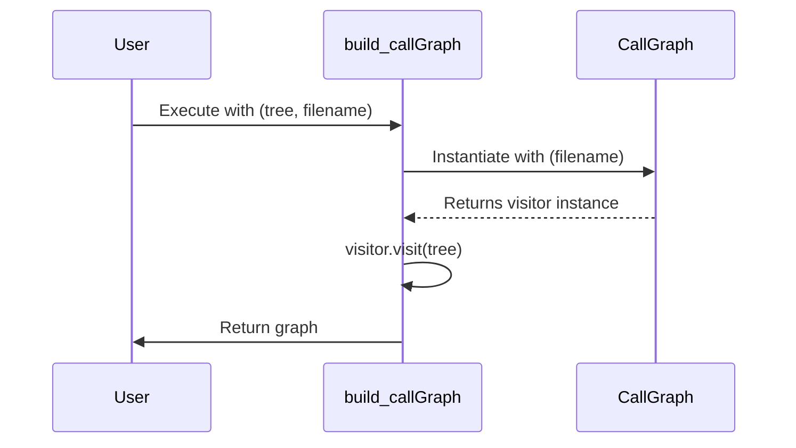

#### Function: `make_safe_dot`
*   **Signature:** `def make_safe_dot(graph: networkx.DiGraph, out_path: str)`
*   **Description:** The `make_safe_dot` function takes a NetworkX directed graph and an output file path. It creates a copy of the input graph and relabels all its nodes with simple, safe string identifiers (e.g., "n0", "n1"). The original node names are preserved by storing them as a 'label' attribute on the newly named nodes. Finally, the function writes this modified graph, with its safely relabeled nodes, to a DOT file at the specified output path using `nx.drawing.nx_pydot.write_dot`.
*   **Parameters:**
    - **graph** (`networkx.DiGraph`): The directed graph whose nodes need to be relabeled for safe DOT file generation.
    - **out_path** (`str`): The file path where the DOT representation of the graph, with safe node names, will be saved.
*   **Returns:** This function does not return a value.
*   **Usage:**
    - **Calls:** This function calls no other functions.
    - **Called By:** This function is not explicitly called by any other functions in the provided context.
   **Sequence diagram for make_safe_dot**
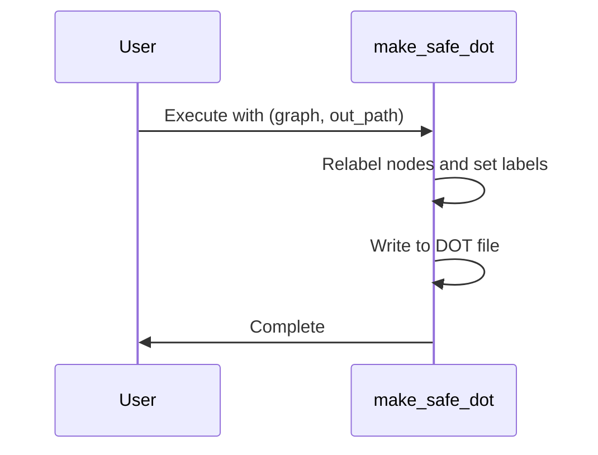

#### Class: `CallGraph`
*   **Summary:** The CallGraph class is an ast.NodeVisitor designed to construct a directed call graph for a given Python source file. It systematically traverses the Abstract Syntax Tree (AST) of a Python file, identifying function definitions, class definitions, import statements, and function calls. By maintaining context such as the current filename, class, and function, it resolves call targets to fully qualified names and records these relationships as edges in a NetworkX graph. The class provides a comprehensive mechanism for static analysis of function and method calls within a single Python file.
*   **Instantiation:** This class is not explicitly instantiated by any known components within the provided context.
*   **Dependencies:** This class does not explicitly depend on any external components within the provided context.
*   **Constructor:**
    *   *Description:* The constructor initializes the CallGraph visitor by setting up essential attributes for tracking the current parsing context (filename, current function, current class) and data structures for building the call graph. It creates a NetworkX directed graph, dictionaries for local definitions and import mappings, and sets for functions and edges to store call relationships.
    *   *Parameters:*
        - **filename** (`str`): The name of the file being analyzed, used for full name resolution.
*   **Methods:**
    *   **`_recursive_call`**
        *   *Signature:* `def _recursive_call(self, node: ast.AST)`
        *   *Description:* This private helper method recursively traverses an Abstract Syntax Tree (AST) node representing a function call to extract its full name components. It handles ast.Call, ast.Name, and ast.Attribute nodes, building a list of dotted name parts. The method effectively deconstructs a call expression into its constituent identifiers, such as ['pkg', 'mod', 'Class', 'method'].
        *   *Parameters:*
            - **node** (`ast.AST`): The AST node representing a call, name, or attribute.
        *   *Returns:*
            - **parts** (`list[str]`): A list of string components representing the fully qualified name of the called entity.
        *   **Usage:**
            - **Calls:** This method does not explicitly call other methods, classes, or functions within the provided context.
            - **Called By:** This method is not explicitly called by other functions or methods within the provided context.
    *   **`_resolve_all_callee_names`**
        *   *Signature:* `def _resolve_all_callee_names(self, callee_nodes: list[list[str]])`
        *   *Description:* This private method takes a list of potential callee name components and resolves them to their fully qualified names within the context of the current file. It prioritizes resolution by checking local definitions (self.local_defs), then import mappings (self.import_mapping), and finally constructs a full name using the current filename and class if no other resolution is found. This ensures that calls to local functions, imported modules/functions, and class methods are correctly identified.
        *   *Parameters:*
            - **callee_nodes** (`list[list[str]]`): A list where each inner list contains name components of a potential callee.
        *   *Returns:*
            - **resolved** (`list[str]`): A list of fully qualified string names for the resolved callees.
        *   **Usage:**
            - **Calls:** This method does not explicitly call other methods, classes, or functions within the provided context.
            - **Called By:** This method is not explicitly called by other functions or methods within the provided context.
    *   **`_make_full_name`**
        *   *Signature:* `def _make_full_name(self, basename: str, class_name: str | None)`
        *   *Description:* This private helper method constructs a fully qualified name for a given base name, optionally including a class name. It prepends the self.filename to the base name, and if a class_name is provided, it inserts it between the filename and the base name, using "::" as a separator. This standardization is crucial for uniquely identifying functions and methods across the entire project.
        *   *Parameters:*
            - **basename** (`str`): The base name of the function or method.
            - **class_name** (`str | None`): The name of the class if the entity is a method, otherwise None.
        *   *Returns:*
            - **full_name** (`str`): The fully qualified name of the entity.
        *   **Usage:**
            - **Calls:** This method does not explicitly call other methods, classes, or functions within the provided context.
            - **Called By:** This method is not explicitly called by other functions or methods within the provided context.
    *   **`_current_caller`**
        *   *Signature:* `def _current_caller(self)`
        *   *Description:* This private method determines the identifier of the currently active caller context. If self.current_function is set, it returns that value, indicating a function or method is being processed. Otherwise, it returns a default string representing the global scope, either using the filename or a generic '<global-scope>' placeholder. This is essential for attributing calls to their correct source.
        *   *Parameters:*
        *   *Returns:*
            - **caller_identifier** (`str`): The identifier of the current calling context.
        *   **Usage:**
            - **Calls:** This method does not explicitly call other methods, classes, or functions within the provided context.
            - **Called By:** This method is not explicitly called by other functions or methods within the provided context.
    *   **`visit_Import`**
        *   *Signature:* `def visit_Import(self, node: ast.Import)`
        *   *Description:* This method, part of the ast.NodeVisitor pattern, processes ast.Import nodes. It iterates through the imported modules, extracting their original names and any asname aliases. These mappings are then stored in self.import_mapping to facilitate later resolution of imported calls. After processing the import statement, it calls self.generic_visit to continue traversing the AST.
        *   *Parameters:*
            - **node** (`ast.Import`): The AST node representing an import statement.
        *   *Returns:* This method does not return a value.
        *   **Usage:**
            - **Calls:** This method does not explicitly call other methods, classes, or functions within the provided context.
            - **Called By:** This method is not explicitly called by other functions or methods within the provided context.
    *   **`visit_ImportFrom`**
        *   *Signature:* `def visit_ImportFrom(self, node: ast.ImportFrom)`
        *   *Description:* This method handles ast.ImportFrom nodes, which represent 'from ... import ...' statements. It extracts the module name and then iterates through the specific names being imported. For each imported name, it creates a mapping in self.import_mapping from the alias (or original name) to the module name. This allows the call graph to correctly link calls to imported functions or classes back to their originating module.
        *   *Parameters:*
            - **node** (`ast.ImportFrom`): The AST node representing a 'from ... import ...' statement.
        *   *Returns:* This method does not return a value.
        *   **Usage:**
            - **Calls:** This method does not explicitly call other methods, classes, or functions within the provided context.
            - **Called By:** This method is not explicitly called by other functions or methods within the provided context.
    *   **`visit_ClassDef`**
        *   *Signature:* `def visit_ClassDef(self, node: ast.ClassDef)`
        *   *Description:* This method processes ast.ClassDef nodes, which represent class definitions. It temporarily updates self.current_class to the name of the class being visited, allowing nested methods to correctly identify their parent class. After visiting all children nodes within the class definition using self.generic_visit, it restores self.current_class to its previous value, ensuring proper context management during AST traversal.
        *   *Parameters:*
            - **node** (`ast.ClassDef`): The AST node representing a class definition.
        *   *Returns:* This method does not return a value.
        *   **Usage:**
            - **Calls:** This method does not explicitly call other methods, classes, or functions within the provided context.
            - **Called By:** This method is not explicitly called by other functions or methods within the provided context.
    *   **`visit_FunctionDef`**
        *   *Signature:* `def visit_FunctionDef(self, node: ast.FunctionDef)`
        *   *Description:* This method processes ast.FunctionDef nodes, representing regular function definitions. It constructs a full name for the function using _make_full_name, registers this name in self.local_defs, and updates self.current_function to track the current parsing context. It also adds the function as a node to the self.graph and records it in self.function_set. After visiting the function's body, it restores self.current_function to its previous state.
        *   *Parameters:*
            - **node** (`ast.FunctionDef`): The AST node representing a function definition.
        *   *Returns:* This method does not return a value.
        *   **Usage:**
            - **Calls:** This method does not explicitly call other methods, classes, or functions within the provided context.
            - **Called By:** This method is not explicitly called by other functions or methods within the provided context.
    *   **`visit_AsyncFunctionDef`**
        *   *Signature:* `def visit_AsyncFunctionDef(self, node: ast.AsyncFunctionDef)`
        *   *Description:* This method processes ast.AsyncFunctionDef nodes, which represent asynchronous function definitions. It delegates the actual processing to the visit_FunctionDef method, treating asynchronous functions similarly to regular functions for the purpose of call graph construction. This approach reuses the logic for name resolution and graph node addition.
        *   *Parameters:*
            - **node** (`ast.AsyncFunctionDef`): The AST node representing an asynchronous function definition.
        *   *Returns:* This method does not return a value.
        *   **Usage:**
            - **Calls:** This method does not explicitly call other methods, classes, or functions within the provided context.
            - **Called By:** This method is not explicitly called by other functions or methods within the provided context.
    *   **`visit_Call`**
        *   *Signature:* `def visit_Call(self, node: ast.Call)`
        *   *Description:* This method processes ast.Call nodes, which represent function or method calls. It first determines the caller using _current_caller and then extracts the callee name components using _recursive_call. These components are then resolved to fully qualified names using _resolve_all_callee_names. Finally, it records the call relationship by adding the resolved callee to the self.edges dictionary under the caller's entry. It then continues AST traversal with self.generic_visit.
        *   *Parameters:*
            - **node** (`ast.Call`): The AST node representing a function or method call.
        *   *Returns:* This method does not return a value.
        *   **Usage:**
            - **Calls:** This method does not explicitly call other methods, classes, or functions within the provided context.
            - **Called By:** This method is not explicitly called by other functions or methods within the provided context.
    *   **`visit_If`**
        *   *Signature:* `def visit_If(self, node: ast.If)`
        *   *Description:* This method processes ast.If nodes, specifically handling the common 'if __name__ == "__main__":' block. If such a block is detected, it temporarily sets self.current_function to "<main_block>" to correctly attribute calls within this entry point. After visiting the nodes within this block, it restores the self.current_function to its previous state. For any other 'if' statement, it simply continues the generic AST traversal.
        *   *Parameters:*
            - **node** (`ast.If`): The AST node representing an if statement.
        *   *Returns:* This method does not return a value.
        *   **Usage:**
            - **Calls:** This method does not explicitly call other methods, classes, or functions within the provided context.
            - **Called By:** This method is not explicitly called by other functions or methods within the provided context.
---
### File: `backend/converter.py`
#### Function: `wrap_cdata`
*   **Signature:** `def wrap_cdata(content: str)`
*   **Description:** This function takes a single input, `content`, and wraps it within XML CDATA tags. It constructs a formatted string that includes `<![CDATA[`, a newline, the provided content, another newline, and `]]>`. The primary purpose is to escape arbitrary text content so it can be safely embedded within XML or HTML documents without being parsed as markup.
*   **Parameters:**
    - **content** (`str`): The string content to be wrapped inside the CDATA block.
*   **Returns:**
    - **wrapped_content** (`str`): A string containing the input content enclosed within CDATA tags, including leading and trailing newlines.
*   **Usage:**
    - **Calls:** This function calls no other functions.
    - **Called By:** This function is not explicitly called by any other functions in the provided context.
   **Sequence diagram for wrap_cdata**
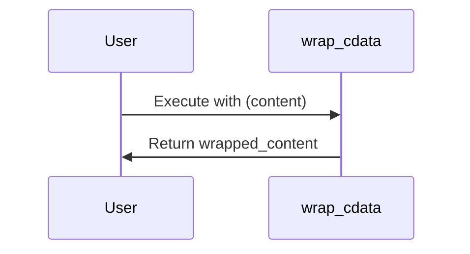

#### Function: `extract_output_content`
   **Sequence diagram for extract_output_content**
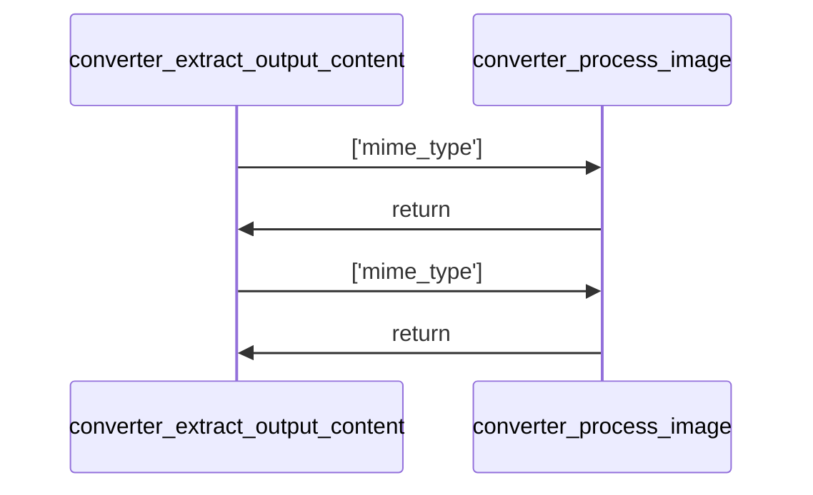
*   **Signature:** `def extract_output_content(outputs: Iterable[Any], image_list: List[Dict[str, str]])`
*   **Description:** This function processes a list of notebook output objects to extract their content, handling various output types. It iterates through each output, identifying its type to correctly process text, images, streams, or errors. For display data and execution results, it prioritizes extracting PNG or JPEG images, decoding their Base64 content, storing them in a provided `image_list`, and generating an XML placeholder. If no image is found, it extracts plain text. Stream outputs are appended directly, and error outputs are formatted into a string. The function returns a list of these extracted text snippets and image placeholders.
*   **Parameters:**
    - **outputs** (`Iterable[Any]`): An iterable of output objects, typically from a notebook cell, containing various data types like display data, execution results, stream outputs, or errors.
    - **image_list** (`List[Dict[str, str]]`): A mutable list that stores dictionaries of decoded image data (Base64 string and mime type) for images found within the outputs.
*   **Returns:**
    - **extracted_content** (`List[str]`): A list of strings, where each string is either extracted plain text, a formatted error message, or an XML-like placeholder referencing an image stored in `image_list`.
*   **Usage:**
    - **Calls:** This function calls backend.converter.process_image.
    - **Called By:** This function is called by no other functions.
   **Sequence diagram for extract_output_content**
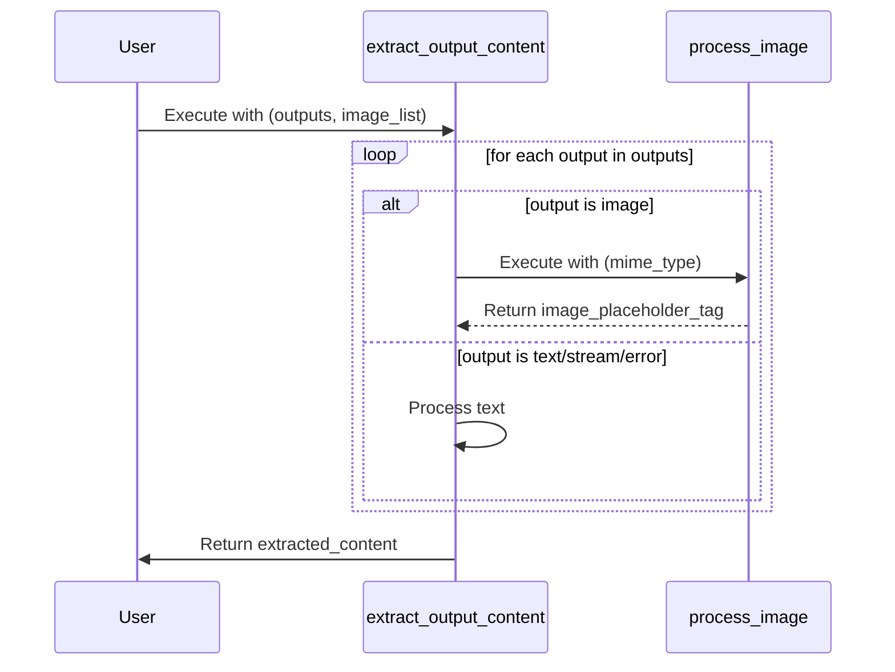

#### Function: `process_image`
*   **Signature:** `def process_image(mime_type: str)`
*   **Description:** This function, `process_image`, is designed to take a `mime_type` as input and attempt to process associated image data. It expects to retrieve base64-encoded image data from an external `data` dictionary using the `mime_type` as a key. The function then cleans the base64 string, appends the image data to an external `image_list`, and returns an HTML-like placeholder tag. If an error occurs during processing, an error message is returned. If the `mime_type` is not found in `data`, the function returns `None`.
*   **Parameters:**
    - **mime_type** (`str`): The MIME type of the image to be processed, used as a key to retrieve image data.
*   **Returns:**
    - **image_placeholder_tag** (`str`): A string representing an HTML-like placeholder tag for the processed image, including its index and MIME type.
    - **error_message** (`str`): A string containing an error message if image decoding or processing fails.
    - **None** (`NoneType`): Returns `None` if the specified `mime_type` is not found in the `data` dictionary.
*   **Usage:**
    - **Calls:** This function calls no other functions.
    - **Called By:** This function is not explicitly called by any other functions in the provided context.
> **Warning:** The function references undeclared variables 'data' and 'image_list', which are essential for its operation. Without these variables being defined in the enclosing scope or passed as arguments, the function will raise a NameError, making its intended execution context ambiguous and preventing successful execution.
   **Sequence diagram for process_image**
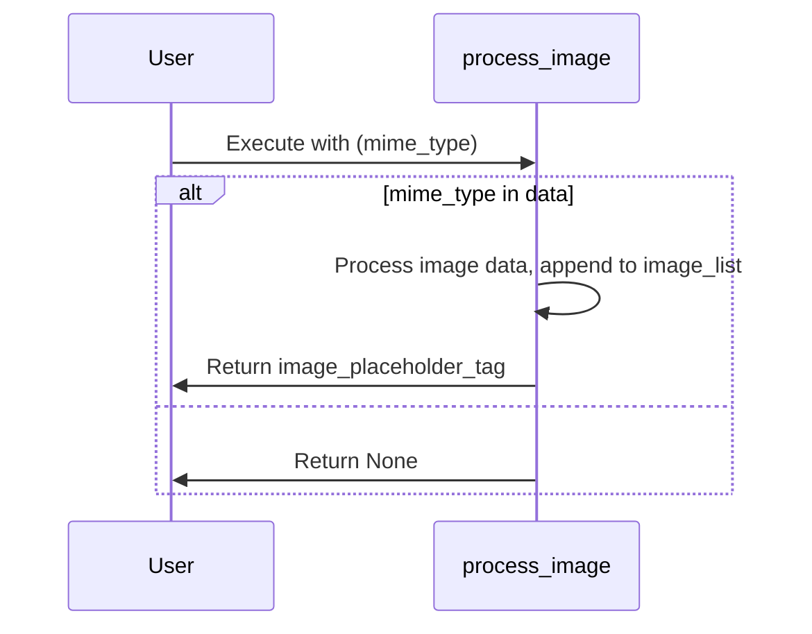

#### Function: `convert_notebook_to_xml`
   **Sequence diagram for convert_notebook_to_xml**
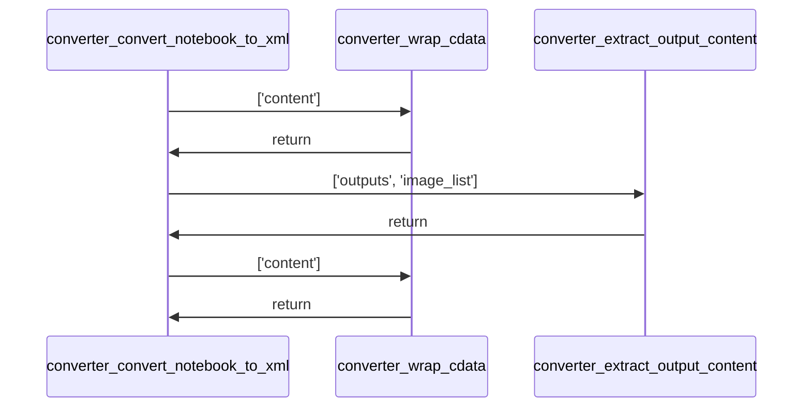
*   **Signature:** `def convert_notebook_to_xml(file_content: str)`
*   **Description:** This function converts the raw content of a Jupyter notebook into an XML string representation. It parses the input content as a notebook, then iterates through each cell. Markdown cells are wrapped in '<CELL type="markdown">' tags, and code cells are wrapped in '<CELL type="code">' tags, with their source code CDATA-wrapped. If code cells have outputs, these outputs are processed to extract content and images, with the content also wrapped in '<CELL type="output">' tags. The function handles potential parsing errors for non-JSON content.
*   **Parameters:**
    - **file_content** (`str`): The raw string content of the Jupyter notebook file to be converted.
*   **Returns:**
    - **xml_output** (`str`): A string containing the XML representation of the notebook cells, or an error message if parsing fails.
    - **extracted_images** (`list`): A list of extracted image data found within the notebook's code cell outputs.
*   **Usage:**
    - **Calls:** This function calls backend.converter.extract_output_content and backend.converter.wrap_cdata.
    - **Called By:** This function is not explicitly called by any other functions in the provided context.
   **Sequence diagram for convert_notebook_to_xml**
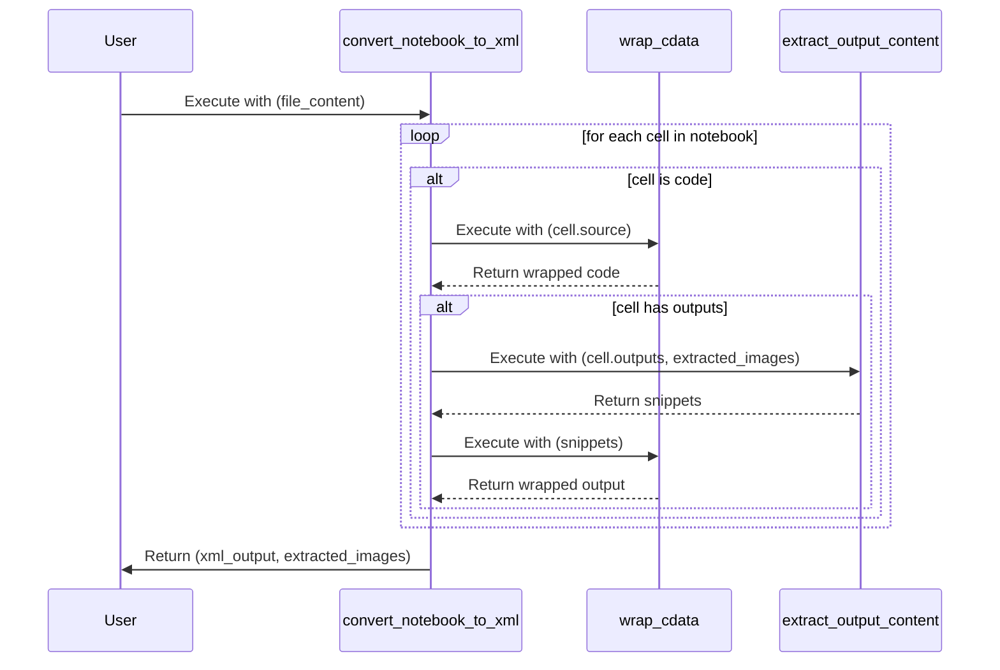

#### Function: `process_repo_notebooks`
   **Sequence diagram for process_repo_notebooks**
```mermaid
sequenceDiagram
    participant converter_process_repo_notebooks
    participant converter_convert_notebook_to_xml
    converter_process_repo_notebooks ->> converter_convert_notebook_to_xml: ['file_content']
    converter_convert_notebook_to_xml ->> converter_process_repo_notebooks: return
```
*   **Signature:** `def process_repo_notebooks(repo_files: Iterable[object])`
*   **Description:** This function processes a collection of repository files to identify and convert Jupyter notebooks. It filters the provided `repo_files` to find those with a `.ipynb` extension. For each identified notebook, it logs its processing and then calls `convert_notebook_to_xml` with the notebook's content. The XML output and any associated images from the conversion are stored in a results dictionary, keyed by the notebook's file path. Finally, it returns this dictionary containing the processed XML and images for all notebooks.
*   **Parameters:**
    - **repo_files** (`Iterable[object]`): An iterable collection of file objects. Each object is expected to have a `path` attribute (string) representing the file's path and a `content` attribute (string or bytes) representing the file's content.
*   **Returns:**
    - **results** (`Dict[str, Dict[str, Any]]`): A dictionary where keys are the paths of the processed Jupyter notebooks (string) and values are dictionaries containing the converted XML output (string) and any extracted images (list of objects/strings).
*   **Usage:**
    - **Calls:** This function calls backend.converter.convert_notebook_to_xml.
    - **Called By:** This function is not explicitly called by any other functions in the provided context.
   **Sequence diagram for process_repo_notebooks**
```mermaid
sequenceDiagram
    participant User
    participant process_repo_notebooks
    participant convert_notebook_to_xml
    User->>process_repo_notebooks: Execute with (repo_files)
    loop for each notebook file
    process_repo_notebooks->>convert_notebook_to_xml: Execute with (notebook_file.content)
    convert_notebook_to_xml-->>process_repo_notebooks: Return (xml_output, images)
    end
    process_repo_notebooks->>User: Return results
```

---
### File: `backend/diagram_generation/call_resolver.py`
#### Class: `CallResolver`
```mermaid
classDiagram
    class CallResolver {
        +__init__()
        +resolve_all()
        +resolved()
        -_resolve_name()
        -_resolve_attribute()
    }
```
*   **Summary:** The CallResolver class is responsible for transforming raw function call representations (RawCall) into resolved call objects (ResolvedCall) within a given project context. It uses a ProjectIndex to look up functions and methods, handling various call types such as direct calls, imported calls, and method calls. Its primary goal is to provide a structured and accurate understanding of function invocations throughout the codebase.
*   **Instantiation:** This class is not explicitly instantiated by any other components based on the provided context.
*   **Dependencies:** This class does not explicitly depend on any other components based on the provided context.
*   **Constructor:**
    *   *Description:* The __init__ method initializes the CallResolver instance by storing a ProjectIndex object. This project index is crucial for resolving function and method calls by providing access to the project's modules, functions, and classes.
    *   *Parameters:*
        - **project** (`ProjectIndex`): An object containing an index of the entire project's modules, functions, and classes, used for resolving call targets.
*   **Methods:**
    *   **`resolve_all`**
        *   *Signature:* `def resolve_all(self, calls: dict[str, list[RawCall]])`
        *   *Description:* This method iterates through a dictionary of raw calls, grouped by module, and resolves each RawCall into a list of ResolvedCall objects. It processes all calls provided in the input dictionary, ensuring that each raw call is passed to the resolved method for individual processing. The results are then aggregated into a new dictionary, maintaining the module-based grouping.
        *   *Parameters:*
            - **calls** (`dict[str, list[RawCall]]`): A dictionary where keys are module names and values are lists of RawCall objects to be resolved.
        *   *Returns:*
            - **null** (`dict[str, list[ResolvedCall]]`): A dictionary containing resolved calls, grouped by module name, where each raw call has been transformed into one or more ResolvedCall objects.
        *   **Usage:**
            - **Calls:** This method does not explicitly call any other functions or methods based on the provided context.
            - **Called By:** This method is not explicitly called by any other functions or methods based on the provided context.
    *   **`resolved`**
        *   *Signature:* `def resolved(self, call: RawCall)`
        *   *Description:* This method takes a single RawCall and determines its resolution based on the type of the abstract syntax tree (AST) node representing the function. If the node is an ast.Name, it delegates to _resolve_name; if it's an ast.Attribute, it delegates to _resolve_attribute. For any other AST node type, it returns an UNKNOWN resolved call, indicating that the target could not be identified.
        *   *Parameters:*
            - **call** (`RawCall`): The raw call object containing information about the caller, the AST node of the function, and its context.
        *   *Returns:*
            - **null** (`list[ResolvedCall]`): A list of ResolvedCall objects representing the resolved target(s) of the input raw call. This can be multiple for dynamic calls or a single call.
        *   **Usage:**
            - **Calls:** This method does not explicitly call any other functions or methods based on the provided context.
            - **Called By:** This method is not explicitly called by any other functions or methods based on the provided context.
    *   **`_resolve_name`**
        *   *Signature:* `def _resolve_name(self, call: RawCall, node: ast.Name)`
        *   *Description:* This private method resolves a function call when the target is identified by a simple name (an ast.Name node). It first checks if the name corresponds to a function directly defined within the calling module. If not, it checks if the name is an alias for an imported function. If a match is found, it creates a ResolvedCall with DIRECT or IMPORTED type; otherwise, it defaults to an UNKNOWN call.
        *   *Parameters:*
            - **call** (`RawCall`): The raw call object containing context for resolution.
            - **node** (`ast.Name`): The AST Name node representing the function being called.
        *   *Returns:*
            - **null** (`list[ResolvedCall]`): A list containing one ResolvedCall object, representing the resolved function call or an UNKNOWN call if not found.
        *   **Usage:**
            - **Calls:** This method does not explicitly call any other functions or methods based on the provided context.
            - **Called By:** This method is not explicitly called by any other functions or methods based on the provided context.
    *   **`_resolve_attribute`**
        *   *Signature:* `def _resolve_attribute(self, call: RawCall, node: ast.Attribute)`
        *   *Description:* This private method resolves a function call when the target is an attribute access (an ast.Attribute node). It handles three primary scenarios: calls to self methods, calls to imported module functions via an alias, and dynamic calls to methods across all classes in the project. It first checks for self.method calls within the current class context. Then, it attempts to resolve calls like module_alias.function_name using import information. Finally, it performs a project-wide search for methods matching the attribute name, categorizing them as DYNAMIC if found, or UNKNOWN if no resolution is possible.
        *   *Parameters:*
            - **call** (`RawCall`): The raw call object providing context for resolution, including the caller and module information.
            - **node** (`ast.Attribute`): The AST Attribute node representing the method or function being called via attribute access.
        *   *Returns:*
            - **null** (`list[ResolvedCall]`): A list of ResolvedCall objects. This list can contain multiple entries for dynamic calls, or a single entry for direct method/imported calls, or an UNKNOWN call.
        *   **Usage:**
            - **Calls:** This method does not explicitly call any other functions or methods based on the provided context.
            - **Called By:** This method is not explicitly called by any other functions or methods based on the provided context.
---
### File: `backend/diagram_generation/callgraph.py`
#### Class: `TreeVisitor`
```mermaid
classDiagram
    class TreeVisitor {
        +__init__()
        +visit_ClassDef()
        +visit_FunctionDef()
        +visit_Call()
    }
```
*   **Summary:** The TreeVisitor class is a specialized AST NodeVisitor designed to traverse an Abstract Syntax Tree (AST) of a Python module. Its primary purpose is to identify and record function and method calls within the module, distinguishing between global functions and class methods. It maintains state about the currently visited class and function to correctly contextualize the discovered calls, ultimately collecting them into a list of RawCall objects.
*   **Instantiation:** This class is not explicitly instantiated by any known components in the provided context.
*   **Dependencies:** This class depends on external modules and data types such as ast.NodeVisitor, typing.Optional, and various symbol and context types from 'diagram_generation.data_types'.
*   **Constructor:**
    *   *Description:* The constructor initializes the visitor with a ModuleSymbol and a ProjectIndex, which provide context for symbol resolution. It sets up internal state variables to track the current function and class being visited, and initializes an empty list to store discovered function calls.
    *   *Parameters:*
        - **module** (`ModuleSymbol`): The symbol representation of the module being visited, containing its functions and classes.
        - **project** (`ProjectIndex`): The project-wide index, providing access to other modules and symbols for cross-module resolution.
*   **Methods:**
    *   **`visit_ClassDef`**
        *   *Signature:* `def visit_ClassDef(self, node: ClassDef)`
        *   *Description:* This method is invoked when the AST visitor encounters a class definition. It updates the visitor's internal state to reflect the currently active class, allowing subsequent method definitions within that class to be correctly associated. After processing the class's children, it restores the previous class context.
        *   *Parameters:*
            - **node** (`ClassDef`): The AST node representing the class definition.
        *   *Returns:* This method does not return a value.
        *   **Usage:**
            - **Calls:** This method implicitly calls 'self.module.classes.get' to retrieve class symbols and 'self.generic_visit' to continue AST traversal.
            - **Called By:** This method is called by the AST traversal mechanism when a ClassDef node is encountered.
    *   **`visit_FunctionDef`**
        *   *Signature:* `def visit_FunctionDef(self, node: FunctionDef)`
        *   *Description:* This method is called when the AST visitor encounters a function definition. It updates the visitor's internal state to track the current function, differentiating between global functions and methods within a class. This context is crucial for correctly identifying the caller of subsequent function calls. After processing the function's body, it restores the previous function context.
        *   *Parameters:*
            - **node** (`FunctionDef`): The AST node representing the function definition.
        *   *Returns:* This method does not return a value.
        *   **Usage:**
            - **Calls:** This method implicitly calls 'self.current_class.methods.get' or 'self.module.functions.get' to retrieve function symbols and 'self.generic_visit' to continue AST traversal.
            - **Called By:** This method is called by the AST traversal mechanism when a FunctionDef node is encountered.
    *   **`visit_Call`**
        *   *Signature:* `def visit_Call(self, node: Any)`
        *   *Description:* This method is triggered when the AST visitor encounters a function call expression. It first checks if a current function context exists. It then attempts to identify the called function, either by its name (for direct calls) or by its attribute access (for method calls or calls to functions in other modules). If the call is deemed relevant, it records a RawCall object containing details about the caller, the called function's AST node, line number, and the current module/function/class context.
        *   *Parameters:*
            - **node** (`Any`): The AST node representing the function call expression.
        *   *Returns:* This method does not return a value.
        *   **Usage:**
            - **Calls:** This method implicitly calls 'isinstance' for type checking, accesses 'self.module.functions' and 'self.project.modules.values' for symbol lookup, and instantiates 'RawCall' and 'CallContext' objects. It also calls 'self.generic_visit' to continue AST traversal.
            - **Called By:** This method is called by the AST traversal mechanism when a Call node is encountered.
---
### File: `backend/diagram_generation/data_types.py`
#### Class: `FunctionSymbol`
```mermaid
classDiagram
    class FunctionSymbol {
    }
```
*   **Summary:** The FunctionSymbol class serves as a data structure to encapsulate metadata about a Python function. It defines attributes such as the function's name, module, qualified name, asynchronous status, input parameters, return symbol status, and line number. This class is designed to hold descriptive information about a function, likely for analysis or diagram generation purposes.
*   **Instantiation:** The instantiation points for this class are not specified in the provided context.
*   **Dependencies:** This class does not explicitly list any external dependencies within the provided context.
*   **Constructor:**
    *   *Description:* This class does not define an explicit `__init__` method. It appears to be a simple data class, likely intended to be used with `@dataclass` from the `dataclasses` module, where attributes are defined directly at the class level and an `__init__` method would be automatically generated.
    *   *Parameters:*
*   **Methods:**
#### Class: `ClassSymbol`
```mermaid
classDiagram
    class ClassSymbol {
    }
```
*   **Summary:** The ClassSymbol class serves as a data structure to represent a Python class within a larger system, likely for code analysis or diagram generation. It encapsulates key information about a class, including its name, the module it resides in, and a collection of its associated methods, each represented by a FunctionSymbol. This class provides a structured way to store and access metadata about a class's definition.
*   **Instantiation:** The instantiation points for this class are not provided in the input context.
*   **Dependencies:** This class does not explicitly list any external dependencies within the provided context.
*   **Constructor:**
    *   *Description:* The ClassSymbol class does not define an explicit `__init__` method. It implicitly relies on Python's default object initialization or, if intended as a dataclass (given the imports), it would have an auto-generated constructor based on its type-hinted attributes. It is designed to hold structural information about a class by defining 'name', 'module', and 'methods' as its core attributes.
    *   *Parameters:*
*   **Methods:**
#### Class: `ModuleSymbol`
```mermaid
classDiagram
    class ModuleSymbol {
    }
```
*   **Summary:** The ModuleSymbol class serves as a data structure to represent a Python module within a larger system. It stores essential metadata about a module, including its unique name, the hierarchy of packages it belongs to, and collections of FunctionSymbol and ClassSymbol objects found within it. Additionally, it tracks the import statements present in the module, mapping imported names to their original sources.
*   **Instantiation:** The instantiation points for this class are not specified in the provided context.
*   **Dependencies:** This class does not explicitly list any external dependencies in the provided context.
*   **Constructor:**
    *   *Description:* This class does not explicitly define an `__init__` method. It appears to be a data-only class, possibly intended for use with `dataclasses.dataclass` or similar, where attributes are defined directly at the class level and initialized implicitly.
    *   *Parameters:*
*   **Methods:**
#### Class: `CallContext`
```mermaid
classDiagram
    class CallContext {
    }
```
*   **Summary:** The CallContext class serves as a data structure to encapsulate the contextual information of a function call. It defines attributes to store the ModuleSymbol where the function resides, the FunctionSymbol representing the function itself, and an optional ClassSymbol if the function is a method within a class. This class is designed to hold references to symbolic representations of code elements, providing a clear snapshot of a function's execution environment.
*   **Instantiation:** The instantiation points for this class are not provided in the given context.
*   **Dependencies:** This class does not explicitly list any external dependencies in the provided context.
*   **Constructor:**
    *   *Description:* This class does not define an explicit `__init__` method. Its attributes are likely set directly upon instantiation or through a default dataclass constructor if the `@dataclass` decorator is applied (though not explicitly shown in the provided source).
    *   *Parameters:*
*   **Methods:**
#### Class: `RawCall`
```mermaid
classDiagram
    class RawCall {
    }
```
*   **Summary:** The RawCall class serves as a simple data container to encapsulate information about a function call detected in source code. It stores details such as the `caller` function, the `func_node` representing the called expression, the `lineno` where the call occurs, and the `context` in which the call is made. This class is designed to hold raw, unprocessed data about a call for further analysis.
*   **Instantiation:** The instantiation points for this class are not specified within the provided context.
*   **Dependencies:** This class does not explicitly depend on other components within the provided context.
*   **Constructor:**
    *   *Description:* This class does not define an explicit `__init__` method. It is likely intended as a simple data structure where attributes are assigned directly upon instantiation or through a default constructor if it were a dataclass.
    *   *Parameters:*
*   **Methods:**
#### Class: `CallType`
```mermaid
classDiagram
    class CallType {
    }
```
*   **Summary:** The CallType class is an enumeration that defines distinct categories for different types of function or method calls encountered during code analysis. It provides a standardized way to classify how a particular callable is invoked, which is crucial for understanding control flow and dependencies in a system. The enumeration includes members for direct calls, method calls, imported calls, dynamic calls, and an unknown category.
*   **Instantiation:** This class is not explicitly instantiated by other components within the provided context, as it is an enumeration whose members are accessed directly.
*   **Dependencies:** This class does not explicitly depend on other components within the provided context.
*   **Constructor:**
    *   *Description:* As an enumeration, the CallType class does not have an explicit __init__ method. Its members are implicitly initialized by the Enum metaclass upon class definition, with each member mapping to a specific string value representing a call type.
    *   *Parameters:*
*   **Methods:**
#### Class: `ResolvedCall`
```mermaid
classDiagram
    class ResolvedCall {
    }
```
*   **Summary:** The ResolvedCall class functions as a data structure designed to store comprehensive information about a resolved function call. It encapsulates key details such as the caller function, the callee function (which may be optional), the specific type of call, and the line number where the call originates. This class serves as a record for analyzed call relationships within the system.
*   **Instantiation:** The instantiation points for this class are not specified in the provided context.
*   **Dependencies:** This class does not explicitly list any external functional dependencies within the provided context.
*   **Constructor:**
    *   *Description:* This class does not explicitly define an `__init__` method. It is structured as a simple data holder, likely intended for use as a dataclass, where its attributes are initialized directly upon object creation based on the provided type hints.
    *   *Parameters:*
*   **Methods:**
#### Class: `ProjectIndex`
```mermaid
classDiagram
    class ProjectIndex {
        +all_classes()
    }
```
*   **Summary:** The ProjectIndex class acts as a central index for all modules and their contained symbols within a project. It primarily stores a dictionary of ModuleSymbol objects, keyed by their names. Its main utility is to provide a consolidated view of all ClassSymbol objects present across all indexed modules, facilitating easy access to all classes regardless of their module origin.
*   **Instantiation:** This class is not explicitly instantiated by any other components within the provided context.
*   **Dependencies:** This class does not explicitly depend on any external modules or classes within the provided context.
*   **Constructor:**
    *   *Description:* This class does not explicitly define an __init__ method. Instances are created with default Python object initialization, and the 'modules' attribute is expected to be populated externally or through direct assignment.
    *   *Parameters:*
*   **Methods:**
    *   **`all_classes`**
        *   *Signature:* `def all_classes(self)`
        *   *Description:* This method provides a flattened list of all ClassSymbol objects contained within all ModuleSymbol objects stored in the 'modules' attribute of the ProjectIndex. It iterates through each module's classes and collects them into a single list, effectively aggregating all class definitions across the entire project index.
        *   *Parameters:*
            - **self** (`ProjectIndex`): The instance of the ProjectIndex class.
        *   *Returns:*
            - **null** (`list[ClassSymbol]`): A list containing all ClassSymbol objects found across all modules in the project index.
        *   **Usage:**
            - **Calls:** This method does not explicitly call any other methods, classes, or functions.
            - **Called By:** This method is not explicitly called by any other functions or methods within the provided context.
---
### File: `backend/diagram_generation/emitter.py`
#### Function: `mermaid_id`
*   **Signature:** `def mermaid_id(name: str)`
*   **Description:** This function takes a string as input and transforms it into a valid Mermaid identifier. It achieves this by replacing all occurrences of the dot character ('.') with an underscore ('_'). The primary purpose is to ensure that the resulting string adheres to Mermaid's naming conventions, which do not permit dots in identifiers.
*   **Parameters:**
    - **name** (`str`): The input string that needs to be converted into a Mermaid-compatible identifier.
*   **Returns:**
    - **processed_name** (`str`): The processed string with dots replaced by underscores, suitable for use as a Mermaid identifier.
*   **Usage:**
    - **Calls:** This function calls no other functions.
    - **Called By:** This function is not explicitly called by any other functions in the provided context.
   **Sequence diagram for mermaid_id**
```mermaid
sequenceDiagram
    participant User
    participant mermaid_id
    User->>mermaid_id: Execute with (name)
    mermaid_id->>User: Return processed_name
```

#### Class: `MermaidSequenceEmitter`
```mermaid
classDiagram
    class MermaidSequenceEmitter {
        +emit()
        -_collect_participants()
        -_emit_response()
        -_emit_call()
    }
```
*   **Summary:** The MermaidSequenceEmitter class is responsible for generating Mermaid sequence diagram syntax from a list of ResolvedCall objects. It orchestrates the process of identifying participants, emitting individual calls, and handling return responses, ultimately producing a complete and formatted Mermaid diagram string. This class acts as a specialized renderer for call sequences into a visual diagram format.
*   **Instantiation:** This class is not explicitly instantiated by any known components in the provided context.
*   **Dependencies:** This class depends on the 'mermaid_id' function for formatting identifiers into a Mermaid-compatible format.
*   **Constructor:**
    *   *Description:* The MermaidSequenceEmitter class does not define an explicit __init__ method. Instances of this class can be created without any initial parameters, and no instance attributes are set during instantiation.
    *   *Parameters:*
*   **Methods:**
    *   **`emit`**
        *   *Signature:* `def emit(self, calls: list[ResolvedCall])`
        *   *Description:* This method generates a complete Mermaid sequence diagram string from a list of ResolvedCall objects. It initializes the diagram with standard Mermaid syntax, collects all unique participants from the calls, and then iterates through the sorted calls to emit each call and its corresponding response if a return symbol exists. Finally, it joins all generated lines into a single string, encapsulating the diagram within Mermaid code blocks.
        *   *Parameters:*
            - **calls** (`list[ResolvedCall]`): A list of ResolvedCall objects representing the sequence of function/method invocations to be diagrammed.
        *   *Returns:*
            - **** (`str`): A string containing the complete Mermaid sequence diagram syntax, ready for rendering.
        *   **Usage:**
            - **Calls:** This method internally calls _collect_participants to gather all unique entities involved in the calls, _emit_call to format each individual call, and _emit_response to format any return values.
            - **Called By:** This method is not explicitly called by other methods within the provided context.
    *   **`_collect_participants`**
        *   *Signature:* `def _collect_participants(self, calls: list[ResolvedCall])`
        *   *Description:* This private helper method extracts all unique participants (callers and callees) from a given list of ResolvedCall objects. It iterates through each call, adding the caller's qualified name and the callee's qualified name (if available) to a list of participants, using `mermaid_id` to format them. If a callee is not present, it adds a placeholder '?' to represent an unknown participant.
        *   *Parameters:*
            - **calls** (`list[ResolvedCall]`): A list of ResolvedCall objects from which to extract participants.
        *   *Returns:*
            - **** (`list[str]`): A list of strings, where each string is a unique participant identifier formatted for Mermaid.
        *   **Usage:**
            - **Calls:** This method calls the external function mermaid_id to convert qualified names into Mermaid-compatible identifiers.
            - **Called By:** This method is called by the emit method to determine all entities involved in the sequence diagram.
    *   **`_emit_response`**
        *   *Signature:* `def _emit_response(self, call: ResolvedCall)`
        *   *Description:* This private helper method generates a Mermaid sequence diagram line representing a return or response from a callee to a caller. It takes a ResolvedCall object, extracts the qualified names of the callee and caller, formats them using `mermaid_id`, and constructs a string indicating a return flow with a 'return' label.
        *   *Parameters:*
            - **call** (`ResolvedCall`): The ResolvedCall object for which to emit a response line.
        *   *Returns:*
            - **** (`str`): A string representing the Mermaid syntax for a response, e.g., 'callee -->> caller: return'.
        *   **Usage:**
            - **Calls:** This method calls the external function mermaid_id to format the callee and caller identifiers.
            - **Called By:** This method is called by the emit method when a call has a return symbol and requires a response line in the diagram.
    *   **`_emit_call`**
        *   *Signature:* `def _emit_call(self, call: ResolvedCall)`
        *   *Description:* This private helper method generates a Mermaid sequence diagram line for a single function or method call. It takes a ResolvedCall object, extracts the caller and callee (if available), formats their qualified names using `mermaid_id`, and uses the callee's input parameters as the label for the call arrow. If the callee is unknown, it uses a '?' placeholder and 'unknown' label.
        *   *Parameters:*
            - **call** (`ResolvedCall`): The ResolvedCall object for which to emit a call line.
        *   *Returns:*
            - **** (`str`): A string representing the Mermaid syntax for a call, e.g., 'caller ->> callee: label'.
        *   **Usage:**
            - **Calls:** This method calls the external function mermaid_id to format the caller and callee identifiers.
            - **Called By:** This method is called by the emit method for each individual call to be represented in the sequence diagram.
#### Class: `MermaidOverviewArchitectureEmitter`
```mermaid
classDiagram
    class MermaidOverviewArchitectureEmitter {
        +emit()
    }
```
*   **Summary:** The MermaidOverviewArchitectureEmitter class is designed to generate a Mermaid diagram string that visually represents the high-level architectural dependencies among a collection of Python modules. It processes a dictionary of ModuleSymbol objects, extracts unique import relationships, and translates these into a directed graph format compatible with Mermaid syntax. This class serves as an emitter, converting internal module dependency data into a structured visual representation.
*   **Instantiation:** The class is not explicitly instantiated by any known components according to the provided context.
*   **Dependencies:** The class does not have any explicit external dependencies listed in the provided context.
*   **Constructor:**
    *   *Description:* This class does not define an explicit constructor. Instances are created without any initial parameters or attribute assignments.
    *   *Parameters:*
*   **Methods:**
    *   **`emit`**
        *   *Signature:* `def emit(self, modules: dict[str, ModuleSymbol])`
        *   *Description:* This method generates a Mermaid diagram string that illustrates the architectural overview of a set of modules. It initializes the Mermaid graph, extracts all unique import targets from the provided modules, and then iterates through each module to create directed edges (arrows) in the diagram. An edge is drawn from a source module to any of its unique import targets that are also present within the input 'modules' dictionary. Finally, the method encapsulates the generated diagram content within Mermaid syntax blocks and returns the complete string.
        *   *Parameters:*
            - **modules** (`dict[str, ModuleSymbol]`): A dictionary where keys are module names (strings) and values are ModuleSymbol objects, representing the modules whose architecture is to be visualized.
        *   *Returns:*
            - **null** (`str`): A string containing the complete Mermaid diagram syntax for the architectural overview.
        *   **Usage:**
            - **Calls:** The emit method does not explicitly call any other methods, classes, or functions from the provided context. It primarily utilizes built-in Python operations like list comprehensions, dictionary access, and string manipulation.
            - **Called By:** The emit method is not explicitly called by any other functions or methods according to the provided context.
#### Class: `MermaidOverviewEmitter`
```mermaid
classDiagram
    class MermaidOverviewEmitter {
        +emit()
    }
```
*   **Summary:** The MermaidOverviewEmitter class is designed to generate a Mermaid diagram string that visually represents the hierarchical relationships between Python packages. It takes a collection of `ModuleSymbol` objects, extracts their package structures, and then constructs a top-down graph. This class acts as a dedicated emitter for creating high-level architectural overviews in a human-readable diagram format, facilitating understanding of the project's package organization.
*   **Instantiation:** The class is not explicitly instantiated by any known components according to the provided context.
*   **Dependencies:** The class does not explicitly depend on external modules or functions beyond standard Python types and the `ModuleSymbol` data type, which is likely an internal data structure.
*   **Constructor:**
    *   *Description:* This class does not define an explicit constructor. Instances are created without specific initial parameters, relying on its methods to perform operations.
    *   *Parameters:*
*   **Methods:**
    *   **`emit`**
        *   *Signature:* `def emit(self, modules: dict[str, ModuleSymbol])`
        *   *Description:* This method generates a Mermaid diagram string that illustrates the hierarchical relationships between packages based on a dictionary of `ModuleSymbol` objects. It initializes a Mermaid graph with a top-down layout and then iterates through each module to identify unique parent-child package relationships. These relationships are then formatted into Mermaid `graph TD` syntax, creating a clear visualization of the package hierarchy.
        *   *Parameters:*
            - **modules** (`dict[str, ModuleSymbol]`): A dictionary where keys are module names (strings) and values are `ModuleSymbol` objects, each containing information about its overlying packages.
        *   *Returns:*
            - **null** (`str`): A string formatted as a Mermaid diagram, specifically a `graph TD` (top-down) diagram, illustrating the package hierarchy.
        *   **Usage:**
            - **Calls:** The method does not explicitly call any other methods, classes, or functions from the provided context; it primarily uses built-in Python list and set operations.
            - **Called By:** The method is not explicitly called by any other functions or methods according to the provided context.
#### Class: `MermaidClassDiagramEmitter`
```mermaid
classDiagram
    class MermaidClassDiagramEmitter {
        +emit()
    }
```
*   **Summary:** The MermaidClassDiagramEmitter class is designed to generate Mermaid class diagram syntax from a structured representation of Python modules and classes. Its primary responsibility is to iterate through provided module symbols, extract class and method information, and format it into a string that can be rendered as a class diagram by Mermaid. This class acts as a dedicated renderer for Mermaid class diagrams.
*   **Instantiation:** This class is not explicitly instantiated by any known components within the provided context.
*   **Dependencies:** This class depends on the `mermaid_id` function for generating valid identifiers in Mermaid syntax.
*   **Constructor:**
    *   *Description:* This class does not define an explicit constructor. Instances are created without initial parameters, and no instance attributes are set upon instantiation.
    *   *Parameters:*
*   **Methods:**
    *   **`emit`**
        *   *Signature:* `def emit(self, modules: dict[str, ModuleSymbol])`
        *   *Description:* This method processes a dictionary of `ModuleSymbol` objects to generate Mermaid class diagram syntax. It iterates through each module and its contained classes, then constructs a Mermaid class definition for each class, including its public and private methods. The generated diagrams are stored in a dictionary where keys are class names and values are the Mermaid syntax strings, ready for rendering.
        *   *Parameters:*
            - **self** (`MermaidClassDiagramEmitter`): The instance of the MermaidClassDiagramEmitter class.
            - **modules** (`dict[str, ModuleSymbol]`): A dictionary where keys are module names and values are `ModuleSymbol` objects, containing information about classes and their methods.
        *   *Returns:*
            - **class_diagrams** (`dict[str, str]`): A dictionary where keys are class names and values are strings representing the Mermaid class diagram syntax for each class.
        *   **Usage:**
            - **Calls:** This method calls the `mermaid_id` function to generate valid Mermaid identifiers for class names.
            - **Called By:** This method is not explicitly called by any other known functions or methods within the provided context.
---
### File: `backend/diagram_generation/generator.py`
#### Function: `analyze_project`
*   **Signature:** `def analyze_project(all_files: list[RepoFile])`
*   **Description:** This function processes a list of repository files to build a comprehensive index of a Python project. It first filters the input files to identify Python source files. For each Python file, it parses its content into an Abstract Syntax Tree (AST), collects symbols and module information using a SymbolCollector, and then traverses these ASTs with a TreeVisitor to identify raw function calls. Finally, it employs a CallResolver to resolve these raw calls, returning the populated project index and the resolved call graph.
*   **Parameters:**
    - **all_files** (`list[RepoFile]`): A list of RepoFile objects representing all files in the repository to be analyzed.
*   **Returns:**
    - **project** (`ProjectIndex`): An index containing structured information about the modules and symbols within the analyzed project.
    - **resolved_calls** (`dict`): A dictionary containing the resolved function calls within the project, typically mapping module names to their respective calls.
*   **Usage:**
    - **Calls:** This function calls no other functions.
    - **Called By:** This function is called by no other functions.
   **Sequence diagram for analyze_project**
```mermaid
sequenceDiagram
    participant User
    participant analyze_project
    participant SymbolCollector
    participant TreeVisitor
    participant CallResolver
    User->>analyze_project: Execute with (all_files)
    loop for each py_file
    analyze_project->>SymbolCollector: Instantiate and visit tree
    SymbolCollector-->>analyze_project: Populates project index
    end
    loop for each tree
    analyze_project->>TreeVisitor: Instantiate and visit tree
    TreeVisitor-->>analyze_project: Gathers raw calls
    end
    analyze_project->>CallResolver: Instantiate
    CallResolver-->>analyze_project: resolver instance
    analyze_project->>CallResolver: resolve_all(raw_calls)
    CallResolver-->>analyze_project: Returns resolved_calls
    analyze_project->>User: Return (project, resolved_calls)
```

#### Function: `main_diagram_generation`
   **Sequence diagram for main_diagram_generation**
```mermaid
sequenceDiagram
    participant generator_main_diagram_generation
    participant generator_analyze_project
    generator_main_diagram_generation ->> generator_analyze_project: ['all_files']
    generator_analyze_project ->> generator_main_diagram_generation: return
```
*   **Signature:** `def main_diagram_generation(py_files: list[str])`
*   **Description:** This function serves as the main entry point for generating various Mermaid diagrams from a collection of Python files. It first analyzes the provided Python files to build a project structure and resolve function calls. Subsequently, it processes these resolved calls to group them by their respective caller functions. Finally, it utilizes dedicated emitters to generate Mermaid class diagrams, a component overview diagram, and individual sequence diagrams for each identified function, returning all generated diagrams.
*   **Parameters:**
    - **py_files** (`list[str]`): A list of Python file paths that need to be analyzed for diagram generation.
*   **Returns:**
    - **seqs** (`dict[str, str]`): A dictionary where keys are function names and values are strings representing their corresponding Mermaid sequence diagrams.
    - **class_diagrams** (`dict`): A dictionary representing the generated Mermaid class diagrams for the project's modules.
    - **component_diagram** (`str`): A string representing the generated Mermaid component overview diagram for the project's modules.
*   **Usage:**
    - **Calls:** This function calls backend.diagram_generation.generator.analyze_project.
    - **Called By:** This function is not explicitly called by any other functions in the provided context.
   **Sequence diagram for main_diagram_generation**
```mermaid
sequenceDiagram
    participant User
    participant main_diagram_generation
    participant analyze_project
    participant MermaidClassDiagramEmitter
    participant MermaidOverviewEmitter
    participant MermaidSequenceEmitter
    User->>main_diagram_generation: Execute with (py_files)
    main_diagram_generation->>analyze_project: Execute with (py_files)
    analyze_project-->>main_diagram_generation: Return project, resolved_calls
    main_diagram_generation->>MermaidClassDiagramEmitter: emit(project.modules)
    MermaidClassDiagramEmitter-->>main_diagram_generation: Return class_diagrams
    main_diagram_generation->>MermaidOverviewEmitter: emit(project.modules)
    MermaidOverviewEmitter-->>main_diagram_generation: Return component_diagram
    loop for each function's calls
    main_diagram_generation->>MermaidSequenceEmitter: emit(calls)
    MermaidSequenceEmitter-->>main_diagram_generation: Return sequence_diagram
    end
    main_diagram_generation->>User: Return (seqs, class_diagrams, component_diagram)
```

#### Function: `enrich_report_with_diagrams`
*   **Signature:** `def enrich_report_with_diagrams(final_report: str, diagrams: dict, component_diagram: str, class_diagrams: dict)`
*   **Description:** This function takes a final report string and various diagram data (sequence, component, and class diagrams) as input. It processes the report line by line, identifying specific markers such as '#### Function:', '## [0-9\\\\.]? Architecture', and '#### Class:'. Based on these markers, it inserts the corresponding sequence diagrams, the component diagram, or class diagrams into the report. The function then returns the complete report string, now enriched with the visual diagrams.
*   **Parameters:**
    - **final_report** (`str`): The initial report string that needs to be enriched with diagrams.
    - **diagrams** (`dict`): A dictionary containing sequence diagrams, where keys are filenames (likely function names) and values are the diagram strings.
    - **component_diagram** (`str`): A string representing the component diagram to be inserted into the report.
    - **class_diagrams** (`dict`): A dictionary containing class diagrams, where keys are class names and values are the diagram strings.
*   **Returns:**
    - **enriched_report** (`str`): The final report string with all relevant diagrams inserted at their respective positions.
*   **Usage:**
    - **Calls:** This function calls no other functions.
    - **Called By:** This function is called by no other functions.
   **Sequence diagram for enrich_report_with_diagrams**
```mermaid
sequenceDiagram
    participant User
    participant enrich_report_with_diagrams
    User->>enrich_report_with_diagrams: Execute with (final_report, diagrams, component_diagram, class_diagrams)
    enrich_report_with_diagrams->>enrich_report_with_diagrams: Split report into lines
    loop for each line
    enrich_report_with_diagrams->>enrich_report_with_diagrams: Check for markers and append diagrams
    end
    enrich_report_with_diagrams->>User: Return enriched_report
```

---
### File: `backend/diagram_generation/symbol_collector.py`
#### Function: `attach_with_parents`
*   **Signature:** `def attach_with_parents(tree: AST)`
*   **Description:** This function traverses an Abstract Syntax Tree (AST) and establishes explicit parent-child relationships by adding a 'parent' attribute to each child node. It iterates through all nodes in the provided AST, treating each as a potential parent. For every parent node, it identifies its direct child nodes. The function then assigns the current parent node to a new 'parent' attribute on each of its children, creating a back-reference for easier AST navigation. This modification is performed in-place on the AST.
*   **Parameters:**
    - **tree** (`AST`): The root node of the Abstract Syntax Tree (AST) to which parent references will be attached. The function modifies this tree in-place.
*   **Returns:** This function does not return a value.
*   **Usage:**
    - **Calls:** This function calls no other functions.
    - **Called By:** This function is not explicitly called by any other functions in the provided context.
   **Sequence diagram for attach_with_parents**
```mermaid
sequenceDiagram
    participant User
    participant attach_with_parents
    User->>attach_with_parents: Execute with (tree)
    loop for each parent in tree
    loop for each child of parent
    attach_with_parents->>attach_with_parents: Set child.parent = parent
    end
    end
    attach_with_parents->>User: Complete
```

#### Class: `SymbolCollector`
```mermaid
classDiagram
    class SymbolCollector {
        +__init__()
        -_has_return()
        -_declare_input_parameters()
        +visit_Import()
        +visit_ImportFrom()
        +visit_ClassDef()
        +visit_AsyncFunctionDef()
        +visit_FunctionDef()
    }
```
*   **Summary:** The SymbolCollector class extends NodeVisitor and is designed to traverse an Abstract Syntax Tree (AST) of a Python module. Its primary purpose is to collect and organize symbols such as imports, classes, and functions found within the module. It populates a ModuleSymbol object with structured data about the module's contents, including details like function parameters and return types, providing a comprehensive symbol table for further analysis.
*   **Instantiation:** This class is not explicitly shown to be instantiated by other components in the provided context.
*   **Dependencies:** This class does not explicitly list external dependencies in its context.
*   **Constructor:**
    *   *Description:* The constructor initializes the SymbolCollector instance, setting up the core ModuleSymbol object. This object will store all collected symbols, including functions, classes, and imports, for the module specified by 'module_name' and its 'overlying_packages'.
    *   *Parameters:*
        - **module_name** (`str`): The name of the module currently being analyzed.
        - **packages** (`list[str]`): A list of package names that overlay the current module.
*   **Methods:**
    *   **`_has_return`**
        *   *Signature:* `def _has_return(self, node: FunctionDef)`
        *   *Description:* This private helper method determines if a given function definition (represented by a FunctionDef AST node) contains any explicit return statements within its body. It iterates through all statements in the function's body and checks if any are instances of an AST Return node, returning True if found and False otherwise.
        *   *Parameters:*
            - **node** (`FunctionDef`): The AST node representing the function definition to check for return statements.
        *   *Returns:*
            - **** (`bool`): True if the function body contains at least one return statement, False otherwise.
        *   **Usage:**
            - **Calls:** This method does not explicitly call other functions or methods based on the provided context.
            - **Called By:** This method is not explicitly called by other functions or methods based on the provided context.
    *   **`_declare_input_parameters`**
        *   *Signature:* `def _declare_input_parameters(self, node: FunctionDef)`
        *   *Description:* This private helper method extracts the names of all input parameters from a given function definition AST node. It iterates through the arguments defined in the function's signature and collects their names into a list of strings, which is then returned.
        *   *Parameters:*
            - **node** (`FunctionDef`): The AST node representing the function definition from which to extract input parameters.
        *   *Returns:*
            - **** (`list[str]`): A list of strings, where each string is the name of an input parameter for the function.
        *   **Usage:**
            - **Calls:** This method does not explicitly call other functions or methods based on the provided context.
            - **Called By:** This method is not explicitly called by other functions or methods based on the provided context.
    *   **`visit_Import`**
        *   *Signature:* `def visit_Import(self, node: Import)`
        *   *Description:* This method is a visitor for AST Import nodes, responsible for recording top-level import statements. It iterates through each alias in the import statement, storing the imported module's original name or its 'as' alias in the module's imports dictionary. After processing, it ensures the AST traversal continues by calling generic_visit.
        *   *Parameters:*
            - **node** (`Import`): The AST node representing an 'import' statement.
        *   *Returns:* This method does not return a value.
        *   **Usage:**
            - **Calls:** This method does not explicitly call other functions or methods based on the provided context.
            - **Called By:** This method is not explicitly called by other functions or methods based on the provided context.
    *   **`visit_ImportFrom`**
        *   *Signature:* `def visit_ImportFrom(self, node: ImportFrom)`
        *   *Description:* This method processes AST ImportFrom nodes, handling 'from ... import ...' statements. It extracts the base module name and then iterates through the imported names, constructing a fully qualified name for each. These imports, along with their aliases, are stored in the module's imports dictionary. It also handles potential relative imports by returning early if the module is None, and continues AST traversal via generic_visit.
        *   *Parameters:*
            - **node** (`ImportFrom`): The AST node representing an 'from ... import ...' statement.
        *   *Returns:* This method does not return a value.
        *   **Usage:**
            - **Calls:** This method does not explicitly call other functions or methods based on the provided context.
            - **Called By:** This method is not explicitly called by other functions or methods based on the provided context.
    *   **`visit_ClassDef`**
        *   *Signature:* `def visit_ClassDef(self, node: ClassDef)`
        *   *Description:* This method is a visitor for AST ClassDef nodes, responsible for collecting information about class definitions. It creates a ClassSymbol for the encountered class and then iterates through its body to identify and process nested function definitions (methods). For each method, it determines if it has a return statement and extracts its input parameters, creating a FunctionSymbol which is then stored within the ClassSymbol. Finally, it calls generic_visit to continue AST traversal.
        *   *Parameters:*
            - **node** (`ClassDef`): The AST node representing a class definition.
        *   *Returns:* This method does not return a value.
        *   **Usage:**
            - **Calls:** This method does not explicitly call other functions or methods based on the provided context.
            - **Called By:** This method is not explicitly called by other functions or methods based on the provided context.
    *   **`visit_AsyncFunctionDef`**
        *   *Signature:* `def visit_AsyncFunctionDef(self, node: AsyncFunctionDef)`
        *   *Description:* This method processes AST AsyncFunctionDef nodes, specifically targeting top-level asynchronous function definitions (i.e., not methods within a class). It determines if the async function includes a return statement and extracts its input parameters. A FunctionSymbol is then created with these details and stored in the module's functions dictionary. The method concludes by calling generic_visit to continue AST traversal.
        *   *Parameters:*
            - **node** (`AsyncFunctionDef`): The AST node representing an asynchronous function definition.
        *   *Returns:* This method does not return a value.
        *   **Usage:**
            - **Calls:** This method does not explicitly call other functions or methods based on the provided context.
            - **Called By:** This method is not explicitly called by other functions or methods based on the provided context.
    *   **`visit_FunctionDef`**
        *   *Signature:* `def visit_FunctionDef(self, node: FunctionDef)`
        *   *Description:* This method is a visitor for AST FunctionDef nodes, designed to handle synchronous function definitions. Its implementation directly delegates the processing to the visit_AsyncFunctionDef method, indicating that for symbol collection purposes, both synchronous and asynchronous top-level functions are handled by the same logic.
        *   *Parameters:*
            - **node** (`FunctionDef`): The AST node representing a synchronous function definition.
        *   *Returns:* This method does not return a value.
        *   **Usage:**
            - **Calls:** This method does not explicitly call other functions or methods based on the provided context.
            - **Called By:** This method is not explicitly called by other functions or methods based on the provided context.
---
### File: `backend/getRepo.py`
#### Class: `RepoFile`
```mermaid
classDiagram
    class RepoFile {
        +__init__()
        +blob()
        +content()
        +size()
        +analyze_word_count()
        -__repr__()
        +to_dict()
    }
```
*   **Summary:** The RepoFile class represents a single file within a Git repository, providing a structured way to access its metadata and content. It implements lazy loading for the Git blob object, file content, and size, ensuring that these potentially heavy resources are only loaded when explicitly accessed. This design optimizes performance by avoiding unnecessary data retrieval until needed. The class also offers utility methods for basic analysis and dictionary conversion.
*   **Instantiation:** This class is not explicitly shown to be instantiated by any other components within the provided context.
*   **Dependencies:** This class does not explicitly list any external dependencies within the provided context.
*   **Constructor:**
    *   *Description:* The __init__ method initializes a RepoFile object by storing the file's path and the Git Tree object from which it originates. It also sets up internal attributes for the Git blob, file content, and size to None, indicating that these will be lazy-loaded upon their first access.
    *   *Parameters:*
        - **file_path** (`str`): The path to the file within the repository.
        - **commit_tree** (`git.Tree`): The Tree object of the commit from which the file originates.
*   **Methods:**
    *   **`blob`**
        *   *Signature:* `def blob(self)`
        *   *Description:* This property provides lazy loading for the Git blob object associated with the file. It checks if the internal `_blob` attribute is already populated; if not, it attempts to retrieve the blob from the stored `_tree` using the file's path. If the file cannot be found within the commit tree, a `FileNotFoundError` is raised to indicate the issue.
        *   *Parameters:*
        *   *Returns:*
            - **blob** (`git.Blob`): The Git blob object representing the file.
        *   **Usage:**
            - **Calls:** This method implicitly calls `self._tree.__getitem__` to access elements within the Git tree and may instantiate a `FileNotFoundError`.
            - **Called By:** This method is called by the `content` and `size` properties.
    *   **`content`**
        *   *Signature:* `def content(self)`
        *   *Description:* This property provides lazy loading for the decoded content of the file. It first verifies if the `_content` attribute is `None`, then accesses the `blob` property to obtain the Git blob. It subsequently reads the blob's data stream and decodes it into a UTF-8 string, ignoring any decoding errors to prevent crashes.
        *   *Parameters:*
        *   *Returns:*
            - **content** (`str`): The decoded content of the file as a string.
        *   **Usage:**
            - **Calls:** This method calls `self.blob`, `data_stream.read()`, and `decode()` for string conversion.
            - **Called By:** This method is called by `analyze_word_count` and `to_dict` (conditionally).
    *   **`size`**
        *   *Signature:* `def size(self)`
        *   *Description:* This property provides lazy loading for the size of the file in bytes. It checks if the internal `_size` attribute is `None`, and if so, it accesses the `blob` property to retrieve the Git blob object. Once the blob is available, it extracts and stores its `size` attribute, returning this value.
        *   *Parameters:*
        *   *Returns:*
            - **size** (`int`): The size of the file in bytes.
        *   **Usage:**
            - **Calls:** This method calls `self.blob` to retrieve the Git blob object.
            - **Called By:** This method is called by `to_dict`.
    *   **`analyze_word_count`**
        *   *Signature:* `def analyze_word_count(self)`
        *   *Description:* This method serves as an example analysis function, designed to count the total number of words present in the file's content. It achieves this by accessing the `content` property to retrieve the file's text, splitting the text into words based on whitespace, and then returning the count of these words.
        *   *Parameters:*
        *   *Returns:*
            - **word_count** (`int`): The total number of words found in the file content.
        *   **Usage:**
            - **Calls:** This method calls `self.content` to get the file's text and `str.split()` to divide it into words.
            - **Called By:** This method is not explicitly called by other methods within the class, suggesting it is intended for external use.
    *   **`__repr__`**
        *   *Signature:* `def __repr__(self)`
        *   *Description:* This special method provides a developer-friendly string representation of the RepoFile object. It constructs a string that includes the class name and the file's path, which is highly useful for debugging, logging, and interactive console sessions to quickly identify the object's context.
        *   *Parameters:*
        *   *Returns:*
            - **representation** (`str`): A string representation of the RepoFile object, formatted as '<RepoFile(path='<file_path>')>'.
        *   **Usage:**
            - **Calls:** This method does not explicitly call other methods or functions within the provided context.
            - **Called By:** This method is implicitly called by Python when an object is represented as a string, such as with `print()` or in a debugger.
    *   **`to_dict`**
        *   *Signature:* `def to_dict(self, include_content: bool)`
        *   *Description:* This method converts the RepoFile object into a dictionary, providing a structured representation of its metadata. It includes the file's path, its base name (extracted using `os.path.basename`), its size, and a fixed type 'file'. Optionally, based on the `include_content` parameter, it can also add the file's content to the dictionary.
        *   *Parameters:*
            - **include_content** (`bool`): A flag indicating whether the file's content should be included in the dictionary. Defaults to False.
        *   *Returns:*
            - **file_data** (`dict`): A dictionary containing metadata about the file, optionally including its content.
        *   **Usage:**
            - **Calls:** This method calls `self.path`, `os.path.basename`, `self.size`, and conditionally `self.content`.
            - **Called By:** This method is not explicitly called by other methods within the class, suggesting it is intended for external use.
#### Class: `GitRepository`
```mermaid
classDiagram
    class GitRepository {
        +__init__()
        +get_all_files()
        +close()
        -__enter__()
        -__exit__()
        +get_file_tree()
    }
```
*   **Summary:** The GitRepository class provides a robust abstraction for managing a Git repository. It handles the cloning of a remote repository into a temporary local directory upon instantiation, ensuring that all necessary repository data is available locally. The class offers functionality to retrieve all files as structured RepoFile objects and to generate a hierarchical representation of the repository's file tree. Furthermore, it implements the context manager protocol to guarantee proper cleanup and deletion of the temporary directory, making it suitable for operations that require temporary access to a Git repository.
*   **Instantiation:** This class is not explicitly instantiated by other components in the provided context.
*   **Dependencies:** This class depends on backend.getRepo.RepoFile for representing individual files within the repository.
*   **Constructor:**
    *   *Description:* The constructor initializes a GitRepository instance by cloning a remote Git repository into a newly created temporary directory. It sets up essential instance attributes such as the repository URL, the path to the temporary directory, and the `git.Repo` object itself. During initialization, it also captures the latest commit and its associated tree for subsequent file operations. If cloning fails, it cleans up the temporary directory and raises a RuntimeError.
    *   *Parameters:*
        - **repo_url** (`string`): The URL of the Git repository to be cloned.
*   **Methods:**
    *   **`get_all_files`**
        *   *Signature:* `def get_all_files(self)`
        *   *Description:* This method is responsible for retrieving a comprehensive list of all files present within the cloned Git repository. It leverages Git's internal commands to list file paths and then iteratively constructs `RepoFile` objects for each identified path. These `RepoFile` instances are stored internally within the class and then returned as a list, providing a structured representation of the repository's contents.
        *   *Parameters:*
        *   *Returns:*
            - **files** (`list[RepoFile]`): A list of RepoFile instances, each representing a file in the repository.
        *   **Usage:**
            - **Calls:** This method calls the RepoFile constructor to create new file objects.
            - **Called By:** This method is not explicitly called by other methods in the provided context.
    *   **`close`**
        *   *Signature:* `def close(self)`
        *   *Description:* This method handles the cleanup of resources by deleting the temporary directory where the Git repository was cloned. It first checks if the `self.temp_dir` attribute is set, indicating an active temporary directory. If present, it prints a message indicating the deletion and then sets `self.temp_dir` to `None` to prevent further attempts to delete a non-existent directory.
        *   *Parameters:*
        *   *Returns:* This method does not return a value.
        *   **Usage:**
            - **Calls:** This method does not explicitly call other methods or functions.
            - **Called By:** This method is called by the __exit__ method of the class.
    *   **`__enter__`**
        *   *Signature:* `def __enter__(self)`
        *   *Description:* This special method enables the GitRepository object to be used as a context manager within a `with` statement. When the `with` block is entered, this method is implicitly called and simply returns the instance of the GitRepository itself. This allows the object to be bound to a variable in the `as` clause of the `with` statement.
        *   *Parameters:*
        *   *Returns:*
            - **self** (`GitRepository`): The instance of the GitRepository itself, allowing it to be used as a context manager.
        *   **Usage:**
            - **Calls:** This method does not call any other methods or functions.
            - **Called By:** This method is implicitly called when the GitRepository object is used in a 'with' statement.
    *   **`__exit__`**
        *   *Signature:* `def __exit__(self, exc_type: type or None, exc_val: Exception or None, exc_tb: traceback or None)`
        *   *Description:* This special method is invoked automatically when exiting a `with` statement, regardless of whether an exception occurred within the block. Its primary function is to ensure that the `close()` method is called, which handles the cleanup and deletion of the temporary directory. This guarantees that resources are properly released and temporary files are removed, even if errors occur during repository operations.
        *   *Parameters:*
            - **exc_type** (`type or None`): The type of exception raised, if any, or None if no exception occurred.
            - **exc_val** (`Exception or None`): The exception instance raised, if any, or None.
            - **exc_tb** (`traceback or None`): The traceback object, if an exception was raised, or None.
        *   *Returns:* This method does not return a value.
        *   **Usage:**
            - **Calls:** This method calls the close method of the class.
            - **Called By:** This method is implicitly called when exiting a 'with' statement where the GitRepository object is the context manager.
    *   **`get_file_tree`**
        *   *Signature:* `def get_file_tree(self, include_content: bool)`
        *   *Description:* This method generates a hierarchical tree representation of the repository's files and directories. It first ensures that `self.files` is populated by calling `get_all_files()` if it's currently empty. It then iterates through the `RepoFile` objects, parsing their paths to construct a nested dictionary structure that mirrors the file system hierarchy. Each file is added to its respective directory level, with an option to include its content in the dictionary representation.
        *   *Parameters:*
            - **include_content** (`bool`): A flag indicating whether the content of each file should be included in its dictionary representation. Defaults to False.
        *   *Returns:*
            - **tree** (`dict`): A dictionary representing the hierarchical file tree of the repository, including directories and files.
        *   **Usage:**
            - **Calls:** This method calls the get_all_files method of the class and the to_dict method on RepoFile objects.
            - **Called By:** This method is not explicitly called by other methods in the provided context.
---
### File: `backend/main.py`
#### Function: `create_savings_chart`
*   **Signature:** `def create_savings_chart(json_tokens: int | float, toon_tokens: int | float, savings_percent: float, output_path: str)`
*   **Description:** This function is responsible for generating a bar chart to visually compare 'JSON' and 'TOON' token counts. It takes the token counts and a savings percentage as input. The chart displays the token counts for each category, includes a title indicating the savings, and labels the y-axis as 'Anzahl Token'. Numerical values are displayed above each bar for clarity. Finally, the generated chart is saved to a specified output file path.
*   **Parameters:**
    - **json_tokens** (`int | float`): The number of tokens associated with the JSON format.
    - **toon_tokens** (`int | float`): The number of tokens associated with the TOON format.
    - **savings_percent** (`float`): The percentage of savings to be displayed in the chart's title.
    - **output_path** (`str`): The file path where the generated chart image will be saved.
*   **Returns:** This function does not return a value.
*   **Usage:**
    - **Calls:** This function calls no other functions.
    - **Called By:** This function is not explicitly called by any other functions in the provided context.
   **Sequence diagram for create_savings_chart**
```mermaid
sequenceDiagram
    participant User
    participant create_savings_chart
    User->>create_savings_chart: Execute with (json_tokens, toon_tokens, savings_percent, output_path)
    create_savings_chart->>create_savings_chart: Generate bar chart using matplotlib
    create_savings_chart->>create_savings_chart: Save chart to output_path
    create_savings_chart->>User: Complete
```

#### Function: `calculate_net_time`
*   **Signature:** `def calculate_net_time(start_time: Any, end_time: Any, total_items: int, batch_size: int, model_name: str)`
*   **Description:** This function calculates the effective processing time, excluding any sleep durations introduced for rate-limiting, specifically for models starting with 'gemini-'. It takes start and end times, total items, batch size, and the model name as input. If the model is not a 'gemini-' model, it returns the total elapsed duration. Otherwise, it computes the number of batches, determines the total sleep time (61 seconds per batch after the first one), and subtracts this from the total duration, ensuring the result is not negative.
*   **Parameters:**
    - **start_time** (`Any`): The starting timestamp of the operation.
    - **end_time** (`Any`): The ending timestamp of the operation.
    - **total_items** (`int`): The total number of items processed.
    - **batch_size** (`int`): The number of items processed per batch.
    - **model_name** (`str`): The name of the model used for processing, which determines if rate-limit sleep times are considered.
*   **Returns:**
    - **net_time** (`float`): The calculated net duration of the operation, adjusted for rate-limiting sleep times if applicable, or 0 if total_items is 0 or net_time is negative.
*   **Usage:**
    - **Calls:** This function calls no other functions.
    - **Called By:** This function is not explicitly called by any other functions in the provided context.
   **Sequence diagram for calculate_net_time**
```mermaid
sequenceDiagram
    participant User
    participant calculate_net_time
    User->>calculate_net_time: Execute with (start_time, end_time, total_items, batch_size, model_name)
    alt model_name starts with "gemini-"
    calculate_net_time->>calculate_net_time: Calculate total sleep time
    calculate_net_time->>calculate_net_time: Subtract sleep time from total duration
    end
    calculate_net_time->>User: Return net_time
```

#### Function: `main_workflow`
   **Sequence diagram for main_workflow**
```mermaid
sequenceDiagram
    participant main_main_workflow
    participant main_update_status
    participant main_main_workflow
    participant main_get_key_and_url
    participant main_main_workflow
    participant main_get_key_and_url
    participant main_main_workflow
    participant main_update_status
    participant main_main_workflow
    participant main_update_status
    participant main_main_workflow
    participant main_update_status
    participant main_main_workflow
    participant main_update_status
    participant main_main_workflow
    participant main_update_status
    participant main_main_workflow
    participant main_update_status
    participant main_main_workflow
    participant main_update_status
    participant main_main_workflow
    participant main_estimate_total_tokens
    participant main_main_workflow
    participant main_update_status
    participant main_main_workflow
    participant main_update_status
    participant main_main_workflow
    participant main_update_status
    participant main_main_workflow
    participant main_calculate_net_time
    participant main_main_workflow
    participant main_update_status
    participant main_main_workflow
    participant main_update_status
    participant main_main_workflow
    participant main_calculate_net_time
    participant main_main_workflow
    participant main_update_status
    participant main_main_workflow
    participant main_update_status
    participant main_main_workflow
    participant main_enrich_report_with_diagrams
    participant main_main_workflow
    participant main_create_savings_chart
    main_main_workflow ->> main_update_status: ['msg']
    main_main_workflow ->> main_get_key_and_url: ['model_name']
    main_get_key_and_url ->> main_main_workflow: return
    main_main_workflow ->> main_get_key_and_url: ['model_name']
    main_get_key_and_url ->> main_main_workflow: return
    main_main_workflow ->> main_update_status: ['msg']
    main_main_workflow ->> main_update_status: ['msg']
    main_main_workflow ->> main_update_status: ['msg']
    main_main_workflow ->> main_update_status: ['msg']
    main_main_workflow ->> main_update_status: ['msg']
    main_main_workflow ->> main_update_status: ['msg']
    main_main_workflow ->> main_update_status: ['msg']
    main_main_workflow ->> main_estimate_total_tokens: ['llm_input_estimate']
    main_estimate_total_tokens ->> main_main_workflow: return
    main_main_workflow ->> main_update_status: ['msg']
    main_main_workflow ->> main_update_status: ['msg']
    main_main_workflow ->> main_update_status: ['msg']
    main_main_workflow ->> main_calculate_net_time: ['start_time', 'end_time', 'total_items', 'batch_size', 'model_name']
    main_calculate_net_time ->> main_main_workflow: return
    main_main_workflow ->> main_update_status: ['msg']
    main_main_workflow ->> main_update_status: ['msg']
    main_main_workflow ->> main_calculate_net_time: ['start_time', 'end_time', 'total_items', 'batch_size', 'model_name']
    main_calculate_net_time ->> main_main_workflow: return
    main_main_workflow ->> main_update_status: ['msg']
    main_main_workflow ->> main_update_status: ['msg']
    main_main_workflow ->> main_enrich_report_with_diagrams: ['final_report', 'diagrams', 'component_diagram', 'class_diagrams']
    main_enrich_report_with_diagrams ->> main_main_workflow: return
    main_main_workflow ->> main_create_savings_chart: ['json_tokens', 'toon_tokens', 'savings_percent', 'output_path']
```
*   **Signature:** `def main_workflow(user_input: str, api_keys: dict, model_names: dict, status_callback: callable, check_stop: callable)`
*   **Description:** The main_workflow function orchestrates the comprehensive analysis of a GitHub repository and the generation of a detailed documentation report. It begins by extracting API keys and model configurations, then clones the specified repository. The workflow proceeds with several analytical steps, including basic project information extraction, repository file tree construction, relationship analysis, and Abstract Syntax Tree (AST) generation. It then prepares and dispatches analysis tasks to Helper LLMs for individual functions and classes, before a Main LLM synthesizes these results into a final report, which is enriched with diagrams. Finally, the function saves the generated report and associated performance metrics, such as token usage and processing times.
*   **Parameters:**
    - **user_input** (`str`): The input provided by the user, which is expected to contain a GitHub repository URL for analysis.
    - **api_keys** (`dict`): A dictionary containing various API keys (e.g., 'gemini', 'gpt', 'scadsllm') and base URLs ('scadsllm_base_url', 'ollama', 'opensrc_url') required for LLM interactions.
    - **model_names** (`dict`): A dictionary specifying the names of the helper and main LLM models to be utilized for different stages of the analysis (e.g., 'helper', 'main').
    - **status_callback** (`callable`): An optional callback function that receives status messages to provide real-time updates on the workflow's progress.
    - **check_stop** (`callable`): An optional callback function that is periodically invoked to determine if the workflow execution should be interrupted or stopped.
*   **Returns:**
    - **analysis_output** (`dict`): A dictionary containing the 'report' (the final generated documentation as a string) and 'metrics' (a dictionary of performance statistics like processing times and token savings).
*   **Usage:**
    - **Calls:** This function calls backend.AST_Schema.ASTAnalyzer, backend.AST_Schema.ASTAnalyzer.analyze_repository, backend.AST_Schema.ASTAnalyzer.merge_relationship_data, backend.HelperLLM.LLMHelper, backend.HelperLLM.LLMHelper.generate_for_classes, backend.HelperLLM.LLMHelper.generate_for_functions, backend.MainLLM.MainLLM, backend.MainLLM.MainLLM.call_llm, backend.basic_info.ProjektInfoExtractor, backend.basic_info.ProjektInfoExtractor.extrahiere_info, backend.diagram_generation.generator.main_diagram_generation, backend.getRepo.GitRepository, backend.main.calculate_net_time, backend.main.create_savings_chart, backend.main.enrich_report_with_diagrams, backend.main.estimate_total_tokens, backend.main.get_key_and_url, backend.main.update_status, backend.relationship_analyzer.ProjectAnalyzer, backend.relationship_analyzer.ProjectAnalyzer.analyze, backend.relationship_analyzer.ProjectAnalyzer.get_raw_relationships, schemas.types.ClassAnalysisInput, schemas.types.ClassContextInput, schemas.types.FunctionAnalysisInput, schemas.types.FunctionContextInput, and schemas.types.MethodContextInput.
    - **Called By:** This function is called by no other functions.
   **Sequence diagram for main_workflow**
```mermaid
sequenceDiagram
    participant User
    participant main_workflow
    participant GitRepository
    participant ProjektInfoExtractor
    participant ProjectAnalyzer
    participant ASTAnalyzer
    participant LLMHelper
    participant MainLLM
    User->>main_workflow: Start analysis with URL
    main_workflow->>GitRepository: Clone repository
    GitRepository-->>main_workflow: Return repo files
    main_workflow->>ProjektInfoExtractor: Extract basic info
    ProjektInfoExtractor-->>main_workflow: Return project info
    main_workflow->>ProjectAnalyzer: Analyze relationships
    ProjectAnalyzer-->>main_workflow: Return call graph
    main_workflow->>ASTAnalyzer: Generate and enrich AST
    ASTAnalyzer-->>main_workflow: Return structured schema
    main_workflow->>LLMHelper: Analyze functions and classes
    LLMHelper-->>main_workflow: Return analysis results
    main_workflow->>MainLLM: Synthesize final report
    MainLLM-->>main_workflow: Return Markdown report
    main_workflow->>User: Return final report and metrics
```

#### Function: `update_status`
*   **Signature:** `def update_status(msg: Any)`
*   **Description:** This function handles status updates and potential workflow interruptions. It first checks for an interrupt signal using `check_stop` and raises an `InterruptedError` if a stop is detected, logging the event. If a `status_callback` function is available, it invokes it with the provided message. Finally, it logs the input message using `logging.info`.
*   **Parameters:**
    - **msg** (`Any`): The message string to be processed, logged, and potentially used for status updates.
*   **Returns:** This function does not return a value.
*   **Usage:**
    - **Calls:** This function calls no other functions.
    - **Called By:** This function is not explicitly called by any other functions in the provided context.
   **Sequence diagram for update_status**
```mermaid
sequenceDiagram
    participant User
    participant update_status
    User->>update_status: Execute with (msg)
    alt Abort Requested
    update_status->>update_status: Raise InterruptedError
    end
    alt Callback exists
    update_status->>update_status: status_callback(msg)
    end
    update_status->>update_status: logging.info(msg)
    update_status->>User: Complete
```

#### Function: `get_key_and_url`
*   **Signature:** `def get_key_and_url(model_name: str)`
*   **Description:** This function, `get_key_and_url`, determines the appropriate API key and base URL based on the provided `model_name`. It uses conditional logic to check for model prefixes like "gpt-" and "gemini-", and specific model names such as "llama3". For "gemini-" models, it explicitly checks for the presence of `gemini_api_key` and raises a `ValueError` if it is missing. The function also incorporates fallback logic for open-source models, prioritizing user-defined credentials before defaulting to system-wide `scadsllm` credentials. It returns a tuple containing the identified API key and base URL.
*   **Parameters:**
    - **model_name** (`str`): The name of the model for which to determine the API key and base URL.
*   **Returns:**
    - **api_key** (`str | None`): The API key corresponding to the specified model, or None if not applicable.
    - **base_url** (`str | None`): The base URL corresponding to the specified model, or None if not applicable.
*   **Usage:**
    - **Calls:** This function calls no other functions.
    - **Called By:** This function is not explicitly called by any other functions in the provided context.
   **Sequence diagram for get_key_and_url**
```mermaid
sequenceDiagram
    participant User
    participant get_key_and_url
    User->>get_key_and_url: Execute with (model_name)
    alt model_name is gpt-*
    get_key_and_url->>User: Return (openai_api_key, None)
    else model_name is gemini-*
    get_key_and_url->>User: Return (gemini_api_key, None)
    else model_name is llama3
    get_key_and_url->>User: Return (None, ollama_base_url)
    else
    get_key_and_url->>User: Return (scadsllm_api_key, scadsllm_base_url)
    end
```

#### Function: `enrich_report_with_diagrams`
*   **Signature:** `def enrich_report_with_diagrams(final_report: str, diagrams: dict, component_diagram: str, class_diagrams: dict)`
*   **Description:** This function is designed to integrate various types of diagrams into a textual report. It processes an existing `final_report` string line by line, looking for specific markers. When a marker for a function, architecture section, or class is found, the corresponding diagram content from the provided dictionaries or string is appended to the report. The function constructs an enriched report by inserting sequence diagrams for functions, a component diagram, and class diagrams based on keywords in the report lines. Finally, it returns the modified report as a single string.
*   **Parameters:**
    - **final_report** (`str`): The base report string to which diagrams will be added.
    - **diagrams** (`dict`): A dictionary where keys are filenames (likely function names) and values are strings representing sequence diagrams.
    - **component_diagram** (`str`): A string containing the component diagram to be inserted into the architecture section.
    - **class_diagrams** (`dict`): A dictionary where keys are class names and values are strings representing class diagrams.
*   **Returns:**
    - **enriched_report** (`str`): The final report string with all specified diagrams integrated.
*   **Usage:**
    - **Calls:** This function calls no other functions.
    - **Called By:** This function is not explicitly called by any other functions in the provided context.
   **Sequence diagram for enrich_report_with_diagrams**
```mermaid
sequenceDiagram
    participant User
    participant enrich_report_with_diagrams
    User->>enrich_report_with_diagrams: Execute with (final_report, diagrams, component_diagram, class_diagrams)
    enrich_report_with_diagrams->>enrich_report_with_diagrams: Split report into lines
    loop for each line
    enrich_report_with_diagrams->>enrich_report_with_diagrams: Check for markers and append diagrams
    end
    enrich_report_with_diagrams->>User: Return enriched_report
```

#### Function: `notebook_workflow`
   **Sequence diagram for notebook_workflow**
```mermaid
sequenceDiagram
    participant main_notebook_workflow
    participant main_update_status
    participant main_notebook_workflow
    participant main_update_status
    participant main_notebook_workflow
    participant main_update_status
    participant main_notebook_workflow
    participant main_update_status
    participant main_notebook_workflow
    participant main_update_status
    participant main_notebook_workflow
    participant main_gemini_payload
    main_notebook_workflow ->> main_update_status: ['msg']
    main_notebook_workflow ->> main_update_status: ['msg']
    main_notebook_workflow ->> main_update_status: ['msg']
    main_notebook_workflow ->> main_update_status: ['msg']
    main_notebook_workflow ->> main_update_status: ['msg']
    main_notebook_workflow ->> main_gemini_payload: ['info', 'path', 'xml', 'imgs']
    main_gemini_payload ->> main_notebook_workflow: return
```
*   **Signature:** `def notebook_workflow(input: str, api_keys: dict, model: str, status_callback: callable | None, check_stop: callable | None)`
*   **Description:** This function orchestrates the analysis of Jupyter notebooks found within a specified GitHub repository using a Large Language Model (LLM). It begins by configuring API keys and base URLs based on the chosen LLM model and then extracts the repository URL from the input. The function clones the repository, extracts basic project information, and processes the notebooks into a suitable format for LLM consumption. It then iteratively calls the configured LLM for each notebook to generate individual reports, which are finally aggregated and returned along with performance metrics. The workflow includes error handling for missing API keys or invalid URLs and supports user-initiated interruptions.
*   **Parameters:**
    - **input** (`str`): The input string, expected to contain a GitHub repository URL.
    - **api_keys** (`dict`): A dictionary containing various API keys (e.g., 'gemini', 'gpt', 'scadsllm') and base URLs for different LLM providers.
    - **model** (`str`): The name of the LLM model to be used for analysis (e.g., 'gpt-4', 'gemini-pro', 'llama3').
    - **status_callback** (`callable | None`): An optional callback function to provide status updates during the workflow execution.
    - **check_stop** (`callable | None`): An optional function that, when called, indicates if the workflow should be interrupted.
*   **Returns:**
    - **report** (`str`): A concatenated string of all generated notebook reports.
    - **metrics** (`dict`): A dictionary containing performance metrics such as total time, helper time, and the main model used.
*   **Usage:**
    - **Calls:** This function calls backend.MainLLM.MainLLM, backend.MainLLM.MainLLM.call_llm, backend.basic_info.ProjektInfoExtractor, backend.basic_info.ProjektInfoExtractor.extrahiere_info, backend.converter.process_repo_notebooks, backend.getRepo.GitRepository, backend.main.gemini_payload, and backend.main.update_status.
    - **Called By:** This function is not explicitly called by any other functions in the provided context.
   **Sequence diagram for notebook_workflow**
```mermaid
sequenceDiagram
    participant User
    participant notebook_workflow
    participant GitRepository
    participant process_repo_notebooks
    participant MainLLM
    User->>notebook_workflow: Start analysis with URL
    notebook_workflow->>GitRepository: Clone repository
    GitRepository-->>notebook_workflow: Return repo files
    notebook_workflow->>process_repo_notebooks: Convert notebooks to analyzable format
    process_repo_notebooks-->>notebook_workflow: Return processed data
    notebook_workflow->>MainLLM: Instantiate with notebook prompt
    MainLLM-->>notebook_workflow: llm_instance
    loop for each processed notebook
    notebook_workflow->>MainLLM: call_llm with notebook data
    MainLLM-->>notebook_workflow: Return individual report
    end
    notebook_workflow->>User: Return final report and metrics
```

#### Function: `gemini_payload`
*   **Signature:** `def gemini_payload(info: Any, path: str, xml: str, imgs: List[Dict[str, Any]])`
*   **Description:** This function constructs a payload suitable for a Gemini API request, combining textual context with embedded images. It takes basic information, a notebook path, an XML string potentially containing image placeholders, and a list of image data. It serializes the basic info and path into a JSON string, then processes the XML string. It uses regular expressions to find image placeholders within the XML, replacing them with base64-encoded image URLs from the provided 'imgs' list. The function returns a list of dictionaries, where each dictionary represents either a text part or an image part of the Gemini payload.
*   **Parameters:**
    - **info** (`Any`): Contains basic information to be included in the payload, serialized as JSON.
    - **path** (`str`): The current notebook path to be included in the payload, serialized as JSON.
    - **xml** (`str`): The XML string that may contain image placeholders to be processed and embedded.
    - **imgs** (`List[Dict[str, Any]]`): A list of dictionaries, where each dictionary contains image data and metadata, used to replace placeholders in the XML.
*   **Returns:**
    - **payload** (`List[Dict[str, Any]]`): A list of dictionaries, formatted as a Gemini API payload, containing text and image_url entries.
*   **Usage:**
    - **Calls:** This function calls no other functions.
    - **Called By:** This function is not explicitly called by any other functions in the provided context.
   **Sequence diagram for gemini_payload**
```mermaid
sequenceDiagram
    participant User
    participant gemini_payload
    User->>gemini_payload: Execute with (info, path, xml, imgs)
    gemini_payload->>gemini_payload: Serialize info and path to JSON
    gemini_payload->>gemini_payload: Find and replace image placeholders in XML with base64 data
    gemini_payload->>User: Return formatted payload list
```

#### Function: `estimate_total_tokens`
*   **Signature:** `def estimate_total_tokens(llm_input_estimate: dict[str, Any])`
*   **Description:** This function estimates the total token cost for a complete Large Language Model (LLM) pipeline. It takes a dictionary containing various inputs for the LLM analysis, such as functions, classes, AST schema, basic information, and file tree. The function utilizes `tiktoken` to encode these inputs and calculates token counts based on predefined prompt and output token constants for both helper and main LLM stages. Finally, it sums these individual token estimates to provide a comprehensive total.
*   **Parameters:**
    - **llm_input_estimate** (`dict[str, Any]`): A dictionary containing all the necessary inputs for the LLM analysis pipeline, used to calculate the estimated token consumption.
*   **Returns:**
    - **total_token_estimate** (`int`): The total estimated token count for the entire LLM pipeline, calculated by summing the token estimates for helper and main LLM stages.
*   **Usage:**
    - **Calls:** This function calls no other functions.
    - **Called By:** This function is not explicitly called by any other functions in the provided context.
   **Sequence diagram for estimate_total_tokens**
```mermaid
sequenceDiagram
    participant User
    participant estimate_total_tokens
    User->>estimate_total_tokens: Execute with (llm_input_estimate)
    estimate_total_tokens->>estimate_total_tokens: Encode various inputs (functions, classes, etc.) using tiktoken
    estimate_total_tokens->>estimate_total_tokens: Calculate helper and main LLM token costs based on constants
    estimate_total_tokens->>User: Return total_token_estimate
```

---
### File: `backend/relationship_analyzer.py`
#### Function: `path_to_module`
*   **Signature:** `def path_to_module(filepath: str, project_root: str)`
*   **Description:** This function converts a given file system path into its corresponding Python module import path. It first determines the relative path of the file with respect to the project root, handling cases where the file is not within the project root by using its base name. It then removes the '.py' extension and replaces path separators with dots. Finally, it adjusts the module path if it refers to an '__init__.py' file, returning the package name instead.
*   **Parameters:**
    - **filepath** (`str`): The absolute or relative file path to a Python source file.
    - **project_root** (`str`): The root directory of the project, used to calculate the relative path.
*   **Returns:**
    - **module_path** (`str`): The Python module path corresponding to the input filepath, e.g., 'my_package.my_module'.
*   **Usage:**
    - **Calls:** This function calls no other functions.
    - **Called By:** This function is not explicitly called by any other functions in the provided context.
   **Sequence diagram for path_to_module**
```mermaid
sequenceDiagram
    participant User
    participant path_to_module
    User->>path_to_module: Execute with (filepath, project_root)
    path_to_module->>User: Return module_path
```

#### Class: `ProjectAnalyzer`
```mermaid
classDiagram
    class ProjectAnalyzer {
        +__init__()
        +analyze()
        +get_raw_relationships()
        -_find_py_files()
        -_collect_definitions()
        -_get_parent()
        -_resolve_calls()
    }
```
*   **Summary:** The ProjectAnalyzer class is designed to perform a static analysis of a Python project to build a comprehensive call graph. It systematically identifies all Python files, collects definitions of classes, functions, and methods, and then resolves calls between these defined entities. The class provides methods to initiate the analysis and retrieve the raw incoming and outgoing relationships based on the generated call graph.
*   **Instantiation:** This class is not explicitly instantiated by any known components within the provided context.
*   **Dependencies:** This class depends on backend.relationship_analyzer.CallResolverVisitor for resolving calls within ASTs and backend.relationship_analyzer.path_to_module for converting file paths to module paths.
*   **Constructor:**
    *   *Description:* The constructor initializes the ProjectAnalyzer with a specified project root directory. It sets up various internal data structures such as 'definitions' for storing code definitions, 'call_graph' for tracking function/method calls, 'file_asts' for caching ASTs, and a set of 'ignore_dirs' to exclude from analysis.
    *   *Parameters:*
        - **project_root** (`string`): The root directory of the project to be analyzed.
*   **Methods:**
    *   **`analyze`**
        *   *Signature:* `def analyze(self)`
        *   *Description:* This method orchestrates the entire project analysis process. It first identifies all Python files within the project, then iterates through them to collect all function, method, and class definitions. After collecting definitions, it iterates through the files again to resolve calls between these definitions. Finally, it clears the cached ASTs and returns the populated call graph.
        *   *Parameters:*
        *   *Returns:*
            - **call_graph** (`defaultdict(list)`): A dictionary representing the call graph, where keys are callee identifiers and values are lists of caller information.
        *   **Usage:**
            - **Calls:** This method calls _find_py_files, _collect_definitions, and _resolve_calls.
            - **Called By:** This method is not explicitly called by any known components within the provided context.
    *   **`get_raw_relationships`**
        *   *Signature:* `def get_raw_relationships(self)`
        *   *Description:* This method processes the internal call_graph to generate structured outgoing and incoming relationship dictionaries. It iterates through the call graph, extracting caller and callee identifiers, and populates two defaultdict(set) objects to store unique outgoing and incoming relationships. The final output is a dictionary containing these relationships, with sets converted to sorted lists for consistent output.
        *   *Parameters:*
        *   *Returns:*
            - **relationships** (`dict`): A dictionary containing two keys, "outgoing" and "incoming", each mapping to a dictionary where keys are entity identifiers and values are sorted lists of related entity identifiers.
        *   **Usage:**
            - **Calls:** This method does not explicitly call other methods within the class or external functions.
            - **Called By:** This method is not explicitly called by any known components within the provided context.
    *   **`_find_py_files`**
        *   *Signature:* `def _find_py_files(self)`
        *   *Description:* This private helper method recursively traverses the project root directory to locate all Python files, excluding specified directories. It uses os.walk to navigate the file system, filtering out directories listed in self.ignore_dirs and collecting paths to files ending with ".py".
        *   *Parameters:*
        *   *Returns:*
            - **py_files** (`list`): A list of absolute file paths to all Python files found within the project root, excluding ignored directories.
        *   **Usage:**
            - **Calls:** This method calls os.walk and os.path.join.
            - **Called By:** This method is called by analyze.
    *   **`_collect_definitions`**
        *   *Signature:* `def _collect_definitions(self, filepath: string)`
        *   *Description:* This private method is responsible for parsing a given Python file and collecting all function, method, and class definitions within it. It reads the file, parses its Abstract Syntax Tree (AST), and stores the AST in self.file_asts. It then walks the AST to identify FunctionDef and ClassDef nodes, determining their fully qualified path names and types, and stores this information in self.definitions. Error handling is included for file reading and AST parsing.
        *   *Parameters:*
            - **filepath** (`string`): The path to the Python file to analyze.
        *   *Returns:* This method does not return a value.
        *   **Usage:**
            - **Calls:** This method calls path_to_module and _get_parent.
            - **Called By:** This method is called by analyze.
    *   **`_get_parent`**
        *   *Signature:* `def _get_parent(self, tree: ast.AST, node: ast.AST)`
        *   *Description:* This private helper method attempts to find the direct parent AST node of a given child node within a larger AST. It iterates through all nodes in the tree, and for each node, it checks if any of its direct children is the target node. If a parent is found, it is returned; otherwise, None is returned.
        *   *Parameters:*
            - **tree** (`ast.AST`): The root of the Abstract Syntax Tree to search within.
            - **node** (`ast.AST`): The child node for which to find the parent.
        *   *Returns:*
            - **parent_node** (`ast.AST or None`): The parent AST node of the given node, or None if no parent is found within the provided tree.
        *   **Usage:**
            - **Calls:** This method does not explicitly call other methods within the class or external functions.
            - **Called By:** This method is called by _collect_definitions.
    *   **`_resolve_calls`**
        *   *Signature:* `def _resolve_calls(self, filepath: string)`
        *   *Description:* This private method takes a file path, retrieves its AST, and uses a CallResolverVisitor to identify and resolve function and method calls within that file. It instantiates CallResolverVisitor with the current file's context and the collected definitions, then visits the AST to populate the resolver's internal call list. Finally, it extends the class's call_graph with the resolved calls. Error handling is included for the call resolution process.
        *   *Parameters:*
            - **filepath** (`string`): The path to the Python file whose calls need to be resolved.
        *   *Returns:* This method does not return a value.
        *   **Usage:**
            - **Calls:** This method calls CallResolverVisitor.
            - **Called By:** This method is called by analyze.
#### Class: `CallResolverVisitor`
```mermaid
classDiagram
    class CallResolverVisitor {
        +__init__()
        +visit_ClassDef()
        +visit_FunctionDef()
        +visit_Call()
        +visit_Import()
        +visit_ImportFrom()
        +visit_Assign()
        -_resolve_call_qname()
    }
```
*   **Summary:** The CallResolverVisitor class is an AST (Abstract Syntax Tree) visitor designed to identify and resolve function and method calls within Python source code. It traverses the AST, maintaining context about the current module, class, and function scope. By processing import statements, assignments, and function/class definitions, it builds a comprehensive understanding of qualified names and instance types. Its primary goal is to map each detected call to its fully qualified target definition, providing detailed caller information, which is then stored in a defaultdict for further analysis.
*   **Instantiation:** The specific instantiation points for this class are not provided in the context.
*   **Dependencies:** The class depends on `backend.relationship_analyzer.path_to_module` for converting file paths to module paths.
*   **Constructor:**
    *   *Description:* The constructor initializes the CallResolverVisitor with the file path of the code being analyzed, the project's root directory, and a dictionary of known definitions. It sets up internal state variables such as the module path, a scope dictionary for imports, a dictionary to track instance types, and variables to keep track of the current caller and class names during AST traversal. A defaultdict is also initialized to store the detected call relationships.
    *   *Parameters:*
        - **filepath** (`str`): The path to the source file currently being analyzed by the visitor.
        - **project_root** (`str`): The root directory of the entire project, used to convert file paths into module paths.
        - **definitions** (`dict`): A dictionary containing known fully qualified definitions (functions, classes, methods) within the project, used to validate resolved call targets.
*   **Methods:**
    *   **`visit_ClassDef`**
        *   *Signature:* `def visit_ClassDef(self, node: ast.ClassDef)`
        *   *Description:* This method is invoked by the AST visitor when a class definition is encountered. Its primary role is to update the visitor's internal state to reflect the current class context. It temporarily sets `self.current_class_name` to the name of the class being visited, allowing methods defined within this class to be correctly associated. After processing the class's children, it restores the previous `current_class_name` to maintain correct scope.
        *   *Parameters:*
            - **node** (`ast.ClassDef`): The AST node representing the class definition being visited.
        *   *Returns:* This method does not return a value.
        *   **Usage:**
            - **Calls:** This method does not explicitly call other functions or methods.
            - **Called By:** This method is called by the `ast.NodeVisitor` framework when a `ClassDef` node is encountered during AST traversal.
    *   **`visit_FunctionDef`**
        *   *Signature:* `def visit_FunctionDef(self, node: ast.FunctionDef)`
        *   *Description:* This method is called when the AST visitor encounters a function or method definition. It constructs the fully qualified identifier for the function, taking into account whether it's a standalone function or a method within a class. It then updates `self.current_caller_name` to this identifier before recursively visiting the function's body, ensuring that any calls made within this function are correctly attributed. Upon exiting the function's scope, the previous caller name is restored.
        *   *Parameters:*
            - **node** (`ast.FunctionDef`): The AST node representing the function or method definition being visited.
        *   *Returns:* This method does not return a value.
        *   **Usage:**
            - **Calls:** This method does not explicitly call other functions or methods.
            - **Called By:** This method is called by the `ast.NodeVisitor` framework when a `FunctionDef` node is encountered during AST traversal.
    *   **`visit_Call`**
        *   *Signature:* `def visit_Call(self, node: ast.Call)`
        *   *Description:* This method is triggered when the AST visitor encounters a function or method call expression. It delegates to `_resolve_call_qname` to determine the fully qualified name of the called entity. If the callee's qualified name is successfully resolved and exists in the provided `definitions`, the method records the call. This record includes the file path, line number, the current caller's qualified name, and its type (module, local function, method, or function), storing this information in the `self.calls` dictionary.
        *   *Parameters:*
            - **node** (`ast.Call`): The AST node representing the function or method call expression.
        *   *Returns:* This method does not return a value.
        *   **Usage:**
            - **Calls:** This method calls `_resolve_call_qname` to determine the qualified name of the function or method being called.
            - **Called By:** This method is called by the `ast.NodeVisitor` framework when a `Call` node is encountered during AST traversal.
    *   **`visit_Import`**
        *   *Signature:* `def visit_Import(self, node: ast.Import)`
        *   *Description:* This method processes `import` statements found in the AST. It iterates through each name imported by the statement, whether it's an original module name or an aliased name. For each imported name, it stores a mapping from the local name (as used in the current file) to its fully qualified module name in the `self.scope` dictionary. This scope information is crucial for resolving subsequent calls to imported modules or functions.
        *   *Parameters:*
            - **node** (`ast.Import`): The AST node representing the `import` statement.
        *   *Returns:* This method does not return a value.
        *   **Usage:**
            - **Calls:** This method does not explicitly call other functions or methods.
            - **Called By:** This method is called by the `ast.NodeVisitor` framework when an `Import` node is encountered during AST traversal.
    *   **`visit_ImportFrom`**
        *   *Signature:* `def visit_ImportFrom(self, node: ast.ImportFrom)`
        *   *Description:* This method handles `from ... import ...` statements. It determines the full module path for the imported names, correctly accounting for relative imports indicated by `node.level`. For each imported name, it stores a mapping from the local name (alias or original name) to its fully qualified imported object name in the `self.scope` dictionary. This mechanism is similar to `visit_Import` but specifically tailored for `from ... import ...` syntax.
        *   *Parameters:*
            - **node** (`ast.ImportFrom`): The AST node representing the `from ... import ...` statement.
        *   *Returns:* This method does not return a value.
        *   **Usage:**
            - **Calls:** This method does not explicitly call other functions or methods.
            - **Called By:** This method is called by the `ast.NodeVisitor` framework when an `ImportFrom` node is encountered during AST traversal.
    *   **`visit_Assign`**
        *   *Signature:* `def visit_Assign(self, node: ast.Assign)`
        *   *Description:* This method processes assignment statements to identify instances of classes. If an assignment involves a call to a constructor (e.g., `x = MyClass()`), it attempts to resolve the qualified name of the class using the `self.scope`. If the class is successfully resolved and known, it records the type of the assigned variable in `self.instance_types`, mapping the variable name to its qualified class name. This information is vital for correctly resolving subsequent method calls on these instances.
        *   *Parameters:*
            - **node** (`ast.Assign`): The AST node representing the assignment statement.
        *   *Returns:* This method does not return a value.
        *   **Usage:**
            - **Calls:** This method does not explicitly call other functions or methods.
            - **Called By:** This method is called by the `ast.NodeVisitor` framework when an `Assign` node is encountered during AST traversal.
    *   **`_resolve_call_qname`**
        *   *Signature:* `def _resolve_call_qname(self, func_node: ast.expr)`
        *   *Description:* This private helper method is responsible for resolving the fully qualified name (qname) of a function or method given its AST node. It handles two primary scenarios: direct name calls (`ast.Name`) by checking `self.scope` for imports and local definitions, and attribute calls (`ast.Attribute`) by checking `self.instance_types` for methods on instantiated objects or `self.scope` for module-level attributes. It returns the resolved qualified name or `None` if it cannot be determined.
        *   *Parameters:*
            - **func_node** (`ast.expr`): The AST node representing the function or method being called, which can be an `ast.Name` or `ast.Attribute`.
        *   *Returns:*
            - **qname** (`str | None`): The fully qualified name of the callable if successfully resolved, otherwise `None`.
        *   **Usage:**
            - **Calls:** This method does not explicitly call other functions or methods.
            - **Called By:** This method is called by `visit_Call` to resolve the qualified name of the callee.
---
### File: `backend/scads_key_test.py`
---
### File: `database/db.py`
#### Function: `encrypt_text`
*   **Signature:** `def encrypt_text(text: str)`
*   **Description:** This function encrypts a given string using a `cipher_suite` object. It first checks if the input `text` is empty or if the `cipher_suite` is not initialized. If either condition is true, it returns the original text without encryption. Otherwise, it strips leading/trailing whitespace from the text, encodes it to bytes, encrypts it, and then decodes the resulting bytes back into a string before returning it.
*   **Parameters:**
    - **text** (`str`): The string value to be encrypted.
*   **Returns:**
    - **encrypted_text** (`str`): The encrypted string, or the original string if encryption was skipped due to empty input or an uninitialized cipher suite.
*   **Usage:**
    - **Calls:** This function calls no other functions.
    - **Called By:** This function is not explicitly called by any other functions in the provided context.
   **Sequence diagram for encrypt_text**
```mermaid
sequenceDiagram
    participant User
    participant encrypt_text
    User->>encrypt_text: Execute with (text)
    alt text is valid and cipher_suite exists
    encrypt_text->>encrypt_text: Encrypt and encode text
    encrypt_text->>User: Return encrypted_text
    else
    encrypt_text->>User: Return text
    end
```

#### Function: `decrypt_text`
*   **Signature:** `def decrypt_text(text: str)`
*   **Description:** This function attempts to decrypt a given string using a global or externally defined `cipher_suite` object. It first checks if the input `text` is empty or if `cipher_suite` is not initialized. If either condition is true, the original `text` is returned without any modification. Otherwise, it proceeds to strip whitespace from the input, encode it to bytes, perform decryption using `cipher_suite.decrypt`, and then decode the resulting bytes back into a string. In the event of any exception during the decryption process, the function gracefully falls back to returning the original, unencrypted `text`.
*   **Parameters:**
    - **text** (`str`): The string value that needs to be decrypted. If this string is empty or if the `cipher_suite` is not available, the function will return this original string.
*   **Returns:**
    - **decrypted_text** (`str`): The successfully decrypted string, or the original input `text` if decryption fails or is not performed due to initial conditions.
*   **Usage:**
    - **Calls:** This function calls no other functions.
    - **Called By:** This function is called by no other functions.
   **Sequence diagram for decrypt_text**
```mermaid
sequenceDiagram
    participant User
    participant decrypt_text
    User->>decrypt_text: Execute with (text)
    alt text is valid and cipher_suite exists
    try
    decrypt_text->>decrypt_text: Decrypt and decode text
    decrypt_text->>User: Return decrypted_text
    catch Exception
    decrypt_text->>User: Return original text
    end
    else
    decrypt_text->>User: Return original text
    end
```

#### Function: `insert_user`
*   **Signature:** `def insert_user(username: str, name: str, password: str)`
*   **Description:** This function `insert_user` is designed to create and store a new user record in a database collection. It accepts a username, the user's full name, and a plain-text password as input. The provided password is first hashed using `stauth.Hasher.hash` for security purposes. A user document is then constructed, using the username as the unique identifier (`_id`) and initializing various API key fields to empty strings. Finally, this prepared user document is inserted into the `dbusers` collection, and the unique identifier of the newly inserted document is returned.
*   **Parameters:**
    - **username** (`str`): The unique identifier for the user.
    - **name** (`str`): The full name of the user.
    - **password** (`str`): The plain-text password for the user, which will be hashed before storage.
*   **Returns:**
    - **inserted_id** (`str`): The unique identifier (`_id`) of the newly inserted user document, which corresponds to the provided username.
*   **Usage:**
    - **Calls:** This function calls no other functions.
    - **Called By:** This function is not explicitly called by any other functions in the provided context.
   **Sequence diagram for insert_user**
```mermaid
sequenceDiagram
    participant User
    participant insert_user
    User->>insert_user: Execute with (username, name, password)
    insert_user->>insert_user: Hash password
    insert_user->>insert_user: Insert user document into dbusers
    insert_user->>User: Return inserted_id
```

#### Function: `fetch_all_users`
*   **Signature:** `def fetch_all_users()`
*   **Description:** This function is designed to retrieve all user records from a database collection named `dbusers`. It performs an unfiltered find operation on the collection, which typically returns a cursor. The function then converts this cursor into a standard Python list, effectively collecting all user documents present in the collection.
*   **Parameters:** This function takes no parameters.
*   **Returns:**
    - **users** (`list`): A list containing all user documents found in the `dbusers` collection.
*   **Usage:**
    - **Calls:** This function calls no other functions.
    - **Called By:** This function is not explicitly called by any other functions in the provided context.
   **Sequence diagram for fetch_all_users**
```mermaid
sequenceDiagram
    participant User
    participant fetch_all_users
    User->>fetch_all_users: Execute
    fetch_all_users->>fetch_all_users: Find all documents in dbusers
    fetch_all_users->>User: Return list of users
```

#### Function: `fetch_user`
*   **Signature:** `def fetch_user(username: str)`
*   **Description:** The `fetch_user` function is designed to retrieve a single user document from a database collection named `dbusers`. It takes a username as input and uses it to query the collection for a document where the `_id` field matches the provided username. This function effectively serves as a lookup mechanism for user records based on their unique identifier.
*   **Parameters:**
    - **username** (`str`): The unique identifier for the user to be fetched, which is used to match the `_id` field in the database.
*   **Returns:**
    - **user_document** (`dict | None`): A dictionary representing the user document if a match is found, otherwise `None` if no user with the given username exists.
*   **Usage:**
    - **Calls:** This function calls no other functions.
    - **Called By:** This function is called by no other functions.
   **Sequence diagram for fetch_user**
```mermaid
sequenceDiagram
    participant User
    participant fetch_user
    User->>fetch_user: Execute with (username)
    fetch_user->>fetch_user: Find one document in dbusers where _id matches username
    fetch_user->>User: Return user_document
```

#### Function: `update_user_name`
*   **Signature:** `def update_user_name(username: str, new_name: str)`
*   **Description:** This function updates the 'name' field for a specific user in the 'dbusers' collection. It identifies the user by their '_id', which corresponds to the provided 'username'. The function performs a database update operation, setting the 'name' field to the 'new_name' value. It then returns the count of documents that were successfully modified by this operation.
*   **Parameters:**
    - **username** (`str`): The unique identifier (username) of the user whose name is to be updated. This is used to match the '_id' field in the database.
    - **new_name** (`str`): The new name to be set for the specified user.
*   **Returns:**
    - **modified_count** (`int`): The number of documents that were modified by the update operation. A value of 1 indicates success if the user existed, 0 if not found or no change was needed.
*   **Usage:**
    - **Calls:** This function calls no other functions.
    - **Called By:** This function is not called by any other functions.
   **Sequence diagram for update_user_name**
```mermaid
sequenceDiagram
    participant User
    participant update_user_name
    User->>update_user_name: Execute with (username, new_name)
    update_user_name->>update_user_name: Update one document in dbusers
    update_user_name->>User: Return modified_count
```

#### Function: `update_gemini_key`
   **Sequence diagram for update_gemini_key**
```mermaid
sequenceDiagram
    participant db_update_gemini_key
    participant db_encrypt_text
    db_update_gemini_key ->> db_encrypt_text: ['text']
    db_encrypt_text ->> db_update_gemini_key: return
```
*   **Signature:** `def update_gemini_key(username: str, gemini_api_key: str)`
*   **Description:** This function updates a user's Gemini API key in the database. It takes the username and the new API key as input. The provided API key is first stripped of whitespace and then encrypted using a helper function. Finally, it performs an update operation on the 'dbusers' collection, setting the 'gemini_api_key' field for the specified user. The function returns the count of documents that were modified.
*   **Parameters:**
    - **username** (`str`): The unique identifier for the user whose Gemini API key is to be updated.
    - **gemini_api_key** (`str`): The new Gemini API key to be stored for the user.
*   **Returns:**
    - **modified_count** (`int`): The number of documents modified by the update operation, typically 0 or 1.
*   **Usage:**
    - **Calls:** This function calls database.db.encrypt_text.
    - **Called By:** This function is not explicitly called by any other functions in the provided context.
   **Sequence diagram for update_gemini_key**
```mermaid
sequenceDiagram
    participant User
    participant update_gemini_key
    participant encrypt_text
    User->>update_gemini_key: Execute with (username, gemini_api_key)
    update_gemini_key->>encrypt_text: Execute with (gemini_api_key)
    encrypt_text-->>update_gemini_key: Return encrypted_key
    update_gemini_key->>update_gemini_key: Update one document in dbusers
    update_gemini_key->>User: Return modified_count
```

#### Function: `update_gpt_key`
   **Sequence diagram for update_gpt_key**
```mermaid
sequenceDiagram
    participant db_update_gpt_key
    participant db_encrypt_text
    db_update_gpt_key ->> db_encrypt_text: ['text']
    db_encrypt_text ->> db_update_gpt_key: return
```
*   **Signature:** `def update_gpt_key(username: str, gpt_api_key: str)`
*   **Description:** This function is responsible for updating a user's GPT API key within a database. It accepts a username and the new API key as input. The provided API key is first stripped of any leading or trailing whitespace and then encrypted using a helper function. Finally, the function attempts to locate the user's document by their username (acting as the document's _id) and updates the 'gpt_api_key' field with the newly encrypted value. It returns an integer indicating how many documents were modified by this operation.
*   **Parameters:**
    - **username** (`str`): The unique identifier for the user whose GPT API key needs to be updated.
    - **gpt_api_key** (`str`): The new GPT API key to be stored for the user. This key will be stripped of whitespace and encrypted before being saved.
*   **Returns:**
    - **modified_count** (`int`): The number of documents that were modified in the database by the update operation, typically 0 or 1.
*   **Usage:**
    - **Calls:** This function calls database.db.encrypt_text.
    - **Called By:** This function is called by no other functions.
   **Sequence diagram for update_gpt_key**
```mermaid
sequenceDiagram
    participant User
    participant update_gpt_key
    participant encrypt_text
    User->>update_gpt_key: Execute with (username, gpt_api_key)
    update_gpt_key->>encrypt_text: Execute with (gpt_api_key)
    encrypt_text-->>update_gpt_key: Return encrypted_key
    update_gpt_key->>update_gpt_key: Update one document in dbusers
    update_gpt_key->>User: Return modified_count
```

#### Function: `update_ollama_url`
*   **Signature:** `def update_ollama_url(username: str, ollama_base_url: str)`
*   **Description:** This function is designed to update a user's Ollama base URL within a database. It takes a username and a new Ollama base URL as input. The function locates the user document by their username and updates the "ollama_base_url" field, ensuring the provided URL is stripped of any leading or trailing whitespace. It then returns the count of documents that were successfully modified by this operation.
*   **Parameters:**
    - **username** (`str`): The unique identifier for the user whose Ollama base URL is to be updated.
    - **ollama_base_url** (`str`): The new Ollama base URL to be set for the specified user.
*   **Returns:**
    - **modified_count** (`int`): The number of documents modified by the update operation (typically 0 or 1 for update_one).
*   **Usage:**
    - **Calls:** This function calls no other functions.
    - **Called By:** This function is not explicitly called by any other functions in the provided context.
   **Sequence diagram for update_ollama_url**
```mermaid
sequenceDiagram
    participant User
    participant update_ollama_url
    User->>update_ollama_url: Execute with (username, ollama_base_url)
    update_ollama_url->>update_ollama_url: Update one document in dbusers
    update_ollama_url->>User: Return modified_count
```

#### Function: `update_opensrc_key`
   **Sequence diagram for update_opensrc_key**
```mermaid
sequenceDiagram
    participant db_update_opensrc_key
    participant db_encrypt_text
    db_update_opensrc_key ->> db_encrypt_text: ['text']
    db_encrypt_text ->> db_update_opensrc_key: return
```
*   **Signature:** `def update_opensrc_key(username: str, opensrc_api_key: str)`
*   **Description:** This function updates a user's Open Source API key in a database. It takes a username and the new API key as input. The provided API key is first stripped of whitespace and then encrypted using the `encrypt_text` utility. Finally, the function updates the `opensrc_api_key` field for the specified user in the `dbusers` collection with the newly encrypted key. It returns the count of documents that were modified by this operation.
*   **Parameters:**
    - **username** (`str`): The unique identifier for the user whose API key is to be updated.
    - **opensrc_api_key** (`str`): The new Open Source API key to be encrypted and stored.
*   **Returns:**
    - **modified_count** (`int`): The number of documents modified by the update operation, typically 1 if the user exists and the key was updated, or 0 otherwise.
*   **Usage:**
    - **Calls:** This function calls database.db.encrypt_text.
    - **Called By:** This function is called by no other functions.
   **Sequence diagram for update_opensrc_key**
```mermaid
sequenceDiagram
    participant User
    participant update_opensrc_key
    participant encrypt_text
    User->>update_opensrc_key: Execute with (username, opensrc_api_key)
    update_opensrc_key->>encrypt_text: Execute with (opensrc_api_key)
    encrypt_text-->>update_opensrc_key: Return encrypted_key
    update_opensrc_key->>update_opensrc_key: Update one document in dbusers
    update_opensrc_key->>User: Return modified_count
```

#### Function: `update_opensrc_url`
*   **Signature:** `def update_opensrc_url(username: str, opensrc_base_url: str)`
*   **Description:** This function updates the open-source base URL for a specific user in a database. It takes a username and a new URL, then uses `dbusers.update_one` to locate the user by their `_id` and set the `opensrc_base_url` field. The provided URL is stripped of any leading or trailing whitespace before being stored. The function returns the count of documents that were modified by this operation.
*   **Parameters:**
    - **username** (`str`): The username, which acts as the unique identifier (`_id`) for the user whose open-source URL needs to be updated.
    - **opensrc_base_url** (`str`): The new base URL for the user's open-source projects. This string will have leading/trailing whitespace removed before storage.
*   **Returns:**
    - **modified_count** (`int`): The number of documents that were modified by the update operation. This will typically be 0 if no matching user is found, or 1 if the user's URL was successfully updated.
*   **Usage:**
    - **Calls:** This function calls no other functions.
    - **Called By:** This function is not explicitly called by any other functions in the provided context.
   **Sequence diagram for update_opensrc_url**
```mermaid
sequenceDiagram
    participant User
    participant update_opensrc_url
    User->>update_opensrc_url: Execute with (username, opensrc_base_url)
    update_opensrc_url->>update_opensrc_url: Update one document in dbusers
    update_opensrc_url->>User: Return modified_count
```

#### Function: `fetch_gemini_key`
*   **Signature:** `def fetch_gemini_key(username: str)`
*   **Description:** This function is designed to retrieve a user's Gemini API key from a database. It queries the 'dbusers' collection using the provided username as the primary identifier. The function specifically projects the 'gemini_api_key' field. If a user record is found, it extracts and returns the 'gemini_api_key'; otherwise, it returns None.
*   **Parameters:**
    - **username** (`str`): The unique identifier for the user whose Gemini API key is to be fetched from the database.
*   **Returns:**
    - **gemini_api_key** (`str | None`): The Gemini API key associated with the specified user, or None if the user is not found in the database.
*   **Usage:**
    - **Calls:** This function calls no other functions.
    - **Called By:** This function is not explicitly called by any other functions in the provided context.
   **Sequence diagram for fetch_gemini_key**
```mermaid
sequenceDiagram
    participant User
    participant fetch_gemini_key
    User->>fetch_gemini_key: Execute with (username)
    fetch_gemini_key->>fetch_gemini_key: Find one document in dbusers
    fetch_gemini_key->>User: Return gemini_api_key or None
```

#### Function: `fetch_ollama_url`
*   **Signature:** `def fetch_ollama_url(username: str)`
*   **Description:** This function retrieves the Ollama base URL for a specified user from a database. It queries the 'dbusers' collection using the provided username as the document's '_id'. If a user document is found, it extracts and returns the 'ollama_base_url' field. If no user is found, the function returns None.
*   **Parameters:**
    - **username** (`str`): The unique identifier for the user whose Ollama base URL is to be fetched.
*   **Returns:**
    - **ollama_base_url** (`str | None`): The base URL for Ollama associated with the user, or None if the user is not found in the database.
*   **Usage:**
    - **Calls:** This function calls no other functions.
    - **Called By:** This function is not explicitly called by any other functions in the provided context.
   **Sequence diagram for fetch_ollama_url**
```mermaid
sequenceDiagram
    participant User
    participant fetch_ollama_url
    User->>fetch_ollama_url: Execute with (username)
    fetch_ollama_url->>fetch_ollama_url: Find one document in dbusers
    fetch_ollama_url->>User: Return ollama_base_url or None
```

#### Function: `fetch_gpt_key`
*   **Signature:** `def fetch_gpt_key(username: str)`
*   **Description:** This function retrieves the GPT API key for a specified user from a database. It queries the 'dbusers' collection using the provided username as the document's identifier. If a user document is found, it attempts to extract the 'gpt_api_key' field. The function returns the API key if found, otherwise it returns None.
*   **Parameters:**
    - **username** (`str`): The username, which serves as the unique identifier ('_id') in the database, for which to retrieve the GPT API key.
*   **Returns:**
    - **gpt_api_key** (`Optional[str]`): The GPT API key associated with the username, or None if the user is not found or the key is not present.
*   **Usage:**
    - **Calls:** This function calls no other functions.
    - **Called By:** This function is not explicitly called by any other functions in the provided context.
   **Sequence diagram for fetch_gpt_key**
```mermaid
sequenceDiagram
    participant User
    participant fetch_gpt_key
    User->>fetch_gpt_key: Execute with (username)
    fetch_gpt_key->>fetch_gpt_key: Find one document in dbusers
    fetch_gpt_key->>User: Return gpt_api_key or None
```

#### Function: `fetch_opensrc_key`
*   **Signature:** `def fetch_opensrc_key(username: str)`
*   **Description:** This function, `fetch_opensrc_key`, is designed to retrieve an Open Source API key associated with a specific username from a database. It performs a database query to find a user document using the provided username as the document's identifier. If a matching user document is found, it attempts to extract the 'opensrc_api_key' field from that document. The function returns the API key if found, or `None` if the user does not exist or the key is not present.
*   **Parameters:**
    - **username** (`str`): The unique identifier (username) for which to retrieve the Open Source API key.
*   **Returns:**
    - **opensrc_api_key** (`str | None`): The Open Source API key associated with the given username, or None if the user is not found or the key does not exist.
*   **Usage:**
    - **Calls:** This function calls no other functions.
    - **Called By:** This function is called by no other functions.
   **Sequence diagram for fetch_opensrc_key**
```mermaid
sequenceDiagram
    participant User
    participant fetch_opensrc_key
    User->>fetch_opensrc_key: Execute with (username)
    fetch_opensrc_key->>fetch_opensrc_key: Find one document in dbusers
    fetch_opensrc_key->>User: Return opensrc_api_key or None
```

#### Function: `fetch_opensrc_url`
*   **Signature:** `def fetch_opensrc_url(username: str)`
*   **Description:** This function, `fetch_opensrc_url`, is designed to retrieve a specific user's open-source base URL from a database. It takes a username as input to identify the target user. The function queries the `dbusers` collection, searching for a document that matches the provided username by its `_id`. It then extracts and returns the value of the `opensrc_base_url` field if a user document is found. If no user is found, or if the `opensrc_base_url` field is absent, the function returns `None`.
*   **Parameters:**
    - **username** (`str`): The unique identifier for the user whose open-source base URL is to be fetched.
*   **Returns:**
    - **opensrc_base_url** (`str | None`): The open-source base URL associated with the user, or None if the user or the URL is not found in the database.
*   **Usage:**
    - **Calls:** This function calls no other functions.
    - **Called By:** This function is not called by any other functions.
   **Sequence diagram for fetch_opensrc_url**
```mermaid
sequenceDiagram
    participant User
    participant fetch_opensrc_url
    User->>fetch_opensrc_url: Execute with (username)
    fetch_opensrc_url->>fetch_opensrc_url: Find one document in dbusers
    fetch_opensrc_url->>User: Return opensrc_base_url or None
```

#### Function: `delete_user`
*   **Signature:** `def delete_user(username: str)`
*   **Description:** This function is designed to remove a user record from a database collection. It takes a username as input and uses it to identify the specific user document to be deleted. The function performs a single document deletion operation and returns the count of documents that were successfully removed.
*   **Parameters:**
    - **username** (`str`): The unique identifier of the user to be deleted from the database.
*   **Returns:**
    - **deleted_count** (`int`): The number of documents deleted from the collection, typically 0 or 1.
*   **Usage:**
    - **Calls:** This function calls no other functions.
    - **Called By:** This function is not explicitly called by any other functions in the provided context.
   **Sequence diagram for delete_user**
```mermaid
sequenceDiagram
    participant User
    participant delete_user
    User->>delete_user: Execute with (username)
    delete_user->>delete_user: Delete one document from dbusers
    delete_user->>User: Return deleted_count
```

#### Function: `get_decrypted_api_keys`
   **Sequence diagram for get_decrypted_api_keys**
```mermaid
sequenceDiagram
    participant db_get_decrypted_api_keys
    participant db_decrypt_text
    participant db_get_decrypted_api_keys
    participant db_decrypt_text
    participant db_get_decrypted_api_keys
    participant db_decrypt_text
    db_get_decrypted_api_keys ->> db_decrypt_text: ['text']
    db_get_decrypted_api_keys ->> db_decrypt_text: ['text']
    db_get_decrypted_api_keys ->> db_decrypt_text: ['text']
```
*   **Signature:** `def get_decrypted_api_keys(username: str)`
*   **Description:** This function retrieves and decrypts various API keys and base URLs for a specified user from a database. It queries the 'dbusers' collection using the provided username as the document ID. If the user is not found, the function returns two None values. Otherwise, it extracts and decrypts the Gemini, GPT, and Open Source API keys, and retrieves the Ollama and Open Source base URLs, returning all five values as a tuple.
*   **Parameters:**
    - **username** (`str`): The unique identifier for the user whose API keys and URLs are to be retrieved.
*   **Returns:**
    - **gemini_api_key** (`str`): The decrypted Gemini API key, or an empty string if not found, or None if the user is not found.
    - **ollama_base_url** (`str`): The Ollama base URL, or an empty string if not found, or None if the user is not found.
    - **gpt_api_key** (`str`): The decrypted GPT API key, or an empty string if not found.
    - **opensrc_api_key** (`str`): The decrypted Open Source API key, or an empty string if not found.
    - **opensrc_url** (`str`): The Open Source base URL, or an empty string if not found.
*   **Usage:**
    - **Calls:** This function calls database.db.decrypt_text.
    - **Called By:** This function is called by no other functions.
   **Sequence diagram for get_decrypted_api_keys**
```mermaid
sequenceDiagram
    participant User
    participant get_decrypted_api_keys
    participant decrypt_text
    User->>get_decrypted_api_keys: Execute with (username)
    get_decrypted_api_keys->>get_decrypted_api_keys: Find user document in dbusers
    alt User Found
    get_decrypted_api_keys->>decrypt_text: Decrypt Gemini key
    get_decrypted_api_keys->>decrypt_text: Decrypt GPT key
    get_decrypted_api_keys->>decrypt_text: Decrypt OpenSrc key
    get_decrypted_api_keys->>User: Return (gemini_plain, ollama_plain, gpt_plain, opensrc_plain, opensrc_url)
    else User Not Found
    get_decrypted_api_keys->>User: Return (None, None)
    end
```

#### Function: `insert_chat`
*   **Signature:** `def insert_chat(username: str, chat_name: str)`
*   **Description:** The `insert_chat` function is responsible for creating a new chat entry in a database. It constructs a dictionary containing a unique identifier generated by `uuid.uuid4()`, the provided username, the chat name, and the current timestamp. This chat dictionary is then inserted into the `dbchats` collection using `insert_one()`. The function returns the unique ID of the newly inserted document.
*   **Parameters:**
    - **username** (`str`): The username to be associated with the new chat entry.
    - **chat_name** (`str`): The name of the chat to be created.
*   **Returns:**
    - **inserted_id** (`str`): The unique string identifier of the newly created chat entry in the database.
*   **Usage:**
    - **Calls:** This function calls no other functions.
    - **Called By:** This function is not explicitly called by any other functions in the provided context.
   **Sequence diagram for insert_chat**
```mermaid
sequenceDiagram
    participant User
    participant insert_chat
    User->>insert_chat: Execute with (username, chat_name)
    insert_chat->>insert_chat: Create chat document with new UUID
    insert_chat->>insert_chat: Insert document into dbchats
    insert_chat->>User: Return inserted_id
```

#### Function: `fetch_chats_by_user`
*   **Signature:** `def fetch_chats_by_user(username: str)`
*   **Description:** This function retrieves all chat records associated with a given username from a database. It queries a collection, presumably `dbchats`, for documents where the 'username' field matches the input. The results are then sorted in ascending order based on their 'created_at' timestamp before being returned as a list.
*   **Parameters:**
    - **username** (`str`): The username for which to fetch chat records.
*   **Returns:**
    - **chats** (`list`): A list of chat documents associated with the specified username, sorted by creation date.
*   **Usage:**
    - **Calls:** This function calls no other functions.
    - **Called By:** This function is not explicitly called by any other functions in the provided context.
   **Sequence diagram for fetch_chats_by_user**
```mermaid
sequenceDiagram
    participant User
    participant fetch_chats_by_user
    User->>fetch_chats_by_user: Execute with (username)
    fetch_chats_by_user->>fetch_chats_by_user: Find and sort chats from dbchats
    fetch_chats_by_user->>User: Return chats list
```

#### Function: `check_chat_exists`
*   **Signature:** `def check_chat_exists(username: str, chat_name: str)`
*   **Description:** The `check_chat_exists` function verifies the existence of a chat within the `dbchats` collection based on a provided username and chat name. It performs a database query using `find_one` to locate a document that matches both criteria. The function then returns a boolean value, indicating whether a matching chat record was found or not. This serves as a straightforward mechanism to confirm if a specific chat already exists in the system.
*   **Parameters:**
    - **username** (`str`): The username associated with the chat to be checked for existence.
    - **chat_name** (`str`): The name of the chat to be checked for existence.
*   **Returns:**
    - **chat_exists** (`bool`): True if a chat matching the specified username and chat name exists; False otherwise.
*   **Usage:**
    - **Calls:** This function calls no other functions.
    - **Called By:** This function is not explicitly called by any other functions in the provided context.
   **Sequence diagram for check_chat_exists**
```mermaid
sequenceDiagram
    participant User
    participant check_chat_exists
    User->>check_chat_exists: Execute with (username, chat_name)
    check_chat_exists->>check_chat_exists: Find one document in dbchats
    check_chat_exists->>User: Return boolean result
```

#### Function: `rename_chat_fully`
*   **Signature:** `def rename_chat_fully(username: str, old_name: str, new_name: str)`
*   **Description:** This function renames a chat and all its associated exchanges (messages) within a database. It first updates a single chat entry in the `dbchats` collection, changing its `chat_name` from `old_name` to `new_name` for the specified `username`. Subsequently, it updates all related exchange entries in the `dbexchanges` collection, also changing their `chat_name` from `old_name` to `new_name` for the same `username`. The function returns the count of chat entries modified by the initial update operation.
*   **Parameters:**
    - **username** (`str`): The username associated with the chat to be renamed.
    - **old_name** (`str`): The current name of the chat.
    - **new_name** (`str`): The desired new name for the chat.
*   **Returns:**
    - **modified_count** (`int`): The number of chat entries that were modified by the `dbchats.update_one` operation.
*   **Usage:**
    - **Calls:** This function calls no other functions.
    - **Called By:** This function is not explicitly called by any other functions in the provided context.
   **Sequence diagram for rename_chat_fully**
```mermaid
sequenceDiagram
    participant User
    participant rename_chat_fully
    User->>rename_chat_fully: Execute with (username, old_name, new_name)
    rename_chat_fully->>rename_chat_fully: Update one document in dbchats
    rename_chat_fully->>rename_chat_fully: Update many documents in dbexchanges
    rename_chat_fully->>User: Return modified_count
```

#### Function: `insert_exchange`
*   **Signature:** `def insert_exchange(question: str, answer: str, feedback: str, username: str, chat_name: str, helper_used: str, main_used: str, total_time: str, helper_time: str, main_time: str, json_tokens: int, toon_tokens: int, savings_percent: float)`
*   **Description:** This function inserts a new exchange record into a database collection. It generates a unique identifier for the new record using UUID, then constructs a dictionary containing the provided question, answer, feedback, user, and chat details, along with optional performance metrics and a creation timestamp. The function attempts to insert this constructed record into the 'dbexchanges' collection. If the insertion is successful, it returns the new record's ID; otherwise, it catches any exceptions, prints an error, and returns None.
*   **Parameters:**
    - **question** (`str`): The user's question in the exchange.
    - **answer** (`str`): The generated answer for the question.
    - **feedback** (`str`): The feedback provided for the exchange.
    - **username** (`str`): The username associated with the exchange.
    - **chat_name** (`str`): The name of the chat where the exchange occurred.
    - **helper_used** (`str`): Optional: Indicates if a helper model was used, defaulting to an empty string.
    - **main_used** (`str`): Optional: Indicates if a main model was used, defaulting to an empty string.
    - **total_time** (`str`): Optional: The total time taken for the exchange, defaulting to an empty string.
    - **helper_time** (`str`): Optional: The time taken by the helper model, defaulting to an empty string.
    - **main_time** (`str`): Optional: The time taken by the main model, defaulting to an empty string.
    - **json_tokens** (`int`): Optional: The number of JSON tokens used, defaulting to 0.
    - **toon_tokens** (`int`): Optional: The number of 'toon' tokens used, defaulting to 0.
    - **savings_percent** (`float`): Optional: The percentage of savings achieved, defaulting to 0.0.
*   **Returns:**
    - **new_id** (`str`): The unique identifier of the newly inserted exchange record upon successful insertion.
    - **None** (`NoneType`): Returns None if an error occurs during the database insertion.
*   **Usage:**
    - **Calls:** This function calls no other functions.
    - **Called By:** This function is called by no other functions.
   **Sequence diagram for insert_exchange**
```mermaid
sequenceDiagram
    participant User
    participant insert_exchange
    User->>insert_exchange: Execute with exchange data
    insert_exchange->>insert_exchange: Create exchange document with new UUID
    insert_exchange->>insert_exchange: Insert document into dbexchanges
    alt Success
    insert_exchange->>User: Return new_id
    else Error
    insert_exchange->>User: Return None
    end
```

#### Function: `fetch_exchanges_by_user`
*   **Signature:** `def fetch_exchanges_by_user(username: str)`
*   **Description:** This function retrieves all exchange records associated with a specific username from a database collection named `dbexchanges`. It performs a query to find documents matching the provided username. The results are then sorted by their 'created_at' timestamp in ascending order and returned as a list.
*   **Parameters:**
    - **username** (`str`): The username for which to fetch exchange records.
*   **Returns:**
    - **exchanges** (`list`): A list of exchange records (documents) associated with the given username, sorted by their creation timestamp.
*   **Usage:**
    - **Calls:** This function calls no other functions.
    - **Called By:** This function is not explicitly called by any other functions in the provided context.
   **Sequence diagram for fetch_exchanges_by_user**
```mermaid
sequenceDiagram
    participant User
    participant fetch_exchanges_by_user
    User->>fetch_exchanges_by_user: Execute with (username)
    fetch_exchanges_by_user->>fetch_exchanges_by_user: Find and sort exchanges from dbexchanges
    fetch_exchanges_by_user->>User: Return exchanges list
```

#### Function: `fetch_exchanges_by_chat`
*   **Signature:** `def fetch_exchanges_by_chat(username: str, chat_name: str)`
*   **Description:** This function, `fetch_exchanges_by_chat`, is designed to retrieve a collection of exchange records from a database. It queries the `dbexchanges` collection, filtering documents by a specific `username` and `chat_name`. The results are then sorted chronologically by their `created_at` timestamp in ascending order. Finally, the function returns the matching exchange documents as a list.
*   **Parameters:**
    - **username** (`str`): The username used to filter the exchange records.
    - **chat_name** (`str`): The name of the chat used to filter the exchange records.
*   **Returns:**
    - **exchanges** (`list`): A list of exchange documents that match the provided username and chat name, sorted by their creation time.
*   **Usage:**
    - **Calls:** This function calls no other functions.
    - **Called By:** This function is called by no other functions.
   **Sequence diagram for fetch_exchanges_by_chat**
```mermaid
sequenceDiagram
    participant User
    participant fetch_exchanges_by_chat
    User->>fetch_exchanges_by_chat: Execute with (username, chat_name)
    fetch_exchanges_by_chat->>fetch_exchanges_by_chat: Find and sort exchanges from dbexchanges
    fetch_exchanges_by_chat->>User: Return exchanges list
```

#### Function: `update_exchange_feedback`
*   **Signature:** `def update_exchange_feedback(exchange_id: Any, feedback: int)`
*   **Description:** This function is designed to update the feedback score for a specific exchange record within a database. It takes an exchange identifier and an integer feedback value as input. The function uses a database client, likely `dbexchanges`, to perform an `update_one` operation, targeting the document by its `_id` and setting the 'feedback' field. It then returns the count of documents that were successfully modified by this operation.
*   **Parameters:**
    - **exchange_id** (`Any`): The unique identifier of the exchange record to be updated.
    - **feedback** (`int`): The integer value representing the feedback to be set for the exchange.
*   **Returns:**
    - **modified_count** (`int`): The number of documents modified by the update operation, typically 0 or 1.
*   **Usage:**
    - **Calls:** This function calls no other functions.
    - **Called By:** This function is not explicitly called by any other functions in the provided context.
   **Sequence diagram for update_exchange_feedback**
```mermaid
sequenceDiagram
    participant User
    participant update_exchange_feedback
    User->>update_exchange_feedback: Execute with (exchange_id, feedback)
    update_exchange_feedback->>update_exchange_feedback: Update one document in dbexchanges
    update_exchange_feedback->>User: Return modified_count
```

#### Function: `update_exchange_feedback_message`
*   **Signature:** `def update_exchange_feedback_message(exchange_id: Any, feedback_message: str)`
*   **Description:** This function updates the feedback message for a specific exchange record in a database. It takes an exchange ID and a new feedback message string as input. The function performs a database update operation to locate the document matching the provided ID and sets its 'feedback_message' field to the new value. It then returns the count of documents that were successfully modified by this operation.
*   **Parameters:**
    - **exchange_id** (`Any`): The unique identifier of the exchange document to be updated in the database.
    - **feedback_message** (`str`): The new feedback message string to be set for the specified exchange.
*   **Returns:**
    - **modified_count** (`int`): The number of documents that were modified by the update operation.
*   **Usage:**
    - **Calls:** This function calls no other functions.
    - **Called By:** This function is not explicitly called by any other functions in the provided context.
   **Sequence diagram for update_exchange_feedback_message**
```mermaid
sequenceDiagram
    participant User
    participant update_exchange_feedback_message
    User->>update_exchange_feedback_message: Execute with (exchange_id, feedback_message)
    update_exchange_feedback_message->>update_exchange_feedback_message: Update one document in dbexchanges
    update_exchange_feedback_message->>User: Return modified_count
```

#### Function: `delete_exchange_by_id`
*   **Signature:** `def delete_exchange_by_id(exchange_id: str)`
*   **Description:** This function is designed to remove a specific exchange record from the 'dbexchanges' collection within a database. It takes a unique exchange ID as input and uses it to locate and delete the corresponding document. The function then reports the number of documents that were successfully deleted.
*   **Parameters:**
    - **exchange_id** (`str`): The unique identifier (ID) of the exchange record to be deleted from the database.
*   **Returns:**
    - **deleted_count** (`int`): The number of documents that were deleted. This will typically be 0 or 1, indicating whether the exchange record was found and removed.
*   **Usage:**
    - **Calls:** This function calls no other functions.
    - **Called By:** This function is not called by any other functions.
   **Sequence diagram for delete_exchange_by_id**
```mermaid
sequenceDiagram
    participant User
    participant delete_exchange_by_id
    User->>delete_exchange_by_id: Execute with (exchange_id)
    delete_exchange_by_id->>delete_exchange_by_id: Delete one document from dbexchanges
    delete_exchange_by_id->>User: Return deleted_count
```

#### Function: `delete_full_chat`
*   **Signature:** `def delete_full_chat(username: str, chat_name: str)`
*   **Description:** This function is designed to completely remove a specific chat and all its associated message exchanges from the database. It operates in two main steps: first, it deletes all messages belonging to the given username and chat name using `dbexchanges.delete_many`. Second, it removes the chat entry itself from the chat list by invoking `dbchats.delete_one`. This comprehensive deletion process ensures data consistency between the frontend and backend systems. The function returns the count of chat documents that were successfully deleted.
*   **Parameters:**
    - **username** (`str`): The username associated with the chat to be deleted.
    - **chat_name** (`str`): The name of the chat to be deleted.
*   **Returns:**
    - **deleted_count** (`int`): The number of chat documents successfully deleted from the database. This is typically 1 if the chat was found and deleted, or 0 if not found.
*   **Usage:**
    - **Calls:** This function calls no other functions.
    - **Called By:** This function is not explicitly called by any other functions in the provided context.
   **Sequence diagram for delete_full_chat**
```mermaid
sequenceDiagram
    participant User
    participant delete_full_chat
    User->>delete_full_chat: Execute with (username, chat_name)
    delete_full_chat->>delete_full_chat: Delete many documents from dbexchanges
    delete_full_chat->>delete_full_chat: Delete one document from dbchats
    delete_full_chat->>User: Return deleted_count
```

---
### File: `frontend/frontend.py`
#### Function: `clean_names`
*   **Signature:** `def clean_names(model_list: List[str])`
*   **Description:** This function takes a list of strings, where each string is expected to represent a path or a name potentially containing path separators. It processes each string by splitting it based on the '/' character and then extracts the last component. The primary purpose is to simplify or 'clean' these names by removing any preceding path information. The function returns a new list containing these extracted, cleaned names.
*   **Parameters:**
    - **model_list** (`List[str]`): A list of strings, where each string is expected to be a path or a name that might contain '/' delimiters.
*   **Returns:**
    - **cleaned_names** (`List[str]`): A new list containing the 'cleaned' names, where each name is the last component of the original string after splitting by '/'.
*   **Usage:**
    - **Calls:** This function calls no other functions.
    - **Called By:** This function is not explicitly called by any other functions in the provided context.
   **Sequence diagram for clean_names**
```mermaid
sequenceDiagram
    participant User
    participant clean_names
    User->>clean_names: Execute with (model_list)
    clean_names->>User: Return cleaned_names
```

#### Function: `get_filtered_models`
*   **Signature:** `def get_filtered_models(source_list: list[str], category_name: str)`
*   **Description:** This function filters a given list of models based on a specified category name. It retrieves associated keywords for the category from a global `CATEGORY_KEYWORDS` dictionary. If the 'STANDARD' keyword is present, it returns models that are also found in a predefined `STANDARD_MODELS` list. Otherwise, it iterates through the input list, appending models that contain any of the category's keywords (case-insensitively). If no models match the keywords, the original `source_list` is returned.
*   **Parameters:**
    - **source_list** (`list[str]`): The list of models (strings) to be filtered.
    - **category_name** (`str`): The name of the category used to determine filtering keywords.
*   **Returns:**
    - **filtered_models** (`list[str]`): A list of models filtered according to the specified category keywords, or the original list if no models match the keywords.
*   **Usage:**
    - **Calls:** This function calls no other functions.
    - **Called By:** This function is not explicitly called by any other functions in the provided context.
   **Sequence diagram for get_filtered_models**
```mermaid
sequenceDiagram
    participant User
    participant get_filtered_models
    User->>get_filtered_models: Execute with (source_list, category_name)
    get_filtered_models->>get_filtered_models: Filter list based on keywords
    get_filtered_models->>User: Return filtered_models
```

#### Function: `handle_abort`
*   **Signature:** `def handle_abort()`
*   **Description:** This function is designed to handle an abort request within a Streamlit application. It sets the `abort_requested` flag in the Streamlit session state to `True`, signaling that an operation should be terminated. Concurrently, it displays a toast notification to the user, informing them that the abort process is underway. This provides immediate feedback to the user while the application processes the request.
*   **Parameters:** This function takes no parameters.
*   **Returns:** This function does not return a value.
*   **Usage:**
    - **Calls:** This function calls no other functions.
    - **Called By:** This function is not called by any other functions.
   **Sequence diagram for handle_abort**
```mermaid
sequenceDiagram
    participant User
    participant handle_abort
    User->>handle_abort: Trigger abort action
    handle_abort->>handle_abort: Set session_state.abort_requested = True
    handle_abort->>handle_abort: Display toast message
    handle_abort->>User: Complete
```

#### Function: `save_gemini_cb`
*   **Signature:** `def save_gemini_cb()`
*   **Description:** This function serves as a callback to save a user's Gemini API key. It retrieves a potential new key from the Streamlit session state. If a valid new key is found, it proceeds to update the user's Gemini key in the database using the `db.update_gemini_key` function. Following a successful update, the function clears the temporary key from the session state and displays a success notification to the user.
*   **Parameters:** This function takes no parameters.
*   **Returns:** This function does not return a value.
*   **Usage:**
    - **Calls:** This function calls database.db.update_gemini_key.
    - **Called By:** This function is called by no other functions.
   **Sequence diagram for save_gemini_cb**
```mermaid
sequenceDiagram
    participant User
    participant save_gemini_cb
    participant db.update_gemini_key
    User->>save_gemini_cb: Trigger save action
    alt New key exists in session state
    save_gemini_cb->>db.update_gemini_key: Update key in database
    db.update_gemini_key-->>save_gemini_cb: Success
    save_gemini_cb->>save_gemini_cb: Clear key from session state
    save_gemini_cb->>save_gemini_cb: Show toast message
    end
    save_gemini_cb->>User: Complete
```

#### Function: `save_ollama_cb`
*   **Signature:** `def save_ollama_cb()`
*   **Description:** This function serves as a callback to save a user-provided Ollama URL. It retrieves the potential new URL from the Streamlit session state. If a valid new URL is present, it proceeds to update this URL in the database for the current user. Upon successful database update, a confirmation toast message is displayed to the user.
*   **Parameters:** This function takes no parameters.
*   **Returns:** This function does not return a value.
*   **Usage:**
    - **Calls:** This function calls database.db.update_ollama_url.
    - **Called By:** This function is not explicitly called by any other functions in the provided context.
   **Sequence diagram for save_ollama_cb**
```mermaid
sequenceDiagram
    participant User
    participant save_ollama_cb
    participant db.update_ollama_url
    User->>save_ollama_cb: Trigger save action
    alt New URL exists in session state
    save_ollama_cb->>db.update_ollama_url: Update URL in database
    db.update_ollama_url-->>save_ollama_cb: Success
    save_ollama_cb->>save_ollama_cb: Show toast message
    end
    save_ollama_cb->>User: Complete
```

#### Function: `get_last_activity`
*   **Signature:** `def get_last_activity(chat_name: str)`
*   **Description:** This function determines the timestamp of the last activity within a specified chat. It retrieves chat data from `st.session_state.chats` using the provided `chat_name`. If the chat contains no message exchanges, it returns the chat's creation timestamp. Otherwise, it extracts the datetime from the last exchange, converting it from an ISO format string to a `datetime` object if necessary, and handles potential conversion errors by defaulting to `datetime.min`.
*   **Parameters:**
    - **chat_name** (`str`): The unique identifier or name of the chat for which to retrieve the last activity timestamp.
*   **Returns:**
    - **last_activity_timestamp** (`datetime.datetime`): The `datetime` object representing the timestamp of the last message in the chat. If no messages are found, it returns the chat's creation timestamp. In case of data parsing errors, it defaults to `datetime.min`.
*   **Usage:**
    - **Calls:** This function calls no other functions.
    - **Called By:** This function is not explicitly called by any other functions in the provided context.
   **Sequence diagram for get_last_activity**
```mermaid
sequenceDiagram
    participant User
    participant get_last_activity
    User->>get_last_activity: Execute with (chat_name)
    get_last_activity->>get_last_activity: Get chat data from session state
    alt No exchanges
    get_last_activity->>User: Return creation_dt
    else
    get_last_activity->>get_last_activity: Get last exchange datetime
    get_last_activity->>User: Return last activity timestamp
    end
```

#### Function: `load_data_from_db`
*   **Signature:** `def load_data_from_db(username: str)`
*   **Description:** This function loads chat and exchange data for a specified user from the database into the Streamlit session state. It first checks if the data for the given username is already loaded; if not, or if the user has changed, it initializes the session state's chat structure. It then fetches chat metadata and individual exchanges, organizing them by chat name within `st.session_state.chats`. If no chats are found for the user, it creates a default 'Chat 1' and inserts it into the database. Finally, it ensures an active chat is set and updates the `loaded_user` in the session state.
*   **Parameters:**
    - **username** (`str`): The username for which to load chat and exchange data from the database.
*   **Returns:** This function does not return a value.
*   **Usage:**
    - **Calls:** This function calls database.db.fetch_chats_by_user, database.db.fetch_exchanges_by_user, and database.db.insert_chat.
    - **Called By:** This function is called by no other functions.
   **Sequence diagram for load_data_from_db**
```mermaid
sequenceDiagram
    participant User
    participant load_data_from_db
    participant db.fetch_chats_by_user
    participant db.fetch_exchanges_by_user
    participant db.insert_chat
    User->>load_data_from_db: Execute with (username)
    alt User data not loaded
    load_data_from_db->>db.fetch_chats_by_user: Fetch user's chats
    db.fetch_chats_by_user-->>load_data_from_db: Return chats
    load_data_from_db->>db.fetch_exchanges_by_user: Fetch user's exchanges
    db.fetch_exchanges_by_user-->>load_data_from_db: Return exchanges
    load_data_from_db->>load_data_from_db: Populate session state
    alt No chats found
    load_data_from_db->>db.insert_chat: Create initial chat
    end
    load_data_from_db->>load_data_from_db: Set active chat
    end
    load_data_from_db->>User: Complete
```

#### Function: `handle_feedback_change`
*   **Signature:** `def handle_feedback_change(ex: dict, val: Any)`
*   **Description:** This function is responsible for processing a change in feedback for an exchange object. It updates the local exchange object with the new feedback value. The function then persists this updated feedback to a database using the exchange's unique identifier. Finally, it triggers a rerun of the Streamlit application to ensure the user interface reflects the changes.
*   **Parameters:**
    - **ex** (`dict`): The exchange object, expected to contain keys such as 'feedback' and '_id'.
    - **val** (`Any`): The new feedback value to be assigned to the exchange object.
*   **Returns:** This function does not return a value.
*   **Usage:**
    - **Calls:** This function calls database.db.update_exchange_feedback.
    - **Called By:** This function is called by no other functions.
   **Sequence diagram for handle_feedback_change**
```mermaid
sequenceDiagram
    participant User
    participant handle_feedback_change
    participant db.update_exchange_feedback
    User->>handle_feedback_change: Execute with (ex, val)
    handle_feedback_change->>db.update_exchange_feedback: Update feedback in database
    db.update_exchange_feedback-->>handle_feedback_change: Success
    handle_feedback_change->>handle_feedback_change: st.rerun()
    handle_feedback_change->>User: Complete
```

#### Function: `handle_delete_exchange`
*   **Signature:** `def handle_delete_exchange(chat_name: str, ex: dict)`
*   **Description:** This function, `handle_delete_exchange`, is designed to remove a specific chat exchange from both the persistent database and the active Streamlit session state. It first calls a database utility to delete the exchange using its unique identifier. Subsequently, it checks if the associated chat exists in the Streamlit session state and, if the exchange is found within that chat's exchanges list, it removes it from the session state. Finally, it triggers a Streamlit rerun to refresh the user interface, reflecting the deletion.
*   **Parameters:**
    - **chat_name** (`str`): The name of the chat to which the exchange belongs, used to locate the chat within the Streamlit session state.
    - **ex** (`dict`): The exchange object to be deleted, expected to contain an '_id' key for database deletion and to be identifiable within the session state's exchanges list.
*   **Returns:** This function does not return a value.
*   **Usage:**
    - **Calls:** This function calls database.db.delete_exchange_by_id.
    - **Called By:** This function is not explicitly called by any other functions in the provided context.
   **Sequence diagram for handle_delete_exchange**
```mermaid
sequenceDiagram
    participant User
    participant handle_delete_exchange
    participant db.delete_exchange_by_id
    User->>handle_delete_exchange: Execute with (chat_name, ex)
    handle_delete_exchange->>db.delete_exchange_by_id: Delete exchange from DB
    db.delete_exchange_by_id-->>handle_delete_exchange: Success
    handle_delete_exchange->>handle_delete_exchange: Remove exchange from session state
    handle_delete_exchange->>handle_delete_exchange: st.rerun()
    handle_delete_exchange->>User: Complete
```

#### Function: `handle_delete_chat`
*   **Signature:** `def handle_delete_chat(username: str, chat_name: str)`
*   **Description:** This function handles the deletion of a specific chat for a given user. It first removes the chat from the database using `db.delete_full_chat`. Subsequently, it updates the Streamlit session state by removing the chat from `st.session_state.chats`. If there are still chats remaining, the first available chat is set as the active chat. If no chats are left, a new default chat named "Chat 1" is created, inserted into the database, and set as the active chat. Finally, it triggers a Streamlit rerun to refresh the UI.
*   **Parameters:**
    - **username** (`str`): The username associated with the chat to be deleted or created.
    - **chat_name** (`str`): The name of the chat to be deleted.
*   **Returns:** This function does not return a value.
*   **Usage:**
    - **Calls:** This function calls database.db.delete_full_chat and database.db.insert_chat.
    - **Called By:** This function is not explicitly called by any other functions in the provided context.
   **Sequence diagram for handle_delete_chat**
```mermaid
sequenceDiagram
    participant User
    participant handle_delete_chat
    participant db.delete_full_chat
    participant db.insert_chat
    User->>handle_delete_chat: Execute with (username, chat_name)
    handle_delete_chat->>db.delete_full_chat: Delete chat from DB
    db.delete_full_chat-->>handle_delete_chat: Success
    handle_delete_chat->>handle_delete_chat: Remove chat from session state
    alt No chats left
    handle_delete_chat->>db.insert_chat: Create new default chat
    end
    handle_delete_chat->>handle_delete_chat: st.rerun()
    handle_delete_chat->>User: Complete
```

#### Function: `extract_repo_name`
*   **Signature:** `def extract_repo_name(text: str)`
*   **Description:** This function extracts a repository name from a given text string. It first attempts to find a URL within the text using a regular expression. If a URL is found, it parses the URL to extract its path component. It then processes this path to isolate the last segment, which is assumed to be the repository name, and removes a ".git" suffix if present. The function returns the extracted repository name as a string or None if no valid repository name can be determined.
*   **Parameters:**
    - **text** (`str`): The input text string that may contain a URL from which to extract a repository name.
*   **Returns:**
    - **repository_name** (`str`): The extracted repository name, derived from the URL path, with any '.git' suffix removed.
    - **None** (`None`): Indicates that no valid URL was found in the input text or a repository name could not be successfully extracted.
*   **Usage:**
    - **Calls:** This function calls no other functions.
    - **Called By:** This function is not explicitly called by any other functions in the provided context.
   **Sequence diagram for extract_repo_name**
```mermaid
sequenceDiagram
    participant User
    participant extract_repo_name
    User->>extract_repo_name: Execute with (text)
    alt URL found
    extract_repo_name->>extract_repo_name: Parse URL and extract repo name from path
    extract_repo_name->>User: Return repository_name
    else
    extract_repo_name->>User: Return None
    end
```

#### Function: `stream_text_generator`
*   **Signature:** `def stream_text_generator(text: str)`
*   **Description:** This function acts as a generator that takes a single string of text and yields its words one by one. It splits the input text by spaces and, for each word, yields the word followed by a space. A small time delay of 0.01 seconds is introduced after yielding each word, simulating a streaming or typing effect.
*   **Parameters:**
    - **text** (`str`): The input string of text to be processed and streamed word by word.
*   **Returns:**
    - **word_chunk** (`str`): A single word from the input text, followed by a space, yielded sequentially.
*   **Usage:**
    - **Calls:** This function calls no other functions.
    - **Called By:** This function is not explicitly called by any other functions in the provided context.
   **Sequence diagram for stream_text_generator**
```mermaid
sequenceDiagram
    participant User
    participant stream_text_generator
    User->>stream_text_generator: Execute with (text)
    loop for each word in text
    stream_text_generator-->>User: Yield word + " "
    end
```

#### Function: `render_text_with_mermaid`
*   **Signature:** `def render_text_with_mermaid(markdown_text: str, should_stream: bool)`
*   **Description:** This function takes a markdown string as input and renders it, specifically handling embedded Mermaid diagrams. It splits the input text into parts, separating regular markdown from Mermaid code blocks. Regular markdown parts are rendered using `st.markdown` or `st.write_stream` if streaming is enabled. Mermaid code blocks are rendered using `st_mermaid`, with a fallback to `st.code` if an error occurs during Mermaid rendering.
*   **Parameters:**
    - **markdown_text** (`str`): The input text containing markdown and potentially embedded Mermaid diagrams.
    - **should_stream** (`bool`): A flag indicating whether non-Mermaid text content should be streamed using `st.write_stream` or rendered directly with `st.markdown`. Defaults to `False`.
*   **Returns:** This function does not return a value.
*   **Usage:**
    - **Calls:** This function calls frontend.frontend.stream_text_generator.
    - **Called By:** This function is not explicitly called by any other functions in the provided context.
   **Sequence diagram for render_text_with_mermaid**
```mermaid
sequenceDiagram
    participant User
    participant render_text_with_mermaid
    participant stream_text_generator
    User->>render_text_with_mermaid: Execute with (markdown_text, should_stream)
    render_text_with_mermaid->>render_text_with_mermaid: Split text by mermaid blocks
    loop for each part
    alt part is markdown
    alt should_stream is true
    render_text_with_mermaid->>stream_text_generator: Stream the part
    stream_text_generator-->>render_text_with_mermaid: Yields words
    end
    else
    render_text_with_mermaid->>render_text_with_mermaid: st.markdown(part)
    end
    else part is mermaid
    render_text_with_mermaid->>render_text_with_mermaid: st_mermaid(part)
    end
    end
    render_text_with_mermaid->>User: Complete
```

#### Function: `render_exchange`
   **Sequence diagram for render_exchange**
```mermaid
sequenceDiagram
    participant frontend_render_exchange
    participant frontend_handle_delete_exchange
    participant frontend_render_exchange
    participant frontend_handle_feedback_change
    participant frontend_render_exchange
    participant frontend_handle_feedback_change
    participant frontend_render_exchange
    participant frontend_handle_delete_exchange
    participant frontend_render_exchange
    participant frontend_render_text_with_mermaid
    frontend_render_exchange ->> frontend_handle_delete_exchange: ['chat_name', 'ex']
    frontend_render_exchange ->> frontend_handle_feedback_change: ['ex', 'val']
    frontend_render_exchange ->> frontend_handle_feedback_change: ['ex', 'val']
    frontend_render_exchange ->> frontend_handle_delete_exchange: ['chat_name', 'ex']
    frontend_render_exchange ->> frontend_render_text_with_mermaid: ['markdown_text', 'should_stream']
```
*   **Signature:** `def render_exchange(ex: dict, current_chat_name: str)`
*   **Description:** This function renders a single chat exchange, comprising a user's question and an assistant's answer, within a Streamlit application. It first displays the user's question. If the assistant's response indicates an error, it is displayed using `st.error` with an option to delete the message. Otherwise, the assistant's answer is presented with interactive elements for user feedback (like/dislike, notes), a download option, and a delete button. Finally, the answer text is rendered, potentially including Mermaid diagrams.
*   **Parameters:**
    - **ex** (`dict`): A dictionary representing a single chat exchange, containing keys like 'question', 'answer', '_id', 'feedback', and 'feedback_message'.
    - **current_chat_name** (`str`): The name of the current chat session, used for context in operations like deleting exchanges.
*   **Returns:** This function does not return a value.
*   **Usage:**
    - **Calls:** This function calls database.db.update_exchange_feedback_message, frontend.frontend.handle_delete_exchange, frontend.frontend.handle_feedback_change, and frontend.frontend.render_text_with_mermaid.
    - **Called By:** This function is called by no other functions.
   **Sequence diagram for render_exchange**
```mermaid
sequenceDiagram
    participant User
    participant render_exchange
    participant render_text_with_mermaid
    participant handle_feedback_change
    participant handle_delete_exchange
    User->>render_exchange: Render an exchange
    render_exchange->>render_exchange: Display user question
    alt answer is error
    render_exchange->>render_exchange: Display error and delete button
    else
    render_exchange->>render_exchange: Display assistant message with UI controls
    render_exchange->>render_text_with_mermaid: Render the answer content
    User->>render_exchange: Clicks feedback/delete
    alt Feedback clicked
    render_exchange->>handle_feedback_change: Process feedback
    end
    alt Delete clicked
    render_exchange->>handle_delete_exchange: Process deletion
    end
    end
```

#### Function: `get_provider`
*   **Signature:** `def get_provider(model_name: str)`
*   **Description:** This function determines the AI provider based on a given model name. It checks for specific prefixes or exact matches of the model name to return a corresponding provider string. If the model name is empty or 'None', it returns None. Otherwise, it defaults to 'Open Source LLM' if no specific match is found.
*   **Parameters:**
    - **model_name** (`str`): The name of the AI model for which to identify the provider.
*   **Returns:**
    - **provider_name** (`str | None`): The name of the AI provider (e.g., 'Google Gemini', 'ollama', 'gpt', 'Open Source LLM') or None if the model name is invalid.
*   **Usage:**
    - **Calls:** This function calls no other functions.
    - **Called By:** This function is not explicitly called by any other functions in the provided context.
   **Sequence diagram for get_provider**
```mermaid
sequenceDiagram
    participant User
    participant get_provider
    User->>get_provider: Execute with (model_name)
    get_provider->>User: Return provider_name
```

#### Function: `render_config_form`
   **Sequence diagram for render_config_form**
```mermaid
sequenceDiagram
    participant frontend_render_config_form
    participant frontend_get_provider
    frontend_render_config_form ->> frontend_get_provider: ['model_name']
    frontend_get_provider ->> frontend_render_config_form: return
```
*   **Signature:** `def render_config_form(model_name: str)`
*   **Description:** This function is responsible for rendering a configuration form in a Streamlit application, allowing users to manage API keys or URLs for various language model providers. It dynamically displays a form based on the `model_name` provided, supporting 'Google Gemini', 'ollama', 'gpt', and 'Open Source LLM' providers. Users can input new keys/URLs, save them to the database, or delete existing configurations. The function interacts with a database to persist changes and triggers a Streamlit rerun after successful operations.
*   **Parameters:**
    - **model_name** (`str`): The name of the model for which to render the configuration form.
*   **Returns:** This function does not return a value.
*   **Usage:**
    - **Calls:** This function calls database.db.update_gemini_key, database.db.update_gpt_key, database.db.update_ollama_url, database.db.update_opensrc_key, database.db.update_opensrc_url, and frontend.frontend.get_provider.
    - **Called By:** This function is called by no other functions.
   **Sequence diagram for render_config_form**
```mermaid
sequenceDiagram
    participant User
    participant render_config_form
    participant get_provider
    participant db.update_*
    User->>render_config_form: Render config form for a model
    render_config_form->>get_provider: Determine provider from model_name
    get_provider-->>render_config_form: Return provider
    render_config_form->>render_config_form: Display appropriate form UI
    User->>render_config_form: Submits form (Save/Delete)
    render_config_form->>db.update_*: Update relevant key/URL in database
    db.update_*-->>render_config_form: Success
    render_config_form->>render_config_form: st.rerun()
```

#### Function: `check_stop_callback`
*   **Signature:** `def check_stop_callback()`
*   **Description:** This function is designed to be invoked by the backend to ascertain whether the user has initiated a stop action. It achieves this by querying the Streamlit session state for a specific flag. The function retrieves the value associated with the key "abort_requested" from `st.session_state`. If this key is not present, it defaults to returning `False`.
*   **Parameters:** This function takes no parameters.
*   **Returns:**
    - **abort_requested_status** (`bool`): A boolean indicating whether the user has requested to stop the process. Returns `True` if 'abort_requested' is set in the session state and is truthy, otherwise `False`.
*   **Usage:**
    - **Calls:** This function calls no other functions.
    - **Called By:** This function is called by no other functions.
   **Sequence diagram for check_stop_callback**
```mermaid
sequenceDiagram
    participant Backend
    participant check_stop_callback
    Backend->>check_stop_callback: Is abort requested?
    check_stop_callback->>check_stop_callback: Get "abort_requested" from session state
    check_stop_callback-->>Backend: Return boolean status
```

---
### File: `schemas/enums.py`
#### Class: `AnalysisMode`
```mermaid
classDiagram
    class AnalysisMode {
    }
```
*   **Summary:** This class defines an enumeration for different levels of analysis detail. It inherits from `str` and `Enum`, providing a set of predefined string values that represent various analysis modes. These modes range from a high-level overview to a deep dive, allowing for clear and consistent specification of analysis intensity within a system.
*   **Instantiation:** This class is an enumeration and its members are typically accessed directly (e.g., `AnalysisMode.OVERVIEW`) rather than the class itself being instantiated. The input context does not specify any explicit instantiations of this class.
*   **Dependencies:** The class relies on the `enum.Enum` base class for its enumeration functionality, which is imported from the `enum` module.
*   **Constructor:**
    *   *Description:* This class is an enumeration and does not define an explicit `__init__` method. Enum members are typically initialized implicitly by Python's `Enum` metaclass upon class definition, mapping the member names to their assigned string values.
    *   *Parameters:*
*   **Methods:**
#### Class: `DiagramFocus`
```mermaid
classDiagram
    class DiagramFocus {
    }
```
*   **Summary:** The DiagramFocus class is an enumeration that defines specific focus points for diagram visualizations. It inherits from `str` and `Enum`, providing a set of predefined string values representing different perspectives for analyzing a system, such as architecture, data flow, dependencies, or call graphs. This enum ensures a consistent and controlled vocabulary for specifying how a diagram should emphasize certain aspects.
*   **Instantiation:** This class is not explicitly instantiated by other components within the analyzed context, as it is an enumeration whose members are accessed directly rather than creating instances of the enum itself.
*   **Dependencies:** This class does not explicitly depend on other components within the analyzed context.
*   **Constructor:**
    *   *Description:* This class is an enumeration and does not define an explicit `__init__` method. Enum members are implicitly initialized by Python's Enum metaclass when the class is defined, assigning the string value to each member.
    *   *Parameters:*
*   **Methods:**
#### Class: `DiagramType`
```mermaid
classDiagram
    class DiagramType {
    }
```
*   **Summary:** The DiagramType class is a Python enumeration that defines a set of standard types for Mermaid diagrams. Inheriting from str and Enum, its members are string-valued, providing clear and consistent identifiers for different diagram formats such as classDiagram, sequenceDiagram, flowchart, stateDiagram, graph, callgraph, and fileDependencyGraph. This class serves to standardize the representation of diagram types across the application, ensuring type safety and readability when referring to specific Mermaid diagram functionalities.
*   **Instantiation:** As an enumeration, `DiagramType` is not typically instantiated directly. Its members are accessed as static attributes (e.g., `DiagramType.CLASS_DIAGRAM`) wherever a specific Mermaid diagram type is required.
*   **Dependencies:** This class does not have any explicit external functional dependencies beyond standard library imports like `enum.Enum`.
*   **Constructor:**
    *   *Description:* As an enumeration, the DiagramType class does not have an explicitly defined __init__ method. Its members are implicitly initialized by Python's Enum metaclass, assigning string values to each enum member.
    *   *Parameters:*
*   **Methods:**
#### Class: `GraphType`
```mermaid
classDiagram
    class GraphType {
    }
```
*   **Summary:** The GraphType class is an enumeration that defines distinct categories for input graphs. It serves to standardize the types of graphs that can be processed or referenced within the system. The available graph types are 'callgraph', 'dependency', and 'combined', each represented by a string value.
*   **Instantiation:** This enumeration is not typically instantiated directly but rather its members are accessed as static values, and no specific instantiation points were provided in the context.
*   **Dependencies:** This class does not have explicit external dependencies beyond the standard Python `enum.Enum` module.
*   **Constructor:**
    *   *Description:* The GraphType class is an enumeration and does not define an explicit `__init__` method. Enum members are implicitly initialized by their assigned values when the class is defined.
    *   *Parameters:*
*   **Methods:**
---
### File: `schemas/types.py`
#### Class: `ParameterDescription`
```mermaid
classDiagram
    class ParameterDescription {
    }
```
*   **Summary:** This class serves as a Pydantic data model designed to precisely describe a single parameter of a function. It encapsulates the parameter's name, its data type, and a textual description of its purpose or usage. As a BaseModel, it provides automatic data validation and serialization capabilities for these attributes, ensuring structured and consistent parameter definitions across the system.
*   **Instantiation:** The specific locations where this class is instantiated are not provided in the current context.
*   **Dependencies:** This class does not explicitly list any external functional dependencies within the provided context.
*   **Constructor:**
    *   *Description:* This class, inheriting from Pydantic's BaseModel, has an implicitly generated constructor. It initializes instances by accepting keyword arguments corresponding to its defined fields: 'name', 'type', and 'description'. The constructor performs data validation based on the type hints provided for each attribute upon instantiation.
    *   *Parameters:*
        - **name** (`str`): The name of the parameter.
        - **type** (`str`): The data type of the parameter.
        - **description** (`str`): A textual description of the parameter's purpose or usage.
*   **Methods:**
#### Class: `ReturnDescription`
```mermaid
classDiagram
    class ReturnDescription {
    }
```
*   **Summary:** This class is a Pydantic BaseModel designed to provide a structured description of a function's return value. It encapsulates three essential pieces of information: the name of the return value, its Python type, and a textual description of what it represents. This model ensures consistency in how return value metadata is represented across the system.
*   **Instantiation:** The specific locations where this class is instantiated are not provided in the context.
*   **Dependencies:** This class does not explicitly list any external functional dependencies in its provided context.
*   **Constructor:**
    *   *Description:* The `ReturnDescription` class is a Pydantic BaseModel, meaning its constructor is automatically generated. It initializes an instance by accepting values for its `name`, `type`, and `description` fields, enforcing type validation based on the schema.
    *   *Parameters:*
        - **name** (`str`): The name or identifier of the return value.
        - **type** (`str`): The Python type of the return value.
        - **description** (`str`): A detailed explanation of what the return value represents.
*   **Methods:**
#### Class: `UsageContext`
```mermaid
classDiagram
    class UsageContext {
    }
```
*   **Summary:** The `UsageContext` class is a Pydantic BaseModel designed to encapsulate information about how a function or method interacts with other components. It defines the calling context by specifying what the function calls and where it is called from, providing a structured way to represent these relationships.
*   **Instantiation:** This class is not explicitly instantiated by other components within the provided context.
*   **Dependencies:** This class does not explicitly depend on other components within the provided context.
*   **Constructor:**
    *   *Description:* This class inherits from Pydantic's BaseModel, meaning its constructor is implicitly handled by Pydantic. Instances are created by passing keyword arguments corresponding to the defined fields: `calls` and `called_by`. Pydantic handles validation and assignment of these attributes.
    *   *Parameters:*
        - **calls** (`str`): A string describing the other methods, classes, or functions that this method calls within its source code.
        - **called_by** (`str`): A string describing the names of other functions or methods that call this method.
*   **Methods:**
#### Class: `FunctionDescription`
```mermaid
classDiagram
    class FunctionDescription {
    }
```
*   **Summary:** The FunctionDescription class is a Pydantic BaseModel designed to encapsulate a comprehensive analysis of a Python function. It structures information such as the function's high-level purpose, detailed descriptions of its parameters, and its return values. Additionally, it includes a usage context to describe where the function is called and what it calls, providing a holistic view of the function's role and behavior within a larger system.
*   **Instantiation:** This class is not explicitly shown to be instantiated by any other functions or classes within the provided context.
*   **Dependencies:** This class does not explicitly list any external functional dependencies within its provided context.
*   **Constructor:**
    *   *Description:* As a Pydantic BaseModel, the FunctionDescription class's constructor is implicitly handled by Pydantic. It automatically initializes instances with values for 'overall', 'parameters', 'returns', and 'usage_context' based on the provided type hints and input data, performing validation during instantiation.
    *   *Parameters:*
*   **Methods:**
#### Class: `FunctionAnalysis`
```mermaid
classDiagram
    class FunctionAnalysis {
    }
```
*   **Summary:** The FunctionAnalysis class serves as a Pydantic model designed to represent a comprehensive analysis of a single function. It encapsulates the function's unique identifier, a detailed description of its purpose and signature, and an optional field to capture any errors encountered during its analysis. This model is fundamental for structuring and standardizing the output of function analysis processes within the system.
*   **Instantiation:** The instantiation points for this class are not provided in the current context.
*   **Dependencies:** This class does not explicitly list any external functional dependencies beyond its Pydantic BaseModel inheritance and the `FunctionDescription` type.
*   **Constructor:**
    *   *Description:* This class does not explicitly define an `__init__` method. Pydantic automatically generates a constructor based on the defined fields: `identifier` (str), `description` (FunctionDescription), and `error` (Optional[str]).
    *   *Parameters:*
        - **identifier** (`str`): A unique string identifier for the function being analyzed.
        - **description** (`FunctionDescription`): An object containing a detailed description of the function's purpose, parameters, returns, and usage context.
        - **error** (`Optional[str]`): An optional string field to store any error messages encountered during the function's analysis. Defaults to None.
*   **Methods:**
#### Class: `ConstructorDescription`
```mermaid
classDiagram
    class ConstructorDescription {
    }
```
*   **Summary:** The `ConstructorDescription` class is a Pydantic BaseModel designed to encapsulate the details of a Python class's `__init__` method. It serves as a structured data container, holding a textual summary of the constructor's purpose and a list of `ParameterDescription` objects, each detailing an individual parameter of the `__init__` method. This model is used to standardize the representation of constructor metadata within a larger system.
*   **Instantiation:** The instantiation points for this class are not provided in the given context.
*   **Dependencies:** This class does not explicitly list any external dependencies in the provided context.
*   **Constructor:**
    *   *Description:* This class is a Pydantic BaseModel, so its `__init__` method is automatically generated by Pydantic. It initializes instances of `ConstructorDescription` by accepting values for its defined fields: `description` and `parameters`. The constructor ensures that the provided data conforms to the specified types and structure.
    *   *Parameters:*
        - **description** (`str`): A string providing a summary or explanation of the constructor's purpose.
        - **parameters** (`List[ParameterDescription]`): A list of `ParameterDescription` objects, each detailing a parameter of the constructor.
*   **Methods:**
#### Class: `ClassContext`
```mermaid
classDiagram
    class ClassContext {
    }
```
*   **Summary:** The ClassContext class is a Pydantic BaseModel designed to encapsulate contextual information about another class. It provides a structured way to describe a class's external dependencies and the locations or components responsible for its instantiation. This model is used to standardize the representation of a class's operational context within a larger system.
*   **Instantiation:** The provided context does not specify where this class is instantiated.
*   **Dependencies:** This class does not explicitly list any external functional dependencies in the provided context.
*   **Constructor:**
    *   *Description:* The constructor for ClassContext is implicitly generated by Pydantic, as it inherits from BaseModel. It initializes an instance of ClassContext by accepting values for its defined fields: 'dependencies' and 'instantiated_by'.
    *   *Parameters:*
        - **dependencies** (`str`): A string describing the external dependencies of the class being contextualized.
        - **instantiated_by** (`str`): A string describing where the class being contextualized is instantiated.
*   **Methods:**
#### Class: `ClassDescription`
```mermaid
classDiagram
    class ClassDescription {
    }
```
*   **Summary:** The ClassDescription class serves as a Pydantic model designed to encapsulate a comprehensive analysis of a Python class. It structures detailed information including a high-level summary of the class's purpose, a breakdown of its constructor, an array of analyses for each of its methods, and contextual data regarding its dependencies and instantiation points. This model is crucial for generating structured documentation and facilitating automated understanding of class functionalities within a larger system.
*   **Instantiation:** The specific instantiation points for this class are not provided in the current context.
*   **Dependencies:** This class does not explicitly list external functional dependencies.
*   **Constructor:**
    *   *Description:* This class is a Pydantic BaseModel, meaning its constructor is implicitly generated by Pydantic. It initializes an instance of `ClassDescription` by validating and assigning values to its defined fields: `overall`, `init_method`, `methods`, and `usage_context`.
    *   *Parameters:*
        - **overall** (`str`): A high-level summary of the class's purpose.
        - **init_method** (`ConstructorDescription`): Details about the class's constructor.
        - **methods** (`List[FunctionAnalysis]`): A list of detailed analyses for each method within the class.
        - **usage_context** (`ClassContext`): Contextual information regarding the class's dependencies and instantiation.
*   **Methods:**
#### Class: `ClassAnalysis`
```mermaid
classDiagram
    class ClassAnalysis {
    }
```
*   **Summary:** This class serves as a Pydantic model to encapsulate the comprehensive analysis of a Python class. It stores essential metadata such as the class's unique identifier, a structured ClassDescription object containing detailed insights into its purpose, constructor, and methods, and an optional field for error reporting. This model is fundamental for structuring the output of a class analysis process.
*   **Instantiation:** The specific points of instantiation for this class are not provided in the current context.
*   **Dependencies:** This class does not explicitly list any external functional dependencies.
*   **Constructor:**
    *   *Description:* The ClassAnalysis class, being a Pydantic BaseModel, utilizes a generated constructor. It initializes three primary fields: 'identifier' as a string, 'description' as an instance of ClassDescription, and 'error' as an optional string, defaulting to None.
    *   *Parameters:*
        - **identifier** (`str`): The unique name or identifier of the class being analyzed.
        - **description** (`ClassDescription`): A detailed analysis of the class, including its overall purpose, constructor, and methods.
        - **error** (`Optional[str]`): An optional string containing an error message if the analysis failed, otherwise None.
*   **Methods:**
#### Class: `CallInfo`
```mermaid
classDiagram
    class CallInfo {
    }
```
*   **Summary:** The CallInfo class is a Pydantic BaseModel designed to encapsulate details about a specific call event identified by a relationship analyzer. It serves as a structured data container, storing information such as the file path, the name of the calling function, the mode of the caller (e.g., method, function), and the line number where the call occurs. This class is primarily used within 'called_by' and 'instantiated_by' lists to provide context about where other entities are invoked.
*   **Instantiation:** The class is not explicitly shown to be instantiated by any specific entities within the provided context.
*   **Dependencies:** This class does not explicitly list any external functional dependencies within the provided context.
*   **Constructor:**
    *   *Description:* This class, inheriting from Pydantic's BaseModel, is initialized by providing values for its defined attributes: file, function, mode, and line. These attributes are directly used to construct an instance representing a call event, with Pydantic handling the validation and assignment.
    *   *Parameters:*
        - **file** (`str`): The path to the file where the call event occurred.
        - **function** (`str`): The name of the calling function or method.
        - **mode** (`str`): The type of the calling entity, e.g., 'method', 'function', 'module'.
        - **line** (`int`): The line number in the file where the call event occurred.
*   **Methods:**
#### Class: `FunctionContextInput`
```mermaid
classDiagram
    class FunctionContextInput {
    }
```
*   **Summary:** The FunctionContextInput class is a Pydantic BaseModel designed to encapsulate structured context information relevant to the analysis of a function. It serves as a data container, defining the expected format for input data when performing function analysis. The class primarily holds two pieces of information: a list of identifiers for functions or methods that the analyzed function calls, and a list of CallInfo objects representing where the analyzed function itself is called.
*   **Instantiation:** The instantiation points for this class are not specified in the provided context.
*   **Dependencies:** This class does not explicitly list any external functional dependencies within the provided context.
*   **Constructor:**
    *   *Description:* This class does not explicitly define an __init__ method. Pydantic's BaseModel handles its initialization automatically based on the type hints of its fields, allowing instances to be created by passing keyword arguments corresponding to the defined fields.
    *   *Parameters:*
*   **Methods:**
#### Class: `FunctionAnalysisInput`
```mermaid
classDiagram
    class FunctionAnalysisInput {
    }
```
*   **Summary:** The FunctionAnalysisInput class serves as a Pydantic model, defining the precise structure for input data necessary to initiate a function analysis. It encapsulates all required information, including the analysis mode, the function's identifier, its source code, relevant import statements, and additional contextual details, ensuring data integrity and validation for subsequent processing.
*   **Instantiation:** The specific locations where this class is instantiated are not provided in the current context.
*   **Dependencies:** This class does not explicitly list any external functional dependencies within the provided context.
*   **Constructor:**
    *   *Description:* This class, being a Pydantic BaseModel, implicitly defines its constructor to accept values for its fields: `mode`, `identifier`, `source_code`, `imports`, and `context`. It initializes these instance attributes directly from the provided arguments, ensuring type validation according to their annotations.
    *   *Parameters:*
        - **mode** (`Literal["function_analysis"]`): Specifies the analysis mode, which is fixed to 'function_analysis' for this input type.
        - **identifier** (`str`): The unique name or identifier of the function to be analyzed.
        - **source_code** (`str`): The raw source code of the function to be analyzed.
        - **imports** (`List[str]`): A list of import statements relevant to the function's source code.
        - **context** (`FunctionContextInput`): Additional contextual information required for the function analysis.
*   **Methods:**
#### Class: `MethodContextInput`
```mermaid
classDiagram
    class MethodContextInput {
    }
```
*   **Summary:** The `MethodContextInput` class is a Pydantic BaseModel designed to structure and hold contextual information for a specific method. It encapsulates details such as the method's unique identifier, a list of other functions or methods it calls, a list of entities that call it, its arguments, and its docstring. This model serves as a standardized data container for method-level analysis within a larger system.
*   **Instantiation:** This class is not explicitly shown to be instantiated by any other components within the provided context.
*   **Dependencies:** This class does not explicitly list any external functional dependencies within the provided context.
*   **Constructor:**
    *   *Description:* This class, being a Pydantic BaseModel, implicitly generates an `__init__` method. This constructor is responsible for validating and initializing the instance attributes based on the provided arguments, ensuring they conform to the specified types and constraints. It sets up the method's identifier, its call dependencies, its callers, its arguments, and its docstring.
    *   *Parameters:*
        - **identifier** (`str`): The unique name or identifier of the method.
        - **calls** (`List[str]`): A list of identifiers for other methods, classes, or functions that this method calls.
        - **called_by** (`List[CallInfo]`): A list of `CallInfo` objects representing the entities that call this method.
        - **args** (`List[str]`): A list of strings representing the arguments accepted by the method.
        - **docstring** (`Optional[str]`): The docstring content of the method, which can be an optional string.
*   **Methods:**
#### Class: `ClassContextInput`
```mermaid
classDiagram
    class ClassContextInput {
    }
```